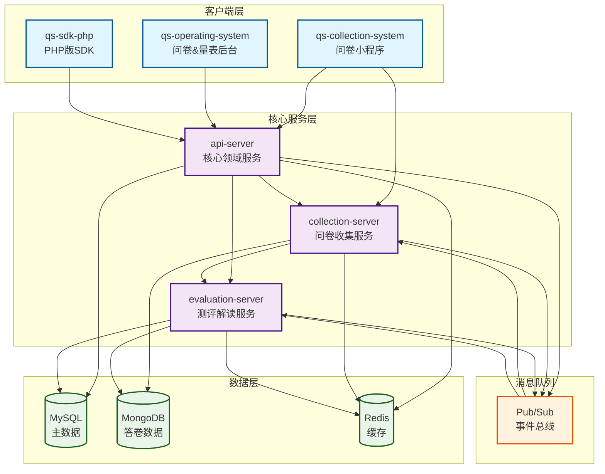
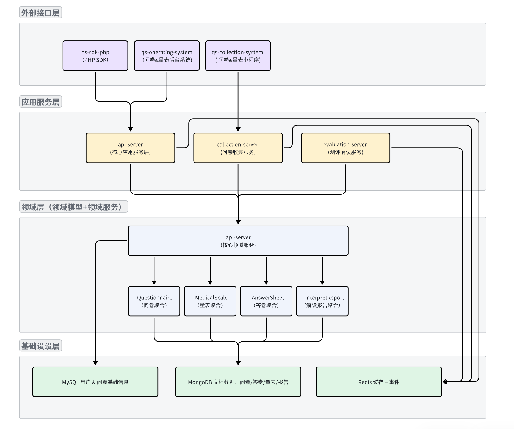

# questionnaire-scale 问卷收集&量表测评系统

questionnaire and scale system, 支持问卷收集、量表测评、数据分析、数据可视化等功能。

## 软件架构

### 系统架构


### 系统组件说明

序号|分类|组件|职责|承载功能
--|--|--|--|--
1|核心组件|api-server|核心领域服务|问卷聚合根、量表聚合根、答卷聚合根、解读报告聚合根
2|核心组件|collection-server|问卷收集服务|检验模块
3|核心组件|evaluation-server|测评解读服务|计算模块、解析模块
4|旁路组件|qs-collection-system|问卷小程序|问卷缓存预热、问卷缓存更新、答卷校验、答卷保存、答卷查看、解读报告查看
5|旁路组件|qs-operating-system|问卷&量表后台|问卷、量表、答卷、解读报告的后台编辑
6|旁路组件|qs-sdk-php|PHP版SDK|问卷、量表、答卷、解读报告的SDK

### 核心组件关系图



### 分层架构



#### 分层架构说明

层级|职责
--|--
外部接口层|接收用户请求（Web/SDK），通过 REST 接口发起操作
应用服务层|承接请求逻辑，完成缓存处理、调用领域服务、事件发布
领域服务层|承载领域聚合操作，定义系统核心行为和业务规则
领域模型层|按 DDD 聚合设计，定义问卷、量表、答卷、报告结构与行为，定义领域服务
存储与基础设施层|提供数据存储与缓存，支撑 Pub/Sub、Redis JSON、持久化等

### 模块设计

#### 聚合根模块（Persisted in MongoDB）

模块名|输入|输出|调用依赖
--|--|--|--
questionnaire|问卷结构、问题、选项表单|问卷文档|-
medical-scale|量表结构、因子设置|量表文档|-
answer-sheet|提交答卷（用户 ID、答案内容）|答卷文档|-questionnaire、-medical-scale
interpret-report|答卷、得分结果、解读规则|解读报告文档|-answer-sheet、-medical-scale

#### 无状态功能模块（Stateless）

模块名|输入|输出|调用依赖
--|--|--|--
validation|校验规则、提交数据|校验结果|-
calculation|运算规则、答题数据|答案得分、因子得分|-
evaluation|解读规则、得分数据|解读文案|-
scoring|解读文案|-|-

## 功能特性

### 核心功能

- **问卷管理**: 支持问卷的创建、编辑、发布、删除、版本控制等功能
- **量表测评**: 支持医学量表、心理量表等多种专业量表的创建和管理
- **答卷收集**: 支持多种题型的答卷收集，包括单选、多选、文本、数字等
- **数据校验**: 提供强大的数据校验功能，确保答卷数据的完整性和准确性
- **智能计算**: 支持复杂的分数计算和因子分析算法
- **解读报告**: 自动生成专业的解读报告，支持多种报告格式
- **数据可视化**: 提供丰富的数据分析和可视化功能

### 技术特性

- **高并发**: 支持高并发访问，采用异步处理和缓存优化
- **可扩展**: 微服务架构设计，支持水平扩展
- **高可用**: 多实例部署，故障自动恢复
- **数据安全**: 完善的数据加密和权限控制机制
- **监控告警**: 全面的系统监控和告警机制

## 快速开始

### 环境要求

- **Go**: 1.21+
- **MySQL**: 8.0+
- **MongoDB**: 5.0+
- **Redis**: 6.0+
- **Docker**: 20.10+ (可选)

### 安装部署

#### 1. 克隆项目

```bash
git clone https://github.com/yshujie/questionnaire-scale.git
cd questionnaire-scale
```

#### 2. 配置环境

```bash
# 复制配置文件
cp configs/env/config.env.example configs/env/config.env

# 编辑配置文件
vim configs/env/config.env
```

#### 3. 启动数据库

```bash
# 使用 Docker Compose 启动
docker-compose up -d mysql mongodb redis

# 或手动启动
# MySQL
mysql -u root -p < configs/mysql/questionnaire.sql

# MongoDB
mongod --config configs/mongodb/mongod.conf

# Redis
redis-server configs/redis/redis.conf
```

#### 4. 编译运行

```bash
# 编译所有服务
make build

# 启动 API Server
make run-apiserver

# 启动 Collection Server
make run-collection-server

# 启动 Evaluation Server
make run-evaluation-server
```

#### 5. 验证部署

```bash
# 检查 API Server 健康状态
curl http://localhost:8080/health

# 检查 Collection Server 健康状态
curl http://localhost:8081/health

# 检查 Evaluation Server 健康状态
curl http://localhost:8082/health
```

### 开发环境

#### 1. 安装依赖

```bash
# 安装 Go 依赖
go mod download

# 安装开发工具
go install github.com/cosmtrek/air@latest
```

#### 2. 启动开发模式

```bash
# API Server 热重载
make dev-apiserver

# Collection Server 热重载
make dev-collection-server

# Evaluation Server 热重载
make dev-evaluation-server
```

## API 文档

### 核心接口

#### 问卷管理

```http
# 创建问卷
POST /api/v1/questionnaires
Content-Type: application/json

{
  "code": "TEST_001",
  "title": "测试问卷",
  "description": "这是一个测试问卷",
  "questions": [
    {
      "code": "Q1",
      "title": "您的性别是？",
      "type": "Radio",
      "options": [
        {"code": "A", "content": "男", "score": 1},
        {"code": "B", "content": "女", "score": 2}
      ]
    }
  ]
}

# 获取问卷列表
GET /api/v1/questionnaires?page=1&pageSize=10

# 获取问卷详情
GET /api/v1/questionnaires/{code}

# 发布问卷
PUT /api/v1/questionnaires/{code}/publish
```

#### 答卷管理

```http
# 提交答卷
POST /api/v1/answersheets
Content-Type: application/json

{
  "questionnaireCode": "TEST_001",
  "questionnaireVersion": "1.0",
  "title": "测试答卷",
  "answers": [
    {
      "questionCode": "Q1",
      "value": "A"
    }
  ]
}

# 获取答卷列表
GET /api/v1/answersheets?page=1&pageSize=10

# 获取答卷详情
GET /api/v1/answersheets/{id}
```

#### 解读报告

```http
# 生成解读报告
POST /api/v1/interpret-reports
Content-Type: application/json

{
  "answersheetId": 123,
  "medicalScaleCode": "SCALE_001"
}

# 获取解读报告
GET /api/v1/interpret-reports/{id}
```

### 错误码说明

错误码 | 说明 | HTTP 状态码
--|--|--
10001 | 参数错误 | 400
10002 | 未授权访问 | 401
10003 | 禁止访问 | 403
10004 | 资源不存在 | 404
10005 | 服务器内部错误 | 500
20001 | 问卷不存在 | 404
20002 | 问卷已发布 | 400
20003 | 问题编码重复 | 400
30001 | 答卷不存在 | 404
30002 | 答卷数据无效 | 400
40001 | 解读报告不存在 | 404
40002 | 解读报告生成失败 | 500

## 开发指南

### 项目结构

```text
questionnaire-scale/
├── api/                    # API 定义
├── cmd/                    # 服务入口
│   ├── apiserver/         # API Server
│   ├── collection-server/ # Collection Server
│   └── evaluation-server/ # Evaluation Server
├── configs/               # 配置文件
├── docs/                  # 项目文档
├── internal/              # 内部包
│   ├── apiserver/        # API Server 实现
│   ├── collection-server/ # Collection Server 实现
│   └── evaluation-server/ # Evaluation Server 实现
├── pkg/                   # 公共包
├── scripts/               # 脚本文件
└── test/                  # 测试文件
```

### 开发规范

#### 代码规范

- 遵循 Go 官方代码规范
- 使用 `gofmt` 格式化代码
- 使用 `golint` 检查代码质量
- 使用 `go vet` 检查潜在问题

#### 提交规范

```bash
# 提交格式
<type>(<scope>): <subject>

# 示例
feat(questionnaire): 添加问卷创建功能
fix(validation): 修复数据校验bug
docs(readme): 更新项目文档
```

### 部署指南

#### Docker 部署

```bash
# 构建镜像
docker build -t questionnaire-scale:latest .

# 运行容器
docker run -d \
  --name questionnaire-scale \
  -p 8080:8080 \
  -p 8081:8081 \
  -p 8082:8082 \
  questionnaire-scale:latest
```

#### Kubernetes 部署

```yaml
# deployment.yaml
apiVersion: apps/v1
kind: Deployment
metadata:
  name: questionnaire-scale
spec:
  replicas: 3
  selector:
    matchLabels:
      app: questionnaire-scale
  template:
    metadata:
      labels:
        app: questionnaire-scale
    spec:
      containers:
      - name: questionnaire-scale
        image: questionnaire-scale:latest
        ports:
        - containerPort: 8080
        - containerPort: 8081
        - containerPort: 8082
```

## 监控运维

### 监控指标

#### 系统指标

- CPU 使用率
- 内存使用率
- 磁盘使用率
- 网络流量

#### 业务指标

- 问卷创建数量
- 答卷提交数量
- 解读报告生成数量
- API 响应时间
- 错误率

### 日志管理

#### 日志级别

- **DEBUG**: 调试信息
- **INFO**: 一般信息
- **WARN**: 警告信息
- **ERROR**: 错误信息
- **FATAL**: 致命错误

#### 日志格式

```json
{
  "timestamp": "2024-01-01T12:00:00Z",
  "level": "INFO",
  "service": "api-server",
  "message": "问卷创建成功",
  "request_id": "req-123",
  "user_id": "user-456"
}
```

### 告警配置

#### 告警规则

- CPU 使用率 > 80%
- 内存使用率 > 85%
- 磁盘使用率 > 90%
- API 错误率 > 5%
- 响应时间 > 2s

## 常见问题

### FAQ

**Q: 如何添加新的题型？**

A: 参考 `docs/apiserver/01-问卷&答卷的设计与实现.md` 中的扩展指南。

**Q: 如何优化系统性能？**

A: 可以通过以下方式优化：

- 增加缓存层
- 优化数据库查询
- 使用连接池
- 异步处理

**Q: 如何备份数据？**

A: 定期备份 MySQL 和 MongoDB 数据：

```bash
# MySQL 备份
mysqldump -u root -p questionnaire > backup.sql

# MongoDB 备份
mongodump --db questionnaire --out backup/
```

## 贡献指南

### 贡献流程

1. Fork 项目
2. 创建功能分支
3. 提交代码
4. 创建 Pull Request
5. 代码审查
6. 合并代码

### 贡献规范

- 遵循项目代码规范
- 添加必要的测试
- 更新相关文档
- 提供清晰的提交信息

## 许可证

本项目采用 MIT 许可证，详见 [LICENSE](LICENSE) 文件。

## 联系方式

- **项目地址**: https://github.com/yshujie/questionnaire-scale
- **问题反馈**: https://github.com/yshujie/questionnaire-scale/issues
- **邮箱**: yshujie@163.com

## 更新日志

### v1.0.0 (2024-01-01)

- 🎉 初始版本发布
- ✨ 支持问卷创建和管理
- ✨ 支持答卷收集和校验
- ✨ 支持解读报告生成
- ✨ 支持多种题型和答案类型
- 🐛 修复已知问题
- 📚 完善项目文档

---
