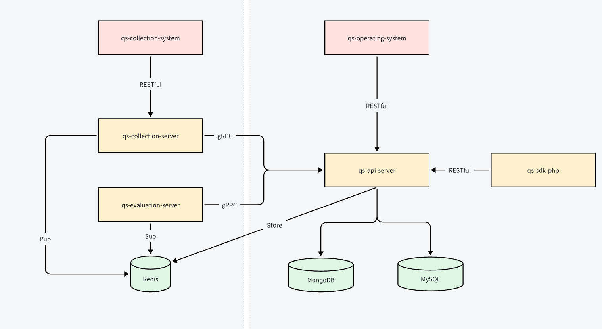

# questionnaire-scale 问卷收集&量表测评系统

questionnaire and scale system, 支持问卷收集、量表测评、数据分析、数据可视化等功能。

## 功能特性

- 问卷收集: 支持问卷的创建、编辑、发布、删除等功能
- 量表测评: 支持量表的创建、编辑、发布、删除等功能
- 解读报告: 支持解读报告的生成、查看、下载等功能

## 软件架构

### 系统架构

### 系统组件
| 序号 | 分类   | 组件                           | 职责                                                                                                                                                                                                                                                       | 接口形式                | 对外依赖                                             |
| -- | ---- | ---------------------------- | -------------------------------------------------------------------------------------------------------------------------------------------------------------------------------------------------------------------------------------------------------- | ------------------- | ------------------------------------------------ |
| 1  | 核心组件 | `qs-api-server`              | （核心领域服务） - 管理核心聚合根，实现聚合模块：   - 问卷（Questionnaire）   - 量表（MedicalScale）   - 答卷（AnswerSheet）   - 解读报告（InterpretReport） - 定义参与角色：   - Writer（填写人）   - Testee（受试者）   - Reader（阅读者） - 提供对运营系统的 RESTful API - 提供对其他服务的 gRPC 接口 | - RESTful - gRPC | - 统一用户服务（UserService） - 统一权限服务（AuthService）   |
| 2  |      | `qs-collection-server`       | （问卷收集服务） - 实现功能模块：校验（Validation） - 从 `qs-api-server` 拉取问卷并缓存至 RedisJSON - 提交答卷后向 Redis 发布“原始答卷保存”事件 - 提供小程序端 RESTful 接口：   - 查看问卷   - 提交答卷   - 查看原始问卷   - 查看解读报告                                                                 | - RESTful - gRPC | - `qs-api-server`（gRPC） - Redis（缓存 + Pub/Sub） |
| 3  |      | `qs-evaluation-server`       | （测评解读服务） - 实现功能模块：   - 分数计算（Scoring）   - 量表解析（Evaluation） - 订阅“原始答卷保存”事件，加载答卷、问卷、量表信息 - 执行 scoring 和 evaluation 模块，生成并保存解读报告                                                                                                              | - gRPC              | - `qs-api-server`（gRPC） - Redis（订阅）           |
| 4  |      | `qs-sdk-php`                 | （PHP 版 SDK） - 封装 `qs-api-server` 中部分功能供其他业务系统调用：   - 获取问卷 / 答卷 / 解读报告相关数据                                                                                                                                                                          | - gRPC              | - `qs-api-server`（gRPC）                          |
| 5  | 旁路组件 | `qs-collection-system`（小程序端） | - 接入统一用户服务：注册登录、孩子信息登记 - 接入 `qs-collection-server`：展示问卷、提交答卷、展示原始答卷与解读报告                                                                                                                                                                              | - RESTful           | - `qs-collection-server` - 统一用户系统             |
| 6  |      | `qs-operating-system`（后台）    | - 接入统一用户服务：登录鉴权 - 接入 `qs-api-server` 提供管理 UI：问卷量表管理、答卷与报告查看                                                                                                                                                                                           | - RESTful           | - `qs-api-server` - 统一用户系统                    |

--- 

### 功能模块

| 序号 | 分类   | 模块名                | 职责                                                | 是否聚合根？ | 是否状态存储？    |
| -- | ---- | ------------------ | ------------------------------------------------- | ------ | ---------- |
| 1  | 聚合模块 | `questionnaire`    | 问卷聚合建模： - 包含：问卷、问题、选项 - 负责：问卷、问题题型组织、问题选项   | ✅ 是    | ✅ 是（Mongo） |
| 2  | 聚合模块 | `medical-scale`    | 量表聚合建模： - 包含：医学量表、因子 - 负责：量表、因子配置           | ✅ 是    | ✅ 是（Mongo） |
| 3  | 聚合模块 | `answer-sheet`     | 答卷聚合建模： - 包含：答卷、答案 - 负责：答卷、答案题型组织           | ✅ 是    | ✅ 是（Mongo） |
| 4  | 聚合模块 | `interpret-report` | 解读聚合建模： - 包含：解读报告、解读项 - 负责：解读报告、解读项         | ✅ 是    | ✅ 是（Mongo） |
| 5  | 功能模块 | `validation`       | 校验功能模块： - 包含：校验规则、校验数据 - 负责：根据规则与数据返回校验结果   | ❌ 否    | ❌ 无状态      |
| 6  | 功能模块 | `scoring`          | 计算功能模块： - 包含：运算规则、运算数据 - 负责：根据运算规则与数据计算得分   | ❌ 否    | ❌ 无状态      |
| 7  | 功能模块 | `evaluation`       | 解析功能模块： - 包含：解读规则、解读数据 - 负责：根据解读规则与数据生成解读文案 | ❌ 否    | ❌ 无状态      |

--- 

### 数据库
| 数据库     | 功能说明                                                                |
| ------- | ------------------------------------------------------------------- |
| MySQL   | 持久化存储信息： - 用户信息：User，Child，WxAccount 等 - 问卷基础信息               |
| MongoDB | 持久化存储文档数据： - 问卷文档 - 答卷文档 - 解读报告                            |
| Redis   | 缓存数据库： - 通过 RedisJSON 缓存问卷信息 - 使用 Pub/Sub 实现 “原始答卷保存” 的发布订阅模型 |

## 快速开始

### 依赖检查

### 构建

### 运行

## 使用指南

## 如何贡献

## 关于作者

## 谁在用

## 许可证
