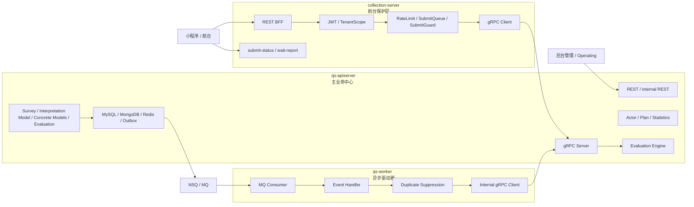
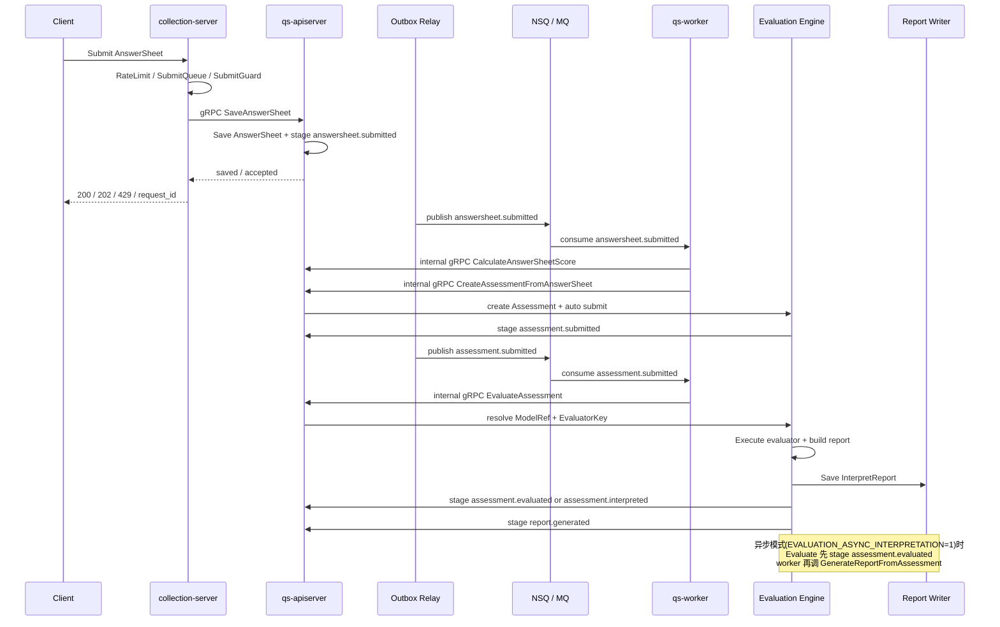
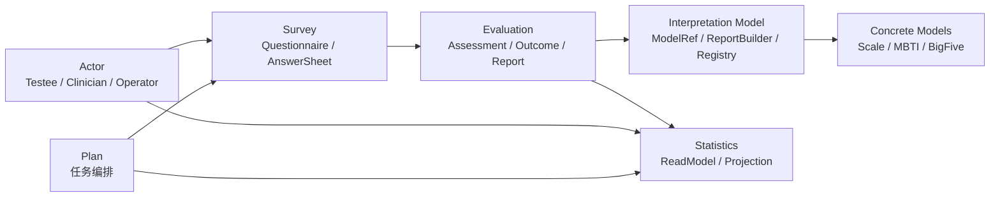

# qs-server

> **qs-server 是一个面向心理、医学和人格测评场景的 Go 后端系统。它不是普通问卷 CRUD，而是一个多测评模型平台：Survey 负责作答事实，Assessment Model 定义统一模型资产与接入协议，Scale / Personality Typology 等具体模型家族负责规则表达，Evaluation 作为通用测评执行引擎按 EvaluatorKey 路由执行，并产出 AssessmentOutcome 与 InterpretReport。**

[](https://go.dev/)
[](LICENSE)

---

## 1. 项目定位

`qs-server` 面向心理、医学和人格测评场景。

它要解决的不是：

```text
创建问卷
提交答案
保存结果
```

而是：

```text
答卷可靠提交
  -> 测评执行可追踪
  -> 解释模型可扩展
  -> 报告生成可恢复
  -> 统计查询可治理
  -> 权限边界可审计
```

新版业务主线是：

```text
Survey
    管“用户填了什么”

Assessment Model
    管“测评模型资产与统一接入协议”

Concrete Model Families
    管“具体规则是什么”
    例如 Scale / Personality Typology / BigFive

Evaluation
    管“这一次测评如何执行、失败、重试和生成报告”

Report
    管“如何把 AssessmentOutcome 投影为可读的 InterpretReport”
```

运行时上，系统采用三进程协作：

```text
collection-server：前台 BFF 与提交保护层
qs-apiserver：主业务中心与领域事实源入口
qs-worker：事件消费者与异步测评执行驱动器
```

准确说，它不是完整微服务架构，而是：

```text
以 qs-apiserver 为主业务中心的三进程协作架构
```

---

## 2. 核心能力

| 能力 | 说明 |
| ---- | ---- |
| Survey 作答事实 | 管理 Questionnaire，接收 AnswerSheet，完成答案校验与答卷持久化 |
| Assessment Model 模型资产 | 通过 Kind / SubKind / Algorithm、PublishedModelSnapshot 与 QuestionnaireBinding 管理测评模型资产 |
| Concrete Model Families 具体规则 | Scale、Personality Typology（MBTI/SBTI）、BigFive 等模型家族各自维护规则资产 |
| Evaluation 通用执行引擎 | 管理 Assessment、EvaluatorKey 路由、AssessmentOutcome、InterpretReport 和失败重试 |
| 异步测评执行 | 答卷提交后通过 Outbox、MQ、worker、internal gRPC 推进 Assessment、Interpretation、Report |
| 事件与 Outbox | 关键事件通过 Outbox 可靠出站，再进入 MQ 驱动 worker |
| 前台保护层 | collection-server 提供 RateLimit、SubmitQueue、SubmitGuard、submit-status、wait-report |
| 高并发治理 | RateLimit、Queue、Backpressure、LockLease、幂等、重复抑制和统一观测 |
| 统计读侧聚合 | Statistics ReadService、BehaviorProjector、SyncService、QueryCache、Hotset |
| IAM 安全接入 | 通过 IAMModule 接入 TokenVerifier、AuthzSnapshot、CapabilityDecision、ServiceAuth、Guardianship |
| 运维观测 | healthz、metrics、pprof、governance status、docs/contract 校验入口 |

---

## 3. 系统架构

### 3.1 三进程架构


```mermaid
flowchart LR
    Client["小程序 / 前台"]
    Admin["后台管理 / Operating"]
    MQ["NSQ / MQ"]

    subgraph Collection["collection-server<br/>前台保护层"]
        C1["REST BFF"]
        C2["JWT / TenantScope"]
        C3["RateLimit / SubmitQueue / SubmitGuard"]
        C4["submit-status / wait-report"]
        C5["gRPC Client"]
    end

    subgraph API["qs-apiserver<br/>主业务中心"]
        A1["REST / internal REST"]
        A2["gRPC Server"]
        A3["Survey / Interpretation Model / Concrete Models / Evaluation"]
        A4["Actor / Plan / Statistics"]
        A5["MySQL / MongoDB / Redis / Outbox"]
        A6["Evaluation Engine"]
    end

    subgraph Worker["qs-worker<br/>异步驱动器"]
        W1["MQ Consumer"]
        W2["Event Handler"]
        W3["Duplicate Suppression"]
        W4["Internal gRPC Client"]
    end

    Client --> C1 --> C2 --> C3 --> C5 --> A2
    Client --> C4
    Admin --> A1
    A3 --> A5 --> MQ
    MQ --> W1 --> W2 --> W3 --> W4 --> A2
    A2 --> A6
```

### 3.2 进程职责

| 进程 | 职责 | 不负责 |
| ---- | ---- | ------ |
| `collection-server` | 前台 REST BFF、身份投影、监护关系校验、限流、SubmitQueue、SubmitGuard、状态查询、gRPC 转发 | 不直接写主业务数据库，不拥有 Survey/Evaluation 聚合，不执行 Provider |
| `qs-apiserver` | 主业务事实、领域模型、REST/gRPC、MySQL/Mongo 持久化、Outbox、调度任务、安全控制面、Evaluation Engine | 不直接承接所有前台高峰，不消费业务 MQ |
| `qs-worker` | 订阅 MQ、分发事件、Ack/Nack、通过 internal gRPC 推进异步测评执行 | 不直接写主业务表，不拥有业务状态机，不直接生成报告事实 |

---

## 4. 核心链路：从答卷到报告


```mermaid
sequenceDiagram
    participant Client as Client
    participant Collection as collection-server
    participant API as qs-apiserver
    participant Outbox as Outbox Relay
    participant MQ as NSQ / MQ
    participant Worker as qs-worker
    participant Eval as Evaluation Engine
    participant Report as Report Writer

    Client->>Collection: Submit AnswerSheet
    Collection->>Collection: RateLimit / SubmitQueue / SubmitGuard
    Collection->>API: gRPC SaveAnswerSheet
    API->>API: Save AnswerSheet + stage answersheet.submitted
    API-->>Collection: saved / accepted
    Collection-->>Client: 200 / 202 / 429 / request_id

    Outbox->>MQ: publish answersheet.submitted
    MQ->>Worker: consume answersheet.submitted
    Worker->>API: internal gRPC CalculateAnswerSheetScore
    Worker->>API: internal gRPC CreateAssessmentFromAnswerSheet
    API->>Eval: create Assessment + auto submit
    Eval->>API: stage assessment.submitted

    Outbox->>MQ: publish assessment.submitted
    MQ->>Worker: consume assessment.submitted
    Worker->>API: internal gRPC EvaluateAssessment
    API->>Eval: resolve ModelRef + EvaluatorKey
    Eval->>Eval: Execute evaluator + build report
    Eval->>Report: Save InterpretReport
    Eval->>API: stage assessment.evaluated or assessment.interpreted
    Eval->>API: stage report.generated

    Note over Eval,Report: 异步模式(EVALUATION_ASYNC_INTERPRETATION=1)时<br/>Evaluate 先 stage assessment.evaluated<br/>worker 再调 GenerateReportFromAssessment
```

这条链路的设计原则：

```text
同步保存 AnswerSheet 作答事实
异步推进 Assessment / Evaluation / Report
Outbox 保证关键事件可靠出站
Worker 只做异步驱动
apiserver 保持主业务状态机和持久化边界
Evaluation Engine 通过 ModelRef / EvaluatorKey / InputResolver 支撑多模型扩展
```

---

## 5. 领域边界


```mermaid
flowchart LR
    Actor["Actor<br/>Testee / Clinician / Operator"]
    Plan["Plan<br/>任务编排"]
    Survey["Survey<br/>Questionnaire / AnswerSheet"]
    IM["Interpretation Model<br/>ModelRef / ReportBuilder / Registry"]
    Models["Concrete Models<br/>Scale / MBTI / BigFive"]
    Evaluation["Evaluation<br/>Assessment / Outcome / Report"]
    Statistics["Statistics<br/>ReadModel / Projection"]

    Actor --> Survey
    Plan --> Survey
    Survey --> Evaluation
    Evaluation --> IM
    IM --> Models
    Evaluation --> Statistics
    Actor --> Statistics
    Plan --> Statistics
```

| 限界上下文 | 负责 |
| ---------- | ---- |
| `Survey` | 问卷模板、题目、选项、提交规格、答案校验、答卷提交、答卷事件 |
| `Interpretation Model` | ModelRef、ReportBuilder、Registry；报告投影与持久化 |
| `Concrete Models` | Scale、MBTI、BigFive 等具体解释模型的规则资产和发布版本 |
| `Evaluation` | Assessment 状态机、Evaluator 路由、AssessmentOutcome、InterpretReport、失败重试、测评事件 |
| `Actor` | 受试者、医生、操作员、入口、IAM 关系投影 |
| `Plan` | 测评计划、任务状态机、调度与通知事件 |
| `Statistics` | 读侧统计聚合、行为投影、同步重建、查询缓存 |

关键边界：

```text
AnswerSheet 是用户提交的作答事实；
Assessment 是系统基于 AnswerSheet 和 ModelRef 创建的一次测评执行实例；
AssessmentOutcome 是 Evaluator 执行后的结构化结果；
InterpretReport 是最终可交付的报告事实。
```

---

## 6. 事件系统与 Outbox

qs-server 使用事件系统串联异步主链路。

```text
EventCatalog 管契约
RoutingPublisher 管路由
Outbox 管可靠出站
NSQ/MQ 管消息投递
Worker 管消费处理
业务状态机管幂等
```

新版主事件链路（以 `configs/events.yaml` 为准）：

```text
answersheet.submitted
  -> assessment.submitted
  -> assessment.evaluated（异步解读阶段，可选）
  -> assessment.interpreted / assessment.failed
  -> report.generated
```

历史/目标事件名（演进文档中可能出现，**当前代码未使用**）：

| 历史/目标名 | 当前正式事件 |
| ----------- | ------------ |
| `assessment.created` | `assessment.submitted` |
| `assessment.completed` | （无独立事件） |
| `interpretation.completed` | `assessment.interpreted` |
| `interpretation.failed` | `assessment.failed` |

关键边界：

- MQ 负责消息传输。
- Outbox 负责业务数据库与消息出站之间的一致性。
- Worker 消费不承诺 exactly-once，业务侧必须幂等。
- `configs/events.yaml` 是事件类型、topic、delivery class 和 handler 的契约入口。
- `scale.changed` / `questionnaire.changed` 是模型/问卷资产变化事件，不等于某次 Assessment 的执行完成。
- `assessment.interpreted` 表示解读完成且 outcome 已投影；`report.generated` 表示报告已持久化。

---

## 7. 高并发治理

qs-server 的高并发治理不是一个单独限流器，而是分层保护链：

```text
RateLimit
  -> SubmitQueue
  -> SubmitGuard
  -> gRPC max-inflight
  -> Backpressure
  -> LockLease
  -> Worker concurrency
  -> 状态机 / 唯一约束
  -> Metrics / Governance
```

| 层 | 目标 |
| -- | ---- |
| Entry Protection | 在入口挡住突发请求，返回明确 429 / Retry-After |
| SubmitQueue | 把答卷提交削峰为 collection-server 本进程有界异步队列 |
| SubmitGuard | 通过 done marker + in-flight lock 抑制重复提交 |
| gRPC max-inflight | 控制 collection 到 apiserver 的跨进程并发 |
| Backpressure | 限制 MySQL/Mongo/IAM 等下游 in-flight 操作 |
| LockLease | 跨实例短期互斥、选主、重复抑制 |
| Worker concurrency | 控制 MQ 消费并发，避免积压恢复时打穿 apiserver |
| Observability | 用 resilience metrics 和 governance status 解释保护决策 |

边界说明：

```text
SubmitQueue 不是 MQ；
LockLease 不保证 exactly-once；
Backpressure 不是慢 SQL 优化；
Worker concurrency 不替代业务状态机；
没有压测报告前，不承诺固定 QPS。
```

---

## 8. IAM 与安全控制面

qs-server 不重新实现完整 IAM，而是通过 `IAMModule` 接入 IAM 项目的 SDK 能力。

安全链路核心概念：

```text
JWT / Service Token
  -> Principal
  -> TenantScope
  -> Actor Projection
  -> AuthzSnapshot
  -> CapabilityDecision
  -> Business Handler
```

| 概念 | 说明 |
| ---- | ---- |
| `Principal` | 当前调用者是谁 |
| `TenantScope` | 当前调用发生在哪个 tenant/org 范围 |
| `Actor Projection` | 调用者在测评业务中扮演什么角色 |
| `AuthzSnapshot` | IAM 在当前 domain 下的授权快照 |
| `CapabilityDecision` | qs-server 对业务能力的判断结果 |
| `ServiceIdentity` | 服务间调用身份，来自 service auth / mTLS |
| `OperatorRoleProjection` | IAM roles 的本地投影，不作为权限真值 |

关键原则：

```text
JWT 负责认证，AuthzSnapshot 负责授权；
不要直接用 JWT roles 作为业务权限真值；
能管理解释模型规则，不等于能查看用户测评报告；
ServiceAuth 证明哪个服务在调用，不替代用户授权。
```

---

## 9. 仓库结构

```text
qs-server/
├── api/
│   └── rest/                           # OpenAPI 契约：apiserver / collection
├── cmd/
│   ├── qs-apiserver/                   # 主业务服务入口
│   ├── collection-server/              # 前台 BFF 服务入口
│   ├── qs-worker/                      # 异步 worker 入口
│   └── tools/
├── configs/                            # 进程配置、events.yaml 等
├── docs/                               # 设计、接口、运维、宣讲文档
├── internal/
│   ├── apiserver/                      # apiserver domain/application/infra/transport/container
│   ├── collection-server/              # collection-server BFF / protection / grpc client
│   ├── worker/                         # worker handlers / messaging / grpc client
│   └── pkg/                            # 共享基础设施：grpc、middleware、event、resilience、security 等
├── pkg/                                # 可复用公共包
├── scripts/                            # 质量、文档、部署脚本
├── build/docker/                       # Docker Compose 与部署相关文件
├── web/                                # 前端相关目录
├── Makefile
└── go.mod
```

---

## 10. 快速开始

### 10.1 前置依赖

- Go：见 [go.mod](go.mod) 与 [Makefile](Makefile) 中版本约定。
- MySQL。
- MongoDB。
- Redis。
- NSQ / MQ。
- 可选：Docker / Docker Compose。

检查基础设施：

```bash
make check-infra
make check-mysql
make check-redis
make check-mongodb
make check-nsq
```

### 10.2 构建

```bash
git clone https://github.com/FangcunMount/qs-server.git
cd qs-server

make build
# 或单独构建
make build-apiserver
make build-collection
make build-worker
```

### 10.3 本地运行

默认 `ENV=dev`：

```bash
make run-apiserver
make run-collection
make run-worker

# 或全部启动
make run-all
```

默认开发端口：

| 服务 | 端口 |
| ---- | ---- |
| qs-apiserver | `18082` |
| collection-server | `18083` |
| qs-worker | 无业务 HTTP 端口 |

健康检查：

```bash
curl -sS http://127.0.0.1:18082/healthz
curl -sS http://127.0.0.1:18083/healthz
make health-check
```

停止服务：

```bash
make stop-all
```

查看状态：

```bash
make status-all
```

查看日志：

```bash
make logs-all
```

---

## 11. 配置与接口

### 11.1 配置入口

| 类型 | 路径 |
| ---- | ---- |
| apiserver 配置 | `configs/apiserver.*.yaml` |
| collection 配置 | `configs/collection-server.*.yaml` |
| worker 配置 | `configs/worker.*.yaml` |
| 事件契约 | `configs/events.yaml` |
| Docker Compose | `build/docker/` |

### 11.2 REST 契约

| 服务 | OpenAPI |
| ---- | ------- |
| apiserver | [api/rest/apiserver.yaml](api/rest/apiserver.yaml) |
| collection | [api/rest/collection.yaml](api/rest/collection.yaml) |

生成并校验 REST 文档：

```bash
make docs-rest
make docs-verify
```

### 11.3 gRPC 契约

gRPC proto 位于：

```text
api/grpc/gen/
```

gRPC 服务由 apiserver 暴露，collection-server 和 qs-worker 作为 client 调用 apiserver。

---

## 12. 文档地图

| 目录 | 说明 |
| ---- | ---- |
| [docs/00-总览](docs/00-总览/) | 系统全局地图、代码组织、核心链路 |
| [docs/01-运行时](docs/01-运行时/) | 三进程运行时、进程间调用、服务生命周期 |
| [docs/02-业务模块](docs/02-业务模块/) | Survey、Interpretation Model、Scale、Evaluation、Actor、Plan、Statistics |
| [docs/03-基础设施](docs/03-基础设施/) | Event、DataAccess、Redis、Resilience、Security、Integrations、Runtime、Observability |
| [docs/04-接口与运维](docs/04-接口与运维/) | REST/gRPC、配置、部署、调度、健康检查、排障、容量 |
| [docs/05-专题分析](docs/05-专题分析/) | 架构决策解释：为什么这样拆、为什么这样异步、为什么用 Outbox |
| [docs/06-宣讲](docs/06-宣讲/) | 技术分享、面试表达、架构图素材、追问证据索引 |

推荐阅读：

```text
先读 docs/06-宣讲/00-项目一句话定位.md
再读 docs/05-专题分析/README.md
再读 docs/04-接口与运维/README.md
最后按需要深入 docs/02-业务模块 和 docs/03-基础设施
```

---

## 13. 工程质量

Makefile 提供统一质量入口：

```bash
make test              # go test ./...
make test-unit
make test-coverage
make test-race
make test-bench

make lint
make fmt-check

make security-govulncheck
make security-gosec
```

文档与契约校验：

```bash
make docs-swagger      # 生成 swagger
make docs-rest         # 生成 api/rest OpenAPI 摘要
make docs-hygiene      # 检查 docs 链接、锚点、章节编号
make docs-verify       # REST 契约与文档卫生组合校验
```

质量原则：

```text
代码能测
契约能比
文档能校验
架构结论能回链证据
```

---

## 14. 当前边界与谨慎表述

可以明确说：

- 系统采用三进程协作。
- Survey、Interpretation Model、Concrete Models、Evaluation 是新版核心业务边界。
- 主链路采用同步提交 AnswerSheet、异步推进 Assessment / Interpretation / Report。
- 关键事件通过 Outbox 可靠出站。
- collection-server 承担前台保护层。
- Resilience / Redis / Security / Statistics 都有基础设施文档和实现支撑。
- IAM 通过 IAMModule 嵌入，业务授权基于 AuthzSnapshot 和 CapabilityDecision。

需要谨慎说：

| 能力 | 准确表述 |
| ---- | -------- |
| exactly-once | 不承诺；当前是至少一次投递 + 业务幂等 |
| 所有事件 Outbox | 主链路关键事件 outbox 化，best_effort 事件仍存在 |
| 完整 ACL | 有 service identity / mTLS / ACL seam，完整策略仍需完善 |
| 固定 QPS | 没有压测报告前不承诺固定数字 |
| 微服务 | 当前更准确是三进程协作，不是完整微服务 |
| MBTI/SBTI/BigFive 人格模型 | 已通过 configured typology runtime 接入主链路；legacy adapter 仅作表征测试 |
| EvaluationRun | 演进方向，当前代码未实现执行尝试记录 |
| Provider(LoadContext+Evaluate) 统一契约 | 演进方向；当前实现为 Evaluator.Execute + InputResolver.Resolve + ReportBuilder.Build |
| behavior/cognitive/custom 模型族 | 仅 domain enum 与 UI 占位，runtime 未 materialize |
| AI 解读 | 未来增强方向，不是当前基础报告主链路 |

---

## 15. 常用命令速查

```bash
# 查看帮助
make help

# 构建
make build
make build-apiserver
make build-collection
make build-worker

# 运行
make run-all
make stop-all
make restart-all
make status-all
make logs-all

# 健康检查
make health-check

# 基础设施检查
make check-infra

# 测试与质量
make test
make test-unit
make test-coverage
make test-race
make lint
make security

# 文档与接口契约
make docs-rest
make docs-hygiene
make docs-verify
```

---

## 16. 贡献指南

1. 提交 issue 前请先确认问题属于业务模块、基础设施、接口运维还是文档。
2. 修改代码时，请同步更新相关文档和 Verify 命令。
3. 修改 REST 接口时，请同步运行：

```bash
make docs-rest
make docs-verify
```

4. 修改文档时，请运行：

```bash
make docs-hygiene
git diff --check
```

5. 推荐提交信息格式：

```text
feat(survey): add questionnaire version transition
fix(evaluation): handle report generation failure
docs(readme): update multi-interpretation model positioning
test(outbox): cover failed relay retry
```

---

## 17. 许可证

本项目基于 [MIT License](LICENSE) 发布。

---

## 18. 维护者

本项目由 [FangcunMount](https://github.com/FangcunMount) 组织维护。
