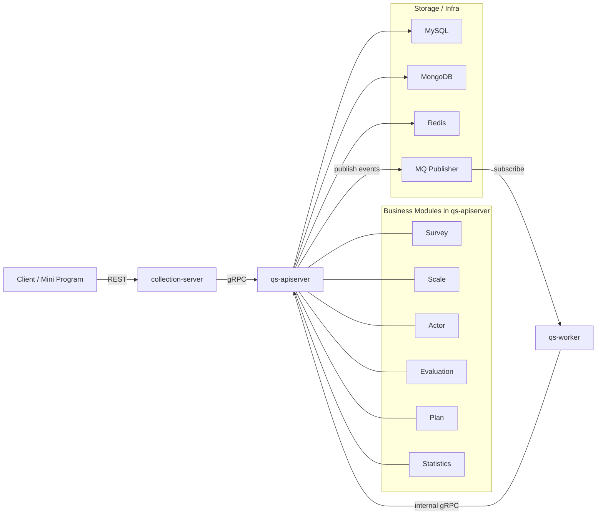

# 系统地图

本文档回答三个问题：系统由哪些进程组成，这些进程如何协作，主业务能力落在哪个进程里。

## 30 秒了解系统

`qs-server` 当前由 3 个核心进程组成：

- `qs-apiserver`：主业务服务，负责 REST/gRPC 接口、领域模块装配、数据持久化、事件发布
- `collection-server`：前台 BFF，面向小程序和收集端，负责轻量查询、提交、监护关系校验和请求排队
- `qs-worker`：异步处理服务，消费领域事件并调用 `apiserver` 的内部 gRPC 完成评估、统计同步、打标签

代码入口：

- [cmd/qs-apiserver/apiserver.go](../../cmd/qs-apiserver/apiserver.go)
- [cmd/collection-server/main.go](../../cmd/collection-server/main.go)
- [cmd/qs-worker/main.go](../../cmd/qs-worker/main.go)

## 核心架构

## 核心设计原则

- 主业务集中在 `apiserver`，其他两个进程都是围绕它展开。
- 同步入口和异步处理分离，前台请求尽量短链路返回，重任务由事件和 `worker` 承担。
- 业务能力按模块装配，而不是按进程重复实现。
- 文档和架构认知以代码为准，不再把历史规划稿当成现状。

## 系统最核心的是什么

如果只用一句话概括，`qs-server` 的核心不是“做问卷”，而是：

`把一次问卷作答，稳定地变成一次可解释、可查询、可追踪的量表评估结果。`

围绕这件事，系统的核心可以分成三层。

### 1. 业务本体：survey / scale / evaluation 的三段式分离

这是系统最根本的业务设计：

- `survey` 负责采集事实
  - 管理问卷结构、题型扩展、答案校验和答卷提交
- `scale` 负责定义规则
  - 管理因子、计分策略、解读规则和量表生命周期
- `evaluation` 负责产出结果
  - 把答卷事实和量表规则组合成测评、得分、风险等级和报告

这层分离的价值是：

- 问卷采集不会和量表规则耦死
- 量表规则可以复用到很多次测评
- 评估流程可以独立演进，而不必回头污染问卷和量表模型

如果没有这层分离，系统就只是“问卷系统”；有了这层分离，系统才是“测评系统”。

### 2. 运行时主链路：同步提交，异步评估

这是系统最关键的运行时设计。当前真实主链路是：

`collection-server -> apiserver -> MQ -> worker -> internal gRPC -> evaluation engine`

这条链路的目标很明确：

- 前台提交要尽快返回，不能被后台评估拖慢
- 后台评估又必须稳定推进，不能因为入口尖峰而丢任务或阻塞主服务

因此系统把这些能力放进了同一条生产线：

- `collection-server` 负责认证前置、监护关系校验、限流和短时排队
- `apiserver` 负责保存主业务状态并发布领域事件
- `worker` 负责消费事件并回调内部 gRPC 推进异步动作
- `evaluation engine` 负责按流水线执行校验、计分、风险判断、解读和事件发布

这条异步主链路，决定了系统为什么能既做前台收集，又做后台测评。

### 3. 保护层与读侧层：限流、排队、背压、缓存、统计预聚合

这层不是业务本体，但它决定了系统能不能在高并发和高读压下稳定运行。

它当前包含几类关键能力：

- 入口限流
  - 保护前台和后台高频接口
- 提交排队
  - 吸收答卷提交的短时尖峰
- 下游背压
  - 保护 `MySQL / MongoDB / IAM` 这类慢依赖
- 查询缓存
  - 保护问卷、量表、测评详情、受试者、计划等热点读
- 统计预聚合
  - 让统计查询不必每次都回扫明细表

这层的意义不是替代主业务，而是保护主业务主链路，让系统在真实流量下还能保持可用、可扩展和可观测。

## 真实模块分布

主业务模块都装配在 `apiserver` 容器里，而不是分散在三个进程中：

- `survey`
- `scale`
- `actor`
- `evaluation`
- `plan`
- `statistics`

装配入口：

- [internal/apiserver/container/container.go](../../internal/apiserver/container/container.go)
- [internal/apiserver/container/assembler/survey.go](../../internal/apiserver/container/assembler/survey.go)
- [internal/apiserver/container/assembler/scale.go](../../internal/apiserver/container/assembler/scale.go)
- [internal/apiserver/container/assembler/actor.go](../../internal/apiserver/container/assembler/actor.go)
- [internal/apiserver/container/assembler/evaluation.go](../../internal/apiserver/container/assembler/evaluation.go)
- [internal/apiserver/container/assembler/plan.go](../../internal/apiserver/container/assembler/plan.go)
- [internal/apiserver/container/assembler/statistics.go](../../internal/apiserver/container/assembler/statistics.go)

`collection-server` 和 `worker` 都是围绕 `apiserver` 展开的运行时组件：

- `collection-server` 通过 gRPC 复用 `apiserver` 的读写能力，见 [internal/collection-server/grpc_client_registry.go](../../internal/collection-server/grpc_client_registry.go)
- `worker` 通过事件订阅加内部 gRPC 调用驱动后台流程，见 [internal/worker/application/event_dispatcher.go](../../internal/worker/application/event_dispatcher.go)

## 边界与注意事项

- 当前代码里没有独立装配的 `screening` 模块，相关旧文档应视为历史设计，不应当作现状。
- `collection-server` 不是第二套业务服务，它主要做 BFF 适配和访问控制前置。
- `worker` 不直接持有领域模型写逻辑，真正的业务写入仍然回到 `apiserver` 内部服务完成。
