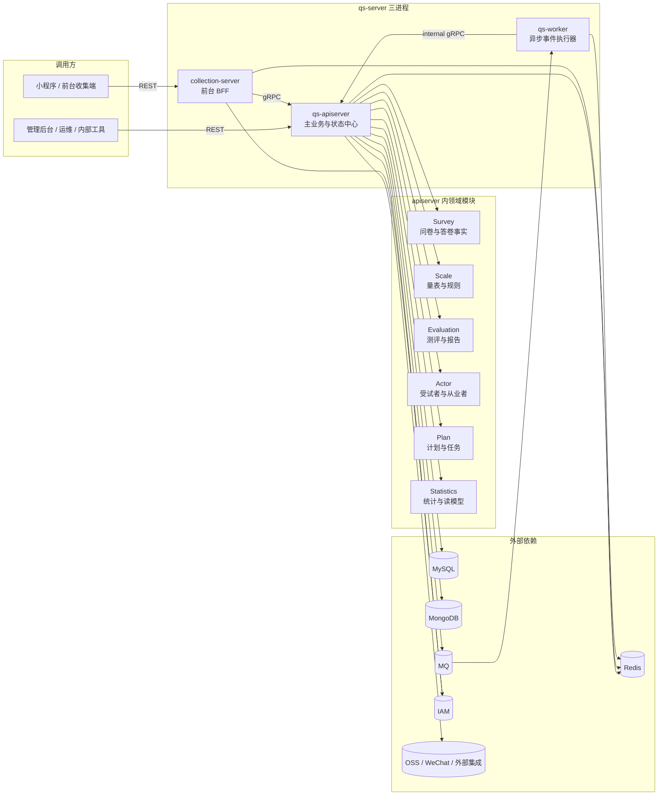
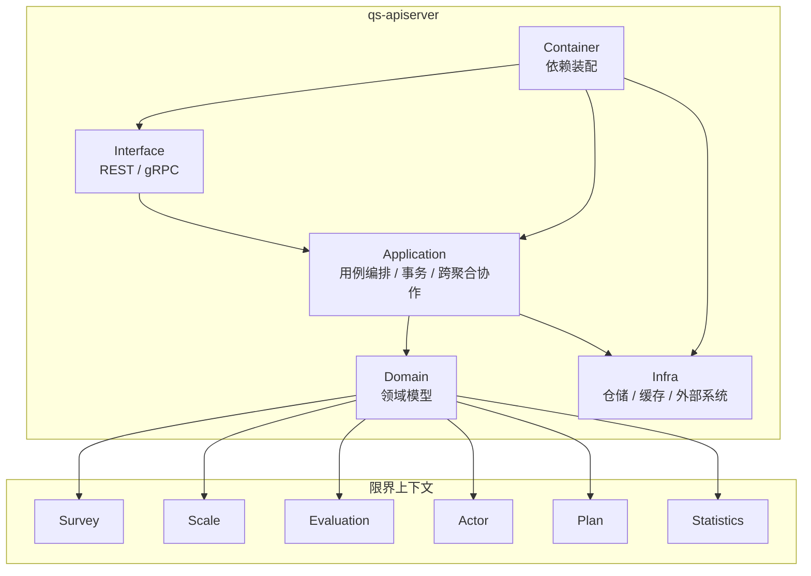
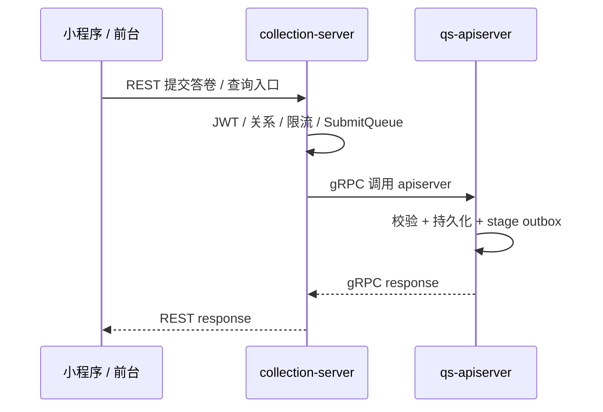
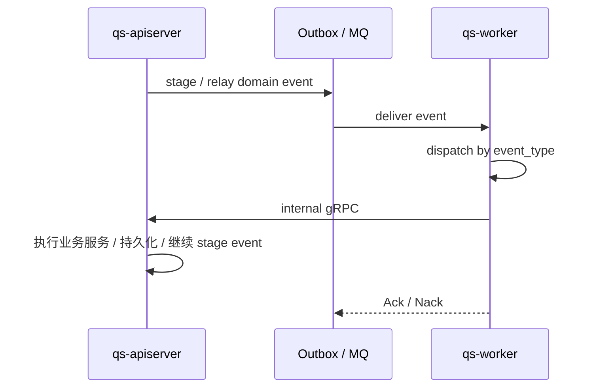

# 系统地图

**本文回答**：`qs-server` 运行时由哪些进程组成、主业务能力分别落在哪里、三进程如何协作、领域模块如何分布，以及读者在理解系统全貌后应该继续进入哪一层文档。本文只建立全局坐标系，不替代业务模块、基础设施、接口契约和运维文档。

> 放置位置建议：`docs/00-总览/01-系统地图.md`。本文中的相对路径按该位置编写。

---

## 30 秒结论

| 维度 | 结论 |
| ---- | ---- |
| 系统定位 | `qs-server` 是问卷与量表测评后端：负责前台答卷收集、异步测评、报告生成、统计聚合和计划任务推进 |
| 运行时形态 | 三进程协作：`qs-apiserver`、`collection-server`、`qs-worker` |
| 主状态归属 | 主业务写模型、领域对象、持久化和事件发布收口在 `qs-apiserver` |
| 前台入口 | `collection-server` 是面向小程序 / 收集端的 BFF，负责 REST 接入、身份与入口治理，再通过 gRPC 调用 `qs-apiserver` |
| 异步入口 | `qs-worker` 消费 MQ 事件，再通过 internal gRPC 回调 `qs-apiserver`，不维护第二套主业务模型 |
| 领域模块 | `survey / scale / evaluation / actor / plan / statistics` 六个限界上下文主要装配在 `qs-apiserver` 内 |
| 事件真值 | 事件类型、Topic、delivery 与 handler 绑定以 `configs/events.yaml` 为准 |
| IAM 定位 | IAM 以 SDK / 外部服务能力嵌入 apiserver 与 collection，不是 qs-server 的第四个本地进程 |
| 继续阅读 | 运行时细节看 `01-运行时`，业务对象看 `02-业务模块`，事件 / 存储 / 安全 / Redis 看 `03-基础设施`，接口与部署看 `04-接口与运维` |

一句话概括：**qs-server 把一次问卷作答，稳定地转化为可解释、可追踪、可查询的量表测评结果。**

---

## 1. 先看全局图

这张图是阅读 qs-server 的第一坐标系。它不是部署拓扑图，而是**运行时职责图**：谁接请求、谁持有主状态、谁消费事件、谁连接外部依赖。



读图时先抓三件事：

1. **主业务状态在 apiserver**：领域对象、仓储实现、事件发布和后台调度都以 apiserver 为中心。
2. **collection 是入口保护层，不是第二个业务主服务**：它负责前台 REST、身份前置、提交削峰、gRPC 转调。
3. **worker 是异步执行器，不是另一个领域服务**：它消费事件、做 handler 分发、拿锁 / 重试，再通过 internal gRPC 回到 apiserver 推进业务。

---

## 2. 三个进程分别是什么

### 2.1 qs-apiserver：主业务与状态中心

`qs-apiserver` 是系统的组合根和业务事实中心。它负责装配领域模块、提供 REST / gRPC、连接 MySQL / MongoDB / Redis、发布领域事件、启动 outbox relay 和调度任务。

| 方面 | 内容 |
| ---- | ---- |
| 入口 | `cmd/qs-apiserver/apiserver.go` |
| 启动 | `internal/apiserver/app.go`、`internal/apiserver/run.go`、`internal/apiserver/process/` |
| 组合根 | `internal/apiserver/container/` |
| 领域模型 | `internal/apiserver/domain/` |
| 应用服务 | `internal/apiserver/application/` |
| 基础设施 | `internal/apiserver/infra/` |
| 入站协议 | REST、gRPC、internal gRPC |
| 出站能力 | MySQL、MongoDB、Redis、MQ、IAM SDK、WeChat / OSS 等外部集成 |

`qs-apiserver` 最重要的阅读入口不是 main 函数，而是 `internal/apiserver/process/runner.go`。它把启动准备拆成多个阶段：资源准备、容器初始化、外部集成初始化、REST/gRPC 传输层初始化、后台 runtime 启动和 shutdown callback 注册。

### 2.2 collection-server：前台 BFF 与入口保护层

`collection-server` 面向小程序 / 前台收集端。它不应该被理解为“另一个业务后端”，而应理解为**前台 BFF + 入口治理层**。

| 方面 | 内容 |
| ---- | ---- |
| 入口 | `cmd/collection-server/main.go` |
| 启动 | `internal/collection-server/app.go`、`internal/collection-server/run.go`、`internal/collection-server/process/` |
| 对外协议 | REST |
| 下游依赖 | apiserver gRPC、Redis、IAM SDK |
| 典型职责 | JWT / 身份前置、监护 / 关系校验、SubmitQueue、提交状态查询、DTO 转换 |
| 不负责 | 不持有主业务写模型，不直接替代 apiserver 仓储，不发布主业务事件 |

前台提交答卷时，collection 可先返回 `202 accepted`，再由进程内 `SubmitQueue` 的 worker goroutine 调用 apiserver gRPC。这里的 `SubmitQueue` 是 collection 进程内的削峰机制，不是 MQ，也不是 `qs-worker`。

### 2.3 qs-worker：异步事件执行器

`qs-worker` 是 MQ 消费者。它订阅 `configs/events.yaml` 中配置的 Topic，根据 event type 找到 handler，然后通过 internal gRPC 回调 apiserver。

| 方面 | 内容 |
| ---- | ---- |
| 入口 | `cmd/qs-worker/main.go` |
| 启动 | `internal/worker/app.go`、`internal/worker/run.go`、`internal/worker/process/` |
| 消费入口 | `internal/worker/integration/eventing/dispatcher.go` |
| handler | `internal/worker/handlers/` |
| 下游依赖 | apiserver internal gRPC、MQ、Redis lock / lease、通知适配等 |
| 典型动作 | 处理 `answersheet.submitted`、创建测评、触发评估、报告后处理、行为投影、任务通知 |
| 不负责 | 不维护第二套领域聚合，不直接替代 apiserver 主写模型 |

worker 的边界尤其重要：**worker 可以驱动业务流程，但业务规则和持久化权威仍在 apiserver。**

---

## 3. 领域模块在哪里

qs-server 的领域模块主要装配在 `qs-apiserver` 内，不是六个独立微服务。



六个模块的定位如下：

| 模块 | 一句话职责 | 典型对象 / 能力 | 深入阅读 |
| ---- | ---------- | --------------- | -------- |
| Survey | 采集事实 | `Questionnaire`、`Question`、`AnswerSheet`、`Answer`、题型校验、答卷提交 | `../02-业务模块/survey/README.md` |
| Scale | 规则权威 | `MedicalScale`、`Factor`、计分规则、解读规则、量表分类 | `../02-业务模块/scale/README.md` |
| Evaluation | 产出测评结果 | `Assessment`、evaluation pipeline、风险等级、报告、失败 / 重试 | `../02-业务模块/evaluation/README.md` |
| Actor | 参与者视图 | `Testee`、Clinician、Operator、关系与标签 | `../02-业务模块/actor/README.md` |
| Plan | 计划与任务 | `AssessmentPlan`、`AssessmentTask`、开放 / 完成 / 过期 / 取消 | `../02-业务模块/plan/README.md` |
| Statistics | 读侧聚合 | 机构概览、漏斗、测评服务、计划统计、缓存与同步 | `../02-业务模块/statistics/README.md` |

这六个模块共同支撑主叙事：

```text
Survey 采集作答事实
  -> Scale 提供量表规则
  -> Evaluation 生成测评与报告
  -> Actor / Plan / Statistics 提供参与者、计划和读侧聚合能力
```

---

## 4. 系统到底解决什么业务问题

qs-server 的业务中心不是“管理问卷”，而是**把作答事实转化为可解释的测评结果**。

可以把核心业务拆成五个阶段：

| 阶段 | 业务含义 | 主要模块 | 主要运行时 |
| ---- | -------- | -------- | ---------- |
| 1. 建模 | 后台维护问卷、量表、因子、规则、解读文案 | Survey、Scale | apiserver |
| 2. 采集 | 前台用户打开入口并提交答卷 | Survey、Actor、Plan | collection -> apiserver |
| 3. 转化 | 答卷提交后形成一次 Assessment | Survey、Evaluation | apiserver -> MQ -> worker -> apiserver |
| 4. 评估 | pipeline 执行校验、计分、风险、解读和报告保存 | Scale、Evaluation | worker -> apiserver |
| 5. 追踪 | 报告、标签、统计、计划任务继续推进 | Actor、Plan、Statistics | apiserver / worker / scheduler |

因此，读 qs-server 时不要把 `Questionnaire`、`MedicalScale`、`Assessment` 混成一个对象：

- `Questionnaire` 解决**采集结构**问题；
- `MedicalScale` 解决**规则定义**问题；
- `Assessment` 解决**一次测评事实与结果**问题；
- `Report` / Statistics 解决**结果解释与读侧查询**问题。

---

## 5. 同步链路与异步链路

qs-server 的主链路不是单纯同步写到底。它采用“同步提交 + 异步评估”的组合。

### 5.1 同步入口：快速接收请求



同步链路的目标是：**完成必须立即确认的事实，例如“答卷是否被接收 / 保存”。**

### 5.2 异步链路：推进慢路径和副作用



异步链路的目标是：**把计分、创建测评、评估、报告、标签、统计和通知等慢路径从前台提交中拆出去。**

完整端到端链路应以 `03-核心业务链路.md` 为唯一真值文。本文只建立系统地图，不重复维护完整链路细节。

---

## 6. 契约、配置和外部依赖怎么定位

系统地图只画逻辑关系。具体字段、接口、端口和事件绑定必须回到机器契约。

| 类型 | 真值位置 | 用途 |
| ---- | -------- | ---- |
| REST 契约 | `../../api/rest/apiserver.yaml`、`../../api/rest/collection.yaml` | apiserver / collection 的 HTTP 接口 |
| gRPC 契约 | `../../internal/apiserver/interface/grpc/proto/` | collection / worker 调 apiserver 的服务定义 |
| internal gRPC | `../../internal/apiserver/interface/grpc/proto/internalapi/internal.proto` | worker 回调 apiserver 的内部动作，例如创建测评、执行评估、打标签 |
| 事件契约 | `../../configs/events.yaml` | event type、Topic、delivery、handler 绑定 |
| 运行配置 | `../../configs/*.yaml` | 三进程端口、数据库、Redis、MQ、IAM、TLS、调度等配置 |
| 启动命令 | `../../Makefile` | build / run / health / docs verify 等入口 |

维护文档时，Markdown 的描述不能覆盖这些机器契约。文档与契约冲突时，以源码与机器契约为准。

---

## 7. 常见误区

| 误区 | 正确理解 |
| ---- | -------- |
| qs-server 是单进程 Web 服务 | 错。它是 `qs-apiserver / collection-server / qs-worker` 三进程协作系统 |
| IAM 是 qs-server 的第四个进程 | 错。IAM 是外部 / SDK 依赖，qs-server 内嵌其认证授权能力，不在本仓作为第四个本地进程启动 |
| collection-server 和 apiserver 都是主服务 | 错。collection 是 BFF / 入口治理层，主写模型在 apiserver |
| worker 独立完成业务持久化 | 不准确。worker 主要消费事件并通过 internal gRPC 驱动 apiserver；主状态仍由 apiserver 维护 |
| SubmitQueue 等于 MQ | 错。SubmitQueue 是 collection 进程内 memory channel，MQ 是跨进程事件中间件 |
| 领域模块是六个微服务 | 错。`survey / scale / evaluation / actor / plan / statistics` 是 apiserver 内的限界上下文 |
| 事件名可以从代码里口头约定 | 错。事件名、Topic、handler 绑定以 `configs/events.yaml` 为准 |
| 历史设计稿可以当现状引用 | 错。`_archive` 只提供历史背景，不作为现行事实来源 |

---

## 8. 从系统地图继续读什么

按你的问题选择入口，不要从头硬读所有文档。

| 你的问题 | 下一跳 |
| -------- | ------ |
| 想了解端到端业务流程 | `./03-核心业务链路.md` |
| 想知道代码目录和边界 | `./02-代码组织与边界.md` |
| 想本地跑起来 | `./04-本地开发与配置约定.md` |
| 想看三个进程怎么启动和协作 | `../01-运行时/README.md` |
| 想改问卷、量表、测评、计划等业务 | `../02-业务模块/README.md` |
| 想看事件、outbox、worker 消费 | `../03-基础设施/event/README.md` |
| 想看 Redis、缓存、限流、锁、队列 | `../03-基础设施/README.md` 及对应子目录 |
| 想看 REST / gRPC / 端口 / 部署 / 排障 | `../04-接口与运维/README.md` |
| 想理解为什么这样设计 | `../05-专题分析/README.md` |
| 想准备宣讲或面试表达 | `../06-宣讲/README.md` |

---

## 9. 代码与契约锚点

| 类型 | 路径 |
| ---- | ---- |
| apiserver 入口 | `../../cmd/qs-apiserver/apiserver.go` |
| collection 入口 | `../../cmd/collection-server/main.go` |
| worker 入口 | `../../cmd/qs-worker/main.go` |
| apiserver 启动编排 | `../../internal/apiserver/process/runner.go`、`../../internal/apiserver/process/resource_bootstrap.go`、`../../internal/apiserver/process/transport_bootstrap.go`、`../../internal/apiserver/process/runtime_bootstrap.go` |
| collection 提交入口 | `../../internal/collection-server/transport/rest/handler/answersheet_handler.go`、`../../internal/collection-server/application/answersheet/submit_queue.go` |
| worker 事件派发 | `../../internal/worker/integration/eventing/dispatcher.go`、`../../internal/worker/handlers/registry.go` |
| 领域模型 | `../../internal/apiserver/domain/survey/`、`../../internal/apiserver/domain/scale/`、`../../internal/apiserver/domain/evaluation/`、`../../internal/apiserver/domain/actor/`、`../../internal/apiserver/domain/plan/`、`../../internal/apiserver/domain/statistics/` |
| REST 契约 | `../../api/rest/apiserver.yaml`、`../../api/rest/collection.yaml` |
| gRPC 契约 | `../../internal/apiserver/interface/grpc/proto/` |
| 事件契约 | `../../configs/events.yaml` |
| 配置 | `../../configs/*.yaml` |

---

## 10. Verify

这篇文档本身不引入新的代码行为。维护或修改时，建议至少执行：

```bash
make docs-hygiene
```

如果改动涉及 REST / Swagger / OpenAPI，同步执行：

```bash
make docs-verify
```

如果改动涉及本文中的源码事实，至少人工核对：

```bash
go test ./internal/apiserver/process/... ./internal/worker/... ./internal/collection-server/...
```

具体测试范围应按实际变更缩小或扩大。

---

## 11. 维护原则

- 本文只维护系统地图，不展开模块内部细节。
- 三进程职责如果发生变化，优先更新本文和 `../01-运行时/`。
- 事件名、Topic、handler、delivery 改动时，优先更新 `configs/events.yaml` 与 `../03-基础设施/event/`。
- 业务对象、状态机、领域规则变更时，优先更新 `../02-业务模块/` 对应子目录。
- 宣讲层只能回链本文，不能单独定义系统事实。
