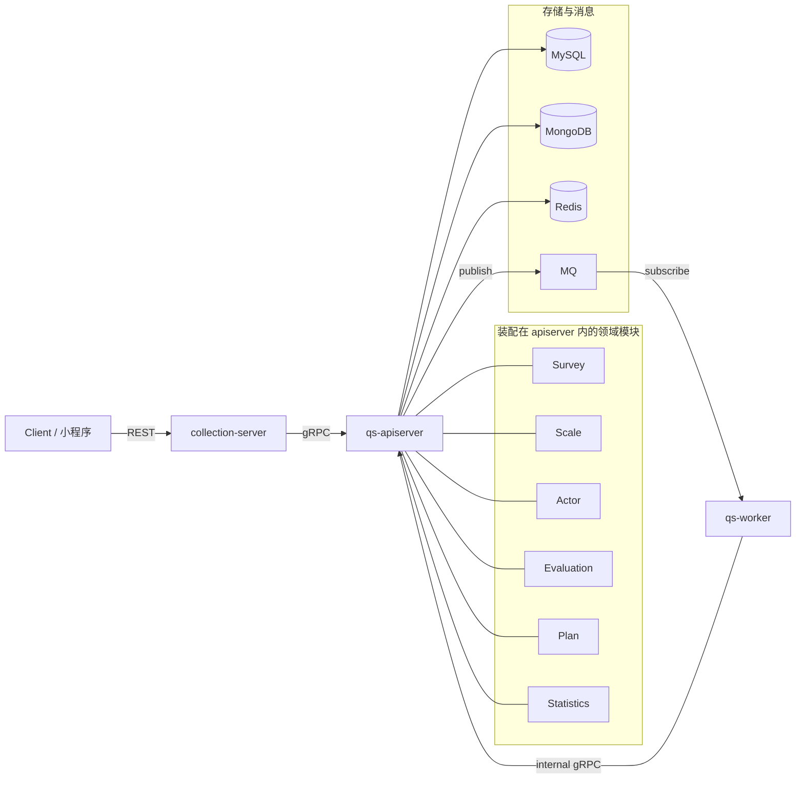

# 系统地图

**本文回答**：系统由哪些运行时进程组成、它们如何协作、主业务能力落在何处，以及读完总览后应继续读哪一层文档。

---

## 1. 三十秒结论

| 进程 | 角色（一句话） |
| ---- | -------------- |
| **qs-apiserver** | 领域与持久化的**中心**：装配业务模块、对外 REST/gRPC、发布领域事件、连接 MySQL/MongoDB/Redis 等 |
| **collection-server** | **前台 BFF**：REST 面向小程序/收集端；JWT/监护/排队等前置；经 **gRPC** 调用 apiserver，**不**承载主业务写模型 |
| **qs-worker** | **异步运行时**：按 [configs/events.yaml](../../configs/events.yaml) 消费消息，经 **internal gRPC** 回调 apiserver 推进计分、测评、报告、统计等 |

**代码入口**（可执行文件）：

- [cmd/qs-apiserver/apiserver.go](../../cmd/qs-apiserver/apiserver.go)
- [cmd/collection-server/main.go](../../cmd/collection-server/main.go)
- [cmd/qs-worker/main.go](../../cmd/qs-worker/main.go)

**IAM**：以 **SDK 模块**嵌入 collection 与 apiserver（非第四进程）；运行时视角见 [01-运行时/05-IAM认证与身份链路.md](../01-运行时/05-IAM认证与身份链路.md)，配置与拦截器见 [03-基础设施/04-IAM与认证.md](../03-基础设施/04-IAM与认证.md)。

---

## 2. 协作关系（数据与控制流）

- **同步主路径**：客户端 → collection（REST）→ apiserver（gRPC 写读）→ 快速返回。  
- **异步主路径**：apiserver 写库并 **发事件** → worker 消费 → **internal gRPC** 回到 apiserver 执行业务步骤。  
- **领域模块**只画在 apiserver 一侧：collection/worker **不复制**一套 domain 装配。

**图未展开**：collection 侧 **Redis**（如排队/缓存）、**IAM SDK** 调用；管理端等若 **直连 apiserver REST**，不经过 collection——详见 [01-运行时](../01-运行时/)。三进程共享横切代码在 **`internal/pkg/`**（与 [02-代码组织与边界](./02-代码组织与边界.md) 对照）。

---

## 3. 领域模块与职责速查

下列模块均在 **apiserver 容器**中装配（不是三个进程各一份）。

| 模块 | 职责摘要 |
| ---- | -------- |
| **Survey** | 问卷/答卷等**采集侧**事实与校验 |
| **Scale** | 量表、因子、计分与解读**规则** |
| **Evaluation** | 将事实与规则组合为测评结果、流水线与报告相关产出 |
| **Actor** | 受试者等参与者模型与相关能力 |
| **Plan** | 测评计划与任务生命周期 |
| **Statistics** | 统计聚合与同步（常与 Redis 缓存统计配合） |

**装配锚点**：[internal/apiserver/container/root.go](../../internal/apiserver/container/root.go)，各模块 [internal/apiserver/container/assembler/*.go](../../internal/apiserver/container/assembler/)。

---

## 4. 产品级叙事：系统在解决什么问题

若用一句话概括业务重心：**把一次问卷作答，稳定地变成可解释、可查询、可追踪的量表测评结果**。

支撑它的三层设计（与 [03-核心业务链路](./03-核心业务链路.md) 呼应）：

1. **Survey / Scale / Evaluation 分离**  
   采集（事实）、规则（量表）、产出（测评/报告）分层，避免「问卷系统」与「测评系统」混为一谈。

2. **同步提交 + 异步推进**  
   前台尽快返回；计分、创建测评、评估流水线、报告与标签等走 **事件 + worker**，削峰并隔离慢路径。

3. **保护层（横切）**  
   限流、提交队列、缓存、统计预聚合等保护核心写链路与读热点；细节见 [03-基础设施](../03-基础设施/) 与 [05-专题分析](../05-专题分析/)。

---

## 5. collection 与 worker 的定位（边界）

| 组件 | 负责 | 不负责 |
| ---- | ---- | ------ |
| **collection-server** | REST 适配、身份/监护前置、可选排队与限流；gRPC 调用 apiserver | 主业务数据的**权威持久化**与第二套领域实现 |
| **qs-worker** | 事件路由、handler、分布式锁与重试；通过 internal gRPC 驱动 apiserver 内服务 | 独立维护完整仓储与业务流程定义 |

**代码锚点**：collection [integration/grpcclient/registry.go](../../internal/collection-server/integration/grpcclient/registry.go)；worker [integration/eventing/dispatcher.go](../../internal/worker/integration/eventing/dispatcher.go) 与 [handlers/](../../internal/worker/handlers/)。

---

## 6. 常见误区（以代码为准）

- 仓库**没有**与三进程并列的「第四 IAM 进程」；IAM 为嵌入 SDK。  
- 已下线或未落地的历史概念，以现行源码与现行文档为准，勿把旧设计稿当现状。  
- **没有** `internal/domain/*` 作为跨进程共享层；领域代码在 **`internal/apiserver/domain`**（及同进程 application/infra）。  
- OpenAPI 契约在 **[api/rest/](../../api/rest/)**，勿引用已废弃路径。

---

## 7. 读完总览后读什么

| 顺序 | 文档 | 用途 |
| ---- | ---- | ---- |
| 1 | [02-代码组织与边界](./02-代码组织与边界.md) | 目录与依赖方向 |
| 2 | [03-核心业务链路](./03-核心业务链路.md) | 事件名、RPC 与入口文件 |
| 3 | [04-本地开发与配置约定](./04-本地开发与配置约定.md) | `make`、yaml、端口与健康检查 |
| 4 | [01-运行时/README.md](../01-运行时/README.md) | 按进程深入组件与示意图 |

本目录索引：[README.md](./README.md)。全文事实优先级见 [CONTRIBUTING-DOCS.md](../CONTRIBUTING-DOCS.md)。
