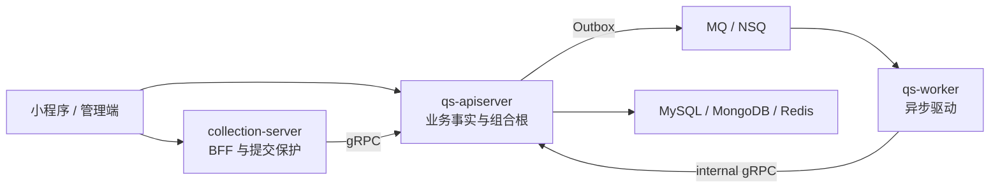

# 系统地图

## 1. 结论

系统不是彼此独立持有业务数据的完整微服务集合，而是一个主业务中心加两个边界进程。

## 2. 进程责任

| 进程 | 负责 | 不负责 |
| --- | --- | --- |
| collection-server | 前台 REST、身份投影、限流、队列、防重、状态等待、gRPC 转发 | 不拥有主业务聚合，不直接推进评估状态机 |
| qs-apiserver | 领域用例、REST/gRPC、持久化、事务、Outbox、模块装配、系统治理 | 不消费业务 MQ |
| qs-worker | MQ 消费、重试/Ack、通过 internal gRPC 驱动用例 | 不直接写主业务存储 |

## 3. 业务模块

业务模块清单来自 [`registry.go`](../../internal/apiserver/container/modules/registry.go)。`platform` 组合 IAM、eventing、cache governance、二维码、通知和 codes 等集成能力；`iam` 负责身份与权限集成。

## 4. 验证入口

- 进程入口：`cmd/qs-apiserver`、`cmd/collection-server`、`cmd/qs-worker`。
- apiserver 组合根：`internal/apiserver/container`。
- 业务模块装配：`internal/apiserver/container/modules/*/wire.go`。
- worker 消费处理：`internal/worker/handlers`。
