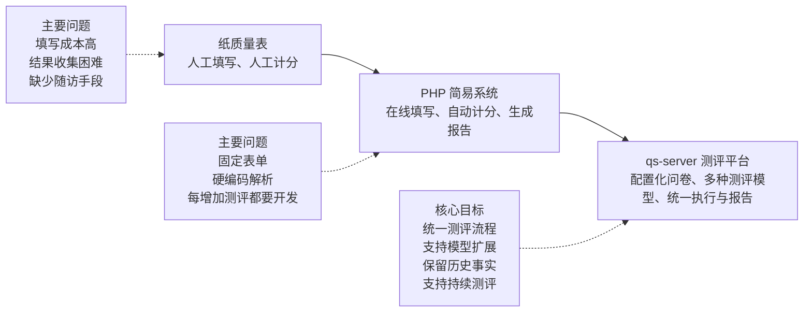
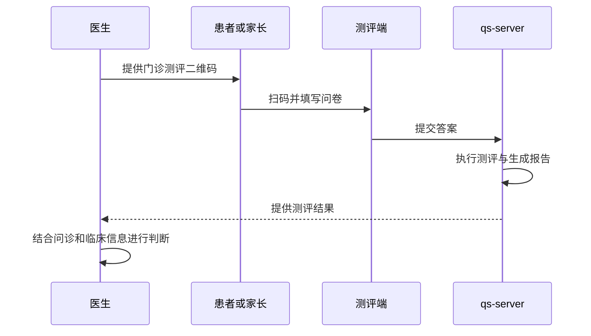
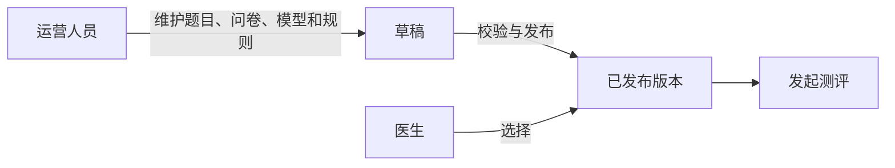

# 项目背景与业务问题

> 状态：已实现。
>
> 本文是 qs-server 文档体系的业务起点。它首先解释项目为什么存在、服务哪些人、解决什么问题，以及哪些业务约束决定了后续的架构设计。
>
> 本文描述的是 qs-server 的业务事实与设计背景，不展开具体代码实现。领域拆分、运行时链路、缓存、高并发和事件驱动设计将在后续文档中分别说明。

## 1. 本文要回答的问题

在阅读 qs-server 的领域模型、应用服务和技术实现之前，需要先回答几个更基础的问题：

1. qs-server 是什么系统，它最初为什么会出现？
2. 从纸质量表到 PHP 简易系统，再到 qs-server，业务问题发生了什么变化？
3. 为什么系统不能继续按照“增加一个表单、编写一段计分代码”的方式演进？
4. 为什么系统既要支持医学量表，又要支持人格测评和行为能力测评？
5. 一次完整测评涉及哪些参与者，它们分别承担什么职责？
6. 测评结果、历史版本和持续随访有哪些不能被破坏的业务约束？
7. qs-server 为什么是测评平台，而不是医学诊断系统？

这些问题共同构成了 qs-server 的业务背景，也是后续架构设计的出发点。

## 2. 三十秒认识 qs-server

qs-server 是一个从 ADHD 医疗场景中生长出来的多模型测评平台。

项目最初用于解决 ADHD 患者在门诊、在线问诊和诊后随访过程中的医学量表测评问题。随着业务发展，平台逐渐从医学量表扩展到人格测评和行为能力测评。

系统通过问卷、题目、因子、常模、测评模型、解释规则和报告等领域概念，将不同测评中相对稳定的流程与不断变化的专业规则分离：

- 问卷负责收集作答；
- 测评模型负责定义如何处理作答结果；
- 因子负责表达测评关注的能力、特征或症状维度；
- 常模和规则负责解释分数；
- 报告负责面向医生、患者和家长呈现结果；
- Plan 负责支持周期性测评和持续随访。

qs-server 产生的结果用于为医生判断、治疗观察和诊后随访提供辅助信息。系统本身不能、也不应直接给出医学诊断。



## 3. 项目定位与业务边界

### 3.1 从医学量表工具到多模型测评平台

qs-server 最初并不是为了构建一个通用问卷系统，而是为了处理 ADHD 医疗服务中的量表测评。

在 ADHD 的门诊诊疗和治疗过程中，医生通常需要借助标准化量表了解患者的症状表现、行为变化和治疗情况。量表测评不是一次普通的信息收集，它通常还包括：

- 特定题目的计分方式；
- 题目与因子的映射关系；
- 原始分与转换分的计算；
- 不同年龄、性别或人群对应的常模；
- 分数区间对应的专业解释；
- 适用于医生、患者或家长的结果呈现；
- 同一患者多次测评结果的趋势比较。

因此，业务需要的不是一个只能收集答案的表单系统，而是一套能够完整表达和执行测评知识的系统。

随着业务边界扩大，平台开始支持人格测评和行为能力测评。此时，qs-server 的定位也从“ADHD 量表系统”逐渐演变为：

> 以医学量表测评为基础，通过对问卷、因子、常模、算法和解释规则等概念进行抽象，形成的多模型测评平台。

这里的“平台”并不意味着系统要支持任意类型的调查问卷，而是意味着它要在一组明确的测评领域边界内，支持不同测评模型共享基础能力，同时允许各自保留专业差异。

### 3.2 系统服务的主要参与者

一次测评通常不只涉及患者和系统，还涉及运营、医生、家长等多个角色。

| 参与者 | 主要职责 |
| --- | --- |
| 运营人员 | 维护问卷、题目、测评模型、因子、常模、解释规则和报告配置，并负责发布可用版本 |
| 医生 | 从已经发布的测评中选择合适的项目，向患者发起测评，并结合临床信息查看结果 |
| 受试者 | 测评实际描述和观察的对象，通常是患者 |
| 填写人 | 实际提交答案的人，可以是患者本人、家长或其他被允许的人员 |
| 家长 | 可以代替年龄较小的患者填写，也可以作为观察者填写家长版量表 |
| 患者 | 完成测评、接收周期提醒，并在允许的范围内查看自己的测评报告 |
| 系统 | 负责测评任务生成、答案收集、规则执行、报告生成和周期性提醒 |

其中，“受试者”和“填写人”是两个不同的业务概念。

例如，一名儿童是量表所观察的对象，因此儿童是受试者；家长实际完成问卷并提交答案，因此家长是填写人。

当前业务不要求系统进一步区分：

- 家长是在代替儿童作答；
- 还是以家长观察者身份作答。

系统当前关心的核心事实是：

1. 这份答案描述的是谁；
2. 这份答案由谁提交。

这两个事实分别由受试者和填写人表达。

### 3.3 三种主要测评场景

#### 3.3.1 门诊测评

医生可以在门诊环境中放置测评二维码。

患者到达门诊后扫码报到，进入相应测评，完成首次填写。系统生成测评结果后，医生查看报告，并将报告作为临床判断的辅助信息之一。



#### 3.3.2 在线问诊测评

在线问诊过程中，医生可以在诊室中向患者推送已经发布的测评。

患者或家长在测评端完成填写，系统生成报告，医生在问诊过程中查看结果。该场景减少了地域限制，使医生可以在远程问诊过程中使用标准化测评工具。

#### 3.3.3 治疗周期中的持续测评

部分治疗方案要求患者在一段时间内持续完成同一种测评，用于观察治疗过程中的变化。

治疗方案会预先配置测评周期。系统根据医生的要求创建相应 Plan，患者加入 Plan 后，系统按照周期生成测评任务，并提醒患者完成填写。

因此，Plan 表达的不是某一次测评，而是：

> 一个患者在一段时间内，按照预定周期持续完成某一种测评的安排。

持续测评的价值不只在于获得多份独立报告，还在于比较同一因子的变化趋势。例如，医生可能关注某个症状因子在治疗前、治疗中和治疗后的变化。

### 3.4 医学责任边界

qs-server 可以：

- 收集标准化问卷答案；
- 根据已发布的测评模型进行计分；
- 根据因子、常模和规则解释结果；
- 生成结构化测评报告；
- 展示多次测评中的因子变化趋势；
- 为医生判断、治疗观察和诊后随访提供辅助信息。

qs-server 不可以：

- 仅根据一次测评结果直接确定疾病；
- 替代医生完成医学诊断；
- 将算法输出描述为确定性的诊断结论；
- 脱离量表适用范围解释结果；
- 在没有专业规则支持的情况下推断医学含义。

患者和家长可以查看报告，但报告的措辞和展示范围仍然必须遵守这一边界。

医生需要将测评结果与问诊、病史、行为观察、检查结果以及其他临床信息结合起来，才能形成最终判断。

## 4. 项目为什么会出现

### 4.1 纸质量表阶段

在最早的业务流程中，医学量表主要以纸质形式完成。

一次门诊测评大致需要经过以下过程：

1. 医生为患者开具检查项；
2. 患者前往指定地点领取纸质量表；
3. 患者本人或家长填写量表；
4. 工作人员回收并整理答案；
5. 工作人员或医生根据量表规则计算分数；
6. 根据分数和规则整理测评结果；
7. 医生查看结果并用于后续判断。

这个流程的问题不只是“纸质填写不方便”，而是整个测评链路都依赖线下流转和人工处理。

#### 填写成本高

患者需要在门诊流程中额外领取量表、填写并交回。对于题目较多的量表，这一过程会进一步增加候诊时间和门诊负担。

#### 结果收集困难

纸质结果需要人工回收和整理。量表可能出现遗漏、字迹不清、流转丢失等问题，也难以形成统一、可查询的数据记录。

#### 计分和报告依赖人工

医学量表通常不是简单统计选项数量。它可能涉及反向题、分组计分、因子汇总、常模转换和结果区间解释。

这些工作由人工完成时，不仅耗时，也容易出现计算错误。有些场景甚至需要医生亲自计算，进一步占用医生本应投入诊疗的时间。

#### 无法有效支持诊后随访

纸质量表依赖患者到达线下场所。患者离开门诊后，系统缺少继续发起测评、提醒填写和回收结果的途径。

这意味着门诊完成了一次测评，但治疗过程中是否改善、某个因子是否持续变化，很难通过稳定的测评机制观察。

因此，纸质量表阶段的核心问题可以概括为：

> 测评能够完成，但完成测评的成本高，结果难以沉淀，更难以形成持续观察。

### 4.2 PHP 简易系统阶段

为了解决纸质流程中的直接问题，早期 PHP 系统提供了基础的在线测评能力。

它已经实现：

- 在线填写问卷；
- 自动计算分数；
- 自动生成报告；
- 医生在线查看测评结果。

这一步具有明确的业务价值。它将原本依赖纸张和人工计算的流程数字化，显著降低了单次测评的填写和计算成本。

但该系统主要解决的是“把一份已有量表搬到线上”，并没有真正解决“如何持续支持不同测评”的问题。

PHP 系统的本质仍然接近：

```text
固定表单 + 针对该表单编写的硬编码解析程序
```

每增加一种测评，通常都需要：

1. 编写新的问卷页面或修改已有表单；
2. 在代码中增加题目和选项处理；
3. 编写对应的计分逻辑；
4. 编写结果判断逻辑；
5. 编写对应的报告页面；
6. 重新测试并发布系统。

在测评数量较少、变化较少时，这种方式能够快速交付；但随着业务扩展，它逐渐暴露出几个根本问题。

#### 问卷结构无法独立配置

题目、选项、顺序和展示方式与代码绑定。运营无法独立维护不同问卷，每次调整都需要研发参与。

#### 测评知识散落在程序逻辑中

因子划分、计分规则、结果区间和报告文字直接写在代码中，业务规则缺少统一模型，也难以被完整查看和验证。

#### 新增测评的边际成本过高

每增加一个测评，都近似于开发一个新的小功能。已有能力难以复用，测评越多，重复代码和维护成本越高。

#### 历史版本难以管理

当题目、规则或报告发生修改时，如果系统没有明确的版本边界，就很难回答：

- 某份历史答案使用的是哪一版问卷？
- 当时执行的是哪一版计分规则？
- 现在看到的报告是否还是当时生成的结果？
- 新规则是否意外改变了历史测评？

#### 不同测评之间缺少统一语言

如果每种测评都拥有独立的数据结构和处理代码，系统就无法形成问卷、因子、常模、模型和报告等统一概念，也就无法构建通用的执行链路。

因此，PHP 系统解决了纸质量表的数字化问题，却没有解决测评业务的规模化扩展问题。

### 4.3 从测评功能到测评平台

qs-server 的出现不是对 PHP 系统进行一次简单的技术升级，而是业务建模方式的改变。

旧方式的核心思路是：

> 为每一种测评单独开发一套填写、计分和报告功能。

qs-server 希望转变为：

> 将测评中的稳定概念抽象出来，将不同测评之间的变化封装在模型和规则中，使统一流程能够执行多种测评。

这要求系统不再只认识某一张具体量表，而是认识：

- 什么是问卷；
- 什么是题目和选项；
- 什么是作答；
- 什么是受试者和填写人；
- 什么是因子；
- 什么是测评模型；
- 什么是常模；
- 什么是解释规则；
- 什么是报告；
- 什么是一次测评任务；
- 什么是周期性测评计划。

这也是 qs-server 后续采用领域驱动设计、运行时解析、事件驱动和多级缓存等设计的业务前提。

## 5. 业务为什么从医学量表扩展到多种测评模型

### 5.1 医学量表测评

医学量表是 qs-server 最初、也是最核心的业务类型。

它主要服务于患者、家长和医生，典型能力包括：

- 患者自评量表；
- 家长观察量表；
- 症状或行为因子计分；
- 原始分和转换分计算；
- 常模匹配；
- 风险区间或程度解释；
- 医生版和患者版报告；
- 多次测评的因子趋势比较。

医学量表的结果具有较强的专业属性，因此必须明确量表适用范围、结果解释方式和医学责任边界。

### 5.2 人格测评

随着医生和业务团队开始提出大五人格等测评需求，系统的使用范围逐渐超出最初的 ADHD 场景。

人格测评可以服务于 TD、孤独症及其他心理和行为相关场景，也可以用于辅助了解受试者相对稳定的人格特征。

人格测评与医学量表存在显著差异。例如：

- 医学量表通常围绕症状、风险或功能表现进行计分；
- 人格测评更关注类型、维度或特质；
- 某些人格模型通过维度得分形成结果；
- 某些人格模型通过组合规则产生人格类型；
- 结果更可能以特征描述、优势倾向和相处建议呈现。

如果系统将“测评”直接等同于“按阈值判断医学风险”，就无法自然支持人格测评。

因此，人格测评的加入证明了测评平台不能只有一种固定的计算和解释方式。

### 5.3 行为能力测评

公司在 ADHD 领域继续扩展线下治疗门店和行为干预服务后，需要观察患者在治疗过程中表现出的行为能力和功能变化。

这类测评关注的内容可能包括：

- 执行功能；
- 感觉处理；
- 日常行为表现；
- 某种训练能力或认知能力；
- 治疗前后的能力变化。

在业务层面，这些内容统一归入“行为能力测评”。但在技术实现中，它们不一定都使用同一种算法。

一部分行为能力测评更接近观察者评分量表，另一部分可能包含任务表现、正确率、反应结果或认知指标。因此，技术模型需要继续区分不同的运行规则。

### 5.4 三类测评的共同流程

医学量表、人格测评和行为能力测评在专业含义上不同，但它们具有一条相对稳定的共同流程：


正是这条共同流程，使平台化成为可能。

系统可以统一处理：

- 模型发布；
- 测评发起；
- 作答收集；
- 身份记录；
- 执行调度；
- 结果保存；
- 报告查询；
- 权限控制；
- 周期任务；
- 事件通知。

不同测评真正变化的是：

- 题目如何组织；
- 答案如何转换；
- 因子如何计算；
- 是否需要常模；
- 使用什么算法；
- 如何解释结果；
- 报告展示什么内容。

因此，平台要解决的核心矛盾不是“怎样把所有测评做成一样”，而是：

> 怎样统一测评生命周期，同时保留不同测评模型的专业差异。

### 5.5 业务分类与技术分类

从业务产品角度，当前 qs-server 支持三类测评：

1. 医学量表测评；
2. 人格测评；
3. 行为能力测评。

这是医生、运营和用户更容易理解的产品分类。

但在技术实现中，仅使用这三个名称还不够。因为同一个业务类型内部可能存在不同的计算方式和运行规则。

当前代码进一步区分了四种测评模型家族：

| 业务类型 | 可能对应的技术模型家族 | 主要特征 |
| --- | --- | --- |
| 医学量表测评 | `scale` | 因子计分、常模转换、区间解释 |
| 人格测评 | `typology` | 人格维度、类型组合或特征解释 |
| 行为能力测评 | `behavioral_rating` | 基于观察或问卷的行为能力评分 |
| 行为能力测评 | `cognitive` | 基于任务表现或认知指标的能力评估 |

在模型家族之下，还可以存在更具体的算法。例如不同医学量表、人格模型或行为量表可以拥有各自的算法实现。

因此，qs-server 的分类体系可以理解为：

```text
业务产品类型
    └── 技术模型家族
            └── 具体算法
                    └── 已发布的测评模型版本
```

这里需要特别避免两个误解。

第一，业务上只有三类测评，不代表技术上只能存在三种执行方式。

第二，技术上存在四个模型家族，也不代表产品必须向医生和患者暴露四个分类。

业务分类用于表达“用户正在使用什么产品”，技术分类用于决定“系统应该如何执行这个测评”。

## 6. qs-server 必须解决的核心业务问题

### 6.1 统一流程与多种模型之间的矛盾

如果每一种测评都拥有完全独立的流程，新增测评将不断复制：

- 发布逻辑；
- 发起逻辑；
- 作答逻辑；
- 任务状态；
- 结果保存；
- 报告查询；
- 权限判断；
- 消息通知。

这会使系统重新退化成 PHP 简易系统的模式。

但如果为了复用而强行让所有测评共享同一种数据结构、计分方式和报告结构，又会丢失不同测评的专业含义。

因此，系统必须找到正确的稳定边界：

- Survey 关心如何表达问卷、题目、选项和作答；
- ModelCatalog 关心有哪些模型、模型使用什么算法、模型如何发布和被解析；
- Evaluation 关心如何执行一次测评，而不应绑定某一种具体业务类型；
- Interpretation 关心如何把测评结果解释成可展示的报告；
- Plan 关心如何按照周期持续产生测评任务。

这样的边界使题型扩展、测评模型扩展和报告扩展能够相对独立地发生。

### 6.2 测评扩展不能持续依赖研发硬编码

运营人员负责维护和发布问卷与测评模型，医生只从已发布内容中选择并发起测评。

这意味着系统必须支持一种明确的内容生产关系：



医生不负责编辑测评模型，患者也不能直接修改规则。发布是运营配置进入生产运行环境的边界。

平台化并不意味着完全消除研发工作。新的算法家族、题型或报告能力仍可能需要开发，但增加同类型测评时，不应再完整复制一套业务系统。

理想状态是：

- 已有题型可以通过配置复用；
- 已有算法可以通过模型配置复用；
- 因子、常模和解释规则可以独立维护；
- 新的专业差异只在必要边界内增加实现。

### 6.3 可编辑的测评定义与不可变的历史事实

运营需要持续修改和发布测评模型，但已经完成的测评结果必须保持稳定。

一份历史测评至少需要能够回答：

- 使用了哪一版问卷；
- 使用了哪一版测评模型；
- 使用了哪些计分和解释规则；
- 最终产生了什么结果和报告。

运营发布新版本后，不能重新改变已经完成的历史结果。否则同一份历史测评可能因为今天修改了规则，而得到与昨天不同的解释。

因此，系统需要同时满足两种看似矛盾的要求：

- 测评定义可以持续演进；
- 已完成的测评事实不可被后续版本改写。

这条约束不仅影响数据存储，也影响模型发布、运行时解析、结果保存和报告查询。

### 6.4 多种入口必须形成统一的测评事实

测评可以从多个场景进入系统：

- 门诊扫码；
- 在线问诊推送；
- 医生直接发起；
- Plan 周期性生成；
- 其他业务系统调用。

入口可以不同，但进入测评执行阶段后，系统需要形成一致的业务事实：

- 测评对象是谁；
- 谁完成了填写；
- 使用了哪个测评；
- 使用了什么问卷和模型版本；
- 当前处于什么状态；
- 是否已经完成执行；
- 是否已经生成报告。

如果每个入口产生一套不同的数据结构和状态规则，下游执行、查询和报告就会被迫理解所有入口差异。

因此，入口差异应尽量停留在入口层，测评核心需要拥有统一的任务和结果语义。

### 6.5 受试者与填写人不能混为一谈

在成人自评场景中，受试者与填写人通常是同一个人，因此很容易被实现为一个字段。

但儿童测评会打破这个假设：

- 儿童是受试者；
- 家长是填写人；
- 结果描述的是儿童；
- 答案由家长提交。

如果系统只保存“用户是谁”，就无法准确表达报告属于谁，也无法正确判断患者和家长的访问关系。

因此，受试者与填写人必须作为独立事实保存。

当前业务不需要进一步区分家长的作答动机，即不区分“家长代填”和“家长观察”。如果未来不同作答身份会影响常模、解释规则或报告呈现，再引入更加细化的填写角色。

这一设计体现了一个重要原则：

> 领域模型应表达当前业务确实需要区分的事实，同时为已经能够预见的差异保留边界，但不提前制造没有业务含义的分类。

### 6.6 单次测评与持续随访之间的差异

单次测评关注的是：

- 本次答案；
- 本次得分；
- 本次解释；
- 本次报告。

持续随访还需要关注：

- 患者何时开始加入 Plan；
- 按什么周期产生任务；
- 哪些任务已经完成；
- 多次结果是否能够比较；
- 同一因子如何形成变化趋势。

Plan 当前只记录测评 `code`，不固定某个发布版本。患者加入 Plan 后，未来产生的任务使用该测评当时最新的已发布版本。

该策略意味着：

- 已经完成的测评仍保留当时使用的版本和结果；
- 未来任务可以自然使用运营发布的新版本；
- Plan 不需要在每次发布后重新配置；
- 一个治疗周期中，不同任务可能使用同一测评的不同发布版本。

当前业务接受这一策略，是因为量表的因子结构通常非常稳定。因子的增减或含义调整主要发生在量表上线初期，进入稳定使用阶段后变化较少。

因此，趋势比较主要依赖以下业务假设：

1. 同一个 `code` 表示同一种业务测评；
2. 核心因子的含义在不同版本之间基本稳定；
3. 新版本不会随意改变既有因子的业务语义；
4. 历史结果不会因为新版本发布而重新计算。

这个设计是一种基于当前业务事实的取舍，而不是绝对不会变化的规则。

如果未来出现以下情况，就需要重新评估 Plan 的版本策略和趋势比较方式：

- 因子被大量增加、删除或合并；
- 同名因子的含义发生变化；
- 分值范围发生不可直接比较的变化；
- 常模变化导致不同版本结果不再具有可比性；
- 医疗或合规要求一个治疗周期必须固定测评版本。

可能的后续方案包括：

- Plan 加入时固定模型版本；
- 每个治疗阶段固定版本；
- 为因子建立跨版本映射；
- 趋势图标注版本切换点；
- 对不可比较的版本停止直接绘制连续趋势。

当前不提前引入这些复杂度，是因为真实业务尚未要求它们。但文档需要明确记录这一设计成立的前提，避免未来把当前实现误认为无条件正确。

### 6.7 自动化能力不能越过医学边界

自动计分、自动解释和自动报告可以提高效率，但自动化程度越高，越需要明确系统的责任范围。

系统可以确定：

- 用户提交了哪些答案；
- 按照已发布规则计算出的分数；
- 分数落入哪个预设区间；
- 规则为该区间配置了什么说明；
- 多次测评中的数值如何变化。

系统不能仅凭这些信息确定：

- 患者一定患有某种疾病；
- 某个分数可以替代医生诊断；
- 患者应当直接采用何种治疗方案；
- 不同医疗背景下的相同分数必然具有相同含义。

因此，报告中的结论本质上是对已发布测评规则的执行结果，而不是系统自行作出的医学判断。

## 7. 从业务问题得到的设计约束

以上问题最终形成了一组需要长期保持的业务约束。

### 7.1 内容生产约束

- 问卷和测评模型由运营统一维护和发布；
- 医生只能选择已经发布的测评；
- 患者和家长不能修改测评规则；
- 未发布内容不能进入正式测评流程。

### 7.2 作答身份约束

- 系统必须保存受试者；
- 系统必须保存实际填写人；
- 受试者与填写人可以是同一个人，也可以不同；
- 当前不强制区分家长代填与家长观察。

### 7.3 历史一致性约束

- 已完成测评必须保留当时使用的问卷版本；
- 已完成测评必须保留当时使用的测评模型和规则；
- 新版本发布不能改变已经完成的历史结果；
- 历史报告应当反映当时实际生成的结果。

### 7.4 模型扩展约束

- 新增同类测评不应重复开发完整业务流程；
- 不同测评模型可以拥有不同算法；
- 统一流程不能抹平模型之间的专业差异；
- 业务分类和技术执行分类应当分别表达。

### 7.5 持续测评约束

- 治疗方案可以预先配置测评周期；
- 患者加入 Plan 后，系统按周期生成测评任务；
- Plan 当前通过测评 `code` 引用测评；
- 未来任务使用执行时最新的已发布版本；
- 已完成任务仍保留自己的历史版本；
- 因子趋势比较依赖因子语义在版本间保持稳定。

### 7.6 报告与医学边界约束

- 医生可以查看患者测评结果；
- 患者和家长可以在授权范围内查看报告；
- 不同查看者可以获得不同的报告表达；
- 报告用于辅助判断、治疗观察和随访；
- 报告不能被描述为系统作出的医学诊断。

## 8. 这些问题如何驱动后续架构

本文不展开具体架构实现，但可以先建立业务问题与架构方向之间的对应关系。

| 业务问题 | 对架构提出的要求 |
| --- | --- |
| 多种问卷和题型持续增加 | Survey 需要形成独立、可扩展的问卷与作答模型 |
| 多种测评算法共存 | ModelCatalog 需要管理模型身份、算法绑定、版本与发布 |
| 执行流程不应关心测评类型 | Evaluation 需要围绕统一运行协议执行不同模型 |
| 分数解释和报告形式持续变化 | Interpretation 需要将原始测评结果转换为面向不同受众的报告 |
| 受试者与填写人可能不同 | Actor 与作答上下文需要表达两种身份 |
| 治疗过程中持续测评 | Plan 需要管理周期、加入关系和任务生成 |
| 已发布内容需要高频读取 | 运行时需要缓存、预热和失效机制 |
| 测评入口可能出现高并发 | 入口需要队列、限流、背压和降级保护 |
| 测评执行不应阻塞提交请求 | 执行链路需要异步化和事件驱动 |
| 事件和业务状态必须可靠衔接 | 需要可靠事件投递及 Outbox 等一致性机制 |
| 历史结果不能被新版本改变 | 需要明确版本引用、运行快照和结果不可变边界 |

后续架构文档需要逐项回答：

1. 这些要求分别由哪个领域或模块承担？
2. 为什么职责要这样划分？
3. 模块之间通过什么协议协作？
4. 哪些设计已经在代码中实现？
5. 哪些仍然是受业务假设约束的取舍？
6. 如果不采用当前设计，还有哪些替代方案？

## 9. 本文事实来源与代码入口

本文中的项目历史、纸质流程、PHP 系统能力和业务扩展原因，来自项目参与者对真实业务演进过程的说明。

与当前代码直接相关的业务事实，可以从以下入口继续验证：

| 业务事实 | 代码入口 |
| --- | --- |
| 当前测评模型家族 | [`internal/apiserver/domain/modelcatalog/identity/types.go`](../../internal/apiserver/domain/modelcatalog/identity/types.go) |
| 业务产品渠道分类 | [`internal/apiserver/domain/modelcatalog/binding/product_channel.go`](../../internal/apiserver/domain/modelcatalog/binding/product_channel.go) |
| Plan 保存测评 code 和周期规则 | [`internal/apiserver/domain/plan/assessment_plan.go`](../../internal/apiserver/domain/plan/assessment_plan.go) |
| 作答中的受试者与填写人 | [`internal/apiserver/domain/survey/answersheet/types.go`](../../internal/apiserver/domain/survey/answersheet/types.go) |
| 已发布模型运行时解析 | [`internal/apiserver/application/modelcatalog/runtime/resolver.go`](../../internal/apiserver/application/modelcatalog/runtime/resolver.go) |
| 参与者报告查询入口 | [`internal/apiserver/transport/grpc/service/participant_report.go`](../../internal/apiserver/transport/grpc/service/participant_report.go) |

需要注意：本节只提供代码阅读入口，不用少数文件代替完整调用链分析。Plan 如何生成任务、任务如何进入测评、模型版本如何解析、报告如何投影给不同参与者，需要在相应模块文档中继续沿真实运行链路验证。

## 10. 小结

qs-server 的产生经历了三个阶段：

1. 纸质量表解决了“有没有测评工具”的问题，但填写、收集、计分和随访成本很高；
2. PHP 简易系统解决了“能不能在线填写和自动计分”的问题，但固定表单和硬编码解析无法支撑测评持续扩展；
3. qs-server 需要解决“怎样让不同测评共享平台能力，同时保持各自专业规则”的问题。

因此，qs-server 不是一个普通表单系统，也不是一个直接作出医学诊断的系统。

它的核心价值是：

> 将问卷收集、模型执行、结果解释、报告生成和持续随访组织成统一的测评生命周期，并通过明确的领域边界支持医学量表、人格测评和行为能力测评持续扩展。

这个定位带来了几条最重要的业务原则：

- 统一的是测评生命周期，不是所有测评的算法；
- 运营维护并发布模型，医生选择并发起测评；
- 受试者和填写人是两个独立的业务事实；
- 已完成结果必须保留历史版本，不受后续发布影响；
- Plan 当前面向最新发布版本，但趋势比较依赖因子语义稳定；
- 所有测评结果都只能作为医生判断和治疗观察的辅助信息。

下一篇《架构驱动力与设计目标》将在这些业务问题的基础上，进一步说明 qs-server 为什么采用当前的领域拆分、运行时模型、异步执行、缓存和稳定性保护设计。
