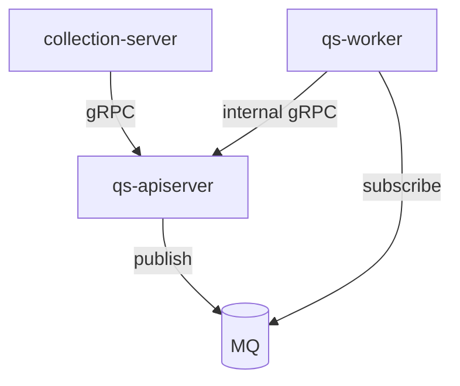

# 代码组织与边界

**本文回答**：仓库如何按**运行时进程**与 **apiserver 内分层**组织代码，共享包与契约落在何处，以及各进程之间**谁依赖谁**。

---

## 1. 两个正交维度

| 维度 | 典型路径 | 说明 |
| ---- | -------- | ---- |
| **运行时** | `cmd/*`、`internal/{apiserver,collection-server,worker}` | 三个可部署进程，各自 `app.go` / `server.go` 启动与装配 |
| **领域与接口（主要在 apiserver）** | `internal/apiserver/{domain,application,infra,interface,container}` | DDD 风格分层 + 容器装配；**领域模型不以「跨三进程共享包」形式存在** |

**跨进程复用**集中在 **`internal/pkg/`**（例如 `grpc` 服务端拦截器链、`middleware`、各进程共用的 `options`），而不是再抽一层 `internal/domain`。

---

## 2. FangcunMount/component-base（组织级基础库）

本仓通过 `go.mod` 依赖 **[github.com/FangcunMount/component-base](https://github.com/FangcunMount/component-base)**（版本以根目录 [go.mod](../../go.mod) 为准）。它是**独立仓库**提供的横切能力，**不是**本仓库 `internal/` 下的子目录。

| 方面 | 说明 |
| ---- | ---- |
| **定位** | 与业务无关的通用基建：日志（`pkg/log`、`pkg/logger`）、错误包装（`pkg/errors`）、消息抽象（`pkg/messaging` 及 NSQ/RabbitMQ 等实现）、**gRPC** 侧 **mTLS** 与**拦截器**（Recovery、RequestID、Logging、ACL、Audit 等） |
| **与本仓边界** | **领域模型、用例与 qs-server 专有契约**仍在 `internal/apiserver/...` 及本仓 `api/rest`、`proto`、`configs`；component-base 不承载问卷/测评等业务语义 |
| **在本仓的主要接点** | [internal/pkg/grpc/server.go](../../internal/pkg/grpc/server.go)（组装拦截器链与 mTLS，详见 [internal/pkg/grpc/README.md](../../internal/pkg/grpc/README.md)）、[internal/pkg/server/](../../internal/pkg/server/)（通用 HTTP 服务）、[internal/pkg/middleware/](../../internal/pkg/middleware/)、[internal/pkg/options/messaging_options.go](../../internal/pkg/options/messaging_options.go)；各进程业务代码中大量 `errors` / `logger` 引用亦来自该库 |
| **维护注意** | 升级 component-base 时需回归 **gRPC 入站链**、**MTLS**、日志与错误码行为；若上游变更拦截器或配置结构，需同步调整本仓 `internal/pkg/grpc` 与各进程配置映射 |

---

## 3. 目录树（仓库骨架）

与根目录 [README.md](../../README.md)「项目结构」一致，此处略展开子目录职责；**非穷举**所有文件。

```text
qs-server/
├── api/
│   └── rest/                           # OpenAPI 契约（apiserver / collection）
├── cmd/
│   ├── qs-apiserver/                   # qs-apiserver 进程入口
│   ├── collection-server/              # collection-server 进程入口
│   ├── qs-worker/                      # qs-worker 进程入口
│   └── tools/                          # 辅助工具（如 seeddata）
├── configs/                            # 各进程 *.dev.yaml / *.prod.yaml、events.yaml、nginx、seeddata 等
├── docs/                               # 设计文档（入口 docs/README.md）
├── internal/
│   ├── apiserver/                      # qs-apiserver 主体
│   │   ├── application/                # 应用服务、用例编排（含 evaluation engine）
│   │   ├── container/                  # 依赖注入、assembler
│   │   ├── domain/                     # 领域层：聚合、领域服务、仓储接口
│   │   ├── infra/                      # 仓储实现、外部系统（MySQL/Mongo/Redis/MQ/IAM）
│   │   ├── interface/                  # 入站：restful、grpc（含 proto 子树）
│   │   ├── config/                     # 配置结构体与加载
│   │   └── options/                    # 运行选项
│   ├── collection-server/              # 前台 BFF
│   │   ├── application/
│   │   ├── container/
│   │   ├── domain/
│   │   ├── infra/                      # gRPC 客户端、IAM、Redis 等
│   │   └── interface/                  # 主要为 restful
│   ├── worker/
│   │   ├── application/                # 事件分发
│   │   ├── handlers/                   # 事件处理器
│   │   ├── infra/                      # MQ、gRPC 客户端等
│   │   └── container/
│   └── pkg/                            # 三进程共享：grpc server、middleware、migration、eventcatalog/eventruntime…
├── pkg/                                # 根级可复用库（flag、version、event 等；与 internal/pkg 不同）
├── scripts/                            # 运维/检查脚本（如与 Makefile 联动的 check-infra）
├── build/
│   └── docker/                         # 镜像与 compose
├── web/                                # Swagger 等静态资源
├── Makefile
└── go.mod
```

**说明**：`internal/pkg` 与根目录 **`pkg/`** 并存：前者为**本仓库三进程共享**的横切实现；后者为体量较小的**根级**可复用包。外部基础库 **component-base** 见 **§2**，不在上表中展开。

---

## 4. 各进程入口与装配（Where）

| 进程 | 启动与 HTTP/gRPC 服务 | 容器 / 注册 |
| ---- | --------------------- | ----------- |
| **apiserver** | [internal/apiserver/app.go](../../internal/apiserver/app.go)、[process/run.go](../../internal/apiserver/process/run.go) | [container/root.go](../../internal/apiserver/container/root.go)；REST [transport/rest](../../internal/apiserver/transport/rest/)；gRPC [transport/grpc/registry.go](../../internal/apiserver/transport/grpc/registry.go) |
| **collection-server** | [internal/collection-server/app.go](../../internal/collection-server/app.go)、[process/run.go](../../internal/collection-server/process/run.go) | [container/container.go](../../internal/collection-server/container/container.go)；gRPC 客户端 [integration/grpcclient/registry.go](../../internal/collection-server/integration/grpcclient/registry.go) |
| **worker** | [internal/worker/app.go](../../internal/worker/app.go)、[process/run.go](../../internal/worker/process/run.go) | [container/container.go](../../internal/worker/container/container.go) |

---

## 5. apiserver 内部分层（What / Why）

| 层 | 职责 | 依赖方向 |
| -- | ---- | -------- |
| **interface** | HTTP/gRPC 入站、DTO 与错误映射 | → application |
| **application** | 用例、事务边界、跨聚合编排 | → domain（及 infra 接口） |
| **domain** | 领域模型、领域服务、仓储**接口** | 不依赖 outer 基础设施细节 |
| **infra** | 仓储实现、MQ、缓存、第三方 API | 实现 domain 所需接口 |
| **container** | 把上述组件接成可运行图 | 唯一定位「谁 new 谁」 |

collection-server / worker 通常保持 **application + infra + interface + container**，**不**复制 apiserver 的完整 domain 树。

---

## 6. 契约与机器可读来源（Verify）

| 类型 | 位置 |
| ---- | ---- |
| REST | [api/rest/apiserver.yaml](../../api/rest/apiserver.yaml)、[api/rest/collection.yaml](../../api/rest/collection.yaml) |
| 对外 gRPC（collection → apiserver 等） | [internal/apiserver/interface/grpc/proto/](../../internal/apiserver/interface/grpc/proto/)（答卷、问卷等对外服务） |
| internal gRPC（worker → apiserver） | [internalapi/internal.proto](../../internal/apiserver/interface/grpc/proto/internalapi/internal.proto)（**InternalService**：计分、创建测评、Evaluate、TagTestee 等） |
| 领域事件 | [configs/events.yaml](../../configs/events.yaml) |

变更接口或事件后，应同时核对：**proto / yaml / events.yaml** 与调用方（collection、worker）。

---

## 7. 进程间依赖关系（边界）



- **apiserver** 不依赖 collection/worker 的 Go 包作为运行时循环依赖；反向调用不存在。  
- **worker** 是事件的**消费者**，业务状态仍以 apiserver 内服务与仓储为准。

---

## 8. 误区修正

- **`internal/domain/*`（与 apiserver 平级）**：当前仓库**不存在**；领域在 `internal/apiserver/domain`。  
- **collection 与 apiserver「双主」**：错误；collection 为 BFF，权威状态在 apiserver。  
- **worker 与业务模块一一对应**：不准确；worker 是 **handler 集合 + 事件路由**，多个事件可能共用同一 internal 调用链。  
- **文档中的接口路径**：以 `api/rest/*.yaml` 为准，而非口头约定或旧路径。

---

## 9. 下一跳

- 主链路与时序：[03-核心业务链路](./03-核心业务链路.md)  
- 按进程展开：[01-运行时/](../01-运行时/)  
- 配置如何进各进程：[03-基础设施/05-配置体系.md](../03-基础设施/05-配置体系.md)
