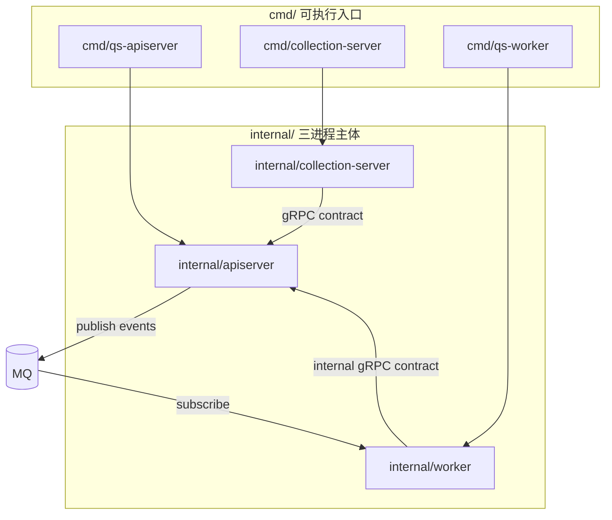
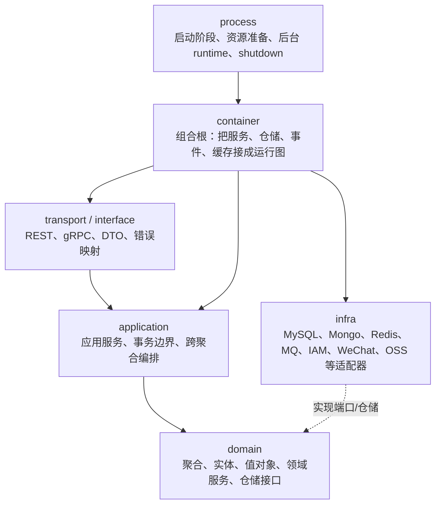
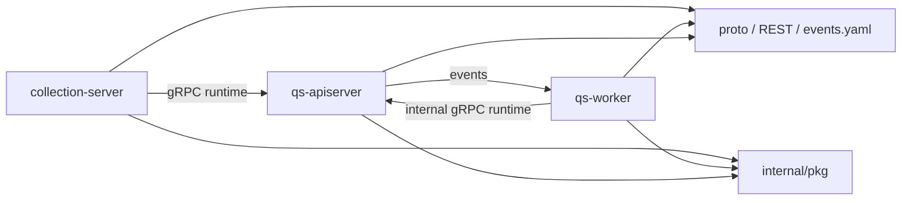

# 代码组织与边界

**本文回答**：`qs-server` 仓库应该如何阅读：哪些目录代表运行时进程，哪些目录代表 apiserver 内部的领域分层，哪些目录只是共享横切能力、机器契约或构建运维材料；更重要的是，哪些边界不能被混读或跨越。

> 建议落位：`docs/00-总览/02-代码组织与边界.md`。本文的相对链接均按这个落位编写。

---

## 30 秒结论

| 维度 | 结论 |
| ---- | ---- |
| 阅读方式 | 先按**运行时进程**区分 `qs-apiserver / collection-server / qs-worker`，再按 **apiserver 内 DDD 分层**阅读 `domain / application / infra / transport / container` |
| 主业务归属 | 主业务写模型、领域规则、仓储和事件发布收口在 `internal/apiserver`，不是三个进程各自维护一套领域模型 |
| BFF 边界 | `internal/collection-server` 是前台 BFF，负责 REST 入口、身份/监护/削峰等前置治理，并通过 gRPC 调 apiserver，不拥有答卷、测评、报告等权威写模型 |
| Worker 边界 | `internal/worker` 是事件消费者和异步执行器，负责订阅、派发、锁、重试和 internal gRPC 回调，不是第二套业务服务 |
| 共享代码 | `internal/pkg` 是本仓三进程共享横切实现；根级 `pkg` 是较小的仓内可复用库；外部 `component-base` 是组织级基础库，不承载 qs-server 业务语义 |
| 机器契约 | REST 看 `api/rest/*.yaml`，gRPC 看 `internal/apiserver/interface/grpc/proto/`，事件看 `configs/events.yaml`，配置看 `configs/*.yaml` |
| 常见误区 | 仓库没有与三进程并列的第四个 IAM 进程；没有 `internal/domain` 作为跨进程共享领域层；不要把 `_archive` 或 generated swagger 当现行真值 |

---

## 1. 为什么先讲代码组织

`qs-server` 的代码不适合只按“目录树”机械阅读。它同时存在两个正交维度：

1. **运行时维度**：三个可部署进程分别怎么启动、怎么调用、怎么退出。
2. **领域分层维度**：apiserver 内部如何按 DDD / 六边形架构组织模型、用例、端口和适配器。

如果不先区分这两个维度，读者很容易出现三类误判：

- 把 `collection-server` 看成和 `qs-apiserver` 平级的第二套业务主服务。
- 把 `qs-worker` 看成真正执行业务写库的服务，而忽略它通过 internal gRPC 回调 apiserver。
- 把 `internal/pkg`、根级 `pkg`、`component-base`、`api/rest`、proto、`configs/events.yaml` 混成一个“大杂烩基础设施层”。

本文的目标是建立一张稳定的代码地图。后续阅读业务模块、运行时、事件系统、接口运维时，都应该回到这张地图判断“这个能力应该归到哪里”。

---

## 2. 两个正交坐标：运行时轴与分层轴

### 2.1 运行时轴：三个进程

运行时轴回答：**这个代码最终跑在哪个进程里？**



三个 `cmd/*` 入口都很薄，真正的运行时组织都在 `internal/{apiserver,collection-server,worker}` 中。

| 进程 | 入口 | 主体目录 | 运行时定位 |
| ---- | ---- | -------- | ---------- |
| `qs-apiserver` | [`cmd/qs-apiserver/apiserver.go`](../../cmd/qs-apiserver/apiserver.go) | [`internal/apiserver`](../../internal/apiserver/) | 主业务、领域模块、REST/gRPC、持久化、事件发布、后台 runtime |
| `collection-server` | [`cmd/collection-server/main.go`](../../cmd/collection-server/main.go) | [`internal/collection-server`](../../internal/collection-server/) | 前台 BFF、REST 收集入口、身份/监护/提交削峰、gRPC 下游调用 |
| `qs-worker` | [`cmd/qs-worker/main.go`](../../cmd/qs-worker/main.go) | [`internal/worker`](../../internal/worker/) | 事件订阅、handler 派发、锁/重试、internal gRPC 回调 |

### 2.2 分层轴：apiserver 内的 DDD / 六边形结构

分层轴回答：**这个代码在业务实现中扮演什么角色？**



在 `qs-server` 中，完整领域分层主要收口在 `internal/apiserver`。`collection-server` 和 `worker` 也有 application / infra / container 等结构，但它们不是业务真值的第二实现，而是围绕入口治理和异步执行形成的运行时局部结构。

---

## 3. 仓库顶层目录地图

下面这张表不是穷举文件，而是告诉你每个顶层目录的边界。

| 路径 | 定位 | 什么时候读 |
| ---- | ---- | ---------- |
| [`api/rest/`](../../api/rest/) | REST OpenAPI 契约，包含 apiserver 和 collection 的 HTTP API 描述 | 对接接口、检查 HTTP path/status/schema 时 |
| [`cmd/`](../../cmd/) | 三进程可执行入口；只负责启动对应 `internal/*` app | 判断有哪些二进制、main 函数怎么进入时 |
| [`configs/`](../../configs/) | 环境配置、事件契约、部署相关配置 | 看端口、依赖地址、MQ、Redis、IAM、事件 topic/handler 时 |
| [`docs/`](../) | 文档体系；`00-05` 是现行 truth layer，`06` 是宣讲层，`_archive` 是历史层 | 阅读项目设计、维护文档时 |
| [`internal/apiserver/`](../../internal/apiserver/) | 主业务服务主体，包含领域、应用、基础设施、接口、容器和运行时 | 改业务模型、接口实现、持久化和事件发布时 |
| [`internal/collection-server/`](../../internal/collection-server/) | 前台 BFF 主体 | 改小程序/收集端入口、SubmitQueue、前台身份与 gRPC 转调时 |
| [`internal/worker/`](../../internal/worker/) | 异步消费进程主体 | 改事件 handler、worker 调用 apiserver internal gRPC、锁/重试/治理时 |
| [`internal/pkg/`](../../internal/pkg/) | 本仓三进程共享横切能力 | 改 gRPC runtime、middleware、eventruntime、cacheplane、migration、locklease 等时 |
| [`pkg/`](../../pkg/) | 根级可复用库，体量较小，供仓内多处使用 | 看 app 封装、公共 event/core/meta 等根级包时 |
| [`scripts/`](../../scripts/) | 检查、生成、运维、一次性修复脚本 | 本地检查、文档 hygiene、运维修复时 |
| [`build/`](../../build/) | Docker / compose / 构建发布材料 | 容器化部署和环境编排时 |
| [`web/`](../../web/) | Swagger 等静态资源 | 查看或托管接口静态资源时 |
| [`Makefile`](../../Makefile) | 本地构建、运行、测试、文档检查和 CD 入口 | 跑服务、跑测试、生成 REST 文档、检查 docs 时 |
| [`go.mod`](../../go.mod) | Go module、依赖版本和外部基础库入口 | 判断依赖、Go 版本和 component-base / iam SDK 版本时 |

顶层目录的关键原则是：**`internal/*` 是运行时和实现主体，`api/rest` / proto / `configs/events.yaml` 是机器契约，`docs` 是解释层，不要反过来让 prose 覆盖源码或契约。**

---

## 4. 三进程代码边界

### 4.1 `qs-apiserver`：主业务与状态收口

`qs-apiserver` 是系统的业务中心。它负责装配六个业务模块，持有 MySQL / Mongo / Redis / MQ / IAM / WeChat / OSS 等基础设施适配，暴露 REST 和 gRPC，并启动 outbox relay、scheduler、cache warmup 等后台 runtime。

典型进入路径：

```text
cmd/qs-apiserver/apiserver.go
  -> internal/apiserver/app.go
  -> internal/apiserver/run.go
  -> internal/apiserver/process/run.go
  -> internal/apiserver/process/runner.go
  -> internal/apiserver/container/root.go
```

`internal/apiserver/process/runner.go` 的 `PrepareRun` 阶段是理解 apiserver 的关键：

```text
prepare resources
  -> initialize container
  -> initialize integrations
  -> initialize transports
  -> start background runtimes
  -> register shutdown callback
```

这些阶段分别对应：数据库/Redis/MQ/event catalog 准备，业务容器初始化，WeChat/IAM version sync 等集成，REST/gRPC 注册，scheduler/outbox relay/cache warmup 启动，以及关闭钩子注册。

### 4.2 `collection-server`：前台 BFF 与入口保护

`collection-server` 的职责是面向小程序或收集端提供 REST API，并在进入 apiserver 前处理入口侧问题：身份、监护关系、请求治理、提交削峰、状态查询、gRPC 下游调用等。

典型进入路径：

```text
cmd/collection-server/main.go
  -> internal/collection-server/app.go
  -> internal/collection-server/run.go
  -> internal/collection-server/process/run.go
  -> internal/collection-server/container
  -> internal/collection-server/transport/rest
  -> internal/collection-server/infra/grpcclient
```

需要特别注意：`collection-server` 可以有自己的 application、domain、infra 目录，但它们是 BFF 局部模型和入口治理模型，不等于问卷、答卷、测评、报告等主业务写模型。比如 `SubmitQueue` 是 collection 进程内存中的削峰队列，用来接受请求、维护 `request_id` 状态，并异步调用下游 gRPC；它不是 MQ，也不是 `qs-worker`。

### 4.3 `qs-worker`：异步执行器，不是第二主服务

`qs-worker` 负责从 MQ 订阅事件，根据 `configs/events.yaml` 中的 `handler` 字段找到显式注册的 handler，执行加锁、幂等、重试、gRPC 回调等动作。

典型进入路径：

```text
cmd/qs-worker/main.go
  -> internal/worker/app.go
  -> internal/worker/process/run.go
  -> internal/worker/container
  -> internal/worker/integration/messaging
  -> internal/worker/integration/eventing
  -> internal/worker/handlers
  -> internal/worker/infra/grpcclient
```

worker 的核心边界是：**它消费事件，但不替代 apiserver 的领域写模型。** 例如答卷提交后，worker 可以消费 `answersheet.submitted`，然后调用 internal gRPC 去创建 assessment、计算分数或执行评估；但真正的业务状态迁移仍然在 apiserver 内完成。

---

## 5. `internal/apiserver` 内部结构

`internal/apiserver` 是最需要精读的目录，因为它是业务 truth layer 的实现主体。

```text
internal/apiserver/
├── app.go                  # apiserver App 构造与启动入口
├── run.go                  # 转入 process.Run
├── options/                # 命令行与配置选项
├── config/                 # 运行时配置结构与 options -> config 映射
├── process/                # 启动阶段、资源准备、transport、runtime、shutdown
├── container/              # 组合根与模块装配
├── domain/                 # 领域模型、领域服务、仓储接口
├── application/            # 应用服务、用例编排、事务边界
├── infra/                  # MySQL/Mongo/Redis/MQ/IAM/WeChat/OSS 等适配器
├── transport/              # REST/gRPC 入站实现
├── interface/              # gRPC proto 及部分接口契约目录
└── docs/                   # swagger generated docs，不作为设计 truth layer
```

### 5.1 `process/`：启动与生命周期

`process/` 是运行时编排目录，不直接表达业务语义。它回答：资源如何准备，容器如何初始化，REST/gRPC 如何启动，后台任务如何启动，关闭时如何释放。

核心文件包括：

| 文件 | 作用 |
| ---- | ---- |
| [`process/run.go`](../../internal/apiserver/process/run.go) | 创建 server 并执行 `PrepareRun().Run()` |
| [`process/runner.go`](../../internal/apiserver/process/runner.go) | 定义 prepare stages，是启动主骨架 |
| [`process/resource_bootstrap.go`](../../internal/apiserver/process/resource_bootstrap.go) | 初始化 MySQL、Mongo、Redis runtime、MQ publisher、event catalog、backpressure |
| [`process/container_bootstrap.go`](../../internal/apiserver/process/container_bootstrap.go) | 初始化业务容器、IAM module、WeChat/通知、authz version sync |
| [`process/transport_bootstrap.go`](../../internal/apiserver/process/transport_bootstrap.go) | 构建 HTTP REST server 和 gRPC server，注册路由和服务 |
| [`process/runtime_bootstrap.go`](../../internal/apiserver/process/runtime_bootstrap.go) | 启动 cache warmup、scheduler、answersheet/assessment outbox relay |
| [`process/lifecycle.go`](../../internal/apiserver/process/lifecycle.go) | 注册 shutdown callback，关闭 runtime、container、DB、HTTP、gRPC |

### 5.2 `container/`：组合根

`container/` 是“谁 new 谁”的地方。业务模块、仓储、事件发布器、缓存、IAM、二维码、通知等依赖关系都应该在组合根附近被看见。

`container/root.go` 明确持有六个业务模块：

```text
SurveyModule
ScaleModule
ActorModule
EvaluationModule
PlanModule
StatisticsModule
IAMModule
```

这说明业务模块不是六个微服务，而是 apiserver 内部的六个限界上下文。容器初始化顺序大体是：事件发布器、Survey、Scale、Actor、Evaluation、Plan、Statistics、cache governance、protected scope、CodesService、QRCode 等。

### 5.3 `domain/`：业务真值层

`domain/` 是领域模型和领域规则所在位置。它应该尽量保持对外部基础设施无感。

主要模块包括：

| 模块 | 领域职责 |
| ---- | -------- |
| `domain/survey/questionnaire` | 问卷结构、题目、版本、发布/归档等生命周期 |
| `domain/survey/answersheet` | 答卷事实、答案、提交事件、作答不可变性 |
| `domain/scale` | 医学量表、因子、计分规则、解读规则 |
| `domain/evaluation/assessment` | 一次测评行为、状态机、风险等级、失败与重试 |
| `domain/evaluation/report` | 报告与解读产物 |
| `domain/actor` | 受试者、从业者、关系等参与者模型 |
| `domain/plan` | 测评计划、任务、任务生命周期事件 |
| `domain/statistics` | 统计查询响应、窗口指标、趋势和读侧统计结构 |

`domain` 不应该成为“数据库表结构的影子”，也不应该直接理解 GORM、Mongo driver、Gin、gRPC metadata、Redis client 或第三方 SDK。

### 5.4 `application/`：用例和事务边界

`application/` 是领域对象之间的编排层，负责：

- 接收 transport 层传入的命令或查询。
- 调用 domain 聚合、领域服务和仓储接口。
- 处理事务边界、幂等、outbox、跨聚合协作。
- 调用 port 或 infra adapter 暴露的窄接口。

例如 evaluation engine 的 `Service` 会加载 Assessment、解析 evaluation input snapshot，构造 pipeline context，然后执行 Validation、FactorScore、RiskLevel、Interpretation、WaiterNotify 等处理器链。这个流程属于应用服务与策略编排，不应该塞回 REST handler，也不应该搬到 worker。

### 5.5 `infra/`：外部世界适配

`infra/` 是外部系统适配层，包括但不限于：

```text
MySQL repository / mapper
Mongo repository / durable submit / outbox
Redis cache / lock / read model
IAM SDK adapter
WeChat mini program adapter
OSS object storage adapter
MQ publisher / subscriber adapter
```

它的职责是把外部系统的技术细节翻译成应用层或领域层可使用的接口。业务代码不应该直接理解第三方 SDK 结构、数据库驱动错误或外部 API 字段。

### 5.6 `transport/` 与 `interface/`：入站协议边界

`transport/` 负责 HTTP/gRPC 入站实现，处理 DTO、参数解析、认证上下文提取、错误映射和 response 映射。它不应该承载核心业务规则。

`interface/grpc/proto` 是 gRPC 契约目录。需要特别注意：`worker` 和 `collection-server` 可以依赖 proto 生成代码作为进程间契约，但不应该依赖 apiserver 的 application/domain 实现。

---

## 6. `collection-server` 内部结构

`collection-server` 的组织方式和 apiserver 相似，但语义不同。它服务的是前台入口，而不是主业务真值。

```text
internal/collection-server/
├── app.go                  # App 构造、日志、runtime tuning、pprof
├── run.go                  # 转入 process.Run
├── options/                # collection 运行选项
├── config/                 # 配置结构
├── process/                # 启动阶段和运行时编排
├── container/              # BFF 依赖装配
├── application/            # 前台入口用例、SubmitQueue、查询编排
├── domain/                 # BFF 局部领域概念，不是主业务写模型
├── infra/                  # gRPC client、IAM、Redis 等适配
└── transport/rest/         # 前台 REST handlers
```

### 6.1 应该在 collection 改什么

| 改动类型 | 是否属于 collection |
| -------- | ------------------- |
| 前台 REST handler、请求/响应 DTO | 是 |
| 小程序入口身份、监护关系、前置校验 | 是 |
| SubmitQueue worker 数、队列状态、429 行为 | 是 |
| gRPC client 调用 apiserver 的参数组装 | 是 |
| AnswerSheet 聚合不变量 | 否，应在 apiserver domain/application |
| Assessment 状态机 | 否，应在 apiserver evaluation domain |
| 报告生成规则 | 否，应在 apiserver evaluation/report |

### 6.2 SubmitQueue 的边界

`SubmitQueue` 是理解 collection 的关键例子。它提供前台提交削峰和本地状态查询：

```text
REST Submit
  -> SubmitQueued(request_id)
  -> SubmitQueue memory channel
  -> goroutine worker
  -> apiserver gRPC
```

它的状态是 collection 进程内状态，生命周期边界是进程内存，不等于 durable 幂等记录。业务幂等应看 apiserver durable submit 相关代码和文档。

---

## 7. `worker` 内部结构

`worker` 是异步运行时，重点是事件消费、handler registry、Ack/Nack、锁与 gRPC 回调。

```text
internal/worker/
├── app.go                  # worker App 构造
├── run.go / process/       # worker 启动编排
├── container/              # worker 依赖装配
├── integration/eventing/   # event catalog -> handler registry -> dispatcher
├── integration/messaging/  # MQ subscribe、message extract、Ack/Nack runtime
├── handlers/               # 事件处理器
├── infra/grpcclient/       # 调用 apiserver 的 gRPC client
├── port/                   # worker 需要的窄接口
└── observability/          # worker metrics / governance 等
```

### 7.1 worker 的事件派发边界

事件派发由 `configs/events.yaml` 和显式 handler registry 共同约束：

1. `configs/events.yaml` 声明 event type、topic、delivery、aggregate、domain、handler。
2. worker 启动时加载 event catalog。
3. dispatcher 校验每个配置中的 handler 是否在 registry 中存在。
4. MQ 消息到达后按 event type 派发到 handler。

这意味着新增事件不能只写一个 handler，也不能只改 `events.yaml`。两边必须一致。

### 7.2 worker 可以做什么，不可以做什么

| 可以做 | 不应该做 |
| ------ | -------- |
| 消费 `answersheet.submitted`、`assessment.submitted`、`report.generated` 等事件 | 绕过 apiserver 直接修改主业务状态 |
| 对同一业务对象加分布式锁，避免重复处理 | 复制一套 Assessment / Report 领域状态机 |
| 调用 internal gRPC：计分、创建测评、执行评估、打标签、发通知 | 直接依赖 apiserver application/domain 实现包 |
| 做 Ack/Nack、重试、观测和治理 | 把事件契约硬编码到散落的 handler 中 |

---

## 8. `internal/pkg`、根级 `pkg` 与 `component-base`

这三个名字很容易混淆，必须分清。

### 8.1 `internal/pkg`：本仓三进程共享横切实现

`internal/pkg` 是 qs-server 仓内共享代码，主要服务三进程：

```text
internal/pkg/grpc
internal/pkg/middleware
internal/pkg/eventcatalog
internal/pkg/eventruntime
internal/pkg/eventcodec
internal/pkg/cacheplane
internal/pkg/locklease
internal/pkg/migration
internal/pkg/options
internal/pkg/server
internal/pkg/resilienceplane
...
```

它适合放：

- 三进程都要使用的 runtime primitive。
- 本仓专用但不属于某个业务模块的横切机制。
- 事件目录、事件 runtime、gRPC server、通用 server、middleware、migration、cache keyspace、lock lease 等。

它不适合放：

- Survey、Scale、Evaluation 等业务聚合。
- 只服务某个模块的应用服务。
- 第三方 SDK 的全量封装，如果只在某个进程或模块使用，应优先放对应 `infra/`。

### 8.2 根级 `pkg`：较小的仓内可复用库

根级 `pkg` 通常放更轻量的公共包，例如 app 包装、core response、event 类型、版本、flag 等。它不是业务领域层，也不是外部共享 SDK 的默认落点。

区分原则：

```text
业务语义强 -> internal/apiserver/domain 或 application
三进程共享横切实现 -> internal/pkg
轻量公共工具或根级公共类型 -> pkg
外部通用基建 -> component-base
```

### 8.3 `component-base`：组织级外部基础库

`component-base` 是外部依赖，不在本仓 `internal/` 下。它提供日志、错误、消息抽象、gRPC 拦截器、mTLS 等通用能力。`internal/pkg/grpc/server.go` 会使用 component-base 的 gRPC interceptors 和 mTLS 能力来组装本仓 gRPC server。

边界非常明确：

| component-base 负责 | qs-server 负责 |
| ------------------ | -------------- |
| 通用日志、错误、消息抽象、gRPC 拦截器、mTLS primitive | 问卷、量表、测评、报告、计划、统计、事件语义、业务配置 |
| 不理解业务领域 | 定义业务模块和契约 |
| 被 qs-server 适配和组装 | 决定业务如何使用这些 primitive |

不要把 component-base 当成 qs-server 的业务基础设施目录，也不要把 qs-server 专有业务语义上移到 component-base。

---

## 9. 机器契约与配置边界

文档、代码和机器契约冲突时，优先级应是：源码和机器契约优先，文档解释其次。

| 契约类型 | 路径 | 说明 |
| -------- | ---- | ---- |
| REST 契约 | [`api/rest/apiserver.yaml`](../../api/rest/apiserver.yaml)、[`api/rest/collection.yaml`](../../api/rest/collection.yaml) | HTTP path、method、schema、status 的机器可读入口 |
| gRPC 契约 | [`internal/apiserver/interface/grpc/proto/`](../../internal/apiserver/interface/grpc/proto/) | collection / worker 调 apiserver 的 proto 契约 |
| internal gRPC | [`internalapi/internal.proto`](../../internal/apiserver/interface/grpc/proto/internalapi/internal.proto) | worker 回调 apiserver 的内部服务契约 |
| 事件契约 | [`configs/events.yaml`](../../configs/events.yaml) | event type、topic、delivery、aggregate、domain、handler 的单一事实来源 |
| 进程配置 | [`configs/*.yaml`](../../configs/) | 三进程地址、端口、Redis/MQ/IAM/安全/调度等运行配置 |
| Make 入口 | [`Makefile`](../../Makefile) | 构建、运行、测试、docs hygiene、REST 文档生成入口 |

### 9.1 Swagger generated docs 的位置

`internal/apiserver/docs` 和 `internal/collection-server/docs` 这类目录通常是 swagger 生成产物，不应该作为设计 truth layer。接口契约应看 `api/rest/*.yaml` 和 proto；设计解释看 `docs/04-接口与运维`。

### 9.2 `configs/events.yaml` 的特殊地位

事件系统的路由不要从 handler 文件倒推。新增或修改事件时，必须先看 `configs/events.yaml`：

```yaml
事件类型 -> topic -> delivery -> aggregate -> domain -> handler
```

worker dispatcher 会校验 `events.yaml` 中声明的 handler 是否在显式 registry 中存在。因此事件文档也必须以 `events.yaml` 为主，而不是以某个 handler 的注释为主。

---

## 10. 依赖方向规则

下面这些规则不是为了“架构洁癖”，而是为了避免三进程系统出现隐性循环依赖和第二真值层。

### 10.1 进程间依赖方向



规则：

- `collection-server` 调 apiserver，应该通过 gRPC 契约和 gRPC client，不应该 import apiserver application/domain 实现。
- `worker` 回调 apiserver，应该通过 internal gRPC 契约，不应该复制 apiserver 业务写模型。
- `apiserver` 不应该在业务实现中反向依赖 collection 或 worker 的包。
- 三进程共享能力优先放 `internal/pkg`，不是随便互相 import。

### 10.2 apiserver 内部分层依赖方向

| 层 | 可以依赖 | 不应该依赖 |
| -- | -------- | ---------- |
| `domain` | 领域内值对象、接口、轻量公共类型 | Gin、gRPC、GORM、Mongo driver、Redis client、第三方 SDK、transport DTO |
| `application` | domain、port、事务/事件抽象、必要的应用层 DTO | HTTP handler、gRPC server、具体数据库驱动细节 |
| `infra` | domain 接口、application port、数据库/Redis/MQ/SDK | transport handler |
| `transport` | application service、DTO mapper、错误映射 | 领域持久化细节、SQL/Mongo 细节 |
| `container` | 各层 constructor、配置、基础设施对象 | 不承载业务规则 |
| `process` | config、container、server/runtime primitive | 不承载业务规则 |

发现依赖方向异常时，应先判断是不是：

1. 需要新增 port。
2. 需要把 DTO mapper 从业务层移到 transport。
3. 需要把 infra adapter 从 application 中剥离。
4. 需要把跨进程调用改成 proto/gRPC 契约。

---

## 11. 六个业务模块的代码落点

六个业务模块不是微服务，而是 apiserver 内的限界上下文。

| 模块 | 领域落点 | 应用层落点 | 典型基础设施落点 | 文档落点 |
| ---- | -------- | ---------- | ---------------- | -------- |
| Survey | `internal/apiserver/domain/survey` | `internal/apiserver/application/survey` | Mongo answersheet、questionnaire repo/cache 等 | [`docs/02-业务模块/survey`](../02-业务模块/survey/) |
| Scale | `internal/apiserver/domain/scale` | `internal/apiserver/application/scale` | Mongo/MySQL scale mapper、规则适配等 | [`docs/02-业务模块/scale`](../02-业务模块/scale/) |
| Evaluation | `internal/apiserver/domain/evaluation` | `internal/apiserver/application/evaluation` | assessment repo、report repo、evaluation input resolver | [`docs/02-业务模块/evaluation`](../02-业务模块/evaluation/) |
| Actor | `internal/apiserver/domain/actor` | `internal/apiserver/application/actor` | actor read model、testee/clinician repo/cache | [`docs/02-业务模块/actor`](../02-业务模块/actor/) |
| Plan | `internal/apiserver/domain/plan` | `internal/apiserver/application/plan` | plan/task repo、scheduler、通知上下文 | [`docs/02-业务模块/plan`](../02-业务模块/plan/) |
| Statistics | `internal/apiserver/domain/statistics` | `internal/apiserver/application/statistics` | statistics read model/cache/projection | [`docs/02-业务模块/statistics`](../02-业务模块/statistics/) |

模块文档应该讲对象、状态机、用例和模块内取舍；跨进程链路回链到 [`03-核心业务链路.md`](./03-核心业务链路.md)，事件机制回链到 [`03-基础设施/event`](../03-基础设施/event/)。

---

## 12. 修改代码时如何判断应该改哪里

### 12.1 新增或修改业务规则

先问：这个规则属于哪个限界上下文？

| 规则类型 | 优先修改位置 |
| -------- | ------------ |
| 问卷题型、题目校验、问卷版本 | `domain/survey/questionnaire`、`application/survey` |
| 答卷提交校验、答卷不可变性、答卷事件 | `domain/survey/answersheet`、`application/survey/answersheet` |
| 量表因子、计分规则、解读规则 | `domain/scale`、`application/scale` |
| 测评状态、评估、报告、失败重试 | `domain/evaluation`、`application/evaluation` |
| 受试者标签、关注、关系 | `domain/actor`、`application/actor` |
| 计划任务开放、完成、过期、取消 | `domain/plan`、`application/plan` |
| 统计窗口、趋势、读模型 | `domain/statistics`、`application/statistics` |

### 12.2 修改接口

| 接口类型 | 应同步检查 |
| -------- | ---------- |
| collection REST | `internal/collection-server/transport/rest`、`api/rest/collection.yaml`、`docs/04-接口与运维` |
| apiserver REST | `internal/apiserver/transport/rest`、`api/rest/apiserver.yaml`、`docs/04-接口与运维` |
| collection -> apiserver gRPC | proto、apiserver gRPC service、collection grpcclient、contract tests |
| worker -> apiserver internal gRPC | `internalapi/internal.proto`、apiserver internal service、worker handler/client |
| 事件 | `configs/events.yaml`、publisher/outbox、worker handler registry、event docs |

### 12.3 修改基础设施机制

| 机制 | 应修改或核对 |
| ---- | ------------ |
| Event / Outbox | `internal/pkg/eventcatalog`、`internal/pkg/eventruntime`、Mongo/MySQL outbox、worker dispatcher、`configs/events.yaml` |
| Redis / Cache / Lock | `internal/pkg/cacheplane`、`internal/pkg/locklease`、相关 infra/cache、resilience docs |
| IAM / Security | IAM module、gRPC auth interceptor、authz snapshot、security docs |
| Data Access | repository、mapper、migration、data-access docs、contract tests |
| Runtime / Config | `configs/*.yaml`、options、config、process/container deps、runtime docs |
| Integration | WeChat、OSS、通知 adapter、integrations docs |

---

## 13. 常见误区

| 误区 | 正确理解 |
| ---- | -------- |
| “IAM 是第四个进程” | 不是。本仓运行时是三进程；IAM 是外部系统，以 SDK/配置方式嵌入 apiserver 和 collection |
| “worker 负责业务写库” | 不准确。worker 是事件消费者，通过 internal gRPC 回调 apiserver，主业务状态仍在 apiserver |
| “collection 和 apiserver 双主” | 错。collection 是 BFF，主业务写模型和持久化权威在 apiserver |
| “`internal/pkg` 是业务领域层” | 错。它是三进程共享横切实现，不承载 Survey/Scale/Evaluation 等业务语义 |
| “根级 `pkg` 可以随便放业务代码” | 不建议。业务代码优先在 `internal/apiserver/domain` 和 `application` |
| “事件以 handler 文件为准” | 错。事件类型、topic、delivery、handler 字符串以 `configs/events.yaml` 为准 |
| “generated swagger docs 是设计真值” | 不准确。接口机器契约看 `api/rest` 和 proto；generated docs 是生成产物 |
| “archive 里的设计可以直接引用为现状” | 不可以。`_archive` 是历史层，回迁前必须重新核对源码和契约 |

---

## 14. 推荐阅读路径

第一次读代码，按下面顺序最稳：

1. [`cmd/`](../../cmd/)：确认三个入口。
2. [`internal/apiserver/process/runner.go`](../../internal/apiserver/process/runner.go)：理解 apiserver 启动阶段。
3. [`internal/apiserver/container/root.go`](../../internal/apiserver/container/root.go)：看六个业务模块如何装配。
4. [`configs/events.yaml`](../../configs/events.yaml)：看事件类型、topic、delivery 和 handler。
5. [`internal/worker/integration/eventing/dispatcher.go`](../../internal/worker/integration/eventing/dispatcher.go)：看 worker 如何校验和派发事件。
6. [`internal/collection-server/application/answersheet/submit_queue.go`](../../internal/collection-server/application/answersheet/submit_queue.go)：看前台提交削峰的真实边界。
7. 再进入 [`docs/02-业务模块`](../02-业务模块/) 按模块精读领域模型。

如果你要改某个业务能力，建议先看对应业务模块文档，再回到源码锚点；如果你要改运行机制，先看 `03-基础设施` 对应 plane，再回到 `internal/pkg` 或 `process/container`。

---

## 15. Verify 与维护建议

修改代码组织、接口、事件或文档后，至少执行：

```bash
make docs-hygiene
git diff --check
```

如果改动涉及接口契约：

```bash
make docs-verify
```

如果改动涉及业务模块或架构边界，建议按范围补充测试，例如：

```bash
go test ./internal/apiserver/domain/...
go test ./internal/apiserver/application/...
go test ./internal/collection-server/...
go test ./internal/worker/...
```

实际执行范围应按变更内容收窄，不要把“跑全量测试”当成替代架构审查。

---

## 16. 下一跳

| 想继续了解 | 阅读 |
| ---------- | ---- |
| 系统整体长什么样 | [`01-系统地图.md`](./01-系统地图.md) |
| 一次答卷如何变成测评报告 | [`03-核心业务链路.md`](./03-核心业务链路.md) |
| 三进程怎么协作 | [`../01-运行时/README.md`](../01-运行时/README.md) |
| 六个业务模块如何划界 | [`../02-业务模块/README.md`](../02-业务模块/README.md) |
| 事件和 outbox 怎么工作 | [`../03-基础设施/event/README.md`](../03-基础设施/event/README.md) |
| REST/gRPC/事件契约在哪里 | [`../04-接口与运维/README.md`](../04-接口与运维/README.md) |
| 为什么这样拆分模块和链路 | [`../05-专题分析/README.md`](../05-专题分析/README.md) |

---

## 17. 本文维护边界

本文只维护**代码组织和边界认知**，不替代：

- 业务模块深讲。
- 事件系统机制文档。
- REST/gRPC 接口契约文档。
- 运行时排障文档。
- 宣讲层材料。

如果某个事实已经在对应 truth layer 讲透，本文只保留摘要和回链；避免把这里写成第二份模块文或第二份基础设施文。
