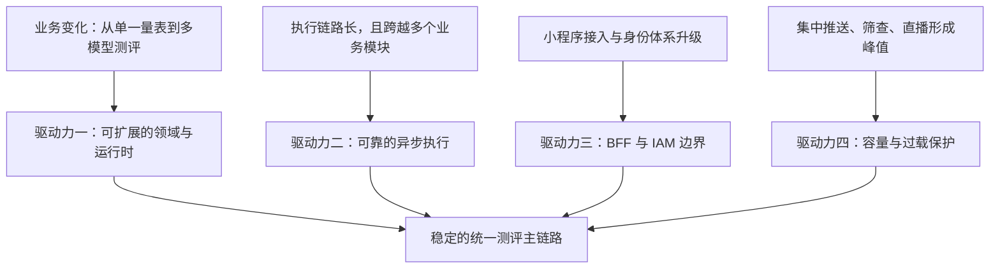
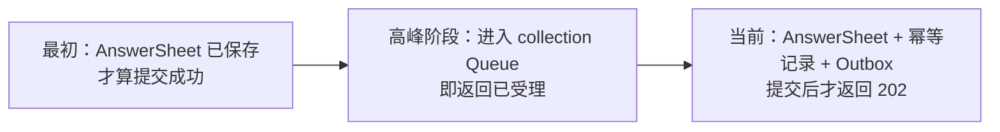

# 架构驱动力与设计目标

> 状态：已实现与规划改造并存。
>
> 本文从项目整体角度回答：qs-server 为什么形成今天的架构、哪些问题真正驱动了关键设计、系统在发生冲突时优先保护什么，以及哪些能力已经实现、哪些仍是明确的演进目标。
>
> 本文不把“DDD、事件驱动、L1+L2、限流、背压”当作目标本身。它们是对业务变化和质量属性要求的响应。具体领域模型、调用链和基础设施实现由后续文档展开。

## 1. 本文要回答的问题

读完本文，应当能够回答以下问题：

1. qs-server 最重要的架构驱动力是什么？
2. 为什么“支持多种测评模型”比“高并发”更早、更核心？
3. 什么可以通过配置接入，什么必须通过代码扩展点接入？
4. 为什么项目从一开始就选择事件驱动，而不是同步完成计分和报告？
5. “提交成功”为什么从队列受理重新收敛为答卷与 Outbox 已经持久化？
6. collection-server 为什么独立存在，它与普通 API 网关有什么区别？
7. IAM 接入后，qs-server 为什么不再自己解释微信身份和组织 User？
8. 300 QPS 压测真正推动了哪些设计，哪些能力其实更早已经存在？
9. 当快速响应、可靠性、单请求成功率和系统整体稳定性发生冲突时，系统如何取舍？
10. 如何判断一个已经受理但没有完成的测评停在哪一步，又应当怎样恢复？
11. 当前架构还缺少哪些能力，为什么这些不足值得被明确记录？

## 2. 三十秒结论

qs-server 的第一架构驱动力不是高并发，而是测评业务从单一医学量表向医学量表、人格测评和行为能力测评扩展后，旧有“固定表单 + 硬编码解析”模式无法继续支撑变化。

项目因此首先建立了 `survey -> modelcatalog -> evaluation -> interpretation` 的领域边界：问卷负责收集作答，模型目录负责表达可发布的测评知识，Evaluation 负责执行机制中立的评估，Interpretation 负责基于冻结结果生成报告。

围绕这条主线，系统形成了四个核心架构驱动力：

1. **多测评模型扩展**：同类测评应当通过配置接入，异类测评应当通过稳定扩展点接入，统一执行主链路不应反复修改。
2. **快速响应与可靠异步执行**：答卷保存、评分、因子计算和报告生成不属于同一个工作单元，提交请求不应等待整条链路完成，但 202 必须建立在可靠受理之上。
3. **小程序 BFF 与统一身份边界**：collection-server 承担面向小程序的协议、身份投影和流量保护，IAM 负责统一身份事实，qs-server 只保留测评领域所需的参与者关系。
4. **峰值流量与运行质量**：Plan 集中推送、校内筛查和线上直播会形成突发流量，系统必须减少高频读链路成本、控制入口容量并保护数据库等关键依赖。

这四个驱动力最终收敛为六项设计目标：

- 模型扩展边界稳定；
- 进程、领域与身份职责清晰；
- 答卷可靠受理；
- 异步执行可治理；
- 峰值流量下保护系统整体；
- 历史测评结果可复现。

其中，可靠受理、分阶段执行状态、有限业务重试、`manual_required`、Evaluation/Interpretation Retry 与 Force Retry、Outbox Replay 和运输死信治理已经实现；统一执行旅程仍属于规划改造。



## 3. 架构不是一次设计完成的

qs-server 的架构不是从一张完整蓝图直接实现出来的。它既包含项目初期的主动设计，也包含业务扩展、身份系统升级、压测和可靠性事故推动的持续修正。

理解这段演进很重要，因为它能够区分三类事实：

- **架构驱动力**：系统必须解决的持续性问题；
- **设计目标**：系统希望长期维持的性质和边界；
- **具体机制**：某一阶段用于达成目标的实现方案，可以被替换。

例如，峰值流量是架构驱动力，保护系统整体是设计目标，而 SubmitQueue 只是历史上使用过的一种具体机制。当前答卷可靠受理重构已经移除了进程内队列对 202 语义的承担，但峰值流量和过载保护目标并没有消失。

### 3.1 从纸质量表到 PHP 简易系统

纸质量表阶段最直接的问题是填写成本高、结果难以回收、计分依赖人工，并且门诊结束后缺少持续随访手段。

PHP 简易系统解决了在线填写、自动计分、报告生成和医生查看结果，但其实现仍接近：

```text
固定表单 + 每个测评一套硬编码解析 + 每个报告一套专用页面
```

这种方案能够快速交付第一批量表，却把测评知识和应用代码绑定在一起。新增问卷、因子、常模或测评模型时，研发必须修改程序并重新发布。

因此，qs-server 需要解决的已经不再是“如何把一张量表放到线上”，而是“如何让一组持续变化的测评知识进入同一平台”。这构成第一架构驱动力。

### 3.2 从自建微信身份到 IAM

qs-server 项目初期曾经在自身边界内解析微信小程序身份，并自行组织 User。与此同时，公司的身份体系也经历了从 PHP 身份逻辑到 IAM 统一身份认证系统的升级。

继续由 qs-server 维护微信身份会产生三类问题：

- 认证协议、登录方式和身份生命周期与测评领域耦合；
- 多个业务系统可能重复创建和解释同一用户；
- 组织、角色、授权与测评参与者关系难以区分。

因此，系统后来把认证和统一用户事实交给 IAM。qs-server 不再试图拥有“公司范围内的 User”，而是只保存测评业务需要的 Actor 关系，例如受试者、填写人、医生以及它们与组织的关系。

collection-server 则保留面向小程序的 BFF 职责：接收前端友好的 REST 请求，基于 IAM 身份形成测评调用所需的上下文，并转换为内部 gRPC 调用。

### 3.3 事件驱动从项目初期就存在

事件驱动不是在同步链路性能不足后才补上的机制，而是项目初期的主动架构选择。

原因是一次测评至少包含：

1. 保存答卷；
2. 创建或确认 Assessment；
3. 计算答案、因子和结果；
4. 持久化 Evaluation Outcome；
5. 根据 Outcome 生成 Interpretation Report；
6. 更新查询状态和其它读侧投影。

这些步骤耗时不同、失败原因不同，也分别属于 Survey、Evaluation 和 Interpretation 等模块。把它们放进一个同步请求，会让一次局部失败拖垮整个提交链路，也会迫使多个模块共享同一个事务幻觉。

因此，项目从一开始就希望在答卷提交后快速返回，让后续测评结果异步产生。

但“快速返回”经历了重要的语义修正：



进程内 Queue 能够吸收短时流量，但它不是持久化消息队列。进程退出、实例故障或队列中的任务失败，都可能让“已经返回 202”的请求缺少可靠业务事实。

当前设计重新把 202 的含义收敛为：

> 答卷、幂等记录和 `answersheet.submitted` Outbox 已经在同一 Mongo 事务中持久化。后续评分与报告可以异步完成，但系统不再用“请求已经进入内存”冒充“业务已经可靠受理”。

### 3.4 300 QPS 攻关推动了定向优化，而不是凭空创造所有保护机制

峰值流量风险来自三个实际场景：

- Plan 在相近时间集中向患者推送测评；
- 校内筛查活动中，同一学校的参与者可能集中进入；
- 线上直播推送测评时，会在短时间产生明显峰值。

项目在正式 300 QPS 混合压测前，已经先后引入：

- 2025-12-25：问卷等数据的 Redis 缓存层；
- 2026-01-06：API 限流；
- 2026-01-06：历史 SubmitQueue；
- 2026-01-06：MySQL、Mongo 和 IAM 下游背压；
- 2026-04：统一缓存平台与 Resilience Plane；
- 2026-06-08：正式 300 QPS 混合场景压测工具和 SOP。

因此，不能把历史写成“300 QPS 压测后一次性设计了 L1+L2、限流和背压”。更准确的事实是：已有保护机制提供了基础，压测负责把瓶颈量化，并推动针对性优化。

压测初期先暴露了 Mongo/Outbox 资源争用和 SubmitQueue 容量问题。处理这些前置问题后，问卷查询成为决定性的读链路瓶颈：

| 档位 | Query 压力 | 当时结果 |
| --- | ---: | --- |
| `mixed_200` | 92/s | 通过 |
| `mixed_220`，无 collection L1 | 102/s | 失败率约 0.56%～5.61%，query p95 约 8.8～30s |
| `mixed_240`，无 collection L1 | 112/s | 增加 VU 后失败率反而上升，说明下游已经饱和 |
| `mixed_220`，上线 collection L1 | 102/s | 100% 通过，query p95 约 172ms |

apiserver 当时已经具有 Redis L2，但每个 collection 请求仍然需要经过 gRPC、序列化、apiserver 处理和 DTO 转换。项目因此在 collection-server 增加问卷 REST DTO 进程内 L1，命中时直接跳过整段远程调用。

问卷 L1 验证有效后，这种局部优化才继续发展为目录缓存、预热、singleflight、L1 peek、并发准入和缓存能力治理。

这段历史体现的不是“使用了两级缓存”，而是一个更重要的设计方法：

> 先通过可观测压测定位真实瓶颈，再把已经被数据证明有效的局部方案抽象为通用能力。

## 4. 架构驱动力一：多测评模型扩展

> 优先级：第一架构驱动力。

### 4.1 驱动问题

当前完整业务类型包括：

- 医学量表测评；
- 人格测评；
- 行为能力测评。

它们共享问卷、作答、受试者、填写人、测评发起、结果查询等基础流程，但在专业知识和执行方式上存在真实差异。

例如：

- 医学量表可能进行因子汇总、常模转换和风险区间判断；
- 人格测评可能根据多个维度组合产生类型结果；
- 行为能力测评可能处理观察者评分，也可能处理任务表现、正确率或能力结论。

如果每增加一种测评都复制一条完整链路，系统会重新回到 PHP 简易系统的硬编码模式；如果强行把所有测评压进一个万能模型，又会制造大量可选字段、类型判断和无法维护的条件分支。

### 4.2 设计边界

项目采用的核心边界是：

> 让同类测评配置化接入，让异类测评通过稳定扩展点接入，并保护统一执行主链路不被反复修改。

这里必须区分“同类变化”和“异类变化”。

#### 同类变化

同一种测评机制下，以下内容原则上应通过配置或发布快照进入系统：

- 问卷、题目、选项和展示顺序；
- 题目与因子的映射；
- 因子和结果定义；
- 常模表；
- 阈值、区间和解释规则；
- 报告模板与展示配置；
- 同一算法族所需的参数。

这类变化不应要求开发者为每个新量表增加一套新的应用服务。

#### 异类变化

当新测评引入新的执行语义时，例如：

- 新的输入快照结构；
- 新的评分或组合算法；
- 新的结果形态；
- 新的报告构建机制；

系统允许增加明确的 descriptor、executor、registry entry 或 builder，但新增能力必须接入既有的 Assessment、EvaluationRun、Outcome 和 ReportGeneration 主链路，而不是复制一条平行系统。

### 4.3 DDD 在这里解决什么

DDD 的价值不在于给目录增加 `domain` 文件夹，而在于隔离不同变化来源：

| 模块 | 主要拥有的变化 |
| --- | --- |
| Survey | 问卷结构、题型、答案值、问卷版本和答卷事实 |
| ModelCatalog | 测评定义、可执行发布快照、机制身份和运行时描述 |
| Evaluation | Assessment 生命周期、EvaluationRun、执行路由和 Outcome |
| Interpretation | ReportGeneration、InterpretationRun、报告构建与报告查询 |
| Actor | 受试者、填写人、医生等测评参与者关系 |
| Plan | 周期性测评安排和任务生成 |
| Statistics | 从事实派生统计与趋势读模型 |

领域拆分让 Survey 可以扩展题型，让 ModelCatalog 可以扩展测评模型，让 Evaluation 和 Interpretation 围绕稳定的执行事实工作，而不必让所有模块都理解每一种具体量表。

### 4.4 不追求什么

平台不追求：

- 让任意调查表都无需建模即可进入系统；
- 用一个通用 JSON 结构消除所有类型差异；
- 让新增任何异类算法都完全不修改代码；
- 为了“通用”而牺牲测评规则的明确性和可验证性。

可扩展不等于无边界。系统追求的是可预期的变化成本，而不是零代码幻想。

## 5. 架构驱动力二：快速响应与可靠异步执行

> 优先级：核心业务链路驱动力。

### 5.1 为什么不做同步到底

答卷提交与评分、解释、报告生成不属于同一个业务工作单元：

- Survey 负责确认并保存作答事实；
- Evaluation 负责基于发布模型执行评估；
- Interpretation 负责根据冻结 Outcome 生成报告；
- Statistics 和其它投影负责后续读侧更新。

同步到底会产生以下问题：

- 提交延迟由最慢的报告步骤决定；
- 任一后续依赖失败都会让用户误以为答卷没有保存；
- 客户端重试可能重复制造业务事实；
- 模块之间被迫共享跨数据库事务假象；
- 高峰期间长请求会占用连接、线程和下游资源。

因此，正确的交互不是“提交请求立即返回完整报告”，而是：

```text
可靠受理 AnswerSheet
  -> 返回 202 + AnswerSheetID
  -> 异步创建 Assessment
  -> 异步执行 Evaluation
  -> 异步生成 Interpretation Report
  -> 客户端查询或订阅状态
```

### 5.2 202 的可靠性原则

当前 202 契约为：

```text
AnswerSheet
+ writer-scoped idempotency record
+ answersheet.submitted Outbox
--------------------------------
同一个 Mongo 事务提交成功
```

只有这个事务完成后，collection-server 才返回 `202 Accepted`。

这条原则解决两个不同问题：

- **快速响应**：不等待评分和报告；
- **可靠受理**：已经返回 202 的答卷不会只停留在进程内存中。

快速返回不能通过削弱“成功”的语义获得。系统宁可在依赖不可用时返回 503，让客户端使用同一个幂等键重试，也不能对尚未持久化的答卷返回成功。

### 5.3 事件驱动的交付语义

当前核心可靠事件包括：

```text
answersheet.submitted
  -> evaluation.requested
  -> evaluation.outcome.committed | evaluation.failed
  -> interpretation.report.generated | interpretation.report.failed
```

业务事实和对应 Outbox 在各自本地数据库事务中提交。Outbox Relay 负责将事件投递到 MQ，Worker 通过 internal gRPC 驱动相应模块用例。

该设计提供的是可治理的 at-least-once，而不是 exactly-once：

- MQ 已收到事件但 Outbox 尚未标记完成时，事件可能再次发布；
- Worker handler 返回错误时，消息会 NACK 并重新投递；
- 消费者必须通过业务键、Run claim、租约或幂等提交抵抗重复；
- 无法识别但格式合法的未知事件会 ACK，避免无意义重投；
- 无法解析的 poison message 会 NACK，在有界运输预算耗尽后进入独立死信，不能因一次解码失败直接丢失证据。

### 5.4 为什么重试不能只交给 MQ

异步链路中的“失败”至少分成四个责任层次：

| 层次 | 失败含义 | 主要恢复责任 |
| --- | --- | --- |
| Evaluation / Interpretation | 一次业务执行没有产生成功事实 | Run 持久化处置，决定自动重试、人工介入或终止 |
| Outbox 发布 | 业务事实已经提交，但事件尚未送达 MQ | Outbox 保留事件并按独立预算重新发布 |
| MQ 运输与消费 | 消息尚未被消费者成功结算 | 有界 NACK；耗尽后保存运输死信 |
| 自动重试暂停 | 重试事件本身有效，但运维开关暂时禁止自动执行 | 先持久化 hold，再 ACK 原消息，恢复后重放 |

如果所有失败都只依赖 MQ 重投，暂时性 gRPC 故障、确定性模型错误、自动重试预算耗尽和 poison message 就会被混成同一种错误。结果要么无限重试，要么过早 ACK 丢失处理证据。

因此，qs-server 采用的原则是：

> 业务模块持久化业务处置，Outbox 管理可靠出站，消息层管理运输结算，System Governance 管理需要人承担责任的恢复动作。

这四层共享统一术语和治理视图，但拥有不同预算、状态和重放不变量。具体表结构、退避计算和结算实现留在 `docs/03-基础设施/event` 说明。

### 5.5 为什么不追求跨库大事务

AnswerSheet 位于 Mongo，Assessment、EvaluationRun 和 Outcome 等事实涉及 MySQL，Interpretation 生命周期和报告又使用 Mongo。用一个跨库事务包裹全部步骤，不仅实现复杂，也会让一次报告生成失败反向否定已经成立的答卷事实。

系统采用的原则是：

> 每个模块在自己的本地事务中可靠提交事实和出站事件，再通过幂等消费推动下一阶段。

这承认分布式执行存在中间状态，并通过状态、重试和补偿管理这些状态，而不是假装所有步骤同时完成。

## 6. 架构驱动力三：小程序 BFF 与统一身份边界

> 优先级：接入与职责边界驱动力。

### 6.1 collection-server 的第一原因

collection-server 最初独立出来的首要原因，是承接小程序 BFF 和身份转换，而不是高并发。

它负责：

- 面向小程序提供稳定的 REST 契约；
- 把 IAM 身份映射为测评调用需要的填写人、受试者和组织上下文；
- 聚合前端所需的模型、问卷、测评和报告数据；
- 把 REST DTO 转换为内部 gRPC 请求；
- 提供答卷提交、Assessment Readiness、报告状态等前台旅程接口；
- 在面向公网的入口执行限流、并发准入和快速失败。

它不负责：

- 拥有 AnswerSheet、Assessment、Outcome 或 Report 等主业务聚合；
- 直接写 qs-apiserver 的业务数据库；
- 决定测评模型怎样评分；
- 替代 IAM 成为统一身份系统；
- 直接推进 Evaluation 或 Interpretation 状态机。

### 6.2 为什么它不只是 API Gateway

普通网关擅长 TLS、路由、粗粒度认证和通用限流。collection-server 还需要理解：

- 谁是当前填写人；
- 受试者是谁；
- 填写人与受试者之间是否具有可用关系；
- 问卷提交 DTO 如何转换；
- AnswerSheetID 如何继续解析为 AssessmentID；
- 不同模型的报告状态和前端展示入口是什么。

这些属于业务接入层知识，因此 collection-server 是 BFF，而不是简单反向代理。

### 6.3 IAM 与 Actor 的边界

IAM 负责：

- 用户身份认证；
- 登录方式和会话；
- 统一用户标识；
- 组织、角色和授权事实。

qs-server 的 Actor 模块负责：

- 哪个用户在测评语境中是受试者；
- 哪个用户是填写人；
- 哪个操作者是医生或运营人员；
- 这些参与者与测评、组织和访问关系如何关联。

两者的关系不是“qs-server 把 User 搬到 IAM 后什么都不保存”，而是：

> IAM 拥有身份事实，qs-server 拥有测评领域中的参与者关系。

## 7. 架构驱动力四：峰值流量与运行质量

> 优先级：后续形成的质量属性驱动力。

### 7.1 容量目标不是平均流量

系统面对的风险不是长期稳定高流量，而是集中触发：

- Plan 同时生成或推送大量任务；
- 学校筛查活动集中扫码填写；
- 线上直播集中推送同一测评。

因此，容量设计需要同时关注：

- 短时入口峰值；
- 高频目录和问卷读取；
- 答卷可靠写入；
- Worker 后台消费能力；
- Outbox 在压测结束后的排水时间；
- 慢请求造成的 VU、连接和下游资源放大。

### 7.2 明确的质量属性场景

质量目标必须写成可观察场景，而不是“高性能、高可用”的口号。

| 场景 | 目标 | 当前状态 |
| --- | --- | --- |
| 300 QPS 混合流量 | 覆盖查询、提交、报告状态、统计与异步链路 | 设计目标；当前档位、环境和最新结果以压测 SOP 为准 |
| 答卷提交 | 成功率大于 99%，p95 小于 500ms | 设计目标；必须以真实环境压测验证 |
| 已返回 202 | AnswerSheet 与 Outbox 已经持久化 | 已实现 |
| 高频问卷查询 | 优先命中 collection L1，其次 apiserver Redis L2，保护 Mongo | 已实现 |
| Redis 或缓存整体不可用 | 不允许高峰流量无保护地回源数据库 | 部分实现，仍需按接口完善固定响应或快速拒绝策略 |
| MQ 短暂不可用 | Outbox 积压，恢复后继续投递 | 已实现 |
| Worker 重复消费 | 不重复创建主业务事实 | 已实现，依赖幂等、Run claim 与租约 |
| 长期失败 | 能按组织查询业务 Run、Outbox、retry hold 与运输死信候选，并通过受审计动作恢复 | 分阶段治理已实现；统一跨阶段旅程视图仍待建设 |

300 QPS 是容量目标和攻关场景，不代表任何机器规格、任何业务配比下都已经稳定通过。现行容量结论必须回到压测配置、机器规格和最新报告判断。

### 7.3 缓存、限流、背压和降级分别解决什么

| 机制 | 主要问题 | 不能替代什么 |
| --- | --- | --- |
| L1 | 消除高频 BFF 到 apiserver 的远程调用和 DTO 转换 | 不能作为跨实例权威事实 |
| L2 | 跨实例复用数据并保护数据库 | 不能消除 collection 到 apiserver 的调用成本 |
| 限流 | 控制单位时间允许进入的请求 | 不能降低已放行请求的单次成本 |
| 并发准入/背压 | 限制同时占用下游资源的请求数 | 不能代替业务幂等和可靠持久化 |
| 降级 | 依赖异常时提供有限响应或快速失败 | 不能悄悄返回错误的业务事实 |
| 预热 | 降低发布、启动或热点切换时的冷缓存冲击 | 不能代替失效和版本策略 |

### 7.4 为什么缓存故障时不能无保护回源

缓存整体不可用时，如果所有流量直接进入数据库，可能让一个局部缓存故障升级为数据库耗尽和全站故障。

系统优先级应当是：

1. 保护主业务数据库和可靠写入链路；
2. 对可提供有限静态内容的接口返回固定或降级数据；
3. 对不能安全降级的高流量接口快速拒绝，并返回明确的重试建议；
4. 只允许经过严格容量控制的小流量回源。

“尽量让每个请求成功”不能高于“避免系统整体崩溃”。

## 8. 重要业务约束，但不是独立架构驱动力

以下内容非常重要，但它们更适合作为业务约束或不变量，而不是单独拔高为架构驱动力。

### 8.1 测评不是医学诊断

qs-server 的结果只能为医生判断、治疗观察和诊后随访提供辅助信息，不能替代医生给出医学诊断。

这条约束影响报告措辞、风险展示和权限设计，但它不会单独决定系统采用三进程、事件驱动或缓存架构。

### 8.2 已完成历史结果不能漂移

已完成测评和报告必须保留当时使用的：

- 问卷版本；
- 测评模型与运行时身份；
- 规则和输入快照引用；
- Evaluation Outcome；
- 报告模板版本和最终报告事实。

运营发布新版本后，不能改变已经完成的历史结果。

### 8.3 Plan 使用最新发布版本

Plan 当前只记录测评 `code`，不固定某一发布版本。每次任务实际执行时使用当时最新发布版本。

这一策略在当前业务中可以接受，是因为量表因子在正式使用后变化较小，通常只在早期发生微调。

但该策略仍有明确边界：

- 单次已经开始或完成的测评必须冻结实际使用版本；
- Plan 跨周期比较依赖稳定的因子身份；
- 如果未来出现因子增删、算法大改或跨版本不可比，Plan 需要升级为显式版本策略，而不能继续只依赖 `code`。

### 8.4 持续随访需要比较因子趋势

Plan 不只是重复生成独立报告。业务需要比较同一受试者在不同时间点的因子变化趋势。

因此，历史事实、因子身份和统计投影必须能够支持跨测评比较，但趋势读模型不能反向修改历史 Outcome。

## 9. 架构设计目标

### 9.1 目标一：模型扩展边界稳定

> 同类测评配置化接入，异类测评通过稳定扩展点接入，统一执行主链路不因每个新模型反复修改。

验收问题：

- 新增同机制量表时，是否只需维护问卷、模型、因子、常模和报告配置？
- 新增异类机制时，是否有明确的 descriptor、executor、registry 或 builder 接口？
- 新模型是否仍然复用 Assessment、Run、Outcome 和 ReportGeneration 生命周期？
- Evaluation 是否仍然不需要理解前端展示细节？
- Interpretation 是否只读取冻结 Outcome，而不重新计算评分？

### 9.2 目标二：进程、领域与身份职责清晰

> collection-server 负责 BFF 与入口保护，qs-apiserver 拥有主业务事实，qs-worker 负责异步驱动；IAM 拥有身份事实，Actor 拥有测评参与者关系。

关键不变量：

- collection-server 不直接写主业务数据库；
- qs-worker 不直接修改业务 repository，而是通过 internal gRPC 调用应用服务；
- Survey 不负责评分和报告；
- Evaluation 不拥有报告成品；
- Interpretation 不重新解释原始答卷以计算 Outcome；
- qs-server 不重新实现 IAM 的认证、用户和授权体系。

### 9.3 目标三：答卷可靠受理

> 202 只表示答卷事实已经可靠保存，不表示测评和报告已经完成。

可靠受理必须满足：

- 客户端提供安全的幂等键；
- 重复请求复用相同业务结果；
- 相同幂等键对应不同内容时返回冲突；
- AnswerSheet 与 Outbox 在同一事务中提交；
- 提交结果不确定时，只在重新确认事实存在后返回成功；
- 未完成持久化时返回可重试错误，而不是虚假 202。

### 9.4 目标四：异步执行可治理

> 任何已经可靠受理的答卷，都应当能够定位当前阶段、最近一次执行和失败原因；可恢复失败由系统自动重试，不能自动恢复的失败进入受权限和审计保护的人工补偿。

#### 9.4.1 当前分阶段事实

| 阶段 | 主要事实 | 已有恢复机制 |
| --- | --- | --- |
| 答卷受理 | AnswerSheet、幂等记录、Mongo Outbox | 相同幂等键重试 |
| Assessment 创建 | `answersheet.submitted`、Assessment | Outbox Relay、MQ NACK、Ensure 幂等 |
| Evaluation | Assessment、EvaluationRun、Outcome | Run claim、lease、retryable attempt、人工 Retry |
| Interpretation | ReportGeneration、InterpretationRun、Report | 生成键幂等、lease、retryable attempt |
| 事件出站 | Mongo/MySQL Outbox | pending/failed/stale publishing 自动重试 |
| 重试暂停 | retry event hold | 恢复自动开关后重放；耗尽后转人工治理 |
| 运输耗尽 | delivery dead letter | 按组织查询并由治理动作授权重放 |

#### 9.4.2 恢复原则

恢复不是从头重做整条流程，而是：

> 找到最近一个已经可靠提交的业务事实，从它之后继续。

因此：

- AnswerSheet 已存在时，不重新提交答卷；
- Assessment 已存在时，不重复创建 Assessment；
- Outcome 已存在时，不重新计算成功结果，而应继续生成或修复报告；
- Report 已存在时，直接复用报告事实；
- 状态投影与事实不一致时，执行投影修复，而不是重新触发业务动作。

#### 9.4.3 自动重试与人工补偿

`retryable` 的含义应当是：

| 最新失败 | 自动重试 | 人工操作 |
| --- | --- | --- |
| `retryable=true` | attempt 小于策略上限时允许；达到上限后停止 | 仅 `manual_required` 允许普通 Retry |
| `retryable=false` | 禁止 | `terminal` 修复后允许 Force Retry |
| 没有 Run 或状态不一致 | 禁止 | 先诊断或修复数据，不能直接重试 |
| 已成功或仍有有效 lease | 禁止 | 拒绝重复执行 |

高风险补偿统一通过 System Governance 暴露：

- System Governance 负责权限、明确确认、操作原因、请求幂等和审计；
- Evaluation、Interpretation 和 Event 模块各自拥有恢复不变量；
- Governance 调用模块提供的恢复命令，不直接修改业务数据库；
- 人工补偿创建新的执行尝试，不能删除或覆盖历史失败记录。

#### 9.4.4 Outbox 与业务执行采用不同重试策略

Outbox 和业务执行不能使用同一个无限重试规则。

**Outbox 发布失败**表示已经提交的业务事实尚未送出对应事件。Outbox 使用独立于业务执行的有界退避策略；预算耗尽或发生永久性编码/配置错误后进入 `manual_required`。事件不会被删除，只能通过带 attempt CAS 的治理 Replay 授权一次发布。

**Evaluation/Interpretation 执行失败**可能来自确定性配置错误、模型错误或程序缺陷。它们应当设置最大自动尝试次数；达到上限后进入 `manual_required`，等待人工诊断。

当前 Evaluation 与 Interpretation 的失败事务会同时持久化 RetryDecision，并为 automatic 决策写入确定性 retry event；Worker 对已形成持久化处置的业务失败 ACK 原消息。

#### 9.4.5 Worker 结算不能覆盖业务处置

Worker 只根据“是否已经形成持久化处置”决定当前运输消息怎样结算：

- Evaluation/Interpretation 已持久化 `automatic`、`manual_required` 或 `terminal` 时，ACK 当前消息；
- 自动重试紧急开关关闭时，必须先把重试事件写入持久化 hold，成功后才 ACK；
- hold 保存失败、依赖调用失败或消息无法解码时 NACK；
- 未知但可正常解析的事件 ACK；
- 运输投递预算耗尽后写入独立 dead letter，不能冒充业务 Run 失败。

这保证业务 attempt、Outbox publish attempt、hold replay attempt 和 transport delivery attempt 不会被混成一个计数器。

### 9.5 目标五：峰值流量下保护系统整体

> 在峰值和依赖故障时，系统优先保护可靠写入、数据库和整体可用性，而不是无条件追求单个请求成功。

设计要求：

- 高频静态和目录查询优先命中 L1/L2；
- 同一热点 miss 通过 singleflight/coalescing 合并；
- 入口使用限流和并发准入控制放行流量；
- MySQL、Mongo、IAM 等依赖具有独立的并发预算和超时；
- 缓存整体异常时，高流量接口不能无保护回源数据库；
- 能安全提供固定数据的接口可以有限降级；
- 无法安全降级时快速拒绝，并携带明确重试语义；
- 压测同时观察 HTTP 指标、Outbox 排水和 Worker 异步 SLA。

### 9.6 目标六：历史结果可复现

> 新版本可以改变未来测评，但不能改写已经完成的历史事实。

系统需要保留并关联：

- 实际使用的问卷 code/version；
- 发布模型和运行时身份；
- EvaluationRun 的输入快照引用；
- 不可变 Evaluation Outcome；
- ReportGeneration 的 report type/template version；
- 最终 InterpretReport；
- 用于趋势比较的稳定因子身份。

“可复现”不等于允许使用当前最新配置重新计算后覆盖历史结果。必要的重新计算应当产生新的、可审计的执行事实，并明确它与原结果的关系。

## 10. 发生冲突时如何取舍

架构目标只有在冲突中才能体现优先级。

### 10.1 可靠受理高于极端低延迟

如果必须在“先进入内存队列立即返回”和“等待 AnswerSheet + Outbox 事务提交”之间选择，系统选择后者。

提交 p95 小于 500ms 是重要质量目标，但不能通过把 202 提前到持久化之前实现。

### 10.2 系统整体稳定高于单请求成功

当 Redis、Mongo、MySQL 或 IAM 异常时，盲目回源或无限排队可能让局部故障升级为整体崩溃。

系统允许快速拒绝或有限降级，但不能让未受控流量绕过保护层。

### 10.3 历史事实高于最新配置一致性

运营发布新模型后，新任务可以使用新版本；已经完成的测评必须继续保留当时结果，不能为了“全系统都使用最新版”而修改历史。

### 10.4 明确扩展点高于万能抽象

当新测评拥有真正不同的输入、算法和结果语义时，系统允许增加新 executor 或 builder，而不是把差异隐藏在不断膨胀的通用结构中。

### 10.5 可治理的 at-least-once 高于 exactly-once 幻觉

跨数据库、MQ 和多个进程实现端到端 exactly-once 成本极高，也容易把重复窗口隐藏起来。

系统选择明确承认重复投递，通过业务幂等、Run claim、租约和原子提交控制副作用。

## 11. 关键替代方案及未采用原因

### 11.1 每种测评开发一套独立功能

优点是初期直接、单个需求交付快；缺点是问卷、评分、结果和报告持续重复，新增测评边际成本不断增加，也无法形成统一运行和治理能力。

该方案适合验证第一个测评，不适合平台长期演进。

### 11.2 使用一个万能测评模型

优点是表面接口统一；缺点是大量可选字段、运行时类型判断和隐式约定会把真实差异藏进配置，最终让配置比代码更难验证。

qs-server 选择“稳定主链 + 显式机制扩展”，而不是“所有差异都塞进一个 Schema”。

### 11.3 在答卷请求内同步完成评分和报告

优点是客户端一次请求得到最终结果；缺点是延迟高、失败耦合、重试危险，并且无法合理表达各模块独立的事务边界。

该方案不符合门诊、筛查和直播峰值下的运行要求。

### 11.4 进入进程内 Queue 即返回 202

优点是入口吞吐高、实现简单；缺点是进程退出会丢失尚未处理的请求，无法满足“已返回 202 的答卷不能丢失”。

该方案曾经使用，但已经被当前可靠受理语义替代。

### 11.5 缓存不可用时全部回源数据库

优点是单个请求仍有机会成功；缺点是峰值期间可能让数据库连接、CPU 和 IO 同时耗尽，把缓存故障扩大为全站故障。

系统只允许在严格并发预算下小流量回源，高流量接口应优先固定降级或快速拒绝。

### 11.6 自动修复所有检测到的不一致

优点是表面上减少人工介入；缺点是系统可能无法区分“缺少结果”“结果已经存在但状态未投影”“事件尚在路上”和“数据已经损坏”。错误的自动重提可能制造重复 Outcome 或覆盖历史事实。

因此，一致性巡检应先识别和分类；只有证据充分、动作幂等且不变量明确的场景才能自动修复。

## 12. 当前实现与演进目标

本节防止把目标写成现状。

| 能力 | 状态 | 说明 |
| --- | --- | --- |
| AnswerSheet + 幂等记录 + Outbox 原子提交 | 已实现 | 当前 202 的可靠边界 |
| collection Assessment Readiness | 已实现 | 能判断 Assessment 是否已创建，但 pending 原因仍不够细 |
| Mongo/MySQL Outbox Relay | 已实现 | 支持 pending、failed、stale publishing 恢复 |
| Worker 消息结算 | 已实现 | 已持久化业务处置 ACK；未知事件 ACK；poison/未分类故障有界 NACK；耗尽进入运输死信 |
| 自动重试紧急暂停 | 已实现 | 重试事件先进入持久化 hold 再 ACK，恢复后由 replayer 继续；hold 失败则 NACK |
| EvaluationRun attempt、claim、lease | 已实现 | 支持三次自动预算、处置持久化、重复抑制和同 attempt 过期租约恢复 |
| Evaluation 人工 Retry / Force Retry | 已实现 | System Governance 按 latest Run、expected_attempt 和 request_id 授权一次 |
| Interpretation Generation/Run | 已实现 | 支持生成幂等、三次自动预算、人工授权和 lease recovery |
| System Governance Retry/Outbox/Delivery 诊断 | 已实现 | 提供计数、组织隔离候选分页、动作审计和结果重放 |
| 统一执行旅程 | 规划改造 | 需要从 AnswerSheetID/AssessmentID 还原跨阶段状态 |
| 有界业务自动重试 | 已实现 | Evaluation/Interpretation 使用独立策略和硬上限；当前数值以配置与持久化策略快照为准 |
| `manual_required` | 已实现 | 作为附加治理处置持久化，不扩张业务状态枚举 |
| Evaluation Force Retry | 已实现 | 仅 terminal latest Run，要求 confirm、reason、request_id 并审计 |
| Interpretation Retry | 已实现 | 与 latest Generation/Run、组织和 expected_attempt 做 CAS |
| Outbox Replay | 已实现 | MySQL/Mongo 各授权一次，不清零 attempt_count、不更换 event_id |
| 运输死信 | 已实现 | Worker 与 apiserver 核心消费者在运输预算耗尽后写独立审计，与 Outbox 发布状态分离 |

## 13. 用质量属性场景验收设计

后续架构评审可以使用以下问题，而不是只检查是否使用某种技术：

### 13.1 模型扩展

```text
当运营新增一种已有机制的医学量表时，
在不修改 Evaluation 主流程的前提下，
通过问卷、模型、因子、常模和报告配置完成发布与执行。
```

### 13.2 异类机制接入

```text
当系统新增一种具有不同算法和结果形态的测评时，
通过显式 descriptor/executor/builder 接入，
继续复用 Assessment、Run、Outcome、ReportGeneration 和治理链路。
```

### 13.3 可靠受理

```text
当客户端提交答卷且 MQ 暂时不可用时，
只要 Mongo 事务成功，系统返回 202；
AnswerSheet 和 Outbox 均保留，MQ 恢复后继续执行。
```

### 13.4 重复提交

```text
当客户端因超时使用相同幂等键重新提交相同内容时，
系统返回同一 AnswerSheet；
如果内容不同，则明确返回冲突。
```

### 13.5 Worker 异常退出

```text
当 Worker 在评分或报告生成期间退出时，
系统能够通过 Run 状态和 lease 判断旧执行是否仍有效；
lease 过期后只创建一个新的 attempt。
```

### 13.6 缓存整体异常

```text
当 Redis 或缓存体系整体不可用且入口仍处于峰值时，
系统通过并发预算、固定降级或快速拒绝保护数据库，
不允许全部流量无保护回源。
```

### 13.7 人工强制恢复

```text
当 retryable=false 的失败原因已经被修复时，
具备权限的管理员提供原因并明确确认，
系统幂等执行 Force Retry，保留原失败 Run，并记录完整审计结果。
```

## 14. 事实来源与深入阅读

### 14.1 全局边界

- [项目背景与业务问题](./01-项目背景与业务问题.md)
- [系统地图](./03-系统地图.md)
- [代码组织与边界](./04-代码组织与边界.md)
- [核心业务链路](./05-核心业务链路.md)
- [源码事实矩阵](./07-源码事实矩阵.md)

### 14.2 领域模型与关键链路

- [Survey](../02-业务模块/10-survey/README.md)
- [ModelCatalog](../02-业务模块/20-model-catalog/README.md)
- [Evaluation](../02-业务模块/30-evaluation/README.md)
- [Interpretation](../02-业务模块/40-interpretation/README.md)
- [Actor](../02-业务模块/50-actor/README.md)
- [Plan](../02-业务模块/60-plan/README.md)

### 14.3 技术机制

- [三进程协作](../01-运行时/00-三进程协作总览.md)
- [IAM 认证与身份链路](../01-运行时/05-IAM认证与身份链路.md)
- [Outbox 可靠出站链路](../03-基础设施/event/03-Outbox可靠出站链路.md)
- [MQ 发布与消费链路](../03-基础设施/event/04-MQ发布与消费链路.md)
- [缓存终局架构与责任边界](../03-基础设施/cache/10-终局架构与责任边界.md)
- [缓存一致性失效与降级](../03-基础设施/cache/40-一致性失效与降级.md)
- [并发与韧性](../03-基础设施/concurrency/README.md)

### 14.4 接口与容量

- [300 QPS 混合场景压测 SOP](../04-接口与运维/11-300QPS混合场景压测SOP.md)
- [QPS 容量档位与资源配置建议](../04-接口与运维/10-QPS容量档位与资源配置建议.md)
- [测评后台接入文档](../04-接口与运维/16-测评后台接入文档.md)

涉及行为或容量变化时，本文不能替代源码、OpenAPI、gRPC proto、`configs/events.yaml`、部署配置和最新压测结果。
