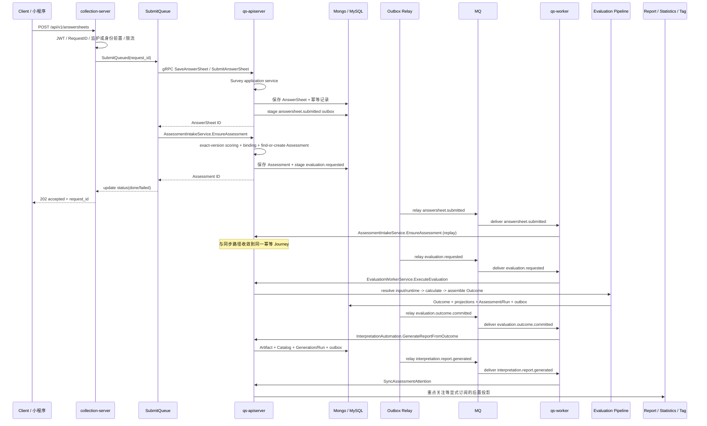
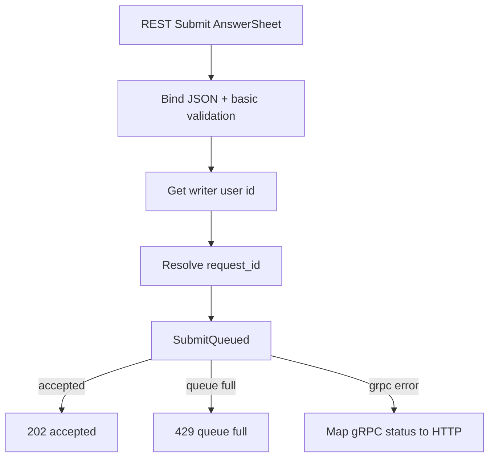
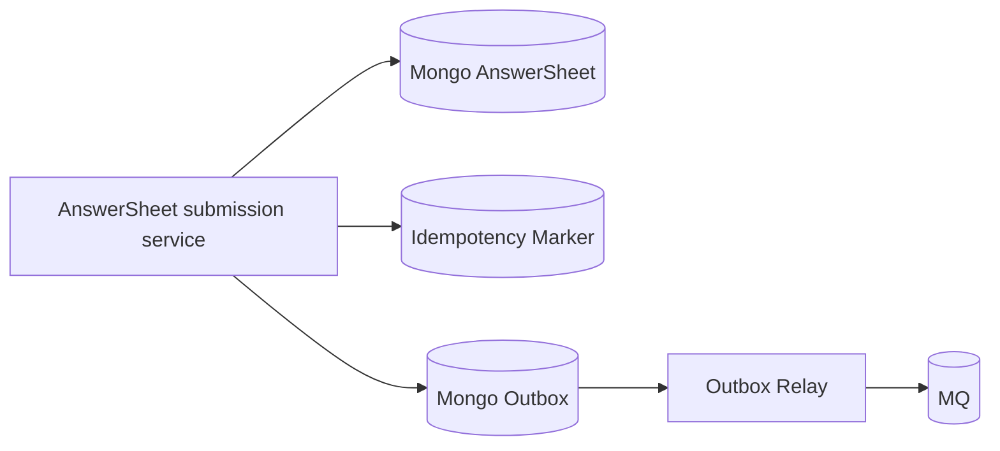
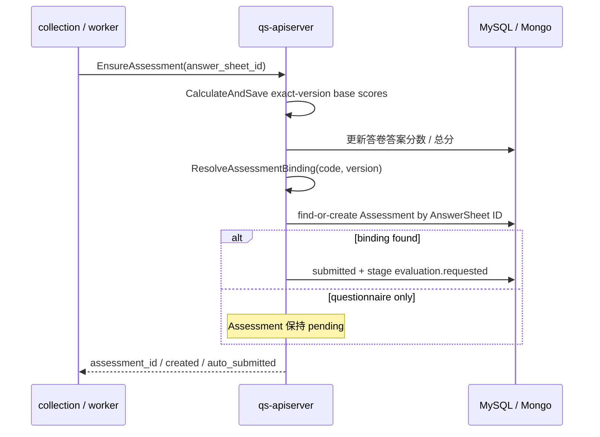
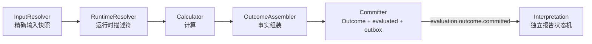
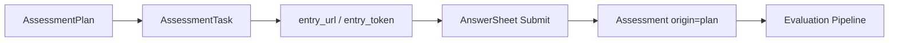

# 核心业务链路

**本文回答**：`qs-server` 中“一次前台答卷提交”如何经过 collection BFF、apiserver 主写模型、事件 outbox、worker 消费、internal gRPC、evaluation pipeline，最终变成可解释、可追踪、可查询的测评结果；同时说明哪些事件、RPC、存储边界和失败分支属于这条主链路。

> 本文是 `qs-server` 的端到端主链路真值文。其它业务模块、事件、运行时、接口与运维文档只摘要本链路中自己负责的阶段，并回链本文，不重复维护完整链路。

---

## 30 秒结论

| 维度 | 结论 |
| ---- | ---- |
| 主业务目标 | 把一次问卷作答，稳定转化为一次可解释、可查询、可追踪的量表测评结果 |
| 同步入口 | 前台请求先进入 `collection-server` REST；collection 做入口治理后经 gRPC 调 `qs-apiserver` |
| 主写模型 | 答卷、测评、报告等权威状态收口在 `qs-apiserver`，不是 collection 或 worker |
| 异步推进 | apiserver 写库后通过事件和 outbox 出站；`qs-worker` 消费事件后再通过 internal gRPC 回调 apiserver |
| 关键事件 | `answersheet.submitted`、`evaluation.requested`、`evaluation.outcome.committed`、`evaluation.failed`、`interpretation.report.generated`、`interpretation.report.failed` |
| 关键 RPC | `EnsureAssessment`、`ExecuteEvaluation`、`GenerateReportFromOutcome`、`SyncAssessmentAttention` |
| 可靠性边界 | durable 事件以 `configs/events.yaml` 的 `delivery: durable_outbox` 为准；collection `request_id` 只服务本地提交队列状态，不等于 durable 幂等 |
| 最容易误读 | worker 不是第二写库入口；SubmitQueue 不是 MQ；Evaluation 不是提交答卷时同步完成 |
| 已确认目标边界 | 组合 REST 提交同步到 Assessment 已持久化；Evaluation 在 `evaluated` 结束；Report 独立生成；客户端完成态由 Journey 投影 |

> 本文主链路图继续描述当前运行代码。目标边界与迁移约束以 [Evaluation / Interpretation 机制内核收敛](../02-业务模块/evaluation-interpretation-core-convergence.md) 为准，不能把待实现设计误写成已经上线的行为。

---

## 主链路全景图



---

## 阶段 0：入口准备与运行时前提

主链路依赖三进程协作：

| 进程 | 在主链路中的位置 | 典型代码入口 |
| ---- | ---------------- | ------------ |
| `collection-server` | 前台 BFF，负责 REST 接入、身份前置、提交削峰、状态查询 | `cmd/collection-server/main.go`、`internal/collection-server/app.go` |
| `qs-apiserver` | 主业务中心，负责领域服务、持久化、事件发布、REST/gRPC | `cmd/qs-apiserver/apiserver.go`、`internal/apiserver/process/*` |
| `qs-worker` | 异步事件消费者，按事件 handler 经 internal gRPC 推进后续步骤 | `cmd/qs-worker/main.go`、`internal/worker/*` |

apiserver 的 `PrepareRun` 已经把运行时分为 `prepare resources -> initialize container -> initialize integrations -> initialize transports -> start background runtimes -> register shutdown callback`。这意味着主链路不是“HTTP handler 直接做完所有事”，而是依赖资源初始化、容器装配、传输注册、后台 relay 和 scheduler 一起工作。

**运行时前提**：

1. apiserver 已初始化 MySQL、Mongo、Redis、MQ publisher、event catalog 和 cache runtime。
2. apiserver container 已装配 Survey、ModelCatalog、Evaluation、Interpretation、Actor、Plan、Statistics、IAM 等模块。
3. apiserver 已启动 REST/gRPC，并注册 internal gRPC service。
4. apiserver 已启动 durable outbox relay。
5. worker 已加载 `configs/events.yaml`，并校验 event handler registry。
6. collection 已能通过 gRPC client 调用 apiserver。

---

## 阶段 1：前台提交答卷

### 1.1 入口语义

前台答卷提交从 collection REST 进入。collection 的职责是“入口治理 + 转调主服务”，不是自己持久化答卷主写模型。

提交链路中的关键语义：

| 项 | 当前语义 |
| -- | -------- |
| HTTP 返回 | collection 提交接口接受后返回 `202 accepted`，表示请求已进入处理流程 |
| `request_id` | collection 本地提交队列状态标识，用于查询 queued / processing / done / failed |
| `idempotency_key` | 业务 durable 幂等键，应由 apiserver durable submit 使用 |
| 队列满 | collection 返回 `429 Too Many Requests` |
| 主写入 | apiserver 写 AnswerSheet、幂等记录和 outbox |

### 1.2 collection 做什么

collection 的 Submit handler 主要做：

1. 绑定并校验请求 DTO。
2. 从上下文读取当前用户。
3. 读取或生成 request_id。
4. 调 `submissionService.SubmitQueued(...)`。
5. 成功时返回 `202 accepted` 和 request_id。
6. 队列满时返回 429。
7. 其它 gRPC 错误按错误码映射 HTTP status。



### 1.3 SubmitQueue 的真实边界

`SubmitQueue` 是 collection 进程内的保护层，不是 MQ，也不是 worker。

| 维度 | 事实 |
| ---- | ---- |
| 实现 | memory channel + goroutine worker pool |
| 状态 | `queued / processing / done / failed` |
| 状态 TTL | 10 分钟 |
| 生命周期 | `process_memory_no_drain` |
| 幂等边界 | 同一 request_id 在本进程内复用状态；失败请求要求换新 request_id |
| 局限 | 不跨实例、不持久化、进程重启后状态不可恢复 |

因此文档里不能把 `request_id` 写成系统级幂等键；它只是 collection 本地提交状态追踪键。

---

## 阶段 2：apiserver durable submit

### 2.1 为什么答卷保存必须在 apiserver

AnswerSheet 是 Survey 模块的领域事实。领域模型明确：答卷一旦创建就是已提交状态，不存在后端草稿，且答卷不可修改。collection 不能复制一套答卷领域模型，否则会形成双主写入。

apiserver 的答卷提交应用服务应完成：

1. 加载问卷结构和版本。
2. 构造 AnswerValue。
3. 做题目存在性、必填、选项合法性等校验。
4. 创建 AnswerSheet 聚合。
5. 写入 Mongo。
6. 写入 durable 幂等记录。
7. stage `answersheet.submitted` outbox。
8. 返回答卷结果。

### 2.2 事件不 direct publish

`answersheet.submitted` 是后续异步测评的起点。保存答卷后如果直接 publish，一旦 publish 失败，就会出现“答卷已保存但后续测评永远不发生”的窗口。

因此当前主链路应按 durable submit 理解：



### 2.3 这个阶段不做什么

| 不做 | 原因 |
| ---- | ---- |
| 不生成完整医学报告 | 报告生成属于 Evaluation / Report 阶段 |
| 不完成风险解读 | 风险与解读需要 scale rule + evaluation input |
| 不同步跑完整 pipeline | 会拉长前台响应并放大慢依赖影响 |
| 不由 worker 写 AnswerSheet | worker 是事件消费者，主状态仍由 apiserver 写 |

---

## 阶段 3：答卷入站与 Assessment 幂等创建

### 3.1 同步入口与事件重放收敛

AnswerSheet 可靠提交后有两个可能并发的入口：

- collection `SubmissionService` 同步调用 `AssessmentIntakeService.EnsureAssessment`；
- worker 消费 `answersheet.submitted` 后通过同一 internal gRPC 重放 `EnsureAssessment`。

两个入口都进入 `application/journey/assessmentintake.Service.Ensure`。Redis lease 只给 Worker 重复降噪；最终幂等依赖 `assessment.answer_sheet_id` 唯一约束和 duplicate-then-read。

### 3.2 为什么先计分再创建 Assessment

答卷是采集事实，Assessment 是一次测评行为。Journey 的固定顺序是：先按 AnswerSheet 记录的精确 Questionnaire 版本保存基础题分，再解析 published model binding，最后按 AnswerSheet ID 查找或创建 Assessment。



### 3.3 Assessment 的创建边界

Assessment 表示“一次具体测评行为”，保存：

| 字段类别 | 示例 |
| -------- | ---- |
| 参与者 | testee |
| 采集事实 | questionnaire ref、answer sheet ref |
| 规则关联 | optional medical scale ref |
| 来源 | adhoc / plan |
| 状态 | pending / submitted / evaluated / failed |
| 结果 | total score、risk level、failure reason |

只有解析到已发布模型 binding 并成功 `SubmitForEvaluation` 时，Assessment 才会进入 `submitted` 并在同一事务暂存 `evaluation.requested`；纯问卷场景保持 `pending`。

---

## 阶段 4：`evaluation.requested` 后的 Evaluation 执行

### 4.1 worker 触发评估

worker 消费 `evaluation.requested` 后调用：

```text
EvaluationWorkerService.ExecuteEvaluation(assessment_id)
```

apiserver 内部由 `application/evaluation/worker.Service` 调用 `execute.Service`。执行链会：

1. 加载 Assessment 并 claim `EvaluationRun`；
2. 以 Assessment 中的精确引用解析 AnswerSheet、Questionnaire 和 Published Model；
3. 只解析一次 RuntimeDescriptor；
4. 执行输入组装、计算与 Outcome 组装；
5. 在 MySQL 事务中提交 Outcome、查询投影、Assessment / Run 终态和 Outbox；
6. 重读已持久化事实，让 Worker 按 `Retryable` 决定 ACK / NACK。

### 4.2 pipeline 顺序

Evaluation 运行时不把报告 Builder 嵌入计算 pipeline，而是先产生独立 Outcome：



| 组件 | 职责 |
| ---- | ---- |
| InputResolver | 按精确模型、问卷和答卷引用构造 InputSnapshot |
| RuntimeResolver | 选择 RuntimeDescriptor，固化 canonical ExecutionIdentity |
| Calculator / OutcomeAssembler | 生成计算结果与 schema v2 Outcome Record |
| Evaluation Committer | 可靠提交 EvaluationOutcome、Run、score projection、Assessment evaluated 和 Outbox |
| Interpretation Automation | 事件驱动后只读 Outcome，维护 Generation / Run 并持久化报告 |

### 4.3 成功与失败事件

| 场景 | 状态变化 | 事件 |
| ---- | -------- | ---- |
| 评估成功 | Assessment submitted -> evaluated；EvaluationRun -> succeeded | `evaluation.outcome.committed` |
| 报告成功 | Assessment 不变；Generation / Run -> 成功 | `interpretation.report.generated` |
| 评估失败 | Assessment -> failed；EvaluationRun -> failed | `evaluation.failed` |
| 报告失败 | Assessment 保持 evaluated；Generation / Run -> failed | `interpretation.report.failed` |
| 不需要评估 | 跳过 | 以 service 分支为准 |

`evaluated` 是 Assessment 的评估成功终态。查询 API 需要 `interpreted / completed` 时，由 Journey 根据 Assessment evaluated 与当前 Report 是否存在组合派生，不回写 Assessment。

---

## 阶段 5：Outcome 驱动报告生成与后置投影

worker 消费 `evaluation.outcome.committed` 后，只把 Outcome ID 交给 `InterpretationAutomation.GenerateReportFromOutcome`。Interpretation 从持久化 Outcome 和冻结 ReportInput 重建输入，经 Generation / Run claim、Builder 解析和 Mongo 事务提交产生不可变报告。

`interpretation.report.generated` 的当前 Worker 订阅会继续触发：

| 后续动作 | internal gRPC / 应用能力 |
| -------- | ------------------------ |
| 高风险报告告警 | report handler 日志 / alert |
| 同步测评后置关注 | `SyncAssessmentAttention` |

这些后置行为必须和报告可靠提交区分：

```text
报告生成是主链路结果
告警 / attention 同步是报告后的异步副作用
其他读侧只有显式订阅事件后才会更新
```

如果副作用失败，不应反向破坏已经完成的报告事实；具体 settlement 应回到 worker handler 和 event 文档确认。

---

## 阶段 6：Plan 与任务链路如何接入主链路

Plan 不是另一条完全独立的测评系统。它通过 task / origin 把周期性任务接入同一条答卷与评估主链路。



关键点：

| 维度 | 说明 |
| ---- | ---- |
| Task 状态 | pending、opened、completed、expired、canceled |
| 任务开放 | 生成入口 token / URL，并发 `task.opened` |
| 任务完成 | 关联 assessment_id，并发 `task.completed` |
| 任务过期 | 发 `task.expired` |
| 任务取消 | 发 `task.canceled` |
| 与主链路关系 | plan task 只提供来源和入口；答卷提交后仍进入统一 AnswerSheet -> Assessment -> Evaluation 链路 |

---

## 事件契约总表

以 `configs/events.yaml` 为准，主链路相关事件可按下表理解。

| 事件 | Topic 分组 | delivery | aggregate | handler | 在主链路中的角色 |
| ---- | ---------- | -------- | --------- | ------- | ---------------- |
| `questionnaire.changed` | questionnaire-lifecycle | best_effort | Questionnaire | questionnaire_changed_handler | 问卷发布/下架/归档后的二维码或缓存副作用 |
| `assessment_model.changed` | questionnaire-lifecycle | best_effort | AssessmentModel | assessment_model_changed_handler | 模型发布/下架/归档后的缓存副作用；量表发布额外触发二维码处理 |
| `answersheet.submitted` | assessment-lifecycle | durable_outbox | AnswerSheet | answersheet_submitted_handler | 异步测评起点 |
| `evaluation.requested` | assessment-lifecycle | durable_outbox | Evaluation | evaluation_requested_handler | 评估执行触发点 |
| `evaluation.outcome.committed` | assessment-lifecycle | durable_outbox | Evaluation | evaluation_outcome_committed_handler | Outcome 可靠提交后驱动 Interpretation |
| `evaluation.failed` | assessment-lifecycle | durable_outbox | Evaluation | evaluation_failed_handler | 评估执行终态失败 |
| `interpretation.report.generated` | assessment-lifecycle | durable_outbox | Report | interpretation_report_generated_handler | 报告可靠提交后的告警与 attention 投影 |
| `interpretation.report.failed` | assessment-lifecycle | durable_outbox | Report | interpretation_report_failed_handler | 报告生成尝试失败 |
| `task.*` | task-lifecycle | best_effort | AssessmentTask | task_*_handler | 计划任务副作用 |

> 表中 aggregate 列是 `configs/events.yaml` 的目录分类。Interpretation 终态事件的运行时 envelope `AggregateType` 实际是 `ReportGeneration`，该元数据命名差异不应被当成两种业务事件。

---

## 同步与异步的分界

| 分界点 | 同步做 | 异步做 |
| ------ | ------ | ------ |
| 前台提交 | 接入、基础校验、排队、gRPC 调主服务 | 排队 worker goroutine 实际转调 |
| 答卷保存 | 创建 AnswerSheet、写幂等、写 outbox | relay `answersheet.submitted` |
| 测评创建 | collection 同步 EnsureAssessment，或 Worker 以同一 Journey 重放 | relay `evaluation.requested` |
| 评估 | Worker 调 internal gRPC 执行并在 MySQL 事务提交 | relay `evaluation.outcome.committed / evaluation.failed` |
| 报告 | Worker 调 internal gRPC，Interpretation 在 Mongo 事务提交 | relay `interpretation.report.generated / interpretation.report.failed` |
| 报告后处理 | 不阻塞报告可靠提交 | 告警与 Assessment attention 投影 |

一个判断原则：

```text
用户必须立即知道的结果，尽量同步返回；
可能慢、可重试、有副作用的过程，进入事件链。
```

---

## 失败路径与重试边界

### collection 入口失败

| 失败 | 结果 |
| ---- | ---- |
| 未认证 | 401 |
| 请求参数错误 | 400 |
| 队列满 | 429 |
| apiserver gRPC 返回 NotFound / PermissionDenied 等 | 映射为对应 HTTP 状态 |
| SubmitQueue 已有 failed 状态 | 要求新 request_id 重试 |

### durable submit 失败

如果答卷、幂等记录、outbox 未能在同一 durable 边界内成功写入，提交不应被视为成功。此时 collection 的队列状态会进入 failed。

### worker 消费失败

worker 消费失败应由 MQ / eventruntime 的 Ack/Nack 语义、handler 锁、幂等和重试策略共同处理。worker handler 不应绕开 apiserver 自行写主业务状态。

### evaluation 失败

evaluation 失败时，Assessment 和 latest EvaluationRun 保存失败事实，并产生 `evaluation.failed`。Worker 根据持久化 Run 的 `Retryable` 决定 ACK / NACK；后续 attempt 必须重新 claim，不能直接改数据库状态。报告失败则只终结 InterpretationRun / ReportGeneration，Assessment 保持 evaluated。

---

## 常见误区

| 误区 | 正确理解 |
| ---- | -------- |
| collection 保存答卷 | collection 是 BFF，主写模型在 apiserver |
| SubmitQueue 是 MQ | SubmitQueue 是 collection 进程内 memory channel |
| request_id 是业务幂等键 | request_id 是 collection 本地状态键；durable 幂等应看 idempotency_key |
| worker 直接写测评 | worker 通过 internal gRPC 回调 apiserver |
| 答卷提交时就生成报告 | 答卷先形成 Assessment；Evaluation 提交 Outcome 后才由独立 Interpretation 链生成报告 |
| 事件名可以随便写 | 事件名、topic、delivery、handler 以 `configs/events.yaml` 为准 |
| Assessment 必须进入 interpreted 才能查报告 | `interpreted / completed` 是 Assessment evaluated + Report 存在性的查询投影 |
| Plan 是另一套评估链 | Plan 通过 task/origin 接入同一条 AnswerSheet -> Assessment -> Evaluation 主链路 |

---

## 代码与契约锚点

| 类型 | 锚点 |
| ---- | ---- |
| 三进程入口 | `cmd/qs-apiserver/apiserver.go`、`cmd/collection-server/main.go`、`cmd/qs-worker/main.go` |
| apiserver 启动阶段 | `internal/apiserver/process/runner.go`、`resource_bootstrap.go`、`runtime_bootstrap.go` |
| collection 提交入口 | `internal/collection-server/transport/rest/handler/answersheet_handler.go` |
| SubmitQueue | `internal/collection-server/application/answersheet/submit_queue.go` |
| AnswerSheet 领域 | `internal/apiserver/domain/survey/answersheet/answersheet.go` |
| Assessment 领域 | `internal/apiserver/domain/evaluation/assessment/assessment.go` |
| Evaluation 执行编排 | `internal/apiserver/application/evaluation/execute/service.go` |
| Evaluation 可靠提交 | `internal/apiserver/application/evaluation/outcome/commit/` |
| Interpretation 生成编排 | `internal/apiserver/application/interpretation/automation/` |
| Interpretation 存储 | `internal/apiserver/infra/mongo/interpretation/` |
| worker dispatcher | `internal/worker/integration/eventing/dispatcher.go` |
| worker handler registry | `internal/worker/handlers/registry.go` |
| internal gRPC proto | `api/grpc/proto/evaluation/evaluation.proto`、`api/grpc/proto/interpretation/interpretation.proto`、`api/grpc/gen/internalapi/internal.proto` |
| 事件契约 | `configs/events.yaml` |
| REST 契约 | `api/rest/apiserver.yaml`、`api/rest/collection.yaml` |

---

## Verify

建议用下面命令确认主链路相关测试和文档卫生：

```bash
go test ./internal/collection-server/application/answersheet \
        ./internal/collection-server/transport/rest/handler \
        ./internal/apiserver/application/survey/answersheet \
        ./internal/apiserver/domain/survey/... \
        ./internal/apiserver/domain/evaluation/... \
        ./internal/apiserver/application/evaluation/execute \
        ./internal/apiserver/application/evaluation/outcome/commit \
        ./internal/apiserver/domain/interpretation/... \
        ./internal/apiserver/application/interpretation/... \
        ./internal/worker/handlers/... \
        ./internal/worker/integration/eventing/...

make docs-hygiene
```

如果本地基础设施未启动，不要直接跑全量集成测试。先执行：

```bash
make check-infra
```

---

## 下一跳

| 想继续看 | 阅读 |
| -------- | ---- |
| 三进程为什么这样分 | `01-系统地图.md`、`../01-运行时/00-三进程协作总览.md` |
| 代码目录怎么找 | `02-代码组织与边界.md` |
| 本地怎么跑 | `04-本地开发与配置约定.md` |
| 事件/outbox 细节 | `../03-基础设施/event/01-事件模块整体架构.md` |
| Survey 细节 | `../02-业务模块/10-survey/README.md` |
| Evaluation 细节 | `../02-业务模块/30-evaluation/README.md` |
| 为什么同步提交但异步评估 | `../05-专题分析/02-为什么同步提交但异步评估.md` |
