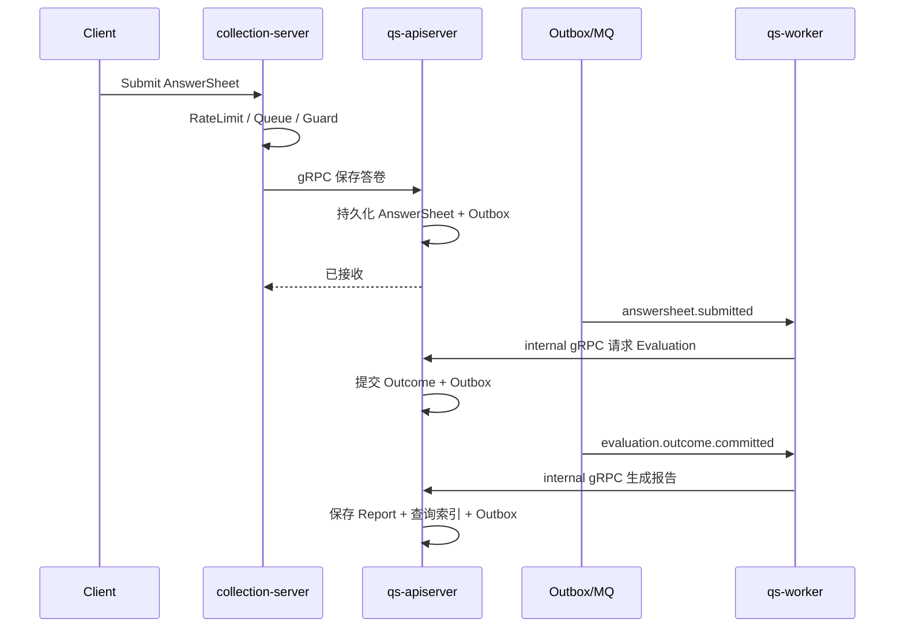

# 核心业务链路

## 1. 结论

系统同步保存 AnswerSheet 作答事实，异步提交 Evaluation Outcome，再以冻结 Outcome 生成报告。当前可靠事件链为：

```text
answersheet.submitted
  -> evaluation.requested
  -> evaluation.outcome.committed | evaluation.failed
  -> interpretation.report.generated | interpretation.report.failed
```

事件名与投递方式以 [`configs/events.yaml`](../../configs/events.yaml) 为准。

## 2. 责任链



## 3. 边界

- Survey 只拥有问卷和答卷事实。
- ModelCatalog 提供已发布、可执行的模型快照；草稿不能进入运行时。
- Evaluation 读取发布快照并提交 Outcome，不拥有报告成品。
- Interpretation 把 Outcome 当作只读输入，负责报告生成、尝试状态和查询。
- Statistics 消费或扫描行为事实形成读侧投影，不反向修改主业务事实。

## 4. 深入阅读

- [答卷提交链路](../02-业务模块/10-survey/31-关键链路-答卷提交校验与测评驱动.md)
- [已发布模型消费](../02-业务模块/20-model-catalog/31-关键链路-已发布模型解析与消费.md)
- [Evaluation 执行](../02-业务模块/30-evaluation/31-关键链路-Worker执行与报告驱动.md)
- [Outcome 驱动报告](../02-业务模块/40-interpretation/30-关键链路-Outcome驱动报告生成.md)
