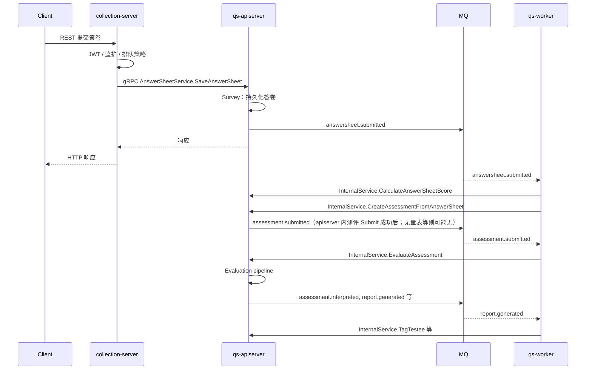

# 核心业务链路

**本文回答**：从「前台提交」到「异步测评与报告」等**最关键**的几条链路，各自经过哪些进程、触发哪些**事件类型字符串**、对应哪些 **RPC** 与**代码入口**。细节以源码与 [configs/events.yaml](../../configs/events.yaml) 为准。

---

## 1. 链路总览表

| 编号 | 链路 | 典型触发 | 关键事件（`events.yaml`） | 备注 |
| ---- | ---- | -------- | ------------------------- | ---- |
| A | 前台提交答卷 | REST → collection | `answersheet.submitted` | 可经 SubmitQueue 异步落库 |
| B | 答卷 → 测评创建 | worker 消费 `answersheet.submitted` | **`assessment.submitted`**（由 **apiserver** 在测评 **Submit** 成功后发布；无量表或未自动提交时可能不出现） | internal：`CalculateAnswerSheetScore` → `CreateAssessmentFromAnswerSheet` |
| C | 测评评估与报告 | worker 消费 `assessment.submitted` | `assessment.interpreted`、`assessment.failed`、`report.generated` 等（以 [events.yaml](../../configs/events.yaml) 为准） | `EvaluateAssessment` + evaluation pipeline |
| D | 报告后处理 | worker | `report.generated` | 如打标签（`TagTestee`） |
| E | 计划与统计 | 定时/内部调用 + worker | 例：`plan.created`，`task.opened` / `task.completed` / `task.expired` | 统计同步落 MySQL 等 |

**Verify**：事件名、Topic、`handler` 字段必须与 [configs/events.yaml](../../configs/events.yaml) 一致；RPC 名与 [internal/apiserver/interface/grpc/proto/](../../internal/apiserver/interface/grpc/proto/) 一致。

---

## 2. 端到端时序（主干）

下列时序覆盖 A～D 的主干步骤；省略重试、锁与部分条件分支。

---

## 3. 链路 A：前台提交答卷

**目的**：尽快校验身份与业务前置条件，将答卷交给 apiserver 持久化并发出 `answersheet.submitted`。

**步骤（概要）**：

1. collection REST 接请求（路径以 [api/rest/collection.yaml](../../api/rest/collection.yaml) 为准）。  
2. JWT、监护关系、受试者等校验（见 application 层）。  
3. 若启用 [SubmitQueue](../../internal/collection-server/application/answersheet/submit_queue.go)，请求在 **collection 进程内** 进入带缓冲 channel，由 **本进程内 goroutine worker** 调用 `submitFunc`（即下游 gRPC）；与 **qs-worker 进程无关**。未启用队列则同步直调 gRPC。  
4. apiserver `SaveAnswerSheet` 写库并发布 **`answersheet.submitted`**。

**锚点**：

- [internal/collection-server/interface/restful/handler/answersheet.go](../../internal/collection-server/interface/restful/handler/answersheet.go)  
- [internal/collection-server/application/answersheet/submission_service.go](../../internal/collection-server/application/answersheet/submission_service.go)  
- [internal/apiserver/interface/grpc/service/answersheet.go](../../internal/apiserver/interface/grpc/service/answersheet.go)  
- Proto：`answersheet.AnswerSheetService/SaveAnswerSheet`

---

## 4. 链路 B：答卷提交后 → 计分与创建测评

**目的**：worker 消费 `answersheet.submitted`，避免重复处理，并顺序调用 internal 服务完成计分与 Assessment 创建。

**步骤（概要）**：

1. `events.yaml` 中该事件绑定 `answersheet_submitted_handler` 等（以文件为准）。  
2. Handler 内加锁/幂等后调用 **CalculateAnswerSheetScore**、**CreateAssessmentFromAnswerSheet**。  
3. 成功后进入 assessment 生命周期（后续事件名查 `events.yaml`）。

**锚点**：

- [internal/worker/handlers/answersheet_handler.go](../../internal/worker/handlers/answersheet_handler.go)  
- [internal/apiserver/interface/grpc/service/internal.go](../../internal/apiserver/interface/grpc/service/internal.go)  
- [internal/apiserver/interface/grpc/proto/internalapi/internal.proto](../../internal/apiserver/interface/grpc/proto/internalapi/internal.proto)

**发布端说明**：**`assessment.submitted` 由 apiserver**（测评领域在 **Submit** 等路径上挂事件）发布；**qs-worker 只消费**，不替代 apiserver 写模型。锚点示例：[assessment.go](../../internal/apiserver/domain/evaluation/assessment/assessment.go)。

---

## 5. 链路 C：异步评估与报告

**目的**：对已提交的测评执行 evaluation engine 流水线（校验、因子分、风险、解读等），并发布 `assessment.interpreted`、`report.generated` 等。

**步骤（概要）**：

1. worker 消费 **`assessment.submitted`**（无量表等情况下链路可能提前结束，以代码分支为准）。  
2. 调用 **EvaluateAssessment**。  
3. 引擎内阶段参见 [pipeline/chain.go](../../internal/apiserver/application/evaluation/engine/pipeline/chain.go) 等。  
4. 发布解读与报告相关事件（名称以 `events.yaml` 为准）。

**锚点**：

- [internal/worker/handlers/assessment_handler.go](../../internal/worker/handlers/assessment_handler.go)  
- [internal/apiserver/application/evaluation/engine/service.go](../../internal/apiserver/application/evaluation/engine/service.go)

---

## 6. 链路 D：报告生成后的副作用

**目的**：在 `report.generated` 等事件上执行标签、高风险因子处理等（具体字段与条件见 handler 实现）。

**锚点**：

- [internal/worker/handlers/report_handler.go](../../internal/worker/handlers/report_handler.go)  
- internal：`InternalService.TagTestee`（[internal.proto](../../internal/apiserver/interface/grpc/proto/internalapi/internal.proto)）

---

## 7. 链路 E：计划调度与统计同步（概要）

**目的**：计划任务扫描、任务状态机与统计从缓存/聚合写回 MySQL 等后台维护动作。

**锚点**：

- [internal/apiserver/application/plan/task_scheduler_service.go](../../internal/apiserver/application/plan/task_scheduler_service.go)  
- [internal/apiserver/application/statistics/sync_service.go](../../internal/apiserver/application/statistics/sync_service.go)  
- gRPC 注册：[internal/apiserver/grpc_registry.go](../../internal/apiserver/grpc_registry.go)

---

## 8. 边界与注意事项

- **worker 不是第二写库入口**：持久化与领域规则仍在 **apiserver** 内完成；worker 通过 **internal gRPC** 驱动。  
- **事件路由**以 `events.yaml` 为单一事实来源；handler 名字符串与代码注册须一致。  
- **统计**多为「Redis 等缓存/预聚合 + MySQL 落盘」组合，勿假设所有指标来自单次 SQL 扫明细。  
- 与前台身份链路的交叉见 [01-运行时/05-IAM认证与身份链路.md](../01-运行时/05-IAM认证与身份链路.md)。

---

## 9. 下一跳

- 进程级组件与 IAM：[01-运行时/](../01-运行时/)  
- 各业务模块深入：[02-业务模块/](../02-业务模块/)  
- 事件与 MQ 细节：[03-基础设施/01-事件系统.md](../03-基础设施/01-事件系统.md)
