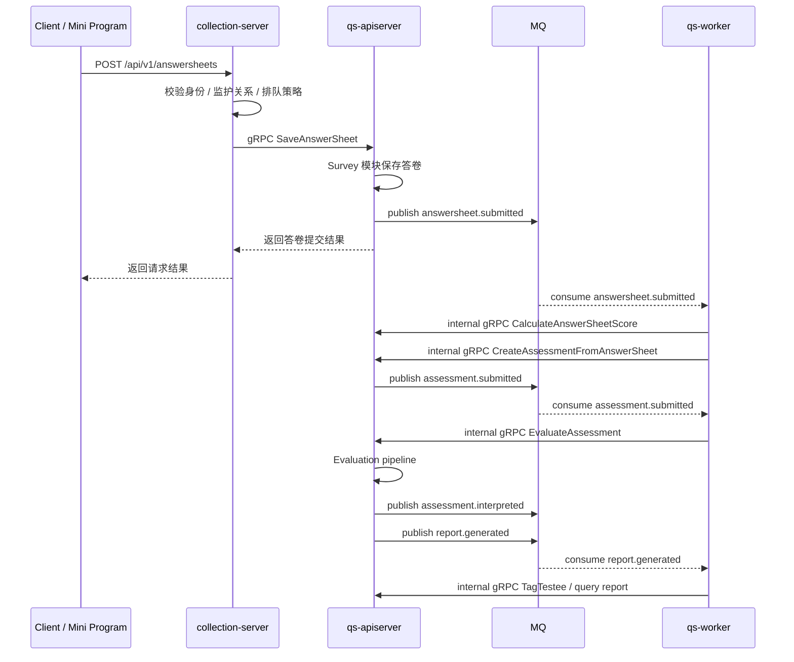

# 核心业务链路

本文档只保留当前最重要的几条链路，帮助读代码时快速定位入口、事件和跨进程调用。

## 核心时序图

## 链路一：前台提交答卷

职责：

- `collection-server` 接收前台请求
- 校验填写人和监护关系
- 视配置决定同步提交还是进入提交队列
- 通过 gRPC 调 `apiserver` 保存答卷

代码入口：

- [internal/collection-server/interface/restful/handler/answersheet.go](../../internal/collection-server/interface/restful/handler/answersheet.go)
- [internal/collection-server/application/answersheet/submission_service.go](../../internal/collection-server/application/answersheet/submission_service.go)
- [internal/collection-server/application/answersheet/submit_queue.go](../../internal/collection-server/application/answersheet/submit_queue.go)
- [internal/apiserver/interface/grpc/service/answersheet.go](../../internal/apiserver/interface/grpc/service/answersheet.go)

流程：

1. 客户端调用 `collection-server` 的 `/api/v1/answersheets`
2. `collection-server` 校验用户、监护关系、受试者信息
3. 如启用排队，则先进入本地 `SubmitQueue`
4. gRPC 调 `apiserver` 保存答卷
5. `apiserver` 在 Survey 模块内提交答卷并发布 `answersheet.submitted`

## 链路二：答卷提交后触发测评

职责：

- `worker` 消费 `answersheet.submitted`
- 先计算答卷分数，再创建 Assessment
- 如果 Assessment 关联量表，则继续进入评估链路

代码入口：

- [configs/events.yaml](../../configs/events.yaml)
- [internal/worker/handlers/answersheet_handler.go](../../internal/worker/handlers/answersheet_handler.go)
- [internal/apiserver/interface/grpc/service/internal.go](../../internal/apiserver/interface/grpc/service/internal.go)

流程：

1. `apiserver` 发布 `answersheet.submitted`
2. `worker` 订阅事件并加分布式锁，防止同一答卷重复处理
3. `worker` 调内部 gRPC 执行答卷计分
4. `worker` 调内部 gRPC 从答卷创建 Assessment
5. Assessment 创建后会进入 `assessment.submitted` 后续链路

## 链路三：异步评估与报告生成

职责：

- `worker` 消费 `assessment.submitted`
- 调内部 gRPC 执行评估引擎
- 评估引擎按流水线完成校验、因子分、风险等级、解读、事件发布
- `report.generated` 后再做标签和高风险处理

代码入口：

- [internal/worker/handlers/assessment_handler.go](../../internal/worker/handlers/assessment_handler.go)
- [internal/apiserver/application/evaluation/engine/service.go](../../internal/apiserver/application/evaluation/engine/service.go)
- [internal/apiserver/application/evaluation/engine/pipeline/chain.go](../../internal/apiserver/application/evaluation/engine/pipeline/chain.go)
- [internal/worker/handlers/report_handler.go](../../internal/worker/handlers/report_handler.go)

流程：

1. `worker` 收到 `assessment.submitted`
2. 若无量表，链路在此结束
3. 若有关联量表，`worker` 调 `EvaluateAssessment`
4. 评估引擎执行 `validation -> factor_score -> risk_level -> interpretation -> event_publish`
5. 发布 `assessment.interpreted` 与 `report.generated`
6. `worker` 在报告事件里提取高风险因子，并给受试者打标签

## 链路四：计划调度与统计同步

职责：

- `apiserver` 内部服务暴露任务调度和统计同步入口
- 外部定时器或后台任务调用内部服务
- 结果仍通过领域事件和仓储回写到主系统

代码入口：

- [internal/apiserver/application/plan/task_scheduler_service.go](../../internal/apiserver/application/plan/task_scheduler_service.go)
- [internal/apiserver/application/statistics/sync_service.go](../../internal/apiserver/application/statistics/sync_service.go)
- [internal/apiserver/grpc_registry.go](../../internal/apiserver/grpc_registry.go)

流程：

1. 调度入口扫描待开放任务并生成 entry
2. 任务状态流转后发布 `task.opened`、`task.completed`、`task.expired`
3. 统计同步服务将 Redis 统计结果落回 MySQL

## 边界与注意事项

- 事件路由与处理器绑定以 [configs/events.yaml](../../configs/events.yaml) 为准。
- `worker` 中很多处理器最终仍通过内部 gRPC 回到 `apiserver`，不要把它理解成独立业务写库服务。
- 统计链路当前是“Redis 缓存统计 + MySQL 汇总落盘”的组合，不是纯实时明细查询。
