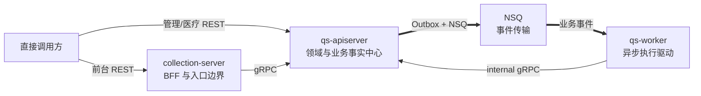
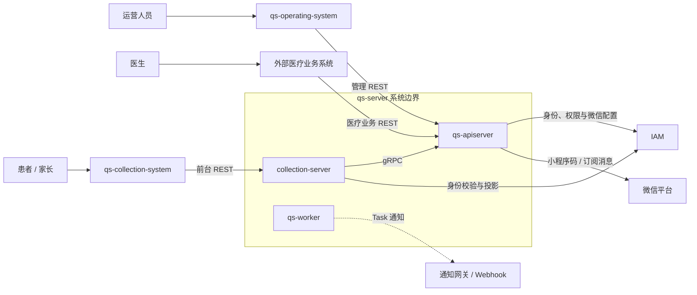
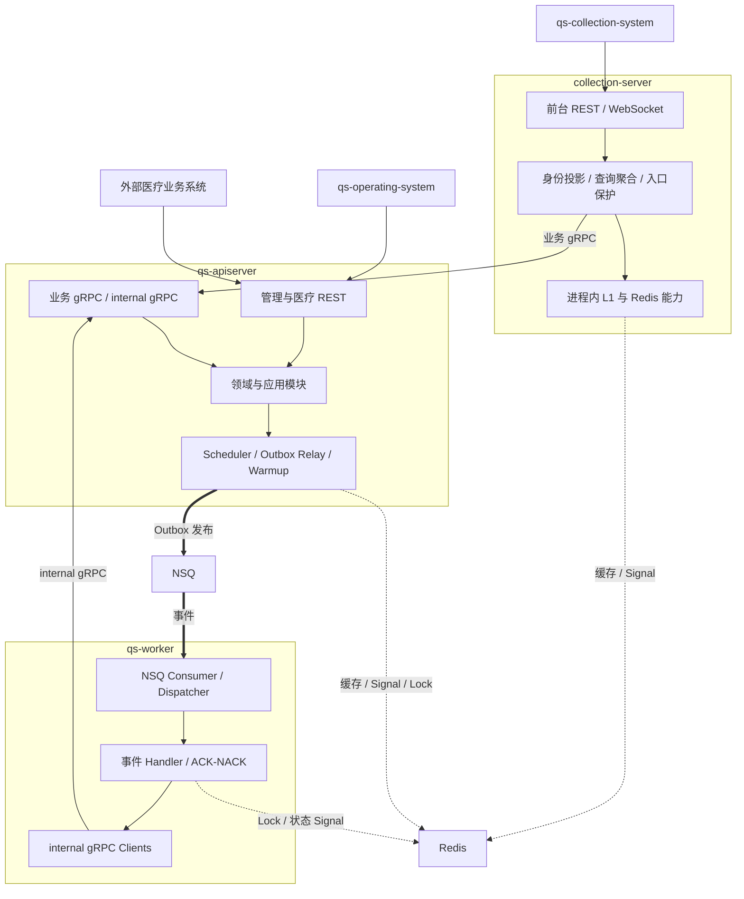
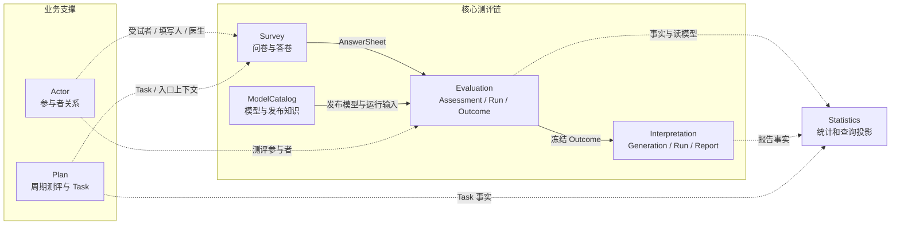
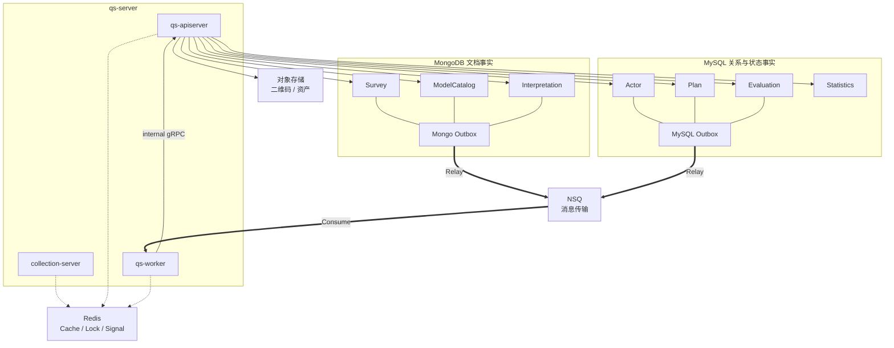
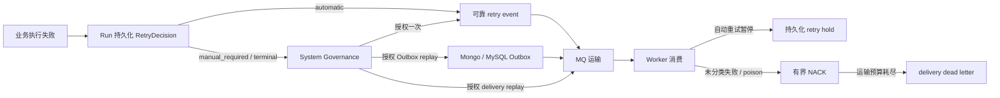
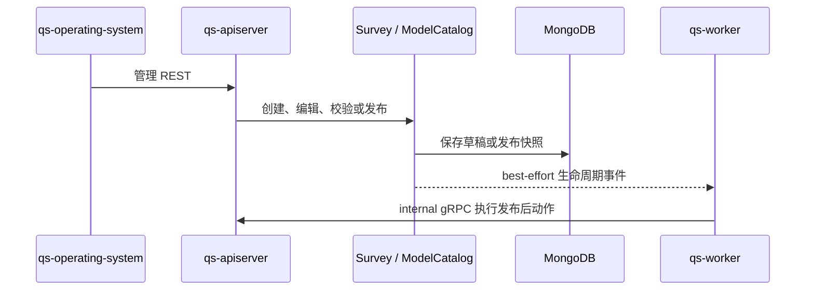
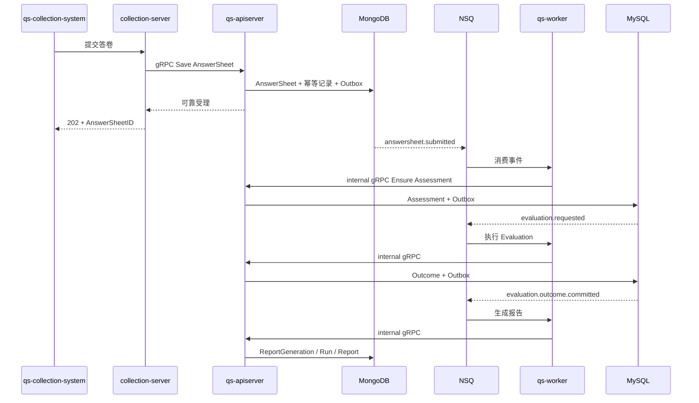
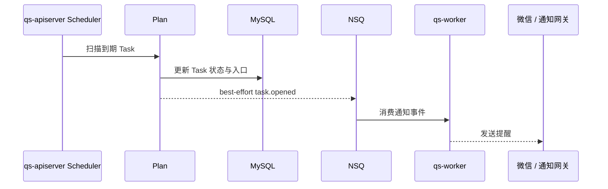

# 系统地图

> 状态：已实现。
>
> 本文从系统上下文、运行时进程、领域模块、数据与基础设施四个视角描述 qs-server 当前的整体结构。它回答“系统里有什么、边界在哪里、不同部分怎样协作”，不展开单个模块的领域模型和具体接口字段。
>
> 架构形成原因见[架构驱动力与设计目标](./02-架构驱动力与设计目标.md)；进程启动、领域模型、基础设施实现和运维拓扑由后续文档分别展开。

## 1. 本文要回答的问题

读完本文，应当能够回答：

1. 哪些用户和系统直接使用 qs-server？
2. qs-server 的系统边界在哪里，哪些能力属于外部协作者？
3. 为什么它有三个可独立运行的组件，却不是微服务架构？
4. collection-server、qs-apiserver 和 qs-worker 分别负责什么？
5. Survey、ModelCatalog、Evaluation、Interpretation 等模块怎样组成测评主链？
6. Actor、Plan 和 Statistics 为什么属于业务支撑模块？
7. 为什么项目同时使用 MongoDB 和 MySQL？
8. Redis、NSQ、Outbox 和对象存储分别扮演什么角色？
9. 同步调用、可靠业务事件、尽力投递事件和临时信令有什么区别？
10. 业务重试、Outbox 重投和 MQ 运输重投为什么不能混在一起？
11. 一次内容发布、答卷测评和 Plan 周期任务分别怎样穿过这张地图？
12. 当前架构最容易被误解成什么？

## 2. 三十秒结论

qs-server 是一个以模块化单体承载领域能力、由 collection-server、qs-apiserver 和 qs-worker 三个可独立运行组件组成的事件驱动系统。

- **collection-server** 是患者和家长使用的收集端 BFF，负责前台 REST 契约、IAM 身份投影、查询聚合、缓存与入口保护；
- **qs-apiserver** 是业务事实、领域用例和事务的中心，也是七个业务模块的组合根；
- **qs-worker** 消费业务事件并通过 internal gRPC 驱动 qs-apiserver 中的异步用例，不直接拥有 Evaluation 或 Interpretation 领域。

系统的核心测评链为：

```text
Survey
  -> ModelCatalog
  -> Evaluation
  -> Interpretation
```

更准确地说，Survey 提供问卷与答卷事实，ModelCatalog 提供已发布的测评知识，Evaluation 组合两者执行评估，Interpretation 基于冻结 Outcome 生成报告。Actor、Plan 和 Statistics 分别提供参与者关系、周期测评编排和统计读模型。

项目从设计之初就采用多模型持久化：文档型、嵌套且结构可扩展的数据主要进入 MongoDB；关系型、状态型和需要强约束查询的数据主要进入 MySQL。Redis 负责缓存、协调与一次性信令，NSQ 负责消息传输，两者都不是权威业务事实来源。



## 3. 应从四个视角阅读系统

一张图无法同时清楚表达用户、进程、领域模块、数据库和物理服务器。本文将系统拆成四个视角：

| 视角 | 回答的问题 | 主要元素 |
| --- | --- | --- |
| 系统上下文 | 谁在使用系统，系统依赖谁 | 用户、前端、外部业务系统、IAM、微信平台 |
| 运行时进程 | 请求和事件怎样在三个进程间流动 | collection-server、qs-apiserver、qs-worker |
| 领域模块 | 业务知识和业务事实由谁拥有 | 七个业务模块、platform、IAM 集成 |
| 数据与基础设施 | 事实存在哪里，技术依赖承担什么语义 | MongoDB、MySQL、Redis、NSQ、Outbox、对象存储 |

这四个视角不能互相替代：

- 一个领域模块不一定对应一个进程；
- 一个进程可以装配多个领域模块；
- 使用多个数据库不等于拆成多个服务；
- 可独立部署不等于业务自治；
- 物理服务器位置不等于架构职责边界。

## 4. 系统上下文：谁在使用 qs-server

### 4.1 业务参与者与直接调用方

| 业务参与者 | 直接使用的系统 | 进入 qs-server 的路径 | 主要动作 |
| --- | --- | --- | --- |
| 患者、家长 | `qs-collection-system` | collection-server REST | 查看测评、填写答卷、查看状态和报告 |
| 运营人员 | `qs-operating-system` | qs-apiserver REST | 维护和发布问卷、测评模型、常模与报告配置 |
| 医生 | 外部医疗业务系统 | qs-apiserver REST | 选择已有测评、发起测评、查看结果与趋势 |

`qs-operating-system` 只服务运营人员，不承担医生工作台职责。

医生所在的外部医疗业务系统可能使用小程序、诊室页面或在线问诊界面，但这些终端形态不属于 qs-server 的认知边界。qs-server 只关心进入接口后的身份、组织、受试者、测评模型和业务命令。

### 4.2 外部协作系统

| 外部系统 | qs-server 使用它做什么 | qs-server 不拥有的事实 |
| --- | --- | --- |
| IAM | Token 校验、统一用户标识、组织权限、Profile Link、微信应用配置 | 认证方式、统一 User、组织和授权事实 |
| 微信平台 | 小程序码、订阅消息等微信能力 | OpenID、模板和微信投递平台行为 |
| 外部医疗业务系统 | 医生测评入口与业务场景编排 | 在线问诊、诊室、治疗和医疗系统内部流程 |
| 通知网关或 Webhook | 接收非核心 Task 生命周期通知 | 外部通知渠道的最终投递状态 |

### 4.3 系统上下文图



### 4.4 qs-server 的边界原则

qs-server 拥有：

- 问卷、答卷和提交事实；
- 测评模型草稿、发布快照、因子、常模和规则；
- Assessment、EvaluationRun、Outcome 和得分事实；
- ReportGeneration、InterpretationRun 和最终报告；
- 测评语境中的受试者、填写人、医生和参与者关系；
- Plan、Enrollment 与周期性 AssessmentTask；
- 基于上述事实形成的统计和查询投影。

qs-server 不拥有：

- 企业范围内的统一用户与认证方式；
- 外部医疗业务系统的问诊、诊疗和治疗流程；
- 前端页面如何组织业务交互；
- 微信平台的用户和投递事实；
- 医学诊断结论。

## 5. 整体架构形态：模块化单体，而不是微服务

### 5.1 从三个维度描述架构

“模块化单体”和“三进程”并不矛盾，它们描述的是不同维度。

| 维度 | 当前形态 |
| --- | --- |
| 逻辑架构 | 七个业务模块组成模块化单体 |
| 运行时架构 | 三个可独立运行的进程组件 |
| 通信架构 | REST、gRPC、Outbox、NSQ、Redis Pub/Sub |
| 数据架构 | MongoDB + MySQL 多模型持久化，Redis 辅助 |
| 部署架构 | 三个构建产物可以分别部署和配置资源 |

因此，更完整的定义是：

> qs-server 是一个以模块化单体为业务核心，通过 BFF 和异步 Worker 扩展运行时边界，并使用事件驱动连接长执行链路的系统。

### 5.2 为什么三个进程不是三个微服务

微服务的关键不是进程数量，而是业务自治。

一个相对完整的微服务通常需要：

- 围绕独立业务能力建立；
- 拥有自己的领域模型和应用服务；
- 控制自己的权威数据；
- 能够独立发布和演进；
- 通过稳定 API 或事件契约与其它服务协作；
- 具有独立容量、故障、运维和团队边界。

当前三个进程并不满足这样的对应关系：

- collection-server 不拥有 AnswerSheet、Assessment 或 Report 聚合；
- qs-worker 不拥有 Evaluation 和 Interpretation 领域；
- Survey、ModelCatalog、Evaluation、Interpretation 等业务模块统一装配在 qs-apiserver；
- 核心领域写入最终都由 qs-apiserver 应用服务控制；
- 业务模块通常随 qs-apiserver 一起构建和发布。

三个进程是**运行时职责边界**，七个模块是**领域与代码边界**，两者并非一一对应。

### 5.3 为什么主动选择模块化单体

项目初期已经能够识别 Survey、ModelCatalog、Evaluation 和 Interpretation 的领域差异，但没有把它们网络化，因为当时不存在值得用分布式复杂度交换的自治需求。

这些模块当前共同完成一条测评生命周期：

```text
问卷与答卷
  -> 选择发布模型
  -> 创建 Assessment
  -> 执行 Evaluation
  -> 冻结 Outcome
  -> 生成 Interpretation Report
```

如果直接拆成微服务，项目将立即承担：

- 服务间 API 和事件版本治理；
- 跨服务数据一致性与补偿；
- 更多网络失败和中间状态；
- 更复杂的本地开发与集成测试；
- 每个服务独立部署、监控和告警；
- 数据同步与查询聚合成本。

而当时并没有独立团队、独立产品、独立发布节奏或外部复用需求来抵消这些成本。

项目采取的原则是：

> 先在领域和代码中建立清晰模块边界；当业务自治、团队边界、发布节奏、容量或故障隔离需求真实出现时，再考虑物理拆分。

### 5.4 为什么 IAM 可以独立，而测评模块暂时不需要

IAM 是能够独立存在并被多个业务系统消费的统一身份能力，具有独立的安全、权限、生命周期和团队治理需求。

同理，进销存系统中的清结算和仓储管理也可能分别拥有独立业务语言、数据主权、团队和发布节奏，因此适合成为服务边界。

qs-server 内部模块当前虽然领域职责不同，但主要共同服务一次测评生命周期，尚未形成同等程度的服务自治需求。

### 5.5 未来重新评估微服务化的触发条件

以下条件出现时，才值得重新讨论物理拆分：

- 某个模块被多个独立业务系统直接使用；
- 某个模块形成独立产品或独立团队；
- 发布频率显著不同，整体发布持续互相阻塞；
- 独立容量需求无法通过 Worker、缓存或资源池隔离解决；
- 模块故障频繁影响其它核心能力；
- 数据权限、合规或生命周期要求形成独立数据主权；
- 模块间契约已经稳定，拆分收益超过分布式运维成本。

## 6. 三进程运行时地图

### 6.1 三个组件为什么独立

| 组件 | 独立的第一原因 | 后续获得的运行时收益 |
| --- | --- | --- |
| collection-server | 承接小程序 BFF 与身份转换 | 查询聚合、L1、入口限流、并发准入和快速失败 |
| qs-apiserver | 统一承载领域模型、业务事实和应用事务 | 本地事务、统一组合根、模块间稳定协作 |
| qs-worker | 消费事件并异步驱动耗时流程 | 消费并发控制、资源隔离、独立扩容和故障隔离 |

qs-worker 最初独立的目标是承载事件消费和异步执行。独立扩容、资源隔离以及避免消费故障影响 HTTP 服务，是拆成独立进程后获得并持续强化的收益。

### 6.2 运行时协作图



### 6.3 collection-server：接入和 BFF 边界

collection-server 负责：

- 面向患者和家长提供稳定的前台 REST 契约；
- 验证 IAM 身份并形成填写人、受试者和组织上下文；
- 聚合模型、问卷、Assessment 状态和报告数据；
- 把前端 DTO 转换为 qs-apiserver gRPC 请求；
- 提供报告短轮询、长等待和 WebSocket 状态入口；
- 承担前台读缓存、限流、并发准入、防重和快速失败。

collection-server 不负责：

- 拥有 Survey、Evaluation 或 Interpretation 权威聚合；
- 直接写 qs-apiserver 的主业务数据库；
- 决定测评模型怎样评分；
- 直接推进 Assessment 或 Report 状态机；
- 替代 IAM 成为统一身份系统。

它是理解前台旅程的 BFF，而不是简单反向代理，也不是第二个业务核心。

### 6.4 qs-apiserver：业务事实与组合根

qs-apiserver 负责：

- 装配七个业务模块和平台集成能力；
- 提供运营、医疗和内部使用的 REST/gRPC 接口；
- 执行应用用例和领域规则；
- 控制 MongoDB、MySQL 本地事务和主业务写入；
- 提交与业务事实同库的 Outbox；
- 运行 Outbox Relay、Scheduler、缓存预热和治理能力；
- 集成 IAM、微信、对象存储和其它外部能力。

qs-apiserver 不负责消费主业务 MQ。事件消费由 qs-worker 承担，消费后通过 internal gRPC 回到应用服务。

### 6.5 qs-worker：异步执行驱动边界

qs-worker 负责：

- 订阅 NSQ Topic 与 Channel；
- 根据 `configs/events.yaml` 把事件路由到 Handler；
- 处理 ACK、NACK、重复消费和运行时锁；
- 通过 internal gRPC 驱动 Assessment、Evaluation、Interpretation 和通知用例；
- 发布报告状态 Signal；
- 调用通知网关或 Webhook 处理外围通知。

qs-worker 不负责：

- 复制 qs-apiserver 的领域模型；
- 绕过应用服务直接改变主业务聚合；
- 把 MQ 消息本身当作业务事实；
- 决定模型发布、评估和报告的领域不变量。

Worker 的核心作用是“决定何时驱动哪个用例”，真正的业务决定仍由 qs-apiserver 中的应用服务和领域对象完成。

### 6.6 为什么 Worker 调用 internal gRPC

Evaluation 计算量大，只说明执行负载需要异步化和独立控制，并不自动说明 Evaluation 应成为微服务。

当前方式把两类责任分开：

```text
qs-worker
  负责事件消费、调度、并发和重投

qs-apiserver / Evaluation
  负责 Assessment、Run、Outcome、幂等和事务不变量
```

internal gRPC 使独立 Worker 进程能够复用同一套应用服务，同时阻止 Handler 直接操作领域仓储。

## 7. 领域模块地图

### 7.1 七个业务模块与两个集成包

当前组合根注册七个业务模块：

```text
survey
modelcatalog
evaluation
interpretation
actor
plan
statistics
```

除此之外还有：

- `platform`：装配 eventing、cache governance、二维码、通知和 codes 等平台集成能力；
- `iam`：装配身份、权限、Profile Link、微信应用和服务认证能力。

`platform` 和 `iam` 是组合根中的集成包，不应与七个业务模块混为一谈。

### 7.2 领域分组

| 分组 | 模块 | 在系统中的作用 |
| --- | --- | --- |
| 核心测评链 | Survey、ModelCatalog、Evaluation、Interpretation | 完成从测评知识、作答到结果和报告的主业务价值 |
| 业务支撑 | Actor、Plan | 提供参与者关系和周期测评编排 |
| 查询与运营支撑 | Statistics | 基于业务事实形成统计、趋势和运营读模型 |

这里使用“核心测评链”，而不是直接把四个模块全部称为 DDD 意义上的“核心域”。核心业务链描述系统主流程，核心域则是战略设计中最具差异化价值的子域，两者需要在后续领域文档中进一步判断。

### 7.3 领域关系图



图中的箭头表示业务语义关系，不代表每一条关系都是直接函数调用。实际协作可能通过应用 Port、Repository 读模型、领域事件或持久化事实完成。

### 7.4 模块拥有与不拥有的事实

| 模块 | 主要拥有 | 明确不负责 |
| --- | --- | --- |
| Survey | Questionnaire、Question、Option、AnswerSheet | 评分模型、Outcome、报告 |
| ModelCatalog | AssessmentModel、Factor、Norm、Ruleset、发布快照 | 原始作答、Evaluation 执行、报告成品 |
| Evaluation | Assessment、EvaluationRun、Outcome、Score | 问卷编辑、报告展示结构 |
| Interpretation | ReportGeneration、InterpretationRun、Report | 重新读取答卷计算 Outcome |
| Actor | Testee、Operator、Clinician、参与者关系和测评入口 | IAM 统一用户与认证 |
| Plan | AssessmentPlan、Enrollment、AssessmentTask | 问卷内容、评分和报告生成 |
| Statistics | 三类 Fact、五类统计结果、SyncRun 和查询模型 | 改写权威业务事实 |

### 7.5 模块边界不是网络边界

模块边界当前主要通过以下方式维护：

- 独立的 `domain/<module>`；
- 独立的 `application/<module>`；
- 独立的 Repository 和读模型适配器；
- 组合根中的 `modules/<module>/wire.go`；
- 跨模块 Port；
- 领域事件与架构测试。

它们仍然编译进同一个 qs-apiserver。模块化的目标是控制知识和依赖方向，而不是为了制造更多网络调用。

## 8. 数据与基础设施地图

### 8.1 多模型持久化是初始设计决策

项目从设计之初就决定同时使用 MongoDB 和 MySQL，而不是在后期因数据库容量问题临时拆分。

选型原则是：

> 文档型、嵌套、版本化且内部结构需要扩展的数据主要使用 MongoDB；关系型、状态型、需要唯一约束和统计查询的数据主要使用 MySQL。

存储选型跟随数据模型，不强迫所有领域使用同一种数据库。

### 8.2 模块与存储映射

| 模块或能力 | 主要存储 | 典型事实 |
| --- | --- | --- |
| Survey | MongoDB | Questionnaire、AnswerSheet、提交幂等记录 |
| ModelCatalog | MongoDB | 模型草稿、发布快照、Norm、Ruleset |
| Evaluation | MySQL | Assessment、EvaluationRun、Outcome、Score |
| Interpretation | MongoDB | ReportGeneration、InterpretationRun、Report、报告查询目录 |
| Actor | MySQL | Testee、Operator、Clinician、Relation、AssessmentEntry |
| Plan | MySQL | AssessmentPlan、Enrollment 关系、AssessmentTask |
| Statistics | MySQL | Access/Assessment/Plan Fact、四类 Daily、组织快照、SyncRun |
| 可靠出站 | MongoDB + MySQL | 与业务事实同库的 Outbox |
| 缓存与协调 | Redis | L2、Lock、状态等待、热度和运行控制 |
| 事件传输 | NSQ | Outbox 事件和尽力投递事件的传输 |
| 资源文件 | 对象存储或本地适配 | 二维码与测评相关资产 |

### 8.3 为什么文档型数据进入 MongoDB

Questionnaire、AnswerSheet、模型定义和报告具有明显的文档结构：

- Questionnaire 嵌套 Question、Option、校验和显示规则；
- 不同题型的 Answer Value 形态可能不同；
- 模型定义包含因子、常模、规则和版本化 Payload；
- 不同测评类型的报告结构并不完全一致；
- 发布快照和历史报告适合整体保存和整体读取。

这些对象关注的是整体聚合、结构扩展、版本保存和历史快照，而不是大量跨对象 Join。

### 8.4 为什么关系和状态数据进入 MySQL

Actor、Plan、Evaluation 生命周期和 Statistics 更偏向关系与状态：

- 受试者、医生、组织之间存在明确关系；
- Plan、Enrollment、Task 之间需要约束和状态流转；
- Assessment、Run、Outcome 需要唯一性、租约、尝试次数和状态查询；
- 趋势和运营统计需要条件过滤、索引和聚合；
- 治理能力需要明确的执行状态和审计字段。

这些对象更重视关系约束、唯一性、事务更新和可查询状态。

### 8.5 数据与基础设施关系图



### 8.6 Redis 和 NSQ 为什么不是事实来源

Redis 中的数据允许因为 TTL、淘汰、故障或重建而消失。系统必须能够从 MongoDB、MySQL 或当前配置重新得到正确业务状态。

NSQ 中的消息用于传输已经发生的事实或尽力投递的通知。消息被消费、重复或过期，都不能改变权威事实由领域数据库拥有这一原则。

因此：

- Redis 丢失不能等于 AnswerSheet、Assessment 或 Report 丢失；
- MQ 中没有消息不能作为“业务没有发生”的证明；
- 报告状态 Signal 只能加快查询收敛，最终仍需查询事实；
- 缓存和消息治理必须围绕事实存储设计。

### 8.7 跨 MongoDB 与 MySQL 不追求大事务

AnswerSheet 在 MongoDB，Assessment 和 Outcome 在 MySQL，Interpretation Report 又回到 MongoDB。系统不使用一个跨库大事务让它们同时提交。

每个阶段遵循：

```text
本模块业务事实
  + 同数据库 Outbox
  -> 本地事务提交
  -> 异步推动下一阶段
```

这会产生可观察的中间状态，但能够避免一个后续报告失败反向否定已经成立的答卷事实。

## 9. 四种协作语义

系统中的连线不能都理解为“调用”。当前存在四种不同语义。

### 9.1 同步 REST / gRPC

同步调用适用于调用方需要立即得到结果的命令或查询：

- collection-system 调用 collection-server REST；
- collection-server 调用 qs-apiserver gRPC；
- operating-system 和外部医疗业务系统调用 qs-apiserver REST；
- qs-worker 调用 qs-apiserver internal gRPC。

同步调用失败会立即返回错误。它不自动提供跨请求可靠重试，调用方需要根据幂等、超时和错误语义决定是否重试。

### 9.2 可靠业务事件：Outbox + NSQ

不能永久丢失的跨阶段业务事实使用 `durable_outbox`：

```text
业务事实 + 同库 Outbox
  -> 本地事务
  -> Immediate / Relay
  -> NSQ
  -> Worker
  -> internal gRPC
  -> 下一阶段事实
```

核心链路包括：

```text
answersheet.submitted
  -> evaluation.requested
  -> evaluation.outcome.committed
  -> interpretation.report.generated
```

失败路径还包括 `evaluation.failed` 和 `interpretation.report.failed`；重试治理事件以 `configs/events.yaml` 与 Worker Handler Registry 共同形成的当前有效契约为准。

该链路提供的是 at-least-once：事件可能重复，消费者必须幂等；系统不承诺不存在重复消息。

#### 9.2.1 重试治理覆盖四个不同平面



这张图表达的是责任边界，而不是一套共享计数器：

- **业务执行平面**记录 Evaluation/Interpretation 的 attempt、失败分类和下一步处置；
- **可靠出站平面**保证已经提交的事实对应事件可以继续发布；
- **运输平面**处理消息解码、ACK/NACK 和投递耗尽；
- **治理平面**按组织汇总候选，并对人工 Retry、Force Retry、Outbox/hold/运输重放执行确认、并发校验和审计。

业务失败一旦已经形成持久化处置，Worker 会 ACK 当前运输消息，后续动作由新的可靠重试事件或人工治理决定。这样可以避免 MQ 重投不断消耗运输次数，却没有产生新的业务 attempt。

当前已实现分阶段治理闭环，但还没有把 AnswerSheet、Assessment、EvaluationRun、InterpretationRun、Outbox、hold 和 dead letter 汇总成一条统一的患者测评旅程视图。

### 9.3 尽力投递领域事件：direct publish + NSQ

以下事件当前是 `best_effort`：

- `questionnaire.changed`；
- `assessment_model.changed`；
- `task.opened`；
- `task.completed`；
- `task.expired`；
- `task.canceled`。

它们在业务事实保存后直接发布，发布失败只记录日志，不回滚已经保存的事实。

Task 生命周期事件不会推进 Task、Plan、Assessment 或 Statistics 权威状态，主要用于小程序提醒和外部通知。事件丢失不会改变 Task 事实，但可能造成一次业务触达缺失。

如果未来患者提醒被提升为必须可靠交付的业务承诺，应升级通知投递机制，而不必机械地把所有 Task 生命周期事件改成核心可靠事件。

### 9.4 临时信令：Redis Pub/Sub

Redis Pub/Sub 当前只承担一次性唤醒和缓存收敛：

- `report_status_changed`；
- `questionnaire_cache_changed`；
- `scale_cache_changed`；
- `typology_model_cache_changed`。

Signal 丢失可接受，因为：

- 报告状态可以重新查询；
- 等待可以超时后轮询；
- 缓存具有 TTL；
- 下次读取或变更可以再次触发收敛；
- 权威事实不在 Pub/Sub 中。

Redis Pub/Sub 的作用是加快状态收敛，而不是保证业务推进。

### 9.5 统一图例

| 连线 | 语义 | 是否允许丢失 | 主要失败处理 |
| --- | --- | --- | --- |
| REST / gRPC 实线 | 同步命令或查询 | 调用失败直接返回 | 超时、幂等重试、错误响应 |
| Outbox + NSQ 粗实线 | 可靠业务事件 | 不允许永久丢失 | Outbox 退避、幂等消费、Run 处置与治理重放 |
| direct publish + NSQ 虚线 | 尽力投递事件 | 允许 | 日志、查询、扫描或人工兜底 |
| Redis Pub/Sub 点线 | 临时唤醒与缓存信令 | 允许 | TTL、轮询和重新查询 |

## 10. 典型业务链路在地图中的位置

本节只定位链路经过的边界，具体步骤由[核心业务链路](./05-核心业务链路.md)和各模块文档展开。

### 10.1 运营发布问卷与测评模型



发布后的问卷、模型和规则进入运行时目录，供 Evaluation 统一读取。二维码、缓存失效和预热属于发布后动作，不改变发布快照本身的事实地位。

### 10.2 患者提交答卷并生成报告



这条链路跨越两个数据库和三个进程，但每个阶段只有一个权威写入所有者。

### 10.3 Plan 周期任务



Task 状态和入口保存在 MySQL。提醒失败不会回滚 Task，也不会影响 Statistics 从 `assessment_task` 重建数据。

### 10.4 医生与运营调用

运营和医生都直接进入 qs-apiserver，但使用不同前端、能力和权限：

- 运营通过 operating-system 维护和发布测评知识；
- 医生通过外部医疗业务系统选择已有测评、发起测评并查看结果；
- IAM 权限和组织范围决定调用者能执行哪些用例；
- qs-server 不根据前端名称决定领域规则，而根据身份、Capability、组织和资源关系授权。

## 11. 架构边界与常见误解

### 11.1 “有三个服务组件，所以是微服务”

错误。三个组件是接入、业务事实和异步驱动的运行时边界，没有分别形成自治业务服务。

### 11.2 “七个业务模块应该分别部署”

错误。模块化首先用于控制业务知识和依赖方向。只有自治收益超过分布式成本时，才需要物理拆分。

### 11.3 “Evaluation 耗时，所以应该独立成微服务”

不成立。耗时工作负载可以通过事件、Worker 和并发预算隔离；是否成为微服务还需要业务、数据、发布和团队自治需求。

### 11.4 “使用多个数据库，就是每个模块一库”

错误。MongoDB 和 MySQL 是数据模型选型，当前都由 qs-apiserver 组合根统一装配和治理。

### 11.5 “消息进入 NSQ 就不会丢”

错误。可靠性来自业务事实与 Outbox 的本地原子提交、Relay、消费重试和幂等，而不是 MQ 名称本身。

### 11.6 “Redis Pub/Sub 可以推进报告链路”

错误。Pub/Sub 只负责唤醒和缓存失效；报告事实必须已经保存在数据库，Signal 丢失后仍可查询。

### 11.7 “collection-server 是另一个业务后端”

错误。它理解前台旅程并提供 BFF，但不拥有核心聚合，也不复制评分和报告领域规则。

### 11.8 “qs-worker 拥有异步业务逻辑”

不准确。Worker 拥有事件消费和驱动逻辑，业务不变量仍由 qs-apiserver 的领域与应用服务拥有。

### 11.9 “外部医疗小程序属于 qs-server”

错误。qs-server 只认识直接调用它的外部医疗业务系统及其身份、组织和业务命令，不拥有调用方内部终端。

### 11.10 “当前服务器位置就是系统架构”

错误。服务器节点、CPU、内存和端口是可变化的部署事实，不能替代稳定的进程与职责地图。

## 12. 架构拓扑与物理部署分离

### 12.1 本文保留的稳定事实

- 有三个独立构建产物；
- 三个组件可以分别启动和部署；
- collection-server 与 qs-worker 通过 gRPC 调用 qs-apiserver；
- qs-apiserver 发布事件，qs-worker 消费事件；
- IAM 和基础设施依赖位于 qs-server 应用边界之外；
- 组件位置变化不改变领域和事实所有权。

### 12.2 运维层维护的可变事实

- 当前部署在哪台服务器；
- 每个组件分配多少 CPU 和内存；
- 实际副本数；
- 端口映射、网络和证书挂载；
- MySQL、MongoDB、Redis 和 NSQ 的节点；
- 扩容、回滚和故障迁移步骤。

这些内容以[部署与端口](../04-接口与运维/06-部署与端口.md)、容量文档和 `build/docker/docker-compose.prod.yml` 为准。

## 13. 源码事实入口

### 13.1 进程与组合根

| 事实 | 入口 |
| --- | --- |
| 三个可执行入口 | `cmd/qs-apiserver`、`cmd/collection-server`、`cmd/qs-worker` |
| apiserver 组合根 | `internal/apiserver/container` |
| 业务模块注册 | `internal/apiserver/container/modules/registry.go` |
| 模块装配 | `internal/apiserver/container/modules/*/wire.go` |
| collection 运行时 | `internal/collection-server/process`、`container`、`transport` |
| worker 运行时 | `internal/worker/process`、`container`、`handlers` |

### 13.2 契约与通信

| 事实 | 入口 |
| --- | --- |
| 可靠与尽力投递事件 | `configs/events.yaml` |
| 一次性信令 | `configs/signals.yaml` |
| REST 契约 | `api/rest` |
| gRPC 契约 | `api/grpc/proto` |
| Worker Handler 注册 | `internal/worker/handlers/catalog.go` |
| Mongo Outbox | `internal/apiserver/infra/mongo/eventoutbox` |
| MySQL Outbox | `internal/apiserver/infra/mysql/eventoutbox` |

### 13.3 数据适配器

| 存储 | 入口 |
| --- | --- |
| MongoDB | `internal/apiserver/infra/mongo` |
| MySQL | `internal/apiserver/infra/mysql` |
| Redis 与缓存 | `internal/apiserver/cache`、`internal/pkg/redisruntime` |
| 对象存储 | `internal/apiserver/infra/objectstorage` |
| 微信能力 | `internal/apiserver/infra/wechatapi` |

## 14. 深入阅读

### 14.1 运行时

- [三进程协作总览](../01-运行时/00-三进程协作总览.md)
- [qs-apiserver 启动与组合根](../01-运行时/01-qs-apiserver启动与组合根.md)
- [collection-server 运行时](../01-运行时/02-collection-server运行时.md)
- [qs-worker 运行时](../01-运行时/03-qs-worker运行时.md)
- [进程间调用与 gRPC](../01-运行时/04-进程间调用与gRPC.md)
- [IAM 认证与身份链路](../01-运行时/05-IAM认证与身份链路.md)

### 14.2 业务模块

- [Survey](../02-业务模块/10-survey/README.md)
- [ModelCatalog](../02-业务模块/20-model-catalog/README.md)
- [Evaluation](../02-业务模块/30-evaluation/README.md)
- [Interpretation](../02-业务模块/40-interpretation/README.md)
- [Actor](../02-业务模块/50-actor/README.md)
- [Plan](../02-业务模块/60-plan/README.md)
- [Statistics](../02-业务模块/70-statistics/README.md)

### 14.3 基础设施与运维

- [基础设施能力地图](../03-基础设施/01-基础设施能力地图.md)
- [数据访问](../03-基础设施/data-access/README.md)
- [事件系统](../03-基础设施/event/README.md)
- [缓存系统](../03-基础设施/cache/README.md)
- [并发与韧性](../03-基础设施/concurrency/README.md)
- [接口契约总览](../04-接口与运维/00-接口契约总览.md)
- [部署与端口](../04-接口与运维/06-部署与端口.md)

本文描述稳定的系统结构，不替代源码、REST/gRPC 契约、事件与信令配置、数据库 migration 和当前部署配置。它们发生变化时，应同步更新本文对应地图和边界说明。
