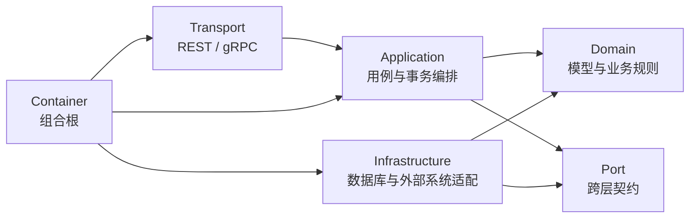

# 代码组织与边界

> 状态：已实现。文中标记为“当前过渡边界”的内容表示源码仍在使用，但不代表目标架构。
>
> 本文解释 qs-server 的代码为什么这样组织、依赖允许朝哪里走，以及开发者应当怎样定位和修改代码。系统上下文和三个进程的运行关系见[系统地图](./03-系统地图.md)与[三进程协作总览](../01-运行时/00-三进程协作总览.md)；单个业务模块的领域模型与关键链路见 `docs/02-业务模块/`。

## 1. 本文要回答的问题

读完本文，应当能够回答：

1. 为什么不能只看目录名判断 qs-server 的架构？
2. 进程边界、业务模块边界和代码分层边界有什么区别？
3. 一个完整业务模块为什么分散在 `domain`、`application`、`port`、`infra` 和 `container/modules` 中？
4. Domain、Application、Port、Infrastructure、Transport 和 Container 各自负责什么？
5. 为什么 Application 不能直接依赖 MySQL、MongoDB、IAM SDK 等具体实现？
6. `Module`、`Wire`、`Bootstrap`、`Install` 和 `Export` 分别处于装配链的哪一步？
7. Survey、Evaluation、Interpretation 等模块怎样协作而不互相导入实现？
8. collection-server 与 qs-worker 为什么不是新的业务领域？
9. `internal/pkg`、`pkg` 和 component-base 的复用边界如何区分？
10. 为什么当前采用显式构造函数和手工装配，而没有立即引入 Wire 或 Fx？
11. 架构测试究竟保护了哪些边界，又不能证明什么？
12. 新增业务规则、接口、缓存、外部依赖或异步流程时，代码应该放在哪里？

## 2. 三十秒结论

qs-server 的代码组织可以概括为：

> **以 DDD 模块划分业务责任，使用 Ports and Adapters 控制依赖方向，并通过显式构造函数和手工组合根完成装配。**

它吸收了六边形架构、整洁架构和分层架构的思想，但不是对某套教科书目录模板的机械复制。理解当前代码，需要同时区分三种边界：

| 边界 | 回答的问题 | 当前载体 |
| --- | --- | --- |
| 进程边界 | 代码在哪个运行组件中执行 | `internal/apiserver`、`internal/collection-server`、`internal/worker` |
| 业务模块边界 | 某项业务知识和事实由谁拥有 | Survey、ModelCatalog、Evaluation、Interpretation、Actor、Plan、Statistics |
| 代码分层边界 | 某段代码在依赖关系中扮演什么角色 | Domain、Application、Port、Infra、Transport、Container |

这三种边界不会一一对应：

- 一个进程可以装配多个业务模块；
- 一个业务模块会横跨多个分层目录；
- 一个分层目录中可以包含多个业务模块；
- collection-server 和 qs-worker 是运行时边界，不是新的领域事实所有者；
- `container/modules/evaluation` 是 Evaluation 的装配位置，不是 Evaluation 全部代码的位置。

以 Evaluation 为例，它的完整责任链分布在：

```text
internal/apiserver/domain/evaluation
internal/apiserver/application/evaluation
internal/apiserver/port/evaluation*
internal/apiserver/infra/mysql/evaluation
internal/apiserver/container/modules/evaluation
```

因此，当前代码可以理解为：

> **按层组织代码，按模块分配责任，在组合根重新装配出完整模块。**

## 3. 三种边界不能混为一谈

### 3.1 进程边界：代码在哪里运行

仓库构建三个主要进程：

| 进程 | 代码根目录 | 代码责任 | 不拥有的内容 |
| --- | --- | --- | --- |
| qs-apiserver | `internal/apiserver` | 领域模型、应用用例、事务、持久化、REST、内部 gRPC、后台运行时 | 外部 IAM 的统一身份事实 |
| collection-server | `internal/collection-server` | 填写端 BFF、身份转换、查询聚合、缓存、入口保护、WebSocket | AnswerSheet、Assessment、Outcome、Report 聚合所有权 |
| qs-worker | `internal/worker` | 事件消费、ACK/NACK、重试控制、并发协调、internal gRPC 调用 | Evaluation 与 Interpretation 的核心业务规则 |

进程边界主要服务部署、资源隔离、流量形态和故障控制。它不能直接回答某个领域概念由谁拥有。

例如，Worker 接收 `answersheet.submitted` 并驱动 Evaluation，不代表 Evaluation 属于 Worker；collection-server 接收 AnswerSheet 提交，也不代表 AnswerSheet 聚合属于 collection-server。

### 3.2 业务模块边界：业务知识由谁拥有

正式业务模块清单由 `internal/apiserver/container/modules/registry.go` 定义：

```text
Survey
ModelCatalog
Evaluation
Interpretation
Actor
Plan
Statistics
```

业务模块边界回答：

- 谁定义这个领域概念？
- 谁维护它的生命周期和不变量？
- 谁拥有写入状态的应用服务？
- 哪些其它模块只能通过接口、事实或事件使用它？

`platform` 和 `iam` 也存在于 `container/modules` 下，但注册表将它们定义为集成与组合包，不属于七个业务模块。目录位置相同，不表示业务地位相同。

### 3.3 代码分层边界：依赖允许朝哪里走

分层边界回答一段代码扮演什么技术角色：



这张图表达的是依赖方向，而不是一次请求的运行顺序：

- Application 可以调用 Port，但不知道具体适配器来自 MySQL、MongoDB、Redis 还是 IAM；
- Infra 实现 Domain Repository 或 Application 所需的 Port；
- Transport 把协议输入转换成应用命令，不直接操作 Repository；
- Container 位于最外层，负责选择具体实现并把对象连接起来；
- Domain 不应知道缓存、消息中间件、HTTP、数据库驱动和进程配置。

## 4. 仓库一级目录地图

| 目录 | 主要责任 | 查找时的提示 |
| --- | --- | --- |
| `cmd/` | 三个可执行程序的命令入口 | 这里只决定启动哪个进程，不放业务规则 |
| `api/rest/` | 对外 REST 机器契约 | 路由、请求和响应事实优先核对 OpenAPI |
| `api/grpc/proto/` | 内部 gRPC 手写契约 | 生成代码位于 `api/grpc/gen/` |
| `configs/` | 进程配置、事件目录和信号目录 | 事件语义以 `events.yaml`、`signals.yaml` 为准 |
| `internal/apiserver/` | 业务核心、持久化和内部服务 | 绝大多数业务责任链从这里追踪 |
| `internal/collection-server/` | 收集端 BFF 与入口保护 | 重点看 application、port、infra、transport |
| `internal/worker/` | 异步消费与执行控制 | 重点看 handlers、integration 和 gRPC client |
| `internal/pkg/` | 仓库内部、跨进程共享的基础能力 | 不能被仓库外部直接导入 |
| `pkg/` | Go 语言层面可被仓库外部导入的通用代码 | 当前主要承载 CLI、配置、响应核心和版本能力 |
| `scripts/` | 生成、校验、迁移与运维脚本 | 脚本存在不等于目标环境已经执行 |
| `docs/` | 当前文档事实层、专题与宣讲层 | 事实优先级低于源码和机器契约 |

根目录地图只能帮助进入代码，不能替代模块边界判断。

## 5. qs-apiserver 的分层责任

### 5.1 Domain：表达业务模型和不变量

位置：`internal/apiserver/domain/`。

Domain 应当包含：

- Entity、Value Object、Aggregate；
- 状态转换和业务不变量；
- 领域服务；
- 领域事件；
- 与聚合生命周期紧密相关的 Repository 接口；
- 不依赖基础设施的通用计算内核。

例如：

- `domain/survey` 定义 Questionnaire、AnswerSheet 和作答规则；
- `domain/evaluation` 定义 Assessment、EvaluationRun 和 Outcome；
- `domain/interpretation` 定义 ReportGeneration、InterpretationRun 和 Report；
- `domain/plan` 定义 Plan、Enrollment 和 AssessmentTask。

Domain 不应包含：

- Gin、gRPC 和 OpenAPI DTO；
- GORM、Mongo Driver 或 Redis Client；
- IAM 生成代码；
- 缓存 Key、TTL 和 Pub/Sub channel；
- 进程启动、日志装配和配置解析。

这个边界由 `TestDomainPackagesDoNotDependOnInfrastructure`、`TestDomainPackagesDoNotImportCache` 等架构测试保护。

### 5.2 Application：组织用例与事务

位置：`internal/apiserver/application/`。

Application 负责：

- 接收面向用例的 Command 或 Query；
- 加载聚合和读取模型；
- 调用领域行为；
- 控制本地事务；
- 暂存 Outbox 事件；
- 调用跨模块 Port；
- 将领域结果映射为应用结果；
- 按参与者身份组织不同应用入口。

Application 不负责：

- 编写 SQL 或 MongoDB 查询实现；
- 直接识别数据库驱动错误；
- 从 Redis 拼装领域事实；
- 解析 HTTP 参数；
- 在 Worker Handler 中复制业务规则。

当前源码通过 `TestApplicationsUsePortsForInfraBoundaries` 明确禁止 Application 导入 Mongo Driver、IAM 生成包和 `internal/apiserver/infra`。这说明“应用层依赖抽象”已经是可执行约束，而不只是文档愿景。

Application 下还有几类特殊目录：

| 目录 | 作用 |
| --- | --- |
| `application/journey/` | 跨模块业务旅程编排，例如 Assessment Intake、Report Query、Report Wait |
| `application/eventing/` | 应用侧事件发布、Outbox profile 与状态接口 |
| `application/transaction/` | 应用事务抽象 |
| `application/systemgovernance/` | 缓存、事件、重试和韧性治理用例 |
| `application/workbench/` | 面向工作台的跨读模型聚合 |

这些目录不是新的业务模块。它们是跨模块应用编排或平台应用能力。

### 5.3 Port：隔离跨层和跨模块契约

位置：`internal/apiserver/port/`。

Port 用来描述核心代码需要什么能力，而不是描述某个技术怎样实现。当前主要包括：

- ReadModel 接口，例如 `surveyreadmodel`、`planreadmodel`；
- 跨模块事实接口，例如 `evaluationfact`；
- 外部系统桥接，例如 `iambridge`、`wechatmini`；
- 持久化或可靠性抽象，例如 `outbox`、`answersheetsubmit`；
- 运行时输入与资源接口，例如 `evaluationinput`、`ruleengine`；
- 查询等待与资源制品接口，例如 `evaluationwaiter`、`assessmentasset`。

不是所有 Repository 接口都必须放进 `port/`。与某个聚合生命周期强相关的命令侧 Repository 可以与 Domain 放在一起；跨模块、读模型和技术隔离接口更适合放在 `port/`。

因此，本项目不是“所有 interface 都放 port”的形式主义架构。判断位置时应先问：

> 这个接口是在表达领域聚合的持久化需要，还是在隔离一个外部、跨模块或读模型能力？

### 5.4 Infrastructure：实现技术适配

位置：`internal/apiserver/infra/`。

Infrastructure 负责：

- MySQL、MongoDB、Redis Repository 和 ReadModel；
- IAM、微信、对象存储等外部系统适配；
- Evaluation 输入快照装配；
- Rule Engine、Ruleset 和兼容数据适配；
- 等待器、治理读模型和重试治理存储。

Infra 可以依赖 Domain 或 Port 来实现契约，但不能反过来要求 Domain 理解某个数据库或协议。

例如：

```text
application/plan/query_service
  -> port/planreadmodel
  <- infra/plan 或 infra/mysql/... 实现
```

这种方向使查询实现能够演进，而不会把 SQL、分页结构和存储兼容逻辑带入业务用例。

### 5.5 Transport：协议适配，不是业务实现

位置：`internal/apiserver/transport/rest/` 与 `internal/apiserver/transport/grpc/`。

Transport 负责：

- 路由注册；
- 身份和权限中间件；
- 参数解析与协议校验；
- Request 到 Application DTO 的转换；
- Application Result 到 Response 或 Proto 的转换；
- 协议错误码映射。

Transport 不应：

- 直接读取或写入 Repository；
- 构造业务聚合绕过 Application；
- 自行决定 Evaluation 或 Interpretation 状态转换；
- 自行创建共享限流器、缓存或并发闸门。

Transport 依赖由各模块的 `ExportRESTDeps`、`ExportGRPCDeps` 等出口提供，从而避免路由层了解模块内部 Repository 和适配器。

### 5.6 Container：最外层组合根

位置：`internal/apiserver/container/`。

Container 负责：

- 创建数据库、Redis、事件子系统和外部客户端；
- 选择 Port 的具体实现；
- 按顺序安装七个业务模块；
- 绑定跨模块窄接口；
- 向 REST、gRPC 和后台 Runtime 导出依赖；
- 管理模块健康检查与资源释放。

Container 是允许同时看见 Application、Infra、Transport 和模块装配包的最外层。它的职责正是把依赖连接起来，因此“组合根依赖很多包”本身不是分层违规；真正需要控制的是业务规则不能向组合根泄漏，以及组合根不能退化成随处可写的 Service Locator。

## 6. 一个业务模块怎样被重新装配

### 6.1 业务模块分散在分层目录中

以 Survey 为例：

| 层次 | 位置 | 主要内容 |
| --- | --- | --- |
| Domain | `domain/survey/` | Questionnaire、AnswerSheet、答案和值对象 |
| Application | `application/survey/` | 问卷生命周期、查询、答卷提交 |
| Port | `port/surveyreadmodel/`、`port/answersheetsubmit/` | 读模型与可靠提交契约 |
| Infra | `infra/mongo/questionnaire/`、`infra/mongo/answersheet/` | MongoDB 存储与查询适配 |
| Module Assembly | `container/modules/survey/` | 创建模块、安装、注册和对外导出 |
| Transport | `transport/rest/`、`transport/grpc/` | 使用 Survey 导出的应用能力 |

这也是为什么不能把 `container/modules/survey` 当作 Survey 的全部源码。

### 6.2 组合根中的模块语言

当前七个业务模块都在 `internal/apiserver/container/modules/<module>/` 中使用一组相近的装配文件：

| 文件或概念 | 责任 |
| --- | --- |
| `module.go` | 模块名称、描述符或模块结构 |
| `assemble.go` | 使用已经抽象好的依赖创建应用服务和模块能力 |
| `bootstrap.go` | 把容器集成输入转换为模块装配输入 |
| `wire.go` | 定义显式组合入口和 `WireInput` |
| `install.go` | 从组合根 Host 取依赖、调用 Wire、保存并注册模块 |
| `exports_rest.go` | 向 REST Transport 暴露窄的应用能力 |
| `exports_grpc.go` | 向 gRPC Transport 暴露窄的应用能力 |
| 其它 `exports_*.go` | 向另一个组合位置暴露特定 Port，而不是暴露整个模块内部 |

以 Survey 的当前调用方向为例：

```text
Container.initSurveyModule
  -> survey.InstallFrom(host)
      -> host.EnsureSurveyRuntimeInfra()
      -> survey.Wire(WireInput)
          -> survey.Bootstrap(BootstrapInput)
              -> New / Assemble module
      -> host.SetSurveyModule(module)
      -> host.RegisterModule("survey", module)

Transport composition
  -> module.ExportRESTDeps(...)
  -> module.ExportGRPCDeps(...)
```

这种显式装配带来两个重要结果：

1. 模块内部可以调整 Repository、Application Service 和缓存适配，而 Transport 只依赖稳定出口；
2. 组合根能够清楚看见一个模块使用了哪些数据库、事件、缓存和外部能力。

### 6.3 `registry.go` 是模块语言的机器事实源

`internal/apiserver/container/modules/registry.go` 同时记录：

- 七个正式业务模块；
- platform 与 IAM 集成包；
- 当前模块安装顺序；
- 已迁移模块需要具备的装配文件；
- Transport export 文件约定；
- 仍允许存在的旧 bootstrap 文件。

当前 `MigratedModulePackages` 已覆盖七个业务模块，`LegacyBootstrapFiles` 已为空，说明业务装配已经迁入 `container/modules/*`。

### 6.4 当前过渡边界：`LegacyInitializeSequence`

虽然模块内部装配已经迁移，最外层 `Container.Initialize` 仍通过 `module_init.go` 中的 `initSurveyModule`、`initEvaluationModule` 等方法控制安装顺序。注册表因此保留 `LegacyInitializeSequence` 描述这段当前行为。

它的准确定位是：

- **当前有效**：进程启动仍依赖这条顺序；
- **已经收敛**：具体业务装配不再散落在容器根目录；
- **不是目标终态**：`Legacy` 命名说明外层顺序桥接仍可继续收敛；
- **不能随意删除**：模块之间仍存在发布目录、Outcome、Actor Access 等装配依赖。

后续如果继续重构，应先把初始化顺序改成由模块描述符或显式依赖图驱动，再删除这段桥接，而不是仅仅为了去掉 `Legacy` 名称而改名。

## 7. 跨模块协作的四种方式

模块化单体不禁止模块协作，真正需要禁止的是绕过边界共享内部实现。

### 7.1 通过窄接口同步协作

当一个模块需要另一个模块的即时能力时，由消费方定义或使用窄接口，在组合根注入适配器。

例如，Interpretation 查询报告时需要验证受试者、医生关系和 Assessment 所有权。当前 `module_init.go` 在组合根中使用 Actor 与 Evaluation 的应用服务构造访问适配器，再绑定给 Interpretation。

这里允许的是：

```text
Interpretation -> ParticipantAccess / ClinicianAccess port
Composition Root -> Actor + Evaluation application adapters
```

不允许的是：

```text
Interpretation application -> import Actor repository implementation
Interpretation application -> import Evaluation container module
```

### 7.2 通过 Journey 编排跨模块用例

当一个用户目标需要依次调用多个模块，但这些步骤仍处于一个明确的应用旅程中，可以使用 `application/journey`。

当前例子包括：

| Journey | 参与模块 | 责任 |
| --- | --- | --- |
| `assessmentintake` | Survey、ModelCatalog、Evaluation、Plan | 根据 AnswerSheet 创建或恢复 Assessment，并匹配 Task |
| `reportquery` | Evaluation、Interpretation | 先确认 Assessment 范围，再定位报告 |
| `reportwait` | Evaluation、Interpretation、Waiter | 查询持久化状态并组织等待语义 |

Journey 可以知道多个模块的应用 Port，但不能把各模块的领域规则重新实现一遍。

### 7.3 通过可靠事件推进异步阶段

跨模块流程不要求同步完成，且需要失败恢复时，使用 Outbox 和可靠事件：

```text
answersheet.submitted
  -> evaluation.requested
  -> evaluation.outcome.committed
  -> interpretation.report.generated
```

事件让提交、评估和报告生成成为不同工作单元。事件契约以 `configs/events.yaml` 为准，不能从 Handler 名称或历史文档推断可靠性。

事件协作的边界是：

- 生产方发布已经发生的业务事实或明确请求；
- 消费方自行保证幂等；
- Worker 负责消费控制，不拥有被调用模块的规则；
- Redis signal 不能替代可靠业务事件。

### 7.4 通过 ReadModel 完成查询协作

查询场景不应为了复用聚合 Repository 而破坏写模型边界。Plan、Statistics、Workbench 等查询通过专用 ReadModel Port 获得面向读场景的数据。

例如，Plan 的命令侧 Repository 维护聚合和状态转换，`PlanQueryService` 则依赖 `planreadmodel`。架构测试明确禁止把分页、统计和列表查询重新塞回命令侧 Repository。

## 8. collection-server 的代码边界

collection-server 不是 apiserver 代码的简单代理，它有自己的 BFF 应用层，但不拥有核心领域事实。

| 目录 | 责任 |
| --- | --- |
| `application/` | 填写端用例、查询聚合、可靠提交前置校验、等待和降级编排 |
| `port/` | IAM、gRPC bridge 与 ACL 等边界接口 |
| `infra/` | gRPC、IAM、Redis 和问卷缓存适配 |
| `integration/` | 进程内集成装配与外部客户端包装 |
| `transport/rest/` | 小程序 REST 接口 |
| `transport/ws/` | 报告状态 WebSocket |
| `cache/`、`catalogreadthrough/` | L1 和目录读取优化 |
| `concurrency/`、`resilience/` | 准入、并发、限流和降级能力 |
| `container/`、`process/` | 依赖装配与启动阶段 |

collection-server 的应用代码可以组织面向填写端的流程，但最终业务写入必须通过 apiserver gRPC 进入业务应用服务。它不能绕过 apiserver 直接推进 Assessment、Outcome 或 Report。

## 9. qs-worker 的代码边界

qs-worker 的目录比 apiserver 更偏向运行控制：

| 目录 | 责任 |
| --- | --- |
| `handlers/` | 事件解码、业务调用、结果分类和 ACK/NACK 决策 |
| `integration/eventing/` | 事件目录与 Handler 注册 |
| `integration/messaging/` | MQ 消费、重试暂停和传输结算 |
| `integration/grpcclient/` | internal gRPC 客户端装配 |
| `port/` | Worker 需要的窄接口 |
| `infra/` | gRPC、通知等适配 |
| `resilience/` | 锁、重复抑制和消费保护 |
| `container/`、`process/` | 依赖装配与启动 Runtime |

Worker Handler 的合理职责是：

```text
事件输入
  -> 校验和解码
  -> 调用 apiserver application gRPC
  -> 根据结构化结果决定 ACK / NACK / manual_required
```

如果 Handler 开始自行计算因子、选择常模、创建 Report 或修改 Assessment 状态，就已经越过进程边界进入业务模块实现。

## 10. 共享代码与提取边界

### 10.1 `internal/pkg`：仓库内部共享

`internal/pkg/` 供三个进程或多个内部模块复用，当前包括：

- cache、eventing、resilience；
- auth、gRPC、server；
- database、MongoDB、migration；
- report status、signal catalog；
- org scope、retry governance；
- 通用 ID、错误码、校验与安全投影。

这里的代码不能导入某个具体业务进程，否则共享内核会反向依赖业务。缓存、事件和韧性架构测试都在保护这个方向。

### 10.2 `pkg`：语言层面公开的仓库级通用代码

`pkg/` 当前主要提供：

- `app`：CLI 应用、配置加载和命令框架；
- `core`：HTTP 响应和 Handler 基础；
- `flag`、`term`、`version`；
- `configmask`、`auth`。

Go 允许仓库外部导入 `pkg/`，但这不自动意味着每个包都是承诺长期兼容的公共 SDK。是否对外稳定，仍应由明确的版本和使用者决定。

### 10.3 component-base：跨仓库复用

当一段基础能力满足以下条件时，可以从 qs-server 提取到 component-base：

- 不再包含 qs-server 业务语义；
- 已经被多个仓库需要；
- API 和生命周期相对稳定；
- 独立测试和版本治理成本值得承担；
- 提取后不会迫使业务代码依赖更抽象但更难理解的接口。

当前 `processruntime` 已从 component-base 引入，架构测试也禁止重新创建本地同名实现。

复用层级可以概括为：

```text
进程私有代码
  -> internal/pkg 仓库内共享
  -> pkg 语言层面公开
  -> component-base 跨仓库共享
```

“看起来通用”不是立即提取的充分条件。应当先在真实业务中形成稳定抽象，再承担跨仓库兼容责任。

## 11. 显式构造函数与手工装配

当前项目没有使用 Wire、Fx 等自动依赖注入框架，而是使用：

- 构造函数；
- `Deps`、`WireInput`、`BootstrapInput`；
- `InstallHost`；
- `Module` 的 Export 方法；
- 三个进程各自的 Container 和 Process Runner。

这套方式最初是随着模块增加自然形成的，并非项目早期明确作出的框架选型决议。

### 11.1 当前方式的价值

- 调用链可以通过源码直接追踪；
- 编译期类型能暴露大部分缺失依赖；
- 模块装配和启动顺序明确；
- 不需要理解反射容器、生命周期 Hook 和隐式注册规则；
- 架构测试可以直接约束装配文件和 Export。

### 11.2 当前方式的成本

- Container 文件和依赖结构可能持续膨胀；
- 新增能力需要修改多处装配代码；
- 初始化顺序依赖人工维护；
- 容易出现过大的 Deps 或重复转接；
- 编译错误有时发生在距离业务修改较远的组合根。

### 11.3 什么时候值得评估 Wire 或 Fx

不应只因为装配代码行数多就引入框架。以下现象持续出现时才值得评估：

- 构造函数依赖图已经难以人工审查；
- 多个进程重复维护大量相同 provider；
- 可选模块和生命周期 Hook 数量显著增长；
- 手工装配经常出现漏注册、顺序错误或环境分支错误；
- 团队已能为框架生成物、调试方式和迁移成本建立统一规范。

即使未来引入 Wire 或 Fx，也只应替代对象图装配方式，不能改变 Domain、Application、Port 和模块所有权。

## 12. 允许与禁止的依赖

| 调用方 | 允许依赖 | 禁止或应避免 |
| --- | --- | --- |
| Domain | 同模块领域类型、纯计算内核、领域 Repository 接口 | Infra、Transport、Cache、Redis、进程配置 |
| Application | Domain、Port、应用事务和事件抽象 | Mongo Driver、IAM SDK、具体 Infra、HTTP Handler |
| Port | 稳定值对象和中立契约 | 具体数据库、Transport、Container |
| Infra | Domain Repository、Port、数据库和外部 SDK | 反向驱动 Transport、在适配器中复制领域规则 |
| Transport | Application Service、DTO、认证中间件 | Repository、聚合持久化、模块内部执行机制 |
| Module Assembly | Domain/Application/Port/Infra 构造入口 | REST Handler、把 Repo 或 Cache 作为模块公共 API |
| Container | 所有需要组合的外层实现 | 承载领域规则、成为运行时 Service Locator |
| collection application | collection Port、BFF 用例、apiserver gRPC bridge | 直接修改 apiserver 持久化事实 |
| Worker Handler | 事件契约、Worker Port、apiserver internal gRPC | 计分、常模、报告构建等领域规则 |
| `internal/pkg` | 第三方基础库和更小的共享内核 | 具体业务进程和业务模块实现 |

## 13. 开发需求应该从哪里进入

### 13.1 新增一个领域规则

```text
先定位业务模块
  -> 修改 domain 模型或领域服务
  -> 在 application 用例中调用
  -> 必要时调整 Repository / Port
  -> 修改 infra 适配
  -> 最后调整 transport 与 module export
```

不要从 Handler 直接添加 if/else，再把它称为业务规则。

### 13.2 新增一个查询接口

```text
OpenAPI / Proto 契约
  -> Application Query Service
  -> ReadModel Port
  -> Infra Query Adapter
  -> Module Export
  -> Transport Handler
```

如果查询需要多个模块的数据，先判断它属于 Journey、Workbench 聚合还是 Statistics 投影，不要直接让 Handler 访问多个 Repository。

### 13.3 新增一个外部系统

```text
定义核心需要的 Port
  -> 在 infra 实现适配器
  -> 在 container 创建 Client
  -> 通过 WireInput / Deps 注入
  -> 在 config 和运维文档中补充启用条件
```

Application 不应直接导入外部系统生成代码。

### 13.4 新增一个跨模块同步能力

优先顺序是：

1. 明确能力所有者；
2. 定义最小 Port；
3. 在组合根构造适配器；
4. 通过构造函数或明确 Bind Seam 注入；
5. 用架构测试禁止实现包互相导入。

### 13.5 新增一个异步阶段

需要同时修改：

- 生产方事务与 Outbox；
- `configs/events.yaml`；
- Worker Handler 注册；
- 消费幂等与结算规则；
- apiserver internal gRPC 用例；
- 失败状态、重试与人工治理；
- 对应链路文档。

只新增一个消息 Handler 不能形成可靠异步能力。

### 13.6 新增缓存或流量保护

缓存和韧性属于进程级基础能力：

- 业务层依赖窄 Port；
- 具体 Redis、L1、限流器和 Gate 由进程子系统创建；
- Transport 只使用已经分配的 Budget 或 Gate；
- Domain 不感知缓存和降级；
- 必须说明失效、TTL、回源、拒绝和数据库保护边界。

## 14. 架构护栏

当前项目使用测试把一部分架构约束固化为自动门禁。

### 14.1 仓库级护栏

`internal/pkg/architecture/` 主要保护：

| 测试文件 | 保护内容 |
| --- | --- |
| `data_access_architecture_test.go` | Domain 不依赖基础设施，数据访问不依赖 Transport |
| `cache_boundary_test.go` | 共享缓存内核不依赖业务进程，Domain 不导入缓存 |
| `event_cache_signal_boundary_test.go` | Event、Cache Signal、Redis Signal 的依赖方向 |
| `resilience_ownership_test.go` | 限流、背压、Gate、Lock Lease 的创建与所有权 |
| `uow_outbox_ratchet_test.go` | Application UoW、Outbox Stager 和事务装配 |
| `component_base_extraction_test.go` | 已提取能力不能重新在仓库内实现 |
| `legacy_hygiene_test.go` | 已删除路径和旧概念不能回流 |
| `retired_table_names_test.go` | 已退役表名不能重新进入生产代码 |

### 14.2 apiserver 应用与组合护栏

以下目录还包含更细的边界测试：

- `internal/apiserver/application/architecture_test.go`；
- `internal/apiserver/application/module_boundary_guard_test.go`；
- `internal/apiserver/container/composition_architecture_test.go`；
- `internal/apiserver/container/modules_architecture_test.go`；
- Evaluation、Interpretation、ModelCatalog 内部的定向 architecture tests。

它们保护：

- Application 通过 Port 使用 Infra；
- Evaluation 与 Interpretation 不互相导入实现；
- 模块只导出 Application Port，不暴露 Repository 和 Handler；
- Transport 不越过 Application；
- 模型扩展按机制注册，不重新退化为测评 code 硬编码；
- 已完成重构删除的兼容路径不能重新出现。

### 14.3 架构测试是棘轮，不是完整证明

架构测试擅长防止已经识别的坏依赖重新出现，但它不能自动证明：

- 每个模块的业务划分一定正确；
- 所有跨模块接口都足够小；
- 运行时不存在循环调用；
- 一个通过测试的 Service 没有承担过多职责；
- 当前架构永远不需要继续演进。

因此，结构性重构需要同时检查：

1. 架构测试；
2. 模块定向测试；
3. 组合根与实际调用链；
4. OpenAPI、Proto、事件和信号契约；
5. 本文与[源码事实矩阵](./07-源码事实矩阵.md)。

## 15. 当前约束与演进方向

| 当前情况 | 准确判断 | 演进方向 |
| --- | --- | --- |
| 业务模块按分层目录分散 | 边界清晰，但阅读一个模块需要跨目录跳转 | 通过模块 README、源码事实矩阵和导航保持可追踪性 |
| 手工 Container 较大 | 显式、可追踪，同时存在装配膨胀成本 | 先继续收紧 Deps 与 Export，再决定是否引入 DI 工具 |
| `LegacyInitializeSequence` 仍存在 | 当前有效的外层兼容桥接 | 在拥有显式模块依赖图后再移除 |
| platform、IAM 与业务模块同处 `container/modules` | 它们共享组合机制，但不是业务模块 | 继续依靠 registry 区分 BusinessPackages 与 AllPackages |
| 模块共享同一进程和数据基础设施 | 属于模块化单体，不具备微服务自治 | 只有出现真实自治驱动力时再考虑物理拆分 |
| 部分跨模块能力在组合根绑定 | 这是允许的依赖倒置位置 | 优先构造函数依赖，避免新增任意 Setter 和 Service Locator |
| 架构约束由大量定向测试保护 | 已形成强棘轮，但维护成本较高 | 新增测试应对应稳定原则，删除债务后同步缩小 allowlist |

## 16. 容易误解的说法

| 容易误解的说法 | 准确表述 |
| --- | --- |
| 三个进程就是三个微服务 | 三个进程是运行时边界，七个模块是业务边界 |
| `container/modules/evaluation` 包含 Evaluation 全部代码 | 它只负责 Evaluation 的装配和出口 |
| Port 就是 Repository | Port 还包括 ReadModel、跨模块事实和外部系统契约 |
| 所有接口都应该放在 `port/` | 聚合命令侧 Repository 可以与 Domain 放在一起 |
| Worker 负责评分 | Worker 只驱动 Evaluation 用例并控制消费 |
| collection-server 保存答卷 | collection-server 负责接入，apiserver 负责可靠业务持久化 |
| Infra 是工具代码，可以随意被调用 | Infra 是外层适配器，核心层不能反向依赖它 |
| Container 依赖很多包说明分层失败 | 组合根本来就负责连接外层实现，关键是业务规则不能进入 Container |
| 使用 Wire 或 Fx 就能改善架构 | DI 工具只能改变装配方式，不能自动建立模块边界 |
| `pkg/` 下的代码都是稳定公共 SDK | 它在 Go 语义上可外部导入，但稳定性仍需明确承诺 |

## 17. 事实入口与验证

### 17.1 首要事实源

| 事实 | 源码入口 |
| --- | --- |
| 业务模块清单 | `internal/apiserver/container/modules/registry.go` |
| 模块安装顺序 | `internal/apiserver/container/module_init.go` |
| 模块装配语言 | `internal/apiserver/container/modules/*/` |
| Application 与 Infra 边界 | `internal/apiserver/application/architecture_test.go` |
| 模块交叉依赖 | `internal/apiserver/application/module_boundary_guard_test.go` |
| Container 与 Export 边界 | `internal/apiserver/container/composition_architecture_test.go` |
| 仓库共享基础边界 | `internal/pkg/architecture/` |
| 三进程入口 | `cmd/` 与三个 `internal/*/process/runner.go` |
| REST 与 gRPC 契约 | `api/rest/`、`api/grpc/proto/` |
| Event 与 Signal | `configs/events.yaml`、`configs/signals.yaml` |

### 17.2 推荐验证命令

文档修改至少执行：

```bash
git diff --check
make docs-hygiene
make docs-facts
```

涉及代码结构调整时，还应执行：

```bash
go test ./internal/pkg/architecture
go test ./internal/apiserver/application/...
go test ./internal/apiserver/container/...
```

如果重构只影响单个模块，还应补充该模块的 Domain、Application、Infra 与 Container 定向测试。

## 18. 最终原则

开发者修改 qs-server 时，可以用四个问题约束代码位置：

1. **它属于哪个进程？** 决定运行、资源和协议边界。
2. **它属于哪个业务模块？** 决定业务语言和事实所有权。
3. **它处于哪一层？** 决定可以依赖谁、不能依赖谁。
4. **它怎样被装配和验证？** 决定 Port、Export、Container 与架构测试。

如果一个改动无法清楚回答这四个问题，通常意味着责任还没有拆清楚。先明确边界，再新增代码，比事后依靠包名和重构工具补救更可靠。
