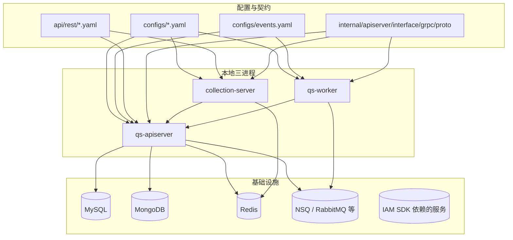

# 本地开发与配置约定

**本文回答**：在本地如何构建、启动、检查和排障 `qs-server` 三个进程；`ENV` 如何影响配置文件和端口；配置、事件契约、REST/gRPC 契约和基础设施检查分别在哪里；开发时哪些约定不能混用。

> 本文只讲“怎么在本地跑起来、怎么确认配置入口、怎么做基础自检”。业务链路见 `03-核心业务链路.md`，三进程职责见 `01-系统地图.md`，配置体系深讲见 `../03-基础设施/runtime/` 或配置专题文档。

---

## 30 秒结论

| 维度 | 结论 |
| ---- | ---- |
| Go 版本 | 以 `go.mod` 和 `Makefile` 为准，当前声明为 `1.25.9` |
| 默认环境 | `ENV=dev` |
| dev 配置 | `configs/apiserver.dev.yaml`、`configs/collection-server.dev.yaml`、`configs/worker.dev.yaml` |
| prod 配置 | `configs/apiserver.prod.yaml`、`configs/collection-server.prod.yaml`、`configs/worker.prod.yaml` |
| dev HTTP 端口 | apiserver `18082`，collection `18083` |
| prod HTTP 端口 | apiserver `8081`，collection `8082` |
| 三进程启动 | `make run-apiserver`、`make run-collection`、`make run-worker` 或 `make run-all` |
| 基础设施检查 | `make check-infra`，底层脚本是 `scripts/check-infra.sh` |
| REST 契约 | `api/rest/apiserver.yaml`、`api/rest/collection.yaml` |
| gRPC 契约 | `internal/apiserver/interface/grpc/proto/` |
| 事件契约 | `configs/events.yaml` |
| 文档检查 | `make docs-hygiene`、`make docs-verify` |

---

## 本地开发心智模型

本地开发不是“启动一个后端服务”，而是至少面对三类对象：



开发时要先分清楚：

1. **进程是否起来**：看 `make status-all`、PID、日志。
2. **基础设施是否可用**：看 `make check-infra`。
3. **配置是否选对**：看 `ENV` 和 `configs/*.yaml`。
4. **契约是否同步**：看 REST yaml、proto、events.yaml。
5. **链路是否走通**：看 collection -> apiserver gRPC、apiserver -> MQ -> worker -> apiserver internal gRPC。

---

## 环境变量 `ENV` 与配置选择

`Makefile` 使用 `ENV` 决定配置文件和默认端口。

| `ENV` | apiserver 配置 | collection 配置 | worker 配置 | apiserver HTTP | collection HTTP |
| ----- | -------------- | --------------- | ----------- | -------------- | --------------- |
| `dev` / 未设置 | `configs/apiserver.dev.yaml` | `configs/collection-server.dev.yaml` | `configs/worker.dev.yaml` | `18082` | `18083` |
| `prod` | `configs/apiserver.prod.yaml` | `configs/collection-server.prod.yaml` | `configs/worker.prod.yaml` | `8081` | `8082` |

示例：

```bash
# 默认 dev
make build-all
make run-all

# 显式 dev
ENV=dev make run-all

# prod 配置
ENV=prod make build-all
ENV=prod make run-all
```

注意：`ENV=prod` 只说明 Makefile 选择 prod yaml 和端口，不代表当前机器已经具备生产环境证书、数据库、MQ、IAM 等依赖。不要把 prod 启动成功等同于生产部署完成。

---

## 三进程启动方式

### 构建

```bash
make build-all
```

等价于分别构建：

```bash
make build-apiserver
make build-collection
make build-worker
```

产物默认在 `bin/` 下：

| 二进制 | Makefile 变量 |
| ------ | ------------- |
| `bin/qs-apiserver` | `APISERVER_BIN` |
| `bin/collection-server` | `COLLECTION_BIN` |
| `bin/qs-worker` | `WORKER_BIN` |

### 启动

推荐本地先按顺序启动：

```bash
make run-apiserver
make run-collection
make run-worker
```

也可以一键：

```bash
make run-all
```

`run-all` 会先执行基础设施检查，再启动 apiserver、collection、worker。

### 停止与重启

```bash
make stop-all
make restart-all

make stop-apiserver
make restart-apiserver
```

### 状态与日志

```bash
make status-all
make logs-all

make logs-apiserver
make logs-collection
make logs-worker
```

PID 文件位于：

```text
tmp/pids/apiserver.pid
tmp/pids/collection.pid
tmp/pids/worker.pid
```

日志位于：

```text
logs/apiserver.log
logs/collection-server.log
logs/worker.log
```

---

## 健康检查

### HTTP 健康检查

dev 默认：

```bash
curl -sS http://127.0.0.1:18082/healthz
curl -sS http://127.0.0.1:18083/healthz
```

也可以使用：

```bash
make health-check
```

`make health-check` 的语义：

| 目标 | 检查方式 |
| ---- | -------- |
| qs-apiserver | curl `http://localhost:${APISERVER_PORT}/healthz` |
| collection-server | curl `http://localhost:${COLLECTION_PORT}/healthz` |
| qs-worker | 检查 PID 文件且进程存活 |

worker 不等同于一个常规对外 HTTP 服务。它的业务状态应结合 MQ 消费、日志、metrics/governance 配置和事件处理情况判断。

---

## 基础设施检查

本地常见依赖：

| 依赖 | 默认检查 |
| ---- | -------- |
| MySQL | `127.0.0.1:3306` |
| Redis | `127.0.0.1:6379` |
| MongoDB | `127.0.0.1:27017` |
| NSQ lookupd | `127.0.0.1:4161` |
| NSQ nsqd | `127.0.0.1:4151` |

检查命令：

```bash
make check-infra
make check-mysql
make check-redis
make check-mongodb
make check-nsq
```

底层脚本：

```bash
scripts/check-infra.sh all
scripts/check-infra.sh mysql
scripts/check-infra.sh redis
scripts/check-infra.sh mongodb
scripts/check-infra.sh nsq
```

可用环境变量覆盖连接参数，例如：

```bash
MYSQL_HOST=192.168.1.100 make check-mysql
REDIS_HOST=127.0.0.1 REDIS_PORT=6379 make check-redis
MONGO_HOST=127.0.0.1 MONGO_PORT=27017 make check-mongodb
NSQ_HOST=127.0.0.1 make check-nsq
```

不要把脚本中的默认账号密码当成生产安全配置。它们只服务本地开发检查。

---

## 热重载开发

如果本地安装了 `air`，可以使用：

```bash
make dev
```

分别启动：

```bash
make dev-apiserver
make dev-collection
make dev-worker
```

停止：

```bash
make dev-stop
```

状态：

```bash
make dev-status
```

热重载适合改 handler、application service、domain 逻辑时快速调试；如果变更了 proto、OpenAPI 生成物、migration、配置 schema，仍应按对应生成或校验流程走，不要只依赖热重载。

---

## 配置文件分工

### 三进程配置

| 进程 | dev | prod | 说明 |
| ---- | --- | ---- | ---- |
| qs-apiserver | `configs/apiserver.dev.yaml` | `configs/apiserver.prod.yaml` | HTTP/gRPC、DB、Redis、MQ、IAM、scheduler、resilience 等 |
| collection-server | `configs/collection-server.dev.yaml` | `configs/collection-server.prod.yaml` | REST、gRPC client、JWT/IAM、SubmitQueue、限流等 |
| qs-worker | `configs/worker.dev.yaml` | `configs/worker.prod.yaml` | MQ subscriber、gRPC client、lock、metrics/governance 等 |

### 事件配置

```text
configs/events.yaml
```

它是事件系统的机器契约，描述：

1. topic key 与真实 topic name。
2. event type 属于哪个 topic。
3. delivery 是 `best_effort` 还是 `durable_outbox`。
4. aggregate 与 domain。
5. handler 名称。

修改事件时，至少同时检查：

```text
configs/events.yaml
internal/pkg/eventcatalog/
internal/pkg/eventruntime/
internal/worker/integration/eventing/dispatcher.go
internal/worker/handlers/
apiserver 发布或 outbox 写入位置
docs/03-基础设施/event/
```

### REST 契约

```text
api/rest/apiserver.yaml
api/rest/collection.yaml
```

生成和校验命令：

```bash
make docs-swagger
make docs-rest
make docs-verify
```

### gRPC 契约

```text
internal/apiserver/interface/grpc/proto/
```

尤其要关注：

```text
internalapi/internal.proto
```

它定义 worker 回调 apiserver 的 internal gRPC 能力，包括：

```text
CalculateAnswerSheetScore
CreateAssessmentFromAnswerSheet
EvaluateAssessment
SyncAssessmentAttention
ProjectBehaviorEvent
SendTaskOpenedMiniProgramNotification
BootstrapOperator
PlanCommandService.*
```

---

## 本地调试主链路

建议按下面顺序验证。

### 第一步：基础设施

```bash
make check-infra
```

如果失败，先不要启动三进程。按组件逐个查：

```bash
make check-mysql
make check-redis
make check-mongodb
make check-nsq
```

### 第二步：启动 apiserver

```bash
make build-apiserver
make run-apiserver
make logs-apiserver
curl -sS http://127.0.0.1:18082/healthz
```

如果 apiserver 启动失败，优先看：

1. 配置文件路径是否正确。
2. MySQL / Mongo / Redis 是否可连。
3. MQ publisher 是否创建失败并降级。
4. IAM / gRPC / TLS 配置是否不匹配。
5. event catalog 是否能加载 `configs/events.yaml`。

### 第三步：启动 collection

```bash
make build-collection
make run-collection
make logs-collection
curl -sS http://127.0.0.1:18083/healthz
```

如果 collection 提交失败，优先看：

1. collection 是否能连 apiserver gRPC。
2. JWT / IAM 认证是否通过。
3. SubmitQueue 是否满。
4. request_id 是否被正确传递。
5. apiserver 返回的 gRPC status 如何映射到 HTTP。

### 第四步：启动 worker

```bash
make build-worker
make run-worker
make logs-worker
make status-worker
```

如果 worker 不消费事件，优先看：

1. MQ 是否可连。
2. `configs/events.yaml` 是否加载。
3. event handler registry 是否包含配置中的 handler。
4. topic / channel 是否匹配。
5. worker 是否能通过 gRPC 回调 apiserver。
6. 分布式锁或幂等保护是否导致跳过。

---

## 文档与契约维护命令

文档变更后至少执行：

```bash
make docs-hygiene
git diff --check
```

如果涉及 REST：

```bash
make docs-verify
```

如果涉及 proto：

```bash
go test ./internal/apiserver/transport/grpc/... ./internal/collection-server/... ./internal/worker/...
```

如果涉及事件：

```bash
go test ./internal/pkg/eventcatalog/... ./internal/pkg/eventruntime/... ./internal/worker/integration/eventing/... ./internal/worker/handlers/...
```

---

## 常见本地问题

| 问题 | 优先检查 |
| ---- | -------- |
| apiserver 起不来 | DB / Mongo / Redis / events.yaml / IAM 配置 |
| collection 返回 401 | JWT / IAM / UserIdentity middleware |
| collection 返回 429 | SubmitQueue 满、限流策略 |
| submit-status 查不到 | request_id 是否一致、状态 TTL 是否过期、collection 是否重启 |
| worker 无消费 | MQ、topic、channel、handler registry |
| assessment 不生成 | `answersheet.submitted` 是否 outbox relay、worker 是否调用 internal gRPC |
| report 不生成 | `assessment.submitted` 是否产生、EvaluateAssessment 是否失败 |
| stats 不更新 | behavior projector、statistics sync、Redis/MySQL 落盘 |
| 文档链接坏了 | `make docs-hygiene` |
| REST 文档漂移 | `make docs-verify` |

---

## 不要做的事

| 不要做 | 原因 |
| ------ | ---- |
| 不要直接改生产 yaml 测本地 | 容易引入证书、地址、密钥和端口误判 |
| 不要把 request_id 当业务幂等键 | 它只服务 collection 本地状态 |
| 不要绕过 apiserver 让 worker 写业务状态 | worker 是异步执行器，不是第二主写模型 |
| 不要手写 REST 契约后不生成/对比 | REST 契约应由 swagger / compare 流程保护 |
| 不要改事件名后只改 handler | 事件契约必须同步 `configs/events.yaml` |
| 不要把 `_archive` 当现行事实 | archive 只保留历史背景 |

---

## 代码与配置锚点

| 类型 | 路径 |
| ---- | ---- |
| Makefile | `Makefile` |
| go version | `go.mod`、`Makefile` |
| 基础设施检查 | `scripts/check-infra.sh` |
| apiserver 配置 | `configs/apiserver.dev.yaml`、`configs/apiserver.prod.yaml` |
| collection 配置 | `configs/collection-server.dev.yaml`、`configs/collection-server.prod.yaml` |
| worker 配置 | `configs/worker.dev.yaml`、`configs/worker.prod.yaml` |
| 事件契约 | `configs/events.yaml` |
| REST 契约 | `api/rest/apiserver.yaml`、`api/rest/collection.yaml` |
| gRPC proto | `internal/apiserver/interface/grpc/proto/` |
| 三进程入口 | `cmd/qs-apiserver/`、`cmd/collection-server/`、`cmd/qs-worker/` |
| apiserver process | `internal/apiserver/process/` |
| collection process | `internal/collection-server/process/` |
| worker process | `internal/worker/process/` |
| 文档检查脚本 | `scripts/check_docs_hygiene.py` |
| REST 文档生成/对比 | `scripts/generate_rest_from_swagger.py`、`scripts/compare_api_docs.py` |

---

## 推荐本地启动剧本

首次跑仓库：

```bash
go version

make check-infra

make build-all

make run-apiserver
make run-collection
make run-worker

make status-all
make health-check
```

调试主链路：

```bash
tail -f logs/collection-server.log
tail -f logs/apiserver.log
tail -f logs/worker.log
```

文档变更：

```bash
make docs-hygiene
git diff --check
```

REST 契约变更：

```bash
make docs-verify
```

---

## 下一跳

| 想继续看 | 阅读 |
| -------- | ---- |
| 系统整体分工 | `01-系统地图.md` |
| 代码目录与边界 | `02-代码组织与边界.md` |
| 答卷到报告链路 | `03-核心业务链路.md` |
| apiserver 启动组合根 | `../01-运行时/01-qs-apiserver启动与组合根.md` |
| 事件系统 | `../03-基础设施/event/00-整体架构.md` |
| 配置体系深讲 | `../03-基础设施/runtime/00-运行时组合图与启动阶段.md` |
| 接口契约 | `../04-接口与运维/00-接口契约总览.md` |
