# 核心业务链路

> 状态：已实现与规划改造并存。
>
> 本文从运营发布一个可执行测评开始，沿门诊二维码和 Plan 周期任务两类入口，跟踪受试者与填写人、答卷可靠受理、Assessment Intake、Evaluation、Interpretation、报告查询和患者级因子趋势的完整链路。
>
> 未标状态的流程表示已经沿当前代码核对；明确标注为“规划改造”或“当前不足”的内容，是我们确认的目标边界，不能当作现有实现。

## 1. 本文要回答的问题

读完本文，应当能够回答：

1. 一项测评怎样从运营维护的草稿变成运行时可以使用的发布版本？
2. 为什么问卷和测评模型必须作为一个 Assessment Release 发布？
3. 门诊二维码 AssessmentEntry 和 Plan 周期 Task 有什么区别，又在哪里汇入同一条执行链？
4. IAM User、IAM Profile、Testee、Filler 和 Clinician 分别表达什么事实？
5. 为什么家长填写不需要复制一套独立的测评流程？
6. 答卷接口返回 `202 Accepted` 时，系统究竟承诺了什么？
7. AnswerSheet、Assessment、EvaluationRun、Outcome、ReportGeneration 和 Report 为什么不能合并成一个对象？
8. Evaluation 怎样在不关心具体产品类型的前提下执行医学量表、人格测评和行为能力测评？
9. Interpretation 为什么必须从冻结 Outcome 生成报告，而不能重新读取最新草稿？
10. 患者、家长、医生和运营为什么读取同一份报告，却需要不同的授权路径和呈现视图？
11. 门诊测评和不同 Plan 中产生的结果为什么会进入同一条患者级趋势？
12. 当前实现还有哪些地方没有达到我们确认的业务边界？

## 2. 三十秒结论

qs-server 的核心业务链路不是“提交一张表单，然后计算一个总分”，而是两条生命周期的衔接：

1. **内容生产链**：运营维护问卷与测评模型，通过 Assessment Release 发布一组不可变、可执行的测评知识；
2. **测评执行链**：医生或 Plan 只选择稳定的测评编码，患者或家长填写精确问卷版本，系统可靠保存 AnswerSheet，再通过事件驱动依次产生 Assessment、Outcome 和 Report。

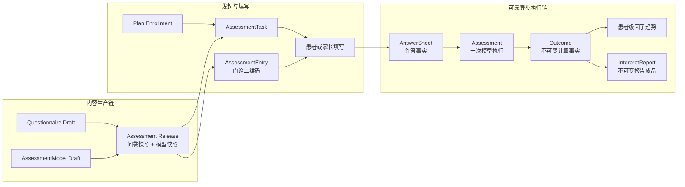

主链上的四个核心业务事实不能互相替代：

| 事实 | 回答的问题 | 不负责什么 |
| --- | --- | --- |
| AnswerSheet | 谁针对哪一版问卷提交了哪些答案 | 不决定使用什么模型，也不等于测评结果 |
| Assessment | 这份答卷将使用哪个模型执行一次什么测评 | 不保存完整计算事实，也不拥有报告成品 |
| Outcome | 这次 Evaluation 实际算出了什么 | 不负责面向不同角色组织说明文字 |
| InterpretReport | 如何把冻结结果组织成可阅读的报告 | 不反向改变 AnswerSheet、Assessment 或 Outcome |

当前可靠事件主链为：

```text
answersheet.submitted
  -> evaluation.requested
  -> evaluation.outcome.committed | evaluation.failed
  -> interpretation.report.generated | interpretation.report.failed
```

事件名、Topic、Channel 和 Handler 以 [`configs/events.yaml`](../../configs/events.yaml) 为准。

## 3. 先建立一套统一业务语言

### 3.1 内容、入口、执行结果不是同一种东西

| 概念 | 业务含义 | 生命周期 |
| --- | --- | --- |
| Questionnaire | 给填写人展示的题目、选项和作答约束 | 草稿、发布版本、归档版本 |
| AssessmentModel | 因子、常模、算法、解释规则和报告输入配置等测评知识 | 草稿、发布快照、归档版本 |
| AssessmentRelease | 问卷与测评模型成对进入运行时的发布边界 | 发布、下架、归档 |
| AssessmentEntry | 医生为非 Plan 场景提供的可复用测评入口，典型形态是门诊二维码 | 启用、停用、过期 |
| Plan | 一个患者在一段时间内持续完成一种测评的安排 | 草稿/启用/结束等计划生命周期 |
| AssessmentTask | Plan 按周期为某个患者生成的一次待办 | `pending -> opened -> completed`，也可 `expired/canceled` |
| AnswerSheet | 一次已经提交的作答事实 | 提交后作为历史事实保留 |
| Assessment | 对一份 AnswerSheet 使用一个确定模型进行的一次执行 | `pending -> submitted -> evaluated/failed` |
| EvaluationRun | 某次 Assessment 的一次执行尝试 | claim、running、succeeded/failed |
| Outcome | 一次成功 Evaluation 的不可变计算结果 | 成功提交后不再覆盖 |
| ReportGeneration | 对一个 Outcome、报告类型和模板版本生成报告的幂等生命周期 | processing、generated/failed |
| InterpretationRun | 一次报告生成尝试 | claim、running、succeeded/failed |
| InterpretReport | 面向阅读者的不可变报告成品 | 生成后不反向修改计算事实 |

### 3.2 “测评编码”是跨链路的稳定身份

运营会持续发布新版本，但医生和 Plan 不应保存一份容易过期的完整配置。它们保存的是稳定测评编码，真正开始一次测评时再解析当前可用发布版本。

因此需要区分：

- **稳定身份**：测评编码，回答“这是哪一种测评”；
- **执行版本**：问卷快照、模型快照和报告规范，回答“这一次具体执行了哪一版知识”；
- **历史事实**：AnswerSheet、Outcome 和 Report，回答“当时实际发生了什么”。

版本可以演进，已经完成的历史事实不能跟随最新版本变化。

## 4. 阶段一：运营发布一个可执行测评

### 4.1 为什么不能独立发布问卷和模型

一份问卷只有题目和答案约束，还不能说明怎样完成专业测评；一个测评模型如果指向尚未发布或版本不匹配的问卷，也无法可靠执行。

如果允许二者分别上线，运行时可能观察到这些中间状态：

- 新问卷已经上线，但对应模型仍使用旧的题目映射；
- 模型已经上线，但它引用的问卷版本不可读取；
- 因子规则已经变化，但报告配置仍只认识旧因子；
- 前端拿到一版问卷，Worker 稍后却解析到另一版模型绑定。

当前代码通过 `AssessmentReleaseService` 把发布、下架和归档收敛到一个公开边界。发布过程在同一个 Mongo session transaction 中完成：

1. 加载并授权操作目标 AssessmentModel；
2. 发布它绑定的 Questionnaire；
3. 取得系统实际发布的 Questionnaire code/version，客户端不能自行指定一个版本；
4. 校验问卷与模型绑定；
5. 必要时更新模型中的精确绑定；
6. 生成不可变 Published Model Snapshot；
7. 事务提交后再执行缓存失效等后置效果。

这里的 Assessment Release 是**应用层发布单元和运行时一致性边界**，不必为了命名对称而把它再建模成一个新的领域聚合。

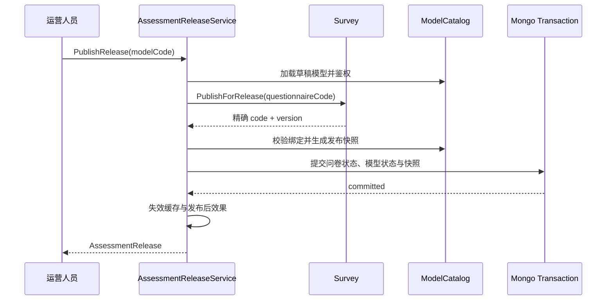

### 4.2 当前发布版本包含什么

> 状态：已实现。

当前公开 `AssessmentRelease` 明确表达：

- ModelCode；
- 模型发布状态；
- QuestionnaireCode；
- QuestionnaireVersion；
- 问卷发布状态；
- 发布时间或归档时间。

业务发布版本以 QuestionnaireVersion 对外表达；模型自身持久化 revision 不作为另一个需要调用方协调的业务版本暴露。运行时仍会读取与这份问卷绑定的不可变 Published Model Snapshot。

因此，更准确的业务语言是：

> 一次发布使“精确问卷快照 + 与之绑定的不可变测评模型快照”共同成为可执行版本。

### 4.3 完整发布契约还应包含报告规范

> 状态：规划改造。

我们确认的完整 Assessment Release 不应只冻结“怎样收集”和“怎样计算”，还应冻结“怎样生成报告”。目标发布引用至少应包括：

```text
AssessmentReleaseRef
  QuestionnaireRef(code, version)
  PublishedModelRef(kind, code, version, runtime identity)
  ReportSpecRef(
    report type,
    template version,
    builder/template adapter,
    content schema version
  )
```

当前 Interpretation 的 `TemplateVersion` 通常使用 `v1`，Outcome 已经冻结 ReportInput、模型身份和计算事实，但 Builder 或模板如果在同一个 `v1` 名称下发生变化，延迟生成或重试仍可能得到不同成品。

所以“历史可复现”不能只要求模型有版本，还要求报告模板身份本身不可变，或者每次不兼容变化都产生新的 TemplateVersion。

## 5. 阶段二：通过 AssessmentEntry 或 Plan 发起测评

### 5.1 AssessmentEntry：门诊二维码入口

AssessmentEntry 表达的是医生创建的非 Plan 测评入口。它的典型业务形态是门诊二维码：患者到达门诊后扫码，系统解析入口、建立受试者上下文，再进入测评填写。

它不是 Assessment，也不是一张已经创建好的答卷：

- 一个入口可以在停用或过期前被多名患者、多次解析；
- “一次性测评”表示它不属于周期 Plan，不表示 token 只能使用一次；
- 入口只决定从哪一种测评开始，不提前创建 Outcome 或 Report；
- 正常 Intake 会解析或创建 Testee，并建立医生与受试者的创建/访问关系。

当前领域对象仍保留 `TargetVersion`，创建接口也允许传入该字段。但我们确认的主业务规则是：

> AssessmentEntry 和 Plan 一样只保存稳定测评编码，每次扫码开始实际测评时使用最新发布版本。

因此 `TargetVersion` 属于当前实现遗留，服务器尚未把“扫码时必须选择最新发布版本”固化成不可绕过的不变式。本文将其视为设计不足，而不是推荐用法。

### 5.2 Plan：持续测评安排

Plan 的业务本质是：

> 一个患者在一个时间段内，按照预先配置的周期持续填写一种测评。

治疗方案预先配置周期，系统根据医生要求创建相应 Plan，患者加入 Plan 后产生 Enrollment，并按周期生成 AssessmentTask。

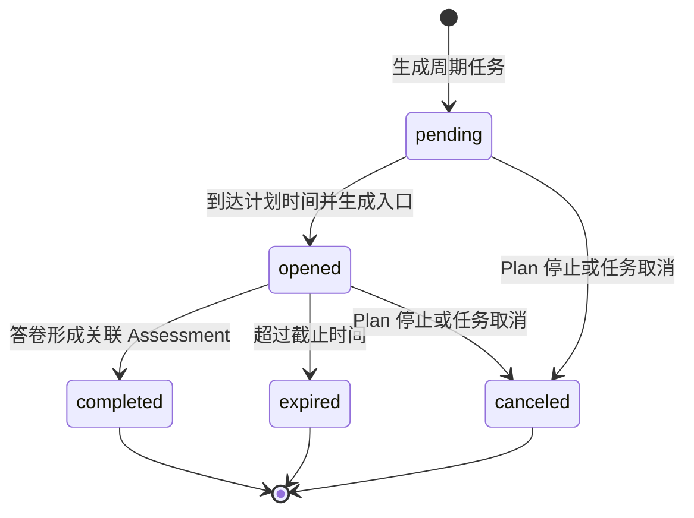

Plan 和 Task 当前只保存测评编码，不固定发布版本。每个 Task 真正执行时使用当时的最新发布版本。这样可以避免治疗周期内持续引用已经下架的内容，但也意味着同一个 Plan 中的不同 Task 可能使用不同版本。

当前 Assessment Intake 在创建 Assessment 后以 best-effort 完成匹配到的 Plan Task。Task 完成是随访编排事实，不是 Outcome 或 Report 已经生成成功的证明。

### 5.3 两类入口在哪里汇合

AssessmentEntry 和 Plan Task 不需要抽象成同一个领域对象：

- AssessmentEntry 解决门诊或临时发起；
- Plan Task 解决周期、提醒、过期和任务状态；
- 二者都只把填写人带到精确问卷；
- 真正统一的事实边界是 AnswerSheet 提交。

```text
AssessmentEntry -----------\
                            -> AnswerSheet -> Assessment -> Outcome -> Report
Plan -> AssessmentTask ----/
```

这种“在事实处汇合”的设计，比强行让所有入口继承同一个巨大基类更稳定。入口可以继续扩展，Survey 之后的统一执行链不需要知道用户是扫码进入还是被 Plan 提醒进入。

## 6. 阶段三：建立受试者、填写人与授权上下文

### 6.1 五个身份概念

| 概念 | 所属边界 | 表达的事实 |
| --- | --- | --- |
| IAM User | IAM | 当前认证账号是谁，也是实际操作提交的人 |
| IAM Profile | IAM | 一个自然人的统一档案 |
| ProfileLink | IAM | 某个 User 是否有权代表某个 Profile |
| QS Testee | Actor | 该自然人在某个组织的测评语境中是谁 |
| Filler | AnswerSheet/Actor 引用 | 这份答案实际由哪个 IAM User 提交 |
| Clinician | Actor | 哪个医生在当前组织拥有相应测评和受试者访问关系 |

其中最容易混淆的是 Testee 和 Filler：

- Testee 回答“这份测评描述谁”；
- Filler 回答“谁实际提交了答案”。

### 6.2 家长填写为什么不需要分叉主链

儿童患者可能不能独立完成量表，家长既可能代为作答，也可能填写家长观察版量表。当前业务不要求 qs-server 进一步判断这两种动机，只要求可靠保存：

```text
FillerID = 实际提交答案的 IAM User
TesteeID = 测评所描述的受试者
```

只要家长拥有指向儿童 IAM Profile 的 active ProfileLink，就可以代表该 Profile 完成提交。后续 AnswerSheet、Assessment、Outcome 和 Report 链路与患者本人填写完全相同。

领域中已经存在 `self/guardian/staff` 三种 FillerType，但当前 collection-server 提交链统一创建 `FillerTypeSelf`。因此，现阶段不能把 FillerType 当成“家长代填还是本人填写”的可靠业务事实；可靠事实仍是 FillerID 与 TesteeID。

### 6.3 身份与资源授权是两层检查

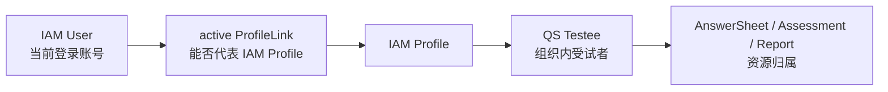

ProfileLink 只能证明“这个账号可以代表这个自然人”，不能自动证明任意 Assessment 都属于该 Testee。资源查询仍需校验 AnswerSheet、Assessment 或 Report 的 Testee/Org 归属。

## 7. 阶段四：答卷可靠受理与 202 语义

### 7.1 `202 Accepted` 的准确含义

当前答卷接口返回 `202 Accepted` 时，表示：

> AnswerSheet 已经持久化，并且推动后续异步处理所需的 `answersheet.submitted` Outbox 也已经持久化；Evaluation 和 Report 尚未承诺完成。

用户看到的业务语言应当是：

> 答卷已提交，测评结果生成中。

不能解释成：

- 请求刚刚进入 collection-server 内存队列；
- Worker 已经开始计算；
- Assessment 已创建；
- 报告已经生成；
- 系统保证用户立刻能查询到结果。

### 7.2 返回 202 之前发生什么

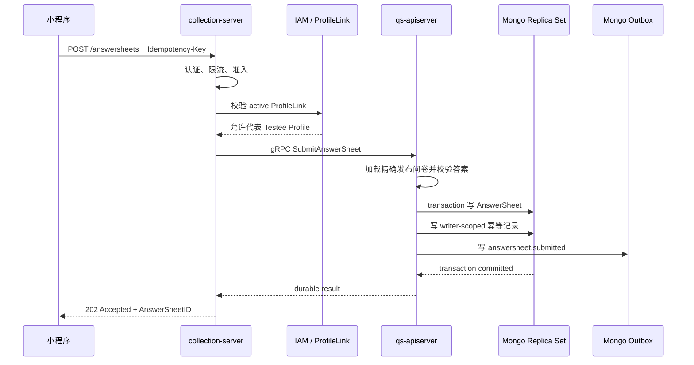

202 之前的关键步骤包括：

1. 当前 IAM User 已认证；
2. active ProfileLink 允许该 User 代表目标 Testee 对应 Profile；
3. 请求指定的精确 Questionnaire code/version 可读取；
4. 题目、题型、必填项和答案值通过发布问卷的提交规格校验；
5. Mongo transaction 写入 AnswerSheet；
6. 同一事务写入 `(writer_id, idempotency_key)` 幂等记录；
7. 同一事务写入 `answersheet.submitted` Outbox。

### 7.3 为什么不再用进程内 SubmitQueue 表示成功

项目曾为应对 Plan 集中推送、校内筛查和线上直播形成的峰值，在 collection-server 使用提交 Queue，并将“系统已经收到请求并开始处理”视为成功。

这个方案降低了入口瞬时压力，但改变了成功语义：如果进程在入队后、持久化前退出，客户端已经收到成功，答卷却可能永久丢失。

当前重构删除了这条进程内成功边界。系统宁可在 Mongo、ProfileLink 或下游受理能力不可用时返回 `503`，让客户端使用相同幂等键重试，也不能对只存在于内存中的请求返回 202。

### 7.4 幂等与未知提交结果

Redis 提交租约只用于减少并发重复请求，不是幂等事实源。真正的幂等边界在 Mongo：

```text
unique(writer_id, idempotency_key)
+ submission fingerprint
```

- 同一填写人使用相同幂等键和相同内容重试，返回已经完成的 AnswerSheet；
- 相同幂等键对应不同内容，返回冲突；
- Redis 不可用不能让重复答卷成为合法事实；
- Mongo commit 返回未知结果时，服务使用脱离原请求取消信号的短窗口查询已完成幂等记录；
- 当前上层恢复窗口约为 500ms，只有查到已完成记录才允许返回成功。

因此客户端重试同一次业务提交时，必须复用同一个幂等键，不能每次生成新键。

### 7.5 Outbox 是可靠性来源，快速派发只是延迟优化

事务提交后可以立即尝试派发事件，也可以更新 ReadyIndex 或唤醒 Relay，但这些机制只减少等待时间。即使即时派发失败，Outbox Relay 仍可以在之后重投。

系统提供的是 at-least-once：同一个事件可能被重复发布和消费，下游必须幂等；系统不以“消息永远只出现一次”为前提设计业务状态机。

## 8. 阶段五：从 AnswerSheet 建立 Assessment

### 8.1 AnswerSheet 和 Assessment 为什么分开

AnswerSheet 是“作答事实”，Assessment 是“执行意图与生命周期”。两者分开后，系统可以表达：

- 一份独立问卷只收集答案，不进入测评计算；
- 一份测评答卷绑定具体模型并进入 Evaluation；
- AnswerSheet 已经可靠保存，但 Assessment 尚在异步创建；
- Assessment 创建或提交失败时，不否定已经发生的作答事实；
- Worker 重放时按 AnswerSheetID 幂等复用同一个 Assessment。

### 8.2 Assessment Intake 做什么

Worker 消费 `answersheet.submitted` 后，通过 internal gRPC 进入 Assessment Intake Journey。该 Journey 跨 Survey、ModelCatalog、Plan 和 Evaluation 编排，但不把这些模块合并成一个聚合。

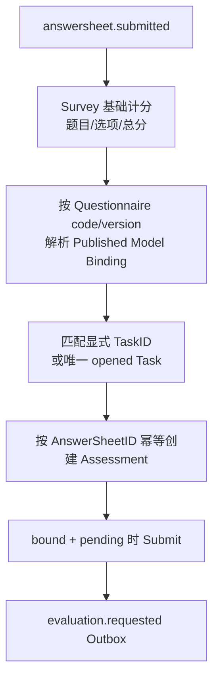

它依次完成：

1. 计算并保存 Survey 基础分；
2. 按 AnswerSheet 中的 Questionnaire code/version 解析发布模型绑定；
3. 如果提交显式 TaskID，校验组织、受试者、任务状态和测评编码；
4. 如果没有 TaskID，只在能够唯一匹配一个 opened Task 时自动关联，歧义任务不应猜测；
5. 以 AnswerSheetID 为唯一业务键创建或复用 Assessment；
6. 对已绑定且处于 pending 的 Assessment 执行 Submit；
7. 在 MySQL 本地事务中保存 submitted 状态和 `evaluation.requested` Outbox；
8. best-effort 完成匹配到的 Plan Task。

Survey 基础计分只处理题目、选项和基础汇总，不拥有因子、常模、人格分类和报告规则。

### 8.3 Assessment 冻结哪些身份

一个进入 Evaluation 的 Assessment 至少要能够稳定引用：

- OrgID；
- TesteeID；
- AnswerSheetID；
- Questionnaire code/version；
- Evaluation Model kind/subKind/algorithm/code/version/title；
- 来源类型和来源 ID；
- 当前执行状态。

Assessment 的模型引用一旦确定，后续 Evaluation 必须读取精确发布快照，不能重新解析“当前最新模型”。

### 8.4 当前绑定时机存在可靠性缺口

> 状态：规划改造。

当前 202 事务只冻结 Questionnaire code/version。Published Model Binding 是 Worker 稍后消费 `answersheet.submitted` 时解析的。

这产生一个竞态窗口：

```text
T1  AnswerSheet + Outbox committed，返回 202
T2  运营发布新版本或下架旧的 active binding
T3  Worker 才开始解析 Questionnaire -> Model
```

虽然已发布精确快照会保留，但当前 binding resolver 依赖运行时可解析的绑定状态；202 时尚未把完整 AssessmentReleaseRef 固化到答卷或受理记录中。

目标边界是：

> 对需要进入测评链的提交，202 必须同时冻结完整 AssessmentReleaseRef；独立问卷可以只产生 AnswerSheet，但测评答卷缺少绑定必须进入明确失败、重试或人工补偿状态，不能被当作正常的无模型 Assessment。

当前 `applyBinding` 在未找到绑定时可以继续创建 unbound Assessment，Worker 随后 ACK，且不会产生 `evaluation.requested`。这可能让已受理答卷长期停在没有后续动作的状态，是本文需要明确记录的关键设计不足。

## 9. 阶段六：Evaluation 产生不可变 Outcome

### 9.1 Worker 只驱动执行，不拥有业务规则

qs-worker 消费 `evaluation.requested`，通过 `EvaluationWorkerService` internal gRPC 调用 qs-apiserver。Worker 负责：

- 事件解析和基本校验；
- ACK/NACK；
- 重复消费抑制；
- 调用超时和执行控制；
- 根据已持久化回执决定下一步。

Worker 不负责：

- 解释问卷答案；
- 选择某个具体量表的硬编码函数；
- 计算因子、常模或人格类型；
- 直接写 Outcome；
- 生成报告正文。

核心规则仍由 qs-apiserver 中的 Evaluation 模块拥有。

### 9.2 一次 Evaluation 的执行步骤

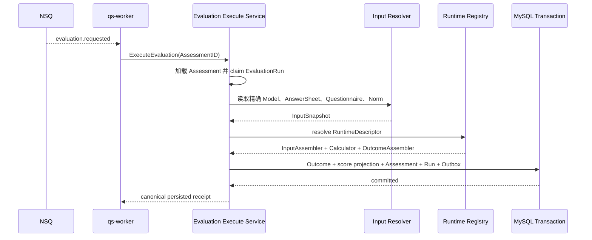

执行过程包括：

1. 加载 Assessment 并判断状态是否允许执行；
2. claim 一个带租约、attempt、trace 和失败信息的 EvaluationRun；
3. 解析精确 InputSnapshot；
4. 根据模型身份选择 RuntimeDescriptor；
5. 依次执行 `InputAssembler -> Calculator -> OutcomeAssembler`；
6. 得到内存 Execution；
7. 在同一 MySQL 事务中提交不可变 Outcome、得分投影、Assessment 状态、Run 状态和 `evaluation.outcome.committed` Outbox；
8. Worker 重读持久化回执后决定消息 settlement。

### 9.3 InputSnapshot 为什么重要

InputSnapshot 不是简单把请求 DTO 复制一份。它组合：

- 精确 Published Model；
- 模型 payload 与 runtime identity；
- AnswerSheet；
- 精确 Questionnaire；
- 需要时的 NormSubject 和常模引用。

同一个 Run 不允许在执行中途切换快照引用。否则重试可能在一半使用旧规则、一半使用新规则，既无法复现，也无法解释。

### 9.4 多种测评怎样复用同一主链

当前正式产品类型与主要算法机制的关系为：

| 业务类型 | 主要算法机制 | 典型结果 |
| --- | --- | --- |
| 医学量表测评 | `factor_scoring` | 总分、因子分、风险等级、解释区间 |
| 人格测评 | `factor_classification` | 人格维度、类型或特征分类 |
| 行为能力测评 | `factor_norm` | 原始分、派生分、常模位置和能力维度 |

代码中还保留 task performance/cognitive 等技术机制，它们是运行时扩展能力，不是当前正式业务类型。

Evaluation 并非完全“不知道类型”，而是把类型差异收敛到有限机制注册表：

```text
Model identity
  -> AlgorithmFamily
  -> RuntimeDescriptor
  -> InputAssembler
  -> Calculator
  -> OutcomeAssembler
```

因此准确的架构结论是：

> Evaluation 的生命周期编排不依赖具体测评产品类型；它根据模型身份选择有限的算法机制，并通过 RuntimeDescriptor 执行对应流水线。

同一机制内新增测评主要是配置和发布问题；出现新的计算机制时，增加新的 Descriptor/Pipeline，而不是修改所有测评共同经过的状态机。

### 9.5 Execution 和 Outcome 的区别

- `Execution` 是 Calculator 在内存中形成的执行结果；
- `Outcome` 是事务成功后已经成立的、不可变的计算事实。

只有 Outcome 与对应状态、Outbox 同事务提交后，Evaluation 才算成功。内存中“已经算出来”但数据库提交失败，不能对外宣称测评完成。

## 10. 阶段七：Interpretation 生成不可变报告

### 10.1 Outcome 和 Report 为什么分开

Outcome 面向机器和后续业务，保存可计算、可投影的结果事实；Report 面向人，组织结论、维度说明、建议和呈现内容。

将二者分开可以保证：

- 报告生成失败不会否定已经成立的 Evaluation Outcome；
- 重新生成报告不需要重新计算分数；
- 多种报告类型可以基于同一个 Outcome 扩展；
- 趋势和统计可以直接使用结构化得分事实，不必解析报告文字；
- 不同角色的视图可以在读取阶段裁剪，不必重复计算 Outcome。

### 10.2 报告生成链路

`evaluation.outcome.committed` 事件携带关联信息，但 Worker 调用 Interpretation 时只需要传 OutcomeID。Interpretation 会重新读取 canonical Outcome，而不是相信事件里携带的一份大对象。

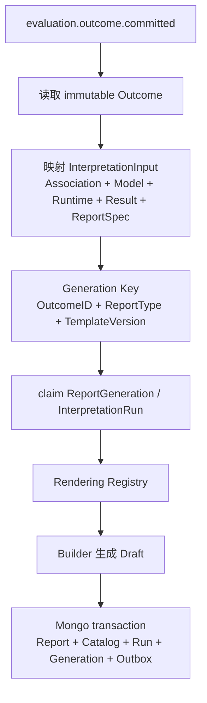

主要步骤为：

1. 读取不可变 Outcome Record；
2. 解码 Execution 和冻结 ReportInput；
3. 构造包含关联身份、模型、运行时、结果和 ReportSpec 的 InterpretationInput；
4. 以 `OutcomeID + ReportType + TemplateVersion` 作为报告生成幂等键；
5. claim ReportGeneration 和 InterpretationRun；
6. 按完整 Rendering Key 选择 Builder；
7. Builder 生成 Draft；
8. 在同一 Mongo transaction 中提交 InterpretReport、查询 Catalog、Run/Generation 成功状态和 `interpretation.report.generated` Outbox。

### 10.3 Builder Registry 怎样容纳差异

Registry 的选择键可以包含：

```text
AlgorithmFamily
+ DecisionKind
+ ReportType
+ TemplateVersion
+ optional Algorithm/ProductChannel/ReportProfile
```

当前主要 Builder 包括：

- Factor Scoring Builder；
- Norm Profile Builder；
- Typology Builder；
- Task Performance Builder（技术预留）。

这使报告生成既不需要按问卷编码写巨大 `switch`，也不必假装所有测评都能用完全相同的报告结构。

### 10.4 报告生成后的事件只是后置投影

`interpretation.report.generated` 可以驱动：

- 报告状态更新；
- 高风险关注投影；
- 日志、统计或通知；
- 前端等待链路的唤醒信号。

这些都是报告事实成立后的后置动作。它们失败时不应删除报告，也不应把 Assessment 从 evaluated 改回 failed。

## 11. 阶段八：不同角色读取报告

### 11.1 生成报告和有权查看报告是两个能力

同一份 InterpretReport 是 canonical 成品。谁能查看、能查看哪些部分，在查询阶段判断，而不是在生成时为每类用户复制一份报告。

```text
caller identity
  -> actor-specific authorization
  -> report catalog / artifact
  -> audience projection
  -> transport response
```

### 11.2 四类读取者

| 读取者 | 调用路径 | 核心授权问题 | Audience/结果 |
| --- | --- | --- | --- |
| 患者或家长 | collection-server -> ParticipantReport gRPC | IAM User 是否有 active ProfileLink；Assessment 是否属于 Testee | participant |
| 医生 | 外部医疗系统 -> qs-apiserver REST | Org/Operator 是否可访问 Testee；Assessment 是否属于 Testee | clinician |
| 运营/管理员 | qs-operating-system -> qs-apiserver REST | Assessment 是否在组织与操作员授权范围 | admin |
| 运维/审计 | internal REST | 组织一致且具有 Interpretation Audit capability | 生命周期元数据与历史诊断 |

患者和家长的授权分成两层：

1. collection-server 用 IAM ProfileLink 证明当前 User 能代表目标 Profile；
2. qs-apiserver Participant Service 校验目标 Assessment 确实属于 Testee。

医生查询则校验医生—受试者访问关系，并再次校验 Assessment 归属。运营列表按组织范围或可访问 Testee 子集过滤，不能把“可访问集合为空”误解成“查询整个组织”。

### 11.3 Audience 是读取投影，不是多份报告

当前 Presenter 的显式差异是：

| 内容 | Participant | Clinician | Admin |
| --- | --- | --- | --- |
| 标准分数、维度、结论和建议 | 可见 | 可见 | 可见 |
| `ModelExtra` | 可见 | 不可见 | 可见 |

未知 Audience 或未知 Section 不会默认放行。新增角色可见性应进入 Interpretation Presentation Policy，而不应散落在多个 REST Handler 中手工删字段。

### 11.4 患者侧读取授权尚未完全统一

> 状态：规划改造。

当前报告详情、报告状态和等待接口已经接入 `TesteeProfileLinkMiddleware`。但部分患者侧测评列表、因子得分、原始趋势和趋势摘要接口没有统一经过这层中间件。

下游 Participant/Testee Service 会校验“Assessment 是否属于传入的 TesteeID”，但这不能证明“当前登录 User 有权代表这个 Testee”。因此目标不变量是：

> 所有以 TesteeID 为资源边界的患者侧读取接口，都必须先完成 IAM ProfileLink 代理授权，再执行 AnswerSheet/Assessment/Report 归属校验。

## 12. 阶段九：形成患者级因子趋势

### 12.1 趋势属于受试者，不属于 Plan

当前业务只有一条患者级趋势，不区分“长期趋势”和“Plan 内趋势”。

同一患者可能：

- 在门诊扫码完成一次测评；
- 在第一个 Plan 中完成多次周期测评；
- 后来加入另一个 Plan，再次完成同一种测评。

只要结果具有可比较性，它们都进入同一条受试者趋势。AssessmentEntry、PlanID 和 TaskID 是来源与追溯信息，不是趋势分组条件。

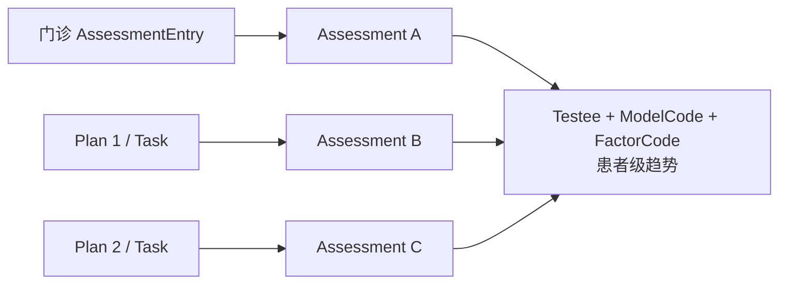

### 12.2 趋势不应从报告文字反推

Evaluation 成功时会把结构化得分写入 Outcome，并在可投影时更新 `assessment_score` 读模型。趋势查询直接读取这些得分事实或投影：

- AssessmentID；
- TesteeID；
- FactorCode/FactorName；
- RawScore；
- RiskLevel；
- 对应测评和时间信息。

报告负责解释和展示，不是趋势计算的事实源。即使未来重新生成报告，历史得分趋势也不应随报告文案改变。

### 12.3 可比较性的业务契约

合理的趋势身份应当是：

```text
TesteeID
+ stable ModelCode
+ FactorCode
+ compatible scoring semantics
```

当前业务默认同一测评编码下，相同 FactorCode 在不同发布版本中保持相同业务含义和可比较的计分口径。版本不同并不自动表示不可比较。

如果因子发生以下不兼容变化，就不能继续使用旧 FactorCode：

- 因子表达的业务含义改变；
- 题目集合或权重变化导致原始分不再可直接比较；
- 分数范围、最大分或转换方式发生不兼容变化；
- 常模或风险等级变化使旧值与新值表达不同含义。

运营或模型维护者必须使用新的 FactorCode，或者显式切断趋势序列。FactorCode 因而不只是字段名，而是一项跨发布版本的业务兼容契约。

### 12.4 当前趋势查询一边过宽、一边过窄

> 状态：规划改造。

当前有两类实现：

- 原始 `/assessments/trend` 按 `TesteeID + FactorCode` 查询，缺少 ModelCode，可能把不同测评中恰好同名的因子混入一条序列；
- `/assessments/{id}/trend-summary` 先筛选相同 ModelCode、QuestionnaireCode 和 QuestionnaireVersion，再从原始趋势中保留这些 Assessment，因而把兼容的新旧发布版本切断。

目标查询边界应收敛到中间位置：既不能只看 FactorCode，也不能机械要求发布版本完全相同，而要按稳定测评身份和明确的因子兼容语义比较。

## 13. 三个场景怎样穿过同一条主链

### 13.1 场景一：门诊二维码测评

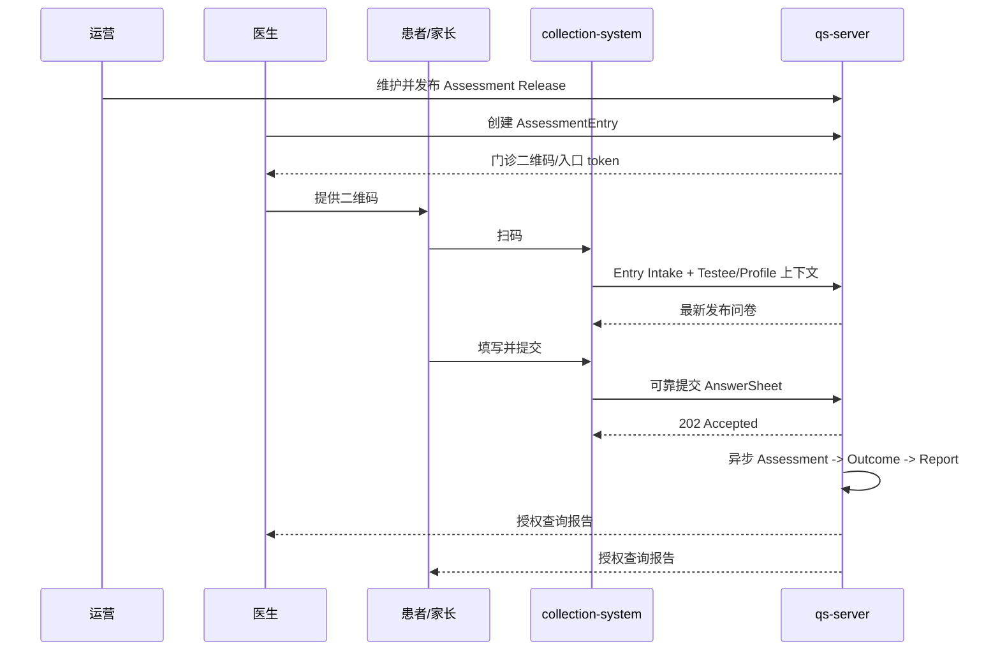

关键点：

- 二维码入口可以复用，不提前创建 Assessment；
- 扫码时选择最新发布版本；
- Entry Intake 可以建立 Testee 和医生访问关系；
- 202 只承诺答卷与恢复触发已经持久化；
- 医生最终判断必须结合问诊和其它临床信息，报告不是医学诊断。

### 13.2 场景二：Plan 周期测评

```text
治疗方案预先配置周期
  -> 系统按医生要求创建 Plan
  -> 患者加入 Plan
  -> Enrollment 生成周期 Task
  -> Task 到期从 pending 变为 opened
  -> 患者使用当时最新发布版本填写
  -> AnswerSheet 关联到 Assessment
  -> Task best-effort completed
  -> Outcome / Report 异步生成
  -> 多次可比较结果进入患者级趋势
```

Plan 只负责持续安排和任务状态。它不拥有 AnswerSheet、Outcome 或 Report，也不会把同一患者的趋势切割成多个 Plan 局部序列。

### 13.3 场景三：家长为儿童填写

```text
IAM User = 家长账号
IAM Profile / QS Testee = 儿童患者
ProfileLink = 家长可以代表儿童 Profile
FillerID = 家长 UserID
TesteeID = 儿童 TesteeID
```

权限校验通过后，提交和异步执行链不再分叉。系统当前只关心“谁提交、测谁”，不区分家长是在代替作答还是填写观察者版本。

### 13.4 在线问诊为什么不再复制一张内部图

在线问诊的前端和诊室业务属于外部医疗系统。医生通过该系统直接调用 qs-apiserver 发起测评和查看报告。

对 qs-server 而言，这只是另一个受保护的医生调用入口；进入 Assessment/AnswerSheet 之后，执行链与门诊和 Plan 场景相同。外部页面怎样推送、问诊怎样组织，不属于 qs-server 的业务事实。

## 14. 历史版本与随访连续性

### 14.1 已完成结果必须保留当时事实

运营发布新版本后，不得改变已经完成的历史结果。历史链必须能够回答：

- 当时填写的是哪一版 Questionnaire；
- 当时绑定的是哪一版 Published Model；
- 当时使用什么运行时机制和输入快照；
- 当时产生了什么 Outcome；
- 当时由哪个 ReportSpec 生成了什么报告。

当前代码已经保存精确 QuestionnaireRef、ModelRef、InputSnapshotRef、Outcome 和 Report 事实；ReportSpec 完整版本化仍是规划改造。

### 14.2 “使用最新版本”和“历史不可变”并不冲突

两条规则作用于不同时间点：

- **开始测评时**：AssessmentEntry 和 Plan Task 解析当时最新发布版本；
- **测评被受理后**：该次执行引用必须冻结，后续发布不能改变它；
- **测评完成后**：Outcome 和 Report 作为历史事实保留，不使用新规则回算覆盖。

```text
选择版本：发生在一次测评开始/受理时
冻结版本：发生在该次执行身份成立时
版本升级：只影响之后开始的新测评
```

### 14.3 跨版本趋势依赖兼容承诺

Plan 使用最新版本意味着长期趋势天然可能跨版本。系统不能靠“版本永远不变”获得可比较性，而应依靠稳定 ModelCode、稳定 FactorCode 和明确的计分兼容约束。

## 15. 失败、重试与人工治理

### 15.1 异步链路必须能回答“停在哪一步”

已受理但尚未完成的测评，至少需要区分：

| 阶段 | 可观察事实 | 典型故障 |
| --- | --- | --- |
| AnswerSheet accepted | AnswerSheet + Mongo Outbox | Outbox Relay/MQ 不可达 |
| Assessment Intake | AnswerSheet 对应 Assessment 是否存在、是否 bound | 绑定缺失、Plan 歧义、创建失败 |
| Evaluation queued/running | Assessment 状态、latest EvaluationRun、lease、attempt | 输入快照缺失、算法失败、事务失败 |
| Outcome committed | Outcome、score projection、MySQL Outbox | Interpretation 事件尚未消费 |
| Interpretation running | ReportGeneration、latest InterpretationRun、lease、attempt | Builder 缺失、模板错误、Mongo 提交失败 |
| Report generated | Artifact、查询 Catalog、generated event | 后置投影或通知失败 |

只看 HTTP 是否返回 202，无法判断后续卡在哪一步；只看 MQ 是否有消息，也不能替代领域状态。

### 15.2 自动重试与人工强制重试的边界

系统按失败分类、`retryable`、attempt 预算和持久化 RetryDecision 决定后续动作：

- 可恢复基础设施或暂时性失败可以进入有限自动重试；
- 可重试失败耗尽自动预算后进入 `manual_required`；
- 配置错误、输入错误等不可自动重试失败进入 `terminal`；
- Evaluation 与 Interpretation 的人工 Force Retry 必须经过明确授权、确认和审计；
- Outbox Replay 解决“事实已提交但事件没有成功投递”；
- MQ transport 重投不能无条件创建新的业务 attempt；
- 修复配置后重试必须继续引用同一 AnswerSheet、Assessment/Outcome 和明确执行身份，不能偷偷换成最新草稿。

`manual_required` 与 `terminal` 都表示自动流程停止，但人工权限不同：前者允许普通 Retry，后者只有在确认根因已经修复后才允许 Force Retry。两者都不能通过直接改库或简单重新投递原消息绕过。

### 15.3 一次失败怎样进入下一次尝试

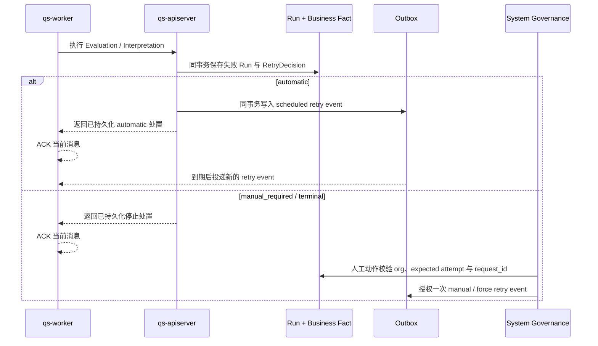

这里最重要的不变量是：**失败处置和对应自动重试事件在业务模块的本地事务中一起提交。** Worker 收到明确处置后 ACK 的只是当前 MQ 消息，并没有吞掉失败；失败事实、下一次时间和恢复权限已经进入持久化状态。

新的业务 attempt 只能在消费合法 retry event、匹配最新失败 Run、expected attempt、event ID、action request ID 和执行来源后创建。过期 lease 恢复仍属于原 attempt，不消耗新的业务重试预算。

### 15.4 自动重试暂停不消耗运输预算

自动重试具有紧急开关。当自动重试事件到达 Worker、但开关已关闭时，系统不会反复 NACK 消耗 MQ delivery 次数，而是：

```text
retry event
  -> 写入持久化 retry hold
  -> hold 成功后 ACK 原消息
  -> 开关恢复后由 replayer 重放
```

如果 hold 保存失败，则当前消息 NACK，不能在没有恢复凭据时 ACK。hold 自身的重放同样有独立预算；耗尽后进入人工治理。

### 15.5 业务失败、Outbox 失败和运输失败不是一回事

| 失败位置 | 已经成立的事实 | 下一步 |
| --- | --- | --- |
| Evaluation/Interpretation | 失败 Run 与业务处置已提交 | 自动 retry event，或人工 Retry/Force Retry |
| Outbox publish | 业务事实和事件意图已提交 | Outbox 按独立预算继续发布，耗尽后人工 Replay |
| handler 未分类错误 | 尚未形成可接受的业务处置 | NACK，在运输预算内重新投递 |
| poison message | 无法安全解析事件身份或载荷 | NACK，耗尽后保存运输死信供诊断 |
| unknown event | envelope 合法但没有当前处理器 | ACK 并记录 unknown，不做无意义重投 |
| transport delivery exhausted | 消息多次未成功结算 | 独立 dead letter；治理动作按原事件身份授权重放 |

System Governance 按当前组织汇总 Evaluation、Interpretation、Outbox、retry hold 和运输死信候选。人工动作要求明确确认、原因、expected attempt 和 request ID；相同 request ID 会复用已审计结果，不会重复执行动作。

这已经完成了**分阶段 Event 重试治理闭环**。尚未完成的是跨阶段统一旅程：系统还不能仅凭一个 AnswerSheetID 在同一视图中完整串起 Assessment、Run、Outcome、Report、Outbox、hold 和 dead letter。

### 15.6 每个阶段只在本地事务中承诺自己的事实

主链跨越 Mongo、MySQL 和多个模块，不使用一个跨库大事务包住所有步骤。系统采用：

> 每个模块在本地事务中提交自己的业务事实和 Outbox，再由幂等消费推动下一阶段。

这样允许中间状态存在，但要求这些状态可观察、可重试、可补偿。报告失败不会删除 Outcome，Evaluation 失败也不会删除 AnswerSheet。

## 16. 必须长期保护的业务不变量

1. 草稿不能进入正式运行时；正式执行只能读取已发布快照。
2. 问卷和测评模型必须成对发布，不能向调用方暴露不一致中间态。
3. 对测评链提交返回 202 前，AnswerSheet 和恢复触发必须已经可靠持久化。
4. 同一业务重试必须复用同一个幂等键；幂等冲突不能静默覆盖。
5. Testee 与 Filler 是不同事实；家长填写不能把家长误记为受试者。
6. 一份 AnswerSheet 最多对应一个 Assessment；Worker 重放必须复用已有事实。
7. Assessment 一旦绑定执行模型，后续不得切换到最新草稿或另一个版本。
8. Evaluation 成功以 Outcome、状态和 Outbox 同事务提交为准，不以内存计算完成为准。
9. Interpretation 只能基于冻结 Outcome 生成报告，不能重新执行 Evaluation。
10. Report 生成、报告授权和趋势分析是三个独立能力。
11. 新版本不能覆盖历史 AnswerSheet、Outcome 和 Report。
12. 患者级趋势跨 AssessmentEntry 和多个 Plan 聚合，但只能比较相同测评和语义兼容的因子。
13. 测评报告只提供医生判断、治疗观察和随访辅助信息，不能作为医学诊断结论。
14. 业务失败形成持久化 RetryDecision 后，MQ 对当前消息的 ACK 不能删除或重置该失败事实。
15. 人工 Retry、Force Retry 和 Replay 必须受组织范围、expected attempt、request ID 幂等和动作审计约束。
16. 过期执行 lease 的恢复继续使用原 attempt；只有经过持久化授权的新执行才增加业务 attempt。

## 17. 当前实现与目标边界之间的差距

| 优先级 | 当前实现 | 已确认目标 |
| --- | --- | --- |
| 高 | 202 只冻结 Questionnaire code/version，模型绑定由 Worker 稍后解析 | 202 冻结完整 AssessmentReleaseRef |
| 高 | binding 缺失可以创建 unbound Assessment 并正常 ACK | 测评链 binding 缺失必须进入明确失败、重试或补偿状态 |
| 高 | 部分患者侧测评/得分/趋势接口未统一校验 ProfileLink | 所有 Testee 资源读取先做代理授权，再做资源归属授权 |
| 中 | AssessmentEntry 仍允许保存 TargetVersion | 入口只保存稳定测评编码，扫码时使用最新发布版本 |
| 中 | ReportSpec 尚未成为 Assessment Release 的精确版本引用 | 冻结 ReportType、TemplateVersion、Builder/Adapter 和 ContentSchemaVersion |
| 中 | 原始趋势只按 TesteeID + FactorCode，趋势摘要又强制同 QuestionnaireVersion | 按 TesteeID + ModelCode + FactorCode + 兼容计分语义形成患者级趋势 |

这些差距不否定当前主链已经具备的可靠受理、事件驱动、Run 治理和不可变事实设计；它们说明下一轮重构应把已经形成的架构意图继续固化成不可绕过的代码约束。

## 18. 怎样从全局理解这条链路

可以从三个层次理解 qs-server：

### 第一层：业务变化

```text
运营发布测评
  -> 医生或 Plan 发起
  -> 患者/家长填写
  -> 系统产生辅助报告
  -> 医生结合临床信息使用
  -> 多次结果形成患者级趋势
```

### 第二层：领域事实

```text
AssessmentRelease
  -> AssessmentEntry / AssessmentTask
  -> AnswerSheet
  -> Assessment
  -> EvaluationRun + Outcome
  -> ReportGeneration + InterpretationRun + InterpretReport
```

### 第三层：可靠事件

```text
AnswerSheet + Outbox
  => answersheet.submitted
Assessment submitted + Outbox
  => evaluation.requested
Outcome + Evaluation terminal state + Outbox
  => evaluation.outcome.committed
Report + Interpretation terminal state + Outbox
  => interpretation.report.generated
```

这三个层次分别回答“业务为什么做”“事实由谁拥有”“跨阶段怎样可靠推进”，不能只记住其中一层。

## 19. 事实源与深入阅读

### 19.1 关键代码事实源

| 环节 | 事实入口 |
| --- | --- |
| Assessment Release | [`application/modelcatalog/release`](../../internal/apiserver/application/modelcatalog/release/) |
| AssessmentEntry | [`domain/actor/assessmententry`](../../internal/apiserver/domain/actor/assessmententry/) 与 [`application/actor/assessmententry`](../../internal/apiserver/application/actor/assessmententry/) |
| Plan 与 Task | [`domain/plan`](../../internal/apiserver/domain/plan/) 与 [`application/plan`](../../internal/apiserver/application/plan/) |
| collection 身份与提交 | [`collection-server/application/answersheet`](../../internal/collection-server/application/answersheet/) |
| AnswerSheet 可靠提交 | [`application/survey/answersheet`](../../internal/apiserver/application/survey/answersheet/) 与 [`infra/mongo/answersheet`](../../internal/apiserver/infra/mongo/answersheet/) |
| Assessment Intake Journey | [`application/journey/assessmentintake`](../../internal/apiserver/application/journey/assessmentintake/) |
| Evaluation 执行 | [`application/evaluation/execute`](../../internal/apiserver/application/evaluation/execute/) 与 [`application/evaluation/outcome/commit`](../../internal/apiserver/application/evaluation/outcome/commit/) |
| Interpretation 生成 | [`application/interpretation/automation`](../../internal/apiserver/application/interpretation/automation/) |
| 多角色报告查询 | [`application/interpretation`](../../internal/apiserver/application/interpretation/) |
| 因子趋势 | [`application/evaluation/outcome/score_reader.go`](../../internal/apiserver/application/evaluation/outcome/score_reader.go) 与 [`collection-server/application/evaluation/trend_summary_service.go`](../../internal/collection-server/application/evaluation/trend_summary_service.go) |
| Worker 事件处理 | [`worker/handlers`](../../internal/worker/handlers/) |
| 事件契约 | [`configs/events.yaml`](../../configs/events.yaml) |

### 19.2 业务模块深入阅读

- [Survey：答卷提交校验与测评驱动](../02-业务模块/10-survey/31-关键链路-答卷提交校验与测评驱动.md)
- [ModelCatalog：模型创建、编辑与发布](../02-业务模块/20-model-catalog/30-关键链路-模型创建编辑与发布.md)
- [ModelCatalog：已发布模型解析与消费](../02-业务模块/20-model-catalog/31-关键链路-已发布模型解析与消费.md)
- [Evaluation：答卷入站与测评请求](../02-业务模块/30-evaluation/30-关键链路-答卷入站与测评请求.md)
- [Evaluation：Worker 执行与报告驱动](../02-业务模块/30-evaluation/31-关键链路-Worker执行与报告驱动.md)
- [Interpretation：Outcome 驱动报告生成](../02-业务模块/40-interpretation/30-关键链路-Outcome驱动报告生成.md)
- [Interpretation：多角色报告查询与状态投影](../02-业务模块/40-interpretation/31-关键链路-多角色报告查询与状态投影.md)
- [Actor 模块](../02-业务模块/50-actor/README.md)
- [Plan 模块](../02-业务模块/60-plan/README.md)
- [Outbox 可靠出站链路](../03-基础设施/event/03-Outbox可靠出站链路.md)

### 19.3 建议验证入口

```bash
go test ./internal/apiserver/application/modelcatalog/release
go test ./internal/apiserver/application/actor/assessmententry
go test ./internal/apiserver/application/plan
go test ./internal/collection-server/application/answersheet
go test ./internal/apiserver/application/survey/answersheet
go test ./internal/apiserver/application/journey/assessmentintake
go test ./internal/apiserver/application/evaluation/execute
go test ./internal/apiserver/application/evaluation/outcome/commit
go test ./internal/apiserver/application/interpretation/automation/...
go test ./internal/worker/handlers
```

文档结构和相对链接统一通过：

```bash
make docs-hygiene
make docs-facts
git diff --check
```
