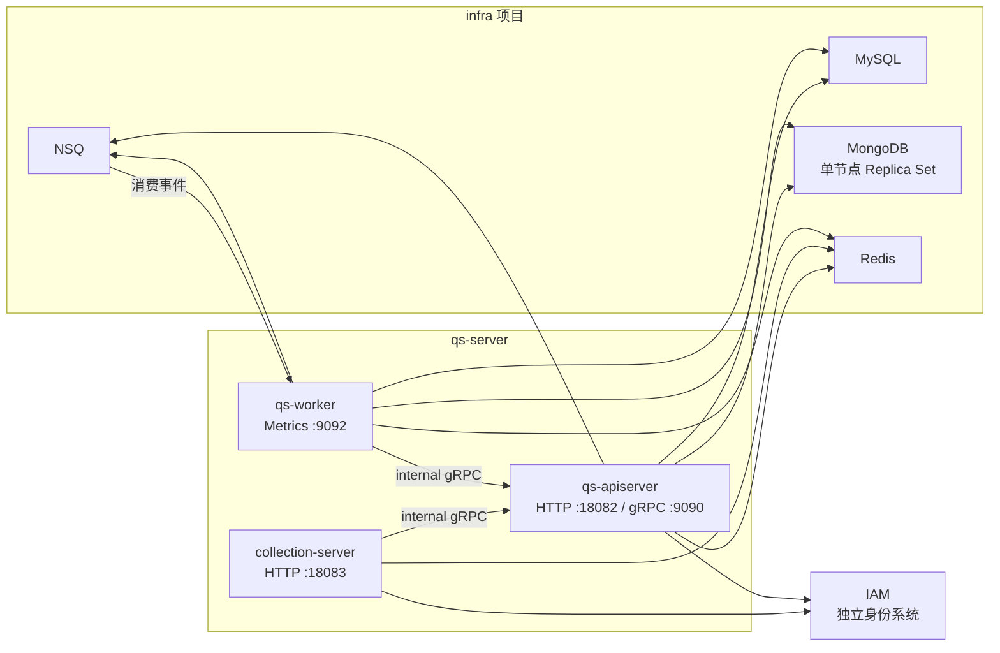

# 本地开发与配置约定

## 1. 本文结论

`qs-server` 的本地开发边界是：

- `infra` 项目负责启动 MySQL、MongoDB、Redis 和 NSQ；
- `qs-server` 仓库负责构建、启动和验证 `qs-apiserver`、`collection-server`、`qs-worker` 三个进程；
- IAM 是独立的身份系统，不由 `qs-server` 本地启动流程创建；
- 三个进程分别读取自己的 YAML 配置，不共享一个应用配置对象；
- `ENV=dev|prod` 只是 Makefile 选择配置文件的开关，不会自动加载 `.env` 文件；
- 开发验证应从定向测试开始，再逐步扩大到分层护栏、全量测试和契约检查；
- 本地配置只能说明开发环境如何运行，不能用来推断生产拓扑、容量或故障处理能力。

对新开发者来说，最小可信启动路径是：

```text
启动 infra 本地依赖
  -> make quick-start（内含基础设施检查）
  -> make health
  -> 走通一条实际业务链路
  -> 修改代码
  -> 定向测试
  -> 根据变更范围扩大验证
```

`make health` 成功只代表进程可访问；新人第一次启动时，还应完成一次真实的问卷查询或答卷提交，用业务链路验证 gRPC、IAM、数据库、Outbox、NSQ 和 Worker 是否真正协作。

---

## 2. 本地运行拓扑

### 2.1 拓扑图



这张图体现了两个本地开发中很重要的事实：

1. `collection-server` 和 `qs-worker` 都不是可以完全独立运行的业务中心，它们需要通过 internal gRPC 调用 `qs-apiserver`。
2. 仅启动三个 Go 进程不等于系统已经可用；底层基础设施和 IAM 链路同样是运行时的一部分。

### 2.2 三个进程的开发端口

| 进程 | 入站能力 | 开发端口 | 验证入口 |
| --- | --- | ---: | --- |
| `qs-apiserver` | 业务 REST | `18082` | `http://localhost:18082/healthz` |
| `qs-apiserver` | internal gRPC | `9090` | 主要由 collection 和 worker 调用 |
| `collection-server` | 小程序 BFF REST | `18083` | `http://localhost:18083/healthz` |
| `qs-worker` | Metrics / Health | `9092` | `http://localhost:9092/healthz` |

端口的当前事实源是三份 `*.dev.yaml`，而不是本文这张表。如果配置和文档不一致，应先核对配置、进程实际监听结果和 Makefile，然后修正文档。

---

## 3. 环境准备

### 3.1 必需工具

| 工具或依赖 | 用途 | 约定 |
| --- | --- | --- |
| Go | 构建、测试和运行 | 当前为 `1.25.12`，以 `go.mod` 和 Makefile 为准 |
| GNU Make | 统一开发入口 | 优先使用仓库已有 target，避免每个人维护一套启动命令 |
| Git | 变更范围与版本识别 | 构建信息会读取 commit、branch 和 tag |
| `infra` 本地环境 | MySQL、MongoDB、Redis、NSQ | 先启动 infra，再启动 qs-server |
| `curl` | NSQ 与 HTTP 健康检查 | `make check-infra` 和 `make health` 都会用到 |

当本机 Go 版本不一致时，不要在文档中固化某个开发者的绝对路径。应先检查：

```bash
go version
go env GOTOOLCHAIN
```

仓库期望的 Go 版本同时出现在 `go.mod` 和 Makefile 中；升级 Go 时应同步这两处以及 CI 环境。

### 3.2 按需安装的工具

| 工具 | 什么时候需要 |
| --- | --- |
| `mysql` 客户端 | 用 `make check-mysql` 做连接检查 |
| `redis-cli` | 用 `make check-redis` 做连接检查 |
| `mongosh` 或 `mongo` | 用 `make check-mongodb` 做连接检查 |
| Air | 使用 `make dev` 热更新 |
| `golangci-lint` | 代码质量和依赖边界检查；Makefile 将匹配版本安装到仓库 `bin/` |
| `govulncheck` / `gosec` | 安全检查或完整 `make verify` |
| `swag` + Python + PyYAML | 生成和对比 REST 契约 |
| `protoc` + Go plugins | 修改 gRPC Proto 后重新生成 Go 代码 |

常用安装入口为：

```bash
make install-tools
make install-security-tools
```

`make install-tools` 安装 Air，并准备与项目 Go toolchain 匹配的 `golangci-lint`。如果只需要热更新，可以执行 `make install-air`。

### 3.3 基础设施检查的边界

```bash
make check-infra
```

当前脚本会检查：

- MySQL 是否可以执行最小查询；
- Redis 是否可以 `PING`；
- MongoDB 是否可以执行 `ping`；
- `nsqlookupd` 和 `nsqd` 的 HTTP `ping` 是否可访问。

它不能证明：

- 应用 YAML 中的账号、库名和权限一定正确；
- MySQL migration 已经完整执行；
- MongoDB 已经满足事务要求；
- NSQ topic/channel 、Worker handler 和 Outbox relay 已经正常协作；
- IAM 的用户 JWT、JWKS、服务身份或授权快照可用；
- 一次完整测评能够从提交走到报告。

因此 `check-infra` 是连接性预检，不是系统验收。

MongoDB 在本地 infra 中应以“单节点 Replica Set”形式运行，而不是普通 standalone 单节点。物理上只有一个 MongoDB 节点，但逻辑上它属于 Replica Set，这是答卷与 Mongo Outbox 使用事务的前提。

---

## 4. 三进程配置入口

### 4.1 配置文件映射

| 进程 | 开发配置 | 生产基线 | 环境变量前缀 |
| --- | --- | --- | --- |
| `qs-apiserver` | [`configs/apiserver.dev.yaml`](../../configs/apiserver.dev.yaml) | [`configs/apiserver.prod.yaml`](../../configs/apiserver.prod.yaml) | `QS_APISERVER_` |
| `collection-server` | [`configs/collection-server.dev.yaml`](../../configs/collection-server.dev.yaml) | [`configs/collection-server.prod.yaml`](../../configs/collection-server.prod.yaml) | `COLLECTION_SERVER_` |
| `qs-worker` | [`configs/worker.dev.yaml`](../../configs/worker.dev.yaml) | [`configs/worker.prod.yaml`](../../configs/worker.prod.yaml) | `QS_WORKER_` |

三份配置之所以独立，是因为三个进程的运行时责任不同：

- `qs-apiserver` 持有业务模块、数据访问、internal gRPC、事件发布和后台调度等配置；
- `collection-server` 持有 BFF、IAM 验证、gRPC client、限流、答卷受理和报告等待等配置；
- `qs-worker` 持有消费并发度、MQ delivery、retry governance、gRPC client 和观测端口等配置。

修改某个跨进程能力时，不能只看一份 YAML。例如 Redis capability、report status TTL、signaling 或 internal gRPC 变更，都可能要求多进程配置保持契约一致。

### 4.2 `ENV` 的真实作用

Makefile 默认：

```makefile
ENV ?= dev
```

它根据 `ENV` 选择三份配置和对应的展示端口：

```bash
# 等价于 ENV=dev
make run-all

# 选择 *.prod.yaml；不是常规本地开发方式
ENV=prod make run-all
```

`ENV` 不会：

- 让 Go 进程自动搜索 `configs/env/.env.dev`；
- 将 `.env.dev` 中的值注入 Viper；
- 将本地运行自动变成生产拓扑；
- 校验生产凭证是否已经提供。

直接运行二进制时，配置文件由 `--config` 决定：

```bash
./bin/qs-apiserver --config=configs/apiserver.dev.yaml
./bin/collection-server --config=configs/collection-server.dev.yaml
./bin/qs-worker --config=configs/worker.dev.yaml
```

### 4.3 配置加载与覆盖

三个进程都使用统一的 `pkg/app` 启动框架加载配置：

1. `--config` 指定 YAML 文件；
2. Viper 使用进程名生成环境变量前缀；
3. 配置键中的 `.` 和 `-` 在环境变量中替换为 `_`；
4. 已注册且显式传入的命令行 flag 可以参与覆盖；
5. 加载后会反序列化为各进程的 Options，然后执行 `Complete` 和 `Validate`。

例如：

| YAML 配置键 | 对应进程 | 环境变量形式 |
| --- | --- | --- |
| `mysql.host` | `qs-apiserver` | `QS_APISERVER_MYSQL_HOST` |
| `grpc_client.endpoint` | `collection-server` | `COLLECTION_SERVER_GRPC_CLIENT_ENDPOINT` |
| `messaging.nsq-addr` | `qs-worker` | `QS_WORKER_MESSAGING_NSQ_ADDR` |
| `metrics.bind_port` | `qs-worker` | `QS_WORKER_METRICS_BIND_PORT` |

这里有一个必须记住的结论：

> `MYSQL_HOST=...` 与 `QS_APISERVER_MYSQL_HOST=...` 不是同一层配置。前者可以被基础设施检查脚本读取，后者才是 `qs-apiserver` 对 `mysql.host` 的直接覆盖。

### 4.4 `.env` 文件的定位

[`configs/env`](../../configs/env/) 中的 `.env.dev` 和 `.env.prod` 提供了 infra/部署层环境变量的整理，但当前应用启动代码：

- 没有使用 `godotenv` 自动加载 `.env` 文件；
- Makefile 没有 `include configs/env/.env.dev`；
- 六份应用 YAML 没有使用 `${ENV_NAME}` 占位符；
- `.env.*` 中多数变量是无进程前缀的 infra/编排变量。

因此，即使执行：

```bash
source configs/env/.env.dev
```

也不应默认认为所有变量都已经覆盖了三个 Go 进程的 YAML 配置。排查覆盖问题时，应回到“进程名 + YAML key”推导真正的变量名。

### 4.5 敏感配置约定

- 禁止将真实生产密码、Token、JWT secret、IAM service credential 或私钥写入仓库。
- 生产差异应通过受控环境变量或部署密钥注入，而不是直接把密钥固化到 `*.prod.yaml`。
- `.env.*.local`、`*.secret`、`*.credentials` 等本地敏感文件应保持在 Git ignore 范围内。
- 提交前除了看 `git diff`，还应检查新文件和未跟踪文件，避免凭证以新文件形式进入仓库。
- 启动日志中的配置输出应通过 `configmask` 脱敏；新增敏感字段时，必须同时验证脱敏策略。

---

## 5. 启动方式

### 5.1 第一次启动：构建后运行

在 `infra` 项目已经启动本地依赖后，执行：

```bash
make quick-start
```

`quick-start` 的责任链是：

```text
check-infra
  -> build-all
  -> run-all
  -> status-all
```

`build-all` 会生成：

```text
bin/qs-apiserver
bin/collection-server
bin/qs-worker
```

`run-all` 按如下顺序启动：

```text
qs-apiserver
  -> collection-server
  -> qs-worker
```

这个顺序与进程依赖方向一致：collection 和 worker 都需要 apiserver 提供 internal gRPC 能力。

启动后的常用命令：

```bash
make status
make health
make logs
make stop
```

Makefile 将 PID 保存在 `tmp/pids/`，将进程日志写入 `logs/`。`tmp/`、`bin/` 和日志文件不应被提交。

### 5.2 日常开发：Air 热更新

需要持续修改 Go 代码时，可以使用：

```bash
make install-air
make dev
```

`make dev` 分别使用：

- `.air-apiserver.toml`；
- `.air-collection.toml`；
- `.air-worker.toml`。

三份 Air 配置都固定传入对应的 `*.dev.yaml`。因此 `make dev` 是开发模式，不受 `ENV=prod` 切换。

也可以只启动正在修改的进程：

```bash
make dev-apiserver
make dev-collection
make dev-worker
```

对应的管理命令为：

```bash
make dev-status
make dev-stop
```

`make dev` 不会先执行 `check-infra`。如果是第一次启动或 infra 刚重启，应主动先执行 `make check-infra`。

### 5.3 单进程构建和运行

在定位启动、配置或资源装配问题时，单进程命令更容易观察日志：

```bash
make build-apiserver
make run-apiserver
make logs-apiserver

make build-collection
make run-collection
make logs-collection

make build-worker
make run-worker
make logs-worker
```

需要注意：

- `run-*` 只运行已经存在的二进制，不会自动重新构建；
- 单独启动 collection 或 worker 时，apiserver 及其 gRPC 端口应已经就绪；
- 单进程运行成功不能证明三进程业务链路完整。

---

## 6. 开发过程中的验证策略

### 6.1 不是每次都直接执行最大验证集

合理的验证顺序是：

```text
受影响 package 的定向测试
  -> 相关模块测试
  -> 跨模块/分层护栏
  -> 全量单元测试
  -> lint / vuln / 契约检查
  -> 必要的真实依赖集成测试
```

这样做的目的不是减少验证，而是让失败快速反馈并且容易定位。如果一开始就跑全仓库命令，开发者往往需要等待更久，并且难以判断首个失败与当前修改的因果关系。

### 6.2 常用验证命令

```bash
# 只运行受影响的 package
go test ./internal/apiserver/application/<module>/...

# 跳过依赖外部环境或长时间的测试
make test-unit

# 全量 Go 测试
make test

# 竞态检测
make test-race

# 常规 lint
make lint

# domain/application 依赖边界
make lint-boundaries

# 全量质量门禁
make verify
```

`make verify` 包含 `test`、`lint`、`lint-boundaries` 和漏洞检查，适合作为大型重构或提交前的完整门禁，而不是代替开发过程中的定向测试。首次运行可能需要下载 lint 工具，漏洞检查也要求相应工具已安装。

### 6.3 配置变更的最小验证

修改 `configs/*.yaml` 或 Options 结构时，至少执行：

```bash
go test ./internal/pkg/configcontract
```

配置契约测试会实际解码 dev/prod 配置，执行 Options 的 `Complete` 和 `Validate`，并检查部分跨进程契约，例如 Redis family、report status TTL、IAM JWKS 路径和 Worker event catalog。

但这仍然是代码/配置契约测试，不会真正连接 MySQL、MongoDB、Redis、NSQ 和 IAM。高风险变更还应启动对应进程并走实际链路。

### 6.4 MongoDB Replica Set 集成测试

可靠答卷受理的 MongoDB 集成测试由如下变量开启：

```bash
QS_SERVER_TEST_MONGO_URI='mongodb://...' \
QS_SERVER_TEST_MONGO_DB='qs_server_contract_test' \
go test ./internal/apiserver/infra/mongo/answersheet -run TestDurableSubmissionTransactionAgainstMongoReplicaSet -count=1
```

该测试会：

- 检查目标 MongoDB 是否为 Replica Set；
- 创建唯一的临时数据库；
- 验证答卷与 Outbox 在同一 MongoDB transaction 中提交或回滚；
- 在测试结束时删除该临时数据库。

由于数据库删除属于高风险动作，只能将 `QS_SERVER_TEST_MONGO_URI` 指向明确授权用于测试的 MongoDB，并使用专用测试库前缀。当前没有独立测试库时，应让测试保持 skip，不得把 URI 指向日常开发库或生产库来“凑齐通过”。

### 6.5 按变更类型选择验证

| 变更类型 | 最小验证 | 需要扩大检查的情况 |
| --- | --- | --- |
| 领域模型/应用服务 | 受影响 package 测试 | 修改跨模块 port、事务或事件时扩大到模块和架构护栏 |
| 配置字段/Options | 对应 options 测试 + `internal/pkg/configcontract` | 跨进程字段还要检查六份 dev/prod YAML |
| REST 路由或 Swagger 注解 | transport 定向测试 | 对外契约变化时执行 `make docs-verify` |
| gRPC Proto | 重新生成 + client/server 定向测试 | 兼容性变化要检查 collection、worker 和 apiserver 三方 |
| Event/Signal | catalog/registry/handler 定向测试 | 新增契约或修改结算语义时执行 `make docs-facts` 并走通发布消费链路 |
| Mongo/MySQL 持久化 | repository 和 transaction 测试 | 索引、migration、事务边界变化时需真实数据库验证 |
| 并发、缓存、限流 | 定向并发/单元测试 | 容量结论必须按压测 SOP 在目标环境执行，不得用代码测试代替 |
| 文档 | `make docs-hygiene docs-facts` | REST 生成契约变化时执行 `make docs-verify` |

---

## 7. 契约变更约定

### 7.1 REST

REST 契约的生成链路是：

```text
transport route / Swagger annotation
  -> internal/*/docs/swagger.json
  -> api/rest/*.yaml
```

变更后执行：

```bash
make docs-verify
```

该命令会重新生成 Swagger 和 OAS，然后执行文档与契约检查。它会修改生成文件，因此执行后必须查看 `git diff`，确认变化是当前接口修改的预期结果。

更详细的 REST 事实源和生成边界见 [API 文档说明](../../api/README.md) 与 [接口契约总览](../04-接口与运维/00-接口契约总览.md)。

### 7.2 gRPC

gRPC 的手写事实源是 [`api/grpc/proto`](../../api/grpc/proto/)，Go 生成代码位于 `api/grpc/gen`。修改 Proto 后执行：

```bash
bash scripts/proto/generate.sh
```

开发者应修改 `.proto` 文件，而不是手工编辑 `api/grpc/gen` 中的生成代码。生成后要同时检查：

- apiserver gRPC server 是否实现新契约；
- collection gRPC client 是否保持兼容；
- worker gRPC client 是否保持兼容；
- 字段号、枚举值和废弃字段是否遵守 Proto 兼容约定。

详细契约见 [gRPC 契约](../04-接口与运维/03-gRPC契约.md) 和 [internal gRPC](../04-接口与运维/04-internal-gRPC.md)。

### 7.3 Event 与 Signal

事件与一次性信令不是只改一个 Go 常量就结束。变更时应同步检查：

- [`configs/events.yaml`](../../configs/events.yaml) 或 [`configs/signals.yaml`](../../configs/signals.yaml)；
- Go 契约常量和 payload；
- publisher/Outbox 写入端；
- Worker dispatcher、handler registry 和结算策略；
- catalog/architecture 契约测试；
- 事件文档与故障处理说明。

新增或修改 Event/Signal 时，应按 [新增 Event 与 Signal SOP](../03-基础设施/event/07-新增Event与Signal-SOP.md) 执行，不在本文复制完整操作步骤。

---

## 8. 常见问题

### 8.1 `make check-infra` 失败

先区分“客户端工具缺失”和“服务不可达”：

- 未安装 `mysql`、`redis-cli`、`mongosh` 时，检查脚本无法完成真实探测；
- 工具存在但连接失败时，检查 infra 容器/进程、本地端口映射、账号和 ACL；
- 只某个组件失败时，使用 `make check-mysql`、`make check-redis`、`make check-mongodb` 或 `make check-nsq` 缩小范围。

### 8.2 修改了环境变量，但应用仍读取 YAML 值

首先检查变量是否包含正确的进程前缀。例如 apiserver 的 Redis 地址应使用：

```bash
export QS_APISERVER_REDIS_HOST=127.0.0.1
```

而不是仅设置 `REDIS_HOST`。然后检查启动日志中的配置文件路径、env prefix 和脱敏后的最终配置。

### 8.3 进程在运行，但业务请求失败

`status` 和基础 `healthz` 不代表下游全部就绪。应按如下链路继续定位：

```text
请求入口
  -> IAM 验证/授权
  -> collection 保护链
  -> internal gRPC
  -> apiserver 应用服务
  -> MySQL/MongoDB/Redis
  -> Outbox/NSQ/worker
```

不要因为“最终报告没有生成”就直接将问题归因于 Worker。应从一个具体的 request ID、answer sheet ID、assessment ID 或 event ID 沿责任链收集证据。

### 8.4 MongoDB 提示事务不可用

优先检查：

1. infra 中的 MongoDB 是否已经初始化为 Replica Set；
2. 当前连接字符串或 `mongodb.replica-set` / `mongodb.direct-connection` 是否符合实际拓扑；
3. 应用连接的是否为当前 primary；
4. 是否只用 `ping` 验证了连接性，却没有执行真实 transaction 验证。

### 8.5 端口占用或 PID 文件残留

Makefile 会用 `tmp/pids/*.pid` 记录它启动的进程。出现“可能已在运行”时，先执行：

```bash
make status
make stop
```

启动命令会清理指向不存在进程的无效 PID 文件。如果端口仍然被占用，说明占用者可能不是由当前 Makefile 启动，应先查明进程所有者，不要盲目删 PID 文件或强制结束不明进程。

更完整的运行故障定位见 [常见排障](../04-接口与运维/09-常见排障.md)。

---

## 9. 完成一次本地变更的检查清单

一次可信的本地修改至少需要回答如下问题：

- [ ] 我能够说明变更属于哪个进程、模块和责任层。
- [ ] 我没有把 infra 配置、应用配置和部署配置混为一个概念。
- [ ] 受影响 package 的定向测试已经通过。
- [ ] 跨模块或跨进程变更已经执行对应的契约/架构护栏。
- [ ] 配置变更同步检查了 Options、dev/prod YAML、环境变量和运维说明。
- [ ] REST、gRPC、Event 或 Signal 变更已经同步事实源和生成物。
- [ ] 真实依赖测试只连接明确授权的测试库，不会污染日常或生产数据。
- [ ] `git diff` 和 `git status` 中没有意外生成物、凭证或无关变更。
- [ ] 我没有将“本地通过”表述为“生产已验证”或“容量目标已达成”。

---

## 10. 事实源与后续阅读

| 问题 | 事实源或详细文档 |
| --- | --- |
| 三进程如何构建、启动、停止和验证 | [`Makefile`](../../Makefile) |
| 应用如何加载 YAML、env 和 flags | [`pkg/app/config.go`](../../pkg/app/config.go)、[`pkg/app/app.go`](../../pkg/app/app.go) |
| 开发/生产配置字段 | [`configs`](../../configs/) |
| 基础设施连接性检查 | [`scripts/check-infra.sh`](../../scripts/check-infra.sh) |
| 配置跨进程契约 | [`internal/pkg/configcontract`](../../internal/pkg/configcontract/) |
| 完整配置与高风险参数 | [配置与环境变量](../04-接口与运维/05-配置与环境变量.md) |
| 生产端口和部署 | [部署与端口](../04-接口与运维/06-部署与端口.md) |
| 故障责任链 | [常见排障](../04-接口与运维/09-常见排障.md) |
| 300 QPS 容量验证 | [300 QPS 混合场景压测 SOP](../04-接口与运维/11-300QPS混合场景压测SOP.md) |
| 文档编写与验证规则 | [`docs/CONTRIBUTING-DOCS.md`](../CONTRIBUTING-DOCS.md) |

本文只建立本地开发的统一入口和心智模型。当问题进入具体运行时、基础设施、接口契约、部署或压测领域时，应进入对应专题文档，而不是继续向本文堆积所有操作细节。
