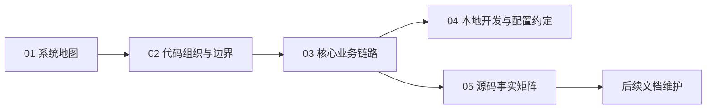

# 总览（00）

**本文回答**：`00-总览` 是 `qs-server` 文档体系的第一站。它负责让读者先建立全局坐标系：系统由哪些进程组成、代码边界在哪里、一次答卷如何进入异步测评链路、本地如何跑起来，以及后续该去哪些目录继续下钻。它不替代运行时、业务模块、基础设施、接口运维和专题分析的深讲文档。

---

## 30 秒结论

| 维度 | 结论 |
| ---- | ---- |
| 本组定位 | 先建立 `qs-server` 的系统地图、代码边界、主链路、本地开发入口和源码事实基线 |
| 最重要认识 | `qs-server` 是三进程协作系统：`qs-apiserver` 收口主业务状态，`collection-server` 是前台 BFF，`qs-worker` 是异步执行器 |
| 主业务叙事 | 一次问卷作答被稳定转化为可解释、可追踪、可查询的医学量表测评结果 |
| 阅读顺序 | `系统地图 -> 代码组织与边界 -> 核心业务链路 -> 本地开发与配置约定 -> 源码事实矩阵` |
| 真值边界 | 本组讲全局骨架；领域对象看 `02-业务模块`，三进程细节看 `01-运行时`，横切机制看 `03-基础设施`，机器契约和运维看 `04-接口与运维` |
| 维护原则 | 只维护全局共识和主链路摘要；细节只给锚点和回链，不在总览里维护第二份模块事实 |

读完本组后，读者应该能回答三个问题：

1. **这个项目是什么**：它不是单纯问卷 CRUD，而是问卷采集、医学量表规则、异步测评、报告与统计聚合组成的后端系统。
2. **这个项目怎么跑**：三进程分别启动，collection 和 worker 都通过 gRPC 调用 apiserver，事件由 apiserver 发布、worker 消费。
3. **这个项目怎么继续读**：想看进程细节去 `01-运行时`，想看业务对象去 `02-业务模块`，想看事件、缓存、安全和存储去 `03-基础设施`。

---

## 本目录五篇文档

`00-总览` 当前以五篇文档组成一条完整入门路径：

| 顺序 | 文档 | 解决什么问题 | 读完应获得什么 |
| ---- | ---- | ------------ | -------------- |
| 1 | [01-系统地图.md](./01-系统地图.md) | 系统由哪些进程、模块和外部依赖组成 | 建立三进程和六个业务模块的全局图谱 |
| 2 | [02-代码组织与边界.md](./02-代码组织与边界.md) | 仓库目录、运行时边界、apiserver 分层、共享包和 component-base 如何区分 | 知道改代码时应该进入哪个目录，不误把 BFF、worker、domain 和基础库混在一起 |
| 3 | [03-核心业务链路.md](./03-核心业务链路.md) | 一次答卷如何经过 SubmitQueue、durable submit、outbox、worker、internal gRPC、evaluation pipeline 变成报告和统计 | 抓住端到端主链路，后续所有模块和基础设施文档都围绕这条链路定位 |
| 4 | [04-本地开发与配置约定.md](./04-本地开发与配置约定.md) | 本地如何通过 `Makefile`、`ENV`、三进程 yaml、依赖检查和健康检查跑起来 | 能从零构建、启动、检查和初步排障本地开发环境 |
| 5 | [05-源码事实矩阵.md](./05-源码事实矩阵.md) | 当前文档重建依赖哪些源码、配置、契约事实 | 后续写文档或评审文档时，有一张可追踪的事实基线 |

这五篇不是平行关系，而是从“看懂系统”到“能落地运行”再到“能维护文档”的递进关系。



---

## 推荐阅读路径

### 第一次读仓库

按顺序读完整个 `00-总览`：

1. [01-系统地图.md](./01-系统地图.md)
2. [02-代码组织与边界.md](./02-代码组织与边界.md)
3. [03-核心业务链路.md](./03-核心业务链路.md)
4. [04-本地开发与配置约定.md](./04-本地开发与配置约定.md)
5. [05-源码事实矩阵.md](./05-源码事实矩阵.md)

这条路径适合新成员、首次接手项目的人，或者准备对项目做整体重构前的读者。

### 想快速跑起来

先读：

1. [04-本地开发与配置约定.md](./04-本地开发与配置约定.md)
2. [02-代码组织与边界.md](./02-代码组织与边界.md)
3. [01-运行时/README.md](../01-运行时/README.md)

这条路径适合已经知道项目大概做什么，只想先完成构建、启动和基础设施检查的人。

### 想改业务模块

先读：

1. [03-核心业务链路.md](./03-核心业务链路.md)
2. [02-代码组织与边界.md](./02-代码组织与边界.md)
3. [02-业务模块/README.md](../02-业务模块/README.md)

然后按问题进入：

| 要改什么 | 继续读 |
| -------- | ------ |
| 问卷、题型、答卷提交 | [02-业务模块/survey/README.md](../02-业务模块/survey/README.md) |
| 医学量表、因子、计分与解读规则 | [02-业务模块/scale/README.md](../02-业务模块/scale/README.md) |
| 测评状态机、评估流水线、报告 | [02-业务模块/evaluation/README.md](../02-业务模块/evaluation/README.md) |
| 受试者、从业者、操作者、照护关系 | [02-业务模块/actor/README.md](../02-业务模块/actor/README.md) |
| 计划、任务、调度、通知 | [02-业务模块/plan/README.md](../02-业务模块/plan/README.md) |
| 统计概览、行为投影、读模型 | [02-业务模块/statistics/README.md](../02-业务模块/statistics/README.md) |

### 想排障链路问题

先读：

1. [03-核心业务链路.md](./03-核心业务链路.md)
2. [01-运行时/00-三进程协作总览.md](../01-运行时/00-三进程协作总览.md)
3. [03-基础设施/event/README.md](../03-基础设施/event/README.md)
4. [04-接口与运维/09-常见排障.md](../04-接口与运维/09-常见排障.md)

排障时先问：

```text
问题发生在 collection 入口？
还是 apiserver 主写？
还是 outbox relay？
还是 MQ 投递？
还是 worker 消费？
还是 worker 回调 internal gRPC？
还是 evaluation pipeline 内部？
```

总览文档只帮助定位问题发生在哪一段；具体机制要进入运行时、事件、接口与运维文档。

### 想维护文档

先读：

1. [05-源码事实矩阵.md](./05-源码事实矩阵.md)
2. [../CONTRIBUTING-DOCS.md](../CONTRIBUTING-DOCS.md)
3. [../README.md](../README.md)

维护原则是：**先确认源码和机器契约，再修改 prose 文档**。如果事实矩阵没有覆盖某个新事实，先补矩阵，再决定应该落在哪一组文档里。

---

## `00-总览` 与其它文档组的边界

`00-总览` 不负责讲所有细节。它的职责是建立坐标系，并把读者导向正确位置。

| 文档组 | 负责什么 | 与 `00-总览` 的关系 |
| ------ | -------- | ------------------- |
| [01-运行时](../01-运行时/) | 三进程启动、进程间调用、HTTP/gRPC/MQ runtime、shutdown | 总览只讲拓扑和主方向，运行时讲具体装配和时序 |
| [02-业务模块](../02-业务模块/) | survey / scale / evaluation / actor / plan / statistics 的领域对象、状态机、应用服务和模块内规则 | 总览只讲模块位置和主链路，业务模块讲对象模型与业务不变量 |
| [03-基础设施](../03-基础设施/) | event、data-access、redis、resilience、security、integrations、runtime、observability 等横切能力 | 总览只说明这些能力存在和如何进入，基础设施文档讲机制与配置 |
| [04-接口与运维](../04-接口与运维/) | REST、gRPC、internal gRPC、events.yaml、配置、部署、健康检查、排障 | 总览只列关键契约入口，接口与运维维护机器契约说明 |
| [05-专题分析](../05-专题分析/) | 跨模块设计判断，例如为什么拆分 survey/scale/evaluation、为什么同步提交但异步评估 | 总览讲现状，专题分析讲取舍与原因 |
| [06-宣讲](../06-宣讲/) | 项目介绍、技术分享、面试追问、图谱素材 | 宣讲层只负责讲法，事实必须回链到 `00-05` |
| [_archive](../_archive/) | 历史设计稿和旧阶段材料 | 不作为现行真值来源 |

---

## 本组中的唯一主链路

从文档维护角度看，`00-总览` 中最重要的一篇是 [03-核心业务链路.md](./03-核心业务链路.md)。

这篇文档是端到端主链路的唯一完整解释位置。其它目录可以摘要这条链路，但不应该重复维护完整版本。

主链路可以概括为：

```text
Client / 小程序
  -> collection-server REST
  -> SubmitQueue / 入口保护
  -> qs-apiserver gRPC durable submit
  -> Mongo AnswerSheet + idempotency + outbox
  -> MQ event
  -> qs-worker handler
  -> internal gRPC 回调 qs-apiserver
  -> Assessment 创建 / 提交
  -> Evaluation Pipeline
  -> Report / Statistics / Tag / Notification
```

这一链路会穿过多个模块和基础设施能力：

| 阶段 | 主要归属 |
| ---- | -------- |
| 前台入口、排队、限流 | `collection-server`、`resilience` |
| 答卷事实与校验 | `survey` |
| durable submit 和 outbox | `data-access`、`event` |
| 事件消费与回调 | `worker`、`runtime`、`event` |
| Assessment 状态机与评估 | `evaluation` |
| 量表规则与因子 | `scale` |
| 标签、统计、任务 | `actor`、`statistics`、`plan` |

后续如果这条链路变化，优先更新 [03-核心业务链路.md](./03-核心业务链路.md) 和 [05-源码事实矩阵.md](./05-源码事实矩阵.md)，然后再更新相关模块或基础设施文档。

---

## 总览中的常见误区

| 误区 | 正确认知 |
| ---- | -------- |
| `qs-server` 是单体 HTTP 服务 | 它是三进程协作系统，至少包含 `qs-apiserver`、`collection-server`、`qs-worker` |
| `collection-server` 也是主业务服务 | collection 是前台 BFF，主写模型和权威领域状态收口在 apiserver |
| `qs-worker` 自己维护一套业务领域 | worker 是异步执行器，通过 internal gRPC 回调 apiserver，不是第二个业务主服务 |
| IAM 是本仓库第四个进程 | IAM 是外部系统，以 SDK / gRPC / JWKS 等方式被 apiserver 和 collection 集成，不是 qs-server 内第四进程 |
| SubmitQueue 就是 MQ | SubmitQueue 是 collection 进程内 memory channel，用于入口削峰和本地状态查询；MQ 是跨进程事件投递基础设施 |
| prose 文档可以作为最终事实 | 不能。源码、OpenAPI、proto、`configs/events.yaml`、`configs/*.yaml` 优先 |
| `_archive` 可以直接引用为现状 | 不能。archive 是历史层，只能提供背景，不能作为当前 truth layer |

---

## 读完本目录后应该知道什么

读完 `00-总览` 后，不要求你已经理解每个领域对象和每个基础设施细节，但你应该能做到：

1. 画出三进程关系图。
2. 说清楚 collection、apiserver、worker 分别负责什么。
3. 找到主业务链路从 REST 到 event 到 worker 到 internal gRPC 的关键节点。
4. 区分 `internal/apiserver/domain`、`internal/apiserver/application`、`internal/apiserver/infra`、`internal/pkg`、根 `pkg` 和 `component-base`。
5. 知道本地开发默认用哪些配置文件、端口和 `make` 命令。
6. 知道后续如果写文档，要优先查 [05-源码事实矩阵.md](./05-源码事实矩阵.md) 和机器契约。

如果这些问题还答不上来，不建议直接进入某个深层模块改代码。

---

## 代码与契约锚点

`00-总览` 中所有结论都应能回到下面这些基础锚点：

| 类型 | 锚点 |
| ---- | ---- |
| 三进程入口 | [../../cmd/qs-apiserver/apiserver.go](../../cmd/qs-apiserver/apiserver.go)、[../../cmd/collection-server/main.go](../../cmd/collection-server/main.go)、[../../cmd/qs-worker/main.go](../../cmd/qs-worker/main.go) |
| apiserver 启动编排 | [../../internal/apiserver/process/runner.go](../../internal/apiserver/process/runner.go)、[../../internal/apiserver/process/resource_bootstrap.go](../../internal/apiserver/process/resource_bootstrap.go)、[../../internal/apiserver/process/transport_bootstrap.go](../../internal/apiserver/process/transport_bootstrap.go)、[../../internal/apiserver/process/runtime_bootstrap.go](../../internal/apiserver/process/runtime_bootstrap.go) |
| apiserver 组合根 | [../../internal/apiserver/container/root.go](../../internal/apiserver/container/root.go)、[../../internal/apiserver/container/assembler/](../../internal/apiserver/container/assembler/) |
| collection 提交入口 | [../../internal/collection-server/transport/rest/handler/answersheet_handler.go](../../internal/collection-server/transport/rest/handler/answersheet_handler.go)、[../../internal/collection-server/application/answersheet/submit_queue.go](../../internal/collection-server/application/answersheet/submit_queue.go) |
| worker 事件派发 | [../../internal/worker/integration/eventing/dispatcher.go](../../internal/worker/integration/eventing/dispatcher.go)、[../../internal/worker/handlers/registry.go](../../internal/worker/handlers/registry.go) |
| 事件契约 | [../../configs/events.yaml](../../configs/events.yaml) |
| REST 契约 | [../../api/rest/apiserver.yaml](../../api/rest/apiserver.yaml)、[../../api/rest/collection.yaml](../../api/rest/collection.yaml) |
| gRPC 契约 | [../../internal/apiserver/interface/grpc/proto/](../../internal/apiserver/interface/grpc/proto/) |
| 配置 | [../../configs/apiserver.dev.yaml](../../configs/apiserver.dev.yaml)、[../../configs/collection-server.dev.yaml](../../configs/collection-server.dev.yaml)、[../../configs/worker.dev.yaml](../../configs/worker.dev.yaml) |
| 构建与运行 | [../../Makefile](../../Makefile) |
| 文档维护 | [../CONTRIBUTING-DOCS.md](../CONTRIBUTING-DOCS.md)、[./05-源码事实矩阵.md](./05-源码事实矩阵.md) |

---

## Verify

修改 `00-总览` 后，至少执行：

```bash
make docs-hygiene
git diff --check
```

如果改动涉及 REST、gRPC、事件或配置事实，还要额外核对：

```bash
make docs-verify
```

如果改动涉及主链路、事件、SubmitQueue、outbox、worker handler 或 internal gRPC，应同步检查：

```bash
go test ./internal/collection-server/application/answersheet \
        ./internal/apiserver/application/survey/answersheet \
        ./internal/apiserver/infra/mongo/answersheet \
        ./internal/worker/handlers \
        ./internal/worker/integration/eventing
```

实际测试范围可以按变更裁剪，但不要只改 prose 文档而不确认对应源码和机器契约。

---

## 下一跳

完成 `00-总览` 后，按目的进入下一层：

| 目的 | 下一跳 |
| ---- | ------ |
| 继续看三进程怎么启动、怎么协作 | [../01-运行时/README.md](../01-运行时/README.md) |
| 看六个业务模块的静态设计 | [../02-业务模块/README.md](../02-业务模块/README.md) |
| 看事件、存储、缓存、安全、限流、集成等横切能力 | [../03-基础设施/README.md](../03-基础设施/README.md) |
| 看 REST、gRPC、事件契约、部署和排障 | [../04-接口与运维/README.md](../04-接口与运维/README.md) |
| 看设计取舍和跨模块分析 | [../05-专题分析/README.md](../05-专题分析/README.md) |
| 准备技术分享或面试讲法 | [../06-宣讲/README.md](../06-宣讲/README.md) |

