# Questionnaire 聚合设计

> **版本**：V4.0 金字塔结构版  
> **最后更新**：2025-11-26  
> **所属系列**：[Survey 子域设计系列](./11-04-Survey子域设计系列.md)

---

## 📋 目录

- [1. 核心价值：解决什么问题](#1-核心价值解决什么问题)
- [2. 整体架构：三层设计](#2-整体架构三层设计)
- [3. 核心设计决策](#3-核心设计决策)
- [4. 题型扩展体系](#4-题型扩展体系)
- [5. 聚合根设计](#5-聚合根设计)
- [6. 领域服务设计](#6-领域服务设计)
- [7. 运行机制](#7-运行机制)
- [8. 设计模式总结](#8-设计模式总结)
- [9. 代码导航](#9-代码导航)

---

## 1. 核心价值：解决什么问题

### 1.1 一句话总结

**Questionnaire 聚合实现了可无限扩展的问卷模型，支持多题型、版本管理和生命周期控制，新增题型无需修改核心代码。**

### 1.2 业务挑战

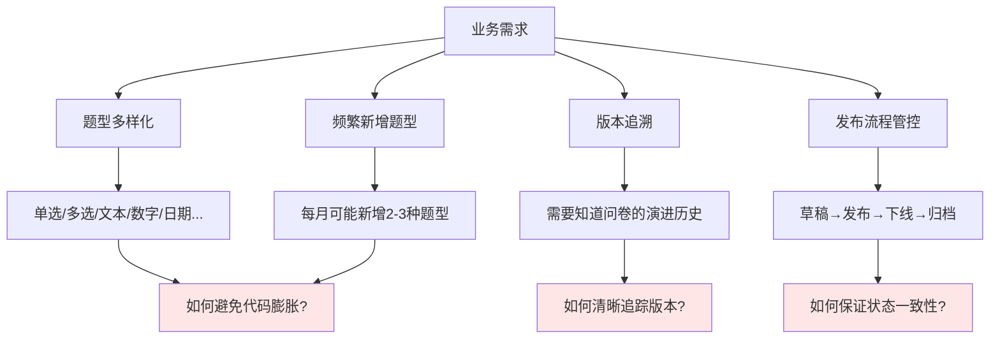

### 1.3 解决方案概览

| 挑战 | 解决方案 | 核心收益 |
|------|---------|---------|
| 题型扩展 | 注册器+工厂+接口 | ✅ 新增题型只加代码，不改现有代码 |
| 参数配置 | 函数式选项 | ✅ API 可读性强，参数灵活组合 |
| 生命周期 | 状态机+领域服务 | ✅ 状态转换规范，流程可追溯 |
| 版本管理 | 语义化版本 | ✅ 大版本=发布，小版本=修改 |
| 复杂逻辑 | 领域服务分离 | ✅ 单一职责，聚合根保持轻量 |

---

## 2. 整体架构：三层设计

### 2.1 架构全景图

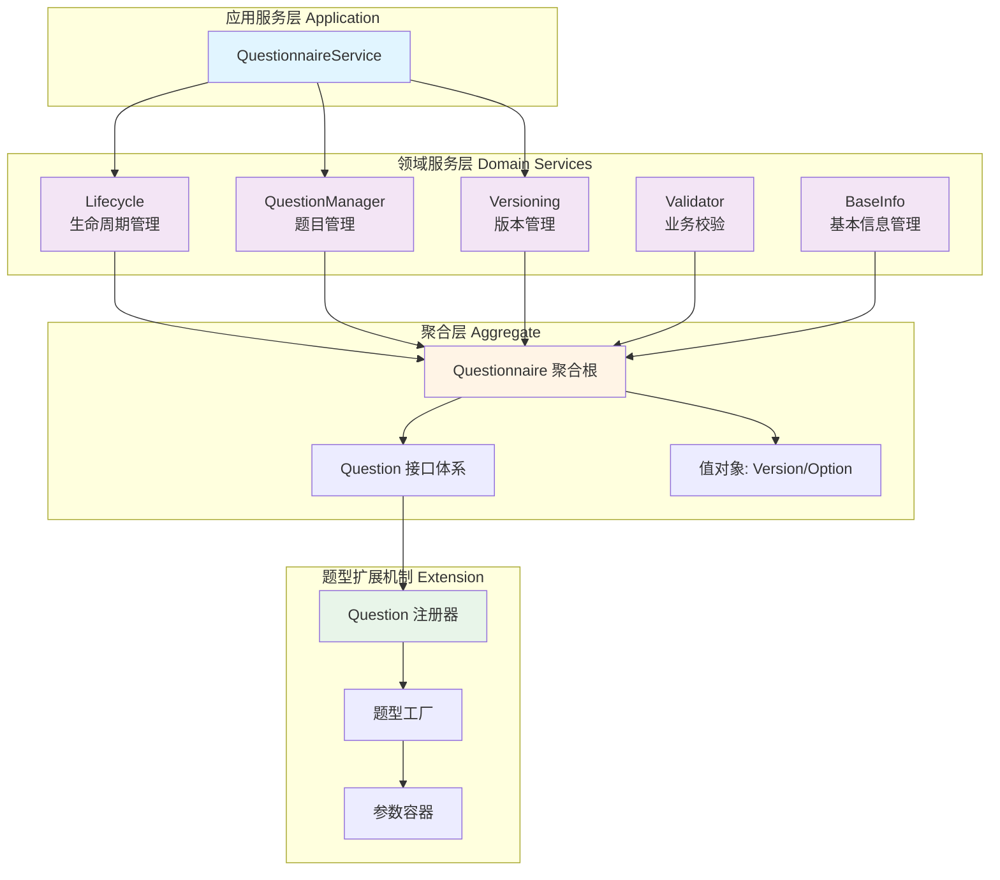

### 2.2 三层职责划分

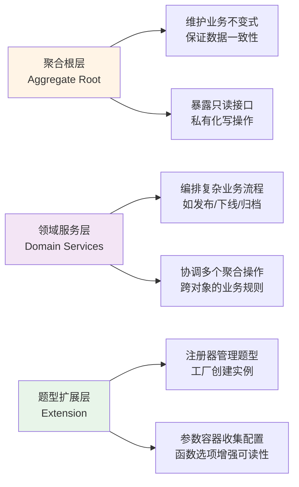

---

## 3. 核心设计决策

### 3.1 关键决策表

| # | 决策点 | 选型 | 原因 | 权衡 |
|---|--------|------|------|------|
| 1 | 题型扩展方式 | 注册器+工厂 | ✅ 符合开闭原则<br/>✅ 扩展无需改核心 | ⚠️ 需要理解注册机制 |
| 2 | 参数传递方式 | 函数式选项 | ✅ 可读性强<br/>✅ 可选参数灵活 | ⚠️ 稍微增加代码量 |
| 3 | 接口设计粒度 | 统一大接口 | ✅ 使用简单<br/>✅ 避免接口爆炸 | ⚠️ 部分方法返回空值 |
| 4 | 业务逻辑位置 | 领域服务分离 | ✅ 单一职责<br/>✅ 聚合根轻量 | ⚠️ 需要协调多个服务 |
| 5 | 版本号策略 | 语义化版本 | ✅ 含义清晰<br/>✅ 业界通用 | ⚠️ 需严格遵守规则 |

### 3.2 设计原则应用

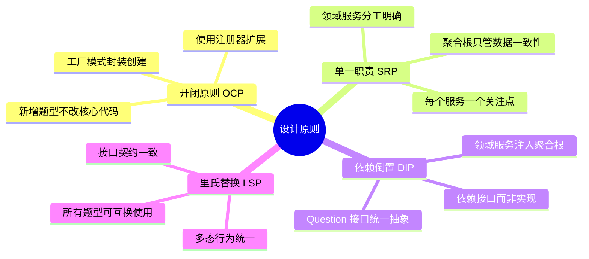

---

## 4. 题型扩展体系

### 4.1 扩展机制总览

**核心思想**：将"题型"作为可插拔组件，通过注册器动态管理，工厂统一创建。

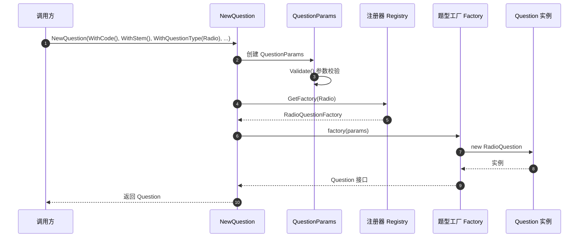

### 4.2 Question 接口：统一题型抽象

```go
// 所有题型的统一接口
type Question interface {
    // 基础信息
    GetType() QuestionType
    GetCode() Code
    GetStem() string          // 题干
    GetTips() string          // 提示文本
    
    // 文本输入类
    GetPlaceholder() string   // 占位符
    
    // 选择类
    GetOptions() []Option     // 选项列表
    
    // 校验与计算
    GetValidationRules() []ValidationRule
    GetCalculationRule() *CalculationRule
}
```

**设计说明**：

- ✅ 统一接口简化使用，问卷层面无需关心具体题型
- ✅ 部分方法某些题型返回空值（如文本题无选项）
- ⚠️ 如果接口过度膨胀可考虑拆分，但当前规模合理

📄 **代码位置**：[`questionnaire/question.go`](../../internal/apiserver/domain/questionnaire/question.go)

### 4.3 注册器模式：管理题型映射

```go
// 工厂函数类型
type QuestionFactory func(*QuestionParams) (Question, error)

// 全局注册器
var questionRegistry = map[QuestionType]QuestionFactory{}

// 注册函数
func RegisterQuestionFactory(t QuestionType, factory QuestionFactory) {
    questionRegistry[t] = factory
}

// 获取工厂
func getQuestionFactory(t QuestionType) (QuestionFactory, bool) {
    factory, ok := questionRegistry[t]
    return factory, ok
}
```

**运作机制**：

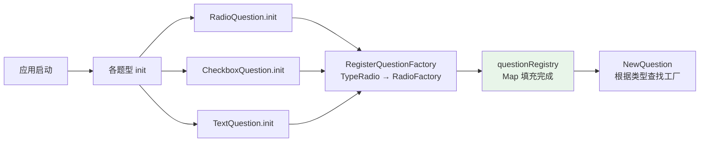

📄 **代码位置**：[`questionnaire/question_registry.go`](../../internal/apiserver/domain/questionnaire/question_registry.go)

### 4.4 工厂模式：创建具体题型

每个题型实现自己的工厂函数：

```go
// 单选题工厂
func newRadioQuestionFactory(p *QuestionParams) (Question, error) {
    // 特定校验
    if len(p.GetOptions()) < 2 {
        return nil, ErrInsufficientOptions
    }
    
    return &RadioQuestion{
        QuestionCore:    p.GetCore(),
        options:         p.GetOptions(),
        validationRules: p.GetValidationRules(),
        calculationRule: p.GetCalculationRule(),
    }, nil
}

// 在 init 中注册
func init() {
    RegisterQuestionFactory(TypeRadio, newRadioQuestionFactory)
}
```

**类图关系**：

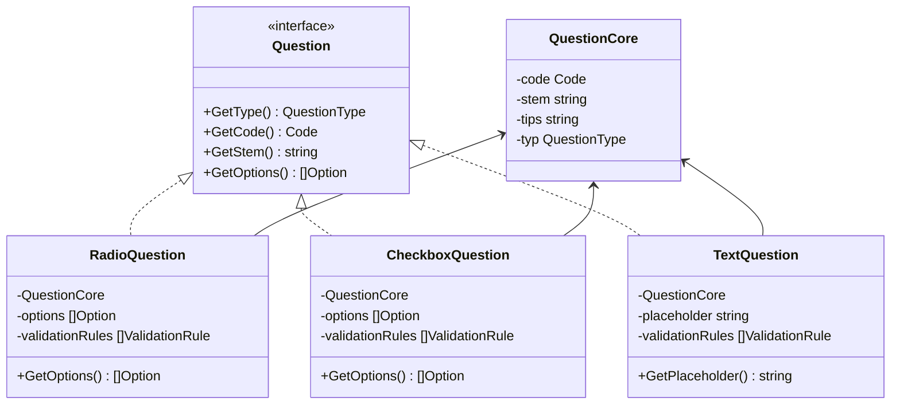

📄 **代码位置**：

- [`questionnaire/question_radio.go`](../../internal/apiserver/domain/questionnaire/question_radio.go)
- [`questionnaire/question_checkbox.go`](../../internal/apiserver/domain/questionnaire/question_checkbox.go)
- [`questionnaire/question_text.go`](../../internal/apiserver/domain/questionnaire/question_text.go)

### 4.5 参数容器 + 函数式选项

**问题**：传统构造函数参数过多，难以阅读和维护。

```go
// ❌ 传统方式：参数地狱
NewRadioQuestion(code, stem, tips, required, options, rules, calcRule, displayOrder, ...)
```

**解决方案**：参数容器 + 函数式选项

```go
// ✅ 参数容器
type QuestionParams struct {
    core        QuestionCore
    placeholder string
    options     []Option
    rules       []ValidationRule
    calcRule    *CalculationRule
}

// ✅ 选项函数类型
type QuestionParamsOption func(*QuestionParams)

// ✅ 具体选项函数
func WithCode(code Code) QuestionParamsOption {
    return func(p *QuestionParams) {
        p.core.code = code
    }
}

func WithStem(stem string) QuestionParamsOption {
    return func(p *QuestionParams) {
        p.core.stem = stem
    }
}

func WithQuestionType(t QuestionType) QuestionParamsOption {
    return func(p *QuestionParams) {
        p.core.typ = t
    }
}

func WithOption(code, content string, score float64) QuestionParamsOption {
    return func(p *QuestionParams) {
        p.options = append(p.options, NewOption(code, content, score))
    }
}

func WithRequired() QuestionParamsOption {
    return func(p *QuestionParams) {
        p.core.required = true
    }
}
```

**构造流程**：

```go
// NewQuestionParams 收集所有选项
func NewQuestionParams(opts ...QuestionParamsOption) *QuestionParams {
    p := &QuestionParams{
        options: make([]Option, 0),
        rules:   make([]ValidationRule, 0),
    }
    
    // 应用所有选项
    for _, opt := range opts {
        opt(p)
    }
    
    // 统一校验
    if err := p.Validate(); err != nil {
        panic(err) // 或返回错误
    }
    
    return p
}
```

**使用示例**：

```go
// ✅ 清晰可读的 API
question := NewQuestion(
    WithCode(NewCode("Q1")),
    WithStem("您的性别是？"),
    WithQuestionType(TypeRadio),
    WithOption("A", "男", 0),
    WithOption("B", "女", 0),
    WithRequired(),
    WithCalculationRule(FormulaScore),
)
```

📄 **代码位置**：

- [`questionnaire/question_params.go`](../../internal/apiserver/domain/questionnaire/question_params.go)
- [`questionnaire/question_options.go`](../../internal/apiserver/domain/questionnaire/question_options.go)

### 4.6 新增题型：完整流程

**场景**：新增 DateQuestion（日期题）

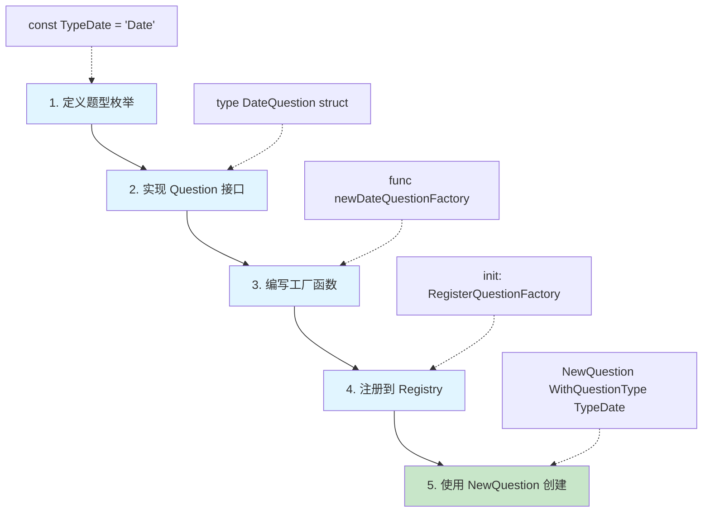

**完整代码示例**：

```go
// ========== 1. 枚举定义 ==========
// 在 question_types.go 中添加
const TypeDate QuestionType = "Date"

// ========== 2. 实现接口 ==========
// 新建 question_date.go
type DateQuestion struct {
    QuestionCore
    placeholder string
    minDate     *time.Time
    maxDate     *time.Time
    rules       []ValidationRule
}

// 实现 Question 接口
func (q *DateQuestion) GetType() QuestionType { return TypeDate }
func (q *DateQuestion) GetCode() Code { return q.QuestionCore.code }
func (q *DateQuestion) GetStem() string { return q.QuestionCore.stem }
func (q *DateQuestion) GetPlaceholder() string { return q.placeholder }
func (q *DateQuestion) GetOptions() []Option { return nil } // 日期题无选项
// ... 其他接口方法

// ========== 3. 工厂函数 ==========
func newDateQuestionFactory(p *QuestionParams) (Question, error) {
    // 日期题特定校验
    if p.GetPlaceholder() == "" {
        return nil, errors.New("日期题必须提供占位符")
    }
    
    return &DateQuestion{
        QuestionCore: p.GetCore(),
        placeholder:  p.GetPlaceholder(),
        rules:        p.GetValidationRules(),
    }, nil
}

// ========== 4. 注册 ==========
func init() {
    RegisterQuestionFactory(TypeDate, newDateQuestionFactory)
}

// ========== 5. 使用 ==========
// 在任何地方使用
dateQ := NewQuestion(
    WithCode(NewCode("Q5")),
    WithStem("请选择您的出生日期"),
    WithQuestionType(TypeDate),
    WithPlaceholder("YYYY-MM-DD"),
    WithRequired(),
)
```

**关键点**：

- ✅ 无需修改 `NewQuestion` 函数
- ✅ 无需修改 `Question` 接口
- ✅ 无需修改其他题型代码
- ✅ 完全符合开闭原则

---

## 5. 聚合根设计

### 5.1 Questionnaire 聚合根结构

```go
type Questionnaire struct {
    // 身份标识
    id   ID
    code Code
    
    // 基本信息
    title   string
    desc    string
    imgURL  string
    
    // 版本与状态
    version Version
    status  Status
    
    // 题目列表
    questions []Question
    
    // 审计信息
    createdBy ID
    createdAt time.Time
    updatedAt time.Time
}
```

**职责边界**：

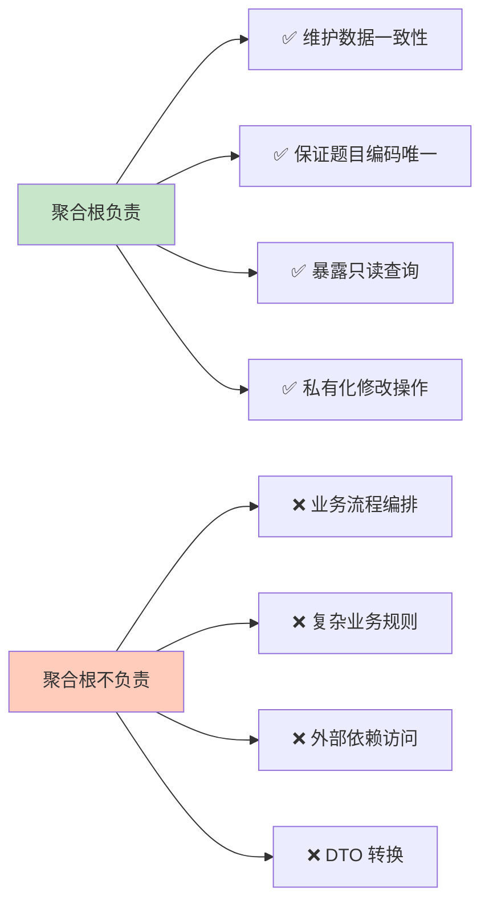

### 5.2 构造函数

```go
// NewQuestionnaire 创建新问卷
func NewQuestionnaire(code Code, title string, createdBy ID) (*Questionnaire, error) {
    // 参数校验
    if code.IsEmpty() {
        return nil, ErrCodeEmpty
    }
    if title == "" {
        return nil, ErrTitleEmpty
    }
    if len(title) > 200 {
        return nil, ErrTitleTooLong
    }
    
    return &Questionnaire{
        id:        NewID(),
        code:      code,
        title:     title,
        version:   Version("0.0.1"), // 初始版本
        status:    StatusDraft,       // 初始状态：草稿
        questions: make([]Question, 0),
        createdBy: createdBy,
        createdAt: time.Now(),
        updatedAt: time.Now(),
    }, nil
}
```

📄 **代码位置**：[`questionnaire/questionnaire.go`](../../internal/apiserver/domain/questionnaire/questionnaire.go)

### 5.3 公共接口：只读为主

```go
// ========== 只读查询 ==========
func (q *Questionnaire) ID() ID                    { return q.id }
func (q *Questionnaire) Code() Code                { return q.code }
func (q *Questionnaire) GetTitle() string          { return q.title }
func (q *Questionnaire) GetVersion() Version       { return q.version }
func (q *Questionnaire) GetStatus() Status         { return q.status }
func (q *Questionnaire) GetQuestions() []Question  { return q.questions }
func (q *Questionnaire) QuestionCount() int        { return len(q.questions) }

// ========== 状态判断 ==========
func (q *Questionnaire) IsDraft() bool     { return q.status == StatusDraft }
func (q *Questionnaire) IsPublished() bool { return q.status == StatusPublished }
func (q *Questionnaire) IsArchived() bool  { return q.status == StatusArchived }
```

### 5.4 私有接口：仅供领域服务

```go
// ========== 仅同包可见的修改操作 ==========

// changeStatus 修改状态（仅限 Lifecycle 服务调用）
func (q *Questionnaire) changeStatus(status Status) error {
    q.status = status
    q.updatedAt = time.Now()
    return nil
}

// updateBasicInfo 更新基本信息（仅限 BaseInfo 服务调用）
func (q *Questionnaire) updateBasicInfo(title, desc, imgURL string) error {
    if title != "" {
        q.title = title
    }
    q.desc = desc
    q.imgURL = imgURL
    q.updatedAt = time.Now()
    return nil
}

// addQuestion 添加题目（仅限 QuestionManager 服务调用）
func (q *Questionnaire) addQuestion(question Question) error {
    q.questions = append(q.questions, question)
    q.updatedAt = time.Now()
    return nil
}

// updateVersion 更新版本（仅限 Versioning 服务调用）
func (q *Questionnaire) updateVersion(v Version) error {
    q.version = v
    q.updatedAt = time.Now()
    return nil
}
```

**设计意图**：

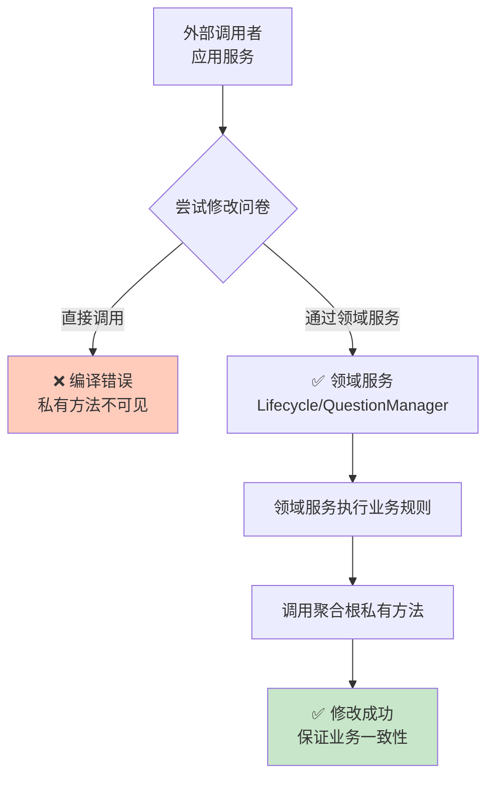

---

## 6. 领域服务设计

### 6.1 五大领域服务总览

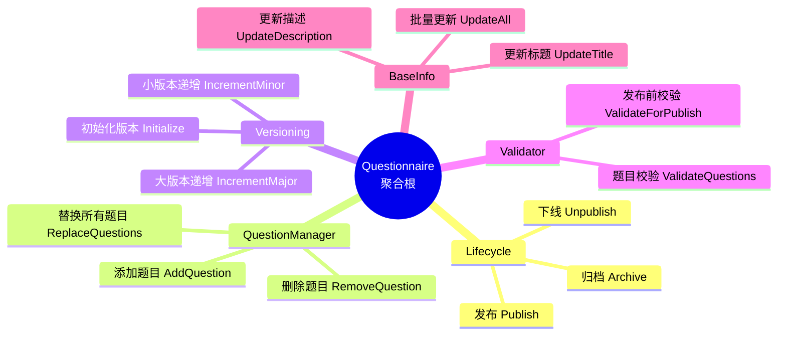

### 6.2 Lifecycle：生命周期管理

**状态机模型**：

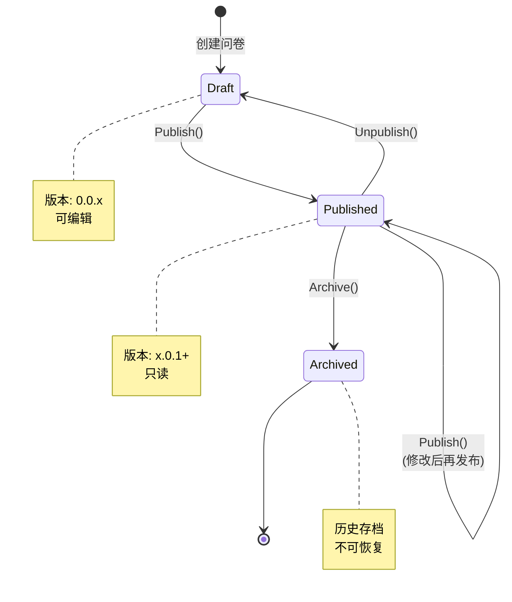

**Publish 方法实现**：

```go
type Lifecycle struct {
    validator  *Validator
    versioning *Versioning
}

// Publish 发布问卷
func (lc *Lifecycle) Publish(ctx context.Context, q *Questionnaire) error {
    // 1. 状态检查
    if q.IsArchived() {
        return ErrCannotPublishArchivedQuestionnaire
    }
    
    // 2. 业务规则校验
    errs := lc.validator.ValidateForPublish(q)
    if len(errs) > 0 {
        return WrapValidationErrors(errs)
    }
    
    // 3. 大版本递增（发布=重大变更）
    if err := lc.versioning.IncrementMajorVersion(q); err != nil {
        return err
    }
    
    // 4. 状态转换
    return q.changeStatus(StatusPublished)
}

// Unpublish 下线问卷（变回草稿）
func (lc *Lifecycle) Unpublish(ctx context.Context, q *Questionnaire) error {
    if !q.IsPublished() {
        return ErrQuestionnaireNotPublished
    }
    return q.changeStatus(StatusDraft)
}

// Archive 归档问卷（不可逆）
func (lc *Lifecycle) Archive(ctx context.Context, q *Questionnaire) error {
    if q.IsArchived() {
        return ErrAlreadyArchived
    }
    return q.changeStatus(StatusArchived)
}
```

**发布流程时序图**：

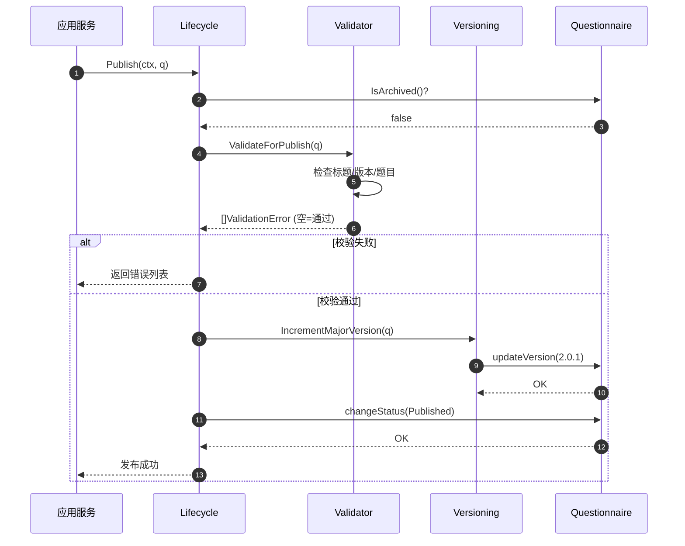

📄 **代码位置**：[`questionnaire/lifecycle.go`](../../internal/apiserver/domain/questionnaire/lifecycle.go)

### 6.3 Versioning：版本管理

**语义化版本规则**：

```text
格式：Major.Minor.Patch
示例：2.1.3

规则：
- 初始版本：0.0.1
- 草稿保存：Minor + 1    (0.0.1 → 0.0.2)
- 发布：    Major + 1    (0.0.5 → 1.0.1)
- 再发布：  Major + 1    (1.0.3 → 2.0.1)
```

**实现**：

```go
type Versioning struct{}

// InitializeVersion 初始化版本（新建问卷时）
func (Versioning) InitializeVersion(q *Questionnaire) error {
    return q.updateVersion(Version("0.0.1"))
}

// IncrementMinorVersion 小版本递增（保存草稿）
func (Versioning) IncrementMinorVersion(q *Questionnaire) error {
    currentVersion := q.GetVersion()
    newVersion := currentVersion.IncrementMinor()
    return q.updateVersion(newVersion)
}

// IncrementMajorVersion 大版本递增（发布）
func (Versioning) IncrementMajorVersion(q *Questionnaire) error {
    currentVersion := q.GetVersion()
    newVersion := currentVersion.IncrementMajor()
    return q.updateVersion(newVersion)
}
```

**Version 值对象**：

```go
type Version string

// IncrementMinor 0.0.1 → 0.0.2
func (v Version) IncrementMinor() Version {
    parts := strings.Split(string(v), ".")
    if len(parts) != 3 {
        return v
    }
    
    patch, _ := strconv.Atoi(parts[2])
    return Version(fmt.Sprintf("%s.%s.%d", parts[0], parts[1], patch+1))
}

// IncrementMajor 0.0.5 → 1.0.1
func (v Version) IncrementMajor() Version {
    parts := strings.Split(string(v), ".")
    if len(parts) != 3 {
        return v
    }
    
    major, _ := strconv.Atoi(parts[0])
    return Version(fmt.Sprintf("%d.0.1", major+1))
}
```

📄 **代码位置**：

- [`questionnaire/versioning.go`](../../internal/apiserver/domain/questionnaire/versioning.go)
- [`questionnaire/version.go`](../../internal/apiserver/domain/questionnaire/version.go)

### 6.4 QuestionManager：题目管理

```go
type QuestionManager struct{}

// AddQuestion 添加题目
func (QuestionManager) AddQuestion(q *Questionnaire, question Question) error {
    if question == nil {
        return ErrNilQuestion
    }
    
    // 检查编码唯一性
    for _, existing := range q.GetQuestions() {
        if existing.GetCode() == question.GetCode() {
            return ErrDuplicatedQuestionCode
        }
    }
    
    return q.addQuestion(question)
}

// RemoveQuestion 删除题目
func (QuestionManager) RemoveQuestion(q *Questionnaire, code Code) error {
    questions := q.GetQuestions()
    for i, question := range questions {
        if question.GetCode() == code {
            // 删除该题
            q.questions = append(questions[:i], questions[i+1:]...)
            q.updatedAt = time.Now()
            return nil
        }
    }
    return ErrQuestionNotFound
}

// ReplaceQuestions 一次性替换所有题目
func (QuestionManager) ReplaceQuestions(q *Questionnaire, questions []Question) error {
    if len(questions) == 0 {
        return ErrEmptyQuestions
    }
    
    // 检查编码唯一性
    seen := make(map[string]bool)
    for _, question := range questions {
        if question == nil {
            return ErrNilQuestion
        }
        code := question.GetCode().Value()
        if seen[code] {
            return ErrDuplicatedQuestionCode
        }
        seen[code] = true
    }
    
    q.questions = questions
    q.updatedAt = time.Now()
    return nil
}
```

📄 **代码位置**：[`questionnaire/question_manager.go`](../../internal/apiserver/domain/questionnaire/question_manager.go)

### 6.5 Validator：业务规则校验

```go
type ValidationError struct {
    Field   string // 字段名
    Code    string // 错误代码
    Message string // 错误消息
}

type Validator struct{}

// ValidateForPublish 发布前校验
func (Validator) ValidateForPublish(q *Questionnaire) []ValidationError {
    var errs []ValidationError
    
    // 1. 标题校验
    if q.GetTitle() == "" {
        errs = append(errs, ValidationError{
            Field:   "title",
            Code:    "TITLE_EMPTY",
            Message: "问卷标题不能为空",
        })
    }
    if len(q.GetTitle()) > 200 {
        errs = append(errs, ValidationError{
            Field:   "title",
            Code:    "TITLE_TOO_LONG",
            Message: "问卷标题不能超过200字符",
        })
    }
    
    // 2. 版本校验
    if q.GetVersion().IsEmpty() {
        errs = append(errs, ValidationError{
            Field:   "version",
            Code:    "VERSION_EMPTY",
            Message: "版本号不能为空",
        })
    }
    
    // 3. 题目数量校验
    if q.QuestionCount() == 0 {
        errs = append(errs, ValidationError{
            Field:   "questions",
            Code:    "QUESTIONS_EMPTY",
            Message: "问卷至少需要一个题目",
        })
    }
    
    // 4. 逐题校验
    for _, question := range q.GetQuestions() {
        // 题目编码
        if question.GetCode().IsEmpty() {
            errs = append(errs, ValidationError{
                Field:   "questions",
                Code:    "QUESTION_CODE_EMPTY",
                Message: "题目编码不能为空",
            })
        }
        
        // 题干
        if question.GetStem() == "" {
            errs = append(errs, ValidationError{
                Field:   "questions",
                Code:    "QUESTION_STEM_EMPTY",
                Message: fmt.Sprintf("题目 %s 的题干不能为空", question.GetCode()),
            })
        }
        
        // 选择题选项数量
        if question.GetType() == TypeRadio || question.GetType() == TypeCheckbox {
            if len(question.GetOptions()) < 2 {
                errs = append(errs, ValidationError{
                    Field:   "questions",
                    Code:    "OPTIONS_INSUFFICIENT",
                    Message: fmt.Sprintf("题目 %s 至少需要2个选项", question.GetCode()),
                })
            }
        }
    }
    
    return errs
}
```

📄 **代码位置**：[`questionnaire/validator.go`](../../internal/apiserver/domain/questionnaire/validator.go)

### 6.6 BaseInfo：基本信息管理

```go
type BaseInfo struct{}

// UpdateTitle 更新标题
func (BaseInfo) UpdateTitle(q *Questionnaire, title string) error {
    if title == "" {
        return ErrTitleEmpty
    }
    if len(title) > 200 {
        return ErrTitleTooLong
    }
    return q.updateBasicInfo(title, q.desc, q.imgURL)
}

// UpdateDescription 更新描述
func (BaseInfo) UpdateDescription(q *Questionnaire, desc string) error {
    return q.updateBasicInfo(q.title, desc, q.imgURL)
}

// UpdateAll 批量更新
func (BaseInfo) UpdateAll(q *Questionnaire, title, desc, imgURL string) error {
    if title == "" {
        return ErrTitleEmpty
    }
    if len(title) > 200 {
        return ErrTitleTooLong
    }
    return q.updateBasicInfo(title, desc, imgURL)
}
```

📄 **代码位置**：[`questionnaire/baseinfo.go`](../../internal/apiserver/domain/questionnaire/baseinfo.go)

---

## 7. 运行机制

### 7.1 完整用例：创建并发布 PHQ-9 问卷

**业务流程**：

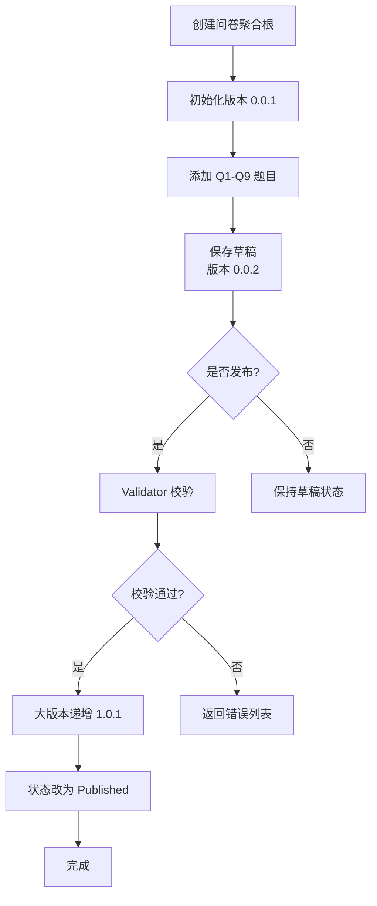

**代码实现**：

```go
// ========== 1. 初始化领域服务 ==========
versioning := questionnaire.Versioning{}
lifecycle := questionnaire.NewLifecycle()
questionManager := questionnaire.QuestionManager{}

// ========== 2. 创建问卷聚合根 ==========
qnr, err := questionnaire.NewQuestionnaire(
    questionnaire.NewCode("PHQ-9"),
    "PHQ-9 抑郁症筛查量表",
    creatorID,
)
if err != nil {
    return err
}

// ========== 3. 初始化版本 ==========
if err := versioning.InitializeVersion(qnr); err != nil {
    return err
}

// ========== 4. 创建并添加题目 ==========
// Q1
q1, err := questionnaire.NewQuestion(
    questionnaire.WithCode(questionnaire.NewCode("Q1")),
    questionnaire.WithStem("做事时提不起劲或没有兴趣"),
    questionnaire.WithQuestionType(questionnaire.TypeRadio),
    questionnaire.WithOption("0", "完全不会", 0),
    questionnaire.WithOption("1", "几天", 1),
    questionnaire.WithOption("2", "一半以上的天数", 2),
    questionnaire.WithOption("3", "几乎每天", 3),
    questionnaire.WithRequired(),
    questionnaire.WithCalculationRule(questionnaire.FormulaScore),
)
if err != nil {
    return err
}
if err := questionManager.AddQuestion(qnr, q1); err != nil {
    return err
}

// Q2-Q9 类似...（此处省略）

// ========== 5. 保存草稿 ==========
if err := versioning.IncrementMinorVersion(qnr); err != nil {
    return err
}
// 此时版本：0.0.2

// ========== 6. 发布问卷 ==========
if err := lifecycle.Publish(ctx, qnr); err != nil {
    return err
}
// 此时版本：1.0.1，状态：Published
```

### 7.2 用例：修改已发布问卷并再次发布

```go
baseInfo := questionnaire.BaseInfo{}

// ========== 1. 修改标题 ==========
if err := baseInfo.UpdateTitle(qnr, "PHQ-9 抑郁症筛查量表（修订版）"); err != nil {
    return err
}

// ========== 2. 添加新题目 ==========
q10, err := questionnaire.NewQuestion(
    questionnaire.WithCode(questionnaire.NewCode("Q10")),
    questionnaire.WithStem("补充题：您是否接受过心理咨询？"),
    questionnaire.WithQuestionType(questionnaire.TypeRadio),
    questionnaire.WithOption("Y", "是", 0),
    questionnaire.WithOption("N", "否", 0),
)
if err != nil {
    return err
}
if err := questionManager.AddQuestion(qnr, q10); err != nil {
    return err
}

// ========== 3. 保存草稿（小版本递增） ==========
if err := versioning.IncrementMinorVersion(qnr); err != nil {
    return err
}
// 版本：1.0.2

// ========== 4. 再次发布（大版本递增） ==========
if err := lifecycle.Publish(ctx, qnr); err != nil {
    return err
}
// 版本：2.0.1，状态：Published
```

### 7.3 数据流转图

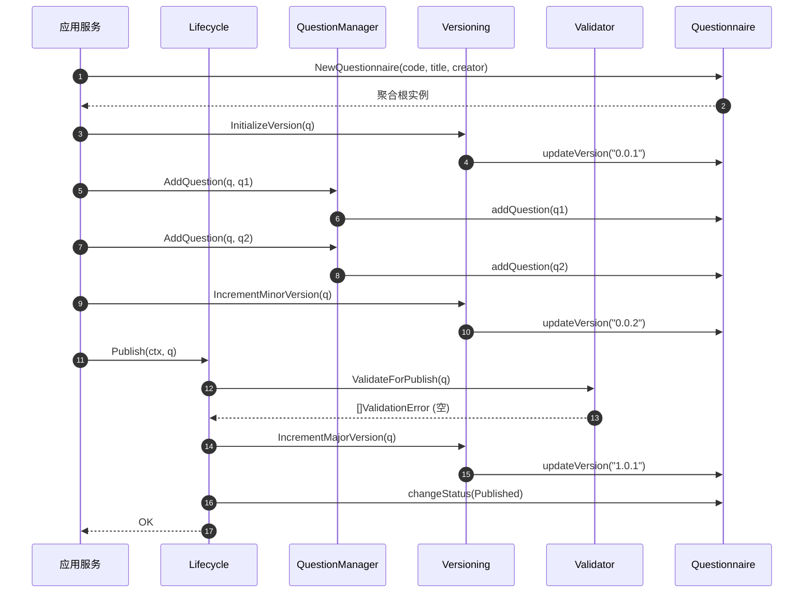

---

## 8. 设计模式总结

### 8.1 模式应用全景

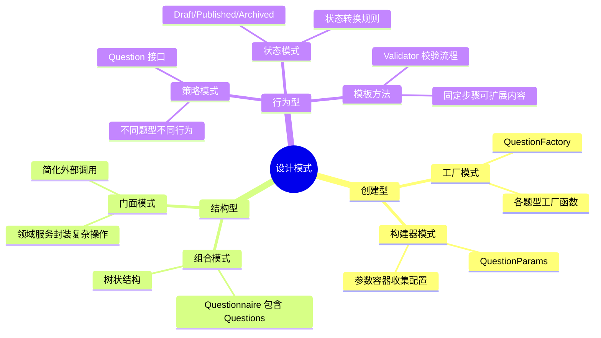

### 8.2 模式详解表

| 模式 | 应用位置 | 问题 | 解决方案 | 收益 |
|------|---------|------|---------|------|
| **注册器模式** | `questionRegistry` | 题型与创建逻辑硬编码 | 运行时动态注册映射 | ✅ 扩展时不改核心代码 |
| **工厂模式** | 各题型 Factory | 创建逻辑分散 | 集中在工厂函数 | ✅ 创建逻辑可测试、可复用 |
| **函数式选项** | `WithXXX()` | 构造参数过多 | 选项函数链式调用 | ✅ 可读性强、可组合 |
| **参数容器** | `QuestionParams` | 参数传递混乱 | 统一收集与校验 | ✅ 参数管理规范化 |
| **领域服务** | Lifecycle 等 | 聚合根臃肿 | 拆分到专门服务 | ✅ 单一职责、易维护 |
| **值对象** | Version/Option | 原始类型语义弱 | 封装行为与校验 | ✅ 类型安全、语义明确 |
| **状态机** | Status | 状态转换混乱 | 显式状态与转换规则 | ✅ 流程清晰、可追溯 |

### 8.3 SOLID 原则体现

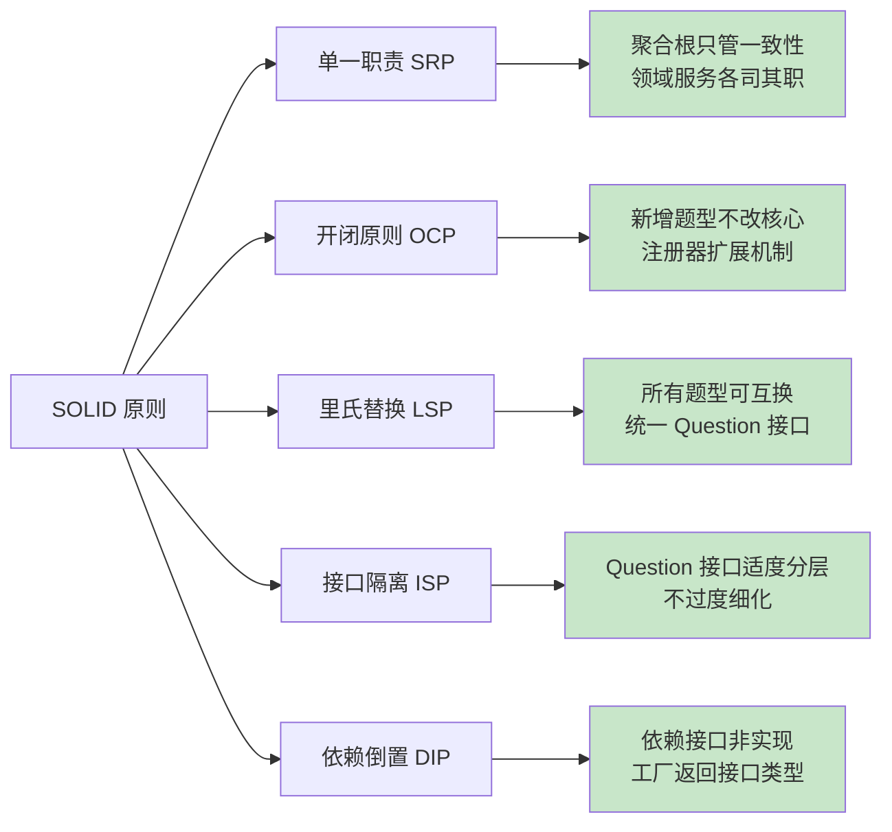

### 8.4 设计思想总结

| 设计思想 | 体现方式 | 价值 |
|---------|---------|------|
| **关注点分离** | 聚合根、领域服务、值对象各司其职 | 降低耦合，提高内聚 |
| **充血模型** | 聚合根包含行为而非纯数据 | 业务逻辑内聚在领域层 |
| **不变式保护** | 私有修改方法+领域服务编排 | 确保数据一致性 |
| **开闭原则** | 注册器+工厂扩展题型 | 新增功能无需改动现有代码 |
| **语义化版本** | Version 值对象+递增规则 | 演进清晰，追溯方便 |

---

## 9. 代码导航

### 9.1 目录结构

```text
internal/apiserver/domain/questionnaire/
├── questionnaire.go              # 聚合根
├── question.go                   # Question 接口
├── question_types.go             # 题型枚举
├── question_core.go              # 题型公共字段
├── question_params.go            # 参数容器
├── question_options.go           # 函数式选项
├── question_registry.go          # 注册器
│
├── question_radio.go             # 单选题实现
├── question_checkbox.go          # 多选题实现
├── question_text.go              # 文本题实现
├── question_textarea.go          # 多行文本实现
├── question_number.go            # 数字题实现
│
├── lifecycle.go                  # 生命周期服务
├── question_manager.go           # 题目管理服务
├── versioning.go                 # 版本管理服务
├── validator.go                  # 校验服务
├── baseinfo.go                   # 基本信息服务
│
├── version.go                    # 版本值对象
├── option.go                     # 选项值对象
├── status.go                     # 状态枚举
├── code.go                       # 编码值对象
└── errors.go                     # 错误定义
```

### 9.2 核心代码链接

#### 聚合根与接口

- [questionnaire.go](../../internal/apiserver/domain/questionnaire/questionnaire.go) - 问卷聚合根
- [question.go](../../internal/apiserver/domain/questionnaire/question.go) - Question 接口定义
- [question_types.go](../../internal/apiserver/domain/questionnaire/question_types.go) - 题型枚举

#### 题型扩展机制

- [question_registry.go](../../internal/apiserver/domain/questionnaire/question_registry.go) - 注册器
- [question_params.go](../../internal/apiserver/domain/questionnaire/question_params.go) - 参数容器
- [question_options.go](../../internal/apiserver/domain/questionnaire/question_options.go) - 函数式选项

#### 具体题型实现

- [question_radio.go](../../internal/apiserver/domain/questionnaire/question_radio.go) - 单选题
- [question_checkbox.go](../../internal/apiserver/domain/questionnaire/question_checkbox.go) - 多选题
- [question_text.go](../../internal/apiserver/domain/questionnaire/question_text.go) - 文本题
- [question_textarea.go](../../internal/apiserver/domain/questionnaire/question_textarea.go) - 多行文本
- [question_number.go](../../internal/apiserver/domain/questionnaire/question_number.go) - 数字题

#### 领域服务

- [lifecycle.go](../../internal/apiserver/domain/questionnaire/lifecycle.go) - 生命周期管理
- [question_manager.go](../../internal/apiserver/domain/questionnaire/question_manager.go) - 题目管理
- [versioning.go](../../internal/apiserver/domain/questionnaire/versioning.go) - 版本管理
- [validator.go](../../internal/apiserver/domain/questionnaire/validator.go) - 业务校验
- [baseinfo.go](../../internal/apiserver/domain/questionnaire/baseinfo.go) - 基本信息管理

#### 值对象

- [version.go](../../internal/apiserver/domain/questionnaire/version.go) - 版本号
- [option.go](../../internal/apiserver/domain/questionnaire/option.go) - 选项
- [code.go](../../internal/apiserver/domain/questionnaire/code.go) - 编码
- [status.go](../../internal/apiserver/domain/questionnaire/status.go) - 状态

### 9.3 相关文档

- [11-04-01 Survey 子域架构总览](./11-04-01-Survey子域架构总览.md) - 上层架构
- [11-04-03 AnswerSheet 聚合设计](./11-04-03-AnswerSheet聚合设计.md) - 答卷模型
- [11-04-04 Validation 子域设计](./11-04-04-Validation子域设计.md) - 校验子域
- [11-04-05 应用服务层设计](./11-04-05-应用服务层设计.md) - 应用层
- [11-04-07 扩展指南](./11-04-07-扩展指南.md) - 扩展开发

---

## 附录：快速参考

### A. 创建问卷流程

```go
// 1. 初始化服务
versioning := questionnaire.Versioning{}
lifecycle := questionnaire.NewLifecycle()
questionManager := questionnaire.QuestionManager{}

// 2. 创建聚合根
qnr := questionnaire.NewQuestionnaire(code, title, creator)
versioning.InitializeVersion(qnr)

// 3. 添加题目
q := questionnaire.NewQuestion(WithCode(...), WithStem(...), ...)
questionManager.AddQuestion(qnr, q)

// 4. 发布
lifecycle.Publish(ctx, qnr)
```

### B. 新增题型检查清单

- [ ] 在 `question_types.go` 中添加枚举值
- [ ] 创建 `question_xxx.go` 文件
- [ ] 实现 `Question` 接口
- [ ] 编写工厂函数 `newXXXQuestionFactory`
- [ ] 在 `init()` 中注册工厂
- [ ] 编写单元测试
- [ ] 更新文档

### C. 常见问题

**Q: 为什么不用小接口组合？**
A: 当前规模下统一接口使用更简单，避免接口爆炸。如果接口膨胀可考虑拆分。

**Q: 为什么聚合根方法是私有的？**
A: 强制通过领域服务调用，确保业务规则执行，保证一致性。

**Q: 如何处理题型特有字段？**
A: 在各题型 struct 中添加私有字段，通过专门方法暴露。

**Q: 版本号能回退吗？**
A: 不能，版本号只能递增，体现演进的单向性。

---

**文档变更历史**：

- V4.0 (2025-11-26) - 金字塔结构重构，增强可视化和代码链接
- V3.0 (2025-11-26) - 设计阐述版
- V2.0 (2025-11-25) - 实现细节版
- V1.0 (2025-11-20) - 初始版本
