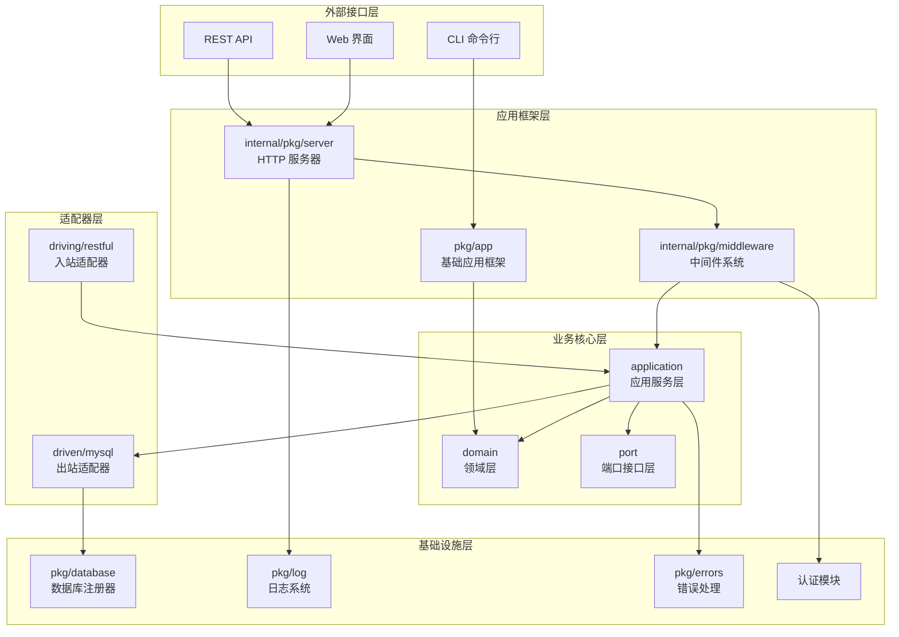
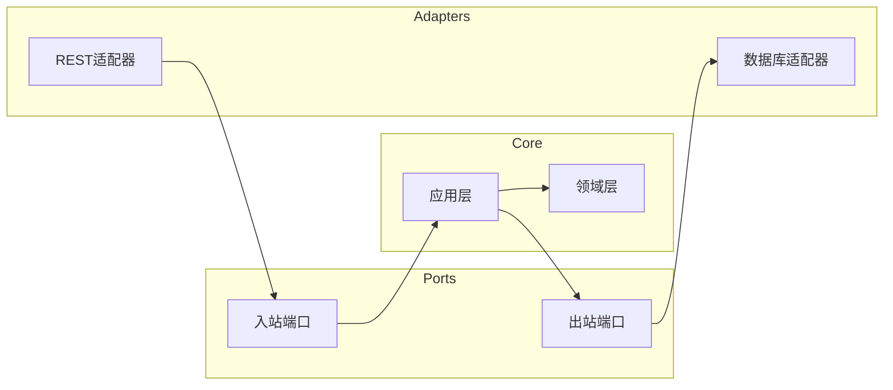
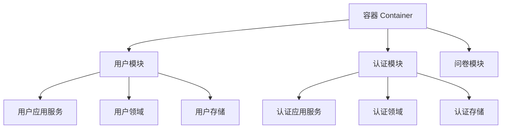

# 🏗️ Questionnaire Scale - 架构设计总览

## 📋 目录

- [系统概述](#system-overview)
- [架构原则](#architecture-principles)
- [系统分层](#system-layers)
- [核心设计模式](#core-design-patterns)
- [技术选型](#technology-stack)
- [架构文档导航](#architecture-docs-navigation)

## 🎯 系统概述 {#system-overview}

Questionnaire Scale 是一个基于 Go 语言开发的企业级问卷量表管理系统，采用现代软件架构设计原则，具备高度的**可扩展性**、**可维护性**和**可测试性**。

### 🎨 核心设计理念

#### **分离关注点 (Separation of Concerns)**

- 业务逻辑与基础设施完全分离
- 应用框架与具体实现解耦
- 领域模型与数据存储无关

#### **依赖倒置 (Dependency Inversion)**

- 高层模块不依赖低层模块
- 抽象不依赖具体实现
- 通过接口定义契约

#### **开闭原则 (Open/Closed Principle)**

- 对扩展开放，对修改关闭
- 通过模块化实现功能扩展
- 新需求通过添加而非修改实现

## 🏛️ 架构原则 {#architecture-principles}

### 1. **单一职责原则**

每个模块、类和函数都有明确且单一的职责

### 2. **接口隔离原则**

客户端不应该依赖它不需要的接口

### 3. **最少知识原则**

模块之间只暴露必要的接口

### 4. **控制反转**

通过依赖注入实现松耦合

## 🔧 系统分层 {#system-layers}



### 📝 分层说明

| 层次 | 职责 | 关键组件 |
|------|------|----------|
| **外部接口层** | 用户交互界面 | CLI、REST API、Web界面 |
| **应用框架层** | 应用基础设施 | 命令行框架、HTTP服务器、中间件 |
| **业务核心层** | 业务逻辑实现 | 领域模型、应用服务、端口接口 |
| **适配器层** | 外部系统集成 | REST处理器、数据库适配器 |
| **基础设施层** | 技术基础设施 | 数据库、日志、错误处理、认证 |

## 🔷 核心设计模式 {#core-design-patterns}

### 1. **六边形架构 (Hexagonal Architecture)**



**优势:**

- ✅ 业务逻辑与外部依赖完全隔离
- ✅ 便于单元测试和集成测试
- ✅ 支持不同的用户界面和数据源
- ✅ 提高代码的可维护性

### 2. **模块化设计 (Modular Design)**



**特点:**

- 🔧 **自包含**: 每个模块包含完整的业务功能
- 🔄 **可插拔**: 模块可以独立开发和部署
- 📦 **标准接口**: 通过统一接口进行交互
- 🏗️ **依赖注入**: 通过容器管理模块依赖

### 3. **策略模式 (Strategy Pattern)**

认证系统采用策略模式，支持多种认证方式：

```go
// 认证策略接口
type AuthStrategy interface {
    AuthFunc() gin.HandlerFunc
    Authenticate(c *gin.Context) bool
}

// 具体策略实现
- BasicStrategy  // Basic认证
- JWTStrategy    // JWT认证  
- AutoStrategy   // 自动选择认证
```

## 🛠️ 技术选型 {#technology-stack}

### **后端技术栈**

| 类别 | 技术 | 版本 | 用途 |
|------|------|------|------|
| **语言** | Go | 1.21+ | 主要开发语言 |
| **Web框架** | Gin | v1.9+ | HTTP服务框架 |
| **CLI框架** | Cobra | v1.7+ | 命令行应用框架 |
| **配置管理** | Viper | v1.16+ | 配置文件管理 |
| **ORM** | GORM | v1.25+ | 数据库ORM |
| **日志** | Zap | v1.24+ | 高性能日志库 |
| **认证** | gin-jwt | v2.9+ | JWT认证中间件 |

### **数据存储**

| 类型 | 技术 | 用途 |
|------|------|------|
| **关系数据库** | MySQL 8.0+ | 主要业务数据存储 |
| **文档数据库** | MongoDB 6.0+ | 问卷数据存储 |
| **缓存** | Redis 7.0+ | 会话和缓存存储 |

### **开发工具**

| 类型 | 技术 | 用途 |
|------|------|------|
| **依赖管理** | Go Modules | 包管理 |
| **构建工具** | Make | 构建自动化 |
| **代码质量** | golangci-lint | 静态代码分析 |
| **测试框架** | Testify | 单元测试 |

## 📁 项目结构概览

```text
questionnaire-scale/
├── 🎯 cmd/                    # 应用程序入口
├── 📦 pkg/                    # 可复用公共库
│   ├── app/                   # 基础应用框架 ←─┐
│   ├── database/              # 数据库注册器   │
│   ├── log/                   # 日志系统      │ 基础设施
│   ├── errors/                # 错误处理      │
│   └── auth/                  # 认证工具    ←─┘
├── 🏗️ internal/               # 内部应用代码
│   ├── pkg/                   # 内部共享包
│   │   ├── server/            # HTTP服务器 ←───┐
│   │   └── middleware/        # 中间件系统     │ 应用框架
│   └── apiserver/             # API服务器实现 ←─┘
│       ├── container/         # 依赖注入容器
│       ├── adapters/          # 适配器层
│       ├── domain/            # 领域层
│       ├── application/       # 应用服务层
│       └── module/            # 模块组装
└── 📊 configs/                # 配置文件
```

## 🚀 架构优势

### 1. **高可扩展性**

- **水平扩展**: 支持多实例部署
- **模块扩展**: 新功能以模块形式添加
- **接口扩展**: 通过适配器支持新的外部系统

### 2. **高可维护性**

- **代码组织**: 清晰的分层和模块结构
- **职责分离**: 每个组件职责明确
- **文档完善**: 详细的架构和API文档

### 3. **高可测试性**

- **依赖注入**: 便于创建测试替身
- **接口抽象**: 支持mock测试
- **层次隔离**: 可以独立测试各层

### 4. **高性能**

- **Gin框架**: 高性能HTTP路由
- **连接池**: 数据库连接复用
- **异步日志**: 非阻塞日志记录
- **缓存支持**: Redis缓存加速

## 📚 架构文档导航 {#architecture-docs-navigation}

本架构设计由以下专题文档组成，建议按顺序阅读：

### 🔗 **核心架构文档**

1. **[基础应用与HTTP服务分离设计](./02-基础应用与HTTP服务分离设计.md)**
   - pkg/app 应用框架详解
   - internal/pkg/server HTTP服务器设计
   - 应用与服务的解耦机制

2. **[基于六边形架构的模块化设计](./03-基于六边形架构的模块化设计.md)**
   - 六边形架构原理与实现
   - 模块系统设计
   - 端口与适配器模式

### 🔧 **基础设施文档**

1. **[数据库注册器设计](./04-数据库注册器设计.md)**
   - 数据库连接管理
   - 多数据源支持
   - 健康检查机制

2. **[日志模块设计](./05-日志模块设计.md)**
   - 基于Zap的日志系统
   - 上下文感知日志
   - 结构化日志设计

3. **[错误处理模块设计](./06-错误处理模块设计.md)**
   - 错误类型设计
   - 错误码管理
   - 堆栈跟踪机制

4. **[认证模块设计](./07-认证模块设计.md)**
   - 多策略认证系统
   - JWT与Basic Auth
   - 认证中间件设计

### 📖 **阅读建议**

- **架构师/技术负责人**: 完整阅读所有文档
- **后端开发工程师**: 重点阅读 1、3、4、5、6
- **前端开发工程师**: 重点阅读 1、2、7
- **测试工程师**: 重点阅读 1、2、5、6
- **运维工程师**: 重点阅读 1、4、5
