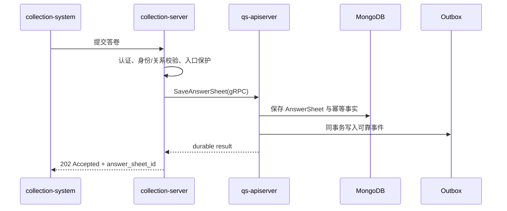
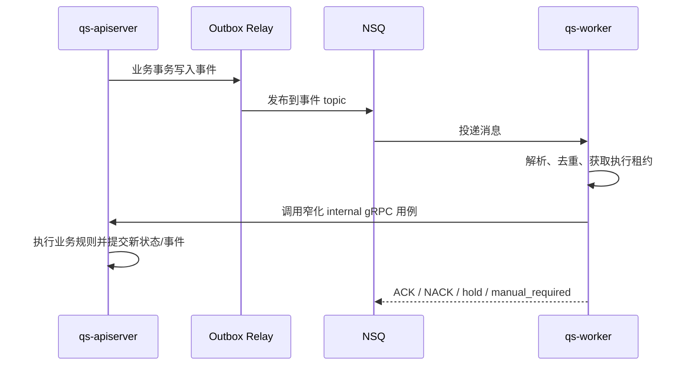

# 三进程协作总览

## 1. 结论

qs-server 运行时可以定义为：**以 `qs-apiserver` 模块化单体为业务核心，由 `collection-server` 和 `qs-worker` 围绕它形成入口适配与异步执行能力的三进程事件驱动系统。**

这一定义包含三个边界：

- `qs-apiserver` 是业务事实和业务规则的所有者；
- `collection-server` 可以编排前台体验、缓存和保护策略，但不能直接推进核心业务状态；
- `qs-worker` 可以决定消息怎样消费、重试和结算，但不能拥有 Evaluation、Interpretation 等核心规则。

三进程拆分解决的是运行职责和伸缩方式不同的问题，并不意味着 Survey、Evaluation、Interpretation 已成为可独立演进、独立存储和独立发布的微服务。

## 2. 为什么是三个进程

### 2.1 qs-apiserver：集中业务一致性

Survey、Actor、ModelCatalog、Evaluation、Interpretation、Plan、Statistics 等模块在同一业务核心中装配。它们可以在代码上保持清晰边界，同时在需要时共享事务、领域事件和应用服务编排。

将业务核心集中在 apiserver 的直接收益是：

- 核心状态迁移只有一个权威实现；
- collection 和 worker 不必复制领域规则；
- 同类测评通过配置接入，异类测评通过稳定扩展点接入时，统一执行主链路可以保持稳定；
- 当前团队和发布规模不需要承担微服务带来的分布式事务、接口治理和多仓协作成本。

### 2.2 collection-server：隔离前台变化与入口压力

collection-server 最初独立的首要原因是承接小程序 BFF 和身份转换。随后在校内集中筛查、线上直播推送、Plan 集中提醒等峰值场景中，它又承担了入口保护职责。

它适合独立运行和伸缩，因为前台流量、长轮询/报告等待、目录缓存、限流和降级策略与核心业务写入的资源模型不同。但“独立伸缩”不等于“独立拥有业务数据”。

### 2.3 qs-worker：隔离耗时异步执行

提交答卷之后还要经历测评创建、计分、因子计算、结果提交、解读和报告生成。这些步骤耗时较长，而且不属于一次 HTTP 请求内的同一工作单元。

worker 从项目设计初期就用于消费事件并驱动这些后续用例，使提交请求可以在答卷可靠保存后尽快返回。它是执行控制面，不是第二套业务核心。

## 3. 进程职责矩阵

| 进程 | 对外入口 | 主要职责 | 可以拥有的状态 | 不应拥有的职责 |
| --- | --- | --- | --- | --- |
| `qs-apiserver` | 运营/医疗系统 REST、内部 gRPC | 领域用例、业务事务、Outbox、报告与查询、后台调度 | MongoDB/MySQL 中的业务事实、领域状态 | 前台页面适配；把业务规则下放给 worker |
| `collection-server` | collection-system 小程序 REST/WebSocket | BFF、用户身份投影、查询编排、缓存、限流/背压/降级、可靠提交入口 | 短期缓存、等待状态、运行时保护状态 | 绕过 apiserver 写核心库；在内存 Queue 中承诺可靠受理 |
| `qs-worker` | NSQ consumer、可选 metrics | 事件解析、重复抑制、锁与执行控制、gRPC 调用、ACK/NACK、自动重试治理 | 死信、retry hold、运行时锁和报告状态投影 | 直接修改核心业务表；实现 Evaluation/Interpretation 规则 |

## 4. 两条主要运行链路

### 4.1 同步受理链路



`202 Accepted` 的含义不是“请求已经进入 collection 内存队列”，而是“答卷及驱动后续处理的 Outbox 已可靠提交”。计分和报告尚未完成，因此不能返回 `200` 并暗示整个测评已经结束。

collection 的并发 Gate、限流和 Redis SubmitGuard 都位于这个可靠边界之外：它们可以拒绝、削峰或减少重复请求，但不能替代数据库幂等和 Outbox。

### 4.2 异步执行链路



事件可能经历重复投递和重试，因此“消息被消费一次”不是业务正确性的前提。正确性来自业务幂等、执行租约、状态机约束和可靠事件共同作用。

## 5. 状态所有权与调用方向

允许的主要方向是：

```text
小程序 -> collection REST -> apiserver gRPC
运营后台/医疗业务系统 -> apiserver REST
apiserver -> Outbox -> NSQ -> worker -> apiserver internal gRPC
apiserver/worker -> Redis signal/status -> collection 查询或等待链路
```

其中 Redis 中的 signal/status 是前台体验和运行协调信息。它可以丢失后通过轮询、数据库事实或 TTL 兜底，不应被当作不可丢失的业务事件。可靠业务事件则必须先进入 Outbox，允许重放和补偿。

以下方向应视为架构越界：

- collection 或 worker 直接写 apiserver 的核心 MongoDB/MySQL 业务表；
- worker handler 自己计算领域结果，而不是调用 apiserver 应用服务；
- collection 使用进程内 Queue 接住请求后立刻返回成功，却没有持久化受理凭据；
- 把 Redis 通知是否送达当成报告是否生成的唯一事实。

## 6. 为什么这不是微服务架构

微服务不由进程数量决定。一个边界要成为自治服务，通常还需要具备独立业务能力、明确数据所有权、独立发布节奏和可由独立团队维护的契约。

qs-server 当前的情况是：

- 核心领域模块在同一个 apiserver 组合根中装配；
- 它们共享基础设施和一次发布单元；
- collection、worker 的核心写操作仍回到 apiserver；
- 拆分主要服务于入口适配、资源隔离和异步执行，而非业务自治。

因此，“模块化单体 + 边界进程”比“三个微服务”更准确。未来只有当某个模块形成独立业务能力、数据所有权、团队和发布需求时，才有重新评估服务化的理由。

## 7. 故障隔离边界

| 故障 | 期望行为 | 不能接受的行为 |
| --- | --- | --- |
| collection 过载 | 在入口预算内等待，随后快速拒绝并提示重试 | 无界排队；先返回成功再丢请求 |
| Redis/缓存不可用 | 对高流量链路失败关闭、固定降级或限容，不让流量无保护回源 DB | 所有缓存请求直接打到数据库导致级联故障 |
| apiserver gRPC 不可用 | collection 返回依赖不可用；worker 按治理策略重试/挂起 | collection 假装已可靠受理 |
| NSQ 暂时不可用 | 已提交 Outbox 保留，Relay 后续继续发布 | 数据库事务回滚后仍向客户端返回 202 |
| 单条事件永久失败 | 进入手工处理或死信治理，保留原因与审计信息 | 无限自动重试拖垮队列 |

## 8. 从哪里验证

- 进程入口：`cmd/qs-apiserver`、`cmd/collection-server`、`cmd/qs-worker`；
- 启动与关闭：`internal/apiserver/process`、`internal/collection-server/process`、`internal/worker/process`；
- 跨进程契约：`api/grpc/proto`、`api/grpc/gen`；
- 事件目录：`configs/events.yaml`、`internal/pkg/eventing/catalog`；
- apiserver 事件运行时：`internal/apiserver/eventing/subsystem`；
- worker handler：`internal/worker/handlers`；
- 一次性信令：`configs/signals.yaml` 与各进程 signal/status 适配器。
