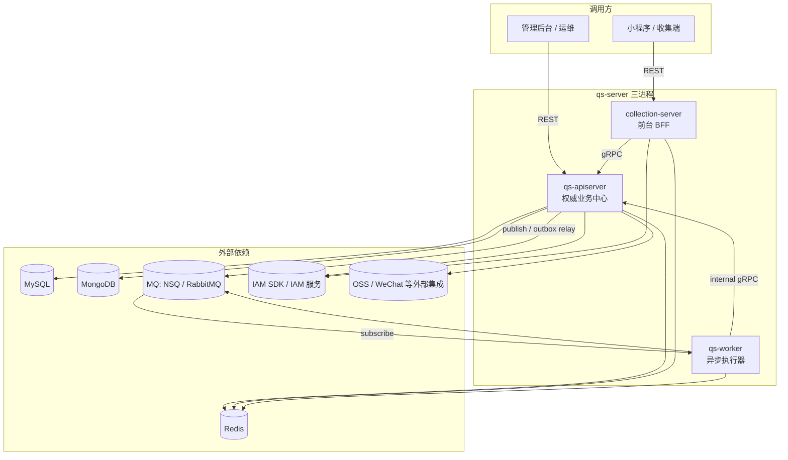
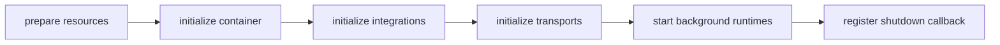
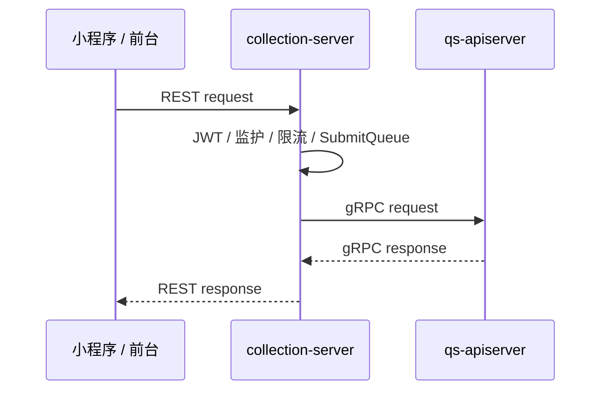
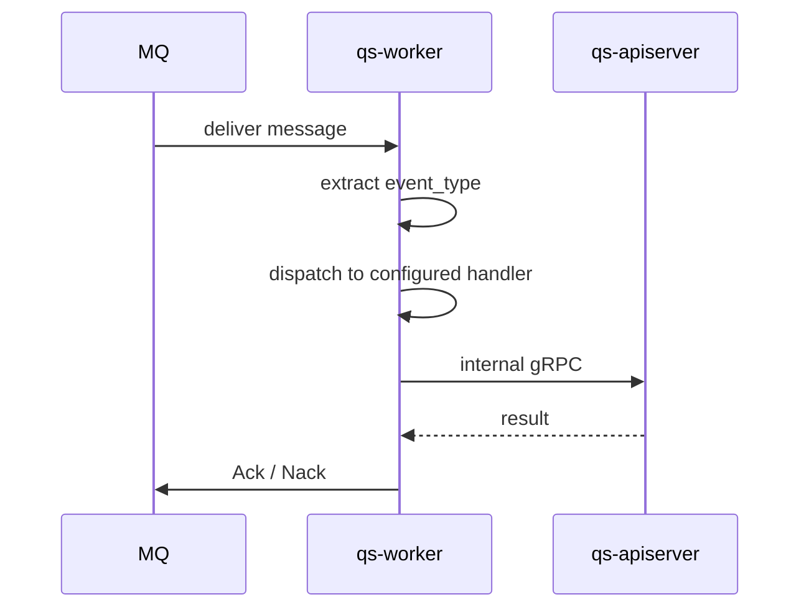
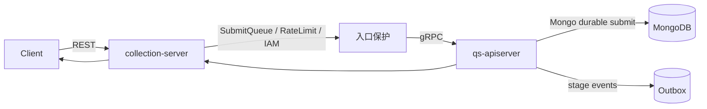
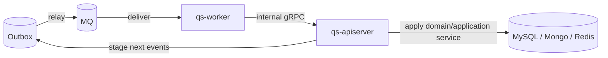

# 三进程协作总览

**本文回答**：`qs-server` 在运行时到底由哪些进程组成，每个进程承担什么职责，三者之间如何通过 REST、gRPC、MQ 和共享基础设施协作，以及排障或改造时应该先从哪个进程切入。

本文是 `01-运行时` 的总览页，只建立运行时坐标系；业务模型细节看 [02-业务模块](../02-业务模块/)，端到端业务主链路看 [00-总览/03-核心业务链路.md](../00-总览/03-核心业务链路.md)，事件、存储、安全、限流等机制看 [03-基础设施](../03-基础设施/)。

---

## 30 秒结论

| 维度 | 结论 |
| ---- | ---- |
| 运行时形态 | `qs-server` 是 **三进程协作系统**：`qs-apiserver`、`collection-server`、`qs-worker` |
| 权威业务中心 | `qs-apiserver` 是主业务状态、领域模型、持久化、REST/gRPC、事件发布和后台 runtime 的中心 |
| 前台入口 | `collection-server` 是面向小程序/采集端的 BFF，负责 REST 入口、身份/监护前置、提交削峰和 gRPC 转调 |
| 异步执行器 | `qs-worker` 消费 MQ 事件，通过 internal gRPC 回调 `qs-apiserver` 推进计分、测评、报告、标签、通知和行为投影 |
| 调用方向 | collection → apiserver 走 gRPC；worker → apiserver 走 internal gRPC；apiserver → worker 不直接 RPC，只通过 MQ 事件 |
| 状态归属 | 主写模型收口在 `qs-apiserver`；collection 和 worker 不维护第二套业务真值 |
| 配置真值 | 三进程分别读取 `configs/apiserver.*.yaml`、`configs/collection-server.*.yaml`、`configs/worker.*.yaml`；事件契约统一读取 `configs/events.yaml` |
| 运行时保护 | collection 有 SubmitQueue / 限流等入口保护；apiserver 有 outbox relay、scheduler、cache warmup、backpressure；worker 有 MQ Ack/Nack、分布式锁和 metrics/governance |

一句话概括：**collection 负责把前台请求安全地接进来，apiserver 负责保存和推进权威业务状态，worker 负责消费事件并回调 apiserver 触发异步步骤。**

---

## 1. 本文边界

运行时文档优先回答“谁在运行、谁调谁、什么时候跨进程、失败时先看哪里”。它不替代业务模块文档，也不替代接口契约文档。

| 本文负责 | 本文不负责 |
| -------- | ---------- |
| 三进程职责、调用方向、运行时阶段 | Survey / Scale / Evaluation 的领域模型细节 |
| REST / gRPC / MQ 的协作关系 | OpenAPI / proto 的字段级说明 |
| 启动阶段和资源依赖 | MySQL / Mongo / Redis 的 repository 细节 |
| 排障时从哪个进程切入 | 每个事件 handler 的完整业务规则 |
| 常见误区和运行时边界 | 具体部署脚本或 CD 流程全量展开 |

如果要看“一次答卷如何变成报告”，优先读 [00-总览/03-核心业务链路.md](../00-总览/03-核心业务链路.md)。本文只说明这条链路在三进程里如何穿行。

---

## 2. 全局运行时图



图里最重要的是方向：**worker 不拥有主业务写模型，collection 不直接落主业务事实；它们都把业务推进收口到 apiserver。**

---

## 3. 三个进程分别负责什么

### 3.1 `qs-apiserver`：主业务与状态收口

`qs-apiserver` 是系统的中心进程。它装配六个业务模块，持有 MySQL、Mongo、Redis、MQ publisher、event catalog、IAM module、WeChat / OSS 等外部集成，并同时提供 REST 与 gRPC 服务。

| 方面 | 说明 |
| ---- | ---- |
| 进程入口 | [../../cmd/qs-apiserver/apiserver.go](../../cmd/qs-apiserver/apiserver.go) |
| 启动入口 | [../../internal/apiserver/app.go](../../internal/apiserver/app.go)、[../../internal/apiserver/process/run.go](../../internal/apiserver/process/run.go) |
| 组合根 | [../../internal/apiserver/container/root.go](../../internal/apiserver/container/root.go) |
| 对外能力 | 后台 REST、对 collection/worker 的 gRPC / internal gRPC、事件发布、后台 scheduler / relay |
| 主依赖 | MySQL、MongoDB、Redis、MQ publisher、IAM SDK、WeChat、OSS |
| 业务模块 | Survey、Scale、Actor、Evaluation、Plan、Statistics |

`qs-apiserver` 的运行时准备阶段是最完整的：资源准备、容器初始化、外部集成初始化、REST/gRPC transport 初始化、后台 runtime 启动、shutdown callback 注册。这个阶段划分是理解 apiserver 的关键。



这些阶段不是文档抽象，而是 `internal/apiserver/process/runner.go` 中的真实 stage 顺序。

### 3.2 `collection-server`：前台 BFF 与入口保护层

`collection-server` 是采集端入口，不是第二个业务主服务。它面向小程序/前台提供 REST，做身份、监护、限流、排队、提交状态查询等前置治理，然后通过 gRPC 调用 `qs-apiserver`。

| 方面 | 说明 |
| ---- | ---- |
| 进程入口 | [../../cmd/collection-server/main.go](../../cmd/collection-server/main.go) |
| 启动入口 | [../../internal/collection-server/app.go](../../internal/collection-server/app.go)、[../../internal/collection-server/process/run.go](../../internal/collection-server/process/run.go) |
| 运行时阶段 | prepare resources → initialize container → initialize integrations → initialize transports → register shutdown callback |
| 下游调用 | 通过 gRPC client manager 调用 `qs-apiserver` |
| 入口保护 | RateLimit、SubmitQueue、concurrency limit、身份/监护前置 |
| 主边界 | 不保存主业务权威事实，不复制 apiserver 的领域模型 |

collection 的 integration 阶段会创建下游 gRPC client manager，并把 runtime clients 注入 container；transport 阶段只构建 HTTP server 并注册 REST routes。也就是说，collection 的核心是 **REST 入站 + gRPC 出站**。



注意：SubmitQueue 是 collection 进程内的 memory channel，服务于入口削峰和 `request_id` 状态查询；它不是 MQ，也不是 `qs-worker`。

### 3.3 `qs-worker`：事件消费者与异步执行器

`qs-worker` 是异步运行时。它加载事件目录，创建 MQ subscriber，订阅事件 topic，按 event type 分发到 handler，然后通过 internal gRPC 回调 `qs-apiserver`。

| 方面 | 说明 |
| ---- | ---- |
| 进程入口 | [../../cmd/qs-worker/main.go](../../cmd/qs-worker/main.go) |
| 启动入口 | [../../internal/worker/app.go](../../internal/worker/app.go)、[../../internal/worker/process/run.go](../../internal/worker/process/run.go) |
| 运行时阶段 | prepare resources → initialize container → initialize integrations → initialize runtime → register shutdown callback |
| 消费入口 | MQ subscriber，topic / event type 来自 `configs/events.yaml` |
| 回调方式 | internal gRPC 调 `qs-apiserver` |
| 主边界 | 消费事件、加锁、Ack/Nack、调用内部服务；不直接替代 apiserver 写模型 |

worker 的 runtime 阶段会启动 metrics/governance server（如果配置开启）、确保 NSQ topic（非致命失败）、创建 subscriber，并把 handler 订阅到配置中的 topic。实际消息处理会先提取 `event_type`，再交给 dispatcher。



---

## 4. 三进程启动阶段对比

三进程都使用 `processruntime.Stage` 风格的阶段式准备，但每个进程的阶段不同，反映了它们的职责边界。

| 阶段 | qs-apiserver | collection-server | qs-worker |
| ---- | ------------ | ----------------- | --------- |
| `prepare resources` | 初始化 DB、Redis runtime、MQ publisher、event catalog、backpressure 等 | 初始化 Redis runtime、lock、资源句柄等 | 初始化 DB/Redis runtime、event catalog、lock 等 |
| `initialize container` | 装配 Survey / Scale / Actor / Evaluation / Plan / Statistics / IAM 等模块 | 装配 BFF 应用服务和入口保护能力 | 装配 worker handler 依赖、dispatcher 和 gRPC client 依赖 |
| `initialize integrations` | 初始化 WeChat、QRCode、authz version sync 等 | 创建 apiserver gRPC client manager，注入 runtime clients，启动 authz version sync | 创建 apiserver gRPC client manager |
| `initialize transports` | 构建 HTTP REST server 和 gRPC server | 构建 HTTP REST server | 无业务 REST transport |
| `initialize runtime` / `start background runtimes` | cache warmup、scheduler、outbox relay | 无单独 runtime stage | metrics/governance、topic ensure、MQ subscriber、handler subscription |
| `register shutdown callback` | 注册 scheduler / relay / DB / container / HTTP / gRPC 清理 | 注册 DB / gRPC client / HTTP / authz sync 等清理 | 注册 subscriber / metrics / DB / gRPC client 等清理 |

这个表可以作为排障时的第一入口：如果问题发生在“服务还没启动成功”，先判断它失败在哪个 stage。

---

## 5. 进程间调用方向

`qs-server` 的调用方向应保持单向清晰：collection 和 worker 都可以调用 apiserver；apiserver 不直接调用 collection 或 worker。

| 调用方向 | 协议 | 典型用途 | 权威状态在哪里 |
| -------- | ---- | -------- | -------------- |
| Client → collection | REST | 前台提交答卷、查询提交状态、前台展示 | apiserver |
| Admin / 运维 → apiserver | REST | 后台管理、配置、查询、运维动作 | apiserver |
| collection → apiserver | gRPC | 答卷提交、前台查询、actor/evaluation 查询 | apiserver |
| apiserver → MQ | MQ publish / outbox relay | 发布领域事件 | apiserver outbox / event catalog |
| MQ → worker | MQ subscribe | 异步事件消费 | worker 只消费 |
| worker → apiserver | internal gRPC | 计分、创建测评、执行评估、打标签、通知、行为投影 | apiserver |
| apiserver / collection → IAM | SDK / HTTP / gRPC，按配置 | JWT、身份、授权快照、service auth | IAM 为外部权威；本地只缓存/投影 |

核心规则：**跨进程异步只通过事件，不通过 apiserver 主动 RPC worker。**

---

## 6. 同步路径与异步路径

### 6.1 同步路径：前台入口快速返回

同步路径负责“接收请求、做入口校验、触发主写动作、给用户响应”。典型是答卷提交：collection 接收 REST，进入 SubmitQueue 或直接 gRPC，apiserver durable submit 后返回。



同步路径的目标不是把所有后续计算做完，而是确保“提交事实”被可靠保存，并把后续慢路径交给事件系统。

### 6.2 异步路径：事件驱动慢任务

异步路径负责“计分、创建测评、评估、报告、标签、通知、统计投影”等较慢或可重试任务。



异步路径的关键不是 worker 自己写业务状态，而是 **worker 通过 internal gRPC 触发 apiserver 内的业务能力**。

---

## 7. 运行时依赖与配置入口

三进程各自读取不同 yaml；本地默认 `ENV=dev` 时，Makefile 会选择 dev 配置。

| 进程 | dev 配置 | 关键配置 |
| ---- | -------- | -------- |
| qs-apiserver | [../../configs/apiserver.dev.yaml](../../configs/apiserver.dev.yaml) | HTTP `18082`、gRPC `9090`、MySQL/Mongo/Redis、messaging、IAM、scheduler、backpressure |
| collection-server | [../../configs/collection-server.dev.yaml](../../configs/collection-server.dev.yaml) | HTTP `18083`、apiserver gRPC endpoint `127.0.0.1:9090`、SubmitQueue、RateLimit、IAM |
| qs-worker | [../../configs/worker.dev.yaml](../../configs/worker.dev.yaml) | MQ provider、apiserver gRPC addr `127.0.0.1:9090`、worker concurrency、metrics `9092`、Redis lock |
| 事件契约 | [../../configs/events.yaml](../../configs/events.yaml) | topic、event type、delivery、handler 绑定 |

不要把配置写死在文档叙述里。文档可以解释配置含义，但配置值应以 `configs/*.yaml` 和 Makefile 为准。

---

## 8. 运行时常见误区

| 误区 | 修正 |
| ---- | ---- |
| `qs-server` 是单体 HTTP 服务 | 错。它是三进程协作：apiserver、collection、worker |
| IAM 是 qs-server 的第四个进程 | 错。IAM 是外部服务 / SDK 集成，不是本仓并列运行时进程 |
| collection 和 apiserver 是双主 | 错。collection 是 BFF，主业务状态在 apiserver |
| worker 自己维护测评写模型 | 错。worker 消费事件，通过 internal gRPC 回调 apiserver |
| SubmitQueue 是 MQ 或 worker 队列 | 错。SubmitQueue 是 collection 进程内 memory channel |
| event handler 名称可以随便改 | 错。`configs/events.yaml` 的 handler 字段必须和 worker registry 对齐 |
| apiserver 直接 RPC worker | 错。apiserver 只发布事件；worker 订阅并回调 apiserver |
| REST / gRPC / events 文档可以只靠 prose 维护 | 错。OpenAPI、proto、`events.yaml` 是机器契约真值 |

---

## 9. 排障时怎么定位进程

运行时排障不要一上来翻所有模块，先定位问题属于哪条路径。

| 现象 | 先看哪个进程 | 第一组锚点 |
| ---- | ------------ | ---------- |
| 前台 REST 401 / 403 | collection-server | IAM middleware、UserIdentity、guardianship、service auth |
| 前台提交返回 429 | collection-server | RateLimit、SubmitQueue、concurrency limit |
| 提交 accepted 但状态不更新 | collection-server → apiserver | SubmitQueue status、gRPC call、apiserver durable submit |
| 答卷已保存但没有后续测评 | apiserver → worker | Mongo outbox、MQ、`answersheet.submitted` handler |
| MQ 有消息但未处理 | qs-worker | subscriber、event dispatcher、handler registry、Ack/Nack |
| 评估失败 | qs-worker → apiserver | `assessment.submitted` handler、EvaluateAssessment、evaluation pipeline |
| 报告生成但标签/通知没执行 | qs-worker → apiserver | `report.generated` / `task.opened` handler、internal gRPC |
| 启动失败 | 对应进程 | `PrepareRun` stage、配置、基础设施连接 |
| 停止后资源未释放 | 对应进程 | shutdown callback、subscriber、HTTP/gRPC server、DB manager |

建议排障顺序：**先判断进程，再判断协议，再判断契约，再进入业务模块。**

---

## 10. 设计取舍

### 10.1 为什么不是一个进程

把 collection、apiserver、worker 拆开，是为了分离前台入口、权威业务状态和异步执行压力。

| 选择 | 收益 | 代价 |
| ---- | ---- | ---- |
| collection 独立 | 前台入口治理可独立扩缩容；能把 SubmitQueue、限流、身份/监护前置放在边缘 | 多一层 gRPC 调用和配置复杂度 |
| apiserver 独立 | 主业务状态、领域模型和持久化收口，避免多写模型 | apiserver 成为核心依赖，需重点保护和观测 |
| worker 独立 | 慢任务、重试、事件消费与前台请求隔离 | 需要事件契约、outbox、Ack/Nack 和幂等保护 |

### 10.2 为什么 worker 回调 apiserver

worker 不直接持有完整业务模型，原因是避免异步侧复制一套主写逻辑。这样做的好处是业务规则仍在 apiserver 内统一维护；代价是 worker 对 apiserver gRPC 可用性敏感，因此需要重试、锁、Ack/Nack 和可观测性。

### 10.3 为什么事件契约要单独配置

`configs/events.yaml` 把 event type、topic、delivery 和 handler 名称放在一起，是为了让发布端和消费端共享同一份机器契约。代价是新增事件时必须同步更新配置、publisher、handler registry 和文档，而不能只改某个 handler。

---

## 11. 代码与契约锚点

| 类型 | 锚点 |
| ---- | ---- |
| 三进程入口 | [../../cmd/qs-apiserver/apiserver.go](../../cmd/qs-apiserver/apiserver.go)、[../../cmd/collection-server/main.go](../../cmd/collection-server/main.go)、[../../cmd/qs-worker/main.go](../../cmd/qs-worker/main.go) |
| apiserver 运行时 | [../../internal/apiserver/process/runner.go](../../internal/apiserver/process/runner.go)、[../../internal/apiserver/process/root.go](../../internal/apiserver/process/root.go)、[../../internal/apiserver/process/runtime_bootstrap.go](../../internal/apiserver/process/runtime_bootstrap.go) |
| collection 运行时 | [../../internal/collection-server/process/root.go](../../internal/collection-server/process/root.go)、[../../internal/collection-server/process/runner.go](../../internal/collection-server/process/runner.go)、[../../internal/collection-server/process/integration_bootstrap.go](../../internal/collection-server/process/integration_bootstrap.go)、[../../internal/collection-server/process/transport_bootstrap.go](../../internal/collection-server/process/transport_bootstrap.go) |
| worker 运行时 | [../../internal/worker/process/root.go](../../internal/worker/process/root.go)、[../../internal/worker/process/runner.go](../../internal/worker/process/runner.go)、[../../internal/worker/process/runtime_bootstrap.go](../../internal/worker/process/runtime_bootstrap.go) |
| worker 消费 | [../../internal/worker/integration/eventing/dispatcher.go](../../internal/worker/integration/eventing/dispatcher.go)、[../../internal/worker/integration/messaging/runtime.go](../../internal/worker/integration/messaging/runtime.go)、[../../internal/worker/handlers/registry.go](../../internal/worker/handlers/registry.go) |
| collection 提交保护 | [../../internal/collection-server/application/answersheet/submit_queue.go](../../internal/collection-server/application/answersheet/submit_queue.go)、[../../internal/collection-server/transport/rest/handler/answersheet_handler.go](../../internal/collection-server/transport/rest/handler/answersheet_handler.go) |
| apiserver durable submit | [../../internal/apiserver/infra/mongo/answersheet/durable_submit.go](../../internal/apiserver/infra/mongo/answersheet/durable_submit.go) |
| 事件契约 | [../../configs/events.yaml](../../configs/events.yaml) |
| REST 契约 | [../../api/rest/apiserver.yaml](../../api/rest/apiserver.yaml)、[../../api/rest/collection.yaml](../../api/rest/collection.yaml) |
| gRPC 契约 | [../../internal/apiserver/interface/grpc/proto](../../internal/apiserver/interface/grpc/proto) |
| internal gRPC | [../../internal/apiserver/interface/grpc/proto/internalapi/internal.proto](../../internal/apiserver/interface/grpc/proto/internalapi/internal.proto) |

---

## 12. Verify

在本地仓库中，建议用下面命令做运行时层面的基础验证：

```bash
# 构建三进程
make build-all

# 检查基础设施
make check-infra

# 启动三进程（dev 默认）
make run-all

# 查看进程状态
make status-all

# 健康检查
make health-check

# 文档链接和标题编号检查
make docs-hygiene
```

如果只验证三进程入口和运行时配置映射，可以先跑：

```bash
make build-apiserver
make build-collection
make build-worker
```

---

## 13. 下一跳

| 目标 | 下一篇 |
| ---- | ------ |
| 深入 apiserver 启动阶段、资源、容器、transport、后台 runtime | [01-qs-apiserver启动与组合根.md](./01-qs-apiserver启动与组合根.md) |
| 深入 collection 的 BFF、中间件、SubmitQueue、下游 gRPC client | [02-collection-server运行时.md](./02-collection-server运行时.md) |
| 深入 worker 的 event catalog、subscriber、dispatcher、handler、Ack/Nack | [03-qs-worker运行时.md](./03-qs-worker运行时.md) |
| 看 REST / gRPC / internal gRPC 的通信矩阵 | [04-进程间调用与gRPC.md](./04-进程间调用与gRPC.md) |
| 看 IAM 在三进程中的身份链路 | [05-IAM认证与身份链路.md](./05-IAM认证与身份链路.md) |
| 看 scheduler、outbox relay、worker 消费等后台动作 | [06-后台任务与调度.md](./06-后台任务与调度.md) |
| 看 shutdown callback 和资源释放 | [07-优雅关闭与资源释放.md](./07-优雅关闭与资源释放.md) |

---

## 维护原则

- 三进程职责一旦变化，必须同步更新本文、[../00-总览/01-系统地图.md](../00-总览/01-系统地图.md) 和 [../00-总览/05-源码事实矩阵.md](../00-总览/05-源码事实矩阵.md)。
- 新增跨进程调用时，必须同步更新 [04-进程间调用与gRPC.md](./04-进程间调用与gRPC.md) 和相关 proto / OpenAPI。
- 新增事件时，必须同步更新 [../../configs/events.yaml](../../configs/events.yaml)、worker handler registry、[../03-基础设施/event](../03-基础设施/event/) 和本文的调用方向说明。
- 不要把 collection 或 worker 写成主业务写模型；除非源码真的改变了权威状态归属。
