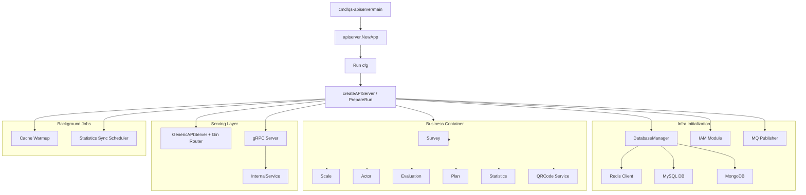

# apiserver

本文档说明 `qs-apiserver` 作为主业务服务是如何启动、装配和对外提供能力的。

## 30 秒了解系统

`qs-apiserver` 是整个系统的主业务进程，负责三类事情：

- 装配业务模块：`survey`、`scale`、`actor`、`evaluation`、`plan`、`statistics`
- 暴露服务接口：后台 REST API、对内 gRPC、供 `worker` 调用的 internal gRPC
- 持有基础设施：MySQL、MongoDB、Redis、IAM、消息发布器、缓存预热、统计同步定时任务

代码入口：

- [cmd/qs-apiserver/apiserver.go](../../cmd/qs-apiserver/apiserver.go)
- [internal/apiserver/app.go](../../internal/apiserver/app.go)
- [internal/apiserver/run.go](../../internal/apiserver/run.go)

## 核心架构

## 核心设计原则

- 主业务集中装配：核心业务模块统一在 `apiserver` 容器里初始化，而不是分散到其他进程。
- HTTP 与 gRPC 双栈并行：REST 面向后台和部分管理能力，gRPC 面向 `collection-server` 与 `worker`。
- 基础设施先于模块：数据库、Redis、IAM、消息发布器先准备好，再初始化容器和服务注册。
- 异步能力内聚在主服务：事件由 `apiserver` 发布，`worker` 再通过 internal gRPC 回调主服务执行后台写操作。

## 职责

`apiserver` 的运行时职责可以概括为：

- 读取配置并初始化日志
- 初始化 MySQL、MongoDB、Redis 和数据库迁移
- 初始化下游背压限制
- 创建消息发布器并决定事件发布模式
- 构建业务容器并注入 IAM、缓存、二维码服务
- 注册 Gin 路由和 gRPC 服务
- 启动 HTTP / HTTPS 与 gRPC 监听
- 启动缓存预热和统计同步后台任务
- 统一处理优雅关闭

关键代码：

- [internal/apiserver/server.go](../../internal/apiserver/server.go)
- [internal/apiserver/database.go](../../internal/apiserver/database.go)
- [internal/apiserver/container/container.go](../../internal/apiserver/container/container.go)

## 启动流程

### 1. 入口与配置

命令入口只做一件事：创建 `App` 并执行 `Run`。

- [cmd/qs-apiserver/apiserver.go](../../cmd/qs-apiserver/apiserver.go)
- [internal/apiserver/app.go](../../internal/apiserver/app.go)
- [internal/apiserver/config/config.go](../../internal/apiserver/config/config.go)
- [internal/apiserver/options/options.go](../../internal/apiserver/options/options.go)

这一层负责：

- 创建默认 `Options`
- 初始化日志
- 将 CLI / 配置文件结果封装成 `config.Config`

### 2. 创建服务骨架

`createAPIServer` 会先创建三个核心运行时对象：

- 优雅关闭管理器
- `GenericAPIServer`
- `DatabaseManager`

代码入口：

- [internal/apiserver/server.go](../../internal/apiserver/server.go)
- [internal/pkg/server/genericapiserver.go](../../internal/pkg/server/genericapiserver.go)

### 3. 准备基础设施

`PrepareRun` 先准备基础设施，再进入业务容器：

1. 初始化数据库连接和迁移
2. 获取 MySQL、MongoDB、Redis 句柄
3. 根据配置启用 MySQL / Mongo / IAM 背压
4. 创建 MQ Publisher 并确定事件发布模式

代码入口：

- [internal/apiserver/database.go](../../internal/apiserver/database.go)
- [internal/pkg/backpressure/limiter.go](../../internal/pkg/backpressure/limiter.go)
- [internal/pkg/eventconfig/config.go](../../internal/pkg/eventconfig/config.go)

### 4. 初始化业务容器

容器初始化顺序是当前运行时设计的核心：

1. 创建带缓存和消息配置的 `Container`
2. 初始化 IAM 模块
3. 初始化业务模块
4. 初始化二维码服务并回注入 Survey / Scale / Evaluation

模块装配入口：

- [internal/apiserver/container/container.go](../../internal/apiserver/container/container.go)
- [internal/apiserver/container/assembler/survey.go](../../internal/apiserver/container/assembler/survey.go)
- [internal/apiserver/container/assembler/scale.go](../../internal/apiserver/container/assembler/scale.go)
- [internal/apiserver/container/assembler/actor.go](../../internal/apiserver/container/assembler/actor.go)
- [internal/apiserver/container/assembler/evaluation.go](../../internal/apiserver/container/assembler/evaluation.go)
- [internal/apiserver/container/assembler/plan.go](../../internal/apiserver/container/assembler/plan.go)
- [internal/apiserver/container/assembler/statistics.go](../../internal/apiserver/container/assembler/statistics.go)

### 5. 注册 HTTP 与 gRPC

准备阶段完成后，`apiserver` 会注册两套对外能力：

- Gin 路由
- gRPC 服务

HTTP 相关：

- [internal/apiserver/routers.go](../../internal/apiserver/routers.go)
- [internal/pkg/server/genericapiserver.go](../../internal/pkg/server/genericapiserver.go)

gRPC 相关：

- [internal/apiserver/grpc_registry.go](../../internal/apiserver/grpc_registry.go)
- [internal/pkg/grpc/server.go](../../internal/pkg/grpc/server.go)
- [internal/pkg/grpc/config.go](../../internal/pkg/grpc/config.go)

当前注册的 gRPC 服务包括：

- AnswerSheetService
- QuestionnaireService
- ActorService
- EvaluationService
- ScaleService
- InternalService

其中 `InternalService` 是 `worker` 和后台任务最关键的回调入口。

## 对外接口面

### HTTP / HTTPS

`GenericAPIServer` 负责：

- 基础中间件安装
- `/healthz`、`/version`、指标、`pprof`
- 同时启动 HTTP 和 HTTPS 监听

业务路由由 [internal/apiserver/routers.go](../../internal/apiserver/routers.go) 注册，主要分为：

- 公开路由
- IAM 保护路由
- 各业务模块路由

### gRPC

gRPC 服务器负责：

- 对 `collection-server` 暴露读写服务
- 对 `worker` 暴露 `InternalService`
- 支持 TLS / mTLS / 认证 / ACL / 审计等能力开关

## 后台任务

`apiserver` 不是纯请求响应服务，它还会启动两类后台任务：

- 缓存预热：容器初始化完成后异步执行
- 统计同步调度：按配置周期将 Redis 统计结果落回 MySQL

代码入口：

- [internal/apiserver/container/container.go](../../internal/apiserver/container/container.go)
- [internal/apiserver/server.go](../../internal/apiserver/server.go)
- [internal/apiserver/application/statistics/sync_service.go](../../internal/apiserver/application/statistics/sync_service.go)

## 关键配置项

`apiserver` 当前最值得关注的配置分组：

- `server`：通用服务模式、中间件、健康检查
- `secure` / `insecure`：HTTP / HTTPS 监听
- `grpc`：gRPC 地址、TLS、mTLS、认证、ACL、反射
- `mysql` / `mongodb` / `redis`：存储连接
- `messaging`：事件发布器
- `iam`：IAM SDK 与认证能力
- `cache`：缓存禁用、TTL、预热和命名空间
- `backpressure`：MySQL / Mongo / IAM 的背压限制
- `statistics_sync`：统计同步调度器

代码入口：

- [internal/apiserver/options/options.go](../../internal/apiserver/options/options.go)

## 边界与注意事项

- `apiserver` 是主业务服务，但不是所有流量都直接打到它；前台收集链路仍然优先经过 `collection-server`。
- `worker` 的很多后台处理最终仍通过 `InternalService` 回调 `apiserver`，因此主业务状态一致性仍在这里收口。
- 当前运行时里缓存预热和统计同步都在 `apiserver` 进程内完成，不是独立任务服务。
- 如果 Redis 或 MQ 不可用，部分能力会降级，但降级边界需要结合具体配置和日志判断。
