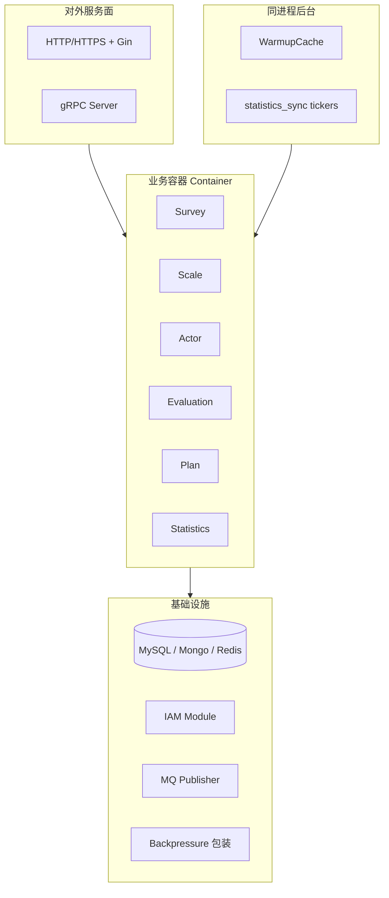
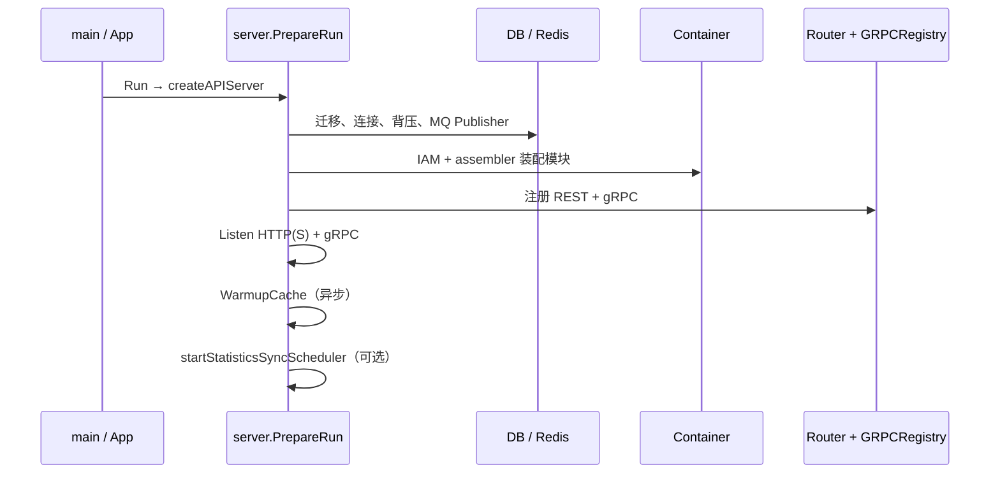

# apiserver（qs-apiserver）

**本文回答**：这篇文档解释 `qs-apiserver` 在运行时到底承担什么角色、内部由哪些组件构成、启动与关闭时序怎样、事件从哪里发布、以及它与 `collection-server` / `qs-worker` / 基础设施如何协作；本文先给结论和速查，再展开内部结构与代码入口。

## 30 秒结论

如果只看一屏，先看下面这张表：

| 维度 | 结论 |
| ---- | ---- |
| 进程角色 | `qs-apiserver` 是主业务进程，持有领域状态与持久化真值，对外提供后台 REST 和 gRPC Server |
| 上下游关系 | 上游包括后台客户端、`collection-server`、`qs-worker`；下游包括 MySQL、MongoDB、Redis、IAM 和 MQ |
| 最重要的运行时认识 | 同步请求和异步回调最终都收口到本进程执行业务写；worker 不是第二套主业务容器 |
| 异步边界 | 事件由本进程发布，长耗时后续由 worker 消费后再通过 gRPC 回调本进程完成 |
| 同进程后台 | 缓存预热、统计同步 ticker 等后台任务在本进程内运行，但不改变“主状态收口”的事实 |
| 排障入口 | 先看 `server.go` 的装配与 `PrepareRun`，再看 `container/assembler` 和 Router / GRPCRegistry |

## 重点速查（继续往下读前先记这几条）

1. **主状态只在这里收口**：无论入口来自后台 REST、collection 的 gRPC，还是 worker 的 internal 回调，真正的业务写和持久化都在 `qs-apiserver`。  
2. **HTTP 与 gRPC 共用同一套业务实现**：它们共享 container 和 application/domain 层，不是两套并行逻辑。  
3. **异步不是旁路系统**：事件由本进程发布，worker 只是把事件再驱动回本进程执行内部动作。  
4. **排障顺序**：先看启动装配、依赖初始化和 Router / gRPC 注册，再看具体模块 assembler 与 infra。  

**组件定位**：主业务进程，**领域状态与持久化**的权威所在；对外提供 **后台 REST** 与 **gRPC Server**；向 **MQ 发布**领域事件；被 **collection-server**、**qs-worker** 通过 gRPC 调用。  
领域细节见 [02-业务模块](../02-业务模块/)；契约与端口见 [04-接口与运维](../04-接口与运维/)。

---

## 这个进程在整体里承担什么

先回答角色、上下游和异步边界，再看内部结构图。

| 维度 | 说明 |
| ---- | ---- |
| **角色** | 主服务：装配 survey / scale / actor / evaluation / plan / statistics 等，执行业务写与复杂读 |
| **上游** | 客户端（REST）、**collection**（gRPC）、**worker**（gRPC） |
| **下游** | MySQL、MongoDB、Redis、IAM SDK、MQ Broker |
| **异步边界** | 发布事件由本进程完成；**长耗时后续步骤**由 worker 消费后再 **gRPC 回调** 本进程（见 [04-进程间通信](./04-进程间通信.md)） |

---

### 内部运行示意图

**关键点**：**基础设施与背压**先于 **assembler 模块**；**HTTP 与 gRPC 共用**同一业务实现，而非两套逻辑。

---

## 它是怎么启动和关闭的

### 启动与时序（`PrepareRun` 示意）

**Verify**：真实顺序与条件分支以 [internal/apiserver/server.go](../../internal/apiserver/server.go) 为准。

---

### 优雅关闭（gRPC、HTTP、DB、统计 ticker、容器）

进程使用 `component-base` 的 **`GracefulShutdown`**（POSIX 信号）。**主关闭回调**在 [server.go `PrepareRun`](../../internal/apiserver/server.go) 末尾注册，**大致顺序**为：

1. **`container.Cleanup()`**：IAM、各业务 **module.Cleanup()** 等（见 [container.go `Cleanup`](../../internal/apiserver/container/container.go)）。  
2. **`dbManager.Close()`**：MySQL / Mongo / Redis 等连接。  
3. **`genericAPIServer.Close()`**：HTTP(S)。  
4. **`grpcServer.Close()`**：gRPC **GracefulStop**（见 [internal/pkg/grpc/server.go](../../internal/pkg/grpc/server.go)）。

**统计同步 ticker**：`startStatisticsSyncScheduler` 内为三轮 `SyncDaily/Accumulated/Plan` **单独注册**一条 `ShutdownCallback`，仅对 ticker 使用的 **context 调用 `cancel()`**，使 goroutine 在 `select` 上退出。**与主回调同属** `GracefulShutdown`；若关心「cancel 与关库的先后」，以 **回调注册顺序** 与 **`github.com/FangcunMount/component-base/pkg/shutdown` 的实际 invocation 顺序**为准（排障时可打日志核对）。

**QS 业务事件 Publisher**：底层 **`messaging.Publisher`** 由 `PrepareRun` 中 `MessagingOptions.NewPublisher()` 创建并注入 **Container** → **`eventconfig.NewRoutingPublisher`**（[container `initEventPublisher`](../../internal/apiserver/container/container.go)）。这里的 `messaging.*` 只服务 **QS 业务事件总线**。**显式 Close** 是否在 `Cleanup` 链中完成，以实现为准；线上通常以 **进程退出** 回收连接。

**IAM 授权版本同步**：与业务事件总线分离，`apiserver` 通过 **`iam.authz-sync.*`** 创建独立订阅者，消费 **`iam.authz.version`** 控制面主题以推进本地授权快照失效，见 [server.go `startAuthzVersionSync`](../../internal/apiserver/server.go) 与 [version_sync.go](../../internal/pkg/iamauth/version_sync.go)。

---

## 领域事件从哪里发布

这一节只回答“本进程里谁在发事件、发布点落在哪”；Topic 映射和 worker 消费机制回看 [03-事件系统](../03-基础设施/01-事件系统.md)。

**配置与 Topic 映射**仍以 [`configs/events.yaml`](../../configs/events.yaml) 与 [03-事件系统](../03-基础设施/01-事件系统.md) 为 **Verify**；**本进程内谁在发**集中在 **应用服务 / 流水线**，经 **`Container.GetEventPublisher()`** 注入的 **`event.EventPublisher`**（内部多为 [RoutingPublisher](../../internal/pkg/eventconfig/publisher.go)）调用 **`Publish`**。

| 领域 / 场景 | 典型行为 | 代码锚点（示例） |
| ----------- | -------- | ---------------- |
| **答卷** | 聚合根 `Events()` 在提交成功后批量发布 | [survey/answersheet `submission_service.publishEvents`](../../internal/apiserver/application/survey/answersheet/submission_service.go) |
| **问卷** | 生命周期操作后发布 `questionnaire.changed` | [questionnaire `lifecycle_service.publishEvents`](../../internal/apiserver/application/survey/questionnaire/lifecycle_service.go) |
| **量表** | 生命周期操作后发布 `scale.changed`；更新与因子变更也会主动发 `action=updated` | [scale `lifecycle_service.publishEvents`](../../internal/apiserver/application/scale/lifecycle_service.go)、[factor_service `publishScaleUpdated`](../../internal/apiserver/application/scale/factor_service.go) |
| **测评** | `Create` 只建 `pending`；`Submit` / `Retry` 发布 `assessment.submitted`；评估失败发布 `assessment.failed`；评估流水线尾部发 **interpreted / report.generated** | [evaluation/assessment `submission_service.publishEvents`](../../internal/apiserver/application/evaluation/assessment/submission_service.go)、[management_service `Retry`](../../internal/apiserver/application/evaluation/assessment/management_service.go)、[engine/service.go](../../internal/apiserver/application/evaluation/engine/service.go)、[engine/pipeline `EventPublishHandler`](../../internal/apiserver/application/evaluation/engine/pipeline/event_publish.go) |
| **计划** | 不再发布计划级生命周期事件；仅任务开放/完成/过期/取消路径发布 `task.*` | [`task_management_service`](../../internal/apiserver/application/plan/task_management_service.go)、[`task_scheduler_service`](../../internal/apiserver/application/plan/task_scheduler_service.go)、[plan `lifecycle_service`](../../internal/apiserver/application/plan/lifecycle_service.go) |

**关键点**：多数路径在 **持久化成功之后** 再发事件；部分实现注明 **发布失败不阻塞主流程**（以各 `Publish` 调用处错误处理为准）。

---

## 它和其它组件怎么交互

### 多实例与 MQ / worker 的并发语义（边界说明）

- **多 apiserver 实例**：各自独立 **Publish**；同一业务事件是否重复取决于 **上游是否重复提交** 与 **应用层是否重复调用 Publish**，而非 MQ 本身为 apiserver 去重。  
- **多 worker 实例**：对 **同一 Topic** 的消费语义由 **NSQ / RabbitMQ 等** 决定（竞争消费、是否 at-least-once 等）；本仓库 **不在应用层统一封装**「全局恰好一次」。  
- **幂等与乱序**：重复消息、乱序投递的防护依赖 **handler 幂等设计、DB 唯一约束、业务版本** 等，属 **02 / 各 handler** 与运维配置范畴，**不在本文展开**。

### 与其它组件的交互

| 对方 | 方式 | 说明 |
| ---- | ---- | ---- |
| **collection-server** | gRPC（被调） | 前台 BFF 转调 |
| **worker** | gRPC（被调） | Internal / AnswerSheet / Evaluation 等 |
| **MQ** | 出站 Publish | 不直接消费 |
| **Client（后台）** | REST | 管理、Crontab |
| **IAM** | SDK | 验签、身份、服务间 token 等 |

## 排障时先看什么

### 核心功能与关键点

| 功能 | 关键点 | 代码锚点 |
| ---- | ------ | -------- |
| **配置加载** | `Options` → `config.Config`，与 `configs/*.yaml` 绑定 | [options/options.go](../../internal/apiserver/options/options.go) |
| **存储接入** | 迁移、连接池、**背压** 包在适配层 | [database.go](../../internal/apiserver/database.go)、[backpressure](../../internal/pkg/backpressure/limiter.go) |
| **模块装配** | 按 assembler 注入各 BC | [container/assembler/](../../internal/apiserver/container/assembler/) |
| **REST** | 后台路由、运维接口 | [routers.go](../../internal/apiserver/routers.go) |
| **gRPC** | 六类服务注册；模块 nil 则跳过 | [grpc_registry.go](../../internal/apiserver/grpc_registry.go) |
| **发事件** | 应用层见上文“领域事件从哪里发布”；Topic/handler 与 [events.yaml](../../configs/events.yaml) 对齐 | [03-事件系统](../03-基础设施/01-事件系统.md) |
| **缓存预热** | 启动后异步 | [container.go WarmupCache](../../internal/apiserver/container/container.go) |
| **统计落库 ticker** | 与 Crontab 可能叠加；关闭见上文“优雅关闭” | [server.go](../../internal/apiserver/server.go)、[04-调度](../04-接口与运维/04-调度与后台任务.md) |

### 关键代码入口（索引）

| 关注点 | 路径 |
| ------ | ---- |
| 进程入口 | [cmd/qs-apiserver/apiserver.go](../../cmd/qs-apiserver/apiserver.go)、[app.go](../../internal/apiserver/app.go)、[run.go](../../internal/apiserver/run.go) |
| 通用 HTTP 栈 | [genericapiserver.go](../../internal/pkg/server/genericapiserver.go) |

## 边界与注意事项

- **前台流量**大量经 **collection**，勿假设所有请求直达 apiserver。  
- **worker 回写**仍经本进程，**领域一致性**以本进程存储为准。  
- **Redis/MQ 降级**行为随配置与代码分支变化，以日志与配置为准。

---

*说明：具体写作习惯仍可对照 [CONTRIBUTING-DOCS.md](../CONTRIBUTING-DOCS.md)；本篇按「运行时组件」体裁组织。*
