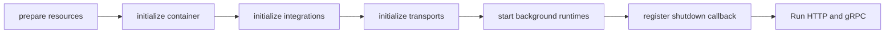

# qs-apiserver 启动与组合根

## 1. 结论

`qs-apiserver` 是 qs-server 的业务组合根。它在一个进程内装配基础设施、领域模块、REST/gRPC transport、可靠事件子系统和五类后台调度器，再同时启动 HTTP 与 gRPC 服务。

启动代码采用显式构造函数、阶段式 Runner 和手工装配。当前没有使用 Wire、Fx 等依赖注入框架；这是代码自然演进形成的实现方式，其实际优点是依赖路径可直接追踪，但不应被包装成项目初期刻意制定的框架决策。

## 2. 从入口到运行

入口为 `cmd/qs-apiserver/apiserver.go`。进程创建配置与 app 后进入 `internal/apiserver/process`，由 `processruntime.Runner` 依次执行六个阶段：

任何阶段返回错误，PrepareRun 都会记录失败阶段并终止启动，不会让一个依赖不完整的 apiserver 对外提供服务。

## 3. 六个启动阶段

### 3.1 prepare resources

资源阶段创建后续装配需要的共享能力，主要包括：

- MySQL、MongoDB、Redis 的连接与 profile 管理；
- Redis runtime、缓存子系统和 keyspace；
- 限流、背压、租约等 resilience 能力；
- MQ publisher 和事件目录；
- 传给业务容器的基础设施 options。

这一阶段只建立进程级资源，不应在这里写具体业务规则。连接配置以当前环境 YAML 和 options 为准，文档不固化端口、池大小等易变数值。

### 3.2 initialize container

容器阶段创建 `internal/apiserver/container.Container` 并装配业务模块。当前核心装配收敛在 `internal/apiserver/container/modules`，包括 Survey、Actor、ModelCatalog、Evaluation、Interpretation、Plan、Statistics 等模块及其 application/domain/infra 依赖。

容器承担的是“把实现连接起来”，不是“成为万能 Service Locator”。阅读某个模块时应从模块导出的 service/port 追踪，而不是让业务代码反向依赖整个 Container。

### 3.3 initialize integrations

integration 阶段初始化不是 HTTP/gRPC transport 本身、但需要独立生命周期的集成能力。当前重要实例是 IAM `authz_version` 订阅器：当 IAM 权限版本变化时，它使本进程的授权快照缓存及时失效。

这类订阅器属于运行时一致性设施，不拥有 Actor 或 IAM 的业务事实。

### 3.4 initialize transports

transport 阶段完成两套入口：

- REST Router：面向运营后台和外部医疗业务系统；
- gRPC Registry：面向 collection-server 与 qs-worker 的内部调用。

gRPC 服务按依赖是否完整进行注册。某个模块没有成功装配时，对应服务可能被跳过；因此“proto 中存在 service”不等于“当前进程一定注册成功”。启动日志和 registry 测试才是实际暴露能力的直接证据。

### 3.5 start background runtimes

后台运行时按以下顺序启动：

1. 事件子系统；
2. 缓存 signal watcher 与启动预热；
3. scheduler manager。

事件子系统启动失败会阻止后续 scheduler 启动。这是合理的失败关闭：业务调度可能产生新事实和事件，不能在可靠事件基础设施没有准备好时继续推进。

当前 scheduler manager 最多装配五个 runner：

- `PlanRunner`：按 Plan 周期创建或更新待执行 Task；
- `StatisticsSyncRunner`：按机构执行唯一 publish Run，编排 Collector、Projection、SyncRun、Cache Generation 与预热；
- `BehaviorPendingReconcileRunner`：补偿未完成的行为事件归因；
- `EvaluationConsistencyReconcileRunner`：审计并修复评分/报告跨存储终态漂移；
- `BehaviorJourneyScanRunner`：从事实表扫描并投影行为旅程统计。

runner 是否真正存在取决于 enable 开关、必要 service、org_ids、Redis 分布式锁和配置合法性。

### 3.6 register shutdown callback

最后把 transport、容器、数据库、IAM 同步器和 runtime lifecycle 汇总成 shutdown callback。注册完成后才构造可运行的 prepared server。

## 4. HTTP 与 gRPC 如何同时运行

进入 `preparedServer.Run()` 后：

1. 先启动 shutdown manager；
2. 再通过 `processruntime.RunGroup` 同时运行 HTTP 和 gRPC；
3. 任一服务返回错误，RunGroup 将错误返回给进程入口。

REST 和 gRPC 共用同一个业务容器，所以两套 transport 最终调用的是同一批 application service，而不是两份业务实现。

## 5. 组合根中的关键边界

### 5.1 模块导出能力，而不是导出数据库

collection、worker 和 REST handler 应依赖 application service 或窄化 port。基础设施 repository 在模块内部完成装配，不应作为跨进程接口暴露。

### 5.2 跨模块编排有明确位置

例如 `AssessmentIntakeService` 的 gRPC 注册不是简单把一个 repository 暴露出去，而是在组合根构造 assessment intake journey，将答卷计分、模型绑定、Plan Task 解析、Evaluation intake 和报告状态连接起来。

这类 journey 适合放在 application/组合边界，因为它协调多个模块，但不应把每个模块内部规则重新实现一遍。

### 5.3 后台任务复用应用服务

scheduler、Outbox consumer 和 gRPC handler 即使没有用户 HTTP 请求，也必须通过相同 application/domain 边界修改业务事实。后台入口不是绕开领域规则的后门。

## 6. 启动失败与降级语义

| 情况 | 当前处理方向 |
| --- | --- |
| 核心数据库、容器或 transport 初始化失败 | 启动失败，不对外服务 |
| 事件子系统启动失败 | 启动阶段失败，scheduler 不启动 |
| 某个 scheduler 被禁用或缺少依赖 | 不注册该 runner，记录告警 |
| scheduler 无法获得 Redis leader lock | 本轮跳过，由持锁实例执行 |
| IAM authz sync 未装配 | 核心服务可启动，但授权缓存失效时效下降，需要日志/监控暴露 |

“能跳过”不等于“无风险”。是否允许缺少某项能力继续启动，应根据它属于核心正确性依赖还是增强型运行能力来判断。

## 7. 当前关闭顺序的已知不足

当前 apiserver shutdown callback 的实际顺序是：

1. runtime hooks（当前主要是停止 scheduler）；
2. Container Cleanup；
3. 停止 IAM authz sync；
4. 关闭数据库；
5. 关闭 HTTP；
6. 关闭 gRPC。

这与更安全的“先停止入口并排空在途请求，再释放下游依赖”顺序不一致。本文记录的是当前源码事实，不把它描述成理想实现。详细风险和建议见[优雅关闭与资源释放](./07-优雅关闭与资源释放.md)。

## 8. 阅读和验证路径

建议按下列路径追踪：

1. `cmd/qs-apiserver/apiserver.go`；
2. `internal/apiserver/process/runner.go`；
3. `internal/apiserver/process/resource.go`、`container.go`、`integration.go`、`transport.go`、`runtime.go`；
4. `internal/apiserver/container` 与 `container/modules`；
5. `internal/apiserver/transport/rest`、`transport/grpc`；
6. `internal/apiserver/eventing/subsystem`；
7. `internal/apiserver/runtime/scheduler`；
8. `internal/apiserver/process/lifecycle.go`。

定向验证优先运行 `internal/apiserver/process`、模块 registry/wiring、gRPC registry、event subsystem 和 scheduler 测试。
