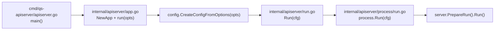
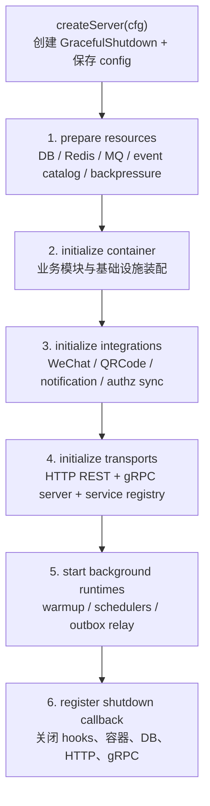
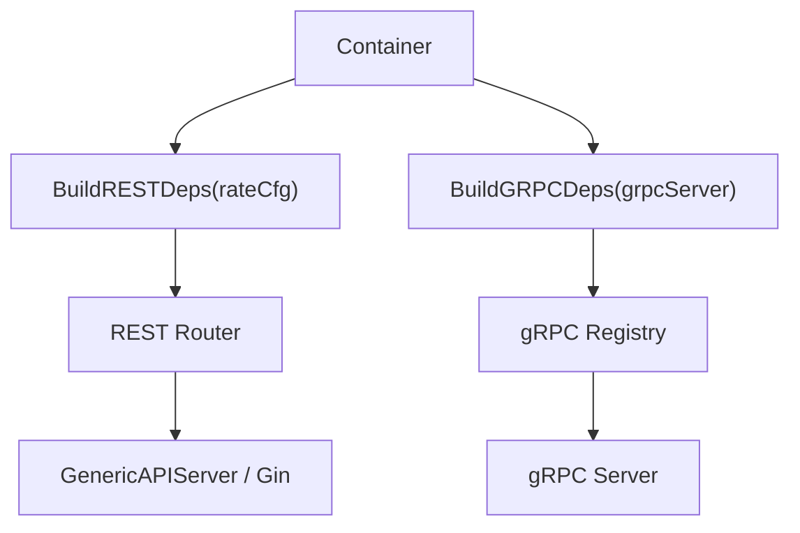
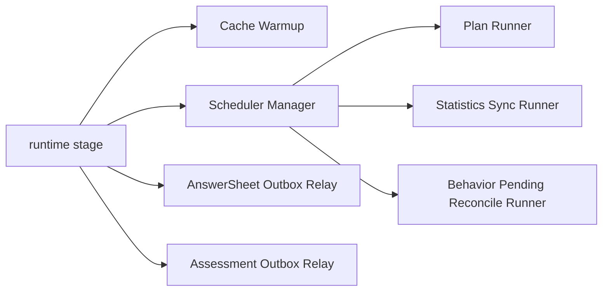

# qs-apiserver 启动与组合根

**本文回答**：`qs-apiserver` 这个主进程从 `main()` 到真正对外提供 REST/gRPC 服务，中间经过哪些启动阶段；哪些资源在 process 层准备，哪些业务模块在 container 层装配，REST/gRPC 和后台 runtime 又如何接入；以及维护时应该把问题定位到 `process`、`container`、`transport` 还是具体业务模块。

---

## 30 秒结论

| 维度 | 当前事实 |
| ---- | -------- |
| 进程定位 | `qs-apiserver` 是 qs-server 的主业务组合根：权威写模型、领域模块、REST/gRPC、事件发布、outbox relay、调度和缓存预热都在这里收口 |
| 入口路径 | `cmd/qs-apiserver/apiserver.go -> internal/apiserver/app.go -> internal/apiserver/run.go -> internal/apiserver/process/run.go` |
| 启动骨架 | `PrepareRun` 分阶段执行：资源准备、容器初始化、外部集成、传输层初始化、后台 runtime、shutdown callback |
| 组合根职责 | `process` 负责启动编排和生命周期，`container` 负责把业务模块和基础设施接成可运行图 |
| 业务模块 | `Survey / Scale / Actor / Evaluation / Plan / Statistics / IAM / Codes / QRCode / Notification` 等通过 `Container` 装配 |
| 对外接口 | REST 由 `resttransport.NewRouter(...).RegisterRoutes(...)` 注册；gRPC 由 `grpctransport.NewRegistry(...).RegisterServices()` 注册 |
| 后台 runtime | cache warmup、Plan 调度、Statistics 同步、Behavior pending reconcile、answersheet/assessment outbox relay 在 runtime stage 启动 |
| 关键边界 | 业务状态仍由 apiserver 内的 application/domain/infra 承担；worker 只通过 internal gRPC 驱动 apiserver，不是第二写模型 |

一句话概括：**`qs-apiserver` 的启动过程不是“启动一个 HTTP 服务”，而是先把资源、模块、接口、调度、事件和关闭逻辑接成一个有生命周期的运行时图。**

---

## 1. 从 main 到 Run：入口链路

`cmd/qs-apiserver/apiserver.go` 只做一件事：创建并运行 apiserver app。真正的启动逻辑在 `internal/apiserver/app.go` 和 `internal/apiserver/process/*`。



### 入口层只做启动，不做业务

入口层的职责是：

1. 加载运行选项；
2. 初始化日志；
3. 从 options 创建 `config.Config`；
4. 交给 `process.Run(cfg)`。

它不应该创建业务 service，也不应该知道 `survey / scale / evaluation` 的装配细节。业务装配应该留在 `container`。

### `process.Run` 的语义

`internal/apiserver/process/run.go` 的结构很短：

```text
createServer(cfg)
  -> server.PrepareRun()
  -> preparedServer.Run()
```

这说明 apiserver 被拆成两个阶段：

| 阶段 | 目的 |
| ---- | ---- |
| `PrepareRun` | 准备资源、容器、接口、后台 runtime 和关闭回调 |
| `Run` | 真正启动 HTTP/gRPC 服务，并等待进程生命周期结束 |

这个拆法很重要：**启动失败要尽量发生在 PrepareRun 阶段，而不是服务已对外监听后才暴露。**

---

## 2. PrepareRun 六阶段

`PrepareRun` 使用 `processruntime.Runner` 串行执行固定 stage。当前 apiserver 的 stage 顺序是：

```text
prepare resources
  -> initialize container
  -> initialize integrations
  -> initialize transports
  -> start background runtimes
  -> register shutdown callback
```



### 阶段 1：prepare resources

资源阶段解决“这个进程运行需要哪些外部资源和横切 runtime”：

| 资源 | 作用 | 主要落点 |
| ---- | ---- | -------- |
| `DatabaseManager` | 初始化并持有 MySQL、Mongo、Redis 连接 | `internal/apiserver/bootstrap` |
| MySQL | 主写模型、部分 outbox、read model | `gorm.DB` |
| MongoDB | 答卷、报告、文档模型、部分 outbox | `mongo.Database` |
| Redis runtime | cache family、lock lease、缓存预热等 | `cacheplane/bootstrap` |
| MQ publisher | 事件出站发布；不可用时按模式降级 | `component-base/pkg/messaging` |
| Event catalog | 加载 `configs/events.yaml`，给事件路由和状态服务使用 | `eventcatalog` |
| Backpressure | 对 MySQL、Mongo、IAM 等下游依赖做并发保护 | `backpressure.Limiter` |
| ContainerOptions | 把 MQ、event catalog、cache、backpressure、Plan URL、统计修复窗口传给 container | `buildContainerOptions` |

资源阶段的关键设计是：**外部连接和横切 runtime 在 process 层准备，业务模块只拿到可用的抽象依赖，不自己读全局配置。**

### 阶段 2：initialize container

container 阶段解决“业务模块如何被接成一个完整服务端”。

`Container` 持有：

| 类型 | 内容 |
| ---- | ---- |
| 基础设施句柄 | MySQL、Mongo、Redis、cache subsystem、backpressure、MQ publisher |
| 事件能力 | `eventPublisher`、`eventCatalog`、`publisherMode` |
| 业务模块 | `SurveyModule`、`ScaleModule`、`ActorModule`、`EvaluationModule`、`PlanModule`、`StatisticsModule` |
| 安全模块 | `IAMModule` |
| 外部集成 | QRCode、WeChat mini program sender、object storage、notification service |
| 运行状态 | initialized、silent、module registry、module order |

container 初始化顺序大致是：

```text
initEventPublisher
  -> initSurveyModule
  -> initScaleModule
  -> initActorModule
  -> initEvaluationModule
  -> initPlanModule
  -> initStatisticsModule
  -> initWarmupCoordinator
  -> postWire markers
  -> initCodesService
  -> initQRCodeGenerator
```


注意这里不是“随便 new 一堆 service”。顺序有业务和依赖含义：

- `Survey` 和 `Scale` 是主业务前置域；
- `Actor` 是身份/受试者/操作者等上下文；
- `Evaluation` 依赖采集事实和量表规则；
- `Plan` 会和 Actor / Evaluation / Survey 交互；
- `Statistics` 是读侧聚合和同步能力；
- `WarmupCoordinator` 依赖缓存和部分读侧能力。

### 阶段 3：initialize integrations

integration stage 不再创建业务模块，而是接入外部集成能力：

| 集成 | 说明 |
| ---- | ---- |
| WeChat QRCode | 初始化小程序码相关服务 |
| 小程序订阅消息 | 初始化任务通知发送服务 |
| Authz version sync | 如果 IAM authz sync 开启，订阅 IAM 权限版本变更并刷新本地 authz snapshot |

这一步放在 container 初始化之后，是因为它需要已经成型的 `Container` 和 `IAMModule`。

### 阶段 4：initialize transports

transport stage 解决“怎么把容器里的业务能力暴露给 HTTP/gRPC”。



#### REST 注册

REST 侧通过：

```text
resttransport.NewRouter(container.BuildRESTDeps(rateCfg)).RegisterRoutes(httpServer.Engine)
```

`BuildRESTDeps` 从 container 中抽取 handler 需要的 application service，例如：

- Survey：Questionnaire lifecycle/query、AnswerSheet submission/management；
- Scale：Lifecycle、Factor、Query、Category；
- Actor：Testee、Operator、Clinician、AssessmentEntry；
- Evaluation：Management、Evaluation、ProtectedQuery；
- Plan：Command、Query；
- Statistics：System、Questionnaire、Testee、Plan、Read、Sync；
- IAM：TokenVerifier、AuthzSnapshotLoader 等。

#### gRPC 注册

gRPC 侧通过：

```text
grpctransport.NewRegistry(container.BuildGRPCDeps(grpcServer)).RegisterServices()
```

`BuildGRPCDeps` 给 gRPC service registry 提供：

- AnswerSheet submission/management/scoring；
- Questionnaire query；
- Testee / Operator / Clinician 相关服务；
- Evaluation submission/management/report/score/evaluate；
- Scale query/category；
- Plan command；
- Behavior projector；
- QRCode 与 Task notification；
- IAM AuthzSnapshotLoader。

这里体现了一个很重要的边界：**transport 不直接 new 业务 service，只从 container 拿 deps；container 不直接注册路由，只暴露 deps。**

### 阶段 5：start background runtimes

runtime stage 解决“服务对外监听之外，还有哪些后台机制需要启动”。

当前 apiserver runtime 包括：

| runtime | 触发条件 | 作用 |
| ---- | ---- | ---- |
| cache warmup | container 存在 | 异步预热缓存 |
| Plan scheduler | 配置开启且 runner 存在 | 扫描并开放/推进计划任务 |
| Statistics sync | 配置开启且 runner 存在 | 定时同步统计聚合与缓存 |
| Behavior pending reconcile | 配置开启且 runner 存在 | 重放/修复 pending 行为投影 |
| AnswerSheet submitted outbox relay | MQ publisher 存在且 relay 依赖存在 | 补发 Mongo answersheet outbox |
| Assessment outbox relay | MQ publisher 存在且 relay 依赖存在 | 补发 assessment/report 相关 outbox |



这也是为什么 apiserver 是主运行时中心：**它不只是响应请求，也负责把缓存、调度和 durable outbox 的后台推进运行起来。**

### 阶段 6：register shutdown callback

shutdown stage 解决“进程收到退出信号时，如何按顺序释放资源”。

关闭逻辑包括：

1. 运行 runtime shutdown hooks，例如停止 scheduler 和 relay loop；
2. cleanup container；
3. 停止 IAM authz version subscriber；
4. 关闭数据库连接；
5. 关闭 HTTP server；
6. 关闭 gRPC server。

这一阶段不是附属细节。对于有 outbox relay、scheduler、Redis lock、gRPC listener 的服务来说，关闭顺序会影响事件投递、锁释放和端口回收。

---

## 3. process 与 container 的边界

### process 层负责“什么时候做”

`internal/apiserver/process` 负责：

| 职责 | 说明 |
| ---- | ---- |
| 启动阶段编排 | 固定 PrepareRun stage 顺序 |
| 资源准备 | DB、Redis、MQ、event catalog、backpressure |
| 配置映射 | options/config 到 container/runtime deps |
| 传输层启动 | HTTP/gRPC server build/register/run |
| 后台 runtime | scheduler、warmup、outbox relay |
| 生命周期 | shutdown hooks 和资源释放 |

process 可以知道很多基础设施细节，因为它就是组合根的“运行时编排层”。

### container 层负责“谁依赖谁”

`internal/apiserver/container` 负责：

| 职责 | 说明 |
| ---- | ---- |
| 模块初始化 | Survey、Scale、Actor、Evaluation、Plan、Statistics |
| 依赖注入 | 为模块注入 repository、cache、event publisher、IAM 等 |
| REST/gRPC deps 暴露 | `BuildRESTDeps`、`BuildGRPCDeps` |
| 跨模块后置连接 | `moduleGraph` 作为显式后置阶段标记 |
| 集成服务持有 | QRCode、Notification、ObjectStorage 等 |

container 不应该关心进程信号、端口监听、Makefile、命令行参数。

### application/domain 不应该反向依赖 process/container

这是维护边界：

```text
process -> container -> application -> domain
process -> infra
container -> infra / application
transport -> application deps
domain 不依赖 process/container/transport/infra
```

如果发现 domain 或 application 开始 import `process`、`container` 或 Gin/gRPC runtime，大概率是边界错误。

---

## 4. ContainerOptions 是配置进入业务图的闸口

`buildContainerOptions` 把 process 阶段准备好的横切能力传给 container：

| 字段 | 来源 | 用途 |
| ---- | ---- | ---- |
| `MQPublisher` | messaging options | event publisher 出站 |
| `PublisherMode` | env / messaging 状态 | logging / MQ 等发布模式 |
| `EventCatalog` | `configs/events.yaml` | 事件路由与状态 |
| `Cache` | apiserver cache config | TTL、压缩、singleflight、warmup |
| `CacheSubsystem` | Redis runtime | 缓存族和 runtime 句柄 |
| `Backpressure` | backpressure config | MySQL、Mongo、IAM 依赖保护 |
| `PlanEntryBaseURL` | plan config | 任务入口 URL |
| `StatisticsRepairWindowDays` | statistics sync config | 统计修复窗口 |

这一步是非常重要的配置边界：**配置不要散落到业务服务里自己读；应该在 process/config 层收口，再通过 options 进入 container。**

---

## 5. moduleGraph 的真实定位

`moduleGraph` 不是一个“万能依赖注入框架”。源码注释已经说明：

> Constructor dependencies remain the preferred path.

它存在的意义是：

1. 标记少量后置连接阶段；
2. 避免初始化顺序或可选基础设施迫使模块构造函数形成循环；
3. 让不得不后置的 cross-module wiring 有明确位置。

当前 `postWireCacheGovernanceDependencies`、`postWireProtectedScopeDependencies`、`postWireQRCodeService` 都更像显式 phase marker，而不是大量实际逻辑。这是好事：说明模块依赖优先通过 constructor deps 收口，而不是到处 setter。

维护原则：

| 场景 | 建议 |
| ---- | ---- |
| 新模块依赖另一个模块的应用服务 | 优先通过 assembler constructor deps |
| 初始化顺序确实无法满足 | 才考虑 moduleGraph 后置连接 |
| 只为方便而 setter 注入 | 不建议 |
| 改动 moduleGraph | 同步更新 runtime composition 文档和架构测试 |

---

## 6. REST/gRPC 与 IAM、安全、authz snapshot

apiserver 同时有 REST 和 gRPC 入站。

### REST 侧

REST server 基于 `GenericAPIServer` 和 Gin engine，`resttransport.NewRouter(...).RegisterRoutes(...)` 注册路由。REST deps 来自 container，因此 handler 不直接 new service。

REST 常见能力：

- JWT / IAM 身份；
- rate limit；
- cache governance / event status / resilience snapshot；
- Survey、Scale、Actor、Evaluation、Plan、Statistics 的应用服务入口。

### gRPC 侧

gRPC server 在 `buildGRPCServer` 中根据配置创建。它会：

1. 应用 bind address、port、TLS/mTLS、message size、connection age 等配置；
2. 注入 SDK `TokenVerifier`；
3. 如果有 authz snapshot loader，则在 JWT 认证之后追加 authz snapshot unary interceptor；
4. 挂载 health check / reflection 等能力；
5. 通过 gRPC registry 注册业务服务。

需要注意：authz snapshot interceptor **不替代 JWT 权威校验**。它更像权限视图和角色投影补充，认证本身仍然依赖 IAM/JWT 验证链。

---

## 7. Outbox relay 与事件发布边界

apiserver 有两类事件发布路径：

| 类型 | 说明 |
| ---- | ---- |
| best effort | 适合问卷/量表生命周期或任务通知类弱一致事件 |
| durable outbox | 适合答卷提交、测评提交、报告生成、行为投影等不能随便丢的事件 |

runtime stage 会在 MQ publisher 存在时启动 outbox relay loop：

```text
AnswerSheetSubmittedRelay.DispatchDue
AssessmentOutboxRelay.DispatchDue
```

它们以固定 interval 扫描 due events 并投递。这说明：

- 保存业务事实和写 outbox 是业务写路径的一部分；
- 真正投递 MQ 可能在后台 relay 中完成；
- worker 是否收到事件，不能只看“业务写库成功”，还要看 outbox 状态和 relay。

排障时应按这个顺序看：

```text
业务是否落库
  -> outbox 是否 staged
  -> relay 是否 running
  -> MQ publisher 是否可用
  -> worker 是否订阅 topic
  -> handler 是否注册
```

---

## 8. 启动失败如何定位

| 失败阶段 | 常见原因 | 首先检查 |
| ---- | ---- | ---- |
| `prepare resources` | MySQL/Mongo/Redis 不可用；events.yaml 加载失败；MQ publisher 创建失败 | `configs/apiserver.*.yaml`、`configs/events.yaml`、基础设施连接 |
| `initialize container` | 模块依赖缺失；IAM module 初始化失败；repository/adapter 构造失败 | `internal/apiserver/container/*`、`assembler/*` |
| `initialize integrations` | WeChat / OSS / notification 配置错误；authz version subscriber 创建失败 | integration config、IAM authz sync |
| `initialize transports` | 端口冲突；TLS/mTLS 证书错误；gRPC auth/ACL 配置错误；路由注册依赖缺失 | server/gRPC config、证书、`BuildRESTDeps`、`BuildGRPCDeps` |
| `start background runtimes` | scheduler 配置错误；lock manager 不可用；relay 依赖缺失 | `runtime_bootstrap.go`、plan/statistics/behavior 配置 |
| `Run` 阶段 | HTTP/gRPC listener 启动失败；运行时服务异常退出 | 端口、进程日志、shutdown hook |

---

## 9. 修改 apiserver 时该改哪里

| 需求 | 首选修改位置 |
| ---- | ------------ |
| 新增 REST API | `transport/rest` handler/router + `container.BuildRESTDeps` |
| 新增 gRPC 方法 | proto + gRPC service + `container.BuildGRPCDeps` + registry |
| 新增业务模块 | `domain/application/infra` + `container/assembler` + `container/root.go` |
| 新增外部资源 | `process/resource_bootstrap.go` + config/options + container options |
| 新增后台调度 | `runtime/scheduler` + `process/runtime_bootstrap.go` |
| 新增 outbox relay | 对应 outbox store/relay + `process/runtime_bootstrap.go` |
| 新增 cache family 或 TTL | cache options + `process/container_options.go` + Redis docs |
| 新增下游背压 | backpressure config + `buildBackpressureOptions` + resilience docs |
| 修改 shutdown 行为 | `process/lifecycle.go` |
| 修改 gRPC 安全链 | `process/transport_bootstrap.go` + `internal/pkg/grpc` |

---

## 10. 常见误区

### 误区一：apiserver 只是 REST 服务

不准确。apiserver 同时提供 REST、gRPC、internal gRPC、事件发布、outbox relay、scheduler、cache warmup 和多模块组合。

### 误区二：worker 负责业务状态

不准确。worker 负责消费事件和调用 internal gRPC；权威写模型仍在 apiserver。

### 误区三：container 是一个全局变量池

不准确。container 是组合根的一部分，负责装配模块和暴露 deps。它不应该变成业务运行时的万能 service locator。

### 误区四：moduleGraph 可以随便做后置注入

不准确。constructor deps 是首选。moduleGraph 只是少量跨模块后置连接的显式阶段。

### 误区五：事件发布就是直接 publish MQ

不完整。durable outbox 事件会先落 outbox，再由 apiserver runtime relay 补发。

---

## 11. 代码锚点

| 主题 | 路径 |
| ---- | ---- |
| 进程入口 | `cmd/qs-apiserver/apiserver.go` |
| App 创建与配置加载 | `internal/apiserver/app.go` |
| Run 转发 | `internal/apiserver/run.go` |
| process 入口 | `internal/apiserver/process/run.go` |
| process server/root 类型 | `internal/apiserver/process/root.go` |
| PrepareRun stage | `internal/apiserver/process/runner.go` |
| 资源准备 | `internal/apiserver/process/resource_bootstrap.go` |
| ContainerOptions 构造 | `internal/apiserver/process/container_options.go` |
| container / integration stage | `internal/apiserver/process/container_bootstrap.go` |
| transport stage | `internal/apiserver/process/transport_bootstrap.go` |
| runtime stage | `internal/apiserver/process/runtime_bootstrap.go` |
| shutdown / Run | `internal/apiserver/process/lifecycle.go` |
| Container 主结构 | `internal/apiserver/container/root.go` |
| moduleGraph | `internal/apiserver/container/module_graph.go` |
| REST/gRPC deps | `internal/apiserver/container/transport_deps.go` |
| gRPC server 基础设施 | `internal/pkg/grpc/server.go` |
| 事件契约 | `configs/events.yaml` |
| dev 配置 | `configs/apiserver.dev.yaml` |

---

## 12. Verify

建议在本地按下面顺序验证：

```bash
# 构建 apiserver
make build-apiserver

# 检查基础设施
make check-infra

# 启动 apiserver
make run-apiserver

# 健康检查
curl -sS http://127.0.0.1:18082/healthz

# 运行 apiserver process / container 相关测试
go test ./internal/apiserver/process/... ./internal/apiserver/container/...

# 文档链接和锚点检查
make docs-hygiene
```

如果只改了文档，至少执行：

```bash
make docs-hygiene
git diff --check
```

---

## 13. 下一跳

| 想继续了解 | 下一篇 |
| ---------- | ------ |
| collection 如何作为 BFF 调用 apiserver | [02-collection-server运行时.md](./02-collection-server运行时.md) |
| worker 如何消费事件并回调 internal gRPC | [03-qs-worker运行时.md](./03-qs-worker运行时.md) |
| 三进程间 gRPC、REST、MQ 怎么配合 | [04-进程间调用与gRPC.md](./04-进程间调用与gRPC.md) |
| IAM 在 apiserver / collection / gRPC 中如何落位 | [05-IAM认证与身份链路.md](./05-IAM认证与身份链路.md) |
| apiserver 调度器与后台任务 | [06-后台任务与调度.md](./06-后台任务与调度.md) |
| shutdown 和资源释放 | [07-优雅关闭与资源释放.md](./07-优雅关闭与资源释放.md) |
| 模块静态设计 | [../02-业务模块/README.md](../02-业务模块/README.md) |
| Event / Outbox 深讲 | [../03-基础设施/event/README.md](../03-基础设施/event/README.md) |
