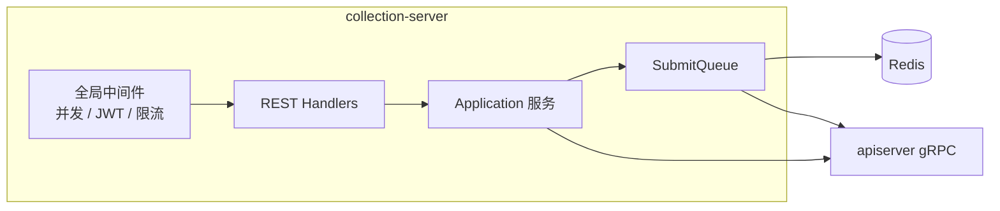
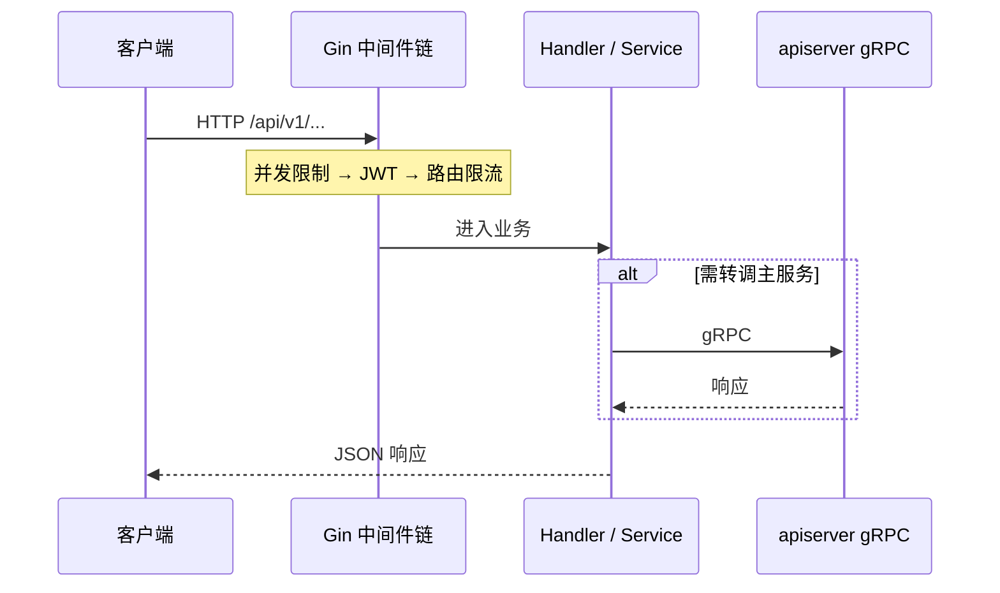
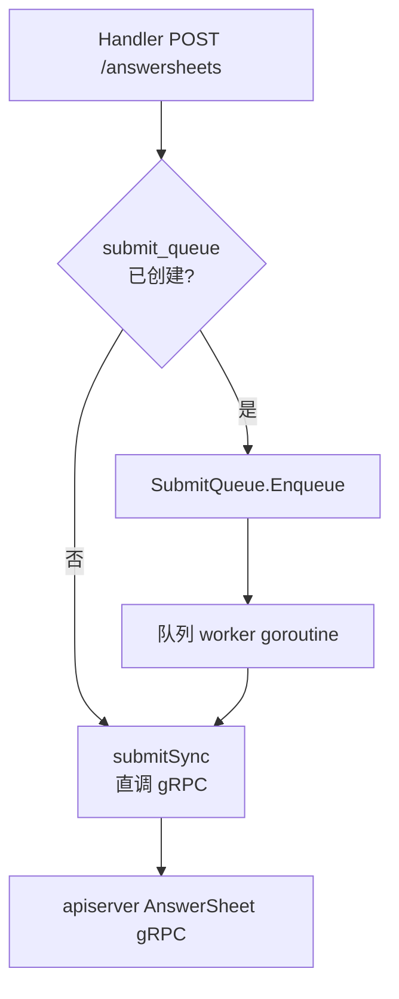
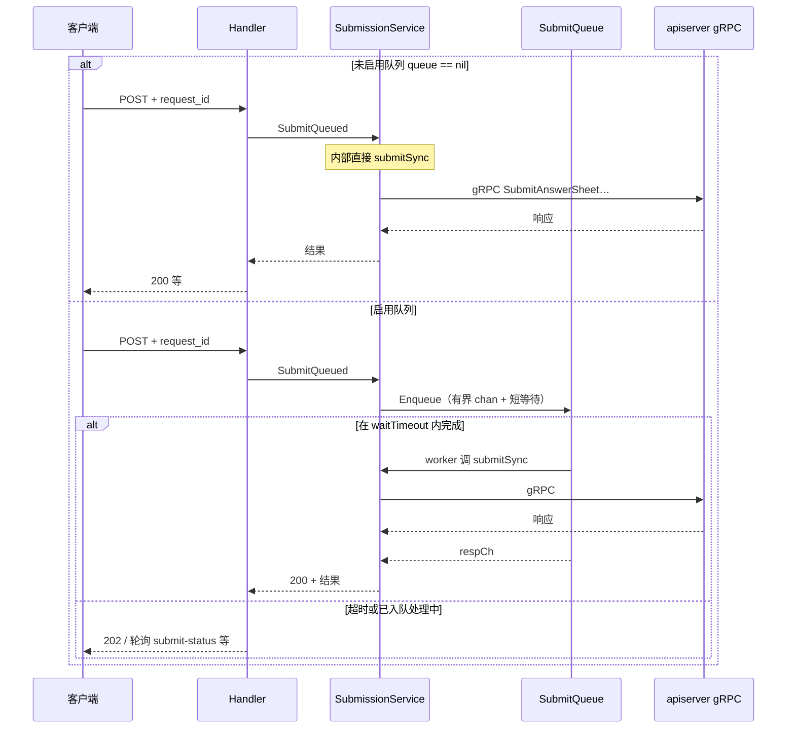

# collection-server

**本文回答**：这篇文档解释 `collection-server` 作为前台 BFF 在运行时承担什么角色、典型请求如何从 REST 转到 gRPC、答卷提交为什么会分成直调与 `SubmitQueue` 两条路径，以及它与 Redis、IAM、`qs-apiserver` 的边界是什么；本文先给结论和速查，再展开时序和代码入口。

## 30 秒结论

如果只看一屏，先看下面这张表：

| 维度 | 结论 |
| ---- | ---- |
| 进程角色 | `collection-server` 是前台 BFF，负责鉴权、限流、排队、监护等入口层能力，不持有主业务写模型 |
| 最重要的上下游 | 上游是客户端 REST；核心下游是 `qs-apiserver` gRPC，辅以 Redis 和 IAM |
| 提交答卷的关键认识 | `SubmitQueued` 是统一入口；是否真正进队列由 `submit_queue` 配置决定，关闭时等价于同步直调 gRPC |
| 与主服务的边界 | 它不直连 MySQL / Mongo 主库，不在本进程内完成问卷、测评等主业务持久化 |
| 本地状态 | Redis 主要服务于排队、会话类辅助和部分缓存，不改变“主状态在 apiserver”的边界 |
| 排障入口 | 先看中间件链与 Handler，再看 `SubmissionService` / `SubmitQueue` 与 gRPC client |

## 重点速查（继续往下读前先记这几条）

1. **这是 BFF，不是第二个业务主服务**：它做的是入口层治理和转发收敛，不是领域状态权威。  
2. **答卷提交要区分两条路径**：启用队列时先入进程内有界队列；未启用时直接同步走 gRPC。  
3. **Redis 在这里的职责偏辅助**：主要用于排队与前台侧支撑，不代表业务真值落在本进程。  
4. **排障顺序**：先看路由和中间件，再看 Handler / Service，最后看 gRPC client 和 queue 配置。  

**组件定位**：**前台 BFF** 进程；**不**直连 MySQL/Mongo 主库；对外 **REST**，对内通过 **gRPC** 调用 **apiserver**；本地 **Redis** + **IAM** 支撑排队、会话类辅助与身份。  
限流与排队机制见 [03-缓存与限流](../03-基础设施/03-缓存与限流.md)；REST 契约见 [04-REST](../04-接口与运维/01-REST契约.md)。

---

## 1. 组件定位（在整体中的位置）

| 维度 | 说明 |
| ---- | ---- |
| **角色** | 小程序/收集端入口：**鉴权、限流、排队、监护** 等前置能力 |
| **上游** | 客户端 **REST** |
| **下游（兄弟组件）** | **apiserver gRPC**（强依赖） |
| **下游（数据）** | **Redis**（排队等）；**IAM SDK** |

---

## 2. 内部运行示意图

**关键点**：**SubmitQueue** 是 **进程内有界队列**（削峰），与 **MQ 跨进程异步** 不同。

---

## 3. 典型请求时序（REST → gRPC）

**提交答卷**入口统一走 **`SubmitQueued`**（见 [answersheet_handler.go](../../internal/collection-server/interface/restful/handler/answersheet_handler.go)），内部再根据 **是否启用队列** 分支，见下节。

---

## 4. 答卷提交：直调 gRPC vs 经 SubmitQueue

**配置**：`submit_queue.enabled` 等为 `true` 且参数合法时，[NewSubmissionService](../../internal/collection-server/application/answersheet/submission_service.go) 会创建 **`SubmitQueue`**，并把 **`submitSync`**（内部即 **AnswerSheet gRPC → apiserver**）作为队列 worker 的 **`submit` 回调**；**未启用队列**时 `queue == nil`，`SubmitQueued` **直接调用 `submitSync`**，与「同步直调」等价。

### 4.1 分支示意（flowchart）

### 4.2 时序对比（sequenceDiagram）

**关键点**：队列路径下 **真正调 apiserver 的仍是 `submitSync`**，只是可能发生在 **队列 worker** 中；**满队** 返回 **429**、**短等待未结束** 可能 **202 + `request_id` 轮询**，语义以 [submit_queue.go](../../internal/collection-server/application/answersheet/submit_queue.go) 为准。

---

## 5. 核心功能与关键点

| 功能 | 关键点 | 代码锚点 |
| ---- | ------ | -------- |
| **启动** | 可选 **GOMEMLIMIT/GOGC**、**:6060 pprof** | [app.go](../../internal/collection-server/app.go)、[server.go](../../internal/collection-server/server.go) |
| **gRPC 客户端** | 五类 client 注入容器 | [grpc_client_registry.go](../../internal/collection-server/grpc_client_registry.go)、[manager.go](../../internal/collection-server/infra/grpcclient/manager.go) |
| **路由** | 公开路径 vs `/api/v1` 受保护 | [routers.go](../../internal/collection-server/routers.go) |
| **提交排队** | 200/202/429、有界 | [submit_queue.go](../../internal/collection-server/application/answersheet/submit_queue.go) |
| **监护与提交** | JWT 之外的业务校验 | [submission_service.go](../../internal/collection-server/application/answersheet/submission_service.go) |
| **身份中间件** | 与 apiserver **不是**同一套 UserIdentity 实现 | [iam_middleware.go](../../internal/collection-server/interface/restful/middleware/iam_middleware.go) |

---

## 6. 与其它组件的交互

| 对方 | 方式 | 说明 |
| ---- | ---- | ---- |
| **apiserver** | gRPC | 主读写与领域逻辑 |
| **Client** | REST | 唯一对外业务面 |
| **IAM** | SDK | 验签、监护查询等 |
| **Redis** | TCP | 排队与辅助状态 |

---

## 7. 关键代码入口（索引）

| 关注点 | 路径 |
| ------ | ---- |
| 进程入口 | [cmd/collection-server/main.go](../../cmd/collection-server/main.go) |
| 配置 | [options/options.go](../../internal/collection-server/options/options.go) |

---

## 8. 边界与注意事项

- **无** MySQL/Mongo 主库连接；持久化均在 **apiserver**。  
- **匿名只读**仅路由白名单（如部分 scales GET）。  
- **gRPC 不可用**时 REST 可能仍“活着”但业务失败，需看健康检查与下游状态。

---

*说明：写作习惯可对照 [CONTRIBUTING-DOCS.md](../CONTRIBUTING-DOCS.md)；本篇按「运行时组件」体裁组织。*
