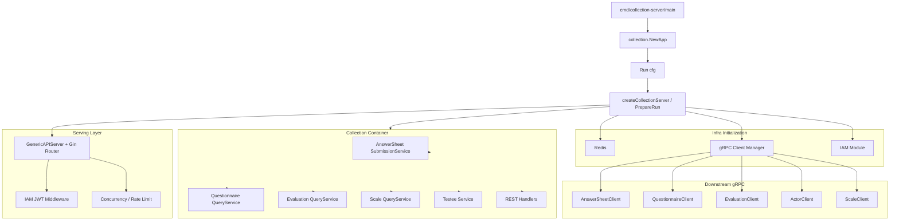

# collection-server

本文档说明 `collection-server` 作为前台 BFF 是如何启动、装配和承接收集链路的。

## 30 秒了解系统

`collection-server` 不是第二套主业务服务，而是面向小程序和收集端的 BFF。它负责：

- 对前台暴露更轻量的 REST API
- 做 JWT 身份解析、监护关系校验、排队和限流
- 通过 gRPC 调用 `apiserver`
- 用 Redis 保存提交排队状态和部分运行时辅助数据

代码入口：

- [cmd/collection-server/main.go](../../cmd/collection-server/main.go)
- [internal/collection-server/app.go](../../internal/collection-server/app.go)
- [internal/collection-server/server.go](../../internal/collection-server/server.go)

## 核心架构

## 核心设计原则

- BFF 而不是主服务：`collection-server` 只做前台适配，不独立持有主业务模块。
- 前台链路优先短路径：查询直接走 gRPC，下游重任务通过提交排队和后续事件链路消化。
- 接口与权限前置：JWT、本地 JWKS 验签、监护关系校验、限流都尽量在入口层完成。
- 尽量轻状态：本进程主要持有 Redis、IAM 和 gRPC 客户端，不维护 MySQL / Mongo 主业务连接。

## 职责

`collection-server` 的运行时职责包括：

- 读取配置并初始化日志
- 应用 `GOMEMLIMIT` / `GOGC` 运行时调优
- 初始化 Redis
- 建立到 `apiserver` 的 gRPC 客户端连接
- 初始化 IAM 模块和容器
- 注册前台 REST 路由
- 安装全局并发限制、路由级限流和身份中间件

关键代码：

- [internal/collection-server/app.go](../../internal/collection-server/app.go)
- [internal/collection-server/server.go](../../internal/collection-server/server.go)
- [internal/collection-server/container/container.go](../../internal/collection-server/container/container.go)

## 启动流程

### 1. 入口与运行时调优

入口层除了创建 `App` 之外，还会做两件额外的运行时工作：

- 根据配置设置 `GOMEMLIMIT` / `GOGC`
- 启动 `pprof` 监听 `:6060`

代码入口：

- [internal/collection-server/app.go](../../internal/collection-server/app.go)

### 2. 基础设施准备

`PrepareRun` 的准备顺序是：

1. 初始化 Redis
2. 创建 gRPC 客户端管理器
3. 创建容器
4. 初始化 IAM 模块
5. 把各类 gRPC client 注入容器
6. 初始化应用服务和 REST handler

代码入口：

- [internal/collection-server/database.go](../../internal/collection-server/database.go)
- [internal/collection-server/grpc_client_registry.go](../../internal/collection-server/grpc_client_registry.go)
- [internal/collection-server/container/container.go](../../internal/collection-server/container/container.go)
- [internal/collection-server/infra/grpcclient/manager.go](../../internal/collection-server/infra/grpcclient/manager.go)

### 3. 路由和保护层

`collection-server` 只提供 HTTP / HTTPS，不提供自己的 gRPC 服务。路由注册完成后，会形成以下运行时能力：

- 全局基础中间件
- IAM JWT 中间件
- 并发限制中间件
- 路由级限流

代码入口：

- [internal/collection-server/routers.go](../../internal/collection-server/routers.go)
- [internal/pkg/server/genericapiserver.go](../../internal/pkg/server/genericapiserver.go)

## 对外接口面

### 公开路由

主要包括：

- `/health`
- `/ping`
- `/api/v1/public/info`

### 业务路由

当前业务面主要是前台读写能力：

- `questionnaires`
- `answersheets`
- `assessments`
- `scales`
- `testees`

OpenAPI 契约：

- [api/rest/collection.yaml](../../api/rest/collection.yaml)

## 运行时特点

### 提交排队

答卷提交服务支持本地排队：

- 短时间内等待结果
- 超时则返回“已排队”，前端通过 `request_id` 轮询状态
- 状态保存在内存与 Redis 辅助链路中

关键代码：

- [internal/collection-server/application/answersheet/submission_service.go](../../internal/collection-server/application/answersheet/submission_service.go)
- [internal/collection-server/application/answersheet/submit_queue.go](../../internal/collection-server/application/answersheet/submit_queue.go)

### 并发与限流

当前有两层保护：

- 全局并发限制：`concurrencyLimitMiddleware`
- 路由级限流：按全局和用户维度限制提交、查询、等待报告接口

关键代码：

- [internal/collection-server/server.go](../../internal/collection-server/server.go)
- [internal/collection-server/routers.go](../../internal/collection-server/routers.go)

### 身份与监护关系

`collection-server` 除了 JWT 身份识别，还会在应用层校验监护关系。

关键代码：

- [internal/collection-server/interface/restful/middleware/iam_middleware.go](../../internal/collection-server/interface/restful/middleware/iam_middleware.go)
- [internal/collection-server/application/answersheet/submission_service.go](../../internal/collection-server/application/answersheet/submission_service.go)
- [internal/collection-server/infra/iam/guardianship.go](../../internal/collection-server/infra/iam/guardianship.go)

## 关键配置项

值得优先关注的配置分组：

- `grpc_client`：下游 `apiserver` 地址、TLS、超时、最大并发调用数
- `redis`：排队和辅助缓存使用的 Redis
- `concurrency`：全局并发限制
- `rate_limit`：提交、查询、等待报告接口限流
- `submit_queue`：提交排队开关、队列长度、worker 数量、等待超时
- `iam`：IAM SDK 与本地验签
- `runtime`：`GOMEMLIMIT` / `GOGC`

代码入口：

- [internal/collection-server/options/options.go](../../internal/collection-server/options/options.go)

## 边界与注意事项

- `collection-server` 不直连 MySQL / Mongo 业务主库，主业务写入仍通过 `apiserver` 完成。
- 当前放开的匿名读能力很有限，只对白名单量表 GET 接口跳过认证。
- `pprof` 在 `:6060` 启动，属于运行时诊断能力，部署时要结合网络边界控制访问。
- 如果 gRPC 下游不可用，`collection-server` 仍能启动，但核心业务接口会实际不可用。
