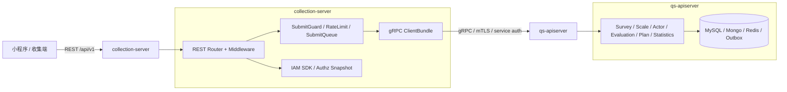
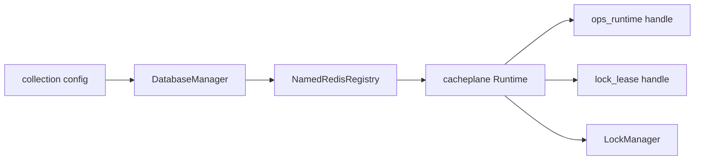
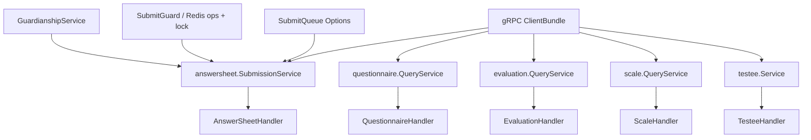
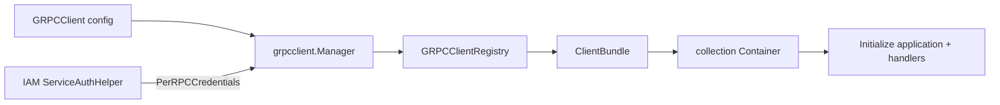
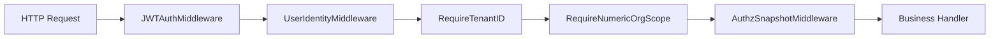
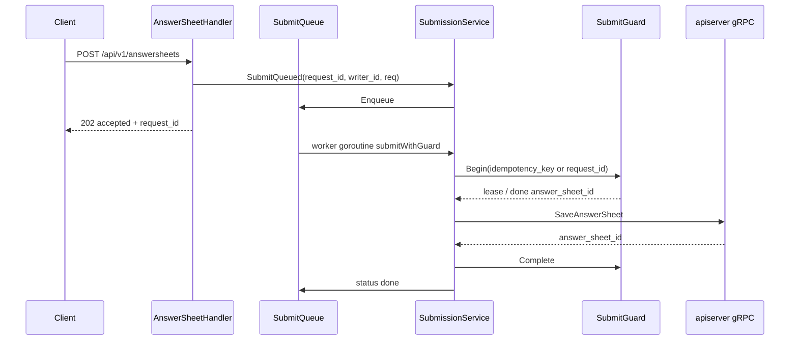
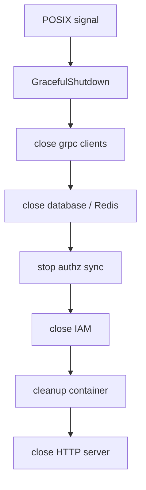

# collection-server 运行时

**本文回答**：`collection-server` 在运行时如何启动、如何装配 Redis / IAM / gRPC client / REST handler，为什么它是前台 BFF 而不是第二个主业务服务，以及排障或改造 collection 进程时应该从哪些代码锚点进入。

---

## 30 秒结论

| 维度 | 结论 |
| ---- | ---- |
| 运行时定位 | `collection-server` 是面向小程序 / 收集端的 **REST BFF**，负责入口治理、身份前置、监护校验、提交削峰和 gRPC 转调 |
| 主状态边界 | collection 不持有 `survey / scale / evaluation` 的权威写模型；答卷、测评、报告等主业务状态仍由 `qs-apiserver` 落库 |
| 启动主线 | `main -> collection.NewApp -> config.CreateConfigFromOptions -> process.Run -> PrepareRun -> Run` |
| PrepareRun 阶段 | `prepare resources -> initialize container -> initialize integrations -> initialize transports -> register shutdown callback` |
| 资源层 | collection 的 `DatabaseManager` 只管理 Redis connectivity；Redis runtime 产出 `ops_runtime`、`lock_lease` 和 lock manager |
| 容器层 | container 装配 BFF 应用服务、REST handler、IAM module、SubmitGuard、SubmitQueue 和 gRPC client bundle |
| 集成层 | integration stage 创建 apiserver gRPC client manager，注入 AnswerSheet / Questionnaire / Evaluation / Actor / Scale client |
| HTTP 层 | 只启动 HTTP REST server；全局中间件包括 recovery、request-id、logger、API logger、NoCache、Options |
| 保护层 | 答卷提交走 SubmitQueue；rate limit 可用 Redis backend，不可用时降级为本地限流 |
| 安全层 | `/api/v1` 默认挂 IAM JWT、UserIdentity、TenantID、OrgScope、AuthzSnapshot；部分公开 scale GET 白名单可跳过认证 |
| 关闭顺序 | shutdown hook 关闭 gRPC manager、Redis、authz sync、IAM、container，最后关闭 HTTP server |

一句话概括：**collection-server 是前台入口保护层和协议适配层，它把“用户请求”整理成“apiserver gRPC 调用”，但不重新实现业务权威模型。**

---

## 1. collection-server 在三进程中的位置

`collection-server` 的核心价值不是“多一个 HTTP 服务”，而是把前台入口和主业务服务隔开。



collection-server 有三个边界必须记牢：

| 边界 | collection-server 负责 | collection-server 不负责 |
| ---- | ---------------------- | ------------------------ |
| 协议边界 | REST DTO、HTTP status、请求 ID、错误映射 | 定义 apiserver gRPC 服务语义 |
| 入口保护 | JWT、Tenant / Org scope、监护关系、限流、SubmitQueue、SubmitGuard | 替代 apiserver 的领域校验和事务边界 |
| 查询适配 | 面向前台聚合问卷、量表、测评、受试者查询入口 | 维护独立 read model 或第二套业务仓储 |
| 提交链路 | 接收答卷、排队、调用 SaveAnswerSheet | 直接写答卷集合、直接发布领域事件 |
| 安全链路 | 使用 IAM SDK 验证身份，加载 authz snapshot | 把 JWT roles 当作业务授权真值 |

---

## 2. 从入口到 process.Run

collection-server 的可执行入口很薄：

```text
cmd/collection-server/main.go
  -> internal/collection-server.NewApp("collection-server").Run()
  -> internal/collection-server/app.go
  -> config.CreateConfigFromOptions(opts)
  -> internal/collection-server/run.go
  -> internal/collection-server/process.Run(cfg)
```

`app.go` 做三件运行时前置工作：

1. 初始化日志；
2. 应用 runtime tuning，例如 `GOMEMLIMIT`、`GOGC`；
3. 如启用 profiling，启动本地 pprof server。

这部分不是业务组合根。真正的进程组合发生在 `internal/collection-server/process` 和 `internal/collection-server/container`。

---

## 3. PrepareRun 五阶段

collection-server 的 `PrepareRun` 用 `processruntime.Runner` 串起五个阶段：

```mermaid
flowchart TB
    A[process.Run(cfg)]
    B[createServer(cfg)]
    C[PrepareRun]
    D[prepare resources]
    E[initialize container]
    F[initialize integrations]
    G[initialize transports]
    H[register shutdown callback]
    I[preparedServer.Run]
    J[HTTP server Run]

    A --> B --> C --> D --> E --> F --> G --> H --> I --> J
```

| 阶段 | 代码锚点 | 职责 | 失败时优先看 |
| ---- | -------- | ---- | ------------ |
| `prepare resources` | `process/resource_bootstrap.go` | 初始化 Redis registry，构建 cacheplane runtime、ops handle、lock handle、lock manager | Redis profile、ACL 用户、RedisRuntime family |
| `initialize container` | `process/container_bootstrap.go` | 创建 collection container，初始化 IAM module | IAM 配置、JWKS、gRPC IAM、service auth |
| `initialize integrations` | `process/integration_bootstrap.go` | 创建 apiserver gRPC manager，注入 client bundle，启动 authz sync | gRPC endpoint、mTLS 证书、服务端名称、service JWT |
| `initialize transports` | `process/transport_bootstrap.go` | 创建 HTTP server，挂并发限制，注册 REST routes | HTTP/HTTPS bind、middleware、router |
| `register shutdown callback` | `process/lifecycle.go` | 注册关闭 gRPC、Redis、authz sync、IAM、container、HTTP 的 hook | 资源泄漏、进程退出卡住 |

collection-server 没有像 apiserver 那样独立的 `runtimeStage`，因为它不负责启动 scheduler、outbox relay 或 worker subscriber。它的运行主体就是 HTTP server；gRPC client、Redis 和 IAM 是被 HTTP 请求使用的依赖。

---

## 4. Resource Stage：Redis runtime 与 lock manager

collection-server 的资源阶段只初始化 Redis 相关能力。虽然类型名是 `DatabaseManager`，但代码注释明确写的是 **manages collection-server Redis connectivity**。



资源输出包括：

| 输出 | 用途 |
| ---- | ---- |
| `familyStatus` | 健康检查 / governance 展示 Redis family 状态 |
| `redisRuntime` | collection 的 Redis runtime |
| `opsHandle` | 操作型 Redis handle，主要给限流、提交状态、运维能力使用 |
| `lockHandle` | lock family handle |
| `lockManager` | SubmitGuard 等幂等 / 锁能力使用 |

默认 Redis family 主要有两类：

| Family | 默认 profile | namespace suffix | 用途 |
| ------ | ------------ | ---------------- | ---- |
| `ops_runtime` | `ops_runtime` | `ops:runtime` | collection 运行态能力，如限流 backend、SubmitGuard 辅助 |
| `lock_lease` | `lock_cache` | `cache:lock` | 锁租约、提交幂等保护 |

注意：collection 不在资源阶段初始化 MySQL / MongoDB 主业务连接。答卷、测评、报告等权威持久化通过 apiserver gRPC 完成。

---

## 5. Container Stage：BFF 组合根

container stage 创建 `collection-server/container.Container`，并给它注入：

```text
options.Options
opsHandle
lockManager
familyStatus
IAMModule
```

container 本身不是领域模型容器，而是 BFF 组合根。它持有：

| 类型 | 组件 |
| ---- | ---- |
| IAM | `IAMModule` |
| gRPC clients | `AnswerSheetClient`、`QuestionnaireClient`、`EvaluationClient`、`ActorClient`、`ScaleClient` |
| application services | `SubmissionService`、`questionnaire.QueryService`、`evaluation.QueryService`、`scale.QueryService`、`testee.Service` |
| REST handlers | `AnswerSheetHandler`、`QuestionnaireHandler`、`EvaluationHandler`、`ScaleHandler`、`TesteeHandler`、`HealthHandler` |

container 初始化分两步：

```text
Initialize()
  -> initApplicationServices()
  -> initHandlers()
```

### 5.1 应用服务装配

collection 的应用服务很薄，主要是 gRPC 转调和前置校验。



`SubmissionService` 是 collection 里最重要的应用服务。它的职责是：

1. 校验当前 writer；
2. 查询 / 解析 canonical testee；
3. 校验监护关系；
4. 转换 REST DTO 为 gRPC input；
5. 通过 `AnswerSheetClient.SaveAnswerSheet` 调 apiserver；
6. 通过 SubmitQueue 支持 202 异步受理；
7. 通过 SubmitGuard 避免同 key 并发重复提交。

它不负责：

- 创建 `AnswerSheet` 聚合；
- 执行问卷题型校验；
- 写 Mongo；
- 写 outbox；
- 发布 `answersheet.submitted`。

这些都在 apiserver 侧。

### 5.2 Handler 装配

handler 是 REST 入站的边界。container 会把应用服务转成 handler：

| Handler | 来源服务 | 典型功能 |
| ------- | -------- | -------- |
| `AnswerSheetHandler` | `SubmissionService` | 提交答卷、查提交状态、查答卷 |
| `QuestionnaireHandler` | `questionnaire.QueryService` | 问卷列表 / 详情 |
| `EvaluationHandler` | `evaluation.QueryService` + `SubmissionService` | 查询测评、报告、趋势、等待报告 |
| `ScaleHandler` | `scale.QueryService` | 量表列表、热门量表、分类、详情 |
| `TesteeHandler` | `testee.Service` + guardianship | 受试者创建、列表、详情、照护上下文 |
| `HealthHandler` | familyStatus + resilience snapshot | health / ready / governance |

---

## 6. Integration Stage：apiserver gRPC client bundle

integration stage 是 collection 和 apiserver 的真正进程边界。



`CreateGRPCClientManager` 接收：

| 参数 | 来源 | 含义 |
| ---- | ---- | ---- |
| `endpoint` | `grpc_client.endpoint` | apiserver gRPC 地址 |
| `timeout` | `grpc_client.timeout` | 单次 RPC 超时 |
| `insecure` | `grpc_client.insecure` | 是否禁用 TLS |
| `tls-cert/key/ca/server-name` | gRPC client TLS 配置 | mTLS / server verification |
| `maxInflight` | `grpc_client.max_inflight` | 客户端并发保护 |
| `perRPC` | IAM ServiceAuthHelper | 每次 RPC 附加服务 JWT metadata |

gRPC manager 做这些事情：

1. 创建一个 gRPC connection；
2. 配置消息大小；
3. 配置 keepalive；
4. 配置 unary interceptor，为所有 RPC 加 timeout 和 max-inflight；
5. 根据配置加载 TLS / mTLS；
6. 如有 service auth helper，则挂 PerRPC credentials；
7. 注册 AnswerSheet、Questionnaire、Evaluation、Actor、Scale 客户端；
8. 通过 `ClientBundle` 一次性注入 container。

这个设计有两个好处：

- container 不需要自己知道如何建 gRPC connection；
- 新增 client 时有清晰路径：`manager -> registry -> ClientBundle -> container -> application service`。

---

## 7. Transport Stage：HTTP server 与 Router

transport stage 只启动 HTTP REST server。

```mermaid
flowchart TB
    cfg[Generic server config]
    server[GenericAPIServer]
    limit[Concurrency middleware]
    router[collection Router]
    middleware[Global Middleware]
    public[Public Routes]
    business[/api/v1 Business Routes]

    cfg --> server
    server --> limit
    server --> router
    router --> middleware
    router --> public
    router --> business
```

### 7.1 全局中间件

Router 注册全局中间件：

| 中间件 | 作用 |
| ------ | ---- |
| `gin.Recovery()` | 捕获 panic |
| `RequestID()` | 建立请求 ID |
| `Logger()` | 基础日志 |
| `APILogger()` | API 详细日志 |
| `NoCache` | 禁用客户端缓存 |
| `Options` | OPTIONS 处理 |

如果 `concurrency.max-concurrency` 大于 0，transport stage 还会在 HTTP server 上挂一个 semaphore 风格的并发限制中间件。

### 7.2 公开路由

公开路由主要用于健康检查和 governance：

```text
GET /health
GET /readyz
GET /governance/redis
GET /governance/resilience
GET /ping
GET /api/v1/public/info
```

它们不代表业务读写能力，只是运行时和观测入口。

### 7.3 业务路由

业务路由挂在 `/api/v1` 下，主要包括：

| 路由组 | 典型能力 |
| ------ | -------- |
| `/questionnaires` | 问卷列表、问卷详情 |
| `/answersheets` | 提交答卷、查询提交状态、查询答卷、按答卷查测评 |
| `/assessments` | 测评列表、详情、分数、报告、趋势、高风险、等待报告 |
| `/scales` | 量表分类、热门量表、列表、详情 |
| `/testees` | 受试者存在性、创建、列表、详情、照护上下文、更新 |

这些路由最终都会通过 gRPC client 调 apiserver。collection 不应在 handler 中直接写主业务数据。

---

## 8. 身份链路：JWT、Tenant、OrgScope 与 AuthzSnapshot

collection 的 `/api/v1` 默认挂 IAM 认证中间件。核心链路是：



认证链路有几个关键点：

| 能力 | 作用 |
| ---- | ---- |
| JWT verifier | 使用 IAM SDK 验证 token，可配置本地 JWKS 或远程权威校验 |
| UserIdentity | 从认证结果中投影当前用户身份 |
| TenantID | 要求请求带租户范围 |
| OrgScope | 要求请求带数值型 org scope |
| AuthzSnapshot | 加载 IAM 授权快照，作为权限视图 |
| ServiceAuthHelper | collection 调 apiserver gRPC 时附加服务 JWT metadata |

### 8.1 白名单边界

Router 允许部分 scale read-only GET 路径跳过认证：

```text
GET /api/v1/scales
GET /api/v1/scales/hot
GET /api/v1/scales/categories
```

这是明确白名单，不应扩展成“所有 scale 接口公开”。如果新增公开接口，必须同步更新 REST 契约、安全文档和对应测试。

### 8.2 authz sync

integration stage 还会启动 collection 侧的 IAM authz version sync。它会创建 subscriber，订阅 IAM authz version 变更，并刷新本地 snapshot loader。这个能力用于让 collection 的权限视图跟上 IAM 变化；它不是业务事件系统的一部分，也不走 `configs/events.yaml`。

---

## 9. SubmitQueue 与 SubmitGuard

答卷提交是 collection 最重要的前台保护点。



### 9.1 SubmitQueue 的边界

SubmitQueue 是 collection 进程内的 memory channel，不是 MQ，不是 durable queue。

| 特性 | 当前事实 |
| ---- | -------- |
| strategy | `memory_channel` |
| 状态 TTL | 10 分钟 |
| 状态 | `queued / processing / done / failed` |
| 生命周期 | `process_memory_no_drain` |
| 队列满 | 返回 `ErrQueueFull`，handler 映射为 HTTP 429 |
| 重复 request_id | queued / processing / done 会复用状态，failed 要求换 request_id |
| 重启影响 | 进程重启后本地队列和状态不可恢复 |

因此文档中必须区分：

| 名称 | 作用 |
| ---- | ---- |
| `request_id` | collection 本地队列状态查询 |
| `idempotency_key` | 业务幂等语义，最终传给 apiserver durable submit |
| Redis SubmitGuard key | collection 跨实例“正在提交 / 已完成”的前置保护 |
| Mongo durable idempotency | apiserver 权威幂等记录 |

### 9.2 SubmitGuard 的边界

`SubmissionService.submitWithGuard` 会优先使用 `idempotency_key`，否则用 `request_id` 作为 guard key。SubmitGuard 的目标是避免 collection 层并发重复打到 apiserver；但最终的业务权威幂等仍应以 apiserver durable submit 为准。

---

## 10. Resilience 与 Governance

collection 的保护层包括：

| 能力 | 位置 | 说明 |
| ---- | ---- | ---- |
| RateLimit | Router / `rateLimitedHandlers` | 支持 Redis distributed limiter，不可用时本地 limiter |
| SubmitQueue | `answersheet.SubmitQueue` | 削峰，HTTP 202 后异步 gRPC |
| SubmitGuard | `redisops.NewSubmitGuard` | 基于 Redis / lock manager 的提交幂等前置保护 |
| gRPC max-inflight | `grpcclient.Manager` | 对 collection -> apiserver 的 RPC 并发做上限 |
| HTTP concurrency | transport stage | 对整个 HTTP server 做并发限制 |
| Governance endpoint | HealthHandler | `/governance/redis`、`/governance/resilience` |

这些能力都应该归入 `03-基础设施/resilience` 或 `03-基础设施/runtime` 深讲。collection runtime 文档只说明它们在哪里挂载、如何影响进程行为。

---

## 11. Shutdown：关闭顺序与资源释放

collection 注册 shutdown callback，触发时执行：



注意两点：

1. lifecycle hook 内会先跑组件关闭，再关闭 HTTP server。
2. SubmitQueue 没有单独 drain 语义，运行时快照也明确是 `process_memory_no_drain`。这意味着进程退出时不能假设本地队列任务一定被继续处理。

---

## 12. 常见排障路径

### 12.1 服务启动失败

| 现象 | 优先检查 |
| ---- | -------- |
| Redis 初始化失败 | `configs/collection-server.*.yaml` 的 `redis`、`redis_profiles`、ACL 用户密码、DB 编号 |
| IAM 初始化失败 | `iam.enabled`、JWKS URL、IAM gRPC 地址、mTLS 配置 |
| apiserver gRPC 连接失败 | `grpc_client.endpoint`、TLS CA、client cert/key、`tls-server-name` |
| HTTP 端口无法监听 | `insecure.bind-port`、`secure.bind-port`、本机端口占用 |
| authz sync 报错 | IAM authz sync topic、subscriber 配置、authz snapshot loader |

### 12.2 提交答卷失败

| HTTP 表现 | 可能位置 | 排查 |
| -------- | -------- | ---- |
| 401 | JWT / IAM verifier | token 是否有效、JWKS 是否可用 |
| 403 | 监护关系 / org scope | writer、testee、IAM child 绑定、guardianship |
| 429 | RateLimit / SubmitQueue / SubmitGuard / gRPC max-inflight | 队列容量、限流配置、request_id 是否重复、max_inflight |
| 404 | canonical testee 解析失败 | testee_id 是否误传 profile_id，Actor gRPC 是否可用 |
| 500 | gRPC / apiserver / durable submit | apiserver gRPC 日志、Mongo durable submit、events outbox |

### 12.3 报告等待接口异常

| 现象 | 可能位置 |
| ---- | -------- |
| wait-report 被限流 | `wait_report_global_qps` / `wait_report_user_qps` |
| 查询无报告 | assessment 是否已经 interpreted、report.generated 是否出站 |
| 前台能提交但无结果 | worker 是否消费 `answersheet.submitted` / `assessment.submitted`，apiserver evaluation 是否失败 |

---

## 13. 修改 collection-server 时该改哪里

| 变更目标 | 应改位置 | 同步检查 |
| -------- | -------- | -------- |
| 新增 REST 路由 | `transport/rest/router.go` + 对应 handler | `api/rest/collection.yaml`、认证白名单、rate limit |
| 新增 BFF 应用服务 | `application/*` + container `initApplicationServices` | 是否只是转调，是否误写主业务状态 |
| 新增 gRPC client | `infra/grpcclient` + `integration/grpcclient/registry.go` + `container.ClientBundle` | mTLS、service auth、max-inflight、测试 |
| 修改答卷提交保护 | `answersheet.SubmissionService`、`SubmitQueue`、`SubmitGuard` | resilience docs、HTTP 202/429 语义、request_id/idempotency_key 边界 |
| 修改 IAM 认证 | `transport/rest/router.go`、IAM module | security docs、status code、claims、org scope |
| 修改 Redis family | `configs/collection-server.*.yaml`、resource bootstrap | Redis docs、governance endpoint、fallback 行为 |
| 修改关闭流程 | `process/lifecycle.go` | 是否正确关闭 gRPC、Redis、IAM、HTTP |

---

## 14. 代码与契约锚点

| 类型 | 路径 |
| ---- | ---- |
| 入口 | `cmd/collection-server/main.go` |
| app 前置 | `internal/collection-server/app.go` |
| run 入口 | `internal/collection-server/run.go` |
| process root | `internal/collection-server/process/root.go` |
| stage runner | `internal/collection-server/process/runner.go` |
| resources | `internal/collection-server/process/resource_bootstrap.go` |
| Redis manager | `internal/collection-server/bootstrap/database.go` |
| container stage | `internal/collection-server/process/container_bootstrap.go` |
| integration stage | `internal/collection-server/process/integration_bootstrap.go` |
| gRPC client registry | `internal/collection-server/integration/grpcclient/registry.go` |
| gRPC client manager | `internal/collection-server/infra/grpcclient/manager.go` |
| transport stage | `internal/collection-server/process/transport_bootstrap.go` |
| router | `internal/collection-server/transport/rest/router.go` |
| container | `internal/collection-server/container/container.go` |
| submission service | `internal/collection-server/application/answersheet/submission_service.go` |
| submit queue | `internal/collection-server/application/answersheet/submit_queue.go` |
| shutdown | `internal/collection-server/process/lifecycle.go` |
| REST 契约 | `api/rest/collection.yaml` |
| 开发配置 | `configs/collection-server.dev.yaml` |
| 生产配置 | `configs/collection-server.prod.yaml` |

---

## 15. Verify

```bash
# 构建 collection-server
make build-collection

# 启动 collection-server（默认 dev）
make run-collection

# 检查健康
curl -sS http://127.0.0.1:18083/health
curl -sS http://127.0.0.1:18083/readyz
curl -sS http://127.0.0.1:18083/governance/redis
curl -sS http://127.0.0.1:18083/governance/resilience

# 运行 collection 相关测试
go test ./internal/collection-server/...

# 文档卫生检查
make docs-hygiene
```

---

## 16. 与其它文档的关系

| 继续阅读 | 说明 |
| -------- | ---- |
| [00-三进程协作总览.md](./00-三进程协作总览.md) | collection 在三进程中的位置 |
| [01-qs-apiserver启动与组合根.md](./01-qs-apiserver启动与组合根.md) | collection 下游主服务如何装配 |
| [04-进程间调用与gRPC.md](./04-进程间调用与gRPC.md) | gRPC / mTLS / service auth 细节 |
| [05-IAM认证与身份链路.md](./05-IAM认证与身份链路.md) | JWT、Tenant、OrgScope、authz snapshot |
| [07-优雅关闭与资源释放.md](./07-优雅关闭与资源释放.md) | shutdown hook 与资源释放 |
| [../03-基础设施/resilience/](../03-基础设施/resilience/) | SubmitQueue、RateLimit、SubmitGuard 深讲 |
| [../04-接口与运维/02-collection-REST.md](../04-接口与运维/02-collection-REST.md) | REST 契约与 HTTP status |
