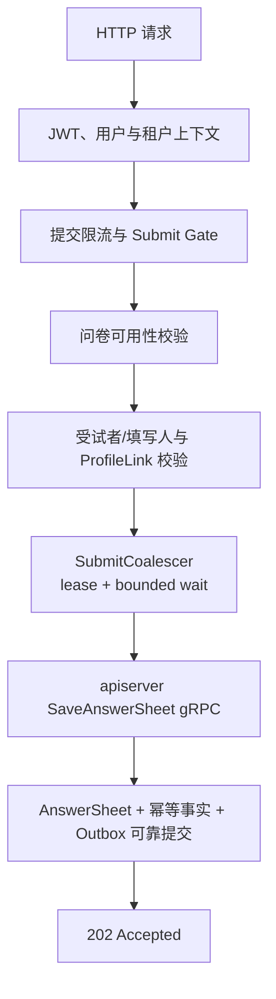

# collection-server 运行时

## 1. 结论

`collection-server` 是 collection-system 小程序的 BFF，也是高流量测评入口的保护层。它把小程序用户身份转换成 qs-server 可以理解的访问上下文，组合问卷、测评、报告等前台查询，并在答卷提交前实施限流、并发准入和下游背压。

它不拥有 Survey、Evaluation、Interpretation 的业务事实。所有需要改变核心状态的操作最终都通过 gRPC 回到 `qs-apiserver`。

## 2. 为什么独立成一个进程

collection-server 首先解决的是前台适配问题：

- 小程序接口不必直接暴露复杂的内部领域服务；
- IAM User/Profile 可以在边界处转换为填写人、受试者和组织上下文；
- 页面需要的组合数据可以由 BFF 一次聚合；
- WebSocket、报告等待、L1/L2 缓存等前台能力不会污染业务核心。

在此基础上，它又成为并发入口。Plan 集中推送、校内筛查和线上直播都可能产生瞬时提交峰值，因此 collection 需要独立限容和扩容，保护 apiserver、MongoDB 与 Redis 不被入口流量拖垮。

## 3. 启动模型

入口 `cmd/collection-server/main.go` 进入 `internal/collection-server/process`，PrepareRun 包含五个阶段：

1. `prepare resources`：创建数据库/Redis profile、运行时保护等共享资源；
2. `initialize container`：装配 BFF application service、缓存和 resilience 子系统；
3. `initialize integrations`：建立 apiserver gRPC clients，并按配置启动 IAM authz version 同步；
4. `initialize transports`：注册 REST Router 与相关 WebSocket/报告事件能力；
5. `register shutdown callback`：固化关闭顺序。

进入 Run 后先启动缓存子系统，再启动 shutdown manager，最后运行 HTTP Server。collection 不对外提供业务 gRPC Server，它是 apiserver 的 gRPC Client。

## 4. gRPC 客户端能力

collection 的 client bundle 当前包含：

- `AnswerSheet`：可靠提交和答卷相关操作；
- `Questionnaire`：读取已发布问卷；
- `AssessmentModelCatalog`：读取已发布测评模型目录；
- `Actor`：受试者、关系等参与者能力；
- `AssessmentIntake`：测评受理状态与旅程能力；
- `TesteeEvaluation`：受试者测评查询；
- `ParticipantReport`：参与者报告查询。

这些 client 是 BFF 到业务核心的端口，不应在 collection 内部再复制一套 repository。

## 5. 答卷提交的可靠语义

### 5.1 当前主链



application service 的入口是 `AcceptDurably`。它只有在 apiserver 返回可靠持久化结果后才允许 transport 返回 `202 Accepted`。提交成功此时表示“答卷已经保存，后续异步处理有可靠事件可追踪”，不表示报告已经生成。

### 5.2 已删除的内存 Queue

曾经的 collection SubmitQueue 以“系统收到请求并开始处理”作为成功语义。队列只在进程内存中，进程崩溃、发布重启或队列处理失败都会让已经返回成功的请求丢失。

当前可靠提交链路明确不再依赖 SubmitQueue，也不会在 collection 同步执行完整 Assessment。入口削峰由有界 Gate、限流和下游在途控制完成，可靠性由 apiserver 的数据库事务、幂等和 Outbox 完成。

### 5.3 SubmitCoalescer 的边界

Redis SubmitCoalescer 是减少同一请求并发重复执行的 advisory
coordination。owner 在 lease 内执行 durable submit；contender 有界等待
completion signal，随后仍调用 apiserver 从 Mongo 回读并校验结果。Redis
故障或等待超时会进入同一 durable path。因此：

- Redis 锁不能替代幂等键；
- Redis completion signal 不能直接作为 202 的结果；
- 锁丢失不能推翻已保存的 AnswerSheet；
- 重复请求的最终一致性边界在 apiserver 持久化层。

## 6. 四层入口保护

| 层次 | 作用 | 超限语义 |
| --- | --- | --- |
| HTTP rate limit | 控制全局和单用户请求速率 | 返回 `429` 和 `Retry-After` |
| route concurrency Gate | 限制 submit、query、catalog、wait-report 等路径的并发 | 在配置等待预算内申请槽位；submit 超时返回 `429`，其他过载路径通常返回 `503` |
| gRPC downstream Gate | 限制对 apiserver 的总在途 RPC | 在 inflight wait/调用超时预算内等待，避免无界堆积 |
| apiserver 自身背压 | 保护 MySQL、MongoDB、IAM 等下游 | 由 gRPC 错误映射为依赖不可用或容量不足 |

默认配置曾把 Submit Gate 等待设置为 `50ms`，但架构契约不是 50ms 本身，而是**等待必须有界，超过预算必须在持久化前明确拒绝**。具体值以 `collection-server.<env>.yaml` 和 `internal/collection-server/options` 为准。

当 Redis 或缓存整体不可用时，高流量接口不能无保护地全部回源数据库。根据路径的重要性，允许采用快速拒绝、固定降级数据或降低容量后的有限服务。

## 7. 读路径与缓存

collection 的查询并不都使用同一种策略：

- 问卷、人格类型等稳定目录数据可使用 L1 + L2 read-through cache；
- L1 命中可在部分 admission 之前直接返回，减少下游压力；
- 报告状态可结合 Redis status/signal 与 gRPC 查询；
- wait-report 是体验增强，不应把一次 Redis signal 当作业务完成事实；
- 缓存失效或 signal 丢失后，应允许通过权威查询恢复状态。

缓存键、TTL、预热和失效协议属于基础设施专题；本篇只强调它们不能改变业务事实所有权。

## 8. 身份转换

collection 的认证链大体为：

```text
JWT -> IAM claims -> UserIdentity -> tenant domain
    -> authorization snapshot -> ProfileLink / actor relation
    -> testee + filler + org context -> BFF use case
```

IAM User/Profile 不是 qs-server 的 Testee/Filler。家长填写时，当前业务只关心谁提交、受试者是谁，不在 collection 中额外创造“代填”和“观察者量表”两套领域状态。

如果 ProfileLink 能力缺失或不可用，可靠提交会失败关闭，而不是跳过身份关系校验。

## 9. 失败与响应语义

| 场景 | 对客户端的含义 |
| --- | --- |
| 请求格式、幂等键不合法 | 请求无效，应修正后再提交 |
| 当前用户无权为受试者填写 | 拒绝访问，不进入持久化 |
| submit rate limit / Gate 超限 | 明确未受理，可按 `Retry-After` 重试 |
| 问卷、ProfileLink、gRPC 或可靠存储不可用 | `503` 类依赖不可用，不能返回 202 |
| apiserver 返回 durable result | 返回 `202` 和答卷标识，进入异步处理 |

transport 的精确 HTTP 映射以 handler 和 OpenAPI 为准；application service 使用 gRPC status 表达业务边界。

## 10. 关闭顺序

collection 当前先关闭 HTTP，排空可靠提交入口，再依次关闭 gRPC clients、数据库/Redis profile、IAM authz sync、IAM module 和 Container。这一顺序避免在途提交尚未结束时先断开 apiserver 或持久化依赖。

详细对比见[优雅关闭与资源释放](./07-优雅关闭与资源释放.md)。

## 11. 源码证据

- 进程生命周期：`internal/collection-server/process`；
- BFF 编排：`internal/collection-server/application`；
- gRPC clients：`internal/collection-server/infra/grpcclient`、`integration/grpcclient`；
- 可靠提交：`application/answersheet/submission_service.go`、`submission_committer.go`；
- REST 准入：`transport/rest/router_concurrency.go`、`rate_limit.go`；
- resilience：`internal/collection-server/resilience/subsystem`；
- 缓存：`internal/collection-server/cache`、`catalogreadthrough`；
- 身份中间件：`internal/collection-server/transport/rest/middleware`。
