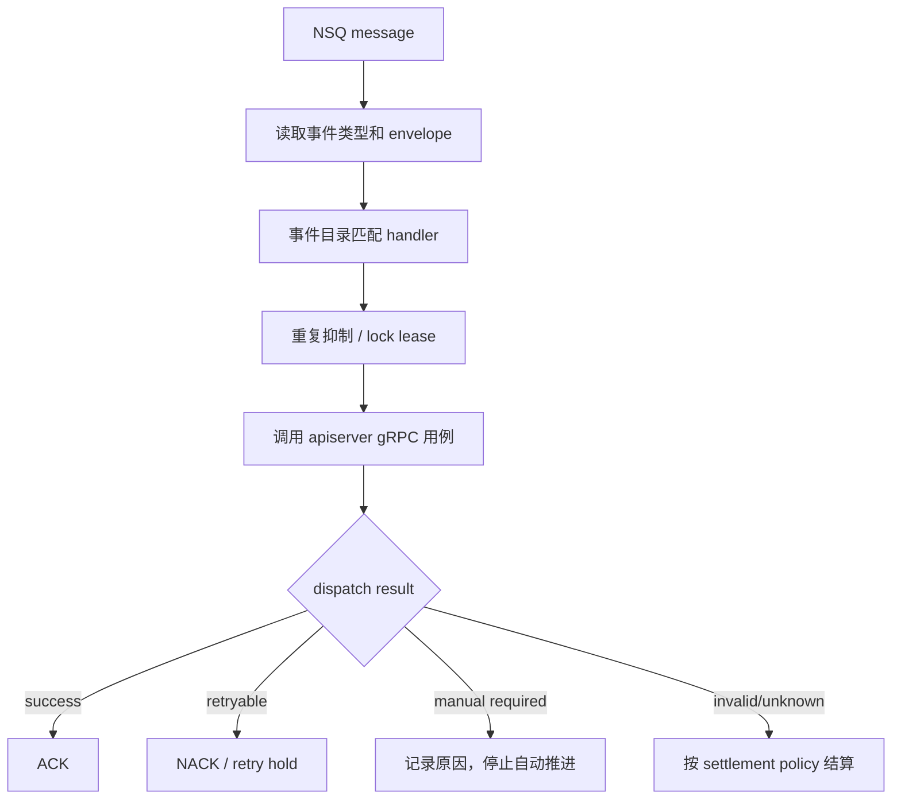

# qs-worker 运行时

## 1. 结论

`qs-worker` 是事件消费和异步执行控制进程。它把 NSQ 消息解析成对 `qs-apiserver` 窄化 gRPC 用例的调用，并负责重复抑制、执行租约、ACK/NACK、自动重试、retry hold 和死信记录。

worker 不拥有 Evaluation、Interpretation、Survey 的核心业务规则，也不直接修改它们的主业务存储。消息处理策略属于 worker，业务状态迁移仍属于 apiserver。

## 2. 启动模型

入口 `cmd/qs-worker/main.go` 进入 `internal/worker/process`，依次执行：

1. `prepare resources`：准备 MySQL、Redis、事件目录和 resilience 能力；
2. `initialize container`：装配 handler 所需的进程级依赖；
3. `initialize integrations`：创建并注册 apiserver gRPC clients；
4. `initialize runtime`：装配 metrics、subscriber、dead letter、retry hold 和 handler；
5. `register shutdown callback`：注册消费端优先的关闭顺序。

Run 阶段先启动 shutdown manager，然后等待 `SIGINT`/`SIGTERM`。实际事件消费在 runtime 初始化阶段订阅成功后已经开始。

## 3. 客户端能力与边界

worker client bundle 当前包含：

- `AnswerSheet`；
- `Internal`；
- `AssessmentIntake`；
- `EvaluationWorker`；
- `InterpretationAutomation`。

这些 service 按执行角色拆窄。例如 worker 调用 `ExecuteEvaluation` 或 `GenerateReportFromOutcome`，而不是获得 Evaluation repository 后自行更新状态。

worker 的 MySQL/Redis 用于死信、retry hold、执行租约、运行治理和状态投影；这不意味着它拥有 apiserver 的业务表。

## 4. 事件到用例的处理链

`configs/events.yaml` 是事件类型、topic、handler 和消费治理的目录事实。文档不复制一份固定事件清单，因为新增模型或后处理事件时清单会变化。

## 5. Handler 应做什么

一个合格的 worker handler 可以：

- 解码并校验事件 envelope/payload；
- 读取事件中的业务标识和 attempt 信息；
- 获取明确 workload 的 lock/lease，避免并发重复执行；
- 调用一个或多个窄化 gRPC 用例；
- 把结果归类为成功、可重试、不可自动重试或无效消息；
- 更新前台所需的短期报告状态；
- 返回结构化 dispatch result 供 transport 结算。

它不应：

- 在 handler 中重新实现计分、因子解释或报告规则；
- 直接写业务聚合表；
- 以“消息只投递一次”为前提；
- 对所有错误无限 NACK；
- 把 Redis 锁当作业务完成事实。

## 6. ACK、NACK 与重试治理

消息结算必须区分“处理失败”和“应该再次自动执行”：

| 结果 | 语义 |
| --- | --- |
| ACK success | 当前事件的用例已完成，或业务幂等判断确认无需重复执行 |
| ACK invalid/unknown | 消息格式或事件类型不适合当前 handler，继续投递没有业务价值 |
| NACK retryable | 临时依赖、租约或可恢复错误，可在预算内重新投递 |
| retry hold | 自动重试暂停或需要延迟治理，把消息保存到可恢复的 hold store |
| manual_required | 配置/数据/规则问题无法安全自动推进，需要人工确认和补偿 |

worker 的 transport delivery attempts 存在硬上限，当前代码最大不超过 8；旧的 `worker.max-retries` 已废弃。业务重试、Outbox 发布重试和 transport 投递次数是三个不同预算，不能合并成一个“重试次数”。

`retryable=false` 的正确边界是禁止系统继续自动尝试，不应等价于“永远不能处理”。管理员修复配置或数据后，未来可以通过要求明确确认、操作原因和审计结果的 Force Retry 重新驱动；若功能尚未闭环，文档必须保留为能力缺口。

## 7. 幂等与并发控制

事件驱动系统必须预期重复投递、进程重启和超时后结果未知：

- handler registry 只负责将事件路由到正确 factory；
- lock lease 降低同一业务工作被并发执行的概率；
- apiserver 的状态机与幂等校验决定重复调用是否安全；
- attempt、dead letter、hold 和审计记录用于解释“为什么还没完成”；
- 任何已受理但未完成的测评，都应能定位停在哪个阶段，并选择自动重试或人工补偿。

租约只是运行时互斥，不应替代业务幂等。即使租约过期后发生第二次调用，apiserver 也应能根据当前状态安全处理。

## 8. 运行时依赖

| 依赖 | 用途 | 不可用时的影响 |
| --- | --- | --- |
| NSQ | 接收可靠业务事件 | 停止取得新工作；Outbox 可等待后续发布 |
| apiserver gRPC | 执行业务用例 | 按错误分类重试、挂起或人工处理 |
| Redis | lock lease、运行时状态/信令 | 需要失败关闭或降级，不能无保护并发执行 |
| MySQL | dead letter、retry hold 等治理数据 | 无法保证治理记录时不应继续假装正常消费 |
| metrics HTTP | 暴露 worker 观测指标 | 可选观测能力，不拥有业务正确性 |

NSQ topic ensure 失败当前是非致命告警，随后订阅仍可能成功；是否继续运行应结合实际 broker 管理方式和 readiness 监控判断。

## 9. 并发模型

worker concurrency 和 subscriber max-in-flight 由配置决定，默认值不代表容量承诺。提高并发前要同时评估：

- apiserver gRPC 容量；
- MongoDB/MySQL 写入与事务能力；
- 单事件执行租约 TTL；
- handler 是否真正幂等；
- retry 风暴与下游故障时的放大效应。

吞吐不是只把 worker 数量调大。worker 是异步链路的流量放大点，必须与 apiserver 背压和事件优先级共同设计。

## 10. 关闭顺序

当前 worker 依次：

1. 停止 retry hold replayer；
2. Stop/Close subscriber，停止取得新消息并处理 transport 的在途关闭；
3. 关闭 publisher、dead-letter recorder、hold store；
4. 关闭 gRPC manager；
5. 关闭数据库/Redis profile；
6. 用 5 秒超时关闭 metrics server；
7. Cleanup Container/resilience。

这一顺序体现了“先停入口，再释放依赖”。但是否等待所有 handler 在途工作完成，还应以使用的 subscriber 实现和定向测试为准。

## 11. 源码证据

- 进程生命周期：`internal/worker/process`；
- runtime 装配：`internal/worker/process/runtime.go`；
- gRPC clients：`internal/worker/infra/grpcclient`、`integration/grpcclient`；
- handler registry 与实现：`internal/worker/handlers`；
- 消息订阅和 retry hold：`internal/worker/integration/messaging`；
- subscriber settlement 与 dead letter：`internal/pkg/eventing/transport`、`internal/worker/process/runtime_bootstrap.go`；
- 事件目录和通用语义：`configs/events.yaml`、`internal/pkg/eventing`。
