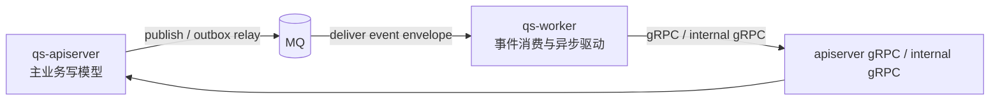
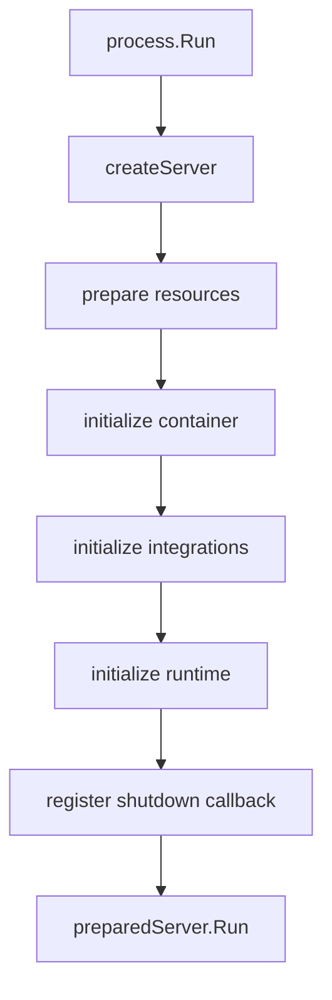
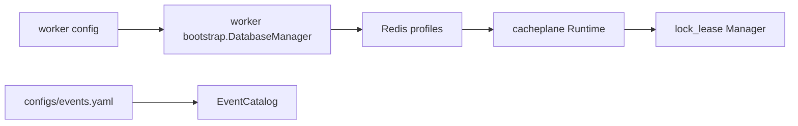
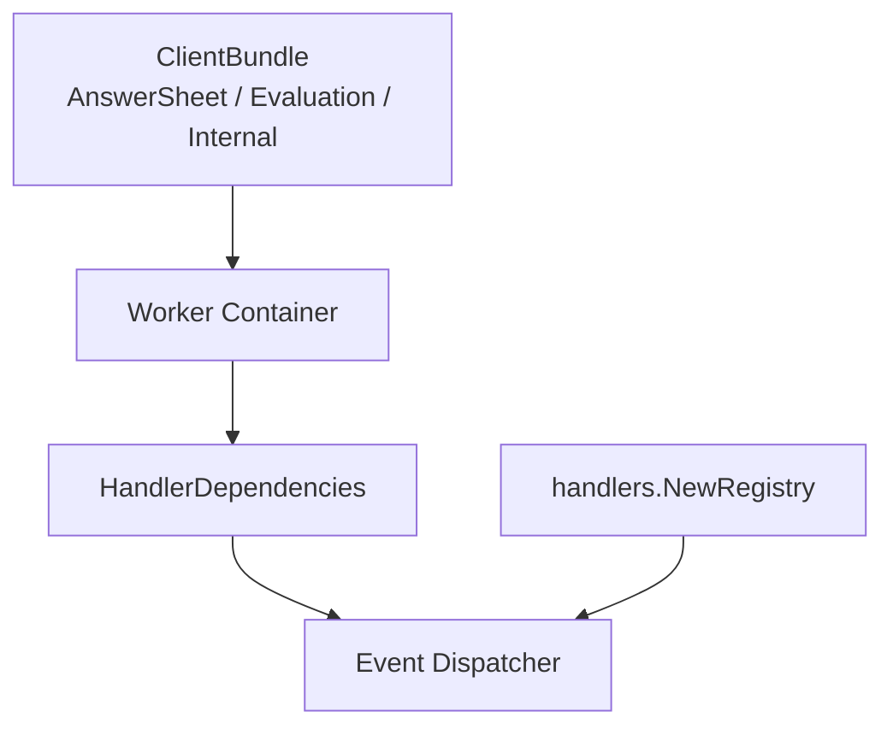
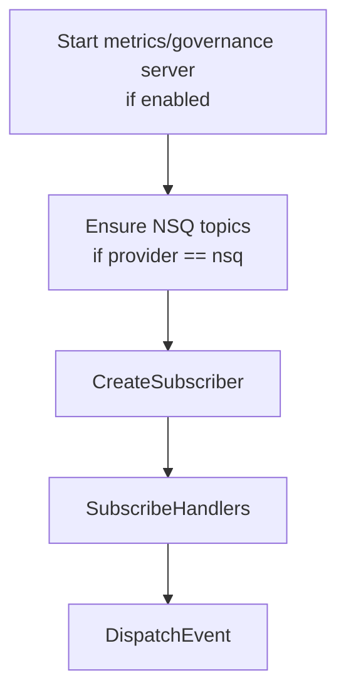
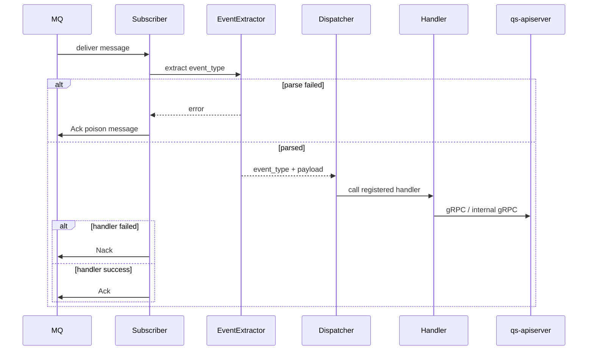

# qs-worker 运行时

**本文回答**：`qs-worker` 在运行时如何启动、如何装配 Redis / EventCatalog / gRPC client / event dispatcher / MQ subscriber，事件如何从 MQ 进入 handler，又如何通过 internal gRPC 回到 `qs-apiserver` 推进计分、测评、报告、统计和通知；本文不展开各业务模块内部规则，也不替代事件系统和业务模块深讲。

---

## 30 秒结论

| 维度 | 结论 |
| ---- | ---- |
| 运行时定位 | `qs-worker` 是**异步执行器**，负责消费 MQ 中的领域事件，并通过 gRPC / internal gRPC 驱动 `qs-apiserver` 内的业务服务 |
| 主状态归属 | worker 不维护第二套主业务写模型；答卷、测评、报告、统计等权威写入仍在 `qs-apiserver` 内完成 |
| 启动阶段 | `resources -> container -> integrations -> runtime -> shutdown` |
| 资源阶段 | 初始化 Redis profile runtime / lock lease，并加载 `configs/events.yaml` 生成 EventCatalog |
| 容器阶段 | 创建 worker container，持有 logger、lock manager、event catalog 和后续注入的 gRPC clients |
| 集成阶段 | 创建到 `qs-apiserver` 的 gRPC clients：AnswerSheet、Evaluation、Internal |
| runtime 阶段 | 可选启动 metrics/governance HTTP，确保 NSQ topics，创建 subscriber，并按 EventCatalog 订阅 topic |
| 事件分发 | `configs/events.yaml` 的 `handler` 字段必须能在 `handlers.NewRegistry()` 中找到；否则启动期会失败 |
| 消息确认 | 解析失败的 poison message 会 Ack；handler 执行失败会 Nack；成功后 Ack |
| 最容易误解 | worker 不是 MQ publisher，也不是业务主服务；它是“事件消费者 + handler registry + internal gRPC driver” |

---

## 1. 运行时角色：worker 是异步执行器

`qs-worker` 的工作不是“再跑一套业务模块”，而是把已经写入 MQ 的领域事件转换成对 `qs-apiserver` 的内部调用。



关键边界：

| 边界 | 当前事实 |
| ---- | -------- |
| worker 不直接拥有业务写模型 | 计分、测评、标签、报告、投影等业务动作通过 apiserver gRPC / internal gRPC 完成 |
| worker 不负责创建事件契约 | 事件类型、topic、delivery、handler 绑定以 `configs/events.yaml` 为准 |
| worker 不等同于 collection SubmitQueue | collection 的 SubmitQueue 是 BFF 进程内 memory channel；worker 消费的是 MQ |
| worker 不应绕过 EventCatalog | handler 注册与 topic 订阅由 EventCatalog 和显式 registry 共同约束 |

---

## 2. 从 main 到 Run：入口链路

worker 的进程入口很薄：

```text
cmd/qs-worker/main.go
  -> internal/worker.NewApp("qs-worker").Run()
  -> options.NewOptions()
  -> config.CreateConfigFromOptions(opts)
  -> internal/worker.Run(cfg)
  -> internal/worker/process.Run(cfg)
```

代码锚点：

| 层级 | 路径 | 职责 |
| ---- | ---- | ---- |
| main | `cmd/qs-worker/main.go` | 创建并运行 worker app |
| app | `internal/worker/app.go` | 初始化 log、创建 config、调用 Run |
| run | `internal/worker/run.go` | 进入 process runtime |
| process | `internal/worker/process/run.go` | 创建 server 并执行 `PrepareRun().Run()` |

这条链路说明：worker 的主逻辑不在 main，也不在 app.go，而在 `internal/worker/process/*` 和 `internal/worker/container/*`。

---

## 3. PrepareRun 五阶段

worker 的 `PrepareRun` 使用 `processruntime.Runner` 串起五个阶段：

```text
prepare resources
  -> initialize container
  -> initialize integrations
  -> initialize runtime
  -> register shutdown callback
```



| 阶段 | 代码锚点 | 主要产物 | 失败影响 |
| ---- | -------- | -------- | -------- |
| resources | `process/resource_bootstrap.go` | Redis runtime、lock manager、EventCatalog | Redis / event config 初始化失败会阻断启动 |
| container | `process/container_bootstrap.go` | worker Container | 只创建 container，不初始化 dispatcher |
| integrations | `process/integration_bootstrap.go` | gRPC client manager、ClientBundle、初始化 container | gRPC client 或 dispatcher 初始化失败会阻断启动 |
| runtime | `process/runtime_bootstrap.go` | metrics server、MQ subscriber、topic subscription | subscriber / subscribe 失败会阻断启动 |
| shutdown | `process/lifecycle.go` | subscriber、gRPC、Redis、metrics、container 的关闭 hook | 用于优雅释放资源 |

---

## 4. Resource 阶段：Redis runtime 与 EventCatalog

resource 阶段做两件核心事情：

1. 初始化 worker 的 Redis profile registry；
2. 加载事件配置并生成 EventCatalog。



### 4.1 Redis 与 lock lease

当前 worker 的 `DatabaseManager` 名称叫 database manager，但实际初始化逻辑集中在 Redis：它把默认 Redis 和 named profiles 组成 `NamedRedisRegistry`，再由 cacheplane runtime 构建 `lock_lease` family。

这意味着 worker 的 Redis 主要用于：

| 用途 | 说明 |
| ---- | ---- |
| 分布式锁 | 用于事件重复抑制、答卷处理等场景 |
| resilience 观测 | 暴露 lock / duplicate suppression 的运行状态 |
| MQ 消费保护 | 避免同一事件或同一业务对象被重复并发处理 |

当前 resource bootstrap 中没有把 worker 建成“直接写 MySQL / Mongo 的业务进程”。即使配置文件中存在 MySQL / Mongo 字段，worker 的运行时职责仍然是通过 gRPC 回到 apiserver 推进业务。

### 4.2 EventCatalog

默认事件配置路径是：

```text
configs/events.yaml
```

如果 worker options 中指定了 `EventConfigPath`，则使用指定路径。EventCatalog 是 worker 订阅 topic 和校验 handler 的基础，里面包含：

| 字段 | 用途 |
| ---- | ---- |
| `topics` | topic 逻辑名到 MQ topic name 的映射 |
| `events.*.topic` | 某个 event type 属于哪个 topic |
| `events.*.delivery` | `best_effort` 或 `durable_outbox` |
| `events.*.handler` | worker 侧应使用哪个 handler factory |
| `events.*.domain` / `aggregate` | 事件的业务归属说明 |

---

## 5. Container 阶段：worker container 是 handler runtime 的组合根

worker container 持有运行 dispatcher 所需的 runtime 依赖：

```text
logger
lockManager
lockBuilder
eventCatalog
gRPC clients
eventDispatcher
```

container 的初始化不是在 container stage 完成的，而是在 integration stage 注入 gRPC ClientBundle 后才执行 `container.Initialize()`。

原因是：event dispatcher 创建 handler factory 时，需要 gRPC clients、lock manager、notifier 等依赖；如果没有 gRPC client，handler 虽然能被注册，但真正处理事件时就缺少执行能力。



---

## 6. Integration 阶段：到 apiserver 的 gRPC client graph

worker 只需要面向 apiserver 的有限 client graph：

| Client | 主要用途 |
| ------ | -------- |
| `AnswerSheetClient` | 答卷相关读写辅助能力 |
| `EvaluationClient` | 测评 / 报告相关查询或调用能力 |
| `InternalClient` | 核心内部动作：计分、创建测评、执行评估、打标签、行为投影、任务通知等 |

gRPC integration 阶段的流程是：

```text
CreateGRPCClientManager(config.GRPC, timeout=30)
  -> RegisterClients()
  -> NewRegistry(manager)
  -> ClientBundle()
  -> container.InitializeRuntimeClients(bundle)
  -> container.Initialize()
```

`ClientBundle` 是 worker 运行时依赖图的显式边界。后续新增 worker 需要调用的 apiserver gRPC 能力时，应优先沿着这条路径维护，而不是在 handler 内临时 new client。

---

## 7. Event Dispatcher：EventCatalog 与 handler registry 必须一致

worker 的事件分发有两个真值源：

| 真值源 | 说明 |
| ------ | ---- |
| `configs/events.yaml` | event type、topic、delivery、handler 名称 |
| `internal/worker/handlers/catalog.go` | handler 名称到 handler factory 的显式注册表 |

dispatcher 初始化时会检查：`events.yaml` 里每个事件声明的 `handler` 是否存在于 `handlers.NewRegistry()`。

如果某个 handler 没注册，worker 启动会失败，而不是等到消费事件时才失败。这是一个很重要的运行时保护。

当前 registry 包含的 handler 名称包括：

| Handler | 对应事件类型 |
| ------- | ------------ |
| `answersheet_submitted_handler` | `answersheet.submitted` |
| `assessment_submitted_handler` | `assessment.submitted` |
| `assessment_interpreted_handler` | `assessment.interpreted` |
| `assessment_failed_handler` | `assessment.failed` |
| `report_generated_handler` | `report.generated` |
| `behavior_projector_handler` | `footprint.*` |
| `questionnaire_changed_handler` | `questionnaire.changed` |
| `scale_changed_handler` | `scale.changed` |
| `task_opened_handler` | `task.opened` |
| `task_completed_handler` | `task.completed` |
| `task_expired_handler` | `task.expired` |
| `task_canceled_handler` | `task.canceled` |

---

## 8. Runtime 阶段：metrics、topic ensure、subscriber、SubscribeHandlers

worker runtime stage 做四件事：



### 8.1 metrics / governance

如果配置中启用 metrics，worker 会启动 metrics server，并暴露：

| 能力 | 说明 |
| ---- | ---- |
| metrics | worker 消费、运行时状态等指标 |
| cache family status | Redis family 可用性 |
| resilience snapshot | duplicate suppression、lock 等保护能力状态 |

### 8.2 EnsureTopics

当 messaging provider 是 `nsq` 时，worker 会根据 EventCatalog 推导出需要订阅的 topic 列表，并尝试创建 topic。创建失败被记录为 warning，属于 non-fatal。

### 8.3 CreateSubscriber

`CreateSubscriber` 根据 messaging provider 创建 subscriber：

| Provider | 行为 |
| -------- | ---- |
| `nsq` | 使用 `NSQLookupdAddr` 创建 NSQ subscriber，并把 worker concurrency 映射到 MaxInFlight |
| `rabbitmq` | 使用 RabbitMQ URL 创建 subscriber |
| unknown | 记录 warning 后默认使用 NSQ |

### 8.4 SubscribeHandlers

`SubscribeHandlers` 从 runtime 读取 topic subscriptions，并对每个 topic 调用：

```text
subscriber.Subscribe(topicName, serviceName, msgHandler)
```

`serviceName` 通常来自 worker config 中的 `worker.service-name`，在 NSQ 语义中可以理解为 channel 名称。

---

## 9. 消息处理与 Ack / Nack 策略

worker 对消息的处理顺序如下：



策略表：

| 场景 | 行为 | 原因 |
| ---- | ---- | ---- |
| message metadata 无 `event_type`，payload 也无法解析 envelope | Ack invalid message | 避免 poison message 无限重试 |
| event type 存在但 dispatch / handler 失败 | Nack | 交给 MQ 重试机制 |
| dispatch 成功 | Ack | 表示本次事件处理完成 |
| Ack / Nack 本身失败 | 记录观测 outcome 和日志 | 供排障使用 |

这套策略的核心是：**无效消息不拖垮消费者，业务失败保留重试机会**。

---

## 10. 典型事件到 internal gRPC 的映射

下表是运行时视角，不替代业务模块文档。

| 事件 | Handler | 典型动作 |
| ---- | ------- | -------- |
| `answersheet.submitted` | `answersheet_submitted_handler` | 计算答卷分数、从答卷创建 Assessment |
| `assessment.submitted` | `assessment_submitted_handler` | 调用 EvaluateAssessment 执行评估 |
| `assessment.interpreted` | `assessment_interpreted_handler` | 评估完成后的后处理 |
| `assessment.failed` | `assessment_failed_handler` | 评估失败后的后处理 |
| `report.generated` | `report_generated_handler` | 打标签、报告相关副作用 |
| `footprint.*` | `behavior_projector_handler` | 投影行为足迹与服务过程 |
| `questionnaire.changed` | `questionnaire_changed_handler` | 发布后二维码等动作 |
| `scale.changed` | `scale_changed_handler` | 发布后二维码等动作 |
| `task.opened` | `task_opened_handler` | 任务开放通知 |
| `task.completed / expired / canceled` | 对应 task handler | 任务生命周期副作用 |

---

## 11. worker 与业务模块的关系

worker 看起来处理了很多业务事件，但它不拥有业务模块的领域模型。它只是把事件路由到 apiserver 内部能力。

| 业务域 | worker 的职责 | apiserver 的职责 |
| ------ | ------------- | ---------------- |
| Survey | 消费 `answersheet.submitted` 后触发后续动作 | 保存 AnswerSheet、校验问卷/答案、stage outbox |
| Evaluation | 触发创建 Assessment、执行评估、报告后处理 | Assessment 状态机、evaluation pipeline、report 保存 |
| Scale | 响应 `scale.changed` 触发发布后动作 | 量表、因子、规则、解读的权威模型 |
| Plan | 响应 `task.*` 做通知或副作用 | Plan / Task 状态机与调度 |
| Statistics | 投影行为事件、服务过程事件 | read model、聚合、同步与查询 |
| Actor | 标签、通知接收人相关动作 | Testee / Operator / Clinician 等参与者模型 |

---

## 12. shutdown：停止 subscriber，再关下游依赖

worker 的 shutdown hook 顺序是：

```text
stop subscriber
  -> close grpc manager
  -> close database / redis
  -> shutdown metrics
  -> cleanup container
```

这体现了一个合理的关闭原则：

1. 先停止 MQ 消费，避免继续接收新消息；
2. 再关闭 gRPC manager，避免 handler 继续调用 apiserver；
3. 再关闭 Redis；
4. 再关闭 metrics；
5. 最后清理 container 状态。

`preparedServer.Run()` 会启动 shutdown manager 后阻塞等待 `SIGINT` / `SIGTERM`，收到信号后返回，由 shutdown manager 执行回调。

---

## 13. 常见排障路径

### 13.1 worker 启动失败

优先按阶段判断：

| 日志 / 症状 | 首查位置 |
| ----------- | -------- |
| event config load failed | `configs/events.yaml` 路径、YAML 格式、worker `EventConfigPath` |
| handler not registered | `events.yaml` 的 `handler` 字段与 `handlers/catalog.go` 是否一致 |
| gRPC connect failed | `configs/worker.*.yaml` 的 `grpc.apiserver-addr`、TLS / mTLS 配置 |
| subscriber create failed | messaging provider、NSQ lookupd / RabbitMQ URL |
| subscribe failed | topic name、channel、MQ 可用性 |
| Redis lock unavailable | `redis_profiles.lock_cache`、`redis_runtime.families.lock_lease` |

### 13.2 事件没有被消费

检查顺序：

1. `configs/events.yaml` 中 event type 是否存在；
2. 事件是否被发到正确 topic；
3. worker 启动日志中是否打印了 topic subscription；
4. MQ 中是否有对应 topic / channel；
5. handler 名称是否存在于 `handlers.NewRegistry()`；
6. handler 是否 Nack 失败，查看 worker 日志；
7. handler 中 gRPC 调 apiserver 是否失败。

### 13.3 事件重复处理

优先检查：

| 检查项 | 说明 |
| ------ | ---- |
| MQ retry | Nack 或消费超时可能导致重投 |
| Redis lock | worker duplicate suppression 依赖 lock manager |
| handler 幂等 | 业务侧应能承受重复事件 |
| apiserver 幂等 | 例如按 answer_sheet_id 查询已有 Assessment、数据库唯一约束等 |

worker 的重复抑制不是替代业务幂等，而是降低重复并发窗口。最终幂等仍应由 apiserver 写模型和 repository 约束兜底。

---

## 14. 修改 worker 时该改哪里

| 变更类型 | 需要修改 |
| -------- | -------- |
| 新增事件类型 | `configs/events.yaml`，必要时新增 domain event / publisher / outbox |
| 新增 worker handler | `internal/worker/handlers/*`，并在 `handlers/catalog.go` 注册 |
| 新增 handler 所需依赖 | `handlers.Dependencies`、`worker/container/container.go`、必要时 `ClientBundle` |
| 新增 apiserver internal gRPC 调用 | proto、apiserver service、worker `InternalClient`、worker gRPC manager / client |
| 新增 MQ provider 行为 | `internal/worker/integration/messaging/runtime.go` |
| 新增 worker 观测 | metrics server、eventobservability、resilience snapshot |
| 新增锁或重复抑制 | lock keyspace、lock manager、handler、resilience docs |
| 改 shutdown 行为 | `internal/worker/process/lifecycle.go` |

---

## 15. 代码与契约锚点

| 类别 | 锚点 |
| ---- | ---- |
| 进程入口 | `cmd/qs-worker/main.go` |
| app 启动 | `internal/worker/app.go` |
| process runner | `internal/worker/process/runner.go` |
| resource bootstrap | `internal/worker/process/resource_bootstrap.go` |
| container bootstrap | `internal/worker/process/container_bootstrap.go` |
| integration bootstrap | `internal/worker/process/integration_bootstrap.go` |
| runtime bootstrap | `internal/worker/process/runtime_bootstrap.go` |
| lifecycle | `internal/worker/process/lifecycle.go` |
| worker container | `internal/worker/container/container.go` |
| gRPC client registry | `internal/worker/integration/grpcclient/registry.go` |
| messaging runtime | `internal/worker/integration/messaging/runtime.go` |
| event dispatcher | `internal/worker/integration/eventing/dispatcher.go` |
| handler registry | `internal/worker/handlers/catalog.go` |
| handler dependencies | `internal/worker/handlers/registry.go` |
| 事件机器契约 | `configs/events.yaml` |
| internal gRPC 契约 | `internal/apiserver/interface/grpc/proto/internalapi/internal.proto` |
| worker dev config | `configs/worker.dev.yaml` |
| worker prod config | `configs/worker.prod.yaml` |

---

## 16. Verify

```bash
# worker 相关单测
go test ./internal/worker/...

# 事件 runtime / catalog / codec 相关测试
go test ./internal/pkg/eventcatalog/... ./internal/pkg/eventruntime/... ./internal/pkg/eventcodec/...

# 检查事件配置和 handler 绑定，最直接的方法是启动 worker
make build-worker
make run-worker

# 文档卫生
make docs-hygiene
```

启动 worker 前，请先确认：

```bash
make check-redis
make check-nsq
```

如果使用 RabbitMQ，则确认 `configs/worker.*.yaml` 中的 RabbitMQ URL 和 provider 设置一致。

---

## 17. 下一跳

| 想继续看什么 | 文档 |
| ------------ | ---- |
| 三进程整体协作 | [00-三进程协作总览.md](./00-三进程协作总览.md) |
| apiserver 组合根 | [01-qs-apiserver启动与组合根.md](./01-qs-apiserver启动与组合根.md) |
| collection BFF 运行时 | [02-collection-server运行时.md](./02-collection-server运行时.md) |
| gRPC 与进程间调用 | [04-进程间调用与gRPC.md](./04-进程间调用与gRPC.md) |
| 后台任务与调度 | [06-后台任务与调度.md](./06-后台任务与调度.md) |
| 事件系统细节 | [../03-基础设施/event/README.md](../03-基础设施/event/README.md) |
| 核心业务主链路 | [../00-总览/03-核心业务链路.md](../00-总览/03-核心业务链路.md) |
