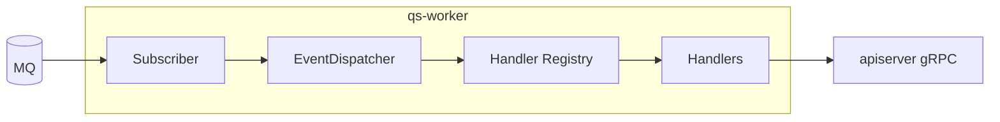
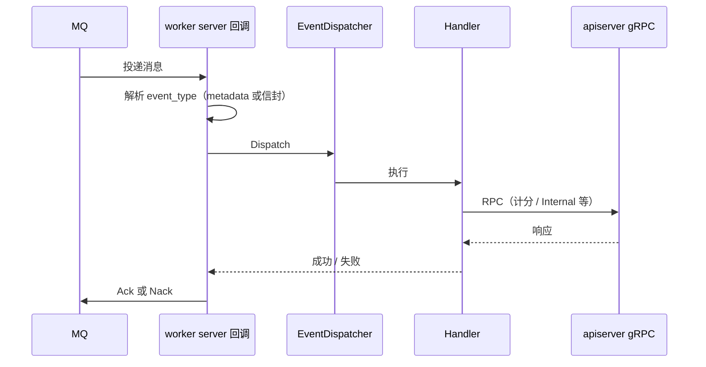

# worker（qs-worker）

**本文回答**：这篇文档解释 `qs-worker` 在运行时如何把 MQ 事件转成对 `qs-apiserver` 的 gRPC 回调、消息分发和 Ack/Nack 是怎么工作的、常见 `event_type -> handler -> RPC` 映射是什么、以及它与 Redis、事件配置和主业务容器的边界；本文先给结论和速查，再展开时序与代码入口。

## 30 秒结论

如果只看一屏，先看下面这张表：

| 维度 | 结论 |
| ---- | ---- |
| 进程角色 | `qs-worker` 是异步执行器，负责消费事件、分发给 handler，并通过 gRPC 回调 `qs-apiserver` |
| 上下游关系 | 上游是 MQ；核心下游是 `qs-apiserver` 的 AnswerSheet / Evaluation / Internal gRPC |
| 最重要的运行时认识 | worker 不装配完整领域容器，也不持有业务写真值；它只是把事件驱动回主服务 |
| 事件真值 | `event_type`、topic 和 handler 绑定最终以 `configs/events.yaml` 为准，代码注册必须与之对齐 |
| 本地依赖 | Redis 只用于锁、统计辅助等 handler 侧能力，不改变业务状态归属 |
| 排障入口 | 先看 `events.yaml`，再看 `server.go` 分发链、handler 注册和对应 gRPC client |

## 重点速查（继续往下读前先记这几条）

1. **worker 只负责驱动，不负责收口状态**：业务真值仍在 `qs-apiserver`，worker 只是消费事件并发起内部 RPC。  
2. **`event_type` 是主索引**：排障时先确认消息上的 `event_type`，再对照 yaml 的 handler 键和代码注册。  
3. **Ack/Nack 取决于 Dispatch 结果**：理解投递语义时，要从 `createDispatchHandler` 这一层看成功、失败和重试。  
4. **并发和 backlog 共享只看 worker 配置**：当前真正影响 NSQ in-flight 的是 `worker.concurrency`；多实例共享同一 backlog 取决于相同的 `worker.service-name`。  
4. **Redis 是侧载能力**：锁、统计和幂等辅助可能用到 Redis，但这不等于 worker 成了独立业务服务。  

**组件定位**：**MQ 消费进程**；根据 [`configs/events.yaml`](../../configs/events.yaml) 订阅 Topic；将消息按 **event_type** 分发给 handler；通过 **gRPC** 回调 **apiserver** 完成业务写。**不**暴露业务 HTTP；**不**装配完整领域容器。  
事件拓扑见 [03-事件系统](../03-基础设施/01-事件系统.md)；gRPC 客户端表见 [04-gRPC](../04-接口与运维/02-gRPC契约.md)。

---

## 这个进程在整体里承担什么

先回答角色、上下游和本地依赖，再看内部结构图。

| 维度 | 说明 |
| ---- | ---- |
| **角色** | 异步执行器：把「已发布事件」转成「对 apiserver 的 RPC」 |
| **上游** | **MQ**（apiserver 发布的 Topic） |
| **下游（兄弟组件）** | **apiserver gRPC**（AnswerSheet / Evaluation / Internal） |
| **本地依赖** | **Redis**（锁、统计辅助等，视 handler） |

---

### 内部运行示意图

**关键点**：**handler 自注册**（`init()`），绑定关系需与 **events.yaml** 一致。

---

## 单条消息在这里怎么被处理

### 单条消息处理时序

**Verify**：事件类型字符串与发布端、yaml 配置 **三方一致**。

---

## 常见事件怎样映射到 handler 和 gRPC

下表仅列 **主链路上常用事件**与**主要 RPC**，便于从消息追到代码；**完整映射与 handler 键名**以 [`configs/events.yaml`](../../configs/events.yaml) 为准。未写明的分支（如仅打日志、仅 Redis 统计）见各 `*_handler.go`。

| event_type（节选） | `events.yaml` 中 handler 键 | 主要 gRPC / 侧载（摘要） |
| ------------------ | ----------------------------- | ------------------------- |
| `answersheet.submitted` | `answersheet_submitted_handler` | **Internal**：`CalculateAnswerSheetScore` → `CreateAssessmentFromAnswerSheet` |
| `assessment.submitted` | `assessment_submitted_handler` | 内联 **statistics** handler；需评估时 **Internal**：`EvaluateAssessment` |
| `assessment.interpreted` | `assessment_interpreted_handler` | 内联 **statistics**；无固定必选 Internal |
| `assessment.failed` | `assessment_failed_handler` | 记录失败日志；当前未接更强告警动作 |
| `report.generated` | `report_generated_handler` | **Evaluation**：`GetAssessmentReport`；**Internal**：`TagTestee` |
| `questionnaire.changed` | `questionnaire_changed_handler` | `action=published` 时 **Internal**：`GenerateQuestionnaireQRCode`；其他 action 仅日志 |
| `scale.changed` | `scale_changed_handler` | `action=published` 时 **Internal**：`GenerateScaleQRCode`；其他 action 仅日志 |
| `task.opened` | `task_opened_handler` | **Internal**：`SendTaskOpenedMiniProgramNotification` |
| `task.completed` / `task.expired` / `task.canceled` | 各 `task_*_handler` | 通过 `Notifier` 发送完成/过期/取消通知 |

**当前没有计划级生命周期事件**：计划生命周期本身已回归同步业务逻辑，异步副作用统一沉到 `task.*`。

---

## Ack/Nack 与投递语义该怎么理解

**本进程内**（[server.go `createDispatchHandler`](../../internal/worker/server.go)）：

| 情况 | 行为 |
| ---- | ---- |
| 能解析 `event_type` 且 **DispatchEvent 成功** | **`msg.Ack()`** |
| **DispatchEvent 返回 error** | **`msg.Nack()`**（是否重投由 **MQ 与 messaging 实现**决定） |
| **既无 metadata `event_type`、payload 也无法解析为信封** | **`msg.Ack()`**（避免毒消息永久堆积） |

**请勿默认「至少一次」**：

- 成功路径是 **Ack 一次**；**Nack 后是否再次投递**依赖底层 MQ 与 `component-base` 的实现映射，本文不把它包装成统一的“固定重试次数”承诺。
- 当前 `events.yaml` 已经没有旧版 consumer 重试 / 并发字段；不要再按旧 schema 理解 worker 的投递语义。
- **未见**独立的 **死信队列（DLQ）** 抽象；持久化失败类问题依赖 **日志、MQ 控制台、重放**，而非本文定义的 DLQ。

**业务侧**：部分 handler 使用 **Redis 幂等键**（如统计去重），与 **MQ 投递语义** 是两层问题；设计幂等仍以 **02 / handler 代码** 为准。

### 并发与同 channel 扩 worker

当前 worker 的 NSQ in-flight 上限来自 `worker.concurrency`，代码锚点在 [server.go](../../internal/worker/server.go) 创建 subscriber 的路径。

多实例要共同消费同一个 NSQ backlog，关键是：

- 使用相同的 `worker.service-name`

因为这个值会作为订阅 channel 名传给 MQ。也就是说，“同 channel 扩 worker”靠的是**副本数增加 + 相同 service-name**，不是在 `events.yaml` 里再配一套 per-topic 并发。

## 它和其它组件怎么交互

### 与其它组件的交互

| 对方 | 方式 | 说明 |
| ---- | ---- | ---- |
| **apiserver** | gRPC（主动调用） | 业务写回主服务 |
| **MQ** | Subscribe | 不发布业务事件 |
| **IAM** | 无直接模块 | gRPC 鉴权策略见 [03-04](../03-基础设施/04-IAM与认证.md) |

## 排障时先看什么

### 核心功能与关键点

| 功能 | 关键点 | 代码锚点 |
| ---- | ------ | -------- |
| **订阅** | NSQ / RabbitMQ 等由配置选择；Topic 列表来自 **events.yaml** | [server.go](../../internal/worker/server.go) |
| **分发** | metadata `event_type` 优先 | [event_dispatcher.go](../../internal/worker/application/event_dispatcher.go) |
| **注册表** | `init()` 注册，运行时查找 | [handlers/registry.go](../../internal/worker/handlers/registry.go) |
| **gRPC** | 三类客户端注入容器 | [grpc_client_registry.go](../../internal/worker/grpc_client_registry.go) |
| **典型链路** | 见上文“常见事件怎样映射到 handler 和 gRPC”；答卷/测评/报告主路径 | `handlers/*_handler.go` |

### 关键代码入口（索引）

| 关注点 | 路径 |
| ------ | ---- |
| 进程入口 | [cmd/qs-worker/main.go](../../cmd/qs-worker/main.go)、[app.go](../../internal/worker/app.go)、[run.go](../../internal/worker/run.go) |
| 配置 | [options/options.go](../../internal/worker/options/options.go) |

## 边界与注意事项

- **无 HTTP 业务端口**；排障靠日志、MQ 积压、gRPC 错误。  
- **信封/metadata 变更**会导致分发失败，需与 apiserver 发布端同步升级。  
- **退出**：信号关闭 subscriber 与连接（见 server 实现）。

---

*说明：写作习惯可对照 [CONTRIBUTING-DOCS.md](../CONTRIBUTING-DOCS.md)；本篇按「运行时组件」体裁组织。*
