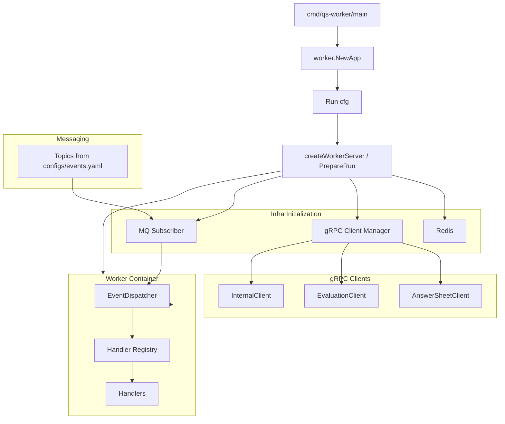

# worker

本文档说明 `qs-worker` 作为事件处理运行时是如何启动、订阅和分发后台任务的。

## 30 秒了解系统

`qs-worker` 是一个事件消费进程，职责不是直接持有主业务模块，而是：

- 订阅 `apiserver` 发布的领域事件
- 把事件分发到对应 handler
- 通过 gRPC 回调 `apiserver` 的 `InternalService` 和其他服务
- 执行评估、报告后处理、统计更新、计划相关后台动作

代码入口：

- [cmd/qs-worker/main.go](../../cmd/qs-worker/main.go)
- [internal/worker/app.go](../../internal/worker/app.go)
- [internal/worker/run.go](../../internal/worker/run.go)

## 核心架构

## 核心设计原则

- 事件消费与业务写入分离：`worker` 负责触发流程，不直接承载主业务持久化。
- 配置驱动订阅：Topic、事件类型、handler 绑定由 `configs/events.yaml` 决定。
- 处理器自注册：handler 通过 `init()` 注册，分发器运行时统一装配。
- 回调主服务：实际评估、答卷计分、创建测评、打标签等操作通过 `apiserver` 内部 gRPC 执行。

## 职责

`worker` 的运行时职责包括：

- 初始化 Redis
- 建立到 `apiserver` 的 gRPC 客户端连接
- 初始化事件分发器和处理器注册表
- 根据配置创建 MQ Subscriber
- 订阅所有 Topic
- 将收到的消息按 `event_type` 分发到对应 handler
- 处理退出信号并优雅关闭连接

关键代码：

- [internal/worker/server.go](../../internal/worker/server.go)
- [internal/worker/container/container.go](../../internal/worker/container/container.go)
- [internal/worker/application/event_dispatcher.go](../../internal/worker/application/event_dispatcher.go)

## 启动流程

### 1. 入口与配置

入口层负责创建 `Options`、初始化日志并转成运行配置。

代码入口：

- [internal/worker/app.go](../../internal/worker/app.go)
- [internal/worker/options/options.go](../../internal/worker/options/options.go)

### 2. 基础设施准备

`PrepareRun` 的准备顺序是：

1. 初始化 Redis
2. 创建到 `apiserver` 的 gRPC 客户端管理器
3. 创建容器
4. 把 gRPC client 注入容器
5. 初始化 `EventDispatcher`
6. 根据消息队列配置创建 Subscriber
7. 订阅所有 Topic

代码入口：

- [internal/worker/database.go](../../internal/worker/database.go)
- [internal/worker/grpc_client_registry.go](../../internal/worker/grpc_client_registry.go)
- [internal/worker/infra/grpcclient/manager.go](../../internal/worker/infra/grpcclient/manager.go)
- [internal/worker/application/event_dispatcher.go](../../internal/worker/application/event_dispatcher.go)

### 3. 订阅与分发

运行期最核心的逻辑在两步：

- 先根据 `configs/events.yaml` 生成需要订阅的 Topic 列表
- 再将消息按 `event_type` 分发到 handler

代码入口：

- [configs/events.yaml](../../configs/events.yaml)
- [internal/worker/server.go](../../internal/worker/server.go)
- [internal/worker/handlers/registry.go](../../internal/worker/handlers/registry.go)

## 消息处理模型

### Topic 订阅

当前 `worker` 支持的消息提供者包括：

- NSQ
- RabbitMQ

创建逻辑：

- [internal/worker/server.go](../../internal/worker/server.go)

当使用 NSQ 时，还会尝试预创建 Topic，减少启动阶段的 `TOPIC_NOT_FOUND` 噪音。

### Handler 注册

处理器通过 `init()` 自注册，运行时不会手动一条条写死绑定关系。

典型代码：

- [internal/worker/handlers/answersheet_handler.go](../../internal/worker/handlers/answersheet_handler.go)
- [internal/worker/handlers/assessment_handler.go](../../internal/worker/handlers/assessment_handler.go)
- [internal/worker/handlers/report_handler.go](../../internal/worker/handlers/report_handler.go)
- [internal/worker/handlers/plan_handler.go](../../internal/worker/handlers/plan_handler.go)
- [internal/worker/handlers/statistics_handler.go](../../internal/worker/handlers/statistics_handler.go)

### 分发规则

分发顺序是：

1. 优先从消息 metadata 读取 `event_type`
2. 若缺失，则回退到 payload 的事件信封解析
3. 找到对应 handler 后执行
4. 成功则 `Ack`，失败则 `Nack`

代码入口：

- [internal/worker/server.go](../../internal/worker/server.go)
- [internal/worker/handlers/registry.go](../../internal/worker/handlers/registry.go)

## 常见后台链路

### 答卷事件

- 处理 `answersheet.submitted`
- 先计算答卷分数
- 再创建 Assessment

代码入口：

- [internal/worker/handlers/answersheet_handler.go](../../internal/worker/handlers/answersheet_handler.go)

### 测评事件

- 处理 `assessment.submitted`
- 如果有关联量表，则执行评估
- 同步触发统计更新

代码入口：

- [internal/worker/handlers/assessment_handler.go](../../internal/worker/handlers/assessment_handler.go)

### 报告事件

- 处理 `report.generated`
- 抽取高风险因子
- 给受试者打标签

代码入口：

- [internal/worker/handlers/report_handler.go](../../internal/worker/handlers/report_handler.go)

## 关键配置项

最重要的配置分组：

- `messaging`：消息队列提供者和地址
- `grpc`：`apiserver` gRPC 地址、TLS / mTLS
- `worker`：并发数、服务名、事件配置路径
- `redis`：分布式锁和统计缓存辅助能力
- `cache`：是否禁用统计缓存

代码入口：

- [internal/worker/options/options.go](../../internal/worker/options/options.go)

## 边界与注意事项

- `worker` 没有自己的 HTTP 服务，也不直接暴露业务接口。
- 它虽然消费事件，但很多动作最终还是通过 `InternalClient` 回到 `apiserver` 执行。
- 如果 `event_type` 不在 metadata 中，分发会依赖 payload 的事件信封格式，因此发布端必须保持事件结构稳定。
- 当前退出逻辑以进程信号为主，收到退出信号后会停止 subscriber、关闭 gRPC 和 Redis 连接。
