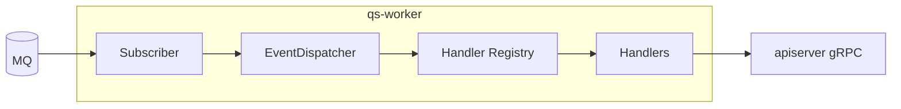
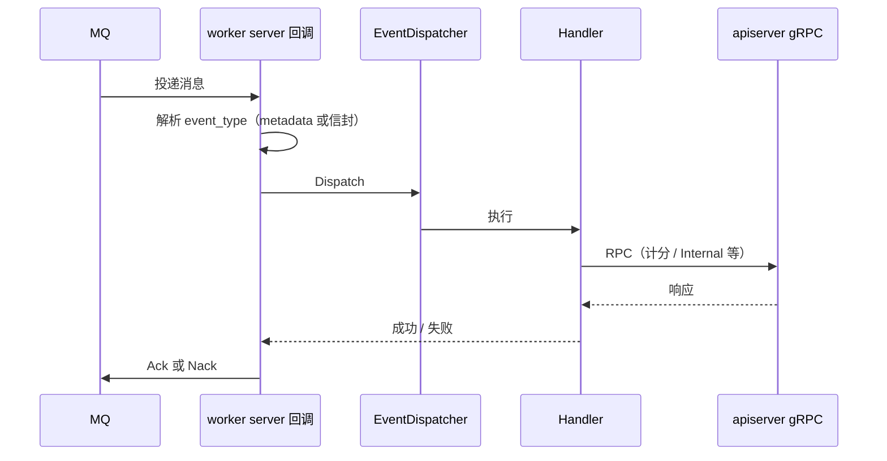

# worker（qs-worker）

**组件定位**：**MQ 消费进程**；根据 [`configs/events.yaml`](../../configs/events.yaml) 订阅 Topic；将消息按 **event_type** 分发给 handler；通过 **gRPC** 回调 **apiserver** 完成业务写。**不**暴露业务 HTTP；**不**装配完整领域容器。  
事件拓扑见 [03-事件系统](../03-基础设施/01-事件系统.md)；gRPC 客户端表见 [04-gRPC](../04-接口与运维/02-gRPC契约.md)。

---

## 1. 组件定位（在整体中的位置）

| 维度 | 说明 |
| ---- | ---- |
| **角色** | 异步执行器：把「已发布事件」转成「对 apiserver 的 RPC」 |
| **上游** | **MQ**（apiserver 发布的 Topic） |
| **下游（兄弟组件）** | **apiserver gRPC**（AnswerSheet / Evaluation / Internal） |
| **本地依赖** | **Redis**（锁、统计辅助等，视 handler） |

---

## 2. 内部运行示意图

**关键点**：**handler 自注册**（`init()`），绑定关系需与 **events.yaml** 一致。

---

## 3. 单条消息处理时序

**Verify**：事件类型字符串与发布端、yaml 配置 **三方一致**。

---

## 4. 典型 event_type → handler → gRPC（速查）

下表仅列 **主链路上常用事件**与**主要 RPC**，便于从消息追到代码；**完整映射与 handler 键名**以 [`configs/events.yaml`](../../configs/events.yaml) 为准。未写明的分支（如仅打日志、仅 Redis 统计）见各 `*_handler.go`。

| event_type（节选） | `events.yaml` 中 handler 键 | 主要 gRPC / 侧载（摘要） |
| ------------------ | ----------------------------- | ------------------------- |
| `answersheet.submitted` | `answersheet_submitted_handler` | **Internal**：`CalculateAnswerSheetScore` → `CreateAssessmentFromAnswerSheet` |
| `assessment.submitted` | `assessment_submitted_handler` | 内联 **statistics** handler；需评估时 **Internal**：`EvaluateAssessment` |
| `assessment.interpreted` | `assessment_interpreted_handler` | 内联 **statistics**；无固定必选 Internal |
| `report.generated` | `report_generated_handler` | **Evaluation**：`GetAssessmentReport`；**Internal**：`TagTestee` |
| `questionnaire.published` | `questionnaire_published_handler` | **Internal**：`GenerateQuestionnaireQRCode`（有客户端时） |
| `scale.published` | `scale_published_handler` | **Internal**：`GenerateScaleQRCode`（有客户端时） |
| `plan.*` / `task.*` / `report.exported` / `assessment.failed` 等 | 各 `*_handler` | 多为日志、占位或内联统计；**是否调 gRPC 以代码为准** |

---

## 5. Ack/Nack、重试与投递语义（边界）

**本进程内**（[server.go `createDispatchHandler`](../../internal/worker/server.go)）：

| 情况 | 行为 |
| ---- | ---- |
| 能解析 `event_type` 且 **DispatchEvent 成功** | **`msg.Ack()`** |
| **DispatchEvent 返回 error** | **`msg.Nack()`**（是否重投由 **MQ 与 messaging 实现**决定） |
| **既无 metadata `event_type`、payload 也无法解析为信封** | **`msg.Ack()`**（避免毒消息永久堆积） |

**请勿默认「至少一次」**：  
- 成功路径是 **Ack 一次**；**Nack 后是否再次投递**依赖 **NSQ / RabbitMQ** 及 **component-base** 对 `Nack` 的映射，**本仓库 worker 文档不承诺**全局 **at-least-once** 或固定 **重试次数**。  
- [`events.yaml`](../../configs/events.yaml) Topic 下的 **`consumer.retry`** 等字段为**配置结构的一部分**；是否在订阅层实现**退避重试**，以实现与部署为准，**勿与业务幂等等价**。  
- **未见**独立的 **死信队列（DLQ）** 抽象；持久化失败类问题依赖 **日志、MQ 控制台、重放**，而非本文定义的 DLQ。

**业务侧**：部分 handler 使用 **Redis 幂等键**（如统计去重），与 **MQ 投递语义** 是两层问题；设计幂等仍以 **02 / handler 代码** 为准。

---

## 6. 核心功能与关键点

| 功能 | 关键点 | 代码锚点 |
| ---- | ------ | -------- |
| **订阅** | NSQ / RabbitMQ 等由配置选择；Topic 列表来自 **events.yaml** | [server.go](../../internal/worker/server.go) |
| **分发** | metadata `event_type` 优先 | [event_dispatcher.go](../../internal/worker/application/event_dispatcher.go) |
| **注册表** | `init()` 注册，运行时查找 | [handlers/registry.go](../../internal/worker/handlers/registry.go) |
| **gRPC** | 三类客户端注入容器 | [grpc_client_registry.go](../../internal/worker/grpc_client_registry.go) |
| **典型链路** | 见 **§4**；答卷/测评/报告主路径 | `handlers/*_handler.go` |

---

## 7. 与其它组件的交互

| 对方 | 方式 | 说明 |
| ---- | ---- | ---- |
| **apiserver** | gRPC（主动调用） | 业务写回主服务 |
| **MQ** | Subscribe | 不发布业务事件 |
| **IAM** | 无直接模块 | gRPC 鉴权策略见 [03-04](../03-基础设施/04-IAM与认证.md) |

---

## 8. 关键代码入口（索引）

| 关注点 | 路径 |
| ------ | ---- |
| 进程入口 | [cmd/qs-worker/main.go](../../cmd/qs-worker/main.go)、[app.go](../../internal/worker/app.go)、[run.go](../../internal/worker/run.go) |
| 配置 | [options/options.go](../../internal/worker/options/options.go) |

---

## 9. 边界与注意事项

- **无 HTTP 业务端口**；排障靠日志、MQ 积压、gRPC 错误。  
- **信封/metadata 变更**会导致分发失败，需与 apiserver 发布端同步升级。  
- **退出**：信号关闭 subscriber 与连接（见 server 实现）。

---

*说明：写作习惯可对照 [CONTRIBUTING-DOCS.md](../CONTRIBUTING-DOCS.md)；本篇按「运行时组件」体裁组织。*
