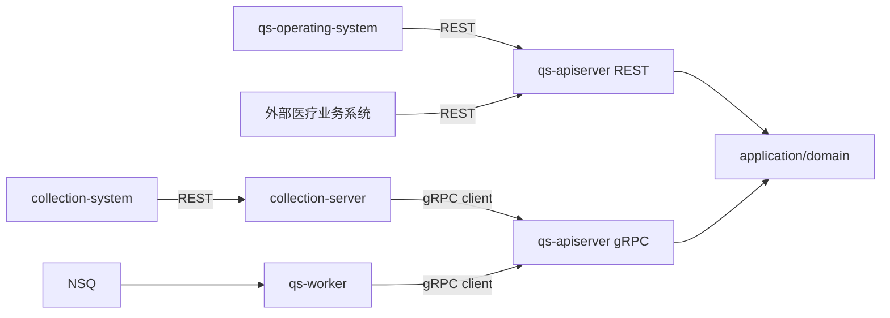

# 进程间调用与 gRPC

## 1. 结论

gRPC 是 collection-server、qs-worker 回到 qs-apiserver 业务核心的同步边界。它暴露的是面向调用角色的 application capability，不是数据库 repository，也不是把整个领域模块远程化。

REST/OpenAPI 与 gRPC/proto 服务于不同调用方：REST 负责外部产品接口，gRPC 负责仓库内部进程协作。二者可以调用同一应用服务，但不能依靠 prose 文档手工复制字段保持一致。

## 2. 调用拓扑

医生发起测评与查看报告时，由外部医疗业务系统直接调用 qs-apiserver；是否存在独立医生小程序是外部系统职责，qs-server 不需要感知其前端形态。

## 3. 契约事实源

| 内容 | 权威位置 |
| --- | --- |
| 手写 gRPC schema | `api/grpc/proto` |
| 生成代码 | `api/grpc/gen` |
| 生成脚本 | `scripts/proto/generate.sh` |
| apiserver 服务注册 | `internal/apiserver/transport/grpc/registry.go` |
| apiserver service adapter | `internal/apiserver/transport/grpc/service` |
| collection client adapter | `internal/collection-server/infra/grpcclient` |
| worker client adapter | `internal/worker/infra/grpcclient` |

修改 proto 后应重新生成代码并验证 server/client。不要直接编辑 `api/grpc/gen`，也不要只更新一侧 adapter。

## 4. 当前服务分组

apiserver registry 根据模块依赖注册以下角色化能力：

### 4.1 Survey 与目录读取

- `AnswerSheetService`：答卷提交与管理；
- `QuestionnaireService`：已发布问卷读取；
- `AssessmentModelCatalogService`：已发布测评模型目录读取。

运行时只向 collection 暴露已发布数据，运营草稿和发布过程仍由 apiserver 的运营 REST 用例管理。

### 4.2 Actor 与 Plan

- `ActorService`：受试者、填写关系等参与者能力；
- `PlanCommandService`：Plan/Task 写侧命令。

### 4.3 Evaluation 与 Interpretation

- `AssessmentIntakeService`：把答卷计分、模型绑定、Plan Task 解析和测评受理连接成 journey；
- `TesteeEvaluationService`：面向受试者的测评查询；
- `EvaluationWorkerService`：面向 worker 的执行能力；
- `ParticipantReportService`：面向参与者的报告查询；
- `InterpretationAutomationService`：面向 worker 的自动报告生成能力。

### 4.4 InternalService

`InternalService` 汇集只应由内部运行时调用的后处理能力，例如关注状态同步、发布后动作、行为统计投影、二维码生成和小程序通知。它不是“任何内部代码都可以随意增加方法”的杂物箱；新增方法仍需说明调用角色和业务边界。

proto 中还可能存在已生成但未被当前 registry 注册的能力。判断线上可用性必须同时检查 registry 依赖和启动日志。

## 5. 为什么服务按调用角色拆分

如果把 Evaluation 作为一个巨大的 CRUD service 暴露，collection 和 worker 很容易获得超出职责所需的写能力。当前拆分让调用方只能看到其角色需要的接口：

- collection 读取问卷、提交答卷、查询受试者测评和报告；
- worker 执行 intake、evaluation、interpretation 和内部后处理；
- 核心状态迁移由 apiserver application service 约束。

这是一种端口最小化设计。它不能替代服务端授权，但可以减少误用面并让契约更容易解释。

## 6. 元数据与上下文传播

跨进程调用至少要区分三类上下文：

1. **观测上下文**：request ID、trace 信息，用于串联 REST → gRPC → 日志；
2. **用户身份上下文**：IAM 用户、tenant domain、授权快照来源；
3. **业务范围上下文**：QS `org_id`、testee、filler 等用例参数。

collection client interceptor 会把现有 `x-request-id` 写入 gRPC metadata，apiserver server interceptor 再投影到服务端 context。worker client 当前没有同等明确的 request-id interceptor，因此不能把“所有异步调用都已端到端透传请求标识”写成现状；异步链路更适合使用 event ID、correlation ID 和 assessment ID 追踪。

用户 token、服务身份和业务参与者不能混成同一字段。即使服务间连接已经通过 mTLS 认证，apiserver 仍需校验 org/testee 等业务范围。

## 7. 超时、并发与连接管理

collection gRPC manager 当前提供：

- 单次 RPC timeout；
- 共享 inflight semaphore 与有界等待；
- TLS/mTLS；
- 可选 PerRPC service JWT；
- request ID metadata 传播。

worker manager 提供 RPC timeout 和 TLS/mTLS，但当前没有 collection 同样的共享 inflight Gate。两侧配置虽有 `PoolSize` 字段，当前 manager 实际以一个 `grpc.ClientConn` 注册各 service client，不能把它描述成已实现多连接池。

调用方 timeout 只限定等待时间，不意味着服务端事务一定已回滚。超时后的重试必须依赖幂等键和业务状态查询，不能简单假设“超时就是没有执行”。

## 8. 错误边界

gRPC service adapter 负责把 application/domain 错误映射为稳定 status code；REST handler 再按其产品契约映射 HTTP 响应。建议保持以下语义：

- `InvalidArgument`：请求结构、幂等键或业务输入无效；
- `Unauthenticated`：没有可信身份；
- `PermissionDenied`：身份有效但无权访问目标；
- `NotFound`：目标业务资源不存在；
- `AlreadyExists` / 幂等结果：根据用例返回已有事实；
- `ResourceExhausted`：并发或容量预算耗尽；
- `Unavailable`：必要依赖暂时不可用；
- `Internal`：没有被稳定分类的服务端错误。

不要在 client 侧通过错误字符串猜业务类型，也不要把所有错误都转成 `Internal` 后再无差别重试。

## 9. 传输安全的实现与现状

apiserver gRPC server 代码支持：

- TLS 与双向 mTLS；
- IAM JWT 认证；
- QS 组织范围 interceptor；
- ACL；
- audit；
- health 与 reflection。

“代码支持”不等于“环境已经启用”。当前仓库的开发/生产配置以 mTLS 为内部调用的主要认证方式，gRPC JWT auth、ACL 和 audit 默认未开启；生产关闭 reflection、保留 health。collection 可选附加 service JWT，但当 server auth 未开启时它不是当前主要边界；worker client 当前主要依赖 mTLS。

另外，ACL 文件加载仍有 TODO，当前启用 ACL 时主要依赖 default policy，不能宣称已经具备完整的逐方法 ACL 配置能力。

## 10. 兼容性与演进

- 新增字段优先使用新的 field number，不能复用已删除字段编号；
- 对已有调用方保持可选字段的缺省语义；
- breaking change 应先增加新方法/版本，迁移调用方后再移除旧契约；
- server 和两类 client adapter 应在同一次变更中验证；
- proto 字段兼容不代表业务语义兼容，状态含义变化必须在文档和测试中说明。

## 11. 验证清单

1. 运行 proto 生成/差异检查；
2. 运行 apiserver gRPC registry 和 service adapter 测试；
3. 运行 collection/worker manager 与 client contract 测试；
4. 核对当前环境的 TLS、mTLS、auth、ACL、audit 和 reflection 配置；
5. 用 request ID 或 event/correlation ID 验证跨边界日志；
6. 对 timeout 后重试执行幂等测试，而不只测试 happy path。
