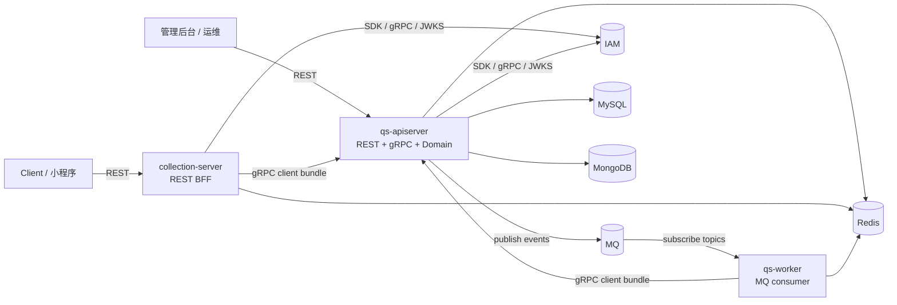
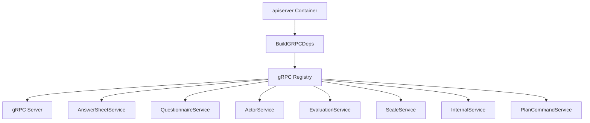
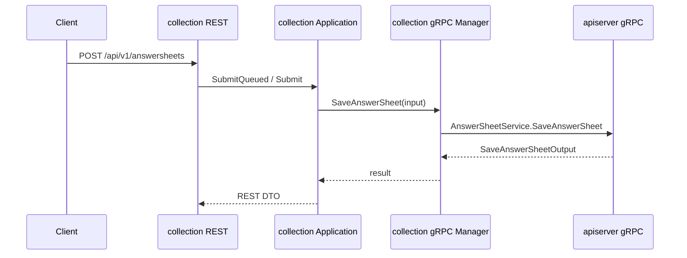
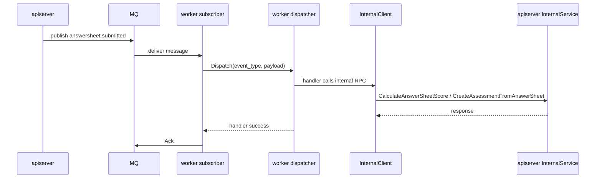

# 进程间调用与 gRPC

**本文回答**：`qs-server` 三个运行时进程之间到底通过哪些协议通信，gRPC 服务由谁注册、客户端由谁创建，`collection-server` 与 `qs-worker` 分别调用 `qs-apiserver` 的哪些能力，以及排障时如何判断问题发生在 REST、gRPC、MQ 还是业务服务内部。

---

## 30 秒结论

| 维度 | 当前事实 |
| ---- | -------- |
| 权威业务服务 | `qs-apiserver` 是业务状态和领域服务的权威入口，持有 REST 与 gRPC server |
| 前台同步调用 | `Client -> collection-server REST -> apiserver gRPC` |
| 异步推进调用 | `apiserver -> MQ -> qs-worker -> apiserver internal gRPC` |
| collection gRPC 客户端 | collection 创建 `AnswerSheet / Questionnaire / Evaluation / Actor / Scale` client bundle |
| worker gRPC 客户端 | worker 创建 `AnswerSheet / Evaluation / Internal` client bundle |
| apiserver gRPC 服务 | 注册 `AnswerSheetService / QuestionnaireService / ActorService / EvaluationService / ScaleService / InternalService / PlanCommandService` |
| gRPC 安全链 | apiserver gRPC server 由 `internal/pkg/grpc` 组装 Recovery、RequestID、Logging、mTLS、IAM Auth、AuthzSnapshot、ACL、Audit 等拦截器；是否启用取决于配置 |
| 不存在的调用 | apiserver 不通过 gRPC 直调 worker；异步只通过 MQ 投递后由 worker 消费 |

一句话：**gRPC 是 collection 与 worker 驱动 apiserver 的同步控制面，MQ 是 apiserver 驱动 worker 的异步消息面。**

---

## 1. 三进程通信总图



这张图的关键点是调用方向：

- collection 是前台入口，向 apiserver 发起 gRPC 调用。
- worker 是消息消费者，向 apiserver 发起 internal gRPC 调用。
- apiserver 不反向调用 collection 或 worker；它只发布事件到 MQ。
- IAM 是外部服务，以 SDK / gRPC / JWKS 的形式被 apiserver 与 collection 使用，不是 qs-server 的第四个运行时进程。

---

## 2. 进程间调用矩阵

| 调用方向 | 协议 | 代码入口 | 典型用途 | 运行时边界 |
| -------- | ---- | -------- | -------- | ---------- |
| Client -> collection | REST | `internal/collection-server/transport/rest/router.go` | 前台提交答卷、查询问卷、查询测评、查询量表、受试者操作 | BFF 入口治理 |
| Client / Admin -> apiserver | REST | `internal/apiserver/transport/rest` | 后台管理、内部运维、业务管理能力 | apiserver 直接入站 |
| collection -> apiserver | gRPC | `internal/collection-server/integration/grpcclient/registry.go` | 答卷提交、问卷查询、测评查询、Actor 查询、量表查询 | 同步 RPC，collection 不持有主写模型 |
| worker -> apiserver | gRPC | `internal/worker/integration/grpcclient/registry.go` | 计分、创建测评、评估、打标签、行为投影、任务通知 | 异步事件消费后的业务推进 |
| apiserver -> MQ | MQ publish | `internal/pkg/eventruntime` + outbox relay | 发布 `answersheet.submitted`、`assessment.*`、`report.generated` 等 | 事件出站面 |
| MQ -> worker | MQ subscribe | `internal/worker/integration/messaging/runtime.go` | 消费 topic 并派发 handler | 事件入站面 |
| apiserver / collection -> IAM | IAM SDK / gRPC / JWKS | `container/iam*.go` | JWT 验签、授权快照、监护关系、服务 token | 外部身份控制面 |

不要把 “worker 处理业务” 理解成 “worker 拥有业务写模型”。worker 的职责是消费事件、选择 handler、调用 apiserver internal gRPC，真正的状态迁移仍在 apiserver 内部完成。

---

## 3. apiserver gRPC server 如何注册服务

apiserver 的 gRPC transport 由 `internal/apiserver/process/transport_bootstrap.go` 构建。构建过程分两层：

1. `buildGRPCServer` 创建通用 gRPC server，并应用 bind address、TLS/mTLS、auth、ACL、audit、reflection、health check 等配置。
2. `grpctransport.NewRegistry(container.BuildGRPCDeps(grpcServer)).RegisterServices()` 从 container 中取出应用服务并注册到 gRPC server。

`internal/apiserver/transport/grpc/registry.go` 当前注册这些服务：

| gRPC 服务 | 注册条件 | 主要用途 |
| --------- | -------- | -------- |
| `AnswerSheetService` | Survey AnswerSheet submission / management service 存在 | collection 提交 / 查询答卷；worker 辅助读取 |
| `QuestionnaireService` | Questionnaire query service 存在 | collection 查询问卷结构和版本 |
| `ActorService` | Testee / clinician relationship 等 Actor 服务存在 | collection 查询受试者、监护相关上下文 |
| `EvaluationService` | Evaluation submission / report / score service 存在 | collection 查询测评、报告、分数 |
| `ScaleService` | Scale query / category service 存在 | collection 查询量表和分类 |
| `InternalService` | Survey / Evaluation / Scale / Actor / Plan / Statistics 等关键服务存在 | worker 消费事件后的内部业务推进 |
| `PlanCommandService` | Plan command service 存在 | plan 写侧命令和任务生命周期推进 |



这里的边界很重要：**gRPC Registry 不 new 领域仓储，也不自己拼业务逻辑；它只把 container 已经装好的应用服务注册成 gRPC 入站服务。**

---

## 4. apiserver gRPC 拦截器链

`internal/pkg/grpc/server.go` 是三进程共享 gRPC server runtime 的主要实现。当前 server 创建时会按配置组装以下能力：

| 顺序 | 拦截器 / 能力 | 作用 | 配置来源 |
| ---- | ------------- | ---- | -------- |
| 1 | Recovery | 捕获 panic，避免进程因单个 RPC 崩溃 | 固定启用 |
| 2 | RequestID | 生成或传播 request id | 固定启用 |
| 3 | Logging | 记录 gRPC 请求日志 | 固定启用 |
| 4 | mTLS Identity | 提取客户端证书身份 | `grpc.mtls.enabled` |
| 5 | IAM Authentication | JWT 验签，支持本地 JWKS 和远程验证 | `grpc.auth.enabled` + IAM TokenVerifier |
| 6 | ExtraUnaryAfterAuth | 认证后扩展拦截器；apiserver 注入 authz snapshot 拦截器 | container / IAM deps |
| 7 | ACL | 服务级访问控制 | `grpc.acl.enabled` |
| 8 | Audit | 审计日志 | `grpc.audit.enabled` |

`transport_bootstrap.go` 中如果 `AuthzSnapshotLoader` 存在，会把 `NewAuthzSnapshotUnaryInterceptor` 加到 `ExtraUnaryAfterAuth`，因此授权快照发生在 JWT auth 之后。

### 配置边界

- dev 配置示例里 apiserver gRPC 开启 TLS/mTLS，但 `grpc.auth.enabled` 是 false；生产配置需要以实际 `configs/*.prod.yaml` 为准。
- mTLS、ACL、Audit 是否启用都由配置决定，文档不能把所有能力都写成“无条件已启用”。
- gRPC auth 依赖 IAMModule 提供的 SDK TokenVerifier；TokenVerifier 不存在时，代码会记录 warning 并跳过认证。

---

## 5. collection -> apiserver：前台 BFF 同步 RPC

collection 的 gRPC integration 阶段在 `internal/collection-server/process/integration_bootstrap.go` 中完成。流程是：

```text
collection Container 初始化 IAMModule
  -> 如存在 ServiceAuthHelper，生成 PerRPCCredentials
  -> CreateGRPCClientManager(endpoint, timeout, TLS, maxInflight, perRPC)
  -> NewRegistry(grpcManager).ClientBundle()
  -> container.InitializeRuntimeClients(bundle)
  -> container.Initialize()
```

collection 的 `ClientBundle` 包括：

| Client | 用途 |
| ------ | ---- |
| `AnswerSheetClient` | 提交答卷、查询答卷 |
| `QuestionnaireClient` | 查询问卷 |
| `EvaluationClient` | 查询测评、报告、分数 |
| `ActorClient` | 查询受试者、受试者存在性、照护上下文等 |
| `ScaleClient` | 查询量表和分类 |

collection gRPC manager 会根据配置创建 TLS/mTLS 或 insecure 连接，并用 unary interceptor 控制每次 RPC 的 timeout 与 max-inflight。若 IAM service auth helper 存在，collection 会把 PerRPC credentials 附加到出站 gRPC 调用中。



这里最容易混淆的是答卷提交：collection 可以排队、限流、监护关系校验、生成 request_id，但**答卷主写入和 `answersheet.submitted` outbox 不在 collection，而在 apiserver**。

---

## 6. worker -> apiserver：异步事件后的 internal RPC

worker 的 gRPC integration 阶段在 `internal/worker/process/integration_bootstrap.go` 中完成。它创建 worker gRPC manager，再生成 worker client bundle，并注入 worker container。

worker 的 `ClientBundle` 包括：

| Client | 用途 |
| ------ | ---- |
| `AnswerSheetClient` | 读取或辅助处理答卷相关能力 |
| `EvaluationClient` | 测评查询或评估相关辅助能力 |
| `InternalClient` | 事件消费后的核心内部动作 |

`InternalService` 的方法由 `internalapi/internal.proto` 定义，典型方法包括：

| 方法 | 触发场景 | 作用 |
| ---- | -------- | ---- |
| `CalculateAnswerSheetScore` | worker 处理 `answersheet.submitted` 后 | 计算答卷分数 |
| `CreateAssessmentFromAnswerSheet` | worker 处理 `answersheet.submitted` 后 | 从答卷创建 Assessment，关联量表时可自动提交 |
| `EvaluateAssessment` | worker 处理 `assessment.submitted` 后 | 执行评估流水线 |
| `TagTestee` | worker 处理 `report.generated` 后 | 根据风险等级等给受试者打标签 |
| `ProjectBehaviorEvent` | worker 处理行为足迹事件后 | 投影行为统计和日维度读模型 |
| `SendTaskOpenedMiniProgramNotification` | worker 处理 `task.opened` 后 | 发送任务开放通知 |
| `HandleQuestionnairePublishedPostActions` / `HandleScalePublishedPostActions` | 问卷 / 量表发布后 | 生成二维码等发布后动作 |



worker 的运行时语义是“消费事件并驱动 apiserver”，不是“在 worker 内完成评估领域逻辑”。领域状态与仓储仍由 apiserver 的 application/domain/infra 完成。

---

## 7. MQ 与 gRPC 的关系

MQ 和 gRPC 在系统里承担不同职责：

| 机制 | 方向 | 语义 | 是否直接返回给用户 |
| ---- | ---- | ---- | ------------------ |
| REST | Client -> collection / apiserver | 外部入口 | 是 |
| gRPC | collection / worker -> apiserver | 同步服务调用 | 间接返回或内部推进 |
| MQ | apiserver -> worker | 异步事件投递 | 否 |
| Outbox | apiserver DB transaction -> MQ relay | 可靠出站缓冲 | 否 |

因此排障时不要只看一个方向。举例：用户提交答卷后没有报告，可能出问题的链路包括：

```text
collection REST -> collection SubmitQueue -> apiserver gRPC SaveAnswerSheet
-> Mongo durable submit -> answersheet.submitted outbox relay
-> MQ -> worker subscriber -> worker handler -> apiserver InternalService
-> assessment.submitted outbox -> worker EvaluateAssessment -> report outbox
```

其中 REST 200/202 只说明入口受理成功，不说明后续事件和评估已经完成。

---

## 8. gRPC 契约与配置位置

| 类型 | 位置 | 说明 |
| ---- | ---- | ---- |
| gRPC proto | `internal/apiserver/interface/grpc/proto/` | 对外和 internal gRPC 契约 |
| InternalService proto | `internal/apiserver/interface/grpc/proto/internalapi/internal.proto` | worker 调 apiserver 的内部动作契约 |
| apiserver gRPC server 配置 | `configs/apiserver.*.yaml` 的 `grpc` 段 | bind、TLS/mTLS、auth、ACL、audit、reflection、health check |
| collection gRPC client 配置 | `configs/collection-server.*.yaml` 的 `grpc_client` 段 | endpoint、TLS/mTLS、server name、max inflight |
| worker gRPC client 配置 | `configs/worker.*.yaml` 的 `grpc` 段 | apiserver address、TLS/insecure 等 |
| gRPC server runtime | `internal/pkg/grpc/server.go` | server 创建、拦截器、mTLS、health、reflection |
| collection gRPC manager | `internal/collection-server/infra/grpcclient/manager.go` | collection 出站 gRPC 连接与 client cache |
| worker gRPC manager | `internal/worker/infra/grpcclient/` | worker 出站 gRPC 连接与 client cache |

---

## 9. 排障路径

### collection 调 apiserver 失败

优先检查：

1. `configs/collection-server.*.yaml` 的 `grpc_client.endpoint` 是否指向 apiserver gRPC 端口。
2. collection TLS CA、client cert、key、server name 是否与 apiserver gRPC server 证书匹配。
3. apiserver `grpc.mtls.allowed-cns / allowed-ous` 是否允许 collection 证书身份。
4. collection `max_inflight` 是否达到上限。
5. apiserver gRPC auth / ACL / audit 配置是否阻止了请求。
6. 如果启用 service auth，确认 collection IAM ServiceAuthHelper 是否成功创建并注入 PerRPC credentials。

### worker 消费事件但业务未推进

优先检查：

1. `configs/events.yaml` 中 event type 是否绑定正确 handler。
2. `handlers.NewRegistry()` 是否包含对应 handler name。
3. worker 是否成功订阅对应 topic。
4. worker gRPC client 是否能连接 apiserver。
5. InternalService 是否在 apiserver gRPC Registry 成功注册。
6. handler 是否因为业务错误 Nack，导致 MQ 重投。
7. Redis lock 是否导致重复抑制或锁竞争。

### gRPC 服务注册缺失

优先检查：

1. apiserver `Container.Initialize()` 是否初始化对应业务模块。
2. `BuildGRPCDeps` 是否把对应 application service 暴露出来。
3. `transport/grpc/registry.go` 的注册条件是否满足。
4. proto 生成代码和 service 实现是否一致。

---

## 10. 修改指南

| 目标 | 应修改的位置 | 同步检查 |
| ---- | ------------ | -------- |
| 新增 collection 调 apiserver 的查询能力 | proto -> apiserver gRPC service -> collection grpc client -> collection application / handler | OpenAPI、REST handler、运行时文档 |
| 新增 worker internal 动作 | `internalapi/internal.proto` -> apiserver InternalService -> worker InternalClient -> worker handler | `configs/events.yaml`、handler registry、事件文档 |
| 新增 gRPC 服务 | apiserver service 实现 -> `transport/grpc/registry.go` -> client manager / registry | proto、配置、测试 |
| 修改 gRPC 安全策略 | `internal/pkg/grpc/server.go`、`configs/*.yaml`、IAM module | security 文档、contract tests |
| 修改 collection gRPC endpoint 或 TLS | `configs/collection-server.*.yaml` | 部署端口文档、证书说明 |
| 修改 worker 订阅 topic | `configs/events.yaml`、worker event catalog / handler registry | event plane 文档 |

---

## 11. 常见误区

| 误区 | 修正 |
| ---- | ---- |
| collection 是业务主服务 | 错。collection 是 BFF，主写模型在 apiserver |
| worker 直接落业务库完成评估 | 错。worker 通过 internal gRPC 调 apiserver，业务状态仍在 apiserver |
| apiserver 会 gRPC 调 worker | 错。apiserver 通过 MQ 发布事件，worker 订阅消费 |
| gRPC auth 一定启用 | 不一定。由配置决定，dev 示例中 apiserver gRPC auth 可以关闭但 mTLS 开启 |
| `request_id` 等于 durable idempotency key | 错。collection 本地队列状态和 apiserver durable 幂等是两个边界 |
| handler name 可以随便写 | 错。`configs/events.yaml` 的 handler 必须在 worker registry 中存在 |

---

## 12. 代码与契约锚点

| 类型 | 路径 |
| ---- | ---- |
| apiserver gRPC server 构建 | `internal/apiserver/process/transport_bootstrap.go` |
| shared gRPC runtime | `internal/pkg/grpc/server.go` |
| apiserver gRPC registry | `internal/apiserver/transport/grpc/registry.go` |
| apiserver REST / gRPC deps | `internal/apiserver/container/transport_deps.go` |
| collection gRPC integration | `internal/collection-server/process/integration_bootstrap.go` |
| collection gRPC registry | `internal/collection-server/integration/grpcclient/registry.go` |
| collection gRPC manager | `internal/collection-server/infra/grpcclient/manager.go` |
| worker gRPC integration | `internal/worker/process/integration_bootstrap.go` |
| worker gRPC registry | `internal/worker/integration/grpcclient/registry.go` |
| worker messaging runtime | `internal/worker/integration/messaging/runtime.go` |
| internal gRPC proto | `internal/apiserver/interface/grpc/proto/internalapi/internal.proto` |
| event catalog | `configs/events.yaml` |

---

## 13. Verify

```bash
# proto / service / registry 相关改动后，至少跑 gRPC 相关测试
make test

# 文档链接和锚点检查
make docs-hygiene
```

局部验证建议：

```bash
go test ./internal/pkg/grpc/...
go test ./internal/apiserver/transport/grpc/...
go test ./internal/collection-server/infra/grpcclient/...
go test ./internal/worker/integration/...
```

如果实际测试包名或测试边界发生变化，以当前源码为准。

---

## 14. 下一跳

| 继续阅读 | 目的 |
| -------- | ---- |
| [00-三进程协作总览.md](./00-三进程协作总览.md) | 回到三进程运行时全局图 |
| [01-qs-apiserver启动与组合根.md](./01-qs-apiserver启动与组合根.md) | 理解 apiserver 如何注册 REST/gRPC 和后台 runtime |
| [02-collection-server运行时.md](./02-collection-server运行时.md) | 理解 collection gRPC client bundle 与 BFF 入口治理 |
| [03-qs-worker运行时.md](./03-qs-worker运行时.md) | 理解 worker 如何订阅事件并调用 internal gRPC |
| [05-IAM认证与身份链路.md](./05-IAM认证与身份链路.md) | 深入身份、JWT、authz snapshot、service auth、mTLS / ACL |
| [../03-基础设施/event/README.md](../03-基础设施/event/README.md) | 深入事件、outbox、Ack / Nack |
