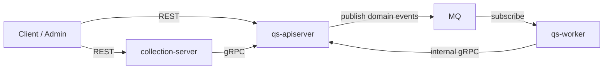
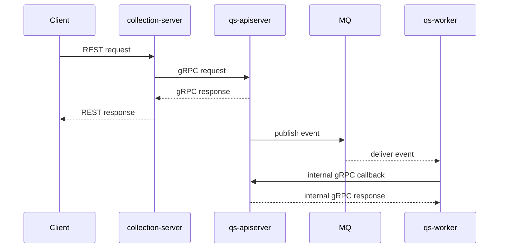

# 进程间通信

本文档说明 `qs-server` 三个核心进程之间当前如何通信，以及哪些链路是同步的，哪些链路是异步的。

## 30 秒了解系统

当前只有三种核心通信方式：

- REST：客户端调用 `collection-server` 或后台直接调用 `apiserver`
- gRPC：`collection-server` 和 `worker` 调用 `apiserver`
- MQ：`apiserver` 发布事件，`worker` 订阅事件

简单说：

- 前台查询和提交先走 `collection-server -> gRPC -> apiserver`
- 后台异步流程走 `apiserver -> MQ -> worker -> internal gRPC -> apiserver`

## 核心架构

## 核心设计原则

- 同步链路只承担请求响应：前台请求用 gRPC 直达主服务，不把异步任务塞回同步返回链路。
- 异步链路靠事件解耦：答卷、测评、报告、统计等后台处理通过事件串联。
- 主状态统一收口到 `apiserver`：无论请求来自前台还是 `worker`，最终业务写操作都收口在主服务。
- 契约优先：REST 以 OpenAPI 文件为准，gRPC 以 proto 和服务注册为准，事件以 `configs/events.yaml` 为准。

## 通信矩阵

| 发起方 | 接收方 | 方式 | 主要用途 | 代码锚点 |
| --- | --- | --- | --- | --- |
| Client | collection-server | REST | 前台查询、提交答卷、查询报告 | [api/rest/collection.yaml](../../api/rest/collection.yaml) |
| Client | apiserver | REST | 后台管理接口 | [api/rest/apiserver.yaml](../../api/rest/apiserver.yaml) |
| collection-server | apiserver | gRPC | 读写问卷、答卷、测评、量表、受试者 | [internal/collection-server/grpc_client_registry.go](../../internal/collection-server/grpc_client_registry.go) |
| apiserver | MQ | 事件发布 | 发布领域事件 | [configs/events.yaml](../../configs/events.yaml) |
| MQ | worker | 事件订阅 | 异步评估、报告后处理、统计更新 | [internal/worker/server.go](../../internal/worker/server.go) |
| worker | apiserver | internal gRPC | 计分、创建测评、执行评估、打标签 | [internal/apiserver/interface/grpc/service/internal.go](../../internal/apiserver/interface/grpc/service/internal.go) |

## 链路一：collection-server 到 apiserver

### collection → apiserver：通信方式

`collection-server` 通过 gRPC client manager 维护到 `apiserver` 的连接，并注入多类客户端：

- `AnswerSheetClient`
- `QuestionnaireClient`
- `EvaluationClient`
- `ActorClient`
- `ScaleClient`

代码入口：

- [internal/collection-server/infra/grpcclient/manager.go](../../internal/collection-server/infra/grpcclient/manager.go)
- [internal/collection-server/grpc_client_registry.go](../../internal/collection-server/grpc_client_registry.go)

### 典型用途

- 提交答卷
- 查询问卷
- 查询测评详情 / 报告 / 趋势
- 创建和查询受试者
- 查询量表

## 链路二：apiserver 到 worker

### apiserver → worker：通信方式

`apiserver` 自身不直接调用 `worker`。它通过事件发布器把领域事件送到 MQ，再由 `worker` 订阅。

代码入口：

- [internal/apiserver/container/container.go](../../internal/apiserver/container/container.go)
- [configs/events.yaml](../../configs/events.yaml)

### 典型事件

- `answersheet.submitted`
- `assessment.submitted`
- `assessment.interpreted`
- `report.generated`
- `task.opened`
- `task.completed`

## 链路三：worker 回调 apiserver

### worker → apiserver：通信方式

`worker` 通过自己的 gRPC client manager 持有三类核心客户端：

- `AnswerSheetClient`
- `EvaluationClient`
- `InternalClient`

代码入口：

- [internal/worker/infra/grpcclient/manager.go](../../internal/worker/infra/grpcclient/manager.go)
- [internal/worker/grpc_client_registry.go](../../internal/worker/grpc_client_registry.go)

其中最关键的是 `InternalClient`，它对应 `apiserver` 侧的 `InternalService`。

### InternalService 承担的动作

当前最重要的内部调用包括：

- `CalculateAnswerSheetScore`
- `CreateAssessmentFromAnswerSheet`
- `EvaluateAssessment`
- `TagTestee`
- 统计同步和任务调度相关内部能力

代码入口：

- [internal/apiserver/interface/grpc/service/internal.go](../../internal/apiserver/interface/grpc/service/internal.go)
- [internal/apiserver/grpc_registry.go](../../internal/apiserver/grpc_registry.go)

## 核心时序图

## 契约与代码锚点

### REST 契约

- [api/rest/apiserver.yaml](../../api/rest/apiserver.yaml)
- [api/rest/collection.yaml](../../api/rest/collection.yaml)

### gRPC 服务注册

- [internal/apiserver/grpc_registry.go](../../internal/apiserver/grpc_registry.go)

### 事件配置

- [configs/events.yaml](../../configs/events.yaml)

## 边界与注意事项

- 当前没有 `worker -> MQ -> apiserver` 的回流链路，异步流程回写主状态依赖 internal gRPC。
- `collection-server` 和 `worker` 都不是独立主业务边界，它们分别扮演 BFF 和事件处理运行时。
- 事件语义和 handler 绑定关系不要只从代码猜，应当先看 [configs/events.yaml](../../configs/events.yaml)。
- gRPC 和 MQ 同时存在时，要优先区分“同步查询 / 命令调用”和“异步事件驱动”两类链路。
