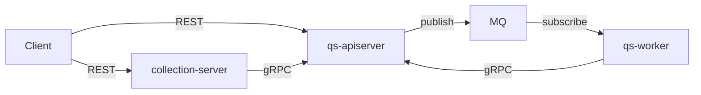
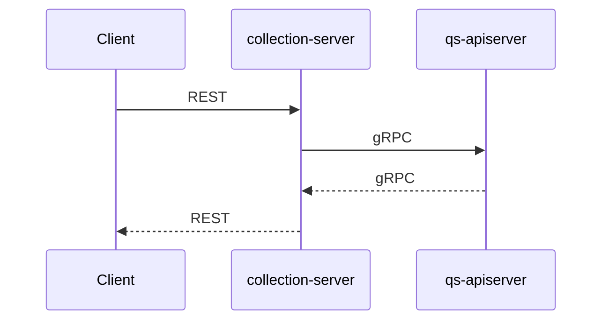
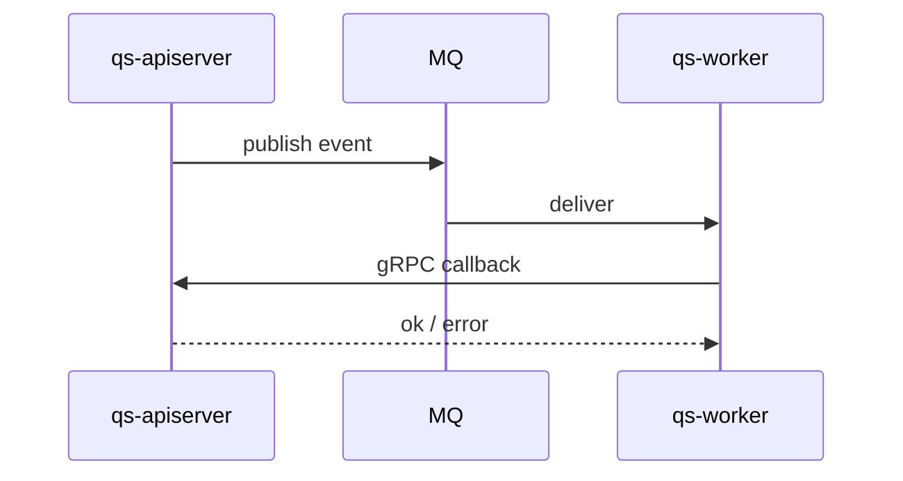
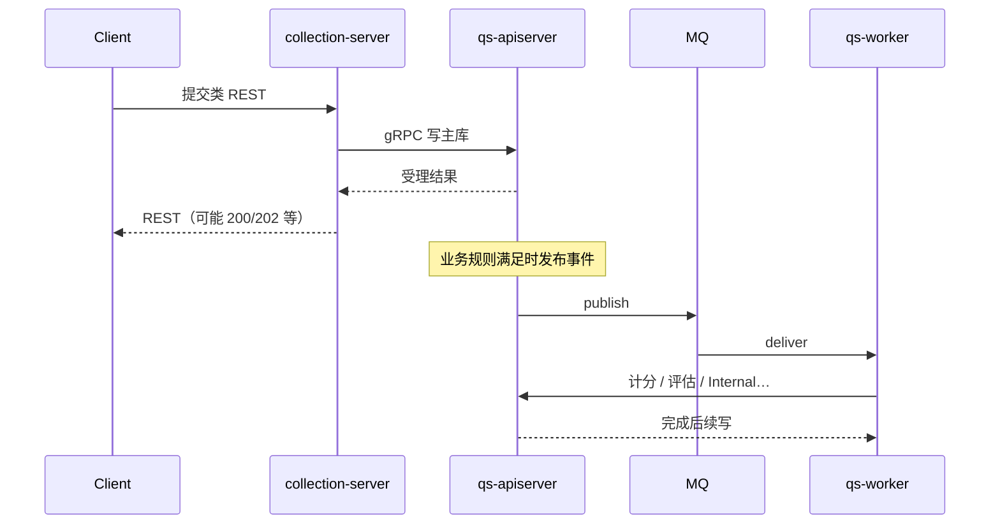

# 进程间通信

**本文回答**：这篇文档解释 `qs-server` 三进程之间到底通过哪些通道协作、同步链路和异步链路分别怎么走、一次业务写为什么可能同时涉及 REST / gRPC / MQ，以及排障时该从哪些通信矩阵和代码入口入手；本文先给结论和速查，再展开时序与索引。

## 30 秒结论

如果只看一屏，先看下面这张表：

| 维度 | 结论 |
| ---- | ---- |
| 三种通道 | REST 用于客户端到 `collection-server` / `qs-apiserver`；gRPC 用于 `collection-server` / `qs-worker` 回调 `qs-apiserver`；MQ 用于 `qs-apiserver -> worker` 的异步事件 |
| 最重要的认识 | 同步链路和异步链路不是互斥关系，一次写请求可能先同步落主状态，再异步触发后续动作 |
| 主状态边界 | 不论通信通道如何组合，业务写真值最终仍收口在 `qs-apiserver` |
| 最常见组合 | `Client -> collection REST -> apiserver gRPC`，以及 `apiserver -> MQ -> worker -> apiserver gRPC` |
| 排障入口 | 先确认走的是同步还是异步，再看通信矩阵、事件配置和对应 client / publisher 代码 |
| 不要混读 | 这里讲“怎么通信”；具体业务语义、字段和状态机要回到业务模块和契约文档 |

## 重点速查（继续往下读前先记这几条）

1. **REST、gRPC、MQ 分工不同**：REST 面向外部入口，gRPC 面向进程内协作回调，MQ 面向跨请求异步解耦。  
2. **一次写可能走两段链路**：先同步受理写入，再按条件发布事件给 worker，这是 `qs-server` 很常见的组合模式。  
3. **排障先判断链路类型**：如果问题发生在“请求已返回之后”，优先沿 `MQ -> worker -> gRPC callback` 这条线查。  
4. **主服务仍是收口点**：无论入口来自前台、后台还是 worker，最后执行业务写的都应是 `qs-apiserver`。  
5. **本文里的 MQ 指 QS 业务事件总线**：`apiserver -> MQ -> worker`；`IAM -> apiserver/collection-server` 的 `iam.authz.version` 属于控制面通知，不混在这里。  

**文档定位**：从 **组件与组件之间** 描述 **同步/异步** 通道、**协议**与**典型时序**；不展开各 API 字段（见 OpenAPI 与 02）。

**与 [01-运行时 README](./README.md) 的关系**：README 的 **服务组件与整体视图** 给三进程 + 外部依赖的**总图**与**两条主时序**；**本文补全**——**通信矩阵**、**gRPC 有无 Internal 的差异**、以及 **§3.3 组合写 + 异步**等**变体时序**，避免在 README 里堆细节。

---

## 这三种通信通道各自负责什么

| 通道 | 承载的信息形态 | 参与进程 |
| ---- | -------------- | -------- |
| **REST** | HTTP 请求/响应 | Client ↔ collection；Client ↔ apiserver |
| **gRPC** | 二进制 RPC | collection → apiserver；worker → apiserver |
| **MQ** | 领域事件消息 | apiserver → Broker → worker |

**原则**：**主业务状态写**最终仍落在 **apiserver**（经 REST 或经 worker **回调查询**）。

---

## 它们在整体里怎样组合

与 README 中图 **同构**（便于在「进程间」专文内对照）；若只需一眼总览，优先读 [README](./README.md)。

---

## 典型链路怎样组合这些通道

### 同步：前台经 BFF

### 异步：事件闭环

### 组合视角：一次写可能既同步又异步（示意）

**说明**：具体是否发事件、发哪类事件，以各应用服务与 [events.yaml](../../configs/events.yaml) 为准。

---

## 通信矩阵里最该先记住什么

| 发起方 | 接收方 | 方式 | 关键点 |
| ------ | ------ | ---- | ------ |
| Client | collection | REST | 前台契约 |
| Client | apiserver | REST | 后台/运维 |
| collection | apiserver | gRPC | **无 Internal**；mTLS 客户端 |
| apiserver | MQ | Publish | 经 **Container** 注入的 **`event.EventPublisher`**（[RoutingPublisher](../../internal/pkg/eventconfig/publisher.go)）；Topic 与 payload 与 [events.yaml](../../configs/events.yaml) 一致，运行时名统一为 `qs.*` |
| worker | apiserver | gRPC | **含 Internal**；见 worker 注册器 |

**补充**：`apiserver` / `collection-server` 还会通过 **`iam.authz-sync.*`** 订阅 **`iam.authz.version`** 以失效本地授权快照；这条链路属于 **IAM 控制面通知**，不走 `qs-worker`。

**Verify**：REST [api/rest/](../../api/rest/)；gRPC [grpc_registry.go](../../internal/apiserver/grpc_registry.go)；事件 [events.yaml](../../configs/events.yaml)。

**不存在**：worker → MQ → apiserver 的「反向总线」回流；异步结果靠 **gRPC 回写**。

---

## 这些通道在代码里从哪里接起来

| 引用 | 协议 | 契约/锚点 |
| ---- | ---- | --------- |
| collection → apiserver | gRPC | [collection grpc_client_registry](../../internal/collection-server/grpc_client_registry.go) |
| worker → apiserver | gRPC | [worker grpc_client_registry](../../internal/worker/grpc_client_registry.go) |
| apiserver → MQ | Publish | [server.go `PrepareRun`](../../internal/apiserver/server.go)：`MessagingOptions.NewPublisher()` → 注入 [container `NewContainerWithOptions`](../../internal/apiserver/container/container.go)（`MQPublisher`）→ [`initEventPublisher` / `NewRoutingPublisher`](../../internal/apiserver/container/container.go)；业务侧在各应用服务 `eventPublisher.Publish`（见下表） |
| IAM → apiserver / collection | MQ Subscribe | [`startAuthzVersionSync`](../../internal/apiserver/server.go)、[`startAuthzVersionSync`](../../internal/collection-server/server.go)：读 **`iam.authz-sync.*`**，订阅 **`iam.authz.version`** |
| apiserver → 外部（非 MQ） | REST/gRPC/SDK | IAM 等由各模块 infra 封装 |

---

### 关键代码入口（索引）

#### apiserver → MQ（发布链）

| 层级 | 路径 | 说明 |
| ---- | ---- | ---- |
| 创建 Broker Publisher | [internal/apiserver/server.go](../../internal/apiserver/server.go) `PrepareRun` | `MessagingOptions.NewPublisher()`，失败则回退为无 MQ |
| 注入与封装 | [internal/apiserver/container/container.go](../../internal/apiserver/container/container.go) | `initEventPublisher` → [pkg/eventconfig `NewRoutingPublisher`](../../internal/pkg/eventconfig/publisher.go) |
| 业务发布调用 | 各应用服务 `*.Publish(ctx, evt)` | 例如 [survey/answersheet `publishEvents`](../../internal/apiserver/application/survey/answersheet/submission_service.go)、[evaluation/assessment 同左](../../internal/apiserver/application/evaluation/assessment/submission_service.go)、[scale `lifecycle_service.publishEvents`](../../internal/apiserver/application/scale/lifecycle_service.go)、[evaluation/engine `EventPublishHandler`](../../internal/apiserver/application/evaluation/engine/pipeline/event_publish.go)、[plan 多个 service](../../internal/apiserver/application/plan/) 等；**细表**见 [01-apiserver §5](./01-apiserver.md) |

**Topic / 事件名**：仍以 [`configs/events.yaml`](../../configs/events.yaml) 与 [03-事件系统](../03-基础设施/01-事件系统.md) 为 Verify。

#### worker 与其它

| 关注点 | 路径 |
| ------ | ---- |
| worker 订阅与 Ack/Nack | [internal/worker/server.go](../../internal/worker/server.go)（`createDispatchHandler`） |
| 进程间矩阵补充 | 本文 **§4**；worker 侧见 [03-worker §4](./03-worker.md) |

---

## 边界与注意事项

- **同步 gRPC** 与 **异步 MQ** 语义不同，勿用「RPC 超时」推断「事件一定已处理完」。  
- 改通信方式时 **同时** 更新 OpenAPI、proto、events.yaml 与运行配置。

---

*说明：写作习惯可对照 [CONTRIBUTING-DOCS.md](../CONTRIBUTING-DOCS.md)；本篇按「组件间交互」体裁组织。*
