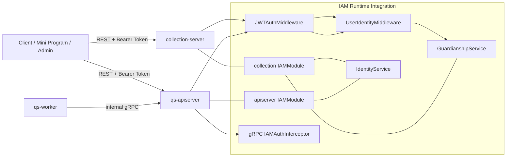
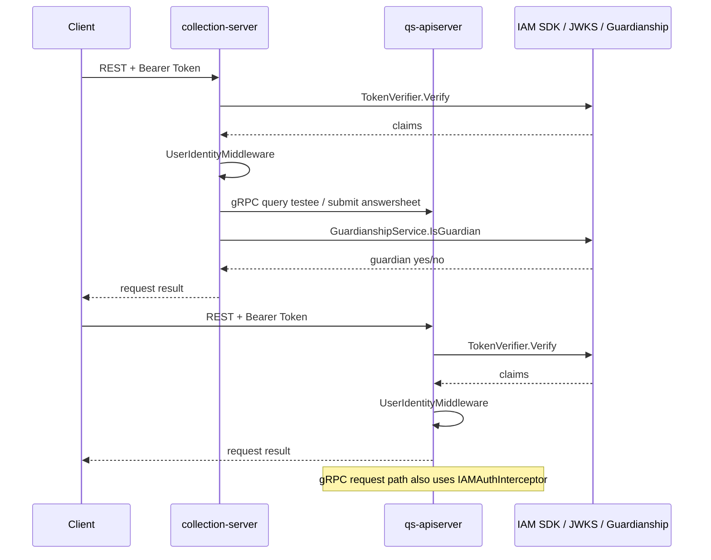

# IAM 认证与身份链路

本文档从运行时视角说明 `IAM` 如何参与 `qs-server` 的请求认证、身份解析和监护关系校验。

## 30 秒了解系统

在当前代码里，`IAM` 不是仓库内的独立运行时进程，但它深度参与三条关键链路：

- `collection-server` 的前台 JWT 验签和监护关系校验
- `apiserver` 的后台 REST 鉴权和 gRPC 鉴权
- `apiserver` 容器初始化时的身份、监护关系、服务间认证等辅助能力注入

可以把它理解为“横切整个系统的认证与身份基础设施”，而不是第四个服务进程。

## 核心架构

## 核心设计原则

- 验签尽量本地完成：HTTP 和 gRPC 入口都优先使用 SDK 的 `TokenVerifier` 做本地 JWKS 验签。
- 身份上下文前置注入：认证通过后，`user_id`、`tenant_id/org_id`、`roles` 会尽早放进上下文。
- 业务权限后移：JWT 验签和身份解析在中间件完成，具体角色判断和监护关系判断在更靠近业务的位置完成。
- 运行时按进程分工：`collection-server` 更偏前台身份与监护链路，`apiserver` 更偏后台鉴权与内部服务保护，`worker` 基本不直接接 IAM。

## 运行时角色划分

### collection-server

运行时里主要承担：

- 前台 JWT 验签
- 解析当前用户 ID
- 基于受试者和监护关系做业务前置校验

关键代码：

- [internal/collection-server/container/iam_module.go](../../internal/collection-server/container/iam_module.go)
- [internal/collection-server/routers.go](../../internal/collection-server/routers.go)
- [internal/collection-server/interface/restful/middleware/iam_middleware.go](../../internal/collection-server/interface/restful/middleware/iam_middleware.go)
- [internal/collection-server/application/answersheet/submission_service.go](../../internal/collection-server/application/answersheet/submission_service.go)

### apiserver

运行时里主要承担：

- 后台 REST JWT 验签
- 解析 `user_id / tenant_id / roles`
- gRPC 入口鉴权
- 初始化 `IdentityService`、`GuardianshipService`、`ServiceAuthHelper` 等能力并注入容器模块

关键代码：

- [internal/apiserver/container/iam_module.go](../../internal/apiserver/container/iam_module.go)
- [internal/apiserver/routers.go](../../internal/apiserver/routers.go)
- [internal/apiserver/interface/restful/middleware/iam_middleware.go](../../internal/apiserver/interface/restful/middleware/iam_middleware.go)
- [internal/pkg/grpc/interceptor_auth.go](../../internal/pkg/grpc/interceptor_auth.go)

### worker

`worker` 当前不是 IAM 的主要承载点：

- 不直接暴露 HTTP 接口
- 不持有自己的 IAM 模块
- 主要通过 gRPC 调 `apiserver`

运行时里它更多依赖的是：

- `apiserver` 的 internal gRPC 是否开启认证
- 事件回调后的业务动作是否需要由 `apiserver` 再调用 IAM 相关服务

## HTTP 认证链路

### 通用 JWT 验签

HTTP 入口统一复用 [internal/pkg/middleware/jwt_auth.go](../../internal/pkg/middleware/jwt_auth.go) 中的 `JWTAuthMiddleware`：

1. 从 `Authorization`、query 或 cookie 里提取 token
2. 使用 SDK `TokenVerifier` 验证
3. 将 `UserClaims` 注入 gin context 和 request context

中间件写入的基础身份信息包括：

- `UserID`
- `TenantID`
- `Roles`

### collection-server 的身份链路

`collection-server` 在路由层做两步：

1. `JWTAuthMiddleware`
2. `collection` 自己的 `UserIdentityMiddleware`

其中第二步主要把 `claims.UserID` 解析成 `uint64` 并写入 context，供前台业务服务直接使用。

关键代码：

- [internal/collection-server/routers.go](../../internal/collection-server/routers.go)
- [internal/collection-server/interface/restful/middleware/iam_middleware.go](../../internal/collection-server/interface/restful/middleware/iam_middleware.go)

### apiserver 的身份链路

`apiserver` 在 REST 路由层也做两步：

1. `JWTAuthMiddleware`
2. `apiserver` 自己的 `UserIdentityMiddleware`

不同点在于，`apiserver` 还会把这些信息进一步拆成：

- `user_id` 和 `user_id_str`
- `tenant_id` 和可解析时的 `org_id`
- `roles`

这样后台管理接口能更方便地做角色判断和组织隔离。

关键代码：

- [internal/apiserver/routers.go](../../internal/apiserver/routers.go)
- [internal/apiserver/interface/restful/middleware/iam_middleware.go](../../internal/apiserver/interface/restful/middleware/iam_middleware.go)

## 监护关系链路

监护关系是当前 `collection-server` 中 IAM 最贴近业务的一段链路。

核心流程：

1. 前台用户先通过 JWT 鉴权
2. `collection-server` 查询受试者信息
3. 如果受试者已绑定 `IAMChildID`，则调用 `GuardianshipService.IsGuardian`
4. 只有监护关系校验通过，才允许继续提交答卷

关键代码：

- [internal/collection-server/application/answersheet/submission_service.go](../../internal/collection-server/application/answersheet/submission_service.go)
- [internal/collection-server/infra/iam/guardianship.go](../../internal/collection-server/infra/iam/guardianship.go)

这里要注意：

- 监护关系校验不只发生在 HTTP 中间件，也发生在应用服务里
- 这是刻意的，因为校验依赖受试者业务数据，不是单纯的 token claim 判断

## gRPC 认证链路

### 入口位置

`apiserver` 的 gRPC 认证发生在服务处理器之前，由 `IAMAuthInterceptor` 完成。

关键代码：

- [internal/pkg/grpc/server.go](../../internal/pkg/grpc/server.go)
- [internal/pkg/grpc/interceptor_auth.go](../../internal/pkg/grpc/interceptor_auth.go)
- [internal/apiserver/server.go](../../internal/apiserver/server.go)

### 核心流程

1. 从 gRPC metadata 读取 `authorization`
2. 使用 SDK `TokenVerifier` 验证 token
3. 必要时校验 JWT 身份与 mTLS 身份是否一致
4. 将 `user_id`、`tenant_id`、`roles`、`custom_claims` 注入 context
5. 再进入具体 gRPC service handler

### 跳过认证的方法

当前默认会跳过：

- gRPC health check
- gRPC reflection

这保证了基础运维能力和调试能力不会被 IAM 认证拦住。

## IAMModule 在运行时里提供什么

`collection-server` 和 `apiserver` 各自都有自己的 `IAMModule`。运行时里它们会按配置创建：

- `Client`
- `TokenVerifier`
- `ServiceAuthHelper`
- `IdentityService`
- `GuardianshipService`

另外 `apiserver` 侧还会初始化：

- `WeChatAppService`

其中最常直接参与运行时链路的是：

- `SDKTokenVerifier`
- `IdentityService`
- `GuardianshipService`

## 核心时序图

## 关键配置项

运行时最相关的 IAM 配置包括：

- `iam.enabled`
- `iam.grpc.*`
- `iam.jwt.*`
- `iam.jwks.*`
- `iam.service_auth.*`
- `iam.user_cache.*`
- `iam.guardianship_cache.*`

这些配置虽然属于基础设施层，但会直接影响：

- HTTP 是否启用本地验签
- gRPC 是否启用认证拦截器
- 监护关系和身份查询的缓存行为

## 边界与注意事项

- 当前 `IAM` 在仓库里不是独立进程，所以文档放在“运行时链路”里讲它的参与方式，而不是把它当同级服务。
- `collection-server` 和 `apiserver` 的 `UserIdentityMiddleware` 不是同一个实现，两边上下文字段也不完全一致。
- `worker` 当前不直接持有 IAM 模块，因此不要把“事件处理”误解成“每一步都直接接 IAM”。
- 监护关系校验不是单纯认证问题，它依赖业务数据，所以主要落在 `collection-server` 应用服务而不是通用认证中间件。
