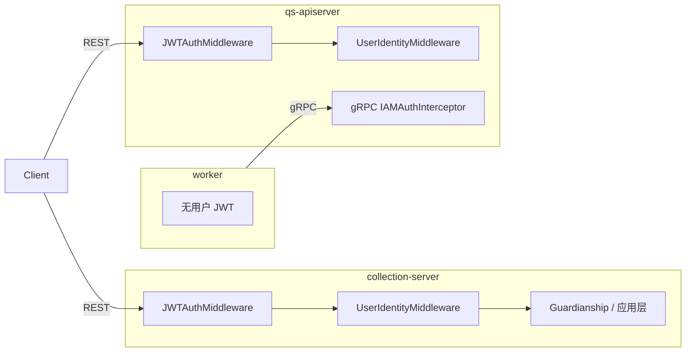
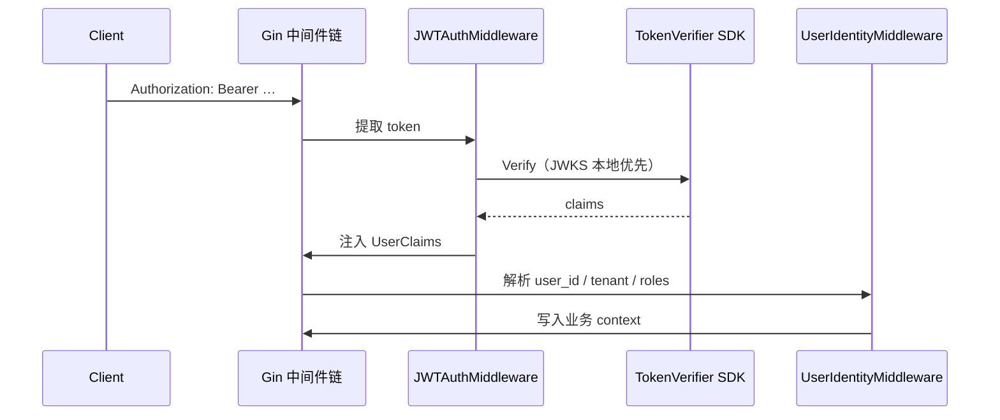
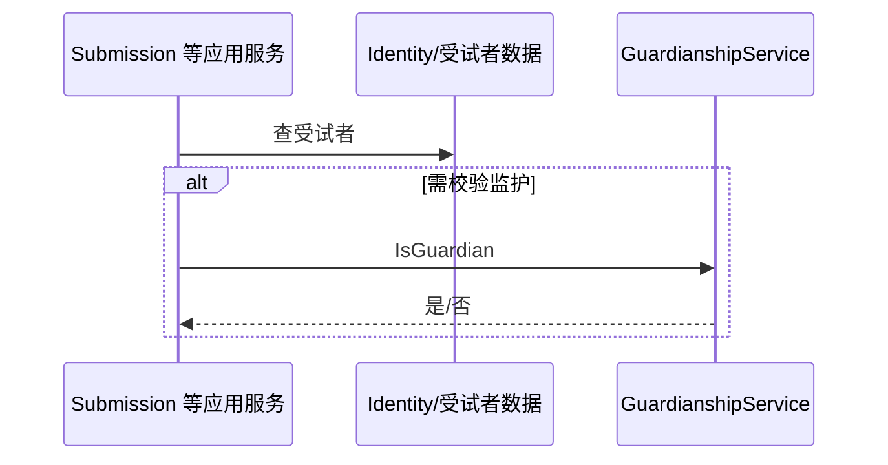
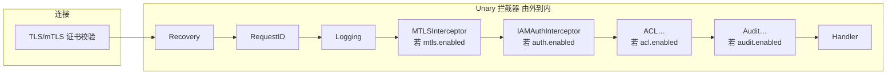

# IAM 认证与身份链路（运行时视角）

**组件定位**：**IAM 不是**本仓第四进程；以 **SDK 模块**形式嵌入 **collection-server** 与 **qs-apiserver**，参与 **HTTP JWT**、**gRPC 可选 JWT**、**监护关系**等。**worker** 不嵌入 IAM 用户态链路。  
配置键、拦截器链、与 worker 的 gRPC 元数据关系见 [03-基础设施/04-IAM与认证.md](../03-基础设施/04-IAM与认证.md)。

---

## 1. 在整体中的位置（三进程）

| 进程 | IAM 相关职责（运行时） |
| ---- | ---------------------- |
| **collection-server** | 前台 REST：**用户 JWT** → **UserIdentity**；**Guardianship** 等；调 apiserver gRPC 时若启用 **`iam.service_auth`** 可装配 **服务间 token**（见 **§3.4**） |
| **qs-apiserver** | 后台 REST：同上（**上下文字段更全**）；**gRPC**：拦截器链见 **§3.3**；容器内 **ServiceAuthHelper** 等多用于**向其它服务发请求**，与 **collection → 本进程** 的入站验签是两条线 |
| **qs-worker** | **无** IAM 模块；依赖 **apiserver gRPC** 是否要求 `authorization`（见 03-04） |

---

## 2. 组件关系示意图

**collection → apiserver（gRPC）**：除 **mTLS 传输**外，若部署启用 **服务间 JWT**，由 **`ServiceAuthHelper`（PerRPC）** 写入 metadata（与前台用户 Bearer **不是**同一条 token）；详见 **§3.4**。

---

## 3. 时序图

### 3.1 HTTP：JWT 与身份上下文（两进程共性）

**差异**：collection 与 apiserver 的 **UserIdentityMiddleware 实现不同**，字段集合不一致，**勿混读 context**。

### 3.2 collection：监护关系（业务层，非纯中间件）

**锚点**：[submission_service.go](../../internal/collection-server/application/answersheet/submission_service.go)、[guardianship.go](../../internal/collection-server/infra/iam/guardianship.go)。

### 3.3 apiserver：gRPC 入站 — 传输层与 Unary 链顺序（mTLS 先于 IAM JWT）

**易混点**：**mTLS** 先在 **TLS 握手** 完成客户端认证；**IAMAuthInterceptor** 再在 **应用层** 读 metadata 里的 **JWT**（可与 **用户态** 或 **服务态** token 对应）。服务端 **Unary 链**（与代码一致）为：**Recovery → RequestID → Logging →（可选）MTLSInterceptor →（可选）IAMAuth →（可选）ACL →（可选）Audit → Handler**。其中 **TLS/mTLS 在连接建立时完成**；**MTLSInterceptor 在 IAMAuth 之前**（见 [internal/pkg/grpc/server.go `buildUnaryInterceptors`](../../internal/pkg/grpc/server.go)）。

- **RequireIdentityMatch**：在 **IAMAuth** 内把 **JWT 中的服务身份** 与 **MTLSInterceptor 写入 context 的证书身份** 对齐（见 [interceptor_auth.go `verifyIdentityMatch`](../../internal/pkg/grpc/interceptor_auth.go)）。  
- **默认跳过**：Health / Reflection（见 [03-04](../03-基础设施/04-IAM与认证.md)）。

### 3.4 collection → apiserver：服务间 token（ServiceAuthHelper）

| 维度 | 说明 |
| ---- | ---- |
| **用途** | 标识 **collection-server** 服务身份，向 **apiserver gRPC** 附加 **`authorization`（服务 JWT）**，与 **终端用户 JWT**（REST Bearer）区分 |
| **装配** | [collection `iam_module.go`](../../internal/collection-server/container/iam_module.go) 在 **`iam.service_auth.*`**（含 `ServiceID`、`TargetAudience` 等）合法时创建 **`ServiceAuthHelper`** |
| **实现** | [infra/iam/service_auth.go](../../internal/collection-server/infra/iam/service_auth.go) 实现 **`credentials.PerRPCCredentials`**（`GetRequestMetadata`），并提供 **`DialWithServiceAuth`**（`grpc.WithPerRPCCredentials`） |
| **与默认 gRPC Manager** | [PrepareRun 先 IAM 后 gRPC](../../internal/collection-server/server.go)；若 **`ServiceAuthHelper` 非空**，[`Manager.connect`](../../internal/collection-server/infra/grpcclient/manager.go) 会 **`grpc.WithPerRPCCredentials`**；与 **`DialWithServiceAuth`** 同属 PerRPC 模式（独立拨号场景仍可用后者） |

**与 apiserver 入站配套**（mTLS + 服务 JWT + 可选身份对齐）：见 [03-基础设施/04-IAM与认证.md](../03-基础设施/04-IAM与认证.md) 中 **「用户态与服务态」「gRPC 与可选 mTLS」「internal gRPC」** 等节；**配置键** 见同文 **`iam.service_auth.*`**。

---

## 4. 核心功能与关键点

| 能力 | 关键点 | 锚点 |
| ---- | ------ | ---- |
| **共享 JWT 中间件** | 多来源取 token | [jwt_auth.go](../../internal/pkg/middleware/jwt_auth.go) |
| **collection IAM 模块** | Verifier + Guardianship 等 | [iam_module.go](../../internal/collection-server/container/iam_module.go) |
| **apiserver IAM 模块** | 另含后台所需服务 | [iam_module.go](../../internal/apiserver/container/iam_module.go) |
| **gRPC 拦截器** | 链顺序见 **§3.3**；Health/Reflection 默认跳过 | [server.go](../../internal/pkg/grpc/server.go)、[interceptor_auth.go](../../internal/pkg/grpc/interceptor_auth.go) |
| **服务间 gRPC 认证（collection）** | `ServiceAuthHelper` / `PerRPC` | [iam_module.go](../../internal/collection-server/container/iam_module.go)、[service_auth.go](../../internal/collection-server/infra/iam/service_auth.go) |

---

## 5. 与其它组件的交互

| 组件 | 与 IAM 的关系 |
| ---- | ------------- |
| **collection** | REST：**用户 JWT**；gRPC 下游：可选 **服务 JWT**（**§3.4**）+ **mTLS**；应用层 **Guardianship** 等 |
| **apiserver** | REST + **gRPC 入站拦截链（§3.3）** + 各业务 infra 调 Identity/Guardianship |
| **worker** | 间接：仅通过 **apiserver** 是否再调 IAM；通常 **无用户 JWT metadata**（见 [03-04](../03-基础设施/04-IAM与认证.md)） |

---

## 6. 与 03-基础设施/04 的分工

| 维度 | 本文（01-运行时/05） | [03-基础设施/04](../03-基础设施/04-IAM与认证.md) |
| ---- | -------------------- | ----------------------------------------------- |
| 侧重 | **哪一进程**承担哪段链路、时序（含 **§3.3 链图**、**§3.4 ServiceAuth**） | **装配、配置键、`grpc.*`、拦截器与 worker 元数据、与 01-运行时/05 对照表** |

---

## 7. 边界与注意事项

- **IAM 不要画成与三进程并列的第四个运行时方块**（除非指外部 IAM 服务拓扑）。  
- **Claims ≠ 领域不变量**，领域侧见 [actor](../02-业务模块/05-actor.md)。  
- **worker** 不表示「每步都验用户 JWT」。

---

*说明：写作习惯可对照 [CONTRIBUTING-DOCS.md](../CONTRIBUTING-DOCS.md)；本篇按「运行时组件」体裁组织。*
