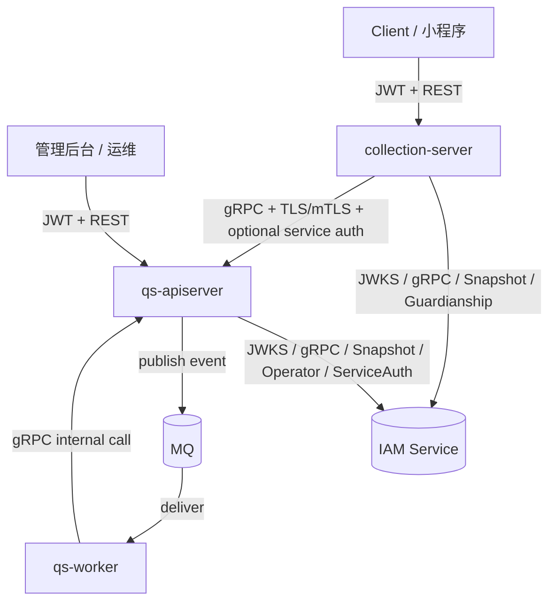
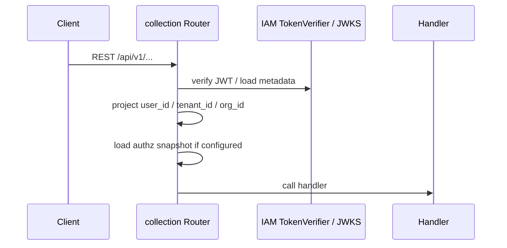
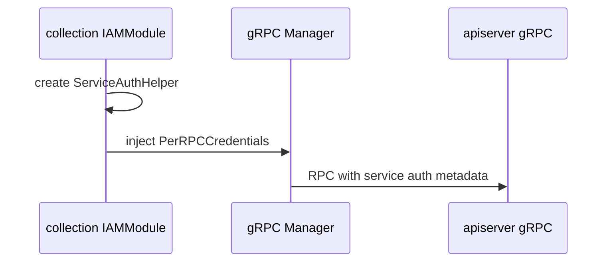
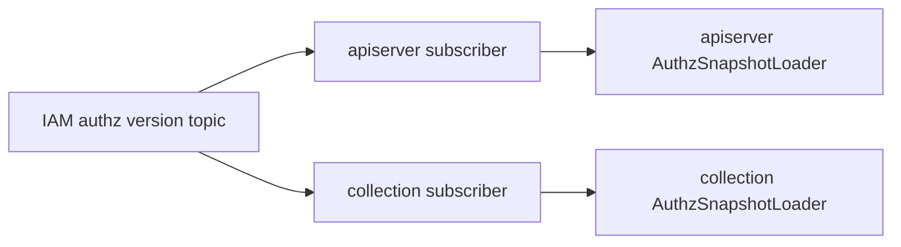

# IAM 认证与身份链路

**本文回答**：`qs-server` 三进程运行时中 IAM 如何嵌入，JWT、TenantScope、OrgScope、AuthzSnapshot、Guardianship、ServiceAuth、mTLS / ACL 分别发生在哪一层，以及 collection、apiserver、worker 在身份链路中的职责边界。

---

## 30 秒结论

| 维度 | 当前事实 |
| ---- | -------- |
| IAM 形态 | IAM 是外部服务，以 SDK / gRPC / JWKS 能力嵌入 collection-server 与 qs-apiserver；不是 qs-server 第四进程 |
| 前台入口身份链路 | Client 带 JWT 进入 collection REST；collection 使用 IAM TokenVerifier、本地 JWKS 或远程验证，并投影 user / tenant / org scope |
| 后台入口身份链路 | 管理端或内部调用进入 apiserver REST；apiserver protected routes 使用 JWT、TenantID、OrgScope、ActiveOperator、AuthzSnapshot 中间件链 |
| gRPC 身份链路 | apiserver gRPC server 可使用 mTLS、IAM Auth、AuthzSnapshot、ACL、Audit；是否启用由 `configs/*.yaml` 控制 |
| collection -> apiserver | collection 可通过 IAM ServiceAuthHelper 注入 PerRPC credentials，并通过 gRPC TLS/mTLS 调 apiserver |
| worker -> apiserver | worker 当前不装配 IAMModule；主要作为 MQ 消费者，通过 gRPC client 调 apiserver internal service，安全边界以 gRPC TLS/mTLS、ACL、网络和 internal service 控制为主 |
| 授权快照 | collection 与 apiserver 都可通过 IAM authz snapshot loader 获取权限快照；apiserver gRPC 还可在 JWT auth 后注入 authz snapshot unary interceptor |
| 监护关系 | collection 提交答卷时通过 IAM GuardianshipService 校验填写者与受试者关系 |

一句话：**IAM 在 qs-server 中是身份与授权控制面，collection 负责前台身份前置，apiserver 负责权威权限收口，worker 不拥有独立身份域。**

---

## 1. 身份链路总图



这张图有三个边界：

1. **用户身份边界**：JWT、user_id、tenant_id、org_id 进入 collection 或 apiserver REST。
2. **服务身份边界**：collection 调 apiserver 时可附加服务 token，gRPC transport 可用 mTLS 和 ACL。
3. **事件执行边界**：worker 消费 MQ 后调用 apiserver internal gRPC，worker 不重新实现用户身份认证链。

---

## 2. 三进程中的 IAM 职责

| 进程 | IAM 相关职责 | 主要代码锚点 | 不负责什么 |
| ---- | ------------ | ------------ | ---------- |
| collection-server | 前台 JWT 验签、用户身份投影、tenant/org scope 检查、authz snapshot、监护关系校验、可选 service auth 出站凭证 | `internal/collection-server/container/iam_module.go`、`transport/rest/router.go`、`application/answersheet/submission_service.go` | 不做后台 operator active 校验；不拥有业务权限最终真值 |
| qs-apiserver | 后台 REST JWT 验签、TenantScope、OrgScope、ActiveOperator、AuthzSnapshot、gRPC auth/mTLS/ACL/Audit、IAM client 与授权快照 loader | `internal/apiserver/container/iam.go`、`transport/rest/registrars.go`、`process/transport_bootstrap.go` | 不把 IAM 当成本地业务模块；不替代 IAM 权限源 |
| qs-worker | 事件消费和 internal gRPC driver；当前不装配 IAMModule | `internal/worker/process/*`、`internal/worker/integration/grpcclient/*` | 不做用户 JWT 验签，不维护授权快照，不作为业务权限决策点 |

---

## 3. collection-server：前台身份前置

collection 的身份链路发生在两个层次：REST router 中间件和应用服务业务校验。

### 3.1 REST 中间件链

collection 的 business routes 位于 `/api/v1`。如果 IAMModule 启用且 TokenVerifier 可用，router 会为 `/api/v1` 注册：

```text
JWTAuthMiddlewareWithOptions
  -> UserIdentityMiddleware
  -> RequireTenantIDMiddleware
  -> RequireNumericOrgScopeMiddleware
  -> AuthzSnapshotMiddleware（如果 loader 可用）
```

collection 中有少量公开只读接口可跳过认证，例如部分量表列表、热门量表、分类接口；这由 `isPublicScaleReadOnly` 判断。



### 3.2 答卷提交中的监护关系

collection 的 `SubmissionService` 不只是 DTO 转换，它还会在提交答卷前做：

1. 校验 writerID 是否来自认证上下文。
2. 查询 canonical testee。
3. 如果 IAM GuardianshipService 启用，并且 testee 绑定了 IAM child，则调用 `IsGuardian` 校验填写者是否有权为该受试者提交。
4. 通过 gRPC 调 apiserver 保存答卷。

这说明 collection 的安全职责是**入口前置治理**，不是业务状态真值。真正的答卷保存、durable idempotency 和 outbox 仍在 apiserver。

---

## 4. qs-apiserver：权威身份与权限收口

apiserver 的身份链路同样分 REST 与 gRPC 两条线。

### 4.1 apiserver REST protected group

apiserver 的 REST protected routes 会应用以下中间件链：

```text
JWTAuthMiddlewareWithOptions
  -> UserIdentityMiddleware
  -> RequireTenantIDMiddleware
  -> RequireNumericOrgScopeMiddleware
  -> RequireActiveOperatorMiddleware（如果 ActiveOperatorChecker 存在）
  -> AuthzSnapshotMiddleware（如果 SnapshotLoader 存在）
```

这条链路比 collection 更严格，因为 apiserver 承担后台和主业务权威入口，需要 operator active 校验和角色投影更新。

### 4.2 apiserver IAMModule

apiserver 的 `IAMModule` 会按配置装配：

| 组件 | 作用 |
| ---- | ---- |
| `iam.Client` | 与 IAM 服务通信的底层 client |
| `TokenVerifier` | JWT 验签，支持 SDK JWKS 本地验签和远程验证降级 |
| `ServiceAuthHelper` | 服务间 token 获取与刷新 |
| `IdentityService` | 用户身份信息查询 |
| `OperationAccountService` | 操作者账号相关能力 |
| `GuardianshipService` | 监护关系查询 |
| `WeChatAppService` | 微信应用信息查询 |
| `AuthzSnapshotLoader` | 加载 IAM 授权快照并做本地缓存 |

apiserver IAMModule 不是业务 domain，它是基础设施和安全控制面的组合模块。它被 container 暴露给 REST、gRPC 和 application 需要的地方。

---

## 5. gRPC 身份链路

apiserver gRPC server 的身份链路由 `internal/pkg/grpc/server.go` 和 `internal/apiserver/process/transport_bootstrap.go` 共同决定。

当前 gRPC server 支持：

```text
mTLS transport identity
  -> IAM JWT authentication
  -> AuthzSnapshot unary interceptor
  -> ACL
  -> Audit
```

是否启用取决于 `configs/apiserver.*.yaml` 的 `grpc` 段以及 IAMOptions。

### 5.1 mTLS 与 service identity

mTLS 解决的是“调用方服务是谁”的问题。配置中包括：

- 服务端证书与私钥。
- CA 文件。
- 是否要求客户端证书。
- allowed CNs / OUs。
- 最低 TLS 版本。

collection 的 gRPC client 会按 `grpc_client` 配置加载客户端证书、私钥、CA 和 server name。apiserver 侧 mTLS 拦截器可提取客户端身份。

### 5.2 JWT 与 authz snapshot

JWT 解决“请求中的主体是谁”的问题。AuthzSnapshot 解决“该主体当前拥有怎样的权限视图”的问题。

apiserver gRPC 创建时，如果 IAMModule 提供了 `TokenVerifier`，则可启用 IAM authentication interceptor。如果 `AuthzSnapshotLoader` 存在，`transport_bootstrap.go` 会把 AuthzSnapshotUnaryInterceptor 插入到认证之后。

### 5.3 ACL 与 Audit

ACL 与 Audit 是 gRPC server 的横切能力：

- ACL 约束 service/method 级访问策略。
- Audit 记录审计日志。

这两者是否生效取决于配置。文档中不要把它们写成所有环境默认开启。

---

## 6. collection -> apiserver 的服务认证

collection 的 IAMModule 如果成功创建 `ServiceAuthHelper`，integration 阶段会把它作为 PerRPC credentials 注入 collection gRPC manager。之后 collection 调 apiserver gRPC 时可以附带服务身份 metadata。



注意：服务认证是否实际生效取决于：

1. IAM 是否支持 IssueServiceToken。
2. collection IAM service-auth 配置是否完整。
3. apiserver gRPC auth / ACL 策略是否要求并识别对应 metadata。
4. TLS/mTLS 是否也被正确配置。

如果 IAM server 不支持 IssueServiceToken，代码会记录日志并禁用 service-to-service auth，而不是阻塞 collection 启动。

---

## 7. AuthzSnapshot 与版本同步

collection 和 apiserver 都有 authz snapshot loader，并且 process 层都支持 authz version sync subscriber：

- apiserver 在 `container_bootstrap.go` 中启动 `startAuthzVersionSync`。
- collection 在 `integration_bootstrap.go` 中启动 `startAuthzVersionSync`。

作用是当 IAM 权限版本变化时，相关 loader 可以感知并刷新授权快照。默认 channel prefix 若未配置会使用 `qs-authz-sync` 前缀，并分别拼出 apiserver / collection 的 channel 名。



---

## 8. worker 的身份边界

worker 当前运行时不装配 IAMModule。它的安全边界主要来自：

| 边界 | 说明 |
| ---- | ---- |
| MQ topic / channel | worker 只消费事件目录中映射到 handler 的事件 |
| EventCatalog + handler registry | handler name 必须在显式 registry 中存在，否则初始化失败 |
| gRPC transport | worker 通过 gRPC client 调 apiserver；TLS/mTLS / ACL 策略由 apiserver gRPC server 配置决定 |
| InternalService | worker 只调用 apiserver 暴露的 internal service 方法，不直接访问 apiserver domain 对象 |
| Redis lock | 对部分事件处理做重复抑制和锁保护 |

如果未来要给 worker 增加服务 token / IAM service auth，应作为独立安全策略改造处理，并同步修改：

```text
worker IAMModule / service auth helper
worker gRPC manager PerRPCCredentials
apiserver gRPC auth / ACL 策略
security docs 与 contract tests
```

当前文档不能把这类规划写成已实现。

---

## 9. 用户身份、租户范围与机构范围

在 REST 链路中，身份通常分三层：

| 层 | 典型信息 | 作用 |
| -- | -------- | ---- |
| Principal | user id / subject / token metadata | 标识当前调用者 |
| TenantScope | tenant_id | 租户隔离 |
| OrgScope | org_id | 机构级业务范围 |

collection 和 apiserver 都会要求 tenant / org scope。apiserver 还可能要求 ActiveOperator，因为它是后台和主业务权威入口。

这意味着 handler 不应该只靠 URL path 或 JWT roles 自行判断权限；权限视图应通过 IAM authorization snapshot / capability 相关机制收口。

---

## 10. 配置入口

| 配置 | 位置 | 说明 |
| ---- | ---- | ---- |
| collection IAM | `configs/collection-server.*.yaml` 的 `iam` 段 | JWT、JWKS、IAM gRPC、service-auth、guardianship cache |
| apiserver IAM | `configs/apiserver.*.yaml` 的 `iam` 段 | JWT、JWKS、IAM gRPC、service-auth、authz snapshot 等 |
| apiserver gRPC security | `configs/apiserver.*.yaml` 的 `grpc` 段 | TLS/mTLS、auth、ACL、audit、reflection、health check |
| collection gRPC client TLS | `configs/collection-server.*.yaml` 的 `grpc_client` 段 | client cert、key、CA、server name、max inflight |
| authz sync | IAM options 中的 AuthzSync 配置 | 控制权限版本同步订阅 |

配置变更时必须同时检查运行时文档、security 文档和部署端口 / 证书说明。

---

## 11. 排障路径

### REST 请求返回 401 / 403

优先检查：

1. IAM 是否启用。
2. TokenVerifier 是否成功创建。
3. JWT issuer / audience / algorithms / required claims 是否匹配。
4. tenant_id / org_id 是否存在且格式正确。
5. apiserver 是否要求 ActiveOperator，当前 operator 是否 active。
6. AuthzSnapshotLoader 是否可用，权限快照是否过期或未刷新。
7. collection 是否跳过了公开只读白名单以外的接口。

### collection 提交答卷提示无权限

优先检查：

1. writerID 是否从 JWT 正确投影到上下文。
2. testee 是否存在，是否存在 profile_id 被误传为 testee_id 的兼容路径。
3. testee 是否绑定 IAM child。
4. GuardianshipService 是否启用。
5. `IsGuardian` 返回是否为 true。
6. IAM gRPC 地址、证书、缓存是否正常。

### collection 调 apiserver gRPC 被拒绝

优先检查：

1. mTLS 证书 CN / OU 是否在 apiserver allowed list 中。
2. TLS server name 是否与 apiserver 证书匹配。
3. service auth token 是否成功附加。
4. apiserver gRPC auth 是否启用，是否要求 JWT / metadata。
5. ACL 是否允许对应 service/method。

### authz snapshot 不生效

优先检查：

1. IAM gRPC 是否启用。
2. AuthzSnapshotLoader 是否被创建。
3. REST middleware / gRPC interceptor 是否注入 loader。
4. AuthzSync subscriber 是否启动。
5. IAM 权限版本 topic / channel prefix 是否匹配。

---

## 12. 修改指南

| 目标 | 修改位置 | 同步检查 |
| ---- | -------- | -------- |
| 修改 JWT 校验策略 | IAM options、IAMModule、REST/gRPC auth 配置 | issuer、audience、required claims、docs/security |
| 新增 REST 权限中间件 | apiserver / collection router 或 registrar | status code、contract tests、运行时文档 |
| 修改 collection 监护校验 | collection SubmissionService、IAM GuardianshipService adapter | 提交链路文档、survey AnswerSheet 文档 |
| 启用 gRPC auth | apiserver `grpc.auth`、IAM TokenVerifier、client metadata | gRPC 调用文档、security 文档 |
| 启用/修改 mTLS | apiserver grpc 配置、collection/worker client TLS 配置 | 证书、allowed CN/OU、部署文档 |
| 新增 service auth | IAM service-auth 配置、ServiceAuthHelper、PerRPC credentials | apiserver gRPC 策略、security docs |
| 修改 authz snapshot | AuthzSnapshotLoader、middleware / interceptor、AuthzSync | 权限缓存、版本同步、contract tests |

---

## 13. 常见误区

| 误区 | 修正 |
| ---- | ---- |
| IAM 是 qs-server 的第四个进程 | 错。IAM 是外部服务，以 SDK / gRPC / JWKS 被调用 |
| JWT roles 可以直接当业务权限 | 不建议。业务权限应以 IAM authz snapshot / capability 视图为准 |
| collection 和 apiserver 权限链完全一样 | 不一样。collection 是前台 BFF，apiserver 是权威业务入口，apiserver 还有 ActiveOperator 等更强约束 |
| mTLS 等于用户认证 | 错。mTLS 是服务身份；JWT / authz snapshot 才是用户与权限视图 |
| worker 也做用户 JWT 认证 | 当前不是。worker 是事件消费者，通过 internal gRPC 驱动 apiserver |
| AuthzSnapshot 替代 JWT 验签 | 错。authz snapshot 只负责权限视图，不能替代 JWT 权威认证 |
| service auth 一定启用 | 不一定。取决于 IAM 是否支持、配置是否完整，以及代码是否注入 PerRPC credentials |

---

## 14. 代码锚点

| 类型 | 路径 |
| ---- | ---- |
| apiserver IAMModule | `internal/apiserver/container/iam.go` |
| collection IAMModule | `internal/collection-server/container/iam_module.go` |
| apiserver REST protected middleware | `internal/apiserver/transport/rest/registrars.go` |
| collection REST auth middleware | `internal/collection-server/transport/rest/router.go` |
| apiserver gRPC transport bootstrap | `internal/apiserver/process/transport_bootstrap.go` |
| shared gRPC server runtime | `internal/pkg/grpc/server.go` |
| collection service auth injection | `internal/collection-server/process/integration_bootstrap.go` |
| collection submit guardianship check | `internal/collection-server/application/answersheet/submission_service.go` |
| worker runtime boundary | `internal/worker/process/runner.go`、`internal/worker/process/runtime_bootstrap.go` |
| apiserver authz sync | `internal/apiserver/process/container_bootstrap.go` |
| collection authz sync | `internal/collection-server/process/integration_bootstrap.go` |

---

## 15. Verify

```bash
# 文档卫生
make docs-hygiene

# 安全 / 中间件 / gRPC 相关改动后，至少跑完整测试
make test
```

局部验证建议：

```bash
go test ./internal/pkg/grpc/...
go test ./internal/apiserver/transport/rest/...
go test ./internal/collection-server/transport/rest/...
go test ./internal/collection-server/application/answersheet/...
```

如果 IAM SDK 或 component-base 升级，应额外回归：JWT 验签、JWKS refresh、service auth、mTLS、ACL、authz snapshot、guardianship。

---

## 16. 下一跳

| 继续阅读 | 目的 |
| -------- | ---- |
| [04-进程间调用与gRPC.md](./04-进程间调用与gRPC.md) | 理解身份链路在 gRPC 调用方向中的位置 |
| [02-collection-server运行时.md](./02-collection-server运行时.md) | 理解前台 BFF 的身份前置和监护校验 |
| [01-qs-apiserver启动与组合根.md](./01-qs-apiserver启动与组合根.md) | 理解 apiserver IAMModule 如何进入 REST / gRPC deps |
| [03-qs-worker运行时.md](./03-qs-worker运行时.md) | 理解 worker 为什么不作为用户身份决策点 |
| [../03-基础设施/security/README.md](../03-基础设施/security/README.md) | 深入 Security Control Plane |
| [../04-接口与运维/03-gRPC契约.md](../04-接口与运维/03-gRPC契约.md) | 查看 gRPC 契约入口 |
