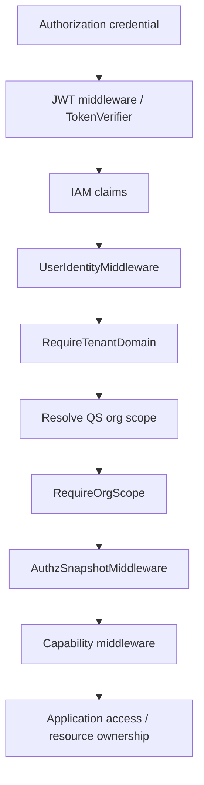

# IAM 认证与身份链路

## 1. 结论

qs-server 不再自行解析微信身份和维护一套独立 User，而是把账号、登录凭据、Profile、租户身份和授权快照交给 IAM。qs-server 只把 IAM 身份投影成当前测评用例需要的组织范围和业务参与者，并继续负责资源归属、医患关系、受试者/填写人关系等业务授权。

因此必须同时记住三句话：

- IAM 认证回答“你是谁、凭据是否可信”；
- IAM 授权快照回答“你在 IAM 租户中具有什么角色和能力”；
- qs-server 业务校验回答“你是否可以对这个 org、testee、plan 或 report 执行当前操作”。

只完成前两步，不能自动推出第三步。

## 2. 从项目自管身份到 IAM

项目最初曾直接解析微信小程序身份并组织 User。随着 IAM 从 PHP 版能力升级为统一身份认证系统，账号与认证职责被移出 qs-server。

这次演进解决了两个问题：

- 多个业务系统不再重复实现微信登录、token、Profile 和角色体系；
- qs-server 可以把精力集中在 Actor、测评参与关系和资源访问规则。

但迁移到 IAM 并没有消除 qs-server 的 Actor 模块。IAM Profile 是跨系统身份，Testee/Filler/Clinician/Operator 是测评领域中的业务角色，二者通过明确的 link/projection 关联。

## 3. 核心概念不能混用

| 概念 | 所属边界 | 含义 |
| --- | --- | --- |
| IAM User | IAM | 可认证的账号主体 |
| IAM Profile | IAM | 用户在业务/租户场景中的身份资料 |
| tenant domain | IAM | IAM 授权与多租户上下文 |
| authz snapshot | IAM | 某用户当前角色、能力和授权版本的快照 |
| QS `org_id` | qs-server | 测评业务数据隔离和用例范围 |
| Testee | Actor | 受试者，即测评结果归属的人 |
| Filler/writer | Actor/提交用例 | 实际填写并提交答卷的人 |
| ProfileLink | qs-server 对 IAM 的适配 | IAM Profile 与 Testee/Filler 关系的验证入口 |

IAM tenant 与 QS `org_id` 相关，但不是同一个概念。middleware 必须显式解析业务 org scope，不能把 IAM tenant 字符串直接当作数据库中的 `org_id`。

## 4. HTTP 请求的认证与授权链

apiserver 受保护路由的典型链路为：

不同 route group 会使用不同能力检查，不能理解为每个端点机械执行完全相同的 middleware。总体顺序表达的是依赖关系：没有可信身份就无法解析范围，没有组织范围就不能安全读取业务资源，具备角色能力仍需校验目标资源归属。

collection 路由也会执行 JWT、UserIdentity、tenant domain 和 authz snapshot 投影；随后由 BFF 用例通过 ProfileLink、Actor gRPC 和请求参数解析受试者与填写人。

## 5. Token 如何验证

`internal/pkg/iamauth` 提供共享认证能力，apiserver/collection 的 IAM module 负责实例化：

- IAM Client；
- `TokenVerifier`；
- 可选 `ServiceAuthHelper`；

- Identity/ProfileLink 等服务；
- `AuthzSnapshotLoader`。

TokenVerifier 支持使用 JWKS 在本地验证 token，并在配置允许时使用远程验证兜底。JWKS/服务凭据可能有后台刷新任务，因此 IAM module 的 `Close()` 不只是关闭一个 HTTP client，还要停止刷新 goroutine。

本地验证提高可用性和延迟表现，但必须处理 key rotation、issuer/audience、过期时间和刷新失败。不能因为 JWT 能被解码就跳过签名与声明校验。

## 6. 授权快照与失效

`AuthzSnapshotLoader` 把 IAM 的授权快照加载到进程内缓存。快照通常包含用户角色、能力和 `authz_version`。

apiserver 与 collection 可订阅 IAM 权限版本事件：

1. 请求读取当前授权快照；
2. loader 命中本地缓存或访问 IAM；
3. IAM 中角色变化后发布新的 authz version；
4. subscriber 接收事件并使旧 watermark/缓存失效；
5. 后续请求重新加载新快照。

这一机制降低每个请求直连 IAM 的压力，同时缩短权限变更传播时间。它仍是缓存一致性方案：事件同步失败时需要 TTL、版本比较、日志和监控兜底。

## 7. Capability 与资源归属是两层判断

例如一个用户拥有“查看报告”能力，只说明其角色允许进入该类用例，并不说明他能查看任意患者报告。application service 仍应校验：

- 当前 `org_id` 是否与资源一致；
- 当前操作者是否是被授权的医生/运营人员；
- 当前 IAM Profile 是否与 Testee/Filler 存在有效 link；
- 报告是否属于当前受试者；
- 医患关系或 Plan 关系是否满足用例要求。

IAM 不是业务查询过滤器。资源归属若只在前端或 middleware 中判断，内部 gRPC、后台任务或未来新入口可能绕过约束。

## 8. 家长与患者身份

对于年龄较小的患者，家长可能代为填写，也可能填写家长观察版量表。当前 qs-server 的统一事实是：

- 谁是受试者；
- 谁实际提交答卷。

系统暂不把“代填”和“观察者量表”设计成额外的关系类型。量表类型由问卷/模型定义表达，身份链只需验证填写人是否有权为该受试者提交。

这个边界保持了 Actor 模型的稳定，也避免把医学量表角色差异误塞进 IAM。

## 9. 服务间认证与用户认证

collection/worker 调用 apiserver 时存在两种完全不同的主体：

- **服务主体**：证明请求来自受信任的 collection/worker 实例；
- **最终用户主体**：证明当前前台操作代表哪个 IAM 用户。

当前仓库内部 gRPC 主要使用 mTLS 建立服务身份边界。collection client 代码支持通过 `ServiceAuthHelper` 附加 PerRPC service JWT，但 apiserver 环境配置当前未默认开启 gRPC JWT auth；worker client 也主要依赖 mTLS。

mTLS 不能自动表达最终用户的业务权限，service JWT 也不能冒充用户 token。需要代表用户执行的 gRPC 用例，应显式传递或解析必要的 user/org/testee 上下文，并由服务端复核。

## 10. 失败语义

| 故障 | 建议语义 |
| --- | --- |
| token 缺失、签名无效、过期 | `401` / `Unauthenticated` |
| tenant domain 或 QS org 无法解析 | 拒绝请求，不使用隐式全局范围 |
| 无角色/能力 | `403` / `PermissionDenied` |
| 有能力但资源不属于当前主体 | `403` 或按防枚举策略返回 `404` |
| IAM/快照依赖暂时不可用且无安全缓存 | 失败关闭，不跳过授权 |
| authz version 订阅暂时中断 | 使用受控 TTL/版本兜底并告警，不无限信任旧快照 |
| ProfileLink 不可用 | collection 可靠提交失败关闭 |

认证与权限错误不应自动当作可重试系统错误；依赖不可用也不应伪装成“用户没有权限”。

## 11. 源码证据

- apiserver IAM module：`internal/apiserver/container/modules/iam`；
- apiserver IAM adapter：`internal/apiserver/infra/iam`；
- collection IAM module/adapter：`internal/collection-server/container/iam_module.go`、`internal/collection-server/infra/iam`；
- 共享验证与快照：`internal/pkg/iamauth`；
- 共享 HTTP identity/org scope：`internal/pkg/httpauth`；
- apiserver 路由装配：`internal/apiserver/transport/rest/registrars.go`；
- collection 路由装配：`internal/collection-server/transport/rest/router.go`；
- 业务参与者与访问边界：`internal/apiserver/application/actor`、各模块 application service。

## 12. 验证清单

1. 验证无 token、过期 token、错误 issuer/audience；
2. 验证有 IAM tenant 但无 QS org scope；
3. 验证有 capability 但访问他人/他组织资源；
4. 验证 authz_version 更新后缓存被失效；
5. 验证 IAM 短暂不可用时不会绕过授权；
6. 验证 collection 家长/患者 ProfileLink；
7. 分别验证 mTLS 服务身份与最终用户业务权限。
