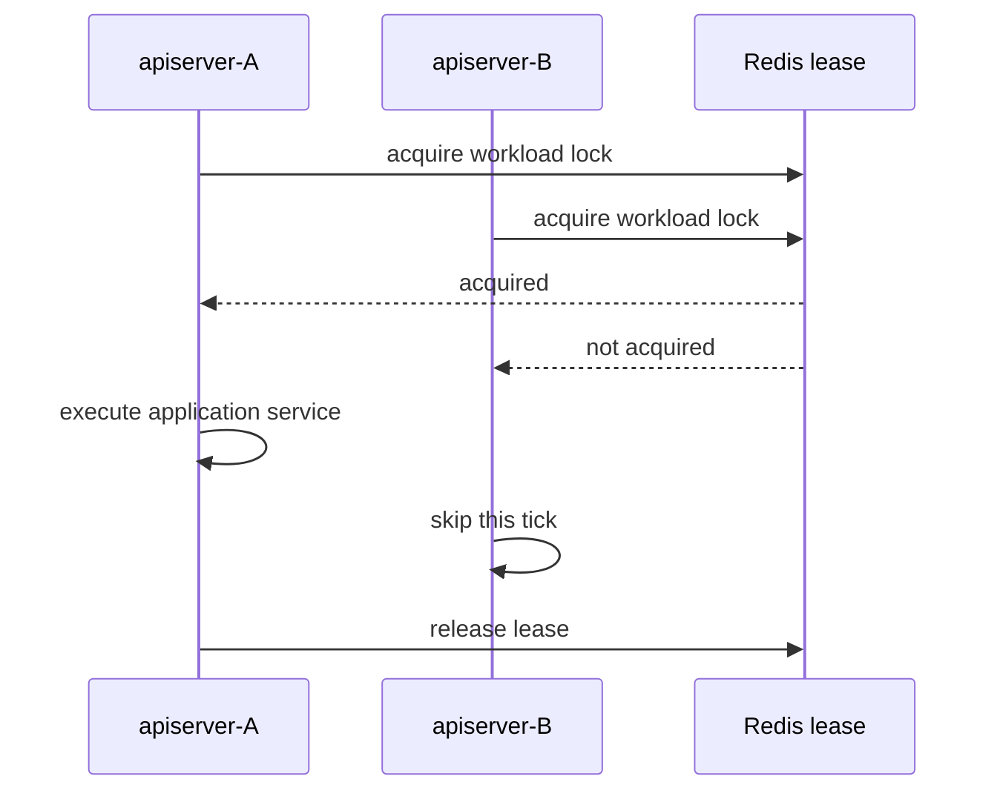

# 后台任务与调度

## 1. 结论

qs-server 的后台运行时不是一个单一 cron 模块，而是五类机制：可靠事件发布/消费、业务周期调度、一致性补偿、缓存与权限同步、worker 重试治理。

无论由定时器、事件还是启动预热触发，只要需要修改业务事实，都必须复用 application/domain 边界。后台任务不是绕开业务规则的管理后门。

## 2. 后台能力地图

| 进程 | 后台能力 | 主要目的 |
| --- | --- | --- |
| apiserver | Outbox immediate/relay、ready-index reconciler、projection consumer | 可靠发布领域事件并维护事件投影 |
| apiserver | Plan、Statistics、Evaluation scheduler | 推进周期任务、T+1 统计和一致性修复 |
| apiserver | cache signal watcher、startup warmup | 缓存失效传播与热点预热 |
| apiserver/collection | IAM authz version subscriber | 让授权快照缓存跟随权限版本变化 |
| collection | cache/report signal watcher | L1 失效、报告状态等待和前台通知 |
| worker | NSQ subscriber、retry hold replayer | 执行异步用例并治理延迟重试 |

## 3. apiserver 事件子系统

`internal/apiserver/eventing/subsystem` 同时管理两个 Outbox profile：Mongo domain events 与 assessment MySQL outbox。每个 profile 可以包含：

- transaction stager：在业务事务中写入 Outbox；
- immediate dispatcher：事务提交后尝试尽快发布；
- relay：周期扫描并发布 due event；
- Redis ready index：减少全表扫描；
- reconciler：校准 ready index 与权威 Outbox；
- status reader：向治理接口暴露积压和运行状态。

启动顺序为：

1. 校验所有启用 consumer 都已绑定 handler；
2. 当 publisher 使用 MQ 时，启动 projection consumers；
3. 启动各 profile 的 ready-index reconciler；
4. 当 publisher 使用 MQ 时，启动 relay goroutine。

relay 每轮执行 `DispatchDue`，失败记录告警并等待下一周期。Outbox 是权威事实，Redis ready index 是优化索引；Redis 数据丢失后 reconciler 可以从 Outbox 恢复候选项。

关闭时先 cancel relay 并等待 goroutine，再逆序关闭 reconciler/immediate dispatcher，最后停止 consumer。

## 4. 三个 apiserver Scheduler

这些 runner 由 `internal/apiserver/runtime/scheduler.Manager` 统一启动，共享由 runtime lifecycle 取消的 context。

### 4.1 PlanRunner

PlanRunner 周期调用 `SchedulePendingTasks`，按配置的 `org_ids` 扫描一个时间窗口：

- 打开已经到期的 Plan Task；
- 处理应过期的任务；
- 为患者在 Plan 周期内持续生成可填写任务。

它只保存/解析 assessment code 的现有 Plan 语义，每次任务使用当前最新发布版本。量表因子在稳定期极少变化，因此当前业务接受这一取舍；历史已完成答卷和报告仍保留当时版本。

### 4.2 StatisticsSyncRunner

StatisticsSyncRunner 在上海时间 00:30 执行唯一 `publish` Run：

- 按机构串行获取分布式锁；
- 在 repair window 内由三个 Collector 构建 Fact；
- 由五个 Projection 事务化重建结果；
- 提交后发布 Cache Generation、预热常用窗口；
- 使用 SyncRun 记录停点、失败和恢复结果。

repair window 允许任务中断或迟到数据在后续运行中收敛。Statistics 不再注册 Behavior Scanner、Pending Reconcile、Checkpoint 或 V1 三段同步。

### 4.3 EvaluationConsistencyReconcileRunner

该 runner 调用 evaluation scheduler 的 `AuditOnce`，检查评分、测评状态和报告跨存储终态是否漂移。实际 service 还可以组合过期执行租约恢复器，在相同治理边界内恢复卡住的运行。

它用于修复“事件最终会到达”仍未完全覆盖的异常，例如进程崩溃在跨存储状态更新之间。

## 5. 为什么每个 scheduler 都需要 leader lock

apiserver 可以运行多个实例。若每个实例同时执行同一周期任务，会产生重复扫描和写入竞争。需要互斥的 runner 通过 Redis lock lease 争夺 workload 对应的 leader lock：

关键边界：

- Redis 不可用时 runner 不启动或本轮失败关闭，不能让所有实例无锁执行；
- lock key 由统一 keyspace builder 构造；
- lease TTL 必须覆盖正常执行时间，并考虑续租能力；
- release 使用 lease token，不能误删其他实例重新获得的锁；
- 即使有 leader lock，application service 仍应支持幂等或重复扫描。

## 6. 时间与批处理语义

后台任务的配置通常包含：

- `enable`：是否注册；
- `initial_delay` / `run_at`：首次运行时机；
- `interval`：后续周期；
- `batch_limit` / `batch_size`：每轮工作上限；
- `lookback` / `repair_window_days`：补偿窗口；
- `lock_key` / `lock_ttl`：leader lease；
- `org_ids`：明确运行范围。

这些值以 `internal/apiserver/options` 和当前环境配置为准。默认值只服务本地可运行性，不是容量结论。

周期任务应避免简单使用“上次运行时间到现在”的脆弱窗口。更可靠的方法是：以业务状态/checkpoint 找 due 项，允许有限回看，批量推进，并让重复执行无害。

## 7. worker 的 retry hold replayer

当自动重试策略要求延迟或暂停 transport 重投时，worker 可把记录写入 MySQL hold store。启用 automatic retry 后，replayer 周期扫描到期 hold，通过 publisher 重新投递。

其正确性要求：

- hold 记录保留 event、attempt、原因和下次执行时间；
- 重新发布成功后再改变 hold 状态；
- 超过业务预算或 `manual_required` 时停止自动重放；
- 管理员强制重试需要确认和审计，不能直接改数据库状态冒充成功。

## 8. 缓存与权限同步任务

缓存 watcher、startup warmup 和 authz version subscriber 与业务 scheduler 不同：它们维护的是运行时派生状态。

- watcher 丢失一次 signal 后，TTL/版本/权威查询仍应恢复；
- warmup 失败不应写入伪造业务数据；
- authz sync 失败时不能无限信任旧授权；
- 这些任务应暴露运行状态、最后错误和处理延迟。

## 9. 可观测性

每个后台任务至少应能回答：

- 当前是否启用、在哪个实例运行；
- 上一次开始/结束时间和耗时；
- 扫描数、成功数、跳过数、失败数；
- 当前运行账本、处理水位或 repair window；
- 未获得锁还是执行失败；
- 积压量和最老未处理记录年龄；
- 是否已经进入自动重试暂停或人工处理。

只有“启动时打印一条 started 日志”不足以证明任务持续健康。

## 10. 新增后台任务的设计清单

1. 触发机制应选事件、定时扫描还是两者结合；
2. 明确权威事实与派生索引；
3. 定义幂等键、重复执行和部分失败语义；
4. 多实例下是否需要 leader lock，租约如何续期；
5. 定义批量、回看、checkpoint 和背压；
6. 定义可重试、manual_required 和人工补偿边界；
7. 接入进程 lifecycle，确保可以取消和等待；
8. 增加 metrics、状态查询和确定性并发测试。

## 11. 源码证据

- 事件子系统：`internal/apiserver/eventing/subsystem`；
- scheduler manager/runners：`internal/apiserver/runtime/scheduler`；
- scheduler 装配：`internal/apiserver/process/runtime.go`；
- Plan 用例：`internal/apiserver/application/plan`；
- Evaluation 一致性审计：`internal/apiserver/application/evaluation/scheduler`；
- Statistics：`internal/apiserver/application/statistics`；
- worker runtime：`internal/worker/process/runtime.go`；
- 事件与配置事实：`configs/events.yaml`、`configs/*server*.yaml`。
