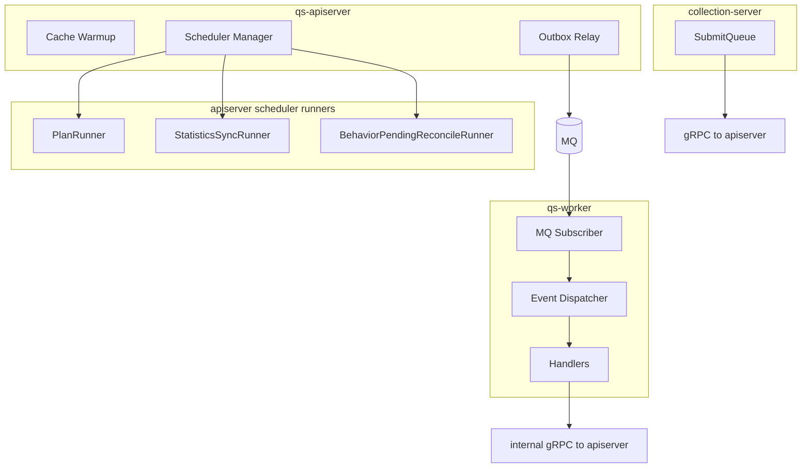
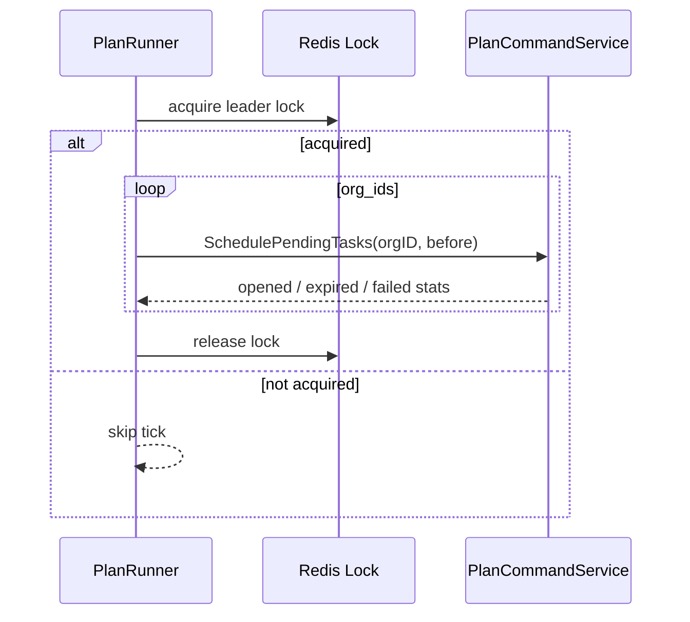
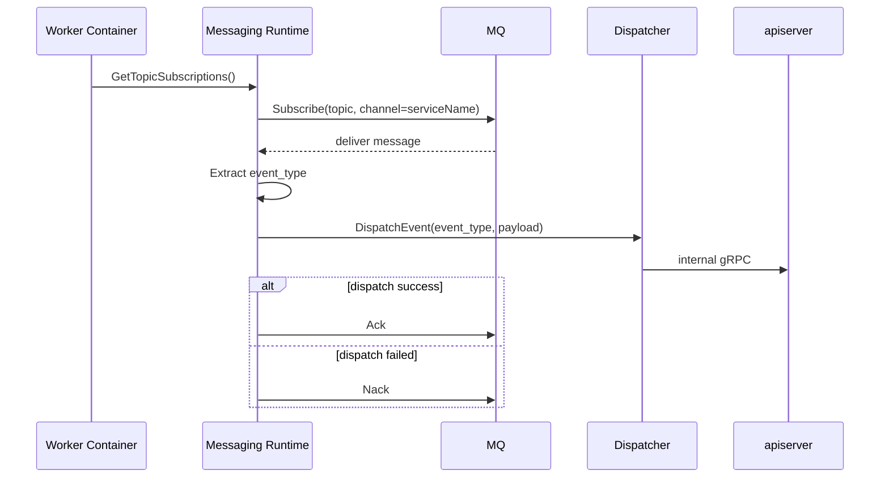

# 后台任务与调度

**本文回答**：`qs-server` 运行时有哪些后台任务、它们分别跑在哪个进程、由配置如何启停、如何避免多实例重复执行，以及排障时应先看哪条链路。本文只讨论运行时调度和后台执行，不展开业务模块内部规则；业务语义请回到 [02-业务模块](../02-业务模块/)，事件机制请回到 [03-基础设施/event](../03-基础设施/event/)。

---

## 30 秒结论

| 维度 | 结论 |
| ---- | ---- |
| 后台任务归属 | `qs-apiserver` 负责内建 scheduler、cache warmup、outbox relay；`qs-worker` 负责 MQ 事件消费；`collection-server` 只做 BFF 入口削峰和本进程队列，不承担系统级调度 |
| 调度入口 | apiserver 在 `PrepareRun` 的 `start background runtimes` 阶段启动后台 runtime |
| 主要 scheduler | `plan_scheduler`、`statistics_sync`、`behavior_pending_reconcile` |
| 可靠事件出站 | apiserver 的 answersheet / assessment outbox relay 以固定循环补发 due events |
| worker 职责 | 根据 `configs/events.yaml` 订阅 Topic，按 handler 名路由事件，再通过 internal gRPC 回调 apiserver |
| 高可用策略 | apiserver scheduler 依赖 Redis lock lease 做 leader/互斥；worker 消费侧依赖 MQ channel、handler 幂等和必要的 Redis lock |
| 事实来源 | `internal/apiserver/process/runtime_bootstrap.go`、`internal/apiserver/runtime/scheduler/*`、`internal/worker/process/runtime_bootstrap.go`、`configs/events.yaml` |

---

## 1. 后台任务分类

qs-server 的后台任务不能全部叫“worker 任务”。它们至少分三类：



| 类型 | 运行进程 | 触发方式 | 典型任务 | 备注 |
| ---- | -------- | -------- | -------- | ---- |
| 内建 scheduler | `qs-apiserver` | 时间循环 + Redis lock | 计划任务开放/过期、统计同步、pending 行为投影修复 | 业务状态仍在 apiserver 内修改 |
| outbox relay | `qs-apiserver` | 固定间隔扫描 due events | `answersheet.submitted`、assessment/report 相关事件补发 | 用于关闭“写库成功但事件丢失”窗口 |
| MQ 消费 | `qs-worker` | MQ delivery | 计分、创建测评、执行评估、报告后处理、行为投影、任务通知 | worker 不直接拥有主写模型 |
| BFF 本地队列 | `collection-server` | HTTP 请求进入 | `SubmitQueue` 受理答卷提交 | 进程内 memory channel；不是系统级调度 |

---

## 2. apiserver 后台 runtime 启动点

apiserver 的后台 runtime 在 `PrepareRun` 的第五个阶段启动：

```text
prepare resources
  -> initialize container
  -> initialize integrations
  -> initialize transports
  -> start background runtimes
  -> register shutdown callback
```

对应代码锚点：

- [`internal/apiserver/process/runner.go`](../../internal/apiserver/process/runner.go)
- [`internal/apiserver/process/runtime_bootstrap.go`](../../internal/apiserver/process/runtime_bootstrap.go)

`runtime_bootstrap.go` 里实际做了三件事：

1. 启动 cache warmup；
2. 构建并启动 scheduler manager；
3. 在 MQ publisher 可用时启动 outbox relay loop。

这意味着：**apiserver 不只是 HTTP/gRPC server，它也是部分后台维护任务的运行时宿主。**

---

## 3. Cache Warmup

Cache warmup 由 apiserver 后台 goroutine 触发：

```text
start background runtimes
  -> startWarmupContainer
  -> c.WarmupCache(ctx)
```

它的配置来自 apiserver `cache.warmup` 与 `cache.statistics_warmup`，并在 `buildContainerCacheOptions` 中进入 `ContainerOptions`：

- [`configs/apiserver.dev.yaml`](../../configs/apiserver.dev.yaml)
- [`internal/apiserver/process/container_options.go`](../../internal/apiserver/process/container_options.go)
- [`internal/apiserver/process/runtime_bootstrap.go`](../../internal/apiserver/process/runtime_bootstrap.go)

| 配置区域 | 作用 |
| -------- | ---- |
| `cache.warmup.enable` | 总开关 |
| `cache.warmup.startup.static` | 启动时是否预热静态类缓存 |
| `cache.warmup.startup.query` | 启动时是否预热查询类缓存 |
| `cache.warmup.hotset.*` | 热集合预热策略 |
| `cache.statistics_warmup.*` | 统计类缓存预热参数 |

注意：warmup 失败通常不应该阻塞 apiserver 主服务启动。当前实现中，warmup 在 goroutine 中执行，失败只记录 warning。

---

## 4. Scheduler Manager

apiserver 使用 `runtime/scheduler.Manager` 统一管理多个 runner。Manager 本身只负责收集 runner 并在 `Start(ctx)` 时逐个启动：

```text
Manager
  -> PlanRunner
  -> StatisticsSyncRunner
  -> BehaviorPendingReconcileRunner
```

代码锚点：

- [`internal/apiserver/runtime/scheduler/manager.go`](../../internal/apiserver/runtime/scheduler/manager.go)
- [`internal/apiserver/process/runtime_bootstrap.go`](../../internal/apiserver/process/runtime_bootstrap.go)

### 4.1 PlanRunner：计划任务开放与过期

`PlanRunner` 由 `plan_scheduler` 配置控制。它负责周期性调用 `PlanCommandService.SchedulePendingTasks`，对指定机构扫描 pending / opened 任务并推进开放、过期等状态。

代码锚点：

- [`internal/apiserver/runtime/scheduler/plan_scheduler.go`](../../internal/apiserver/runtime/scheduler/plan_scheduler.go)
- [`internal/apiserver/application/plan`](../../internal/apiserver/application/plan/)
- [`internal/apiserver/domain/plan/task_lifecycle.go`](../../internal/apiserver/domain/plan/task_lifecycle.go)

关键配置：

```yaml
plan_scheduler:
  enable: false
  org_ids: [1]
  initial_delay: "1m"
  interval: "1m"
  pending_lookback: "24h"
  lock_key: "qs:plan-scheduler:leader"
  lock_ttl: "50s"
```

运行逻辑：



边界：

- 它不是 worker 消费任务；
- 它运行在 apiserver 内；
- 多实例下依赖 Redis lock 避免重复调度；
- 具体任务状态迁移仍由 Plan 领域服务完成。

### 4.2 StatisticsSyncRunner：统计同步与修复窗口

`StatisticsSyncRunner` 由 `statistics_sync` 配置控制。它按照每日时间点运行，对配置的 org 执行统计同步，并在需要时触发统计缓存 warmup。

代码锚点：

- [`internal/apiserver/runtime/scheduler/statistics_sync.go`](../../internal/apiserver/runtime/scheduler/statistics_sync.go)
- [`internal/apiserver/application/statistics`](../../internal/apiserver/application/statistics/)
- [`internal/apiserver/domain/statistics/v1_types.go`](../../internal/apiserver/domain/statistics/v1_types.go)

关键配置：

```yaml
statistics_sync:
  enable: true
  org_ids: [1]
  run_at: "00:30"
  repair_window_days: 7
  lock_key: "qs:statistics-sync:leader"
  lock_ttl: "30m"
```

运行逻辑：

```text
每日到达 run_at
  -> 获取 statistics_sync leader lock
  -> SyncDailyStatistics(repair window)
  -> SyncOrgSnapshotStatistics
  -> SyncPlanStatistics
  -> WarmupCoordinator.HandleStatisticsSync
```

边界：

- 它处理的是读侧统计同步，不是测评主写链路；
- `repair_window_days` 用于回补近 N 天窗口，避免遗漏；
- 如果 `org_ids` 为空、`run_at` 非法、锁不可用，runner 不启动或 tick 跳过。

### 4.3 BehaviorPendingReconcileRunner：行为投影 pending 修复

`BehaviorPendingReconcileRunner` 由 `behavior_pending_reconcile` 配置控制。它定期重试行为足迹和统计投影中的 pending 项。

代码锚点：

- [`internal/apiserver/runtime/scheduler/behavior_pending_reconcile.go`](../../internal/apiserver/runtime/scheduler/behavior_pending_reconcile.go)
- [`internal/apiserver/application/statistics`](../../internal/apiserver/application/statistics/)

关键配置：

```yaml
behavior_pending_reconcile:
  enable: true
  interval: "10s"
  batch_limit: 100
  lock_key: "qs:behavior-pending-reconcile:leader"
  lock_ttl: "30s"
```

运行逻辑：

```text
启动后立即 tick
  -> 每 interval tick
  -> 获取 behavior_pending_reconcile lock
  -> ReconcilePendingBehaviorEvents(batch_limit)
```

边界：

- 它不是消费 MQ 的主路径，而是对 pending 投影做修复；
- 它依赖 Statistics 的 BehaviorProjectorService；
- 多实例下同样依赖 Redis lock。

---

## 5. Outbox Relay

apiserver 后台 runtime 还会启动 outbox relay loop。当前有两类 relay：

| Relay | 条件 | 作用 |
| ----- | ---- | ---- |
| `AnswerSheetSubmittedRelay` | server deps 存在，且 MQ publisher 可用 | 补发 Mongo durable submit 中 stage 的 `answersheet.submitted` 及相关事件 |
| `AssessmentOutboxRelay` | server deps 存在，且 MQ publisher 可用 | 补发 assessment / report 相关 outbox events |

代码锚点：

- [`internal/apiserver/process/runtime_bootstrap.go`](../../internal/apiserver/process/runtime_bootstrap.go)
- [`internal/apiserver/infra/mongo/answersheet/durable_submit.go`](../../internal/apiserver/infra/mongo/answersheet/durable_submit.go)

relay loop 的核心语义：

```text
每 2 秒：
  -> DispatchDue(ctx)
  -> 成功则继续
  -> 失败记录 warning
  -> shutdown 时 cancel context
```

注意：如果 MQ publisher 没有创建成功，apiserver 会落到 fallback publish mode；durable relay 不会在无 publisher 时强行启动。排障时不要只看 outbox 表/集合，也要确认 `messaging.enabled`、provider、NSQ/RabbitMQ 连接和 publisher 创建日志。

---

## 6. qs-worker 的 MQ 后台 runtime

worker 的后台 runtime 与 apiserver scheduler 不同：worker 不按时间扫描业务状态，而是**消费 MQ 消息**。

启动点：

```text
prepare resources
  -> initialize container
  -> initialize integrations
  -> initialize runtime
  -> register shutdown callback
```

代码锚点：

- [`internal/worker/process/runner.go`](../../internal/worker/process/runner.go)
- [`internal/worker/process/runtime_bootstrap.go`](../../internal/worker/process/runtime_bootstrap.go)
- [`internal/worker/integration/messaging/runtime.go`](../../internal/worker/integration/messaging/runtime.go)

worker runtime 阶段做这些事：

1. 如配置启用，启动 metrics / governance HTTP；
2. 如 provider 是 NSQ，调用 `EnsureTopics` 创建/确认 Topic；
3. 创建 Subscriber；
4. 根据 container 的 topic subscriptions 注册 handler；
5. 由 MQ delivery 驱动 handler 执行。



### 6.1 event_type 解析

worker 优先从消息 metadata 读取 `event_type`；如果 metadata 没有，则解析 event envelope payload 并回填 metadata。

代码锚点：

- [`internal/worker/integration/messaging/runtime.go`](../../internal/worker/integration/messaging/runtime.go)

### 6.2 Ack / Nack 策略

| 情况 | 处理 |
| ---- | ---- |
| payload 无法解析 event type | 视为 poison message，Ack 掉，避免无限重投 |
| handler dispatch 失败 | Nack，交给 MQ 重投策略 |
| handler 成功 | Ack |
| Ack / Nack 自身失败 | 记录 outcome 和 warning |

这部分是 worker 可靠消费语义的核心。不要把它写成“worker 收到消息就一定成功处理”。

---

## 7. collection-server 的本地后台队列

collection-server 没有系统级 scheduler。它的“后台”主要是答卷提交时的 `SubmitQueue`：

- 由 HTTP POST `/api/v1/answersheets` 触发；
- 使用进程内 memory channel；
- 有固定 worker goroutines；
- 状态只在本进程内保留；
- 通过 gRPC 调 apiserver 保存答卷。

代码锚点：

- [`internal/collection-server/application/answersheet/submit_queue.go`](../../internal/collection-server/application/answersheet/submit_queue.go)
- [`internal/collection-server/application/answersheet/submission_service.go`](../../internal/collection-server/application/answersheet/submission_service.go)

边界必须写清：

| 能力 | SubmitQueue 是否承担 |
| ---- | -------------------- |
| 削峰 | 是 |
| 202 后状态查询 | 是，本进程内 |
| durable 幂等 | 否，交给 apiserver durable submit / idempotency key |
| 跨实例状态共享 | 否 |
| 系统级任务调度 | 否 |
| MQ 消费 | 否 |

---

## 8. 调度与事件的关系

调度和事件是两条不同机制，但会在业务上互相衔接。

| 场景 | 触发器 | 运行进程 | 后续 |
| ---- | ------ | -------- | ---- |
| 定时开放计划任务 | `PlanRunner` | apiserver | 可能发布 `task.opened` |
| 任务开放通知 | `task.opened` event | worker | internal gRPC 发送小程序订阅消息 |
| 答卷提交 | collection REST / apiserver gRPC | collection + apiserver | stage `answersheet.submitted` |
| 测评创建 | worker 消费 `answersheet.submitted` | worker -> apiserver | stage `assessment.submitted` |
| 统计同步 | `StatisticsSyncRunner` | apiserver | 写读模型 / warmup |
| 行为投影失败补偿 | `BehaviorPendingReconcileRunner` | apiserver | retry pending behavior events |

不要把“定时任务”和“worker 消费事件”合并成一个概念。前者由 apiserver scheduler loop 触发，后者由 MQ delivery 触发。

---

## 9. 配置速查

| 配置 | 所属进程 | 作用 |
| ---- | -------- | ---- |
| `plan_scheduler` | apiserver | 周期扫描并开放 / 过期计划任务 |
| `statistics_sync` | apiserver | 每日同步统计读模型 |
| `behavior_pending_reconcile` | apiserver | 定期修复 pending 行为投影 |
| `messaging` | apiserver / worker | apiserver 发布事件，worker 订阅事件 |
| `worker.concurrency` | worker | MQ subscriber max in-flight |
| `worker.event_config_path` | worker | 覆盖默认 `configs/events.yaml` |
| `submit_queue` | collection | 答卷提交本地削峰队列 |
| `redis_runtime.families.lock_lease` | apiserver / worker / collection | 分布式锁、leader lock、重复抑制 |

---

## 10. 排障路径

### 10.1 plan 任务没有开放

优先检查：

1. `configs/apiserver.*.yaml` 中 `plan_scheduler.enable` 是否开启；
2. `org_ids` 是否包含目标机构；
3. Redis lock 是否可用；
4. `PlanCommandService` 是否装配成功；
5. apiserver 日志中是否有 `plan scheduler started` 或 `not started`；
6. 任务的 planned/open/expire 状态是否符合 Plan 领域规则。

### 10.2 统计没有同步

优先检查：

1. `statistics_sync.enable`；
2. `run_at` 格式；
3. `repair_window_days` 是否大于 0；
4. `org_ids` 是否为空；
5. Redis leader lock 是否可用；
6. `StatisticsModule.SyncService` 是否装配成功。

### 10.3 行为投影 pending 没有修复

优先检查：

1. `behavior_pending_reconcile.enable`；
2. `interval`、`batch_limit`、`lock_key`、`lock_ttl`；
3. Redis lock 状态；
4. `BehaviorProjectorService` 是否可用；
5. pending 数据是否满足 retry 条件。

### 10.4 worker 没有消费事件

优先检查：

1. `configs/events.yaml` 中 event type 是否存在；
2. event 的 `handler` 是否在 `handlers.NewRegistry()` 中注册；
3. worker 是否成功加载 event catalog；
4. worker 是否成功 subscribe 对应 topic；
5. MQ 中 topic/channel 是否存在；
6. handler dispatch 是否失败并 Nack；
7. internal gRPC 是否可达 apiserver。

### 10.5 outbox 堆积

优先检查：

1. apiserver MQ publisher 是否创建成功；
2. `messaging.enabled`、provider、地址是否正确；
3. `runtime_bootstrap.go` 中对应 relay 是否启动；
4. outbox due events 是否 claim 成功；
5. 事件对应 topic 是否在 `events.yaml` 中配置；
6. worker 是否订阅了该 topic。

---

## 11. 修改后台任务时该改哪里

| 目标 | 修改位置 |
| ---- | -------- |
| 新增 apiserver 定时 runner | `internal/apiserver/runtime/scheduler/`、`process/runtime_bootstrap.go`、配置 options |
| 修改计划任务调度 | `PlanRunner`、`application/plan`、`domain/plan` |
| 修改统计同步 | `StatisticsSyncRunner`、`application/statistics` |
| 修改行为 pending 修复 | `BehaviorPendingReconcileRunner`、`BehaviorProjectorService` |
| 修改 MQ 订阅行为 | `configs/events.yaml`、`worker/integration/messaging`、`worker/integration/eventing` |
| 新增 worker handler | `configs/events.yaml` + `internal/worker/handlers/catalog.go` + handler 实现 |
| 修改 outbox relay | apiserver outbox store / relay / `process/runtime_bootstrap.go` |
| 修改 SubmitQueue | `collection-server/application/answersheet/submit_queue.go`、resilience docs |

---

## 12. 代码与配置锚点

| 类型 | 路径 |
| ---- | ---- |
| apiserver runtime bootstrap | [`internal/apiserver/process/runtime_bootstrap.go`](../../internal/apiserver/process/runtime_bootstrap.go) |
| scheduler manager | [`internal/apiserver/runtime/scheduler/manager.go`](../../internal/apiserver/runtime/scheduler/manager.go) |
| plan scheduler | [`internal/apiserver/runtime/scheduler/plan_scheduler.go`](../../internal/apiserver/runtime/scheduler/plan_scheduler.go) |
| statistics sync | [`internal/apiserver/runtime/scheduler/statistics_sync.go`](../../internal/apiserver/runtime/scheduler/statistics_sync.go) |
| behavior reconcile | [`internal/apiserver/runtime/scheduler/behavior_pending_reconcile.go`](../../internal/apiserver/runtime/scheduler/behavior_pending_reconcile.go) |
| worker runtime bootstrap | [`internal/worker/process/runtime_bootstrap.go`](../../internal/worker/process/runtime_bootstrap.go) |
| worker messaging runtime | [`internal/worker/integration/messaging/runtime.go`](../../internal/worker/integration/messaging/runtime.go) |
| worker handler catalog | [`internal/worker/handlers/catalog.go`](../../internal/worker/handlers/catalog.go) |
| event catalog config | [`configs/events.yaml`](../../configs/events.yaml) |
| collection SubmitQueue | [`internal/collection-server/application/answersheet/submit_queue.go`](../../internal/collection-server/application/answersheet/submit_queue.go) |

---

## 13. Verify

```bash
# scheduler 单元测试
go test ./internal/apiserver/runtime/scheduler/...

# worker 事件与消息 runtime
go test ./internal/worker/integration/... ./internal/worker/handlers/...

# collection submit queue
go test ./internal/collection-server/application/answersheet

# 全量测试
go test ./...
```

文档检查：

```bash
make docs-hygiene
```

---

## 14. 下一跳

| 继续阅读 | 用途 |
| -------- | ---- |
| [03-核心业务链路](../00-总览/03-核心业务链路.md) | 看答卷到测评报告的端到端链路 |
| [03-qs-worker运行时](./03-qs-worker运行时.md) | 深入 worker MQ 消费与 handler 派发 |
| [04-进程间调用与gRPC](./04-进程间调用与gRPC.md) | 看 worker 如何通过 internal gRPC 回调 apiserver |
| [07-优雅关闭与资源释放](./07-优雅关闭与资源释放.md) | 看 scheduler、relay、subscriber 如何停止 |
| [03-基础设施/event](../03-基础设施/event/) | 看 event catalog、publish、outbox、Ack/Nack 的基础设施真值层 |
