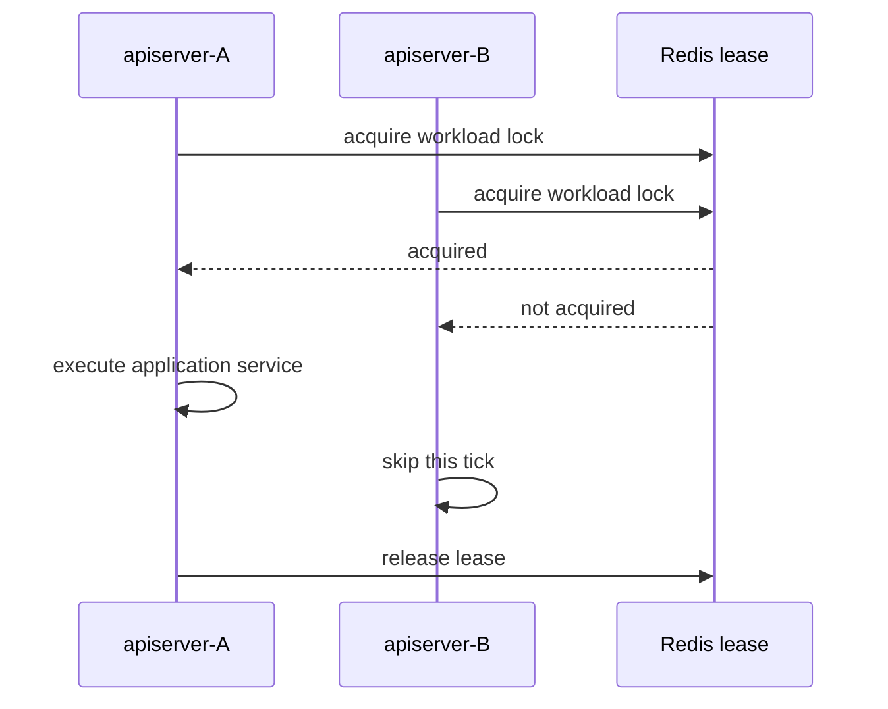

# 后台任务与调度

## 1. 结论

qs-server 的后台运行时不是一个单一 cron 模块，而是五类机制：可靠事件发布/消费、业务周期调度、一致性补偿、缓存与权限同步、worker 重试治理。

无论由定时器、事件还是启动预热触发，只要需要修改业务事实，都必须复用 application/domain 边界。后台任务不是绕开业务规则的管理后门。

## 2. 后台能力地图

| 进程 | 后台能力 | 主要目的 |
| --- | --- | --- |
| apiserver | SDK Outbox Relay、周期扫描与本地 Wake、projection consumer | 可靠发布领域事件并维护事件投影 |
| apiserver | Plan、Statistics、Evaluation/Interpretation recovery、Report Catalog audit、Mongo consistency audit、角色投影收敛 | 推进周期任务、T+1 统计、短周期租约恢复和只读一致性巡检 |
| apiserver | cache signal watcher、startup warmup | 缓存失效传播与热点预热 |
| apiserver | IAM authz version subscriber | 让授权快照缓存跟随权限版本变化 |
| collection | cache/report signal watcher | L1 失效、报告状态等待和前台通知 |
| worker | NSQ subscriber、retry hold replayer | 执行异步用例并治理延迟重试 |

## 3. apiserver 事件子系统

`internal/apiserver/process/standard_event_subsystem_m4.go` 是当前标准消息组合入口。Mongo 与 MySQL profile 各自在原业务事务中写入 `rm_outbox`；宿主提供数据库、Stager、生命周期和治理读模型，SDK 提供 Store、Relay 与 transport。

提交后的 `PostCommitWake` 只唤醒本进程 Relay，不 claim、不发布。周期扫描提供未唤醒或重启后的推进路径；claim、租约和结算都以持久 Outbox 为准。旧 Redis ready-index、immediate dispatcher 与 reconciler 已退出当前标准装配。

子系统启动前校验消费者绑定，启动启用的附加消费者与各 profile Relay；关闭时取消并等待 Relay/发布，再释放消费者和客户端。完整装配、失败状态和消费结算由 [Event 专题](../03-基础设施/event/README.md)维护。

## 4. 七个可配置 apiserver Scheduler Runner

这些 runner 由 `internal/apiserver/runtime/scheduler.Manager` 统一启动，共享由 runtime lifecycle 取消的 context。

当前 composition root 可装配 Plan、Statistics、Evaluation consistency audit、Evaluation lease recovery、Interpretation lease recovery、Report Catalog audit 和 Mongo consistency audit 共七个带 enable 配置的 runner。是否实际注册取决于有效配置和依赖。

另有依赖驱动的角色投影收敛器 `authz_role_projection_reconcile`，每 10 分钟在 leader lease 内处理有界批次，不属于上述 enable 配置清单。旧 AI prepared/Participant 解读恢复器已退役；新 AI 执行与恢复由 qs-ai 负责，QS 只桥接投递和结果。

### 4.1 PlanRunner

PlanRunner 周期调用 `SchedulePendingTasks`，按配置的 `org_ids` 扫描一个时间窗口：

- 打开已经到期的 Plan Task；
- 处理应过期的任务；
- 为患者在 Plan 周期内持续生成可填写任务。

它只保存/解析 assessment code 的现有 Plan 语义，每次任务使用当前最新发布版本。量表因子在稳定期极少变化，因此当前业务接受这一取舍；历史已完成答卷和报告仍保留当时版本。

### 4.2 StatisticsSyncRunner

StatisticsSyncRunner 在上海时间 00:30 执行唯一 `publish` Run：

- 按机构串行获取分布式锁；
- 在 repair window 内由四个 Collector 构建 Fact；
- 由四个 Daily 与两个 Global Projection 事务化重建结果；
- 提交后发布 Cache Generation、预热常用窗口；
- 使用 SyncRun 记录停点、失败和恢复结果。

repair window 允许任务中断或迟到数据在后续运行中收敛。Statistics 不再注册 Behavior Scanner、Pending Reconcile、Checkpoint 或 V1 三段同步。

### 4.3 EvaluationConsistencyAuditRunner

该 runner 调用 evaluation scheduler 的 `AuditBatch`，按 Assessment ID 水位分批读取 Assessment、Run、Outcome、Score Projection 和
committed Outbox 证据，检查跨存储终态是否漂移。Outcome 证据查询只读取身份与模型类型字段，不加载 `report_input_json`、`payload_json` 等大字段。

审计是只读的：漂移会形成分类指标和建议动作，不会自动把部分事实补写成成功。一个 leader lock 覆盖整轮扫描；每批有独立超时和间隔，水位不前进会令本轮失败。成功完成全量周期后记录扫描数、周期耗时、最终水位和最近成功时间，再等待下一轮。
dev/prod 当前完整周期为 24 小时，配置校验边界为 6～24 小时。

### 4.4 EvaluationLeaseRecoveryRunner 与 InterpretationLeaseRecoveryRunner

两条租约恢复链路不再与一致性审计共用调度周期：

- `EvaluationLeaseRecoveryRunner` 使用 Evaluation 专用过期租约索引查询和独立 leader lock；
- `InterpretationLeaseRecoveryRunner` 使用 Interpretation 自己的 recoverer 和独立 leader lock；
- 两者 dev/prod 当前均每 10 秒执行一次、每批最多 100 条，允许配置范围为 10～30 秒；
- 任一恢复链路失败只记录自身错误和指标，不会阻塞另一条恢复链路，也不会拖慢全量一致性审计。

短周期恢复解决“执行权已经过期但没有新事件重触发”的时效问题；低频审计解决跨存储事实漂移的发现问题，两者职责不同。

### 4.5 ReportCatalogAuditRunner

Report Catalog audit 分批读取 Artifact 与 `report_query_catalog`，发现 missing、dangling、association mismatch 和 wrong winner。
它有自己的 checkpoint、批量超时、24 小时完整周期和 leader lock。

审计与修复是两条能力：后台 runner 只推进 audit；repair plan 的生成、dry-run 和 apply 仍需要独立清单、状态复验与运维授权。不能因为 audit 发现漂移就由 scheduler 自动改写 Catalog。

### 4.6 MongoConsistencyAuditRunner

Mongo consistency audit 是跨 Survey、Interpretation、ModelCatalog 的有界只读巡检。这里的“只读”精确指 **不写 Mongo 业务集合**：
scanner port 只有 `UpperBound`、`OutboxUpperBound` 和 `ScanBatch`，没有 insert/update/delete/repair 方法。scheduler 仍会使用 Redis leader lease，并把运行进度写入 MySQL checkpoint；报告与重试核验还通过只读 OutcomeFact 绑定组织、测评和受试者。

七个阶段按固定顺序推进：

1. `answersheet_outbox`：带 durable acceptance 或已保存事件证据的 AnswerSheet，其提交事实、原引用和证据类别是否匹配；
2. `outbox_answersheet`：保留既有 phase 名称，反向核验标准 Mongo `rm_outbox` 中答卷提交、报告生成和解释重试三类事件是否绑定对应业务事实和同一标准引用；
3. `generation_run`：Generation 与 LatestRun 引用及状态是否一致；
4. `generated_terminal`：generated Generation 是否有匹配 Artifact、Run、OutcomeFact 和原生成事件证据；
5. `retry_outbox`：持久化 retry decision 或已保存重试证据是否匹配原重试事件；原业务调度时间与消息原时间核验，不把 transport 的可变 `next_attempt_at` 当作原计划时间；
6. `model_release`：published head、唯一 active snapshot、Questionnaire binding 是否一致；
7. `published_model_runtime`：DefinitionV2 hash、NormRef 与 runtime materialization 是否有效。

业务阶段进入时冻结数值 `upper_bound`，按 `domain_id` 分页。反向标准 Outbox 阶段冻结 `_id` 上界，按 SDK 原顺序 BSON 文档 `(producer, message_id, destination)` 使用 `_id_` 索引分页；游标保留确切 BSON 字节，不转换为 ObjectID 或数值聚合 ID。所有阶段受 `batch_size` 和 `batch_timeout` 约束。
MySQL 表 `mongo_consistency_audit_checkpoint` 的 schema v2 保存 cycle、phase、数值 cursor、`outbox_cursor`/`outbox_upper_bound` BSON 字节、working statistics、last completed cycle 和 next cycle time。加载 v1 会在原 revision CAS 下开始新周期，保留上一轮结论，不解释旧数值游标为标准消息身份；
每次保存都要求 `expected revision` 命中，否则返回 checkpoint CAS conflict，避免两个执行者覆盖进度。

正向事件证据分为 `standard_reference`、`retired_verified`、`unverifiable`，在统计的 `evidence_classes` 中分别计数。标准引用核验两层消息身份、metadata、确切 SDK 指纹与 typed 业务绑定；历史类别只复验已保存结论及业务绑定，旧正文删除后不能重做原消息校验。缺证据、未关闭责任、矛盾和无法恢复的重试身份仍产生 high finding，不能自动重发。scanner 不读取旧 `domain_event_outbox`；报告失败事件不纳入本批双向消息核验，既有 Generation/Run 失败一致性检查继续保留。

scheduler 使用 workload `mongo_consistency_audit` 的自动续租 leader lock。拿不到锁时本 tick 跳过；Redis lock manager 不可用时 runner 不启动，不会退化为所有 apiserver 实例并发扫描。
生产 `configs/apiserver.prod.yaml` 当前明确 `enable: false`；启用条件和 one-off 操作见[调度任务](../04-接口与运维/07-调度任务.md)。

## 5. 为什么每个 scheduler 都需要 leader lock

apiserver 可以运行多个实例。若每个实例同时执行同一周期任务，会产生重复扫描和写入竞争。需要互斥的 runner 通过 Redis lock lease 争夺 workload 对应的 leader lock：

```mermaid
sequenceDiagram
    participant A as apiserver-A
    participant B as apiserver-B
    participant R as Redis lease
    A->>R: acquire workload lock
    B->>R: acquire workload lock
    R-->>A: acquired
    R-->>B: not acquired
    A->>A: execute application service
    B->>B: skip this tick
    A->>R: release lease
```

关键边界：

- Redis 不可用时 runner 不启动或本轮失败关闭，不能让所有实例无锁执行；
- lock key 由统一 keyspace builder 构造；
- lease TTL 必须覆盖正常执行时间，并考虑续租能力；
- release 使用 lease token，不能误删其他实例重新获得的锁；
- 即使有 leader lock，application service 仍应支持幂等或重复扫描。

## 6. 时间与批处理语义

后台任务的配置通常包含：

- `enable`：是否注册；
- `initial_delay` / `run_at`：首次运行时机；
- `interval`：后续周期；
- `batch_limit` / `batch_size`：每轮工作上限；
- `lookback` / `repair_window_days`：补偿窗口；
- `lock_key` / `lock_ttl`：leader lease；
- `org_ids`：明确运行范围。

这些值以 `internal/apiserver/options` 和当前环境配置为准。默认值只服务本地可运行性，不是容量结论。

周期任务应避免简单使用“上次运行时间到现在”的脆弱窗口。更可靠的方法是：以业务状态/checkpoint 找 due 项，允许有限回看，批量推进，并让重复执行无害。

## 7. worker 的 retry hold replayer

当自动重试策略要求延迟或暂停 transport 重投时，worker 可把记录写入 MySQL hold store。启用 automatic retry 后，replayer 周期扫描到期 hold，通过 publisher 重新投递。

其正确性要求：

- hold 记录保留 event、attempt、原因和下次执行时间；
- 重新发布成功后再改变 hold 状态；
- 超过业务预算或 `manual_required` 时停止自动重放；
- 管理员强制重试需要确认和审计，不能直接改数据库状态冒充成功。

## 8. 缓存与权限同步任务

缓存 watcher、startup warmup 和 authz version subscriber 与业务 scheduler 不同：它们维护的是运行时派生状态。

- watcher 丢失一次 signal 后，TTL/版本/权威查询仍应恢复；
- warmup 失败不应写入伪造业务数据；
- authz sync 失败时不能无限信任旧授权；
- 这些任务应暴露运行状态、最后错误和处理延迟。

## 9. 可观测性

每个后台任务至少应能回答：

- 当前是否启用、在哪个实例运行；
- 上一次开始/结束时间和耗时；
- 扫描数、成功数、跳过数、失败数；
- 当前运行账本、处理水位或 repair window；
- 未获得锁还是执行失败；
- 积压量和最老未处理记录年龄；
- 是否已经进入自动重试暂停或人工处理。

只有“启动时打印一条 started 日志”不足以证明任务持续健康。

## 10. 新增后台任务的设计清单

1. 触发机制应选事件、定时扫描还是两者结合；
2. 明确权威事实与派生索引；
3. 定义幂等键、重复执行和部分失败语义；
4. 多实例下是否需要 leader lock，租约如何续期；
5. 定义批量、回看、checkpoint 和背压；
6. 定义可重试、manual_required 和人工补偿边界；
7. 接入进程 lifecycle，确保可以取消和等待；
8. 增加 metrics、状态查询和确定性并发测试。

## 11. 源码证据

- 事件子系统：`internal/apiserver/eventing/subsystem`；
- scheduler manager/runners：`internal/apiserver/runtime/scheduler`；
- scheduler 装配：`internal/apiserver/process/runtime_bootstrap.go`；
- Plan 用例：`internal/apiserver/application/plan`；
- Evaluation 一致性审计：`internal/apiserver/application/evaluation/scheduler`；
- Mongo consistency application：`internal/apiserver/application/mongoconsistency`；
- Mongo consistency scanner/checkpoint：`internal/apiserver/infra/mongo/mongoconsistency`、`internal/apiserver/infra/mysql/mongoconsistency`；
- Statistics：`internal/apiserver/application/statistics`；
- worker runtime：`internal/worker/process/runtime_bootstrap.go`；
- 事件与配置事实：`configs/events.yaml`、`configs/*server*.yaml`。
