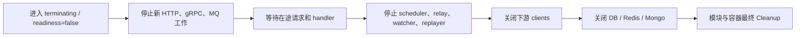
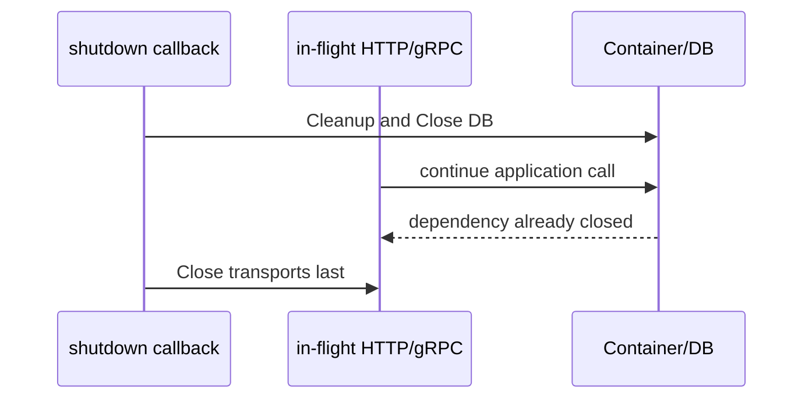

# 优雅关闭与资源释放

## 1. 结论

优雅关闭的目标不是“所有 Close 都调用过”，而是**不再接收新工作、让已经接受的工作得到明确结果，然后按依赖方向的逆序释放资源**。

qs-server 三个进程目前并不完全一致：

- collection-server 已先关闭 HTTP，再关闭 gRPC 和数据库依赖，符合可靠提交的排空需要；
- qs-worker 已先停止 subscriber/replayer，再关闭 gRPC 与存储，方向基本正确；
- qs-apiserver 当前先清理 runtime/container/database，最后才关闭 HTTP/gRPC，存在在途请求使用已关闭依赖的风险。

本文分别记录当前实现和目标顺序，不把建议写成已完成能力。

## 2. 什么叫“已经接受的工作”

不同入口的受理点不同：

| 入口 | 受理点 | 关闭时必须保证 |
| --- | --- | --- |
| collection 答卷提交 | apiserver 已提交 AnswerSheet + Outbox，并返回 durable result | 已返回 202 的答卷不能因进程关闭丢失 |
| apiserver REST/gRPC 写请求 | 业务事务提交并形成稳定响应 | 停止入口后等待在途 handler 完成或超时 |
| worker NSQ 消息 | subscriber 已把消息交给 handler | 完成并 ACK，或明确 NACK/hold，不静默丢弃 |
| scheduler tick | 已获得 leader lease 并开始应用用例 | context 取消后安全停止，重复执行仍幂等 |
| Outbox relay | 已取得待发布事件 | 成功标记发布，或保留为 due 供下次重试 |

进程收到请求不等于可靠受理。尤其 collection 不再使用内存 Queue 作为成功边界，因此只要 HTTP 在持久化前关闭，客户端就能得到明确失败并重试。

## 3. 推荐的通用关闭模型



在容器编排环境中，readiness 应先摘流，给负载均衡一定传播时间；随后 transport 才开始 drain。总关闭时间必须小于平台 termination grace period，并给最后日志/metrics flush 留出预算。

## 4. collection-server 当前顺序

`internal/collection-server/process/lifecycle.go` 当前执行：

1. `HTTP.Close()`；
2. 关闭 gRPC client manager；
3. 关闭数据库/Redis profiles；
4. 停止并关闭 IAM authz version subscriber；
5. 关闭 IAM module；
6. Cleanup Container。

代码明确说明先 drain in-flight reliable submissions，再关闭下游依赖。该顺序保护了：

```text
HTTP handler -> BFF application -> gRPC client -> apiserver
```

需要继续验证的是 HTTP Server 的 `Close()` 是否真正等待所有在途请求，以及等待上限是否与提交 accept timeout、gRPC timeout 和平台关闭预算协调。

## 5. qs-worker 当前顺序

`internal/worker/process/lifecycle.go` 当前执行：

1. 停止 retry hold replayer；
2. Stop/Close subscriber；
3. 关闭 publisher、dead-letter recorder、hold store；
4. 关闭 gRPC client manager；
5. 关闭数据库/Redis profiles；
6. 以 5 秒 timeout 关闭 metrics server；
7. Cleanup Container。

先停 subscriber 可以避免关闭 gRPC 后还有新消息进入 handler。replayer 先停也避免关闭 publisher 时继续产生投递。

仍需关注：

- subscriber `Stop/Close` 对在途 handler 是等待、取消还是立即返回；
- handler 被 context 取消后是否会正确 NACK/hold；
- 平台信号与进程内 `signal.Notify`、shutdown manager 是否只触发一次完整关闭；
- 如果 stop subscriber 失败，后续资源仍会继续释放，日志是否足以告警。

## 6. qs-apiserver 当前顺序与风险

`internal/apiserver/process/lifecycle.go` 的实际顺序是：

1. 执行 runtime lifecycle hook，当前主要取消 scheduler；
2. Container Cleanup；
3. 停止 IAM authz sync；
4. 关闭数据库 manager；
5. 关闭 HTTP；
6. 关闭 gRPC。

Container Cleanup 还会停止 resilience、事件子系统、缓存子系统、IAM 和业务模块。由于 transport 最后关闭，理论上存在以下竞态：



当前 lifecycle 测试冻结了这一实际顺序，所以它是“受测试保护的现状”，不是“已证明正确的设计”。维护文档时必须诚实标注为技术债。

## 7. apiserver 的目标调整方向

在不改变业务语义的前提下，建议重构为：

1. readiness=false，停止路由新流量；
2. 关闭 HTTP/gRPC listener，并等待在途请求；
3. 停止 scheduler，避免产生新业务工作；
4. 停止事件 consumers、relay、reconciler、cache watcher、authz sync；
5. Cleanup 业务模块和 resilience；
6. 最后关闭 MongoDB、MySQL、Redis、MQ 等底层资源。

第三、四步的相对顺序要结合事件子系统 drain 语义设计：scheduler 停止后，已提交事务产生的 Outbox 可以由 relay 尽力发布；即使退出前未全部发布，Outbox 记录也必须保留供下一实例恢复。

重构前需要补充确定性的生命周期测试，模拟“关闭发生时 handler 正在使用数据库/发布 Outbox”，而不是仅检查函数调用数组。

## 8. 错误处理原则

三个进程的 lifecycle 都倾向于记录某个 hook 的错误后继续执行后续 hook。这避免单个 Close 失败阻止其他资源释放，但也带来要求：

- 每个 hook 名称和错误必须可观测；
- 关闭完成日志不能掩盖中间失败；
- 进程退出码/终止指标应能区分 clean shutdown 与 partial failure；
- Close 应尽量幂等，避免多信号或重复 callback 导致 panic；
- 不应在关闭路径使用无界 `context.Background()` 等待外部依赖。

## 9. 时间预算

关闭预算至少由以下部分组成：

```text
摘流传播时间
+ 最长 HTTP/gRPC 请求 drain 时间
+ 最长 worker handler/consumer close 时间
+ 后台 runtime 停止时间
+ client、数据库和 metrics close 时间
+ 安全余量
```

各组件的 timeout 不能孤立设置。例如 collection submit accept timeout 如果接近整个 termination grace period，HTTP drain 后就没有时间关闭 gRPC 和存储。

对于无法在预算内完成的耗时任务，应依靠可恢复状态、Outbox、NACK/hold 或 checkpoint 交给下一实例继续，而不是无限延长进程退出。

## 10. 关闭验证场景

### 10.1 collection

- 提交已进入 handler、尚未收到 apiserver durable result 时触发关闭；
- 验证不会先关闭 gRPC manager；
- durable commit 完成则返回 202，否则客户端得到明确失败；
- 新请求不再进入提交链路。

### 10.2 worker

- handler 正在调用 apiserver 时触发关闭；
- 验证 subscriber 不再取得新消息；
- 在途消息得到 ACK/NACK/hold 之一；
- hold replayer 不会在 publisher 关闭后继续发布。

### 10.3 apiserver

- HTTP/gRPC 请求正在执行数据库事务时触发关闭；
- scheduler 正在持有 leader lease；
- relay 正在发布 Outbox；
- 验证 transport drain、事务结果、Outbox 保留和依赖关闭不存在竞态。

测试应使用 channel/barrier 控制确定性交错，不使用 `sleep` 猜测并发时机。

## 11. 运维检查项

- readiness 是否在进程真正退出前先变为失败；
- load balancer 是否停止发送新请求；
- 是否记录 signal、开始时间、各 hook 耗时和最终结果；
- 关闭后是否仍有 goroutine、连接或 listener 泄漏；
- 重启后 Outbox、retry hold、pending task 是否能继续处理；
- 发布滚动升级时是否出现答卷 202 后丢失或重复报告；
- termination grace period 是否覆盖 P99 在途执行与安全余量。

## 12. 源码证据

- apiserver：`internal/apiserver/process/lifecycle.go`、`internal/apiserver/container/lifecycle.go`；
- collection：`internal/collection-server/process/lifecycle.go`；
- worker：`internal/worker/process/lifecycle.go`；
- 事件子系统：`internal/apiserver/eventing/subsystem/subsystem.go`；
- scheduler lifecycle：`internal/apiserver/process/runtime.go`；
- shutdown 基础设施：component-base `shutdown` 与 `processruntime`。
